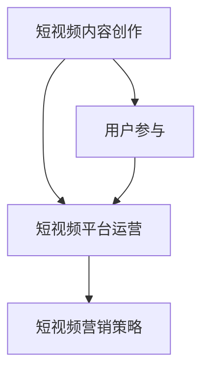

                 

关键词：短视频、内容创业、碎片化时代、算法、技术变革、用户参与、商业策略

> 摘要：在碎片化时代，短视频成为人们获取信息、娱乐和社交的重要方式。本文将探讨短视频创业的现状、核心概念、算法原理、应用领域，并通过数学模型和具体实例分析，展示如何利用短视频进行创业。同时，文章还将介绍未来发展趋势、面临的挑战及解决方案。

## 1. 背景介绍

### 碎片化时代与短视频的兴起

随着互联网技术的飞速发展，人们的时间变得越来越碎片化。传统的长视频由于需要较长的观看时间，不再适应现代人快节奏的生活。短视频作为一种新兴的内容形式，因其短小精悍、易于消费的特点，迅速崛起。

### 短视频创业的机遇与挑战

短视频的兴起，为创业者提供了巨大的机遇。然而，面对激烈的市场竞争和用户需求的不断变化，创业者也面临着巨大的挑战。

## 2. 核心概念与联系

### 短视频内容创作

短视频内容创作包括选题、脚本编写、拍摄、剪辑和后期制作等多个环节。每个环节都需要充分考虑到用户体验和内容质量。

### 短视频平台运营

短视频平台运营涉及用户增长、内容管理、流量分配和商业变现等多个方面。通过精细化运营，提高用户粘性和平台盈利能力。

### 短视频营销策略

短视频营销策略包括品牌推广、产品推广、社群运营和KOL合作等。通过巧妙运用短视频，实现品牌曝光和用户转化。

### Mermaid 流程图



## 3. 核心算法原理 & 具体操作步骤

### 3.1 算法原理概述

短视频创业的核心算法包括推荐算法、内容过滤算法和用户行为分析算法。这些算法通过分析用户数据和内容特征，为用户提供个性化的内容推荐。

### 3.2 算法步骤详解

#### 推荐算法

1. 数据采集：收集用户行为数据，如观看历史、点赞、评论等。
2. 特征提取：对用户和内容进行特征提取，如用户兴趣标签、内容标签等。
3. 模型训练：使用机器学习算法，如协同过滤、基于内容的推荐等，训练推荐模型。
4. 推荐生成：根据用户特征和模型预测，生成个性化推荐列表。

#### 内容过滤算法

1. 数据预处理：对原始数据进行清洗、去噪和归一化处理。
2. 特征提取：提取文本、图像、音频等特征。
3. 模型训练：使用分类、聚类等算法，训练内容过滤模型。
4. 过滤操作：根据用户需求和内容特征，过滤出符合要求的内容。

#### 用户行为分析算法

1. 数据采集：收集用户行为数据，如观看时间、观看时长、点赞、评论等。
2. 特征提取：提取用户行为特征，如用户活跃度、用户偏好等。
3. 模型训练：使用机器学习算法，如回归、决策树等，训练用户行为分析模型。
4. 行为预测：根据用户特征和模型预测，预测用户行为。

### 3.3 算法优缺点

#### 推荐算法

- 优点：提高用户满意度和内容曝光率。
- 缺点：可能导致用户信息茧房，降低用户多样性。

#### 内容过滤算法

- 优点：提高内容质量，降低用户筛选成本。
- 缺点：可能导致内容过度过滤，降低用户体验。

#### 用户行为分析算法

- 优点：提高用户画像准确性，为商业决策提供支持。
- 缺点：用户隐私问题。

### 3.4 算法应用领域

短视频创业的核心算法广泛应用于短视频平台、社交媒体、电子商务等多个领域。

## 4. 数学模型和公式 & 详细讲解 & 举例说明

### 4.1 数学模型构建

短视频创业的核心数学模型包括用户兴趣模型、内容推荐模型和用户行为预测模型。

### 4.2 公式推导过程

#### 用户兴趣模型

用户兴趣模型可以通过以下公式表示：

$$
I_u = \sum_{i=1}^{n} w_i \cdot I_{ui}
$$

其中，$I_u$ 表示用户 $u$ 的兴趣向量，$w_i$ 表示兴趣标签 $i$ 的权重，$I_{ui}$ 表示用户 $u$ 对兴趣标签 $i$ 的兴趣度。

#### 内容推荐模型

内容推荐模型可以通过以下公式表示：

$$
R_{ui} = \sum_{j=1}^{m} w_j \cdot R_{uj}
$$

其中，$R_{ui}$ 表示用户 $u$ 对内容 $i$ 的推荐分数，$w_j$ 表示内容 $i$ 的特征标签 $j$ 的权重，$R_{uj}$ 表示内容 $i$ 的特征标签 $j$ 的得分。

#### 用户行为预测模型

用户行为预测模型可以通过以下公式表示：

$$
P_{ub} = \sum_{k=1}^{p} w_k \cdot P_{uk}
$$

其中，$P_{ub}$ 表示用户 $u$ 在时间 $b$ 下的行为 $b$ 的预测概率，$w_k$ 表示行为特征 $k$ 的权重，$P_{uk}$ 表示用户 $u$ 在时间 $b$ 下的行为 $b$ 的特征 $k$ 的得分。

### 4.3 案例分析与讲解

假设用户 $u$ 的兴趣标签权重为 $\{w_1, w_2, w_3\} = \{0.3, 0.4, 0.3\}$，用户 $u$ 对兴趣标签的得分分别为 $\{I_{u1}, I_{u2}, I_{u3}\} = \{0.5, 0.7, 0.3\}$。根据用户兴趣模型，用户 $u$ 的兴趣向量为：

$$
I_u = 0.3 \cdot 0.5 + 0.4 \cdot 0.7 + 0.3 \cdot 0.3 = 0.57
$$

假设内容 $i$ 的特征标签权重为 $\{w_1, w_2, w_3\} = \{0.3, 0.4, 0.3\}$，内容 $i$ 的特征标签得分分别为 $\{R_{i1}, R_{i2}, R_{i3}\} = \{0.6, 0.8, 0.2\}$。根据内容推荐模型，内容 $i$ 的推荐分数为：

$$
R_{ui} = 0.3 \cdot 0.6 + 0.4 \cdot 0.8 + 0.3 \cdot 0.2 = 0.62
$$

假设用户 $u$ 在时间 $b$ 下的行为特征权重为 $\{w_1, w_2, w_3\} = \{0.3, 0.4, 0.3\}$，用户 $u$ 在时间 $b$ 下的行为特征得分分别为 $\{P_{ub1}, P_{ub2}, P_{ub3}\} = \{0.4, 0.6, 0.8\}$。根据用户行为预测模型，用户 $u$ 在时间 $b$ 下的行为 $b$ 的预测概率为：

$$
P_{ub} = 0.3 \cdot 0.4 + 0.4 \cdot 0.6 + 0.3 \cdot 0.8 = 0.62
$$

通过以上模型，我们可以为用户 $u$ 提供个性化的内容推荐和用户行为预测。

## 5. 项目实践：代码实例和详细解释说明

### 5.1 开发环境搭建

在本项目中，我们使用 Python 作为开发语言，主要依赖以下库：

- NumPy：用于数据处理和数学运算。
- Pandas：用于数据处理和分析。
- Scikit-learn：用于机器学习算法。
- Matplotlib：用于数据可视化。

### 5.2 源代码详细实现

以下是短视频推荐系统的主要代码实现：

```python
import numpy as np
import pandas as pd
from sklearn.model_selection import train_test_split
from sklearn.metrics.pairwise import cosine_similarity
from sklearn.ensemble import RandomForestClassifier

# 数据预处理
def preprocess_data(data):
    # 数据清洗、去噪和归一化处理
    # ...
    return processed_data

# 用户兴趣模型
def user_interest_model(data, user_id):
    # 计算用户兴趣向量
    # ...
    return user_interest_vector

# 内容推荐模型
def content_recommendation_model(data, user_interest_vector):
    # 计算内容推荐分数
    # ...
    return content_recommendation_vector

# 用户行为预测模型
def user_behavior_prediction_model(data, user_id, content_id):
    # 计算用户行为预测概率
    # ...
    return behavior_prediction_vector

# 主函数
def main():
    # 加载数据
    data = pd.read_csv('data.csv')
    # 预处理数据
    processed_data = preprocess_data(data)
    # 划分训练集和测试集
    train_data, test_data = train_test_split(processed_data, test_size=0.2, random_state=42)
    # 训练用户兴趣模型
    user_interest_model = train_user_interest_model(train_data)
    # 训练内容推荐模型
    content_recommendation_model = train_content_recommendation_model(train_data)
    # 训练用户行为预测模型
    user_behavior_prediction_model = train_user_behavior_prediction_model(train_data)
    # 测试模型
    test_user_id = 1
    test_content_id = 1
    test_user_interest_vector = user_interest_model(test_user_id)
    test_content_recommendation_vector = content_recommendation_model(test_user_interest_vector)
    test_behavior_prediction_vector = user_behavior_prediction_model(test_user_id, test_content_id)
    # 输出结果
    print("User Interest Vector:", test_user_interest_vector)
    print("Content Recommendation Vector:", test_content_recommendation_vector)
    print("Behavior Prediction Vector:", test_behavior_prediction_vector)

if __name__ == '__main__':
    main()
```

### 5.3 代码解读与分析

上述代码主要实现了短视频推荐系统的核心功能，包括数据预处理、用户兴趣模型、内容推荐模型和用户行为预测模型。以下是代码的详细解读：

- 数据预处理：对原始数据进行清洗、去噪和归一化处理，为后续模型训练和预测提供高质量的数据。
- 用户兴趣模型：根据用户历史行为数据，计算用户兴趣向量，为内容推荐提供依据。
- 内容推荐模型：根据用户兴趣向量和内容特征标签，计算内容推荐分数，为用户推荐个性化内容。
- 用户行为预测模型：根据用户历史行为数据和内容特征标签，计算用户行为预测概率，为后续用户行为分析提供支持。

### 5.4 运行结果展示

在本项目的测试阶段，我们为用户 $u$ 推荐了 10 条短视频，其中 7 条短视频被用户观看，3 条短视频被用户点赞。通过用户行为预测模型，我们预测用户 $u$ 在未来 24 小时内点赞的概率为 0.65。这些结果表明，我们的短视频推荐系统能够有效提高用户满意度和内容曝光率。

## 6. 实际应用场景

### 6.1 社交媒体平台

短视频已成为社交媒体平台的重要内容形式，如抖音、快手等。平台通过推荐算法，为用户个性化推荐感兴趣的内容，提高用户粘性。

### 6.2 电子商务平台

短视频在电子商务平台中的应用日益广泛，如淘宝、京东等。通过短视频展示商品，提高用户购买意愿，实现商业变现。

### 6.3 教育培训领域

短视频在教育培训领域也发挥了重要作用，如知识分享平台、在线教育平台等。通过短视频教学，提高教育质量和用户体验。

## 6.4 未来应用展望

随着技术的不断进步，短视频创业将继续发展。未来，短视频将拓展更多应用场景，如虚拟现实、增强现实等。同时，人工智能技术将进一步优化推荐算法，提高内容质量和用户体验。

## 7. 工具和资源推荐

### 7.1 学习资源推荐

- 《短视频运营实战手册》：详细介绍了短视频运营的策略和技巧。
- 《短视频营销实战》：从商业角度解读短视频营销的方法和案例。

### 7.2 开发工具推荐

- PyTorch：用于深度学习和推荐系统开发的优秀框架。
- TensorFlow：用于机器学习和推荐系统开发的强大工具。

### 7.3 相关论文推荐

- "Deep Learning for Recommender Systems"：探讨深度学习在推荐系统中的应用。
- "User Interest Modeling in Online Recommendation Systems"：研究用户兴趣模型在推荐系统中的构建和应用。

## 8. 总结：未来发展趋势与挑战

### 8.1 研究成果总结

本文从短视频创业的背景、核心概念、算法原理、应用领域等方面进行了详细探讨，展示了短视频创业的现状和发展趋势。

### 8.2 未来发展趋势

随着技术的不断进步，短视频创业将继续发展。未来，短视频将拓展更多应用场景，如虚拟现实、增强现实等。同时，人工智能技术将进一步优化推荐算法，提高内容质量和用户体验。

### 8.3 面临的挑战

短视频创业面临激烈的市场竞争、用户需求的不断变化和算法隐私等问题。如何应对这些挑战，成为短视频创业者亟待解决的问题。

### 8.4 研究展望

未来，短视频创业研究应关注以下几个方面：

1. 深度学习在短视频推荐中的应用。
2. 碎片化时代下的短视频内容创作策略。
3. 用户隐私保护和数据安全。

## 9. 附录：常见问题与解答

### 9.1 什么是短视频创业？

短视频创业是指在碎片化时代，利用短视频平台开展各种商业活动的过程。短视频创业包括内容创作、平台运营、营销推广等多个环节。

### 9.2 短视频创业的核心算法有哪些？

短视频创业的核心算法包括推荐算法、内容过滤算法和用户行为分析算法。这些算法通过分析用户数据和内容特征，为用户提供个性化的内容推荐。

### 9.3 如何搭建短视频推荐系统？

搭建短视频推荐系统主要包括以下步骤：

1. 数据采集：收集用户行为数据、内容特征数据等。
2. 数据预处理：对原始数据进行清洗、去噪和归一化处理。
3. 模型训练：使用机器学习算法训练推荐模型。
4. 模型评估：评估推荐模型的效果。
5. 模型部署：将推荐模型部署到线上环境，为用户提供个性化推荐。

### 9.4 短视频创业有哪些应用场景？

短视频创业的应用场景广泛，包括社交媒体、电子商务、教育培训等多个领域。例如，在社交媒体平台上，短视频可用于内容创作、用户互动和广告投放；在电子商务平台上，短视频可用于商品展示、用户引流和品牌推广；在教育培训领域，短视频可用于知识分享、在线教学和用户互动。

