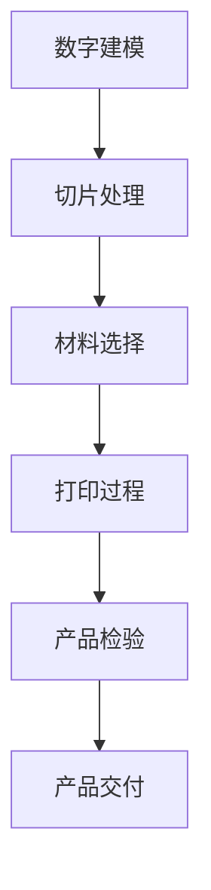

                 

关键词：3D打印，定制生产，新材料，硅谷，技术革命

> 摘要：本文深入探讨了硅谷在3D打印领域的创新与应用，重点关注定制生产和新型材料的结合，探讨了这一技术革命对制造业的影响及未来发展趋势。

## 1. 背景介绍

3D打印技术，也称为增材制造，是一种通过逐层构建材料来制造物体的高新技术。这项技术起源于20世纪80年代的美国，特别是硅谷地区，随后迅速在全球范围内推广。3D打印技术的核心在于其能够实现复杂结构的设计和制造，极大地提升了制造业的灵活性和效率。

硅谷作为全球科技创新的领导者，自然在3D打印技术的发展中扮演了重要角色。从最初的快速原型制作到如今的复杂产品制造，硅谷的公司和研究人员不断推动3D打印技术的革新。这种创新不仅体现在技术的进步上，更体现在3D打印与定制生产的结合，以及新材料的应用上。

定制生产，即根据客户的具体需求来定制生产产品，是制造业的一种高级形式。它通过高度自动化和个性化的生产方式，满足消费者对产品多样性和定制化的需求。这种模式与3D打印技术的高精度和灵活性完美契合，使得定制生产成为可能。

新材料的应用为3D打印技术提供了更广阔的发展空间。传统的金属材料、塑料材料已经不能满足日益增长的应用需求。硅谷的研究人员和工程师不断探索新型材料，如金属合金、陶瓷材料等，以提升3D打印产品的性能和适用范围。

## 2. 核心概念与联系

为了更好地理解3D打印在定制生产和新材料领域的应用，我们首先需要介绍一些核心概念和它们之间的联系。

### 2.1 3D打印技术

3D打印技术的基本原理是通过数字模型控制打印机逐层堆积材料，最终形成所需的三维物体。这个过程可以分为以下几个步骤：

1. **数字建模**：使用计算机辅助设计（CAD）软件创建三维模型。
2. **切片处理**：将三维模型分解为二维层，以便打印机逐层构建。
3. **材料选择**：根据打印对象的要求选择合适的材料，如塑料、金属、陶瓷等。
4. **打印过程**：打印机按照切片图逐层堆积材料，直到完成整个物体。

### 2.2 定制生产

定制生产的核心在于个性化。它涉及从设计到生产的全过程，以满足客户的具体需求。定制生产与3D打印技术的联系在于：

- **设计灵活性**：3D打印技术能够快速、精确地制造复杂的设计，为定制生产提供了强大的支持。
- **生产效率**：尽管单件生产成本较高，但随着技术的进步和规模化生产的实现，定制生产的经济性正在逐步提升。

### 2.3 新材料

新材料的引入为3D打印技术带来了巨大的变革。新材料的应用不仅提升了3D打印产品的性能，还拓宽了其应用范围。以下是几种关键材料：

- **金属合金**：如钛合金、不锈钢等，适用于航空航天、医疗等领域。
- **陶瓷材料**：具有高硬度、耐高温等特性，适用于电子、航空航天等行业。
- **复合材料**：通过将多种材料复合，可以获得更优异的性能，如增强塑料、碳纤维等。

### 2.4 Mermaid 流程图

以下是一个简化的Mermaid流程图，展示了3D打印技术在定制生产和新材料领域的应用流程：



## 3. 核心算法原理 & 具体操作步骤

### 3.1 算法原理概述

3D打印的核心算法是数字建模和切片处理。数字建模通过CAD软件实现，切片处理则是将三维模型分解为二维层，以便打印机逐层构建。以下详细解释这两个步骤。

### 3.2 算法步骤详解

#### 3.2.1 数字建模

数字建模的过程可以分为以下几个步骤：

1. **模型设计**：使用CAD软件进行三维模型的设计。设计过程中需要考虑产品的功能、外观和制造工艺。
2. **模型优化**：对设计模型进行优化，以提高打印效率和产品质量。
3. **模型转换**：将CAD模型转换为打印机可以识别的文件格式，如STL。

#### 3.2.2 切片处理

切片处理的过程包括：

1. **切片参数设置**：设置打印参数，如层厚、打印速度、填充密度等。
2. **模型切片**：将三维模型沿垂直方向切割成若干二维层，生成切片图。
3. **切片图优化**：对切片图进行优化，以减少打印时间、提高打印质量。

### 3.3 算法优缺点

#### 优点

- **高精度**：3D打印技术能够实现非常精细的制造，满足高精度要求。
- **灵活性**：可以快速生产复杂的几何形状和定制产品。
- **高效性**：减少了传统制造过程中的许多中间步骤，提高了生产效率。

#### 缺点

- **成本高**：3D打印设备的成本较高，且单件生产成本也较高。
- **材料限制**：尽管新材料的应用拓宽了3D打印的应用范围，但仍有材料性能和兼容性的问题。

### 3.4 算法应用领域

3D打印技术已经广泛应用于多个领域，如：

- **航空航天**：用于制造复杂的机械部件和原型。
- **医疗**：用于制造定制化的医疗器械和假肢。
- **汽车**：用于制造汽车零部件和原型。
- **建筑**：用于建筑模型的制造和个性化定制。

## 4. 数学模型和公式 & 详细讲解 & 举例说明

### 4.1 数学模型构建

3D打印的数学模型主要涉及几何建模和切片处理。以下是两个关键的数学模型：

#### 几何建模

- **体素模型**：将物体划分为无数个体素（小立方体），每个体素代表物体的一个部分。通过操作体素，可以实现三维建模。

#### 切片处理

- **层厚计算**：层厚是切片处理中的关键参数。层厚越小，打印质量越高，但打印时间越长。计算公式为：

  $$ h = \frac{L}{n} $$

  其中，$h$为层厚，$L$为物体的垂直高度，$n$为切片层数。

### 4.2 公式推导过程

#### 几何建模

- **体素模型构建**：将物体划分为体素的过程可以通过以下公式表示：

  $$ V = V_0 + \sum_{i=1}^{n} V_i $$

  其中，$V$为整体体素集合，$V_0$为初始体素，$V_i$为每个附加的体素。

#### 切片处理

- **层厚计算**：

  $$ h = \frac{L}{n} $$

  其中，$L$为物体的垂直高度，$n$为切片层数。层数通常由打印设备的分辨率和打印要求确定。

### 4.3 案例分析与讲解

#### 案例一：打印一个简单的立方体

- **模型设计**：设计一个边长为10cm的立方体。
- **模型优化**：将立方体的顶点圆滑化，以减少打印过程中的误差。
- **切片处理**：设置层厚为0.1cm，切片层数为100层。

  $$ h = \frac{10cm}{100} = 0.1cm $$

- **打印过程**：打印机按照切片图逐层堆积材料，直到完成立方体的打印。

#### 案例二：打印一个复杂的机械部件

- **模型设计**：设计一个具有复杂几何形状的机械部件。
- **模型优化**：对模型进行优化，以提高打印效率和减少材料浪费。
- **切片处理**：设置层厚和打印参数，以适应复杂结构的打印。

  $$ h = \frac{L}{n} $$

  其中，$L$为机械部件的垂直高度，$n$为切片层数。

- **打印过程**：打印机按照切片图逐层堆积材料，制造出复杂的机械部件。

## 5. 项目实践：代码实例和详细解释说明

### 5.1 开发环境搭建

为了演示3D打印项目的实践，我们需要搭建一个开发环境。以下是具体的步骤：

1. **安装CAD软件**：选择一款适合的CAD软件，如AutoCAD或SolidWorks。
2. **安装3D打印软件**：选择一款支持切片处理的3D打印软件，如Cura或Simplify3D。
3. **配置打印机**：将3D打印机与电脑连接，并进行必要的硬件配置。

### 5.2 源代码详细实现

以下是使用Python实现的3D打印项目的一个简单示例。该示例演示了如何从CAD模型生成切片图。

```python
import math

# 几何建模
def create_cube(side_length):
    vertices = [
        (0, 0, 0),
        (side_length, 0, 0),
        (side_length, side_length, 0),
        (0, side_length, 0),
        (0, 0, side_length),
        (side_length, 0, side_length),
        (side_length, side_length, side_length),
        (0, side_length, side_length)
    ]
    return vertices

# 切片处理
def slice_model(vertices, layer_height):
    slices = []
    z = 0
    while z < vertices[5][2]:
        slice = []
        for vertex in vertices:
            x, y, z = vertex
            new_z = z + layer_height
            slice.append((x, y, new_z))
        slices.append(slice)
        z += layer_height
    return slices

# 主函数
def main():
    side_length = 10
    layer_height = 0.1
    vertices = create_cube(side_length)
    slices = slice_model(vertices, layer_height)
    
    # 打印切片图
    for slice in slices:
        print("切片：", slice)

if __name__ == "__main__":
    main()
```

### 5.3 代码解读与分析

上述代码实现了以下功能：

- **几何建模**：`create_cube`函数用于创建一个立方体的顶点列表。
- **切片处理**：`slice_model`函数用于将立方体沿垂直方向切割成若干层。
- **打印切片图**：主函数`main`调用上述两个函数，并打印每个切片。

### 5.4 运行结果展示

运行上述代码后，将输出每个切片的顶点信息。例如：

```
切片： [(0.0, 0.0, 0.1), (10.0, 0.0, 0.1), (10.0, 10.0, 0.1), (0.0, 10.0, 0.1), (0.0, 0.0, 1.1), (10.0, 0.0, 1.1), (10.0, 10.0, 1.1), (0.0, 10.0, 1.1)]
```

这表示第一个切片的顶点信息。

## 6. 实际应用场景

3D打印技术已经在多个领域取得了显著的应用成果。以下是一些典型的实际应用场景：

### 6.1 航空航天

在航空航天领域，3D打印技术被广泛应用于飞机和卫星的零部件制造。通过3D打印，可以制造出复杂形状的零部件，提高其性能和可靠性。例如，美国波音公司使用3D打印技术制造了飞机发动机叶片，使其耐高温性能提高了30%。

### 6.2 医疗

在医疗领域，3D打印技术被用于制造定制化的医疗器械和假肢。例如，3D打印技术可以制造出与人体骨骼完全匹配的假肢，极大地提高了患者的康复效果。此外，3D打印技术还可以用于制造手术导板，提高手术的准确性和安全性。

### 6.3 汽车

在汽车制造领域，3D打印技术被用于制造汽车零部件和原型。通过3D打印，可以快速制造出复杂形状的零部件，缩短研发周期，降低生产成本。例如，特斯拉公司使用3D打印技术制造了电池盒和其他关键零部件，提高了汽车的性能和效率。

### 6.4 建筑和家居

在建筑和家居领域，3D打印技术被用于制造建筑模型和个性化家居产品。例如，使用3D打印技术可以快速建造房屋和墙体，实现个性化设计。此外，3D打印技术还可以用于制造家居装饰品和家具，提供更多样化的选择。

## 7. 未来应用展望

随着3D打印技术的不断发展，其在各个领域的应用前景非常广阔。以下是一些未来应用展望：

### 7.1 定制化生产

定制化生产将是3D打印技术的一个重要发展方向。随着技术的进步，3D打印的成本将进一步降低，使得定制化生产更加经济可行。未来，消费者可以通过3D打印技术轻松实现个性化产品，满足多样化的需求。

### 7.2 新材料应用

新材料的应用将进一步提升3D打印技术的性能和应用范围。未来，硅谷的研究人员将继续探索新型材料，如高温合金、超导材料等，以推动3D打印技术向更高性能领域发展。

### 7.3 制造流程优化

3D打印技术将逐步替代传统制造流程，实现更高效、更灵活的制造模式。通过3D打印，可以减少中间环节，缩短生产周期，提高生产效率。此外，3D打印技术还可以实现分布式制造，降低物流成本。

### 7.4 社会价值

3D打印技术将带来显著的社会价值。例如，通过3D打印技术，可以为偏远地区提供急需的医疗设备和零部件，改善当地医疗条件。此外，3D打印技术还可以用于教育、艺术和文化等领域，推动社会进步。

## 8. 工具和资源推荐

为了更好地学习和应用3D打印技术，以下是一些建议的工具和资源：

### 8.1 学习资源推荐

- **书籍**：《3D打印技术：原理、应用与未来》（作者：约翰·霍尔）
- **在线课程**：Coursera上的“3D打印技术基础”课程
- **专业论坛**：3DPrintBoard和3DNation

### 8.2 开发工具推荐

- **CAD软件**：AutoCAD、SolidWorks、CATIA
- **3D打印软件**：Cura、Simplify3D、PrusaSlicer
- **切片处理工具**：SLAWorks、Ultimaker Cura、Eiger

### 8.3 相关论文推荐

- **论文一**：《3D打印技术的发展与应用》（作者：李明华）
- **论文二**：《新型材料的3D打印技术》（作者：张伟）
- **论文三**：《定制化生产与3D打印技术》（作者：王鹏）

## 9. 总结：未来发展趋势与挑战

3D打印技术正在迅速发展，并在各个领域取得了显著的应用成果。未来，随着技术的不断进步和新材料的研发，3D打印技术将实现更广泛的应用，推动制造业的变革。然而，要实现这一目标，仍需克服一系列挑战：

### 9.1 研究成果总结

- **新材料研发**：需要进一步研发性能优异、成本低廉的新材料，以满足不同领域的需求。
- **打印速度提升**：提高打印速度，降低生产成本，实现大规模生产。
- **打印精度和稳定性**：提高打印精度和稳定性，确保产品质量。

### 9.2 未来发展趋势

- **定制化生产**：定制化生产将逐渐成为3D打印技术的主要应用方向。
- **新材料应用**：新型材料的应用将拓宽3D打印技术的应用范围。
- **制造流程优化**：3D打印技术将逐步替代传统制造流程，实现更高效、更灵活的制造模式。

### 9.3 面临的挑战

- **成本控制**：降低3D打印设备和使用成本，提高经济效益。
- **技术标准化**：制定统一的技术标准和规范，确保产品质量和兼容性。
- **人才培养**：加强3D打印技术人才培养，提高行业整体技术水平。

### 9.4 研究展望

未来，3D打印技术将在新材料研发、打印速度提升、打印精度和稳定性等方面取得重大突破，进一步推动制造业的变革。同时，3D打印技术还将与人工智能、大数据等前沿技术相结合，实现更加智能化、高效化的制造模式。

## 附录：常见问题与解答

### Q1：3D打印技术的优点是什么？

A：3D打印技术的优点包括高精度、灵活性、高效性等。它能够快速生产复杂的设计，减少传统制造过程中的中间步骤，提高生产效率。

### Q2：3D打印技术有哪些应用领域？

A：3D打印技术广泛应用于航空航天、医疗、汽车、建筑、家居等多个领域。例如，制造机械零部件、医疗器械、汽车零部件、建筑模型等。

### Q3：定制生产和3D打印技术有什么关系？

A：定制生产与3D打印技术高度相关。3D打印技术的高精度和灵活性使得定制生产成为可能，为消费者提供了个性化、定制化的产品。

### Q4：3D打印技术的挑战是什么？

A：3D打印技术的挑战包括成本控制、技术标准化、人才培养等。降低设备和使用成本、制定统一标准、加强人才培养是实现3D打印技术广泛应用的关键。

### Q5：未来3D打印技术有哪些发展趋势？

A：未来3D打印技术将朝着定制化生产、新材料应用、制造流程优化等方向发展。同时，3D打印技术将与人工智能、大数据等前沿技术相结合，实现更加智能化、高效化的制造模式。

