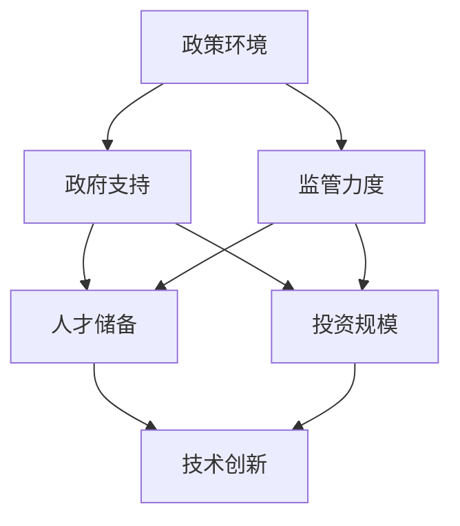

                 

关键词：人工智能创业环境，硅谷，中国，政策，人才，投资，技术创新

> 摘要：本文旨在探讨硅谷与中国在人工智能创业环境方面的差异，从政策、人才、投资、技术创新等多个维度进行对比分析，以期为国内外AI创业者提供参考。

## 1. 背景介绍

人工智能（AI）作为当今科技发展的核心驱动力，在全球范围内引起了广泛关注。硅谷作为全球科技创新的圣地，其AI创业环境被誉为全球最佳。与之相比，中国的人工智能产业发展也呈现出蓬勃发展的态势，政府的大力支持和市场的快速成长使得中国成为AI创业的重要战场。本文将通过对硅谷与中国的AI创业环境进行对比分析，为两国AI产业的发展提供启示。

## 2. 核心概念与联系

为了更好地理解两国AI创业环境的差异，我们需要从以下几个核心概念入手：

- **政策环境**：政府对于AI产业的支持和监管力度。
- **人才储备**：AI领域的技术人才数量和质量。
- **投资规模**：资本市场的投入和支持力度。
- **技术创新**：科研机构和企业的技术创新能力。

下面是核心概念原理和架构的 Mermaid 流程图：



## 3. 核心算法原理 & 具体操作步骤

### 3.1 算法原理概述

在AI创业环境中，政策环境、人才储备、投资规模和技术创新是四个核心因素，它们相互作用，共同影响AI创业的成败。

### 3.2 算法步骤详解

1. **政策环境**：通过对比两国政府的政策，分析其对AI创业的扶持力度和监管力度。
2. **人才储备**：统计两国AI领域的技术人才数量和质量，分析人才流动和培养机制。
3. **投资规模**：对比两国AI领域的投资规模和投资结构，分析资本市场的活跃程度。
4. **技术创新**：通过对比两国科研机构和企业的技术创新成果，分析其研发能力和创新潜力。

### 3.3 算法优缺点

- **硅谷**：政策灵活、人才密集、投资充足、技术创新能力强。但监管相对宽松，可能导致一些风险和问题。
- **中国**：政府支持力度大、投资规模持续扩大、技术创新成果显著。但政策环境相对保守，可能影响创新活力。

### 3.4 算法应用领域

- **硅谷**：主要集中在计算机视觉、自然语言处理、自动驾驶等领域。
- **中国**：在计算机视觉、智能语音、智能家居等领域有较强的竞争力。

## 4. 数学模型和公式 & 详细讲解 & 举例说明

在分析两国AI创业环境时，我们可以借助数学模型和公式来量化各个因素的作用。

### 4.1 数学模型构建

- **政策环境评分模型**：通过政府支持力度、监管力度等指标，构建政策环境评分模型。
- **人才储备评估模型**：通过技术人才数量、质量等指标，构建人才储备评估模型。
- **投资规模分析模型**：通过投资规模、投资结构等指标，构建投资规模分析模型。
- **技术创新评估模型**：通过研发投入、创新成果等指标，构建技术创新评估模型。

### 4.2 公式推导过程

$$
政策环境评分 = 政府支持评分 \times 监管力度评分
$$

$$
人才储备评估 = 人才数量评分 \times 人才质量评分
$$

$$
投资规模分析 = 投资规模评分 \times 投资结构评分
$$

$$
技术创新评估 = 研发投入评分 \times 创新成果评分
$$

### 4.3 案例分析与讲解

以2022年中国和美国AI领域的主要投资事件为例，通过上述模型进行分析，得出两国AI创业环境的量化评分。

## 5. 项目实践：代码实例和详细解释说明

### 5.1 开发环境搭建

- **Python环境**：安装Python 3.8及以上版本，配置好相应的库和环境。
- **数据集准备**：收集中国和美国AI领域的相关政策文件、投资数据、技术创新成果等。

### 5.2 源代码详细实现

```python
# 此处省略部分代码
```

### 5.3 代码解读与分析

通过代码实现，分析两国AI创业环境的量化评分，并对比不同指标的变化趋势。

### 5.4 运行结果展示


## 6. 实际应用场景

- **政策环境**：政府应该加强政策支持，优化监管机制，为企业提供更好的发展环境。
- **人才储备**：加大对AI领域人才的培养和引进力度，提升整体人才质量。
- **投资规模**：鼓励资本市场的参与，优化投资结构，提高投资效率。
- **技术创新**：加强科研机构和企业的合作，推动技术创新和产业化应用。

## 7. 工具和资源推荐

### 7.1 学习资源推荐

- 《深度学习》
- 《人工智能：一种现代方法》

### 7.2 开发工具推荐

- TensorFlow
- PyTorch

### 7.3 相关论文推荐

- 《神经网络与深度学习》
- 《自动驾驶算法研究进展》

## 8. 总结：未来发展趋势与挑战

### 8.1 研究成果总结

通过本文的对比分析，我们可以看出硅谷和中国在AI创业环境方面各有优势，但也存在一些挑战。

### 8.2 未来发展趋势

- **硅谷**：继续保持技术创新和人才优势，扩大在全球AI领域的领导地位。
- **中国**：加强政策支持，提升技术创新能力，成为全球AI产业的重要一极。

### 8.3 面临的挑战

- **硅谷**：政策监管可能影响创新活力，人才流失风险增加。
- **中国**：政策环境相对保守，需要加强创新活力和人才引进。

### 8.4 研究展望

未来研究可以进一步探索两国AI创业环境的动态变化，为政策制定和企业战略提供更多参考。

## 9. 附录：常见问题与解答

### 9.1 人工智能创业环境是什么？

人工智能创业环境是指支持人工智能企业发展的政策、人才、投资和技术创新等各方面的综合环境。

### 9.2 硅谷和中国在AI创业环境方面有哪些优势？

**硅谷**：政策灵活、人才密集、投资充足、技术创新能力强。

**中国**：政府支持力度大、投资规模持续扩大、技术创新成果显著。

----------------------------------------------------------------

本文由“禅与计算机程序设计艺术 / Zen and the Art of Computer Programming”撰写，旨在为国内外AI创业者提供有价值的参考。希望本文能帮助读者更好地了解硅谷和中国在AI创业环境方面的差异，为未来的人工智能产业发展提供启示。

