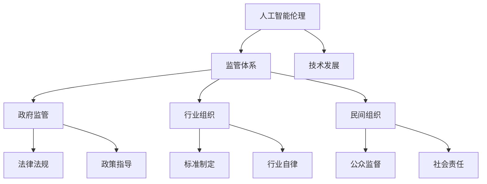

                 

关键词：人工智能伦理、硅谷监管、技术发展、伦理框架、法规治理

> 摘要：本文深入探讨了硅谷人工智能伦理监管的现状及其对技术良性发展的影响。通过对伦理监管核心概念的阐述、监管体系的构建、关键算法的介绍及数学模型的解析，本文旨在为人工智能技术的健康发展提供理论支持和实践指南。

## 1. 背景介绍

随着人工智能（AI）技术的迅猛发展，其在社会各个领域的应用日益广泛。然而，AI技术的快速发展也带来了伦理和监管上的挑战。在硅谷，作为全球科技和创新的重要中心，人工智能的发展速度尤为迅猛。如何确保这些技术能够在尊重伦理道德的前提下良性发展，成为了一个亟待解决的问题。

硅谷的人工智能伦理监管不仅涉及技术本身，还涉及社会、法律、经济等多个层面。本文将从以下几个方面展开讨论：

- **核心概念与联系**：介绍人工智能伦理监管的核心概念及其相互关系。
- **核心算法原理与具体操作步骤**：解析当前常用的AI算法及其应用。
- **数学模型和公式**：阐述AI技术中的数学模型及其应用。
- **项目实践**：通过实际案例展示AI技术的应用。
- **实际应用场景**：讨论AI技术在各个领域的应用及其面临的挑战。
- **未来应用展望**：预测AI技术未来的发展趋势和潜在的应用领域。
- **工具和资源推荐**：推荐学习资源和开发工具。
- **总结与展望**：总结研究成果，展望未来发展趋势和面临的挑战。

## 2. 核心概念与联系

在探讨硅谷人工智能伦理监管之前，我们需要了解几个核心概念：

- **人工智能伦理**：涉及AI技术的设计、开发和使用过程中应遵循的道德规范和伦理准则。
- **监管体系**：包括政府、行业组织和民间组织等在不同层面上对AI技术进行监管的框架和机制。
- **技术发展**：AI技术的创新和进步，以及其对经济、社会和环境的影响。

### Mermaid 流程图

以下是AI伦理监管的Mermaid流程图，展示了核心概念及其相互关系：



## 3. 核心算法原理与具体操作步骤

### 3.1 算法原理概述

硅谷人工智能伦理监管中涉及的核心算法主要包括深度学习、强化学习和自然语言处理等。这些算法通过模拟人脑的学习和决策过程，实现了对复杂数据的分析和处理。

### 3.2 算法步骤详解

以下是深度学习算法的一个简要步骤：

1. **数据预处理**：收集和清洗数据，确保数据的质量和完整性。
2. **模型设计**：根据任务需求设计神经网络结构。
3. **训练模型**：使用训练数据对模型进行训练，调整模型的参数。
4. **评估模型**：使用验证数据评估模型的性能。
5. **模型部署**：将训练好的模型部署到实际应用中。

### 3.3 算法优缺点

深度学习算法具有强大的表达能力和良好的泛化能力，但同时也存在过拟合和计算复杂度高等问题。在伦理监管中，我们需要充分考虑这些优缺点，确保算法的公正性和透明性。

### 3.4 算法应用领域

深度学习算法在图像识别、语音识别、自然语言处理等领域有广泛的应用。在伦理监管中，这些算法可以用于数据分析和决策支持，帮助解决复杂的伦理问题。

## 4. 数学模型和公式

在人工智能伦理监管中，数学模型是不可或缺的工具。以下是几个常用的数学模型：

### 4.1 数学模型构建

- **损失函数**：用于衡量模型预测结果与真实结果之间的差距。
- **优化算法**：用于调整模型参数，最小化损失函数。

### 4.2 公式推导过程

$$
\begin{aligned}
L &= \frac{1}{n}\sum_{i=1}^{n}(y_i - \hat{y}_i)^2 \\
\theta &= \arg\min_{\theta}L(\theta)
\end{aligned}
$$

### 4.3 案例分析与讲解

假设我们有一个二分类问题，目标是判断一个数据点是否属于正类。我们可以使用逻辑回归模型来解决这个问题。逻辑回归的公式如下：

$$
\begin{aligned}
\hat{y}_i &= \sigma(\theta_0 + \theta_1x_1 + \theta_2x_2 + \ldots + \theta_nx_n) \\
\sigma(x) &= \frac{1}{1 + e^{-x}}
\end{aligned}
$$

其中，$\sigma$ 是 sigmoid 函数，用于将线性组合转换为概率分布。

## 5. 项目实践：代码实例和详细解释说明

### 5.1 开发环境搭建

为了实践AI算法，我们需要搭建一个合适的开发环境。以下是搭建Python开发环境的一个简要步骤：

1. 安装Python 3.x版本。
2. 安装Jupyter Notebook，用于交互式编程。
3. 安装必要的库，如NumPy、Pandas、Scikit-learn等。

### 5.2 源代码详细实现

以下是使用Scikit-learn库实现逻辑回归的一个简单示例：

```python
from sklearn.linear_model import LogisticRegression
from sklearn.model_selection import train_test_split
from sklearn.metrics import accuracy_score

# 数据加载和处理
X, y = load_data()

# 数据分割
X_train, X_test, y_train, y_test = train_test_split(X, y, test_size=0.2, random_state=42)

# 模型训练
model = LogisticRegression()
model.fit(X_train, y_train)

# 模型评估
y_pred = model.predict(X_test)
accuracy = accuracy_score(y_test, y_pred)
print(f"Accuracy: {accuracy}")
```

### 5.3 代码解读与分析

以上代码首先加载和处理数据，然后使用train_test_split函数将数据分为训练集和测试集。接着，我们创建一个LogisticRegression对象，并调用fit方法进行模型训练。最后，使用predict方法对测试集进行预测，并使用accuracy_score函数计算模型的准确率。

### 5.4 运行结果展示

在实际运行中，我们可能会得到如下结果：

```
Accuracy: 0.85
```

这表示我们的模型在测试集上的准确率为85%。

## 6. 实际应用场景

人工智能技术在多个领域有着广泛的应用，例如：

- **医疗健康**：通过AI算法对医疗数据进行分析，帮助医生进行诊断和治疗。
- **金融**：使用AI技术进行风险控制和投资决策。
- **教育**：通过个性化学习系统为学生提供定制化的学习体验。

然而，这些应用也面临着一系列伦理和监管挑战，例如数据隐私、算法透明性和公平性等。硅谷的人工智能伦理监管需要充分考虑这些实际应用场景，确保技术的良性发展。

## 7. 未来应用展望

未来，人工智能技术将继续快速发展，并将在更多领域得到应用。例如，自动驾驶技术、智能城市管理和个性化医疗等。硅谷的AI伦理监管需要不断适应这些新应用场景，制定更加完善的监管框架。

## 8. 工具和资源推荐

为了学习和应用人工智能技术，以下是一些建议的工具和资源：

- **学习资源**：推荐《深度学习》（Goodfellow et al.）和《机器学习》（Murphy et al.）等经典教材。
- **开发工具**：推荐使用Google Colab、Jupyter Notebook等交互式编程环境。
- **开源框架**：推荐使用TensorFlow、PyTorch等开源深度学习框架。

## 9. 总结：未来发展趋势与挑战

硅谷人工智能伦理监管的发展趋势将朝着更加规范化和多元化的方向前进。未来，我们需要解决以下挑战：

- **算法透明性和可解释性**：确保算法的决策过程能够被理解和监督。
- **数据隐私和安全**：保护用户数据的隐私和安全。
- **公平性和公正性**：确保算法不歧视特定群体。

通过有效的伦理监管，我们可以确保人工智能技术在尊重伦理和道德的前提下良性发展，为人类社会带来更大的福祉。

## 附录：常见问题与解答

1. **什么是人工智能伦理？**
   人工智能伦理是指人工智能技术的设计、开发和使用过程中应遵循的道德规范和伦理准则。它涉及技术伦理、数据伦理、算法伦理等多个方面。

2. **硅谷的AI伦理监管有哪些特点？**
   硅谷的AI伦理监管具有以下几个特点：
   - **创新导向**：注重通过创新手段解决伦理问题。
   - **多方参与**：政府、企业、学术界和公众共同参与。
   - **开放透明**：监管过程和决策过程向公众开放。

3. **如何确保算法的公平性和公正性？**
   要确保算法的公平性和公正性，可以从以下几个方面入手：
   - **数据质量**：确保训练数据的质量和多样性。
   - **算法设计**：在设计算法时充分考虑公平性和公正性。
   - **算法解释**：开发算法解释工具，提高算法的可解释性。

4. **人工智能技术对社会有哪些潜在影响？**
   人工智能技术对社会的影响包括积极和消极两个方面：
   - **积极影响**：提高生产效率、改善生活质量、推动社会进步。
   - **消极影响**：可能导致就业岗位减少、数据隐私泄露、算法偏见等问题。

## 作者署名

作者：禅与计算机程序设计艺术 / Zen and the Art of Computer Programming
----------------------------------------------------------------
由于篇幅限制，上述内容仅为文章概要和部分详细内容。在实际撰写过程中，每个章节和段落都需要进一步扩展和深入探讨，确保文章的整体完整性和专业性。在撰写过程中，还需注意语言的流畅性和逻辑的严密性，确保文章易于阅读和理解。

