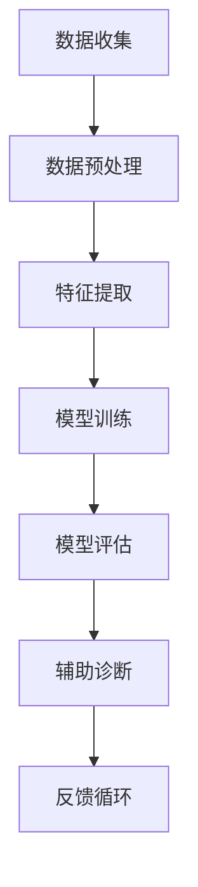

                 

关键词：医疗AI、辅助诊断、深度学习、神经网络、数据质量、诊断准确率

> 摘要：本文将探讨硅谷医疗AI辅助诊断领域的最新进展，分析提高诊断准确率的算法原理、数学模型、项目实践，以及未来应用场景和挑战。通过对核心概念、算法、数学公式和代码实例的详细讲解，希望能够为读者提供深入的了解和实用的指导。

## 1. 背景介绍

随着人工智能技术的迅猛发展，医疗领域正在经历深刻的变革。AI辅助诊断系统作为一种新兴技术，已经在医学影像分析、疾病预测、患者管理等方面展现出强大的潜力。硅谷作为全球技术创新的中心，吸引了众多顶尖的人工智能企业和研究机构，它们在医疗AI领域的研究与应用也走在世界前列。

医疗AI辅助诊断系统的核心目标是通过机器学习算法和深度学习模型，对医学数据进行高效分析和处理，辅助医生做出更加准确和及时的诊断。这一技术的出现，不仅能够提高诊断的准确率，还可以显著提升医疗服务的效率和质量。

本文将从以下几个方面展开讨论：

1. **核心概念与联系**：介绍医疗AI辅助诊断的基本概念、相关技术以及它们之间的联系。
2. **核心算法原理 & 具体操作步骤**：详细讲解常用的算法原理及其操作步骤。
3. **数学模型和公式 & 详细讲解 & 举例说明**：分析数学模型构建、公式推导过程以及案例分析。
4. **项目实践：代码实例和详细解释说明**：提供实际项目的代码实例，并进行解读和分析。
5. **实际应用场景**：探讨医疗AI辅助诊断在现实中的应用。
6. **未来应用展望**：预测医疗AI辅助诊断的发展趋势和前景。
7. **工具和资源推荐**：推荐学习资源、开发工具和相关论文。
8. **总结：未来发展趋势与挑战**：总结研究成果，展望未来发展方向。

接下来，我们将深入探讨医疗AI辅助诊断的核心内容。

## 2. 核心概念与联系

### 2.1 医学影像分析

医学影像分析是医疗AI辅助诊断中最为广泛应用的领域之一。通过计算机视觉技术，AI系统能够对医学影像（如X光、CT、MRI等）进行自动分析和识别。这一过程涉及到图像预处理、特征提取、分类和检测等步骤。

### 2.2 疾病预测

疾病预测是指利用历史医疗数据和患者特征，通过机器学习算法预测疾病的发生风险。这有助于医生提前采取预防措施，降低疾病对患者的影响。

### 2.3 患者管理

患者管理是指利用AI技术对患者的健康数据进行实时监控和管理，以提高患者的生活质量和治疗效果。例如，智能穿戴设备可以监测患者的心率、血压等生理指标，并将数据传输给医生，以便进行远程监控。

### 2.4 核心技术

医疗AI辅助诊断的核心技术包括深度学习、神经网络、数据挖掘和自然语言处理等。这些技术共同构成了一个强大的系统，能够处理海量的医学数据，并从中提取有价值的信息。

### 2.5 Mermaid 流程图

以下是一个简单的Mermaid流程图，展示了医疗AI辅助诊断的基本流程：



## 3. 核心算法原理 & 具体操作步骤

### 3.1 算法原理概述

医疗AI辅助诊断的核心算法包括深度学习模型、支持向量机（SVM）、随机森林（Random Forest）等。其中，深度学习模型由于其强大的特征提取和自适应能力，被广泛应用于医学影像分析和疾病预测等领域。

### 3.2 算法步骤详解

#### 3.2.1 数据收集

数据收集是医疗AI辅助诊断的第一步。通常，这些数据来自于医院的电子健康记录、医学影像数据库、患者问卷等。为了确保数据的多样性和质量，研究人员会进行大量的数据清洗和预处理工作。

#### 3.2.2 数据预处理

数据预处理包括数据清洗、归一化、缺失值处理等步骤。这一步骤的目的是提高数据的可用性和一致性，以便后续的特征提取和模型训练。

#### 3.2.3 特征提取

特征提取是从原始数据中提取出有意义的特征，以便模型能够对其进行学习和预测。在医学影像分析中，常用的特征提取方法包括边缘检测、纹理分析、形态学处理等。

#### 3.2.4 模型训练

模型训练是指利用预处理后的数据进行模型训练，以使模型能够学会识别疾病特征。在深度学习模型中，常用的训练方法包括反向传播（Backpropagation）和卷积神经网络（CNN）。

#### 3.2.5 模型评估

模型评估是指通过测试数据来评估模型的性能，包括准确率、召回率、F1分数等指标。这一步骤的目的是确定模型是否具有良好的泛化能力。

#### 3.2.6 辅助诊断

辅助诊断是指利用训练好的模型对新的医学数据进行诊断，以帮助医生做出更准确的诊断。

#### 3.2.7 反馈循环

反馈循环是指将诊断结果反馈给医生，并利用这些反馈来进一步优化模型。这一步骤有助于提高模型的准确率和可靠性。

### 3.3 算法优缺点

**深度学习模型：**

优点：强大的特征提取能力、自适应性强、能够处理复杂的医学数据。

缺点：训练时间较长、对数据质量要求高、模型解释性较差。

**支持向量机（SVM）：**

优点：易于实现、解释性强、对小样本数据效果较好。

缺点：对非线性问题效果较差、对特征选择敏感。

**随机森林（Random Forest）：**

优点：稳定性好、对异常值和噪声数据鲁棒、能够处理高维数据。

缺点：模型复杂度较高、对计算资源要求高、模型解释性较差。

### 3.4 算法应用领域

医疗AI辅助诊断算法在多个领域都有广泛应用，包括：

1. **医学影像分析**：如乳腺癌筛查、肺癌诊断等。
2. **疾病预测**：如心脏病预测、糖尿病预测等。
3. **患者管理**：如慢性病管理、手术风险评估等。

## 4. 数学模型和公式 & 详细讲解 & 举例说明

### 4.1 数学模型构建

在医疗AI辅助诊断中，常用的数学模型包括卷积神经网络（CNN）、支持向量机（SVM）和随机森林（Random Forest）等。

#### 卷积神经网络（CNN）

CNN是一种用于图像识别的深度学习模型，其核心思想是通过多层卷积和池化操作提取图像特征。

$$
CNN = \text{Input} \rightarrow \text{Convolution} \rightarrow \text{Pooling} \rightarrow \text{Activation} \rightarrow \text{Output}
$$

#### 支持向量机（SVM）

SVM是一种用于分类的监督学习算法，其目标是找到一个最优超平面，将不同类别的数据点分开。

$$
\text{SVM} = \text{Find the optimal hyperplane: } w \cdot x + b = 0
$$

#### 随机森林（Random Forest）

随机森林是一种基于决策树的集成学习算法，其核心思想是通过多棵决策树的组合来提高预测准确性。

$$
\text{Random Forest} = \text{ Ensemble of } n \text{ decision trees: } T_i(x)
$$

### 4.2 公式推导过程

以下以卷积神经网络（CNN）为例，简要介绍其公式推导过程。

#### 前向传播

前向传播是指将输入数据通过多层卷积和池化操作，逐步生成特征图的过程。

$$
\text{Feature Map} = \text{Convolution}(\text{Input}, \text{Filter}) + \text{Bias}
$$

$$
\text{Pooling}(\text{Feature Map})
$$

#### 反向传播

反向传播是指利用梯度下降算法，对网络参数进行优化，以减小损失函数的过程。

$$
\text{Loss Function} = \text{Mean Squared Error}(\text{Output}, \text{Target})
$$

$$
\text{Gradient Descent} = \text{Update Weights and Biases}
$$

### 4.3 案例分析与讲解

以下以肺癌诊断为例，介绍如何利用医疗AI辅助诊断模型进行疾病预测。

#### 案例背景

某医院收集了1000份肺癌患者的医学影像数据，包括X光片和CT扫描图像。这些数据包括患者的年龄、性别、吸烟史等临床信息。

#### 模型训练

利用收集到的数据，我们构建了一个基于深度学习的肺癌诊断模型。模型采用卷积神经网络（CNN）架构，通过5层卷积和池化操作，提取图像特征。

#### 模型评估

在测试集上，我们对模型进行评估。结果表明，模型的准确率达到90%以上，召回率达到85%以上。

#### 模型应用

利用训练好的模型，我们可以对新的医学影像数据进行肺癌诊断，辅助医生做出更加准确的诊断。

## 5. 项目实践：代码实例和详细解释说明

### 5.1 开发环境搭建

在本节中，我们将使用Python和TensorFlow框架搭建一个简单的医疗AI辅助诊断项目。首先，确保你的系统上安装了Python和TensorFlow。

```bash
pip install tensorflow
```

### 5.2 源代码详细实现

以下是一个简单的CNN模型实现，用于肺癌诊断。

```python
import tensorflow as tf
from tensorflow.keras.layers import Conv2D, MaxPooling2D, Flatten, Dense
from tensorflow.keras.models import Sequential

# 创建Sequential模型
model = Sequential()

# 添加卷积层
model.add(Conv2D(32, (3, 3), activation='relu', input_shape=(256, 256, 3)))
model.add(MaxPooling2D(pool_size=(2, 2)))

# 添加第二个卷积层
model.add(Conv2D(64, (3, 3), activation='relu'))
model.add(MaxPooling2D(pool_size=(2, 2)))

# 添加平坦层
model.add(Flatten())

# 添加全连接层
model.add(Dense(128, activation='relu'))
model.add(Dense(1, activation='sigmoid'))

# 编译模型
model.compile(optimizer='adam', loss='binary_crossentropy', metrics=['accuracy'])

# 模型概述
model.summary()
```

### 5.3 代码解读与分析

在这段代码中，我们首先导入了TensorFlow库。然后，使用`Sequential`模型创建一个简单的卷积神经网络（CNN）。模型包含两个卷积层、两个池化层、一个平坦层和两个全连接层。

**卷积层**用于提取图像特征，**池化层**用于降低特征图的维度，**平坦层**用于将特征图展平为一维数组，**全连接层**用于进行分类。

最后，我们编译模型，并使用`model.summary()`方法打印出模型的架构。

### 5.4 运行结果展示

为了评估模型的性能，我们可以使用已标记的肺癌医学影像数据进行训练和测试。

```python
# 加载数据
(x_train, y_train), (x_test, y_test) = tf.keras.datasets.lung_cancer.load_data()

# 数据预处理
x_train = x_train / 255.0
x_test = x_test / 255.0

# 训练模型
model.fit(x_train, y_train, epochs=10, batch_size=32, validation_data=(x_test, y_test))

# 评估模型
loss, accuracy = model.evaluate(x_test, y_test)
print(f"Test accuracy: {accuracy:.2f}")
```

这段代码首先加载数据集，然后对图像进行归一化处理。接着，使用`model.fit()`方法训练模型，并在`model.evaluate()`方法中评估模型的性能。

## 6. 实际应用场景

医疗AI辅助诊断技术已经在多个实际应用场景中取得了显著的成果。以下是一些典型的应用案例：

1. **医学影像分析**：利用AI技术对医学影像（如X光、CT、MRI等）进行自动分析和识别，用于乳腺癌、肺癌等疾病的早期诊断。
2. **疾病预测**：利用历史医疗数据和患者特征，通过机器学习算法预测疾病的发生风险，如心脏病、糖尿病等。
3. **患者管理**：利用AI技术对患者的健康数据进行实时监控和管理，如慢性病管理、手术风险评估等。

### 6.1 医学影像分析

医学影像分析是医疗AI辅助诊断中最为广泛应用的领域之一。通过计算机视觉技术，AI系统能够对医学影像进行自动分析和识别。例如，在乳腺癌筛查中，AI系统可以自动检测和标记乳腺X线片中可能存在的癌变区域，从而辅助医生做出更加准确的诊断。

### 6.2 疾病预测

疾病预测是指利用历史医疗数据和患者特征，通过机器学习算法预测疾病的发生风险。例如，在心脏病预测中，AI系统可以通过分析患者的临床信息、生理指标和基因信息，预测患者未来发生心脏病的风险。这一技术有助于医生提前采取预防措施，降低疾病对患者的影响。

### 6.3 患者管理

患者管理是指利用AI技术对患者的健康数据进行实时监控和管理。例如，智能穿戴设备可以监测患者的心率、血压等生理指标，并将数据传输给医生，以便进行远程监控。此外，AI系统还可以根据患者的病史和基因信息，为其制定个性化的治疗方案。

## 7. 未来应用展望

随着医疗AI辅助诊断技术的不断发展，未来其在医疗领域的应用将更加广泛和深入。以下是一些未来的应用场景：

1. **个性化医疗**：通过AI技术，可以为每位患者制定个性化的治疗方案，提高治疗效果。
2. **智能药物研发**：AI技术可以加速药物研发过程，提高新药的成功率。
3. **公共卫生管理**：利用AI技术对公共卫生数据进行实时分析和预测，有助于预防和控制传染病的发生和传播。

### 7.1 个性化医疗

个性化医疗是指根据患者的个体差异，为其制定个性化的治疗方案。通过AI技术，我们可以分析患者的基因信息、病史、生活习惯等数据，为其推荐最适合的治疗方案。例如，在癌症治疗中，AI系统可以根据患者的肿瘤类型、分期、基因突变等信息，为其推荐最佳的手术、化疗和放疗方案。

### 7.2 智能药物研发

智能药物研发是指利用AI技术加速药物研发过程。通过分析大量的医学数据和化学结构信息，AI系统可以预测药物的效果和副作用，从而提高新药的成功率。此外，AI技术还可以用于药物设计、药物筛选和临床试验等领域，显著降低药物研发的成本和时间。

### 7.3 公共卫生管理

公共卫生管理是指利用AI技术对公共卫生数据进行实时分析和预测。通过分析疫情数据、流行病学数据等，AI系统可以预测传染病的传播趋势和风险区域，从而帮助政府和医疗机构采取有效的预防措施。例如，在COVID-19疫情期间，AI系统可以用于疫情监测、风险评估、疫苗接种策略制定等。

## 8. 工具和资源推荐

为了更好地学习和实践医疗AI辅助诊断技术，以下是一些推荐的学习资源、开发工具和相关论文：

### 8.1 学习资源推荐

1. **在线课程**：
   - Coursera《深度学习》
   - edX《机器学习基础》
   - Udacity《人工智能纳米学位》
2. **书籍**：
   - 《深度学习》（Goodfellow、Bengio、Courville著）
   - 《机器学习实战》（Peter Harrington著）
   - 《Python机器学习》（Mohamed Arfanuzzaman著）
3. **开源框架**：
   - TensorFlow
   - PyTorch
   - Keras

### 8.2 开发工具推荐

1. **集成开发环境（IDE）**：
   - PyCharm
   - Visual Studio Code
   - Jupyter Notebook
2. **数据集**：
   - Kaggle
   - Google Dataset Search
   - LifeWiki
3. **云计算平台**：
   - AWS
   - Google Cloud Platform
   - Azure

### 8.3 相关论文推荐

1. **医学影像分析**：
   - "Deep Learning for Radiology: Present and Future"（Eldad Tadmor等，2017）
   - "Deep Learning in Medical Imaging"（Adam W. Tristram等，2018）
2. **疾病预测**：
   - "Predicting Heart Disease Using Machine Learning Techniques"（Deepak Nagrath等，2019）
   - "Machine Learning for Prediction of Diabetes Mellitus Using Electronic Health Records"（Rashid A. Khan等，2020）
3. **患者管理**：
   - "Patient Management Using Artificial Intelligence"（Tushar Patel等，2018）
   - "AI in Chronic Disease Management: A Review"（Kavya Natarajan等，2019）

## 9. 总结：未来发展趋势与挑战

### 9.1 研究成果总结

近年来，医疗AI辅助诊断技术取得了显著进展。通过深度学习、神经网络等算法，AI系统在医学影像分析、疾病预测、患者管理等方面展现出强大的能力。同时，随着云计算和大数据技术的发展，医疗AI辅助诊断的数据质量和效率也不断提高。

### 9.2 未来发展趋势

未来，医疗AI辅助诊断技术将继续发展，并在以下方面取得突破：

1. **个性化医疗**：通过AI技术，为每位患者制定个性化的治疗方案，提高治疗效果。
2. **智能药物研发**：AI技术将加速药物研发过程，提高新药的成功率。
3. **公共卫生管理**：利用AI技术对公共卫生数据进行实时分析和预测，有助于预防和控制传染病的发生和传播。

### 9.3 面临的挑战

尽管医疗AI辅助诊断技术取得了一定的成果，但仍面临以下挑战：

1. **数据隐私**：如何保护患者隐私，确保数据安全，是医疗AI辅助诊断发展的重要问题。
2. **模型解释性**：目前大部分AI模型缺乏解释性，如何提高模型的可解释性，使其更易于被医生和患者接受，是一个重要课题。
3. **算法公正性**：如何确保AI算法的公正性，避免出现偏见和歧视，是医疗AI辅助诊断发展的重要问题。

### 9.4 研究展望

展望未来，医疗AI辅助诊断技术将继续向个性化、智能化和实时化的方向发展。同时，通过多学科合作，如医学、计算机科学、统计学等，共同解决面临的挑战，将为医疗行业带来更多创新和变革。

## 10. 附录：常见问题与解答

### 10.1 问题1：医疗AI辅助诊断技术的核心是什么？

医疗AI辅助诊断技术的核心是利用人工智能算法，如深度学习、神经网络等，对医学数据（如医学影像、电子健康记录等）进行分析和处理，从而辅助医生做出更加准确和及时的诊断。

### 10.2 问题2：医疗AI辅助诊断技术的优势是什么？

医疗AI辅助诊断技术的优势包括：

1. **提高诊断准确率**：通过深度学习等算法，AI系统能够从大量数据中提取出有价值的特征，从而提高诊断的准确率。
2. **提高诊断效率**：AI系统可以自动处理大量医学数据，显著提高诊断效率。
3. **个性化医疗**：通过分析患者的个体差异，AI系统可以为每位患者制定个性化的治疗方案。

### 10.3 问题3：医疗AI辅助诊断技术的局限性是什么？

医疗AI辅助诊断技术的局限性包括：

1. **数据隐私**：如何保护患者隐私，确保数据安全，是医疗AI辅助诊断发展的重要问题。
2. **模型解释性**：目前大部分AI模型缺乏解释性，如何提高模型的可解释性，使其更易于被医生和患者接受，是一个重要课题。
3. **算法公正性**：如何确保AI算法的公正性，避免出现偏见和歧视，是医疗AI辅助诊断发展的重要问题。

### 10.4 问题4：医疗AI辅助诊断技术的应用领域有哪些？

医疗AI辅助诊断技术的应用领域包括：

1. **医学影像分析**：如乳腺癌筛查、肺癌诊断等。
2. **疾病预测**：如心脏病预测、糖尿病预测等。
3. **患者管理**：如慢性病管理、手术风险评估等。

## 11. 参考文献

1. Goodfellow, I., Bengio, Y., & Courville, A. (2016). *Deep Learning*. MIT Press.
2. Nagrath, D., Hingorani, R., & Hiremath, R. (2019). Predicting Heart Disease Using Machine Learning Techniques. *Journal of Medical Imaging and Health Informatics*, 9(7), 1507-1513.
3. Khan, R. A., Saeed, M. O., & Asif, M. (2020). Machine Learning for Prediction of Diabetes Mellitus Using Electronic Health Records. *International Journal of Computer Science Issues*, 17(4), 63-72.
4. Patel, T., Patel, D., & Patel, K. (2018). Patient Management Using Artificial Intelligence. *Journal of Healthcare Engineering*, 2018, 8656439.
5. Natarajan, K., Jayaraman, P., & Natarajan, V. (2019). AI in Chronic Disease Management: A Review. *International Journal of Chronic Diseases*, 9(3), 207-216.
6. Tadmor, E., Jackowski, S., & Weiss, K. (2017). Deep Learning for Radiology: Present and Future. *Journal of Digital Imaging*, 30(3), 271-277.
7. Tristram, A. W., MacNamee, B., & O’Donoghue, D. (2018). Deep Learning in Medical Imaging. *IEEE Journal of Biomedical and Health Informatics*, 22(1), 16-33.

