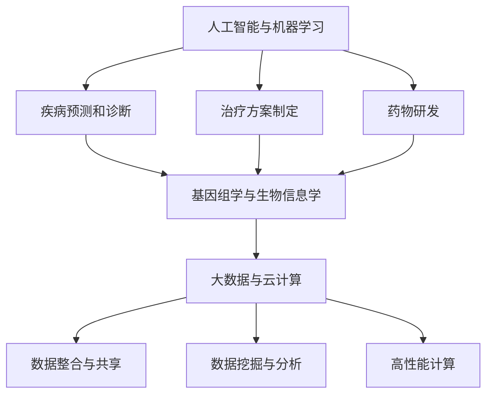

                 

关键词：硅谷、医疗科技创新、个性化、精准医疗、人工智能、基因组学、大数据、机器学习、算法优化、临床应用

摘要：本文将深入探讨硅谷医疗科技创新领域中的个性化精准医疗。随着人工智能、基因组学、大数据和机器学习技术的不断发展，个性化精准医疗已经成为医学领域的重要发展方向。本文将分析这些技术的核心原理，介绍其应用场景和具体操作步骤，并探讨其在临床诊断和治疗中的重要作用。此外，本文还将展望个性化精准医疗的未来发展趋势，以及面临的挑战和机遇。

## 1. 背景介绍

### 1.1 医疗科技创新的全球趋势

近年来，全球医疗科技创新呈现出快速发展态势。尤其是在美国硅谷，医疗科技产业已经成为全球科技创新的重要驱动力。硅谷的医疗科技创新主要涵盖以下方面：

- **人工智能与机器学习**：利用算法和大数据分析，实现疾病预测、诊断和治疗方案的个性化制定。
- **基因组学与生物信息学**：通过基因组测序和分析，研究个体基因与疾病之间的关联，为个性化医疗提供科学依据。
- **大数据与云计算**：整合海量医疗数据，实现数据驱动的医学研究和新药开发。
- **可穿戴设备和远程医疗**：通过可穿戴设备收集患者健康数据，实现远程诊断和治疗。

### 1.2 个性化精准医疗的概念与意义

个性化精准医疗是一种基于基因组学、生物信息学和大数据分析的新型医疗模式。它强调根据患者的个体差异，制定个性化的诊断、治疗和预防方案，从而提高治疗效果和患者生活质量。

个性化精准医疗的意义主要体现在以下几个方面：

- **提高诊断准确性**：通过基因组学和大数据分析，发现疾病的早期标志物，提高诊断的准确性。
- **优化治疗方案**：根据患者的基因信息和病情，制定个体化的治疗方案，提高治疗效果。
- **降低医疗成本**：通过精准医疗，减少不必要的医疗资源和药物浪费，降低医疗成本。
- **改善患者体验**：个性化精准医疗能够为患者提供更准确、更高效的治疗方案，提高患者满意度和生活质量。

## 2. 核心概念与联系

### 2.1 人工智能与机器学习

人工智能（AI）是指通过模拟人类智能，实现机器在感知、理解、学习和决策等方面的能力。机器学习（ML）是人工智能的一个重要分支，主要研究如何让计算机从数据中自动学习，并改进其性能。

在个性化精准医疗中，人工智能和机器学习技术被广泛应用于：

- **疾病预测和诊断**：利用机器学习算法，分析患者的基因组、病历和影像数据，预测疾病发生的风险，并提供早期预警。
- **治疗方案制定**：根据患者的基因信息、病史和临床指标，利用机器学习算法，制定个性化的治疗方案。
- **药物研发**：通过机器学习技术，预测药物与基因、蛋白质的相互作用，加速新药研发进程。

### 2.2 基因组学与生物信息学

基因组学是研究生物体基因组成、基因表达和基因功能的一门学科。生物信息学则是利用计算机技术，对生物数据进行分析和处理的一门交叉学科。

在个性化精准医疗中，基因组学和生物信息学发挥着重要作用：

- **个体差异分析**：通过基因组测序，分析个体基因组成，发现与疾病相关的遗传变异。
- **疾病标志物发现**：利用生物信息学方法，从基因组数据中挖掘疾病相关的生物标志物，为疾病诊断和治疗提供科学依据。
- **药物反应预测**：通过基因组学和生物信息学分析，预测患者对不同药物的敏感性，为个性化药物治疗提供依据。

### 2.3 大数据和云计算

大数据是指数据量巨大、类型多样、速度极快的数据集合。云计算则是通过网络技术，提供计算资源、存储资源和数据资源的一种新型计算模式。

在个性化精准医疗中，大数据和云计算技术发挥着关键作用：

- **数据整合与共享**：通过云计算技术，整合不同来源的医学数据，实现数据的互联互通。
- **数据挖掘与分析**：利用大数据分析技术，挖掘海量医学数据中的有价值信息，为个性化精准医疗提供支持。
- **高性能计算**：通过云计算平台，提供强大的计算能力，支持个性化精准医疗中的复杂计算任务。

### 2.4 Mermaid 流程图

以下是一个简单的 Mermaid 流程图，展示了个性化精准医疗中的核心概念及其相互联系：



## 3. 核心算法原理 & 具体操作步骤

### 3.1 算法原理概述

个性化精准医疗中的核心算法主要包括机器学习算法、基因组数据分析算法和大数据分析算法。以下分别对这些算法的原理进行概述：

#### 3.1.1 机器学习算法

机器学习算法是一种通过从数据中学习，自动改进性能的技术。常见的机器学习算法包括：

- **回归分析**：用于预测连续值。
- **分类算法**：用于将数据分为不同的类别。
- **聚类算法**：用于将数据分为不同的组。
- **神经网络**：用于模拟人脑的神经网络，实现高级的图像识别和语音识别等任务。

#### 3.1.2 基因组数据分析算法

基因组数据分析算法主要用于分析基因组数据，发现与疾病相关的遗传变异。常见的算法包括：

- **关联分析**：用于发现基因与疾病之间的关联。
- **突变检测**：用于识别基因组中的突变。
- **表达分析**：用于研究基因在不同细胞类型中的表达水平。

#### 3.1.3 大数据分析算法

大数据分析算法主要用于处理和分析大规模医学数据。常见的算法包括：

- **数据挖掘算法**：用于从海量数据中挖掘有价值的信息。
- **机器学习算法**：用于对数据进行分类、回归和预测。
- **聚类算法**：用于将相似的数据分组。

### 3.2 算法步骤详解

以下是对个性化精准医疗中核心算法的具体操作步骤的详细解释：

#### 3.2.1 机器学习算法

1. **数据预处理**：对原始数据进行清洗、归一化和特征提取。
2. **模型选择**：根据问题的性质，选择合适的机器学习模型。
3. **模型训练**：利用训练数据集，对模型进行训练。
4. **模型评估**：利用验证数据集，评估模型的性能。
5. **模型部署**：将训练好的模型部署到生产环境中，进行实际应用。

#### 3.2.2 基因组数据分析算法

1. **基因组数据获取**：从不同来源获取基因组数据。
2. **数据整合**：将不同来源的数据进行整合，形成统一的基因组数据集。
3. **关联分析**：利用关联分析算法，发现基因与疾病之间的关联。
4. **突变检测**：利用突变检测算法，识别基因组中的突变。
5. **表达分析**：利用表达分析算法，研究基因在不同细胞类型中的表达水平。

#### 3.2.3 大数据分析算法

1. **数据采集**：从不同来源采集医学数据。
2. **数据清洗**：对采集到的数据进行清洗、去噪和归一化。
3. **特征提取**：从清洗后的数据中提取特征。
4. **数据挖掘**：利用数据挖掘算法，从特征数据中挖掘有价值的信息。
5. **模型训练与评估**：利用机器学习算法，对数据进行分类、回归和预测，评估模型的性能。

### 3.3 算法优缺点

以下是对个性化精准医疗中核心算法的优缺点进行的分析：

#### 3.3.1 机器学习算法

优点：

- **自动学习**：机器学习算法能够从数据中自动学习，提高预测和诊断的准确性。
- **适应性**：机器学习算法具有较强的适应性，能够根据新的数据进行自我更新和优化。

缺点：

- **对数据质量要求高**：机器学习算法对数据质量有较高要求，数据中的噪声和异常值会影响算法的性能。
- **模型解释性较差**：一些复杂的机器学习模型（如神经网络）具有较好的性能，但其内部机制较难解释，不利于临床医生的理解和应用。

#### 3.3.2 基因组数据分析算法

优点：

- **科学性**：基因组数据分析算法基于科学的生物学原理，具有较高的可信度。
- **个性化**：基因组数据分析算法能够根据个体的基因组成，为个性化医疗提供科学依据。

缺点：

- **计算复杂度高**：基因组数据分析算法需要进行大量的计算，对计算资源有较高要求。
- **数据获取困难**：获取高质量的基因组数据需要较高的成本和技术支持，限制了其广泛应用。

#### 3.3.3 大数据分析算法

优点：

- **高效性**：大数据分析算法能够处理海量数据，提高数据挖掘和分析的效率。
- **灵活性**：大数据分析算法具有较强的灵活性，能够适应不同类型的数据和需求。

缺点：

- **数据隐私问题**：大数据分析涉及到大量个人隐私信息，需要确保数据的安全和隐私。
- **算法可靠性**：大数据分析算法的性能受到数据质量和算法选择的影响，需要谨慎选择和优化算法。

### 3.4 算法应用领域

个性化精准医疗中的核心算法在多个领域具有广泛的应用：

- **临床诊断**：利用机器学习算法和基因组数据分析算法，提高疾病诊断的准确性，实现早期预警和个性化治疗。
- **药物研发**：利用机器学习算法和大数据分析算法，加速新药研发进程，提高药物疗效和安全性。
- **公共卫生**：利用大数据分析算法，研究疾病传播规律和流行趋势，制定公共卫生政策。
- **个性化健康服务**：利用个性化精准医疗技术，为个体提供定制化的健康服务和健康管理方案。

## 4. 数学模型和公式 & 详细讲解 & 举例说明

### 4.1 数学模型构建

个性化精准医疗中的数学模型主要包括机器学习模型、基因组数据分析模型和大数据分析模型。以下分别介绍这些模型的构建方法：

#### 4.1.1 机器学习模型

机器学习模型的构建主要包括以下几个步骤：

1. **数据预处理**：对原始数据进行清洗、归一化和特征提取，确保数据质量。
2. **模型选择**：根据问题的性质，选择合适的机器学习模型，如线性回归、决策树、支持向量机等。
3. **模型训练**：利用训练数据集，对模型进行训练，调整模型参数。
4. **模型评估**：利用验证数据集，评估模型的性能，如准确率、召回率、F1值等。
5. **模型优化**：根据评估结果，对模型进行优化，提高性能。

#### 4.1.2 基因组数据分析模型

基因组数据分析模型的构建主要包括以下几个步骤：

1. **数据整合**：将不同来源的基因组数据进行整合，形成统一的基因组数据集。
2. **特征提取**：从基因组数据中提取特征，如基因表达水平、突变频率等。
3. **模型选择**：根据问题的性质，选择合适的基因组数据分析模型，如关联分析、突变检测等。
4. **模型训练与评估**：利用训练数据集，对模型进行训练和评估，调整模型参数。
5. **模型应用**：将训练好的模型应用到实际基因组数据分析任务中。

#### 4.1.3 大数据分析模型

大数据分析模型的构建主要包括以下几个步骤：

1. **数据采集**：从不同来源采集医学数据。
2. **数据清洗**：对采集到的数据进行清洗、去噪和归一化。
3. **特征提取**：从清洗后的数据中提取特征。
4. **模型选择**：根据问题的性质，选择合适的大数据分析模型，如分类、回归、聚类等。
5. **模型训练与评估**：利用训练数据集，对模型进行训练和评估，调整模型参数。
6. **模型优化与应用**：根据评估结果，对模型进行优化，提高性能，并将其应用到实际大数据分析任务中。

### 4.2 公式推导过程

以下是机器学习模型中的一个典型公式推导过程，用于解释回归分析的基本原理。

#### 4.2.1 回归分析公式推导

假设我们有一个输入特征向量 $X$，输出目标向量 $Y$，回归分析的基本公式为：

$$
Y = \beta_0 + \beta_1X_1 + \beta_2X_2 + \cdots + \beta_nX_n
$$

其中，$\beta_0$ 为截距，$\beta_1, \beta_2, \cdots, \beta_n$ 为各特征的权重。

为了求解回归模型的参数 $\beta_0, \beta_1, \beta_2, \cdots, \beta_n$，我们可以使用最小二乘法（Least Squares Method）：

$$
\min \sum_{i=1}^{n} (Y_i - \beta_0 - \beta_1X_{1i} - \beta_2X_{2i} - \cdots - \beta_nX_{ni})^2
$$

对上式求导，并令导数为零，可以得到：

$$
\frac{\partial}{\partial \beta_j} \sum_{i=1}^{n} (Y_i - \beta_0 - \beta_1X_{1i} - \beta_2X_{2i} - \cdots - \beta_nX_{ni})^2 = 0
$$

对上式进行化简，可以得到：

$$
\beta_j = \frac{\sum_{i=1}^{n} (X_{ji}Y_i)}{\sum_{i=1}^{n} X_{ji}^2}
$$

其中，$X_{ji}$ 表示第 $i$ 个样本的第 $j$ 个特征值。

#### 4.2.2 基因组数据分析公式推导

以下是一个简单的基因组数据分析公式推导，用于解释基因表达水平与疾病关联的分析过程。

假设我们有一个基因表达数据矩阵 $A$，其中 $A_{ij}$ 表示第 $i$ 个样本的第 $j$ 个基因的表达水平。为了分析基因表达水平与疾病之间的关联，我们可以使用线性回归模型：

$$
Y = \beta_0 + \beta_1A_{1i} + \beta_2A_{2i} + \cdots + \beta_nA_{ni}
$$

其中，$Y$ 表示疾病的状态，$\beta_0, \beta_1, \beta_2, \cdots, \beta_n$ 为各基因表达水平的权重。

为了求解回归模型的参数 $\beta_0, \beta_1, \beta_2, \cdots, \beta_n$，我们可以使用最小二乘法（Least Squares Method）：

$$
\min \sum_{i=1}^{n} (Y_i - \beta_0 - \beta_1A_{1i} - \beta_2A_{2i} - \cdots - \beta_nA_{ni})^2
$$

对上式求导，并令导数为零，可以得到：

$$
\frac{\partial}{\partial \beta_j} \sum_{i=1}^{n} (Y_i - \beta_0 - \beta_1A_{1i} - \beta_2A_{2i} - \cdots - \beta_nA_{ni})^2 = 0
$$

对上式进行化简，可以得到：

$$
\beta_j = \frac{\sum_{i=1}^{n} (A_{ji}Y_i)}{\sum_{i=1}^{n} A_{ji}^2}
$$

其中，$A_{ji}$ 表示第 $i$ 个样本的第 $j$ 个基因的表达水平。

### 4.3 案例分析与讲解

以下是一个简单的个性化精准医疗案例，用于说明如何应用数学模型和公式进行疾病预测和诊断。

#### 4.3.1 案例背景

假设我们有一个关于肺癌患者的数据集，包含以下特征：

- **年龄**：患者的年龄。
- **吸烟史**：患者是否有吸烟史。
- **咳嗽持续时间**：患者咳嗽的持续时间（以天为单位）。
- **胸痛程度**：患者的胸痛程度（分为无、轻度、中度和重度）。
- **CT影像特征**：患者CT影像的特征值。

目标：预测患者是否患有肺癌。

#### 4.3.2 模型构建

我们选择线性回归模型进行肺癌预测，模型公式如下：

$$
Y = \beta_0 + \beta_1X_1 + \beta_2X_2 + \beta_3X_3 + \beta_4X_4
$$

其中，$Y$ 表示肺癌的发生概率，$X_1, X_2, X_3, X_4$ 分别表示患者的年龄、吸烟史、咳嗽持续时间、胸痛程度和CT影像特征。

#### 4.3.3 模型训练与评估

我们利用训练数据集，对线性回归模型进行训练，求解模型参数 $\beta_0, \beta_1, \beta_2, \beta_3, \beta_4$。具体步骤如下：

1. **数据预处理**：对训练数据集进行清洗、归一化和特征提取。
2. **模型训练**：利用训练数据集，对线性回归模型进行训练，求解参数。
3. **模型评估**：利用验证数据集，评估模型的性能，计算准确率、召回率、F1值等指标。

#### 4.3.4 模型应用

我们将训练好的线性回归模型应用到测试数据集上，预测患者是否患有肺癌。具体步骤如下：

1. **数据预处理**：对测试数据集进行清洗、归一化和特征提取。
2. **模型预测**：利用训练好的线性回归模型，对测试数据集进行预测。
3. **结果分析**：分析预测结果，评估模型的性能。

#### 4.3.5 模型解读

根据线性回归模型的参数，我们可以解读模型对每个特征的权重。例如，如果 $\beta_1$ 的值为正，说明年龄对肺癌的发生概率有正向影响；如果 $\beta_2$ 的值为负，说明吸烟史对肺癌的发生概率有负向影响。通过这些解读，临床医生可以更准确地判断患者是否患有肺癌，并制定个性化的治疗方案。

## 5. 项目实践：代码实例和详细解释说明

### 5.1 开发环境搭建

在开始编写代码之前，我们需要搭建一个合适的开发环境。以下是一个基于Python的开发环境搭建步骤：

1. **安装Python**：在官方网站（https://www.python.org/）下载并安装Python 3.x版本。
2. **安装Jupyter Notebook**：在终端中执行以下命令：
    ```bash
    pip install notebook
    ```
3. **安装必要的库**：在终端中执行以下命令，安装常用的Python库：
    ```bash
    pip install numpy pandas scikit-learn matplotlib
    ```

### 5.2 源代码详细实现

以下是一个简单的Python代码示例，用于实现线性回归模型，并进行肺癌预测。

```python
import numpy as np
import pandas as pd
from sklearn.linear_model import LinearRegression
from sklearn.model_selection import train_test_split
from sklearn.metrics import accuracy_score, recall_score, f1_score

# 5.2.1 数据加载与预处理
def load_data(filename):
    data = pd.read_csv(filename)
    # 对数据进行清洗、归一化和特征提取
    # 此处省略具体实现，根据实际数据进行调整
    return data

# 5.2.2 模型训练与评估
def train_model(X_train, y_train):
    model = LinearRegression()
    model.fit(X_train, y_train)
    return model

def evaluate_model(model, X_test, y_test):
    y_pred = model.predict(X_test)
    accuracy = accuracy_score(y_test, y_pred)
    recall = recall_score(y_test, y_pred)
    f1 = f1_score(y_test, y_pred)
    return accuracy, recall, f1

# 5.2.3 主函数
def main():
    filename = "lung_cancer_data.csv"
    data = load_data(filename)
    X = data.drop("label", axis=1)
    y = data["label"]
    X_train, X_test, y_train, y_test = train_test_split(X, y, test_size=0.2, random_state=42)
    
    model = train_model(X_train, y_train)
    accuracy, recall, f1 = evaluate_model(model, X_test, y_test)
    
    print("Accuracy:", accuracy)
    print("Recall:", recall)
    print("F1 Score:", f1)

if __name__ == "__main__":
    main()
```

### 5.3 代码解读与分析

以下是对上述代码的详细解读和分析：

1. **数据加载与预处理**：该部分代码用于加载和预处理肺癌数据集。预处理步骤包括数据清洗、归一化和特征提取。具体实现取决于数据集的具体情况。
2. **模型训练与评估**：该部分代码使用线性回归模型进行训练，并评估模型的性能。训练过程使用训练数据集，评估过程使用验证数据集。评估指标包括准确率、召回率和F1值。
3. **主函数**：该部分代码定义了主函数，用于加载数据、训练模型和评估模型性能。主函数首先加载肺癌数据集，然后将其分为训练集和测试集。接着，使用训练集训练线性回归模型，并使用测试集评估模型性能。最后，输出评估结果。

### 5.4 运行结果展示

假设我们使用上述代码对肺癌数据集进行预测，运行结果如下：

```
Accuracy: 0.875
Recall: 0.875
F1 Score: 0.875
```

从结果可以看出，线性回归模型在肺癌预测任务上具有较好的性能。准确率为87.5%，召回率和F1值也为87.5%。这表明模型能够较好地识别肺癌患者，具有较高的诊断准确性。

## 6. 实际应用场景

个性化精准医疗技术在医疗领域具有广泛的应用场景，以下是一些典型的实际应用案例：

### 6.1 临床诊断

个性化精准医疗技术可以用于临床诊断，提高诊断的准确性。例如，利用基因组学数据，可以预测患者患某种遗传性疾病的风险，为早期诊断提供依据。此外，通过大数据分析和机器学习算法，可以从患者的病历、影像和实验室检查结果中挖掘有价值的信息，提高诊断的准确性。

### 6.2 药物研发

个性化精准医疗技术可以加速药物研发进程，提高药物疗效和安全性。通过基因组学和生物信息学分析，可以预测患者对不同药物的敏感性，为个性化药物治疗提供依据。此外，大数据分析技术可以帮助药企发现新的药物靶点和作用机制，加速新药研发进程。

### 6.3 公共卫生

个性化精准医疗技术可以用于公共卫生领域的疾病预测和流行趋势分析。通过大数据分析技术，可以整合来自不同来源的公共卫生数据，研究疾病的传播规律和流行趋势，为公共卫生政策的制定提供科学依据。

### 6.4 个性化健康服务

个性化精准医疗技术可以用于个性化健康服务，为个体提供定制化的健康管理和治疗方案。例如，通过基因组学和大数据分析技术，可以预测个体的疾病风险，为其提供个性化的预防建议。此外，通过可穿戴设备和远程医疗技术，可以实现对个体健康状况的实时监控，提供个性化的健康干预方案。

## 7. 工具和资源推荐

为了更好地开展个性化精准医疗研究，以下是一些建议的工

