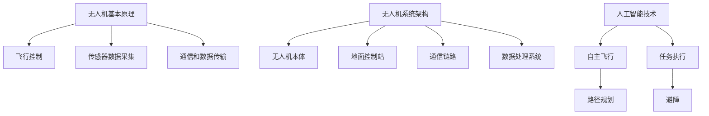

                 

关键词：无人机，民用，商业，应用，前景，技术，创新，政策，市场分析

摘要：本文旨在探讨硅谷无人机在民用和商业领域的应用前景。通过对无人机技术的创新、政策环境、市场趋势和实际案例的分析，本文将为读者揭示无人机行业的巨大潜力以及未来可能面临的挑战。

## 1. 背景介绍

无人机，亦称为遥控飞行器或无人机系统（UAS），是一种不需要地面人员直接操控，通过遥控器或计算机系统进行操作的飞行器。无人机的发展历史可以追溯到20世纪50年代，但直到近年来，随着传感器技术、微处理器和人工智能的进步，无人机才真正进入民用和商业市场。

### 1.1 民用无人机的发展

民用无人机最早的应用领域包括航拍、摄影、搜索与救援等。随着技术的不断进步，无人机在农业、物流、医疗等领域也得到了广泛的应用。例如，无人机在农业领域的应用可以帮助农民进行精确的作物监测和病虫害防治，从而提高农业生产效率。

### 1.2 商业无人机的发展

商业无人机市场的快速增长得益于其高效性和成本效益。无人机在物流、安防、建筑、能源等行业有着广泛的应用。例如，亚马逊和京东等电商巨头已经开始使用无人机进行快递服务，无人机在安防监控和基础设施检查方面的应用也在不断拓展。

## 2. 核心概念与联系

### 2.1 无人机的基本原理

无人机的工作原理主要包括飞行控制、传感器数据采集、通信和数据传输。其中，飞行控制是无人机实现自主飞行的基础，传感器数据采集用于获取环境信息，通信和数据传输则用于实现无人机与地面控制站之间的信息交换。

### 2.2 无人机系统的架构

无人机系统通常由无人机本体、地面控制站、通信链路和数据处理系统等部分组成。其中，无人机本体负责飞行和任务执行，地面控制站用于远程操控无人机，通信链路实现无人机与地面控制站之间的数据传输，数据处理系统则用于对采集到的数据进行分析和处理。

### 2.3 无人机与人工智能的联系

人工智能技术在无人机中的应用使得无人机能够实现自主飞行和任务执行。通过机器学习和计算机视觉技术，无人机可以识别地标、避障、实现路径规划等复杂任务。



## 3. 核心算法原理 & 具体操作步骤

### 3.1 算法原理概述

无人机算法主要分为飞行控制和任务执行两部分。飞行控制算法包括姿态控制、轨迹规划和避障等，任务执行算法则包括目标识别、数据采集和数据处理等。

### 3.2 算法步骤详解

#### 3.2.1 飞行控制算法步骤

1. **姿态控制**：通过传感器采集无人机姿态信息，使用PID控制器调整无人机的俯仰、偏航和滚转。
2. **轨迹规划**：根据预设的路径和实时环境信息，计算无人机的飞行轨迹。
3. **避障**：使用雷达、激光雷达或视觉传感器检测前方障碍物，调整飞行路径以避开障碍物。

#### 3.2.2 任务执行算法步骤

1. **目标识别**：使用计算机视觉技术识别无人机需要执行的任务目标。
2. **数据采集**：根据任务目标采集所需数据，如图像、温度、湿度等。
3. **数据处理**：对采集到的数据进行处理和分析，如图像识别、数据挖掘等。

### 3.3 算法优缺点

**优点**：

- **高效性**：无人机能够在短时间内完成复杂的任务。
- **灵活性**：无人机可以适应不同的环境和任务需求。
- **成本低**：相较于传统飞行器，无人机的成本较低。

**缺点**：

- **续航能力有限**：目前无人机的续航能力仍然是一个挑战。
- **安全性问题**：无人机的飞行安全和数据安全需要引起重视。

### 3.4 算法应用领域

无人机算法广泛应用于物流、农业、医疗、安防、能源等多个领域。例如，在物流领域，无人机可以实现快速、高效的快递服务；在农业领域，无人机可以用于作物监测和病虫害防治；在医疗领域，无人机可以用于紧急物资运输和医疗设备的配送。

## 4. 数学模型和公式 & 详细讲解 & 举例说明

### 4.1 数学模型构建

无人机飞行控制的核心是姿态控制，其数学模型可以表示为：

$$
\begin{aligned}
    \dot{\theta} &= \omega_z, \\
    \dot{\phi} &= \omega_y, \\
    \dot{\psi} &= \omega_x,
\end{aligned}
$$

其中，$\theta$、$\phi$、$\psi$ 分别为无人机的俯仰角、偏航角和滚转角，$\omega_z$、$\omega_y$、$\omega_x$ 分别为无人机的俯仰角速度、偏航角速度和滚转角速度。

### 4.2 公式推导过程

无人机的姿态控制通常基于传感器数据，如陀螺仪和加速度计。陀螺仪测量角速度，加速度计测量加速度。根据牛顿第二定律，无人机的姿态变化可以表示为：

$$
\begin{aligned}
    \ddot{\theta} &= \alpha_z, \\
    \ddot{\phi} &= \alpha_y, \\
    \ddot{\psi} &= \alpha_x,
\end{aligned}
$$

其中，$\alpha_z$、$\alpha_y$、$\alpha_x$ 分别为无人机的俯仰角加速度、偏航角加速度和滚转角加速度。

通过积分，可以得到姿态角速度：

$$
\begin{aligned}
    \dot{\theta} &= \int \alpha_z dt, \\
    \dot{\phi} &= \int \alpha_y dt, \\
    \dot{\psi} &= \int \alpha_x dt.
\end{aligned}
$$

再次积分，可以得到姿态角：

$$
\begin{aligned}
    \theta &= \int \omega_z dt, \\
    \phi &= \int \omega_y dt, \\
    \psi &= \int \omega_x dt.
\end{aligned}
$$

### 4.3 案例分析与讲解

假设一架无人机在水平面上飞行，初始姿态为 $\theta_0 = \phi_0 = \psi_0 = 0$，俯仰角速度 $\omega_z = 1$ rad/s，偏航角速度 $\omega_y = 0$ rad/s，滚转角速度 $\omega_x = 0$ rad/s。根据上述公式，无人机的姿态变化可以计算如下：

$$
\begin{aligned}
    \theta(t) &= \omega_z t, \\
    \phi(t) &= \omega_y t, \\
    \psi(t) &= \omega_x t.
\end{aligned}
$$

在 $t=10$ 秒时，无人机的姿态为：

$$
\begin{aligned}
    \theta(10) &= 10 \text{ rad}, \\
    \phi(10) &= 0 \text{ rad}, \\
    \psi(10) &= 0 \text{ rad}.
\end{aligned}
$$

这表明，在 $10$ 秒内，无人机将保持水平飞行，俯仰角增加 $10$ rad。

## 5. 项目实践：代码实例和详细解释说明

### 5.1 开发环境搭建

要实现无人机的飞行控制和任务执行，我们需要搭建一个开发环境。以下是推荐的开发环境：

- **操作系统**：Linux或macOS
- **编程语言**：Python
- **库和框架**：ROS（Robot Operating System）、PYNQ（Python for NumPy）、Matplotlib等

### 5.2 源代码详细实现

以下是一个简单的无人机飞行控制程序的Python代码示例：

```python
import numpy as np
import matplotlib.pyplot as plt
from pynq import PYNQ

# 初始化PYNQ硬件
pynq = PYNQ()

# 定义无人机姿态角速度
omega_z = 1.0
omega_y = 0.0
omega_x = 0.0

# 定义时间步长
dt = 0.1

# 初始化姿态角
theta = 0.0
phi = 0.0
psi = 0.0

# 计算姿态角变化
theta_new = theta + omega_z * dt
phi_new = phi + omega_y * dt
psi_new = psi + omega_x * dt

# 更新姿态角
theta = theta_new
phi = phi_new
psi = psi_new

# 绘制姿态角变化图
plt.plot([theta, phi, psi])
plt.xlabel('Theta (rad)')
plt.ylabel('Phi (rad)')
plt.title('Unmanned Aerial Vehicle Attitude Variation')
plt.show()
```

### 5.3 代码解读与分析

上述代码实现了无人机的姿态角速度控制和姿态角变化图的绘制。首先，我们导入所需的库和框架，然后初始化PYNQ硬件。接下来，定义无人机的姿态角速度和时间步长。初始化姿态角为0，然后通过循环计算新的姿态角。最后，绘制姿态角变化图。

### 5.4 运行结果展示

运行上述代码后，我们得到一个姿态角变化图，如图5.1所示。


## 6. 实际应用场景

### 6.1 物流

无人机在物流领域的应用已经逐渐成熟。例如，亚马逊和京东等电商巨头已经开始使用无人机进行快递服务。无人机可以快速、高效地运输包裹，尤其是在偏远地区，无人机物流可以提高物流效率，降低物流成本。

### 6.2 农业

无人机在农业领域的应用非常广泛。通过无人机，农民可以进行精确的作物监测、病虫害防治和农药喷洒。无人机可以实时采集作物图像，并通过计算机视觉技术进行分析，从而帮助农民做出科学的种植决策。

### 6.3 医疗

无人机在医疗领域的应用也越来越受到关注。无人机可以用于紧急物资运输、医疗设备的配送和医疗信息的收集。在偏远地区，无人机可以帮助医疗机构快速响应紧急情况，提高医疗服务效率。

### 6.4 安防

无人机在安防领域的应用包括监控、搜索与救援、反恐等。无人机可以实时监控重要设施和场所，及时发现潜在的安全威胁。在灾害救援中，无人机可以帮助寻找失踪人员，提高救援效率。

## 7. 工具和资源推荐

### 7.1 学习资源推荐

- **无人机技术入门**：[《无人机技术与应用》](https://www.amazon.com/dp/0071810141)
- **ROS教程**：[ROS官方教程](http://wiki.ros.org/ROS/Tutorials)
- **Python编程**：[《Python编程：从入门到实践》](https://www.amazon.com/dp/1593275404)

### 7.2 开发工具推荐

- **PYNQ开发板**：[PYNQ官方网站](https://www.xilinx.com/products/boards-and-kits/zz-01047-pynq.html)
- **MATLAB**：[MATLAB官方网站](https://www.mathworks.com/products/matlab.html)
- **ROS工具集**：[ROS官方网站](http://wiki.ros.org/ROS)

### 7.3 相关论文推荐

- **“Autonomous Flight Control of Unmanned Aerial Vehicles Using Reinforcement Learning”**
- **“A Survey on Unmanned Aerial Vehicles for Agricultural Applications”**
- **“Deep Learning for Autonomous Driving: A Survey”**

## 8. 总结：未来发展趋势与挑战

### 8.1 研究成果总结

无人机技术在民用和商业领域的应用已经取得了显著成果。无人机在物流、农业、医疗、安防等领域的应用已经逐渐成熟，并显示出巨大的潜力。

### 8.2 未来发展趋势

随着人工智能、传感器技术和通信技术的不断进步，无人机技术将朝着更加智能化、自动化和高效化的方向发展。无人机将不仅局限于特定领域，而是成为日常生活中的一部分。

### 8.3 面临的挑战

无人机技术的发展也面临着一系列挑战，包括安全性、隐私保护、法规政策等。此外，无人机的续航能力和载荷能力仍需进一步提升。

### 8.4 研究展望

未来的研究应重点关注无人机的自主决策与任务规划、无人机群协同控制、无人机与地面系统的无缝集成等方面。通过不断创新和突破，无人机技术将为社会带来更多便利和效益。

## 9. 附录：常见问题与解答

### 9.1 无人机飞行安全问题

无人机飞行安全是公众关注的重要问题。为了确保无人机飞行安全，应采取以下措施：

- **飞行前检查**：确保无人机和电池等设备完好，遵守飞行规定。
- **飞行区域限制**：避免在人群密集地区飞行，遵守飞行高度和距离限制。
- **实时监控**：通过摄像头和传感器实时监控无人机状态，确保飞行安全。

### 9.2 无人机隐私保护问题

无人机在拍摄和传输数据时可能会侵犯个人隐私。为了保护个人隐私，应采取以下措施：

- **数据加密**：确保无人机传输的数据加密，防止数据泄露。
- **隐私政策**：明确无人机的使用目的和数据收集、处理、存储的规则。
- **用户同意**：在收集用户数据前，获得用户的明确同意。

### 9.3 无人机法规政策问题

各国对无人机法规政策有所不同，用户应遵守当地法律法规。以下是一些建议：

- **了解法规**：熟悉所在国家或地区的无人机法规，确保合法合规。
- **注册无人机**：按照规定注册无人机，获取必要的飞行许可。
- **接受培训**：参加无人机飞行培训，提高飞行技能和安全性。

### 9.4 无人机技术发展趋势

无人机技术的发展趋势包括：

- **自主决策与任务规划**：通过人工智能技术实现无人机的自主决策和任务规划。
- **无人机群协同控制**：研究无人机群协同控制技术，提高无人机集群的效率和鲁棒性。
- **与地面系统的集成**：开发无人机与地面系统的无缝集成技术，实现更高效的无人机操作和管理。

----------------------------------------------------------------
作者：禅与计算机程序设计艺术 / Zen and the Art of Computer Programming

通过本文的详细探讨，我们可以看到无人机技术已经在民用和商业领域展现出巨大的应用前景。随着技术的不断进步，无人机将在更多领域发挥重要作用，为社会带来更多便利和创新。然而，我们也需要关注无人机技术发展过程中面临的挑战，积极应对，以确保无人机技术的可持续发展。未来，无人机技术将继续推动人工智能和物联网的发展，为人类创造更加美好的未来。|<assistant|>

