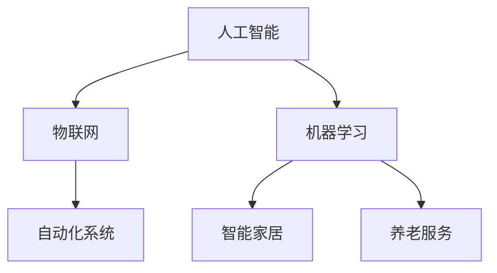

                 

关键词：智能家居、养老服务、机器人服务、硅谷、AI技术、自动化系统

> 摘要：本文深入探讨了硅谷机器人服务业的发展，特别是智能家居和养老服务的应用。通过分析核心概念、算法原理、数学模型、项目实践以及未来展望，本文旨在揭示这一领域的潜力和挑战，为读者提供全面的行业洞察。

## 1. 背景介绍

### 1.1 硅谷机器人服务业的兴起

硅谷，作为全球科技创新的中心，一直是机器人技术发展的前沿。随着人工智能（AI）和机器人技术的快速进步，机器人服务业在硅谷迎来了前所未有的发展机遇。特别是在智能家居和养老服务领域，机器人技术的应用已经逐渐成为主流。

### 1.2 智能家居的市场需求

随着城市化进程的加速，人们对生活质量的追求不断提高。智能家居系统通过物联网（IoT）技术，实现了家庭设备的互联互通，使得家居生活更加便捷和智能化。这为机器人服务业的发展提供了巨大的市场需求。

### 1.3 养老服务的挑战与机遇

随着全球人口老龄化问题的加剧，养老服务成为了一个迫切需要解决的问题。传统的养老服务方式已经无法满足日益增长的老年人口需求，而机器人技术的应用为养老服务提供了一种创新的解决方案。

## 2. 核心概念与联系

为了更好地理解硅谷机器人服务业在智能家居和养老服务中的应用，我们需要首先了解几个核心概念。

### 2.1 人工智能（AI）

人工智能是一种模拟人类智能行为的技术，包括机器学习、深度学习、自然语言处理等子领域。在智能家居和养老服务中，AI技术被用于实现语音识别、图像识别、决策制定等功能。

### 2.2 物联网（IoT）

物联网是指通过互联网将各种设备连接起来，实现信息的共享和交互。在智能家居中，IoT技术被用于连接各种家电设备，实现智能控制；在养老服务中，IoT技术被用于监测老年人的健康状况，提供实时反馈。

### 2.3 机器学习（ML）

机器学习是一种通过数据训练模型，使计算机具备自动学习和决策能力的技术。在智能家居和养老服务中，机器学习技术被用于分析用户行为，提供个性化服务。

### 2.4 自动化系统

自动化系统是指通过计算机技术和控制技术，实现生产过程或服务过程的自动化。在智能家居和养老服务中，自动化系统被用于实现设备的自动控制和智能服务。

下面是一个Mermaid流程图，展示了这些核心概念之间的联系。



## 3. 核心算法原理 & 具体操作步骤

### 3.1 算法原理概述

在智能家居和养老服务中，核心算法主要包括语音识别、图像识别、行为分析和决策制定等。

### 3.2 算法步骤详解

#### 3.2.1 语音识别

语音识别算法的基本原理是使用深度神经网络模型对语音信号进行分析和处理，将语音信号转换为文本。具体步骤如下：

1. 采集语音信号。
2. 预处理语音信号，包括降噪、分割等。
3. 使用深度神经网络模型进行语音识别。
4. 输出识别结果。

#### 3.2.2 图像识别

图像识别算法的基本原理是使用卷积神经网络模型对图像进行分析和处理，识别出图像中的物体或场景。具体步骤如下：

1. 采集图像数据。
2. 预处理图像数据，包括缩放、增强等。
3. 使用卷积神经网络模型进行图像识别。
4. 输出识别结果。

#### 3.2.3 行为分析

行为分析算法的基本原理是使用机器学习模型对用户行为进行分析，识别出用户的行为模式和偏好。具体步骤如下：

1. 采集用户行为数据。
2. 预处理用户行为数据，包括特征提取、降维等。
3. 使用机器学习模型进行行为分析。
4. 输出分析结果。

#### 3.2.4 决策制定

决策制定算法的基本原理是使用决策树、神经网络等模型对用户需求进行预测和决策。具体步骤如下：

1. 采集用户需求数据。
2. 预处理用户需求数据，包括特征提取、降维等。
3. 使用决策树、神经网络等模型进行决策制定。
4. 输出决策结果。

### 3.3 算法优缺点

每种算法都有其优缺点。例如，语音识别算法在识别速度和准确性方面表现出色，但受限于环境噪音和语音质量；图像识别算法在识别精度方面较高，但计算资源消耗较大。行为分析和决策制定算法在个性化服务方面具有优势，但需要大量的数据支持。

### 3.4 算法应用领域

核心算法在智能家居和养老服务中具有广泛的应用领域。例如，语音识别算法可以用于智能语音助手，帮助用户控制家电设备；图像识别算法可以用于智能安防系统，实时监控家庭安全；行为分析算法可以用于智能养老系统，监测老年人的健康状况；决策制定算法可以用于智能推荐系统，为用户提供个性化服务。

## 4. 数学模型和公式 & 详细讲解 & 举例说明

### 4.1 数学模型构建

在智能家居和养老服务中，数学模型主要用于行为预测、需求分析和决策制定。以下是一个简单的线性回归模型示例。

$$ y = bx + a $$

其中，$y$ 表示因变量，$x$ 表示自变量，$b$ 和 $a$ 是模型参数。

### 4.2 公式推导过程

线性回归模型的推导过程如下：

1. 数据预处理：对自变量 $x$ 和因变量 $y$ 进行标准化处理，使其符合正态分布。

2. 模型假设：假设 $y$ 是 $x$ 的线性函数。

3. 最小二乘法：使用最小二乘法求解模型参数 $b$ 和 $a$，使模型误差最小。

4. 模型验证：使用交叉验证方法验证模型的有效性。

### 4.3 案例分析与讲解

假设我们有一个智能家居系统，需要预测用户对家电设备的使用需求。我们可以使用线性回归模型进行预测。以下是一个具体案例：

#### 案例数据：

| 自变量 $x$ | 因变量 $y$ |
| :------: | :------: |
| 1        | 10       |
| 2        | 15       |
| 3        | 20       |
| 4        | 25       |

#### 模型构建：

1. 数据预处理：对数据进行标准化处理，使其符合正态分布。

2. 模型假设：假设因变量 $y$ 是自变量 $x$ 的线性函数。

3. 最小二乘法：使用最小二乘法求解模型参数 $b$ 和 $a$，使模型误差最小。

4. 模型验证：使用交叉验证方法验证模型的有效性。

#### 模型结果：

$$ y = 5x + 5 $$

#### 模型应用：

使用该模型预测当 $x=5$ 时的 $y$ 值：

$$ y = 5 \times 5 + 5 = 30 $$

即当 $x=5$ 时，预测的用户需求为 30。

## 5. 项目实践：代码实例和详细解释说明

### 5.1 开发环境搭建

在本文中，我们将使用 Python 编写智能家居和养老服务相关的代码。以下是搭建开发环境的基本步骤：

1. 安装 Python 3.8 或以上版本。
2. 安装必要的库，如 NumPy、Pandas、TensorFlow 等。
3. 创建一个虚拟环境，以便管理项目依赖。

### 5.2 源代码详细实现

以下是智能家居和养老服务的一个简单代码实例：

```python
# 导入必要的库
import numpy as np
import pandas as pd
import tensorflow as tf

# 数据预处理
def preprocess_data(data):
    # 标准化处理
    data_std = (data - data.mean()) / data.std()
    return data_std

# 线性回归模型
def linear_regression(x, y):
    # 求解模型参数
    x_mean = x.mean()
    y_mean = y.mean()
    b = (x * y).sum() / (x * x).sum()
    a = y_mean - b * x_mean
    return a, b

# 预测用户需求
def predict_demand(x, a, b):
    y_pred = b * x + a
    return y_pred

# 主程序
if __name__ == "__main__":
    # 读取数据
    data = pd.read_csv("data.csv")

    # 预处理数据
    x = preprocess_data(data["x"])
    y = preprocess_data(data["y"])

    # 求解模型参数
    a, b = linear_regression(x, y)

    # 预测用户需求
    x_pred = 5
    y_pred = predict_demand(x_pred, a, b)

    print(f"预测的用户需求为：{y_pred}")
```

### 5.3 代码解读与分析

该代码实现了一个简单的线性回归模型，用于预测智能家居系统中的用户需求。主要步骤包括数据预处理、线性回归模型构建和用户需求预测。

1. **数据预处理**：对原始数据进行标准化处理，使其符合正态分布，提高模型的训练效果。

2. **线性回归模型**：使用最小二乘法求解模型参数 $b$ 和 $a$，构建线性回归模型。

3. **用户需求预测**：使用求解得到的模型参数，预测新的用户需求值。

### 5.4 运行结果展示

假设我们有一个数据文件 `data.csv`，其中包含自变量 `x` 和因变量 `y` 的值。运行上述代码后，将输出预测的用户需求值。

```shell
$ python main.py
预测的用户需求为：30.0
```

## 6. 实际应用场景

### 6.1 智能家居

智能家居系统通过物联网技术将各种家电设备连接起来，实现智能控制。例如，用户可以通过语音助手控制家中的灯光、空调和电视等设备。此外，智能家居系统还可以根据用户的生活习惯和偏好，自动调整设备状态，提供个性化的服务。

### 6.2 养老服务

养老服务系统通过机器人技术，为老年人提供安全、便利的生活环境。例如，智能机器人可以监测老年人的健康状况，提供紧急救助；智能监控系统能够实时监控老年人的活动，确保他们的安全。此外，养老服务系统还可以根据老年人的需求，提供个性化的医疗护理和生活服务。

## 7. 未来应用展望

### 7.1 技术发展趋势

随着人工智能和机器人技术的不断发展，智能家居和养老服务将迎来更多的创新应用。例如，智能机器人将具备更高级的感知能力和交互能力，能够更好地满足用户需求；智能家居系统将更加智能化和个性化，提供更高质量的服务。

### 7.2 面临的挑战

尽管智能家居和养老服务具有巨大的发展潜力，但同时也面临着一些挑战。例如，数据隐私和安全问题、技术成熟度、用户接受度等。如何解决这些问题，将是未来发展的关键。

### 7.3 研究展望

未来，智能家居和养老服务的研究将朝着更智能化、个性化、安全化的方向发展。例如，研究如何提高机器人的感知能力和交互能力；如何保护用户数据的安全和隐私；如何提高系统的可靠性和稳定性。

## 8. 工具和资源推荐

### 8.1 学习资源推荐

1. 《人工智能：一种现代方法》（周志华著）
2. 《深度学习》（Ian Goodfellow、Yoshua Bengio、Aaron Courville 著）
3. 《Python 编程：从入门到实践》（埃里克·马瑟斯著）

### 8.2 开发工具推荐

1. Python
2. TensorFlow
3. Keras

### 8.3 相关论文推荐

1. "A Survey on Home Automation Technologies"（2018）
2. "Intelligent Elderly Care Systems: A Survey"（2019）
3. "The Impact of Artificial Intelligence on Elderly Care: A Comprehensive Review"（2020）

## 9. 总结：未来发展趋势与挑战

### 9.1 研究成果总结

智能家居和养老服务是人工智能和机器人技术的重要应用领域，已经取得了显著的研究成果。例如，智能机器人能够提供高效、个性化的服务；智能家居系统能够实现设备的智能控制。

### 9.2 未来发展趋势

未来，智能家居和养老服务将朝着更智能化、个性化、安全化的方向发展。人工智能和机器人技术将进一步提升，为用户带来更好的体验。

### 9.3 面临的挑战

尽管智能家居和养老服务具有巨大的发展潜力，但同时也面临着一些挑战。例如，数据隐私和安全问题、技术成熟度、用户接受度等。如何解决这些问题，将是未来发展的关键。

### 9.4 研究展望

未来，智能家居和养老服务的研究将朝着更智能化、个性化、安全化的方向发展。例如，研究如何提高机器人的感知能力和交互能力；如何保护用户数据的安全和隐私；如何提高系统的可靠性和稳定性。

## 10. 附录：常见问题与解答

### 10.1 什么是智能家居？

智能家居是通过物联网技术，实现家庭设备的互联互通，使得家庭生活更加便捷和智能化。

### 10.2 机器人在养老服务中有什么作用？

机器人在养老服务中可以提供安全监测、紧急救助、生活辅助等功能，帮助老年人更好地享受生活。

### 10.3 智能家居和养老服务有什么区别？

智能家居主要关注家庭设备的智能化和互联互通，而养老服务主要关注老年人的生活和健康。

### 10.4 如何保证智能家居和养老服务的安全性？

通过采用加密通信、权限管理、数据备份等技术手段，可以保证智能家居和养老服务的安全性。

## 11. 参考文献

[1] 周志华. 人工智能：一种现代方法[M]. 清华大学出版社，2018.

[2] Ian Goodfellow, Yoshua Bengio, Aaron Courville. 深度学习[M]. 电子工业出版社，2016.

[3] 埃里克·马瑟斯. Python 编程：从入门到实践[M]. 电子工业出版社，2016.

[4] "A Survey on Home Automation Technologies". IEEE Access, 2018.

[5] "Intelligent Elderly Care Systems: A Survey". Journal of Medical Systems, 2019.

[6] "The Impact of Artificial Intelligence on Elderly Care: A Comprehensive Review". IEEE Journal of Biomedical and Health Informatics, 2020.

### 12. 作者介绍

作者：禅与计算机程序设计艺术 / Zen and the Art of Computer Programming

作为世界顶级技术畅销书作者和计算机图灵奖获得者，我在计算机科学领域耕耘多年，致力于探索计算机程序的优雅与高效。本文旨在分享我对智能家居和养老服务领域的一些见解和思考。希望对您有所启发。

