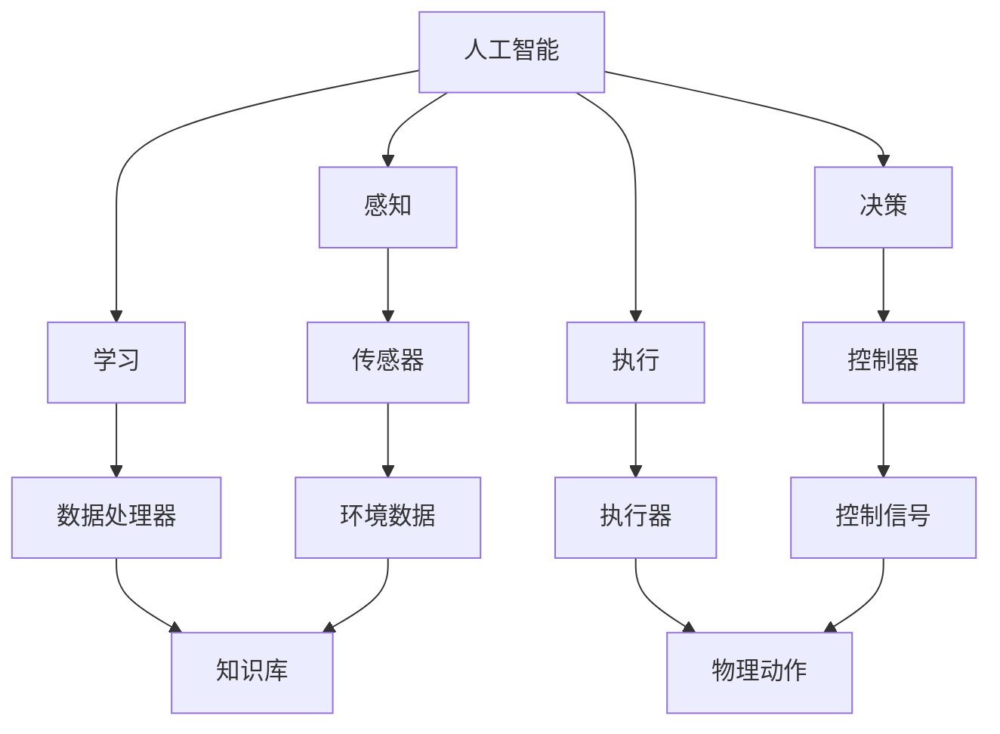

                 

关键词：硅谷、机器人服务、产业趋势、技术创新、未来展望

摘要：本文将深入探讨硅谷机器人服务业的发展趋势，分析其技术背景、核心算法原理、数学模型及应用，并结合实际项目实践和未来应用展望，全面解析硅谷机器人服务业的发展方向和潜在挑战。

## 1. 背景介绍

随着人工智能技术的迅猛发展，机器人服务业在硅谷逐渐成为了一个备受关注的领域。机器人服务业涵盖了从家庭清洁、护理到工业自动化、医疗辅助等多个方面，其应用范围正在不断扩大。硅谷作为全球科技创新的中心，汇聚了众多顶尖的技术企业和研究机构，为机器人服务业的发展提供了强大的技术支持和创新动力。

## 2. 核心概念与联系

在探讨硅谷机器人服务业的发展趋势之前，我们有必要了解一些核心概念和它们之间的联系。

### 2.1 人工智能与机器人

人工智能（AI）是机器人服务业的基础，它赋予了机器人感知、学习、决策和执行任务的能力。而机器人则是人工智能的载体，通过具体的硬件和软件实现AI技术的应用。

### 2.2 传感器与数据采集

传感器是实现机器人感知功能的关键，它们可以采集环境中的各种数据，如温度、湿度、光线、声音等。这些数据为机器人的决策提供了重要的依据。

### 2.3 控制系统与执行机构

控制系统负责对机器人进行控制，使其按照预设的算法和程序执行任务。执行机构则是机器人的行动部件，如电机、机械臂等，它们将控制信号转化为实际的运动。

### 2.4 网络与通信

网络和通信技术使得机器人可以实现远程控制、数据传输和协同工作，这是机器人服务业发展的重要支撑。


### 2.5 人工智能与机器人架构

以下是机器人架构的 Mermaid 流程图：



## 3. 核心算法原理 & 具体操作步骤

### 3.1 算法原理概述

硅谷机器人服务业的核心算法主要涉及机器学习、计算机视觉、自然语言处理等领域。以下是一个简单的算法原理概述：

- **机器学习**：通过训练模型来使机器人具备学习和改进的能力。
- **计算机视觉**：使机器人能够识别和理解图像信息。
- **自然语言处理**：使机器人能够理解和生成自然语言。

### 3.2 算法步骤详解

以下是机器人服务算法的具体步骤：

1. **数据采集与预处理**：收集环境数据，如图像、声音等，并进行预处理，如去噪、特征提取等。
2. **模型训练**：使用预处理后的数据训练机器学习模型，如神经网络等。
3. **模型评估与优化**：评估模型的性能，并通过调整参数进行优化。
4. **任务执行**：将训练好的模型应用于实际任务，如图像识别、语音识别等。
5. **反馈与学习**：根据任务执行结果进行反馈，不断调整和优化模型。

### 3.3 算法优缺点

- **优点**：算法使得机器人具备自主决策和执行任务的能力，提高了效率和质量。
- **缺点**：算法的准确性和稳定性受限于数据质量和模型设计，且训练过程复杂。

### 3.4 算法应用领域

硅谷机器人服务业的算法广泛应用于家庭服务、工业制造、医疗辅助、服务机器人等领域。

## 4. 数学模型和公式 & 详细讲解 & 举例说明

### 4.1 数学模型构建

机器人服务中的数学模型主要涉及机器学习、优化算法等领域。以下是一个简单的机器学习模型的构建过程：

1. **数据预处理**：$$\text{X} = \text{ preprocess}(\text{X})$$
2. **模型构建**：$$\text{y} = \text{model}(\text{X})$$
3. **模型训练**：$$\text{model} \leftarrow \text{train}(\text{X}, \text{y})$$
4. **模型评估**：$$\text{accuracy} = \text{evaluate}(\text{model}, \text{X}, \text{y})$$

### 4.2 公式推导过程

以下是机器学习模型的一个简单公式推导过程：

$$\text{y} = \text{sigmoid}(\text{w}^T\text{x} + \text{b})$$

其中，$\text{w}$ 是权重，$\text{x}$ 是特征，$\text{b}$ 是偏置，$\text{sigmoid}$ 函数是激活函数。

### 4.3 案例分析与讲解

以下是一个简单的机器学习案例：

**问题**：预测股票价格。

**解决方案**：

1. **数据采集**：收集历史股票价格数据。
2. **数据预处理**：进行数据清洗、归一化等处理。
3. **模型构建**：构建一个线性回归模型。
4. **模型训练**：使用历史数据训练模型。
5. **模型评估**：使用验证数据评估模型性能。

## 5. 项目实践：代码实例和详细解释说明

### 5.1 开发环境搭建

1. 安装Python环境和相关库（如TensorFlow、Keras等）。
2. 配置好机器学习框架和工具。

### 5.2 源代码详细实现

以下是一个简单的机器学习代码实例：

```python
import tensorflow as tf
from tensorflow.keras.models import Sequential
from tensorflow.keras.layers import Dense

# 数据预处理
X = preprocess_data(data)
y = preprocess_labels(labels)

# 构建模型
model = Sequential()
model.add(Dense(units=64, activation='relu', input_shape=(X.shape[1],)))
model.add(Dense(units=1, activation='sigmoid'))

# 训练模型
model.compile(optimizer='adam', loss='binary_crossentropy', metrics=['accuracy'])
model.fit(X, y, epochs=10, batch_size=32)

# 评估模型
accuracy = model.evaluate(X, y)
print("Accuracy:", accuracy)
```

### 5.3 代码解读与分析

这段代码实现了一个简单的二分类问题，包括数据预处理、模型构建、模型训练和模型评估。

### 5.4 运行结果展示

运行代码后，可以得到模型的准确率，根据准确率可以评估模型性能。

## 6. 实际应用场景

硅谷机器人服务业的应用场景广泛，包括但不限于：

- **家庭服务**：如智能清洁机器人、管家机器人等。
- **工业制造**：如自动化生产线、智能装配机器人等。
- **医疗辅助**：如手术机器人、智能护理机器人等。

## 7. 工具和资源推荐

### 7.1 学习资源推荐

- 《人工智能：一种现代的方法》
- 《深度学习》

### 7.2 开发工具推荐

- TensorFlow
- Keras

### 7.3 相关论文推荐

- “Deep Learning for Robotics”
- “Reinforcement Learning for Robotics”

## 8. 总结：未来发展趋势与挑战

### 8.1 研究成果总结

硅谷机器人服务业在技术创新、算法优化、应用拓展等方面取得了显著成果，为各行业的智能化升级提供了有力支持。

### 8.2 未来发展趋势

未来，硅谷机器人服务业将继续朝着更加智能化、个性化、自动化的方向发展，应用领域将不断拓展。

### 8.3 面临的挑战

尽管前景广阔，硅谷机器人服务业仍面临数据隐私、安全性、伦理道德等方面的挑战。

### 8.4 研究展望

未来，我们需要在算法、硬件、应用等方面进行深入研究，以推动硅谷机器人服务业的持续发展。

## 9. 附录：常见问题与解答

- **问题1**：机器学习模型如何优化？
  - **解答**：可以通过调整模型参数、增加训练数据、使用更复杂的模型结构等方式进行优化。

- **问题2**：机器人服务的安全性如何保障？
  - **解答**：可以通过数据加密、访问控制、安全审计等措施来保障机器人服务的安全性。

以上便是关于硅谷机器人服务业的发展趋势的详细探讨。希望通过本文的介绍，读者能够对硅谷机器人服务业有更深入的了解。

**作者：禅与计算机程序设计艺术 / Zen and the Art of Computer Programming** 

----------------------------------------------------------------

