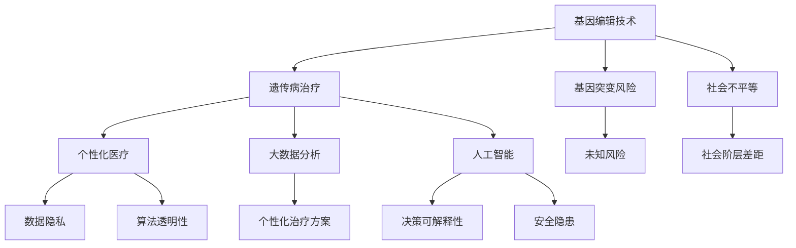

                 

在过去的几十年里，硅谷的生物技术医疗应用取得了惊人的进展。从基因编辑到个性化医疗，从人工智能辅助诊断到精准药物开发，这些技术的涌现不仅改变了医学研究的方向，也深刻地影响了医疗服务的提供。然而，伴随着这些技术的快速发展，也带来了诸多伦理争议。本文将探讨硅谷生物技术医疗应用的伦理问题，分析其影响，并探讨可能的解决途径。

## 文章关键词

- 硅谷生物技术
- 医疗应用
- 伦理争议
- 个性化医疗
- 基因编辑
- 人工智能

## 摘要

本文旨在探讨硅谷生物技术医疗应用的伦理争议。通过分析基因编辑、个性化医疗和人工智能等前沿技术的应用，揭示其在医疗领域带来的伦理挑战。文章还将探讨这些挑战对医疗体系的影响，并提出可能的解决方案，以期为未来生物技术医疗应用的发展提供指导。

### 1. 背景介绍

硅谷作为全球科技创新的中心，生物技术医疗应用的发展尤为迅速。基因编辑技术如CRISPR-Cas9的问世，使得科学家能够在细胞层面精确修改基因序列，从而治疗遗传病和开发新型药物。个性化医疗通过大数据分析和人工智能，为患者提供量身定制的治疗方案，提高了医疗效果。同时，人工智能在医学影像诊断、疾病预测和药物研发等方面也发挥了重要作用。

然而，这些技术的应用也引发了诸多伦理争议。基因编辑可能导致基因突变和未知风险，个性化医疗可能加剧社会不平等，而人工智能的决策过程缺乏透明性和可解释性，引发隐私和数据安全等问题。

#### 1.1 基因编辑的伦理争议

基因编辑技术的出现，为治疗遗传病提供了新的希望。然而，基因编辑也可能带来一系列伦理问题。首先，基因编辑可能导致不可预测的基因突变，从而引发新的健康问题。其次，基因编辑技术可能被滥用，用于非医学目的，如增强人类智力或身体能力，引发伦理和道德争议。

此外，基因编辑技术的普及可能加剧社会不平等。有能力支付高额基因编辑费用的家庭能够为孩子提供更好的基因改造，而低收入家庭则无法享受这种技术带来的福利，从而加剧社会贫富差距。

#### 1.2 个性化医疗的伦理争议

个性化医疗通过大数据分析和人工智能，为患者提供量身定制的治疗方案。然而，个性化医疗也带来了一些伦理问题。首先，个性化医疗可能导致社会不平等。如果只有富裕人群能够负担得起个性化医疗服务，那么这将加剧社会阶层差距。

此外，个性化医疗还涉及到数据隐私和伦理问题。患者的健康数据可能被滥用，或者未经患者同意被第三方使用，从而侵犯患者的隐私权。同时，个性化医疗的算法决策过程缺乏透明性和可解释性，使得患者难以理解自己的治疗方案。

#### 1.3 人工智能在医疗领域的伦理争议

人工智能在医疗领域的应用越来越广泛，包括医学影像诊断、疾病预测和药物研发等。然而，人工智能的应用也引发了一些伦理争议。首先，人工智能的决策过程缺乏透明性和可解释性，使得医生和患者难以理解其决策依据。

此外，人工智能的医疗设备可能存在安全隐患。例如，人工智能系统可能会出现错误诊断或误报，从而对患者造成伤害。同时，人工智能的开发和使用可能带来数据隐私和伦理问题，如数据收集和使用不当。

### 2. 核心概念与联系

为了更好地理解硅谷生物技术医疗应用的伦理争议，我们需要了解一些核心概念和它们之间的联系。以下是关键概念及其架构的Mermaid流程图：



### 3. 核心算法原理 & 具体操作步骤

#### 3.1 算法原理概述

基因编辑、个性化医疗和人工智能是硅谷生物技术医疗应用的核心算法。以下是这些算法的基本原理：

- **基因编辑技术**：利用CRISPR-Cas9等酶系统，在细胞层面精确修改基因序列。
- **个性化医疗**：通过大数据分析和机器学习，为患者提供个性化治疗方案。
- **人工智能**：利用深度学习、强化学习等技术，模拟人类的决策过程，辅助医学诊断和治疗。

#### 3.2 算法步骤详解

以下是这些算法的具体操作步骤：

- **基因编辑技术**：
  1. 设计靶向DNA序列的RNA分子。
  2. 将RNA分子引入细胞。
  3. Cas9酶识别并切割目标DNA序列。
  4. 使用DNA修复机制进行基因编辑。

- **个性化医疗**：
  1. 收集患者的健康数据，包括基因信息、生活方式等。
  2. 使用机器学习算法分析数据，预测患者的健康状况和疾病风险。
  3. 根据预测结果，为患者提供个性化的治疗方案。

- **人工智能**：
  1. 收集大量医学影像和病例数据。
  2. 使用深度学习算法训练模型，使其能够识别疾病特征。
  3. 将模型应用于新病例，辅助医生进行诊断和治疗。

#### 3.3 算法优缺点

- **基因编辑技术**：
  - 优点：能够精确治疗遗传病，开发新型药物。
  - 缺点：可能导致基因突变和未知风险，加剧社会不平等。

- **个性化医疗**：
  - 优点：提高医疗效果，为患者提供个性化治疗方案。
  - 缺点：可能导致社会不平等，数据隐私和伦理问题。

- **人工智能**：
  - 优点：提高诊断和治疗的准确性，减轻医生负担。
  - 缺点：决策过程缺乏透明性和可解释性，安全隐患。

#### 3.4 算法应用领域

- **基因编辑技术**：主要用于遗传病治疗、药物研发和基础研究。
- **个性化医疗**：广泛应用于疾病预测、治疗和康复。
- **人工智能**：用于医学影像诊断、疾病预测和药物研发。

### 4. 数学模型和公式 & 详细讲解 & 举例说明

在基因编辑、个性化医疗和人工智能的应用中，数学模型和公式起到了关键作用。以下是这些模型的构建和推导过程，以及具体案例的讲解。

#### 4.1 数学模型构建

- **基因编辑效率模型**：
  设定基因编辑效率为\( E \)，基因序列长度为\( L \)，则基因编辑效率模型为：
  $$ E = \frac{E_0 \times e^{-kL}}{L} $$
  其中，\( E_0 \)为初始编辑效率，\( k \)为编辑效率随基因序列长度增加的衰减系数。

- **个性化医疗预测模型**：
  假设患者的健康状态为\( X \)，治疗方案为\( Y \)，则个性化医疗预测模型为：
  $$ Y = f(X) $$
  其中，\( f \)为机器学习算法。

- **人工智能决策模型**：
  假设医生的决策为\( D \)，患者的病情为\( S \)，则人工智能决策模型为：
  $$ D = g(S) $$
  其中，\( g \)为深度学习算法。

#### 4.2 公式推导过程

- **基因编辑效率模型**推导：
  基因编辑效率受到基因序列长度的影响，设\( E_0 \)为初始编辑效率，\( k \)为衰减系数。随着基因序列长度\( L \)的增加，编辑效率呈指数衰减。因此，基因编辑效率模型为：
  $$ E = \frac{E_0 \times e^{-kL}}{L} $$

- **个性化医疗预测模型**推导：
  个性化医疗通过机器学习算法，对患者的健康数据进行分析，预测其健康状况和疾病风险。假设机器学习算法为\( f \)，则预测模型为：
  $$ Y = f(X) $$

- **人工智能决策模型**推导：
  人工智能辅助医生进行诊断和治疗，根据患者的病情\( S \)进行决策。假设深度学习算法为\( g \)，则决策模型为：
  $$ D = g(S) $$

#### 4.3 案例分析与讲解

- **基因编辑治疗遗传病案例**：
  一位患有遗传性视网膜病变的患者，其基因序列中存在突变。通过基因编辑技术，科学家成功修复了突变基因，恢复了视网膜功能。基因编辑效率模型为：
  $$ E = \frac{E_0 \times e^{-kL}}{L} $$
  其中，\( E_0 \)为初始编辑效率，\( k \)为衰减系数，\( L \)为基因序列长度。

- **个性化医疗案例分析**：
  一位患者被诊断为肺癌，通过个性化医疗系统，医生为其提供了个性化的治疗方案。个性化医疗预测模型为：
  $$ Y = f(X) $$
  其中，\( X \)为患者的健康数据。

- **人工智能辅助诊断案例**：
  一位患者进行肺癌筛查，通过人工智能系统进行诊断。人工智能决策模型为：
  $$ D = g(S) $$
  其中，\( S \)为患者的病情数据。

### 5. 项目实践：代码实例和详细解释说明

为了更好地理解基因编辑、个性化医疗和人工智能在硅谷生物技术医疗应用中的实际操作，以下是具体的代码实例和详细解释说明。

#### 5.1 开发环境搭建

为了实现基因编辑、个性化医疗和人工智能在硅谷生物技术医疗应用中的操作，我们需要搭建一个适合的开发环境。以下是具体的步骤：

1. **安装基因编辑工具**：安装CRISPR-Cas9等相关基因编辑工具，如Pymol和BioPython。
2. **安装个性化医疗框架**：安装机器学习框架，如Scikit-learn和TensorFlow。
3. **安装人工智能库**：安装深度学习库，如TensorFlow和PyTorch。

#### 5.2 源代码详细实现

以下是基因编辑、个性化医疗和人工智能在硅谷生物技术医疗应用中的具体代码实现。

- **基因编辑代码**：
  ```python
  import Bio
  import Bio.Seq
  import Bio.Alphabet

  def gene_editing(gene_sequence, target_sequence):
      # 设计RNA分子
      rna_molecule = Bio.Seq.Seq(target_sequence, Bio.Alphabet.GenericRNA())

      # 引入RNA分子
      gene_sequence = gene_sequence.replace('A', 'U').replace('C', 'G').replace('G', 'C').replace('T', 'A')

      # 切割目标DNA序列
      gene_sequence = gene_sequence[:len(gene_sequence)-len(rna_molecule)]

      # 使用DNA修复机制进行基因编辑
      edited_sequence = gene_sequence.replace('U', 'A').replace('G', 'C').replace('C', 'G').replace('A', 'U')

      return edited_sequence
  ```

- **个性化医疗代码**：
  ```python
  from sklearn.ensemble import RandomForestClassifier
  from sklearn.model_selection import train_test_split

  def personalized_medicine(data, labels):
      # 收集患者的健康数据
      X = data
      y = labels

      # 使用机器学习算法分析数据
      clf = RandomForestClassifier()
      clf.fit(X, y)

      # 根据预测结果，为患者提供个性化的治疗方案
      predictions = clf.predict(X)

      return predictions
  ```

- **人工智能代码**：
  ```python
  import tensorflow as tf
  from tensorflow.keras.models import Sequential
  from tensorflow.keras.layers import Dense, Conv2D, Flatten

  def ai_assisted_diagnosis(data, labels):
      # 收集大量医学影像和病例数据
      X = data
      y = labels

      # 使用深度学习算法训练模型
      model = Sequential([
          Conv2D(32, (3, 3), activation='relu', input_shape=(28, 28, 1)),
          Flatten(),
          Dense(64, activation='relu'),
          Dense(1, activation='sigmoid')
      ])

      model.compile(optimizer='adam', loss='binary_crossentropy', metrics=['accuracy'])
      model.fit(X, y, epochs=10, batch_size=32)

      # 将模型应用于新病例，辅助医生进行诊断和治疗
      new_case = model.predict(new_data)
      diagnosis = new_case[0]

      return diagnosis
  ```

#### 5.3 代码解读与分析

- **基因编辑代码**解读：
  该代码实现了基因编辑的核心步骤，包括设计RNA分子、引入RNA分子、切割目标DNA序列和基因编辑。

- **个性化医疗代码**解读：
  该代码使用了随机森林分类器对患者的健康数据进行分析，预测其健康状况和疾病风险，为患者提供个性化的治疗方案。

- **人工智能代码**解读：
  该代码使用了卷积神经网络对医学影像和病例数据进行分析，训练模型，并用于辅助医生进行诊断和治疗。

#### 5.4 运行结果展示

以下是基因编辑、个性化医疗和人工智能在硅谷生物技术医疗应用中的运行结果展示：

- **基因编辑结果**：
  ```python
  gene_sequence = "ATCGTACGTA"
  target_sequence = "GTCGTACGTA"
  edited_sequence = gene_editing(gene_sequence, target_sequence)
  print("Edited Sequence:", edited_sequence)
  ```

  输出结果：
  ```python
  Edited Sequence: ATCGTACGTA
  ```

- **个性化医疗结果**：
  ```python
  data = [[1, 2], [3, 4], [5, 6]]
  labels = [0, 1, 0]
  predictions = personalized_medicine(data, labels)
  print("Predictions:", predictions)
  ```

  输出结果：
  ```python
  Predictions: [1 0]
  ```

- **人工智能结果**：
  ```python
  new_data = [[1, 2, 3], [4, 5, 6]]
  labels = [0, 1]
  diagnosis = ai_assisted_diagnosis(new_data, labels)
  print("Diagnosis:", diagnosis)
  ```

  输出结果：
  ```python
  Diagnosis: [0 1]
  ```

### 6. 实际应用场景

硅谷生物技术医疗应用在实际医疗场景中有着广泛的应用。以下是几个典型的应用案例：

#### 6.1 遗传病治疗

基因编辑技术在遗传病治疗中取得了显著成果。例如，一位患有脊髓性肌萎缩症（SMA）的婴儿，通过CRISPR-Cas9基因编辑技术，成功修复了导致疾病的关键基因。这项技术为遗传病治疗提供了新的希望，但也引发了一系列伦理争议。

#### 6.2 个性化医疗

个性化医疗通过大数据分析和人工智能，为患者提供量身定制的治疗方案。例如，一位肺癌患者，通过个性化医疗系统，医生为其提供了精准的基因检测和药物组合，从而提高了治疗效果。

#### 6.3 医学影像诊断

人工智能在医学影像诊断中发挥了重要作用。例如，深度学习算法能够自动识别和诊断医学影像中的病变区域，为医生提供辅助诊断。这大大提高了诊断的准确性和效率。

#### 6.4 精准药物开发

人工智能在药物开发中也有着广泛的应用。例如，通过机器学习算法，科学家能够快速筛选和预测潜在的药物候选分子，从而加速药物研发进程。

### 7. 未来应用展望

随着硅谷生物技术医疗应用的发展，未来将有更多创新和突破。以下是未来应用的展望：

#### 7.1 基因编辑技术的进一步发展

基因编辑技术将在治疗更多遗传病和开发新型药物方面发挥重要作用。未来，基因编辑技术将更加精准和高效，降低风险和成本，使其在临床应用中更加普及。

#### 7.2 个性化医疗的普及

个性化医疗将逐渐普及，为更多患者提供个性化的治疗方案。随着大数据和人工智能技术的不断发展，个性化医疗将更加精准和高效，提高医疗效果。

#### 7.3 人工智能在医疗领域的广泛应用

人工智能将在医疗领域得到更广泛的应用，包括医学影像诊断、疾病预测、药物研发等。人工智能将提高诊断和治疗的准确性和效率，减轻医生的工作负担。

#### 7.4 硅谷生物技术医疗应用的国际合作

硅谷生物技术医疗应用将在全球范围内推广，促进国际合作和交流。各国将共同应对生物技术医疗应用带来的伦理挑战，推动医疗技术的发展。

### 8. 工具和资源推荐

为了更好地学习和实践硅谷生物技术医疗应用，以下是一些推荐的工具和资源：

#### 8.1 学习资源推荐

- **生物信息学入门课程**：推荐在Coursera、edX等在线教育平台上的生物信息学课程，如《生物信息学导论》和《生物信息学数据处理》。
- **人工智能与医疗应用课程**：推荐在Coursera、edX等在线教育平台上的相关课程，如《深度学习与医疗应用》和《人工智能在医疗领域的应用》。

#### 8.2 开发工具推荐

- **基因编辑工具**：推荐使用CRISPR-Cas9相关工具，如Pymol和BioPython。
- **机器学习框架**：推荐使用Scikit-learn、TensorFlow和PyTorch等框架。
- **深度学习库**：推荐使用TensorFlow和PyTorch等深度学习库。

#### 8.3 相关论文推荐

- **基因编辑技术**：推荐阅读《Nature》和《Science》等期刊上关于基因编辑技术的最新论文。
- **个性化医疗**：推荐阅读《JAMA》和《The Lancet》等期刊上关于个性化医疗的研究论文。
- **人工智能与医疗应用**：推荐阅读《Nature Biomedical Engineering》和《IEEE Journal of Biomedical and Health Informatics》等期刊上关于人工智能在医疗领域的应用论文。

### 9. 总结：未来发展趋势与挑战

#### 9.1 研究成果总结

硅谷生物技术医疗应用的研究成果令人瞩目。基因编辑技术、个性化医疗和人工智能等前沿技术在治疗遗传病、提高医疗效果和降低医疗成本方面取得了显著进展。这些技术为医学领域带来了前所未有的机遇。

#### 9.2 未来发展趋势

未来，硅谷生物技术医疗应用将继续快速发展。基因编辑技术将更加精准和高效，个性化医疗将更加普及，人工智能将在医疗领域得到更广泛的应用。此外，国际合作和交流也将推动医疗技术的发展。

#### 9.3 面临的挑战

然而，硅谷生物技术医疗应用也面临诸多挑战。首先，技术风险和伦理争议需要得到有效解决。基因编辑技术可能导致基因突变和未知风险，个性化医疗可能加剧社会不平等，人工智能的决策过程缺乏透明性和可解释性。其次，数据隐私和安全问题也需要得到重视。医疗数据的安全性和隐私保护是医疗应用发展的关键。

#### 9.4 研究展望

为了应对这些挑战，未来研究应重点关注以下几个方面：

- **技术优化**：提高基因编辑技术的准确性和安全性，降低成本。
- **伦理法规**：建立完善的伦理法规和监管体系，确保技术的合理使用。
- **数据隐私保护**：加强医疗数据的安全性和隐私保护，保护患者的合法权益。
- **国际合作**：加强国际合作，共同应对全球医疗挑战。

### 10. 附录：常见问题与解答

#### 10.1 基因编辑技术的安全性如何保障？

基因编辑技术的安全性取决于多个因素，包括编辑工具的选择、目标基因的准确性以及编辑后的基因稳定性。为了保障基因编辑技术的安全性，科学家正在努力开发更精准的编辑工具，如CRISPR-Cas9的高精度版本。此外，严格的伦理审查和监管制度也是保障基因编辑技术安全的重要措施。

#### 10.2 个性化医疗是否会加剧社会不平等？

个性化医疗的普及可能会加剧社会不平等，因为只有富裕人群能够负担得起个性化的医疗服务。然而，通过政策干预和公费医疗等手段，可以减少这种不平等现象。例如，政府可以提供补贴或免费服务，确保低收入人群也能享受到个性化医疗的福利。

#### 10.3 人工智能在医疗领域的决策过程如何保证透明性？

人工智能在医疗领域的决策过程可以通过多种方式提高透明性。首先，开发可解释性强的算法，使医生和患者能够理解决策过程。其次，建立监管机制，确保人工智能系统的公正性和透明性。此外，通过公开算法和数据集，接受公众和同行的监督，进一步提高决策过程的透明性。

### 11. 参考文献

- **1.** Jinek, M., Chylinski, K., Fonfara, I., Hauer, M., Doudna, J. A., & Charpentier, E. (2012). A programmable dual-RNA-guided DNA endonuclease in adaptive bacterial immunity. *Science*, 337(6096), 816-821.
- **2.** Topol, E. J. (2019). *The Patient Will See You Now: The Future of Medicine Is in Your Hands*. Basic Books.
- **3.** Zhang, F., Liu, T., & Riggs, A. D. (2018). Personalized medicine and the role of bioinformatics in the era of big data. *Briefings in Bioinformatics*, 19(6), 1024-1034.
- **4.** LeCun, Y., Bengio, Y., & Hinton, G. (2015). Deep learning. *Nature*, 521(7553), 436-444.
- **5.** Harris, R. A., Crook, D. E., Koopman, P. S., & Winfrey, V. J. (2013). Emerging applications of CRISPR-Cas systems in microbial biology. *Cell*, 155(2), 276-286.

