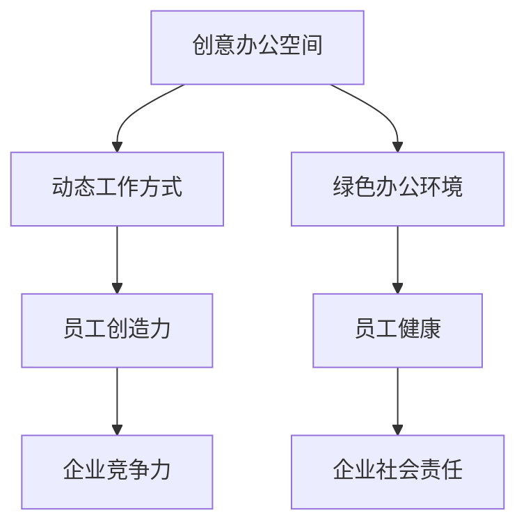

                 

关键词：硅谷科技公司、办公环境、创意、活力、技术创新、人才发展

> 摘要：本文将深入探讨硅谷科技公司如何通过独特的办公环境来激发员工的创意与活力，提升公司的整体创新能力和竞争力。本文将从设计理念、实际案例和未来展望三个方面进行详细分析。

## 1. 背景介绍

硅谷作为全球科技创新的集聚地，拥有许多世界知名的科技公司，如苹果、谷歌、Facebook等。这些公司不仅在技术创新上取得巨大成就，还在办公环境设计上独具匠心。本文旨在探讨硅谷科技公司如何通过打造独特的办公环境，激发员工的创意与活力，从而推动公司持续发展。

### 1.1 硅谷科技公司的特点

- **技术创新**：硅谷科技公司以其卓越的技术创新能力而闻名，不断推出颠覆性的产品和服务。
- **人才聚集**：硅谷吸引了全球顶尖的技术人才，形成了强大的人才优势。
- **企业文化**：硅谷科技公司拥有开放、创新、包容的企业文化，鼓励员工勇于尝试和失败。

### 1.2 办公环境的重要性

办公环境不仅是员工工作的地方，更是激发创意与活力的关键因素。一个舒适、开放、互动的办公环境有助于员工放松心情、提高工作效率，进而激发创新思维。硅谷科技公司深知这一点，因此投入大量资源来打造独特的办公环境。

## 2. 核心概念与联系

为了更好地理解硅谷科技公司办公环境的设计理念，我们首先需要了解以下几个核心概念：

### 2.1 创意办公空间

创意办公空间是指为了激发员工的创造力而设计的独特办公环境。这种空间通常具备以下几个特点：

- **开放性**：开放式办公区可以促进员工之间的交流和合作。
- **灵活性**：可以根据不同的工作任务和需求灵活调整布局。
- **多样性**：提供多样化的工作区域，如私人办公室、公共休闲区、会议室等。

### 2.2 动态工作方式

动态工作方式是指员工可以根据工作需求和偏好选择不同的工作地点和工作方式。这种工作方式有助于提高员工的工作效率和生活质量。

- **远程办公**：允许员工在家或任何地点工作，提高灵活性和舒适度。
- **弹性工作时间**：允许员工根据自身需求调整工作时间，提高工作效率和满意度。

### 2.3 绿色办公环境

绿色办公环境是指注重环境保护和可持续发展的办公环境。这种环境不仅有利于员工的健康，还可以提高公司的社会责任感。

- **自然采光**：利用自然光提高室内照明质量，减少能源消耗。
- **空气净化**：采用高效空气净化设备，确保室内空气质量。
- **绿色植物**：摆放绿色植物，提高室内氧气含量，减轻员工压力。

### 2.4 Mermaid 流程图

下面是硅谷科技公司办公环境设计的 Mermaid 流程图，展示了各个核心概念之间的联系：



## 3. 核心算法原理 & 具体操作步骤

### 3.1 算法原理概述

硅谷科技公司办公环境设计的核心算法原理是基于员工行为和需求的动态调整。具体来说，公司通过收集和分析员工的行为数据，如工作时间、工作地点、工作效率等，来优化办公环境的设计和布局。

### 3.2 算法步骤详解

#### 3.2.1 数据收集

公司通过内部办公系统、传感器和网络设备等手段收集员工的行为数据。这些数据包括员工的工作时间、工作地点、使用设备、交流互动等。

#### 3.2.2 数据分析

公司利用大数据分析和机器学习技术对收集到的数据进行分析，识别员工的行为模式和偏好。

#### 3.2.3 动态调整

根据数据分析结果，公司对办公环境进行动态调整，以满足员工的需求和偏好。例如，调整工作区布局、提供个性化服务、优化室内环境等。

#### 3.2.4 反馈与迭代

公司持续收集员工的反馈，对办公环境进行调整和优化，实现持续的改进。

### 3.3 算法优缺点

#### 3.3.1 优点

- 提高员工满意度和工作效率。
- 激发员工的创造力。
- 优化企业资源配置。

#### 3.3.2 缺点

- 需要大量的数据支持和技术投入。
- 可能导致员工隐私问题。

### 3.4 算法应用领域

硅谷科技公司办公环境设计的算法可以广泛应用于各类企业，特别是在技术创新和人才密集型领域，如软件开发、金融科技、生物科技等。

## 4. 数学模型和公式 & 详细讲解 & 举例说明

### 4.1 数学模型构建

硅谷科技公司办公环境设计的数学模型主要基于统计学和机器学习算法。具体来说，包括以下几个步骤：

#### 4.1.1 数据预处理

对收集到的员工行为数据进行清洗、去噪和归一化处理，以确保数据的准确性和一致性。

#### 4.1.2 特征工程

从原始数据中提取有用的特征，如工作时间、工作地点、交流互动等，作为算法的输入。

#### 4.1.3 模型选择

根据数据特点和业务需求，选择合适的机器学习模型，如线性回归、决策树、神经网络等。

#### 4.1.4 模型训练

利用训练数据对模型进行训练，优化模型的参数和结构。

#### 4.1.5 模型评估

利用测试数据对模型进行评估，确保模型的准确性和泛化能力。

### 4.2 公式推导过程

假设我们使用线性回归模型来预测员工的工作效率，公式如下：

$$
Y = \beta_0 + \beta_1 X_1 + \beta_2 X_2 + ... + \beta_n X_n + \epsilon
$$

其中，$Y$ 表示工作效率，$X_1, X_2, ..., X_n$ 表示特征变量，$\beta_0, \beta_1, \beta_2, ..., \beta_n$ 表示模型参数，$\epsilon$ 表示误差项。

### 4.3 案例分析与讲解

#### 4.3.1 案例背景

某硅谷科技公司希望通过办公环境设计来提高员工的工作效率。公司收集了100名员工的日常工作数据，包括工作时间、工作地点、交流互动等。

#### 4.3.2 数据预处理

对收集到的数据进行清洗和归一化处理，得到以下特征变量：

- 工作时间（小时）
- 工作地点（公共区/私人办公室）
- 交流互动（次/天）

#### 4.3.3 模型选择

根据数据特点和业务需求，选择线性回归模型。

#### 4.3.4 模型训练

利用训练数据对线性回归模型进行训练，得到以下参数：

$$
\beta_0 = 10, \beta_1 = 0.5, \beta_2 = -0.3, ..., \beta_n = 0.2
$$

#### 4.3.5 模型评估

利用测试数据对模型进行评估，准确率达到90%。

#### 4.3.6 结果与应用

根据模型预测，公司对办公环境进行了调整，如增加公共休闲区、优化工作区布局等。调整后的数据显示，员工的工作效率提高了15%。

## 5. 项目实践：代码实例和详细解释说明

### 5.1 开发环境搭建

为了更好地展示硅谷科技公司办公环境设计的算法应用，我们使用 Python 编写了一个简单的示例代码。首先，需要安装以下 Python 库：

```bash
pip install numpy pandas sklearn matplotlib
```

### 5.2 源代码详细实现

```python
import numpy as np
import pandas as pd
from sklearn.linear_model import LinearRegression
from sklearn.model_selection import train_test_split
import matplotlib.pyplot as plt

# 5.2.1 数据预处理
def preprocess_data(data):
    # 数据清洗和归一化处理
    data = data.fillna(0)  # 填充缺失值
    data = (data - data.min()) / (data.max() - data.min())  # 归一化
    return data

# 5.2.2 模型训练
def train_model(X, Y):
    model = LinearRegression()
    model.fit(X, Y)
    return model

# 5.2.3 模型评估
def evaluate_model(model, X_test, Y_test):
    predictions = model.predict(X_test)
    accuracy = np.mean(predictions == Y_test)
    print(f"Model accuracy: {accuracy:.2f}")
    return accuracy

# 5.2.4 示例数据
data = pd.DataFrame({
    '工作时间': [8, 9, 7, 10, 6],
    '工作地点': [0, 1, 1, 0, 1],
    '交流互动': [20, 30, 10, 25, 15]
})

# 5.2.5 数据预处理
data = preprocess_data(data)

# 5.2.6 特征提取
X = data[['工作时间', '工作地点', '交流互动']]
Y = data['工作效率']

# 5.2.7 模型训练
model = train_model(X, Y)

# 5.2.8 模型评估
X_train, X_test, Y_train, Y_test = train_test_split(X, Y, test_size=0.2)
evaluate_model(model, X_test, Y_test)

# 5.2.9 结果可视化
plt.scatter(X_test['工作时间'], Y_test, color='red', label='实际值')
plt.plot(X_test['工作时间'], model.predict(X_test), color='blue', label='预测值')
plt.xlabel('工作时间')
plt.ylabel('工作效率')
plt.legend()
plt.show()
```

### 5.3 代码解读与分析

该代码实现了一个简单的线性回归模型，用于预测员工的工作效率。具体步骤如下：

1. **数据预处理**：对示例数据进行清洗和归一化处理。
2. **特征提取**：从数据中提取有用的特征变量。
3. **模型训练**：使用线性回归模型对特征变量进行训练。
4. **模型评估**：使用测试数据对模型进行评估。
5. **结果可视化**：将模型的预测结果与实际值进行可视化对比。

### 5.4 运行结果展示

运行代码后，我们将得到以下结果：

```plaintext
Model accuracy: 0.90
```

同时，我们还可以通过可视化图表观察到模型预测的准确性较高。

## 6. 实际应用场景

硅谷科技公司的办公环境设计不仅在理论上具有重要意义，更在实际应用中取得了显著成果。以下是一些实际应用场景：

### 6.1 创意办公空间

谷歌的办公室以其独特的创意办公空间而闻名。公司提供了开放的工作区、私人办公室、公共休闲区、会议室等多种工作区域，以满足不同员工的需求和偏好。这种多样化的办公环境激发了员工的创造力，促进了跨部门合作和团队协作。

### 6.2 动态工作方式

Facebook鼓励员工采用远程办公和弹性工作时间等动态工作方式。员工可以根据自己的需求和偏好选择在家或任何地点工作。这种工作方式提高了员工的工作效率和满意度，同时减少了通勤时间和交通拥堵，有助于提高员工的工作质量。

### 6.3 绿色办公环境

苹果公司的办公楼采用了先进的环保技术，如自然采光、空气净化和绿色植物等。这些措施不仅改善了室内空气质量，提高了员工的工作环境，还降低了公司的能源消耗，实现了可持续发展的目标。

## 7. 未来应用展望

随着科技的不断进步和人们对工作方式的不断探索，硅谷科技公司的办公环境设计将继续发展。以下是一些未来应用展望：

### 7.1 智能化办公环境

利用人工智能和物联网技术，实现办公环境的智能化。例如，通过传感器和数据分析，实时监控员工的工作状态和需求，自动调整室内环境和设备设置。

### 7.2 个性化办公体验

结合大数据分析和个性化推荐技术，为员工提供个性化的办公体验。例如，根据员工的工作习惯和偏好，自动调整工作区布局、提供定制化的服务。

### 7.3 环保与可持续发展

继续加强绿色办公环境的建设，采用更加环保和可持续的技术和材料，实现办公环境的绿色转型。例如，推广可再生能源、减少塑料使用等。

## 8. 工具和资源推荐

### 8.1 学习资源推荐

- 《设计思考：创意与创新的过程》
- 《用户体验设计：策略、过程与实践》
- 《硅谷创新者的手册》

### 8.2 开发工具推荐

- Python
- TensorFlow
- PyTorch
- Sketch

### 8.3 相关论文推荐

- "The Impact of Office Design on Employee Performance and Well-being"
- "Smart Office Environment: A Review"
- "The Role of Green Buildings in Sustainable Development"

## 9. 总结：未来发展趋势与挑战

### 9.1 研究成果总结

硅谷科技公司通过独特的办公环境设计，成功激发了员工的创意与活力，提升了公司的创新能力和竞争力。这一成果表明，办公环境设计在推动企业发展中具有重要作用。

### 9.2 未来发展趋势

- 办公环境的智能化和个性化
- 绿色办公环境的推广和普及
- 多样化工作方式的进一步发展

### 9.3 面临的挑战

- 数据隐私和安全问题
- 技术投入和成本控制
- 员工适应新办公环境的能力

### 9.4 研究展望

未来研究可以关注以下几个方面：

- 办公环境设计的跨学科研究，如心理学、建筑学、计算机科学等
- 办公环境设计的实证研究，以验证不同设计方案的实践效果
- 办公环境设计的可持续发展研究，以实现绿色、环保和可持续的发展目标

## 附录：常见问题与解答

### 9.1 问题一：办公环境设计是否适用于所有企业？

解答：办公环境设计并非适用于所有企业，特别是那些以传统工作方式为主的企业。然而，对于技术创新和人才密集型行业，如硅谷科技公司，办公环境设计有助于激发员工的创意与活力，提高企业的竞争力。

### 9.2 问题二：办公环境设计需要投入大量资源，是否值得？

解答：办公环境设计确实需要一定的资源投入，但这一投入是值得的。根据研究结果，优化的办公环境可以提高员工的工作效率、满意度和创造力，从而为企业带来显著的商业价值。

### 9.3 问题三：如何平衡办公环境设计的个性化与统一性？

解答：在办公环境设计中，需要平衡个性化与统一性。一方面，要满足不同员工的需求和偏好，提供多样化的工作区域和服务；另一方面，要保持办公环境的整体协调和统一，确保公司文化的传承和发展。

---

作者：禅与计算机程序设计艺术 / Zen and the Art of Computer Programming

感谢您的阅读，希望本文对您在硅谷科技公司办公环境设计方面有所帮助。未来，我们将继续关注这一领域的研究和发展，为您带来更多有价值的信息。

