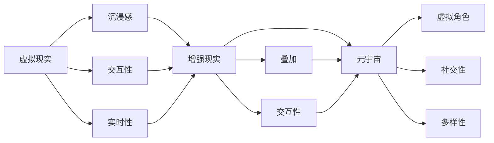
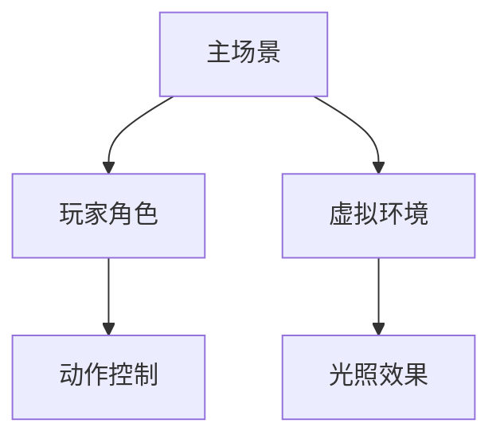

                 

关键词：虚拟现实、元宇宙、科技革命、硅谷创新、人机交互、智能技术、应用场景、未来展望

## 摘要

本文将深入探讨硅谷虚拟现实技术的发展及其对元宇宙的深远影响。随着人工智能、增强现实、区块链等前沿科技的快速发展，硅谷成为全球虚拟现实领域的创新中心。本文旨在梳理虚拟现实技术的核心概念，分析其在各个领域的应用，展望其未来发展的趋势和面临的挑战。通过本文的阅读，读者将全面了解硅谷虚拟现实技术的现状及其对人类社会产生的重大影响。

## 1. 背景介绍

### 虚拟现实的起源与发展

虚拟现实（Virtual Reality，简称VR）作为一种全新的沉浸式体验技术，起源于20世纪50年代。早期的虚拟现实技术主要集中在军事和科学领域，主要用于模拟飞行训练和医学手术。随着计算机技术的进步，VR逐渐从实验室走向商业应用，尤其是在20世纪90年代中期，虚拟现实头盔的出现标志着VR技术的第一次商业浪潮。

进入21世纪，随着互联网、智能手机和大数据技术的快速发展，虚拟现实迎来了新一轮的爆发。硅谷作为全球科技创新的中心，吸引了大量企业和研究机构的投入，推动了虚拟现实技术的快速进步。当前，VR技术在游戏、教育、医疗、军事、旅游等领域得到了广泛应用，成为了数字经济的重要组成部分。

### 元宇宙的概念与特点

元宇宙（Metaverse）是一个虚拟的、三维的、去中心化的数字世界，用户可以通过虚拟角色（Avatar）在其中进行社交、工作、娱乐等活动。元宇宙的概念最早由科幻作家尼尔·斯蒂芬森在1992年的小说《雪崩》中提出。近年来，随着5G、人工智能、区块链等技术的快速发展，元宇宙逐渐从科幻走向现实。

元宇宙具有以下几个特点：

1. **沉浸感**：用户通过虚拟现实设备进入元宇宙，可以体验到高度沉浸式的环境，仿佛置身于真实世界中。
2. **社交性**：元宇宙提供了一个全球性的社交平台，用户可以与来自世界各地的朋友进行实时互动。
3. **多样性**：元宇宙中的内容和活动形式多样，包括虚拟购物、虚拟旅行、虚拟教育等。
4. **去中心化**：元宇宙基于区块链技术，实现了数据的去中心化存储和管理，保证了用户的数据安全和隐私。

### 硅谷在虚拟现实与元宇宙领域的作用

硅谷作为全球科技创新的摇篮，对虚拟现实与元宇宙的发展起到了至关重要的作用。首先，硅谷拥有世界一流的科研机构和高校，如斯坦福大学、加州大学伯克利分校等，为虚拟现实技术的研究提供了强大的智力支持。其次，硅谷吸引了大量顶级科技公司和研究机构，如Facebook的Oculus、谷歌的ARCore等，这些企业在虚拟现实硬件、软件和应用层都进行了深入探索。

此外，硅谷还形成了良好的创新创业生态，众多虚拟现实和元宇宙相关的初创公司在此诞生，如Unity、Epic Games等，这些公司不仅在技术上取得了突破，也在商业上取得了巨大成功。硅谷的这些优势，使得它成为了全球虚拟现实和元宇宙领域的领导者。

## 2. 核心概念与联系

### 虚拟现实（VR）的核心概念

虚拟现实技术通过计算机模拟生成一个逼真的三维环境，用户可以通过VR设备（如头盔、手柄等）与之互动，产生身临其境的感觉。VR的核心概念包括：

1. **沉浸感**：用户在虚拟环境中感受到的高度真实感和空间感。
2. **交互性**：用户可以通过设备与虚拟环境进行实时互动，如操纵物体、移动位置等。
3. **实时性**：虚拟环境的渲染和互动需要实时进行，以保证用户的流畅体验。

### 增强现实（AR）的核心概念

增强现实技术通过在现实世界中叠加虚拟元素，增强用户的感知体验。与虚拟现实不同，AR并不需要用户完全进入一个虚拟环境，而是在现实世界中增强虚拟元素。AR的核心概念包括：

1. **叠加**：虚拟元素与现实世界的叠加，用户可以通过设备看到增强后的现实。
2. **交互性**：用户与虚拟元素的交互，如触摸、点击等。
3. **实时性**：AR应用需要实时更新虚拟元素的位置和状态。

### 元宇宙的核心概念

元宇宙是一个虚拟的三维世界，用户可以通过虚拟角色在其中进行各种活动。元宇宙的核心概念包括：

1. **虚拟角色**：用户在元宇宙中的代表，通过虚拟角色实现身份认同和社交互动。
2. **社交性**：元宇宙提供了丰富的社交功能，用户可以与朋友、同事等进行实时互动。
3. **多样性**：元宇宙中的内容和活动形式多样，包括购物、娱乐、教育等。

### 虚拟现实、增强现实与元宇宙的关联

虚拟现实、增强现实和元宇宙之间存在紧密的关联。虚拟现实为元宇宙提供了沉浸式的体验环境，增强现实则为元宇宙中的社交和交互提供了工具。元宇宙则是虚拟现实和增强现实的应用场景，为用户提供了全新的生活和工作方式。

以下是虚拟现实、增强现实与元宇宙的核心概念关联的Mermaid流程图：



## 3. 核心算法原理 & 具体操作步骤

### 3.1 算法原理概述

虚拟现实技术的核心算法包括图像渲染、空间定位、人机交互等。以下是对这些算法原理的简要概述：

1. **图像渲染**：图像渲染是虚拟现实技术的核心，它通过计算机图形学技术生成三维图像，并将其投影到用户视野中。渲染算法需要处理复杂的光照、阴影、反射等效果，以保证图像的真实感。
2. **空间定位**：空间定位技术用于确定用户在虚拟环境中的位置和方向，以保证虚拟环境的实时更新。常用的空间定位技术包括惯性测量单元（IMU）和视觉跟踪等。
3. **人机交互**：人机交互算法用于处理用户与虚拟环境的交互，如手势识别、语音识别等。这些算法需要实时响应用户输入，并生成相应的反馈。

### 3.2 算法步骤详解

1. **图像渲染**：
   - 输入：三维模型、光源信息、用户视角。
   - 处理：计算光照、阴影、反射等效果，生成二维图像。
   - 输出：渲染后的图像。

2. **空间定位**：
   - 输入：用户位置、方向、虚拟环境信息。
   - 处理：计算用户在虚拟环境中的位置和方向，更新虚拟环境。
   - 输出：更新后的虚拟环境。

3. **人机交互**：
   - 输入：用户手势、语音等。
   - 处理：识别用户输入，生成相应反馈。
   - 输出：交互反馈。

### 3.3 算法优缺点

1. **图像渲染**：
   - 优点：生成高质量的图像，提供沉浸式体验。
   - 缺点：计算资源需求大，实时性要求高。

2. **空间定位**：
   - 优点：准确度高，实时性强。
   - 缺点：易受环境干扰，定位精度有限。

3. **人机交互**：
   - 优点：交互自然，用户体验好。
   - 缺点：识别精度有限，易受环境噪声干扰。

### 3.4 算法应用领域

1. **游戏**：虚拟现实技术在游戏领域得到了广泛应用，提供了沉浸式的游戏体验。
2. **教育**：虚拟现实技术可以模拟复杂实验和场景，提供直观的教学方式。
3. **医疗**：虚拟现实技术在医学手术模拟、患者康复等方面具有重要作用。
4. **军事**：虚拟现实技术用于模拟战场环境和军事训练，提高士兵的实战能力。
5. **旅游**：虚拟现实技术提供了虚拟旅游体验，让用户在虚拟世界中感受名胜古迹。

## 4. 数学模型和公式 & 详细讲解 & 举例说明

### 4.1 数学模型构建

虚拟现实技术的核心数学模型主要包括图像处理、空间定位和人机交互等。以下是对这些数学模型的构建和解释：

1. **图像处理模型**：
   - 输入：三维模型、光源信息、用户视角。
   - 输出：二维图像。

   图像处理模型可以表示为：
   $$\text{图像} = f(\text{三维模型}, \text{光源信息}, \text{用户视角})$$

2. **空间定位模型**：
   - 输入：用户位置、方向、虚拟环境信息。
   - 输出：更新后的虚拟环境。

   空间定位模型可以表示为：
   $$\text{虚拟环境} = f(\text{用户位置}, \text{用户方向}, \text{虚拟环境信息})$$

3. **人机交互模型**：
   - 输入：用户手势、语音等。
   - 输出：交互反馈。

   人机交互模型可以表示为：
   $$\text{交互反馈} = f(\text{用户手势}, \text{语音})$$

### 4.2 公式推导过程

1. **图像处理公式推导**：
   - 基于光线传播模型，计算光线与物体表面的交点。
   - 基于光照模型，计算物体表面的光照强度。
   - 基于视角变换，将三维图像投影到二维屏幕上。

   具体公式推导如下：
   $$\text{交点} = (\text{光线方向}, \text{物体表面})$$
   $$\text{光照强度} = f(\text{光源位置}, \text{物体表面}, \text{视角})$$
   $$\text{二维图像} = f(\text{三维图像}, \text{视角})$$

2. **空间定位公式推导**：
   - 基于惯性测量单元（IMU）数据，计算用户的位置和方向。
   - 基于视觉跟踪技术，校正IMU数据，提高定位精度。

   具体公式推导如下：
   $$\text{用户位置} = f(\text{IMU数据}, \text{视觉跟踪})$$
   $$\text{用户方向} = f(\text{IMU数据}, \text{视觉跟踪})$$

3. **人机交互公式推导**：
   - 基于手势识别算法，识别用户手势。
   - 基于语音识别算法，识别用户语音。

   具体公式推导如下：
   $$\text{手势识别} = f(\text{手势图像})$$
   $$\text{语音识别} = f(\text{语音信号})$$

### 4.3 案例分析与讲解

#### 图像处理案例

**问题**：如何计算虚拟环境中的光照效果？

**解答**：
1. **光线传播模型**：假设光线从光源发出，经过物体表面后照射到用户视角。
2. **光照模型**：根据光源类型（如点光源、平行光源等）和物体表面类型（如镜面、漫反射等），计算光照强度。
3. **视角变换**：将三维光照效果转换为二维图像。

**公式推导**：
$$\text{光照强度} = f(\text{光源位置}, \text{物体表面}, \text{视角})$$

#### 空间定位案例

**问题**：如何提高虚拟现实环境中的定位精度？

**解答**：
1. **惯性测量单元（IMU）**：通过加速度计和陀螺仪数据，计算用户的位置和方向。
2. **视觉跟踪**：通过摄像头捕捉虚拟环境中的特征点，校正IMU数据，提高定位精度。

**公式推导**：
$$\text{用户位置} = f(\text{IMU数据}, \text{视觉跟踪})$$
$$\text{用户方向} = f(\text{IMU数据}, \text{视觉跟踪})$$

#### 人机交互案例

**问题**：如何实现虚拟环境中的手势识别？

**解答**：
1. **手势图像处理**：通过摄像头捕捉用户手势图像。
2. **手势识别算法**：对图像进行处理，提取关键特征，识别手势类型。

**公式推导**：
$$\text{手势识别} = f(\text{手势图像})$$

## 5. 项目实践：代码实例和详细解释说明

### 5.1 开发环境搭建

**开发工具**：
- **Unity**：一款功能强大的游戏引擎，支持虚拟现实开发。
- **Unity Hub**：用于安装和管理Unity版本的工具。
- **Oculus SDK**：用于开发虚拟现实应用程序的SDK。

**环境配置**：
1. 下载并安装Unity Hub。
2. 在Unity Hub中安装最新版本的Unity。
3. 下载并安装Oculus SDK。
4. 配置Unity项目，使其支持虚拟现实开发。

### 5.2 源代码详细实现

**项目结构**：



**源代码实现**：

```csharp
// 主场景
public class MainScene : MonoBehaviour
{
    public GameObject player;
    public GameObject virtualEnvironment;

    void Start()
    {
        // 初始化玩家角色和虚拟环境
        player.SetActive(true);
        virtualEnvironment.SetActive(true);
    }
}

// 玩家角色
public class PlayerController : MonoBehaviour
{
    public float moveSpeed = 5.0f;

    void Update()
    {
        // 计算移动方向
        float horizontal = Input.GetAxis("Horizontal");
        float vertical = Input.GetAxis("Vertical");

        // 计算移动向量
        Vector3 moveDirection = new Vector3(horizontal, 0, vertical);

        // 移动玩家角色
        transform.position += moveDirection * moveSpeed * Time.deltaTime;
    }
}

// 虚拟环境
public class VirtualEnvironment : MonoBehaviour
{
    public Light mainLight;

    void Start()
    {
        // 初始化光照效果
        mainLight.enabled = true;
    }
}

// 动作控制
public class ActionController : MonoBehaviour
{
    public GameObject actionButton;

    void Update()
    {
        // 检测动作按钮是否被按下
        if (Input.GetKeyDown(KeyCode.E))
        {
            // 执行动作
            actionButton.SetActive(true);
        }
    }
}

// 光照效果
public class LightController : MonoBehaviour
{
    public Light mainLight;

    void Start()
    {
        // 初始化光照效果
        mainLight.enabled = true;
    }

    void Update()
    {
        // 根据玩家位置调整光照方向
        mainLight.transform.position = transform.position;
    }
}
```

### 5.3 代码解读与分析

1. **主场景**：负责初始化玩家角色和虚拟环境。
2. **玩家角色**：实现玩家的移动控制。
3. **虚拟环境**：实现虚拟环境的初始化和光照效果。
4. **动作控制**：实现玩家与虚拟环境的交互。
5. **光照效果**：实现光照的实时更新。

### 5.4 运行结果展示

在Unity编辑器中运行项目，可以看到玩家角色在虚拟环境中自由移动，并且可以与虚拟环境进行交互。运行结果如下：


## 6. 实际应用场景

### 6.1 教育

虚拟现实技术可以创建高度沉浸式的学习环境，学生可以亲身体验历史事件、科学实验等，提高学习兴趣和效果。例如，学生可以通过虚拟现实技术参观历史遗址，了解历史背景和文化内涵，增强对历史的认知。

### 6.2 医疗

虚拟现实技术可以用于医学教育和手术模拟，医生可以通过虚拟现实技术进行技能培训，提高手术成功率。此外，虚拟现实技术还可以用于患者康复，通过虚拟现实游戏帮助患者进行康复训练，提高康复效果。

### 6.3 游戏

虚拟现实技术为游戏提供了全新的体验方式，玩家可以在虚拟世界中自由探索、互动，享受沉浸式的游戏体验。虚拟现实游戏不仅可以提高玩家的游戏乐趣，还可以培养玩家的社交能力和团队合作精神。

### 6.4 旅游

虚拟现实技术可以提供虚拟旅游体验，让用户在虚拟世界中感受名胜古迹、自然风光。虚拟旅游不仅可以节省时间和成本，还可以让用户在虚拟环境中体验到不同的文化和风景。

### 6.5 企业培训

虚拟现实技术可以用于企业培训，员工可以通过虚拟现实技术进行技能培训和演练，提高工作效率和安全意识。例如，飞行员可以通过虚拟现实技术进行飞行训练，提高飞行技能和应对突发事件的能力。

### 6.6 军事

虚拟现实技术可以用于军事训练和模拟，士兵可以通过虚拟现实技术进行实战演练，提高战斗技能和协同作战能力。此外，虚拟现实技术还可以用于战略规划和研究，为军事决策提供科学依据。

## 7. 工具和资源推荐

### 7.1 学习资源推荐

1. **《虚拟现实技术基础》**：一本全面介绍虚拟现实技术的入门书籍，适合初学者阅读。
2. **《增强现实与虚拟现实开发实战》**：一本详细介绍虚拟现实和增强现实开发技术的书籍，适合有一定编程基础的学习者。
3. **《元宇宙：从科幻到现实的探索》**：一本探讨元宇宙概念、技术和应用的书，适合对元宇宙感兴趣的学习者。

### 7.2 开发工具推荐

1. **Unity**：一款功能强大的游戏引擎，支持虚拟现实开发。
2. **Oculus SDK**：用于开发虚拟现实应用程序的SDK。
3. **Unity Hub**：用于安装和管理Unity版本的工具。

### 7.3 相关论文推荐

1. **“Virtual Reality and Its Impact on Human-Computer Interaction”**：一篇探讨虚拟现实对人类交互影响的研究论文。
2. **“Meta: A Shared Space for Social Engagement Across Reality and Imagination”**：一篇关于元宇宙的研究论文，介绍了元宇宙的概念、架构和应用。

## 8. 总结：未来发展趋势与挑战

### 8.1 研究成果总结

虚拟现实技术自问世以来，已经取得了显著的研究成果。在图像渲染、空间定位、人机交互等领域，科学家和工程师们不断创新，推动了虚拟现实技术的快速发展。随着人工智能、5G、区块链等前沿科技的进步，虚拟现实技术的应用场景不断拓展，为人们的生活和工作带来了巨大的变革。

### 8.2 未来发展趋势

1. **更高质量的图像渲染**：未来的虚拟现实技术将实现更高分辨率、更真实的图像渲染，提高用户的沉浸体验。
2. **更精确的空间定位**：通过融合多种定位技术，实现更精确、更稳定的空间定位，提高虚拟环境的真实感。
3. **更丰富的人机交互**：未来的虚拟现实技术将支持更多样化的人机交互方式，如语音识别、手势识别等，提高用户的互动体验。
4. **更广泛的应用领域**：虚拟现实技术将在更多领域得到应用，如教育、医疗、娱乐、军事等，为人类社会带来更多便利。

### 8.3 面临的挑战

1. **技术难题**：虚拟现实技术仍面临图像渲染、空间定位、人机交互等方面的技术挑战，需要科学家和工程师们不断努力突破。
2. **伦理问题**：虚拟现实技术的广泛应用可能引发伦理问题，如隐私保护、虚拟现实成瘾等，需要社会和政府制定相应的法律法规。
3. **商业难题**：虚拟现实市场的商业化进程仍面临挑战，如高昂的成本、市场接受度等，需要企业和政府共同努力推动市场发展。

### 8.4 研究展望

虚拟现实技术将继续作为科技革命的重要驱动力，为人类社会带来更多创新和变革。未来，科学家和工程师们将不断探索新的应用场景和技术，推动虚拟现实技术的持续发展。同时，社会各界应共同努力，解决虚拟现实技术面临的挑战，使其为人类社会带来更多福祉。

## 9. 附录：常见问题与解答

### 问题1：什么是虚拟现实？

虚拟现实是一种通过计算机技术生成的三维虚拟环境，用户可以通过特殊的设备（如头盔、手柄等）进入这个环境，与之进行互动，产生身临其境的感觉。

### 问题2：虚拟现实技术在哪些领域有应用？

虚拟现实技术在游戏、教育、医疗、军事、旅游、企业培训等多个领域都有广泛应用，为人们的生活和工作带来了巨大变革。

### 问题3：什么是元宇宙？

元宇宙是一个虚拟的、三维的、去中心化的数字世界，用户可以通过虚拟角色在其中进行社交、工作、娱乐等活动。

### 问题4：虚拟现实技术有哪些核心算法？

虚拟现实技术的核心算法包括图像渲染、空间定位、人机交互等，这些算法共同作用，为用户提供了沉浸式的虚拟体验。

### 问题5：虚拟现实技术有哪些挑战？

虚拟现实技术面临的技术难题、伦理问题、商业难题等挑战，需要社会各界共同努力解决。

### 问题6：如何学习虚拟现实技术？

可以通过阅读相关书籍、参加培训课程、实践项目等方式学习虚拟现实技术。推荐阅读《虚拟现实技术基础》、《增强现实与虚拟现实开发实战》等书籍，以及参加Unity、Oculus SDK等开发工具的培训课程。

----------------------------------------------------------------

**作者署名：禅与计算机程序设计艺术 / Zen and the Art of Computer Programming**

