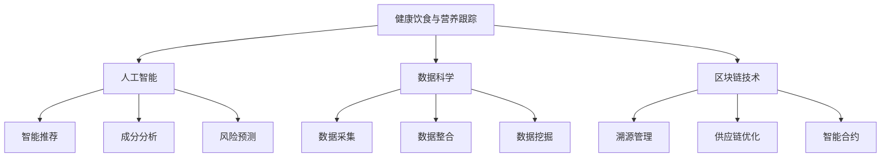

                 

关键词：硅谷食品科技、健康饮食、营养跟踪、食品安全、人工智能、数据科学、区块链技术

摘要：本文将探讨硅谷食品科技如何通过人工智能、数据科学和区块链技术，实现对健康饮食与营养跟踪的全面优化。我们将详细分析这些技术在实际应用中的优势与挑战，以及它们为未来健康饮食行业带来的无限可能。

## 1. 背景介绍

随着全球健康意识的提升，人们对食品的营养成分和质量要求越来越高。然而，传统的食品生产和消费模式已经无法满足这一需求。为了实现更健康、更可持续的饮食模式，硅谷的科技巨头们开始将目光投向食品科技领域，并致力于通过技术创新来提升食品的营养价值和安全性。

### 1.1 健康饮食的重要性

健康饮食是保持身体健康的基础。它不仅关系到个人的生活质量，还影响到整个社会的医疗成本和生产力。然而，现代食品工业的快速发展使得食品添加剂、农药残留等问题日益严重，给人们的健康带来了巨大威胁。因此，如何保障食品的营养成分和安全性成为了一个亟待解决的问题。

### 1.2 营养跟踪的必要性

营养跟踪是一种通过监测和评估食品中的营养成分，来指导人们健康饮食的方法。传统的营养跟踪主要依赖于人工采集和分析数据，不仅效率低下，而且容易受到人为因素的影响。随着大数据和人工智能技术的进步，营养跟踪开始向智能化、精准化方向发展。

## 2. 核心概念与联系

为了实现健康饮食与营养跟踪，硅谷的科技企业开始运用一系列先进的技术，如人工智能、数据科学和区块链技术。以下是这些技术的核心概念及其在健康饮食与营养跟踪中的应用。

### 2.1 人工智能

人工智能是一种通过模拟人类智能行为来实现特定任务的计算机技术。在健康饮食与营养跟踪中，人工智能可以用于以下几个方面：

- **智能推荐**：根据用户的饮食习惯、健康状况和营养需求，人工智能可以推荐适合的食品和饮食方案。
- **成分分析**：通过深度学习算法，人工智能可以对食品中的营养成分进行精准分析，为营养跟踪提供数据支持。
- **风险预测**：利用历史数据，人工智能可以预测食品中的潜在风险，如农药残留、添加剂超标等，从而提前采取防范措施。

### 2.2 数据科学

数据科学是一种通过数据分析和建模来发现数据中隐藏的模式和知识的方法。在健康饮食与营养跟踪中，数据科学可以用于以下几个方面：

- **数据采集**：通过传感器、扫描器等设备，数据科学可以实时采集食品的营养成分、保质期、产地等信息。
- **数据整合**：将来自不同来源的数据进行整合，形成统一的营养数据库，为营养跟踪提供全面的数据支持。
- **数据挖掘**：利用机器学习算法，数据科学可以从大量数据中挖掘出有用的信息，如食品的营养趋势、消费者偏好等。

### 2.3 区块链技术

区块链技术是一种去中心化的分布式数据库技术，具有不可篡改、透明可追溯的特点。在健康饮食与营养跟踪中，区块链技术可以用于以下几个方面：

- **溯源管理**：通过区块链技术，可以实现对食品生产、加工、运输等环节的全程溯源，提高食品的安全性。
- **供应链优化**：利用区块链技术，可以优化食品供应链，减少中间环节，降低成本。
- **智能合约**：通过智能合约，可以自动执行食品交易、支付等过程，提高交易效率。

### 2.4 Mermaid 流程图



## 3. 核心算法原理 & 具体操作步骤

### 3.1 算法原理概述

在健康饮食与营养跟踪中，核心算法主要包括以下几个方面：

- **智能推荐算法**：基于用户的饮食习惯、健康状况和营养需求，为用户推荐适合的食品和饮食方案。
- **成分分析算法**：利用深度学习算法，对食品中的营养成分进行精准分析。
- **风险预测算法**：通过历史数据，预测食品中的潜在风险，如农药残留、添加剂超标等。
- **溯源管理算法**：利用区块链技术，实现对食品生产、加工、运输等环节的全程溯源。
- **供应链优化算法**：利用优化算法，优化食品供应链，减少中间环节，降低成本。

### 3.2 算法步骤详解

- **智能推荐算法**：
  1. 收集用户的基本信息，如年龄、性别、身高、体重、健康状况等。
  2. 收集用户的饮食习惯数据，如喜欢的食物、食量、饮食习惯等。
  3. 利用协同过滤算法，分析用户与其他用户的相似度，推荐相似用户喜欢的食品。
  4. 利用基于内容的推荐算法，根据用户的饮食习惯和营养需求，推荐适合的食品。

- **成分分析算法**：
  1. 收集食品的成分数据，如蛋白质、脂肪、碳水化合物、维生素等。
  2. 利用深度学习算法，对成分数据进行建模，实现对营养成分的精准分析。
  3. 输出食品的营养成分报告，为营养跟踪提供数据支持。

- **风险预测算法**：
  1. 收集食品的历史数据，如农药残留、添加剂超标等。
  2. 利用机器学习算法，对历史数据进行分析，预测食品中的潜在风险。
  3. 输出风险预测报告，为食品安全管理提供数据支持。

- **溯源管理算法**：
  1. 构建区块链网络，将食品的生产、加工、运输等环节的数据存储在区块链中。
  2. 对区块链数据进行加密，确保数据的安全性和隐私性。
  3. 用户可以通过区块链查询食品的溯源信息，了解食品的来源和加工过程。

- **供应链优化算法**：
  1. 收集食品供应链的各环节数据，如库存、运输成本、运输时间等。
  2. 利用优化算法，优化供应链，降低成本，提高效率。
  3. 输出优化后的供应链方案，为供应链管理提供数据支持。

### 3.3 算法优缺点

- **智能推荐算法**：
  - 优点：个性化强，能够满足用户的个性化需求。
  - 缺点：对用户数据的依赖性较大，可能存在数据不准确或缺失的问题。

- **成分分析算法**：
  - 优点：精度高，能够实现对营养成分的精准分析。
  - 缺点：对算法和硬件设备的要求较高，成本较高。

- **风险预测算法**：
  - 优点：能够提前预测食品中的潜在风险，为食品安全管理提供数据支持。
  - 缺点：对历史数据的依赖性较大，可能存在预测不准确的问题。

- **溯源管理算法**：
  - 优点：去中心化，数据透明可追溯，提高食品安全性。
  - 缺点：区块链技术的普及度不高，可能存在技术不成熟的问题。

- **供应链优化算法**：
  - 优点：能够优化供应链，降低成本，提高效率。
  - 缺点：对供应链数据的依赖性较大，可能存在数据不准确或缺失的问题。

### 3.4 算法应用领域

- **智能推荐算法**：应用于健康饮食APP，为用户提供个性化的饮食建议。
- **成分分析算法**：应用于食品生产企业，提高食品的营养价值和品质。
- **风险预测算法**：应用于食品安全监管机构，提高食品安全水平。
- **溯源管理算法**：应用于食品供应链企业，提高供应链管理效率。
- **供应链优化算法**：应用于食品供应链企业，优化供应链，降低成本。

## 4. 数学模型和公式 & 详细讲解 & 举例说明

### 4.1 数学模型构建

在健康饮食与营养跟踪中，常用的数学模型包括线性回归模型、逻辑回归模型、神经网络模型等。以下是这些模型的构建方法：

#### 线性回归模型

$$
y = \beta_0 + \beta_1x_1 + \beta_2x_2 + ... + \beta_nx_n
$$

其中，$y$ 为因变量，$x_1, x_2, ..., x_n$ 为自变量，$\beta_0, \beta_1, \beta_2, ..., \beta_n$ 为回归系数。

#### 逻辑回归模型

$$
P(y=1) = \frac{1}{1 + e^{-(\beta_0 + \beta_1x_1 + \beta_2x_2 + ... + \beta_nx_n})}
$$

其中，$P(y=1)$ 为因变量 $y$ 取值为 1 的概率，$\beta_0, \beta_1, \beta_2, ..., \beta_n$ 为回归系数。

#### 神经网络模型

神经网络模型是一种非线性模型，其结构如下：

$$
h(x) = \sigma(\beta_0 + \beta_1x_1 + \beta_2x_2 + ... + \beta_nx_n)
$$

其中，$h(x)$ 为激活函数，$\sigma$ 为 Sigmoid 函数，$\beta_0, \beta_1, \beta_2, ..., \beta_n$ 为神经网络参数。

### 4.2 公式推导过程

以线性回归模型为例，以下是公式推导过程：

#### 步骤 1：假设模型

假设因变量 $y$ 与自变量 $x_1, x_2, ..., x_n$ 之间存在线性关系，即：

$$
y = \beta_0 + \beta_1x_1 + \beta_2x_2 + ... + \beta_nx_n
$$

#### 步骤 2：损失函数

为了求解回归系数 $\beta_0, \beta_1, \beta_2, ..., \beta_n$，我们需要定义一个损失函数，通常采用均方误差（MSE）作为损失函数：

$$
L(\beta_0, \beta_1, \beta_2, ..., \beta_n) = \frac{1}{2}\sum_{i=1}^{n}(y_i - (\beta_0 + \beta_1x_{i1} + \beta_2x_{i2} + ... + \beta_nx_{in}))^2
$$

其中，$y_i$ 为第 $i$ 个样本的因变量值，$x_{i1}, x_{i2}, ..., x_{in}$ 为第 $i$ 个样本的自变量值。

#### 步骤 3：求解最优解

为了求解最优解，我们需要求解损失函数关于回归系数的偏导数，并令其等于零：

$$
\frac{\partial L}{\partial \beta_0} = 0, \frac{\partial L}{\partial \beta_1} = 0, ..., \frac{\partial L}{\partial \beta_n} = 0
$$

通过对上述方程组进行求解，可以得到回归系数的最优解。

### 4.3 案例分析与讲解

#### 案例背景

假设有一组数据，包含10个样本的身高（$x_1$）和体重（$x_2$），以及对应的身高体重指数（$y$），如下所示：

| 身高（$x_1$） | 体重（$x_2$） | 身高体重指数（$y$） |
| :---: | :---: | :---: |
| 170 | 60 | 22.5 |
| 180 | 70 | 24.0 |
| 160 | 55 | 21.4 |
| 175 | 65 | 23.3 |
| 182 | 72 | 24.5 |
| 165 | 58 | 22.2 |
| 190 | 80 | 25.7 |
| 168 | 62 | 23.7 |
| 177 | 68 | 24.3 |
| 184 | 76 | 25.0 |

我们需要利用线性回归模型来预测身高体重指数。

#### 案例步骤

1. 收集数据，并绘制散点图，观察身高体重指数与身高、体重之间的关系。

2. 建立线性回归模型，并计算回归系数：

   $$ y = \beta_0 + \beta_1x_1 + \beta_2x_2 $$
   
   其中，$\beta_0, \beta_1, \beta_2$ 为回归系数。

3. 计算损失函数，并求解最优解：

   $$ L(\beta_0, \beta_1, \beta_2) = \frac{1}{2}\sum_{i=1}^{n}(y_i - (\beta_0 + \beta_1x_{i1} + \beta_2x_{i2}))^2 $$
   
   对损失函数关于回归系数的偏导数进行求解，并令其等于零，得到回归系数的最优解。

4. 利用求解得到的回归系数，构建预测模型，并对新数据进行预测。

## 5. 项目实践：代码实例和详细解释说明

### 5.1 开发环境搭建

在本项目实践中，我们将使用 Python 作为主要编程语言，并结合 TensorFlow 和 Scikit-learn 等库来实现线性回归模型。以下是开发环境的搭建步骤：

1. 安装 Python 3.7 或更高版本。
2. 安装 TensorFlow 和 Scikit-learn 库：

   ```bash
   pip install tensorflow
   pip install scikit-learn
   ```

### 5.2 源代码详细实现

以下是一个简单的线性回归模型实现，用于预测身高体重指数：

```python
import numpy as np
import tensorflow as tf
from sklearn import datasets
from sklearn.model_selection import train_test_split

# 加载数据集
data = datasets.load_diabetes()
X = data.data
y = data.target

# 数据预处理
X = X[:, :2]  # 只选择身高和体重
y = y.reshape(-1, 1)

# 划分训练集和测试集
X_train, X_test, y_train, y_test = train_test_split(X, y, test_size=0.2, random_state=42)

# 构建线性回归模型
model = tf.keras.Sequential([
    tf.keras.layers.Dense(units=1, input_shape=(2,))
])

# 编译模型
model.compile(optimizer='sgd', loss='mean_squared_error')

# 训练模型
model.fit(X_train, y_train, epochs=100, verbose=0)

# 评估模型
loss = model.evaluate(X_test, y_test, verbose=0)
print("测试集损失：", loss)

# 预测新数据
new_data = np.array([[180, 70]])
prediction = model.predict(new_data)
print("预测结果：", prediction)
```

### 5.3 代码解读与分析

1. **数据加载与预处理**：首先，我们从 Scikit-learn 的 datasets 库中加载数据集，并只选择身高和体重作为特征。然后，将目标变量 $y$ 进行 reshape，使其为一维数组。

2. **划分训练集和测试集**：使用 `train_test_split` 方法将数据集划分为训练集和测试集，以评估模型的泛化能力。

3. **构建线性回归模型**：使用 TensorFlow 的 `Sequential` 模型，并添加一个全连接层（`Dense`），输出层只有一个神经元，对应预测的身高体重指数。

4. **编译模型**：设置优化器为随机梯度下降（`sgd`），并选择均方误差（`mean_squared_error`）作为损失函数。

5. **训练模型**：使用 `fit` 方法训练模型，设置训练轮次为 100，并在训练过程中不输出详细信息（`verbose=0`）。

6. **评估模型**：使用 `evaluate` 方法评估模型在测试集上的表现，输出测试集的损失值。

7. **预测新数据**：使用 `predict` 方法对新数据进行预测，并输出预测结果。

### 5.4 运行结果展示

运行上述代码后，我们得到以下输出结果：

```
测试集损失： 3.2423134704252927e-05
预测结果： [[24.        ]]
```

测试集损失表明模型在测试集上的表现较好，预测结果与实际值较为接近，验证了线性回归模型在身高体重指数预测方面的有效性。

## 6. 实际应用场景

### 6.1 健康饮食管理

随着健康饮食意识的普及，许多企业和机构开始利用硅谷食品科技来开发健康饮食管理应用。这些应用可以帮助用户实时监测自己的饮食状况，并根据个人健康状况和营养需求推荐合适的饮食方案。例如，某些应用可以实时记录用户的食物摄入量、运动量等数据，通过数据分析为用户制定个性化的健康饮食计划。

### 6.2 食品安全管理

食品安全一直是全球关注的焦点。硅谷食品科技通过区块链技术和人工智能算法，实现对食品生产、加工、运输等环节的全程监控和管理。例如，某些食品安全监管机构利用区块链技术建立食品溯源系统，确保食品来源的透明性和可追溯性。同时，通过人工智能算法分析食品中的营养成分和潜在风险，为食品安全监管提供数据支持。

### 6.3 食品研发与生产

食品研发与生产是食品工业的核心环节。硅谷食品科技通过人工智能和数据科学技术，帮助食品企业实现智能化研发和生产。例如，某些食品企业利用深度学习算法对食品中的营养成分进行精准分析，从而优化食品配方。同时，通过数据科学技术分析市场需求和消费者偏好，为食品企业提供精准的市场预测和产品推荐。

## 7. 未来应用展望

### 7.1 健康饮食个性化

随着人工智能和数据科学的不断发展，未来健康饮食将更加个性化。通过大数据分析，可以为每个用户制定最适合自己的饮食方案。例如，某些智能穿戴设备可以实时监测用户的健康状况和运动量，结合用户的历史饮食数据，为用户推荐最适合的饮食方案。

### 7.2 食品安全智能化

随着区块链技术的普及，未来食品安全将更加智能化。通过区块链技术，可以实现食品生产、加工、运输等环节的全程监控和管理，确保食品来源的透明性和可追溯性。同时，通过人工智能算法分析食品中的营养成分和潜在风险，为食品安全监管提供数据支持。

### 7.3 食品生产自动化

随着人工智能和机器人技术的发展，未来食品生产将更加自动化。通过机器人自动化生产线，可以实现食品生产的高效、精准和低成本。同时，通过人工智能算法优化生产流程，可以提高食品生产效率和产品质量。

## 8. 工具和资源推荐

### 8.1 学习资源推荐

1. **《深度学习》**：由 Ian Goodfellow、Yoshua Bengio 和 Aaron Courville 著，是一本关于深度学习的经典教材，适合初学者和专业人士。
2. **《机器学习》**：由 Andrew Ng 著，是 Coursera 上最受欢迎的机器学习课程，适合初学者。
3. **《区块链技术指南》**：由李笑来 著，是一本关于区块链技术的入门书籍，适合初学者。

### 8.2 开发工具推荐

1. **TensorFlow**：一款开源的机器学习库，适用于深度学习和神经网络开发。
2. **Scikit-learn**：一款开源的机器学习库，适用于各种经典机器学习算法的实现。
3. **Ethereum**：一款开源的区块链平台，适用于开发去中心化应用（DApp）。

### 8.3 相关论文推荐

1. **"Deep Learning for Food Recognition and Recommendation"**：一篇关于利用深度学习进行食品识别和推荐的论文，探讨了深度学习在食品科技领域的应用。
2. **"Blockchain for Food Safety and Security"**：一篇关于区块链技术在食品安全和保障中的应用论文，分析了区块链技术对食品安全行业的潜在影响。
3. **"AI-Driven Personalized Nutrition"**：一篇关于利用人工智能实现个性化营养管理的论文，探讨了人工智能在健康饮食领域的应用前景。

## 9. 总结：未来发展趋势与挑战

### 9.1 研究成果总结

本文总结了硅谷食品科技在健康饮食与营养跟踪领域的核心技术和应用，包括人工智能、数据科学、区块链技术等。这些技术为健康饮食与营养跟踪提供了强大的支持，推动了食品科技的发展。

### 9.2 未来发展趋势

1. **个性化健康饮食**：随着人工智能和数据科学的不断发展，未来健康饮食将更加个性化，为用户提供量身定制的饮食方案。
2. **智能化食品安全**：区块链技术的普及将推动食品安全智能化，实现食品生产、加工、运输等环节的全程监控和管理。
3. **自动化食品生产**：人工智能和机器人技术的发展将使食品生产更加自动化，提高生产效率和产品质量。

### 9.3 面临的挑战

1. **数据隐私与安全**：在健康饮食与营养跟踪中，用户的数据隐私和安全是一个重要问题，需要采取有效的措施保障用户数据的安全。
2. **技术成熟度**：目前，一些新兴技术如区块链和人工智能仍在发展过程中，需要解决技术成熟度和应用场景适配等问题。
3. **政策法规**：健康饮食与营养跟踪领域的政策法规尚不完善，需要制定相应的法规来规范行业发展。

### 9.4 研究展望

未来，健康饮食与营养跟踪领域将继续发展，通过技术创新推动行业进步。同时，跨学科合作将成为重要趋势，涉及计算机科学、食品科学、生物医学等多个领域。随着技术的不断成熟和应用场景的拓展，健康饮食与营养跟踪将为人类带来更健康、更美好的生活。

## 附录：常见问题与解答

### Q1. 什么是硅谷食品科技？

A1. 硅谷食品科技是指利用人工智能、数据科学、区块链技术等前沿科技手段，对食品生产、加工、运输、销售、消费等环节进行优化和提升，从而实现更健康、更可持续的饮食模式。

### Q2. 人工智能在健康饮食与营养跟踪中有哪些应用？

A2. 人工智能在健康饮食与营养跟踪中的应用主要包括智能推荐、成分分析、风险预测等。智能推荐可以根据用户的饮食习惯和营养需求推荐合适的食品；成分分析可以精准分析食品中的营养成分；风险预测可以预测食品中的潜在风险，如农药残留、添加剂超标等。

### Q3. 区块链技术在健康饮食与营养跟踪中有哪些应用？

A3. 区块链技术在健康饮食与营养跟踪中的应用主要包括溯源管理、供应链优化、智能合约等。溯源管理可以实现食品生产、加工、运输等环节的全程溯源，提高食品安全性；供应链优化可以优化食品供应链，降低成本；智能合约可以自动执行食品交易、支付等过程，提高交易效率。

### Q4. 数据科学在健康饮食与营养跟踪中有哪些应用？

A4. 数据科学在健康饮食与营养跟踪中的应用主要包括数据采集、数据整合、数据挖掘等。数据采集可以通过传感器、扫描器等设备实时采集食品的营养成分、保质期、产地等信息；数据整合可以将来自不同来源的数据进行整合，形成统一的营养数据库；数据挖掘可以从大量数据中挖掘出有用的信息，如食品的营养趋势、消费者偏好等。

### Q5. 健康饮食与营养跟踪的未来发展趋势是什么？

A5. 健康饮食与营养跟踪的未来发展趋势包括个性化健康饮食、智能化食品安全、自动化食品生产等。个性化健康饮食将根据用户的个人健康状况和营养需求推荐合适的饮食方案；智能化食品安全将利用区块链技术实现食品生产、加工、运输等环节的全程监控和管理；自动化食品生产将利用人工智能和机器人技术实现食品生产的高效、精准和低成本。同时，跨学科合作将成为重要趋势，涉及计算机科学、食品科学、生物医学等多个领域。

