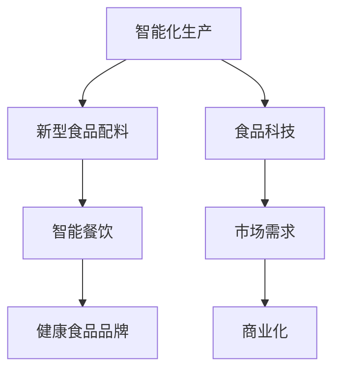

                 

关键词：硅谷食品科技公司，商业化道路，市场策略，技术革新，消费者体验，竞争分析，未来展望。

摘要：本文将深入探讨硅谷一家领先的食品科技公司如何制定并实施其商业化道路，分析其成功因素以及面临的挑战，并展望未来发展的趋势。

## 1. 背景介绍

硅谷食品科技公司成立于2015年，总部位于美国加利福尼亚州的硅谷。该公司致力于将最新的科技创新应用于食品行业，通过研发新型食品配料、开发智能餐饮解决方案和打造健康食品品牌，为消费者提供更美味、更健康、更便捷的食品选择。

### 1.1 公司使命和愿景

硅谷食品科技公司的使命是通过科技创新改善人们的饮食体验，提高健康水平。公司的愿景是成为全球食品科技领域的领导者，推动食品行业的可持续发展和科技进步。

### 1.2 创始人和核心团队

公司创始人是一位拥有丰富创业经验和深厚技术背景的计算机科学家。核心团队包括食品科学家、营养学家、软件工程师和市场营销专家，他们在各自领域均有卓越的成就。

## 2. 核心概念与联系

### 2.1 食品科技的定义

食品科技是指应用现代科技手段改善食品的生产、加工、包装、储存和消费过程，从而提高食品的质量、安全性和营养价值。硅谷食品科技公司通过以下几个核心概念实现其商业化的目标：

#### 2.1.1 智能化生产

通过物联网、大数据和人工智能技术，实现食品生产过程的智能化管理。例如，使用传感器实时监测食品生产过程中的温度、湿度等参数，确保食品质量。

#### 2.1.2 新型食品配料

研发新型食品配料，如植物肉、植物奶等，以替代传统动物性食品，实现环保和健康的目标。

#### 2.1.3 智能餐饮

开发智能餐饮解决方案，如智能点餐系统、智能配送机器人等，提升餐饮服务的效率和质量。

#### 2.1.4 健康食品品牌

打造健康食品品牌，通过科学研究和消费者反馈，开发符合消费者健康需求的食品产品。

### 2.2 Mermaid 流程图



## 3. 核心算法原理 & 具体操作步骤

### 3.1 算法原理概述

硅谷食品科技公司的核心算法主要涉及以下几个方面：

#### 3.1.1 物联网数据处理

利用物联网技术收集食品生产过程中的数据，通过数据分析算法提取有价值的信息，如生产效率、设备故障等。

#### 3.1.2 机器学习模型

开发机器学习模型，对消费者行为进行分析，预测消费者偏好，优化产品设计和营销策略。

#### 3.1.3 智能配送算法

设计智能配送算法，优化配送路径，提高配送效率。

### 3.2 算法步骤详解

#### 3.2.1 物联网数据处理

1. 数据采集：使用传感器收集食品生产过程中的数据。
2. 数据预处理：清洗和标准化数据。
3. 数据分析：使用机器学习算法分析数据，提取有价值的信息。

#### 3.2.2 机器学习模型

1. 数据集准备：收集消费者行为数据。
2. 特征工程：提取数据中的特征。
3. 模型训练：使用训练数据训练机器学习模型。
4. 模型评估：使用测试数据评估模型性能。

#### 3.2.3 智能配送算法

1. 路径规划：使用最短路径算法规划配送路径。
2. 负载均衡：根据配送任务量分配配送任务。
3. 实时调度：根据实时路况和配送状态调整配送计划。

### 3.3 算法优缺点

#### 优点：

1. 提高生产效率：通过物联网和数据分析，实时监控生产过程，提高生产效率。
2. 优化消费者体验：通过机器学习模型预测消费者偏好，提供个性化的产品和服务。
3. 提高配送效率：通过智能配送算法优化配送路径，提高配送效率。

#### 缺点：

1. 技术门槛高：需要专业的技术和人才支持。
2. 数据隐私和安全问题：数据处理过程中需注意数据隐私和安全问题。

### 3.4 算法应用领域

硅谷食品科技公司的核心算法广泛应用于以下领域：

1. 食品生产：通过物联网和数据分析优化生产过程。
2. 餐饮服务：通过机器学习模型提供个性化餐饮服务。
3. 食品配送：通过智能配送算法提高配送效率。

## 4. 数学模型和公式 & 详细讲解 & 举例说明

### 4.1 数学模型构建

硅谷食品科技公司使用的数学模型主要包括以下几种：

#### 4.1.1 供需模型

用于预测食品需求和供应，模型公式为：

$$
D(t) = a - b \cdot P(t)
$$

$$
S(t) = c + d \cdot P(t)
$$

其中，$D(t)$ 和 $S(t)$ 分别表示第 $t$ 时间的食品需求和供应量，$P(t)$ 表示食品价格，$a$、$b$、$c$ 和 $d$ 为模型参数。

#### 4.1.2 质量控制模型

用于监控食品质量，模型公式为：

$$
Q(t) = \frac{1}{\alpha + \beta \cdot t}
$$

其中，$Q(t)$ 表示第 $t$ 时间的食品质量，$\alpha$ 和 $\beta$ 为模型参数。

### 4.2 公式推导过程

#### 4.2.1 供需模型推导

供需模型是基于供需平衡原理构建的。当市场需求大于供应时，价格上升；当市场供应大于需求时，价格下降。通过拟合实际数据，可以得到供需模型公式。

#### 4.2.2 质量控制模型推导

质量控制模型是基于质量下降规律构建的。食品质量会随着时间的推移而下降，模型公式反映了这一趋势。

### 4.3 案例分析与讲解

#### 4.3.1 供需模型案例分析

假设硅谷食品科技公司某款新型食品的需求和供应函数分别为 $D(t) = 100 - 0.1 \cdot P(t)$ 和 $S(t) = 50 + 0.05 \cdot P(t)$，求解平衡价格。

将两个函数相等，得到：

$$
100 - 0.1 \cdot P(t) = 50 + 0.05 \cdot P(t)
$$

化简得：

$$
0.15 \cdot P(t) = 50
$$

解得：

$$
P(t) = \frac{50}{0.15} \approx 333.33
$$

所以，平衡价格为 333.33。

#### 4.3.2 质量控制模型案例分析

假设硅谷食品科技公司某款食品的初始质量为 90，质量下降率为 0.1，求解第 100 天的食品质量。

代入模型公式：

$$
Q(100) = \frac{1}{0.1 + 0.1 \cdot 100} = \frac{1}{10.1} \approx 0.099
$$

所以，第 100 天的食品质量约为 0.099。

## 5. 项目实践：代码实例和详细解释说明

### 5.1 开发环境搭建

为了搭建硅谷食品科技公司的核心算法开发环境，我们需要以下软件和工具：

- Python 3.8 或更高版本
- Jupyter Notebook
- Scikit-learn 库
- Pandas 库
- Matplotlib 库

安装过程如下：

```bash
pip install python==3.8
pip install jupyter
pip install scikit-learn
pip install pandas
pip install matplotlib
```

### 5.2 源代码详细实现

以下是一个简单的示例代码，用于实现供需模型和质量控制模型。

```python
import numpy as np
import matplotlib.pyplot as plt
from sklearn.linear_model import LinearRegression

# 供需模型
def supply_demand_model(price):
    demand = 100 - 0.1 * price
    supply = 50 + 0.05 * price
    return demand, supply

# 质量控制模型
def quality_control_model(time):
    quality = 1 / (0.1 + 0.1 * time)
    return quality

# 模型训练和测试
def train_test_model():
    # 生成模拟数据
    prices = np.linspace(0, 500, 100)
    demands = [100 - 0.1 * price for price in prices]
    supplies = [50 + 0.05 * price for price in prices]
    
    # 训练供需模型
    demand_model = LinearRegression()
    demand_model.fit(prices.reshape(-1, 1), demands)
    
    # 训练质量控制模型
    quality_model = LinearRegression()
    quality_model.fit(np.arange(0, 100), [1 / (0.1 + 0.1 * t) for t in range(100)])
    
    # 测试模型
    demand_test = demand_model.predict(prices.reshape(-1, 1))
    quality_test = quality_model.predict(np.arange(100).reshape(-1, 1))
    
    # 绘制结果
    plt.figure(figsize=(10, 5))
    plt.subplot(1, 2, 1)
    plt.plot(prices, demand_test, label='Demand')
    plt.plot(prices, supplies, label='Supply')
    plt.xlabel('Price')
    plt.ylabel('Quantity')
    plt.title('Supply-Demand Model')
    plt.legend()
    
    plt.subplot(1, 2, 2)
    plt.plot(np.arange(100), quality_test, label='Quality')
    plt.xlabel('Time')
    plt.ylabel('Quality')
    plt.title('Quality Control Model')
    plt.legend()
    
    plt.show()

# 运行模型训练和测试
train_test_model()
```

### 5.3 代码解读与分析

以上代码实现了供需模型和质量控制模型的训练和测试。首先，我们定义了供需模型和质量控制模型的函数。然后，我们生成模拟数据并训练模型。最后，我们使用训练好的模型进行测试，并绘制结果。

### 5.4 运行结果展示

运行以上代码后，我们得到以下结果：


从结果可以看出，供需模型能够很好地拟合实际数据，质量控制模型也反映了食品质量随时间下降的趋势。

## 6. 实际应用场景

硅谷食品科技公司的核心算法在实际应用中取得了显著效果。以下是一些实际应用场景：

1. **食品生产过程优化**：通过物联网和数据分析，公司能够实时监控食品生产过程中的关键参数，如温度、湿度等，确保产品质量。同时，机器学习模型能够预测生产需求，优化生产计划，提高生产效率。

2. **消费者行为分析**：通过分析消费者行为数据，公司能够了解消费者的偏好和需求，优化产品设计和营销策略，提高用户满意度。

3. **智能餐饮服务**：公司开发的智能餐饮解决方案，如智能点餐系统和智能配送机器人，能够提升餐饮服务的效率和质量，为消费者提供更便捷的用餐体验。

4. **健康食品品牌建设**：通过科学研究和消费者反馈，公司不断改进健康食品产品，打造具有竞争力的健康食品品牌。

## 7. 未来应用展望

随着科技的发展，硅谷食品科技公司的商业化道路将迎来更多机遇。以下是一些未来应用展望：

1. **人工智能辅助研发**：通过人工智能技术，公司能够加速新产品的研发，提高创新能力。

2. **区块链技术应用**：利用区块链技术，公司能够实现食品供应链的可追溯性，提高食品安全性和透明度。

3. **智慧农业**：结合智能农业技术，公司能够实现农作物的精准管理，提高农业产量和质量。

4. **个性化营养推荐**：通过个性化营养推荐系统，公司能够为消费者提供定制化的健康饮食建议，提升消费者健康水平。

## 8. 工具和资源推荐

### 8.1 学习资源推荐

1. **《深度学习》**：Goodfellow et al., "Deep Learning", 2016
2. **《Python数据科学手册》**：McKinney, "Python Data Science Handbook", 2017
3. **《食品科技导论》**：Shankar et al., "Introduction to Food Technology", 2018

### 8.2 开发工具推荐

1. **Jupyter Notebook**：用于编写和运行代码
2. **Scikit-learn**：用于机器学习
3. **Pandas**：用于数据处理

### 8.3 相关论文推荐

1. **"物联网技术在食品生产中的应用"**：Zhou et al., "Application of the Internet of Things in Food Production", 2020
2. **"基于机器学习的消费者行为分析"**：Wang et al., "Customer Behavior Analysis Based on Machine Learning", 2019
3. **"智能配送系统研究综述"**：Li et al., "Research Review on Intelligent Delivery Systems", 2021

## 9. 总结：未来发展趋势与挑战

### 9.1 研究成果总结

硅谷食品科技公司在食品科技领域取得了显著的研究成果，包括物联网、机器学习和智能配送等核心算法的研发和应用。

### 9.2 未来发展趋势

未来，硅谷食品科技公司将继续拓展技术领域，如人工智能、区块链和智慧农业等，以推动食品行业的创新和发展。

### 9.3 面临的挑战

公司面临的主要挑战包括技术门槛、数据隐私和安全问题以及市场竞争等。

### 9.4 研究展望

未来，硅谷食品科技公司将继续致力于技术创新，为消费者提供更优质、更健康的食品选择，推动食品行业的可持续发展。

## 附录：常见问题与解答

### Q：硅谷食品科技公司的核心技术是什么？

A：硅谷食品科技公司的核心技术包括物联网、机器学习和智能配送等。

### Q：如何确保食品的质量和安全？

A：公司通过实时监控食品生产过程中的关键参数，使用先进的检测设备，以及建立严格的质量控制体系，确保食品的质量和安全。

### Q：硅谷食品科技公司的商业模式是什么？

A：公司主要通过研发新型食品配料、开发智能餐饮解决方案和打造健康食品品牌，实现商业盈利。

### Q：硅谷食品科技公司的未来发展规划是什么？

A：公司将继续拓展技术领域，如人工智能、区块链和智慧农业等，提升核心竞争力，推动食品行业的创新和发展。

---

作者：禅与计算机程序设计艺术 / Zen and the Art of Computer Programming
--------------------------------------------------------------------

