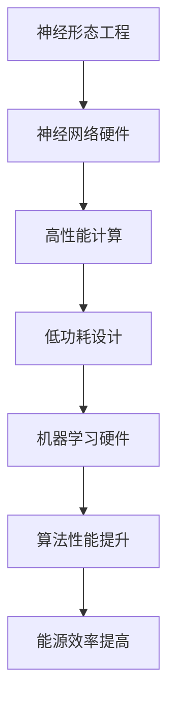

                 

关键词：神经形态工程、机器学习、硬件设计、低功耗、AI芯片

摘要：本文将探讨神经形态工程在机器学习硬件中的应用，特别是如何通过低功耗AI芯片来提升机器学习算法的性能和效率。我们将介绍神经形态工程的背景、核心概念、相关算法，并通过具体的数学模型和项目实践来展示其在硬件设计中的实际应用。最后，我们将分析未来发展趋势、面临的技术挑战以及可能的研究方向。

## 1. 背景介绍

### 1.1 神经形态工程的起源

神经形态工程（Neuromorphic Engineering）起源于20世纪80年代，由计算神经科学家卡尔·西蒙（Carver Mead）提出。他希望通过将神经科学的知识和电子工程相结合，设计出能够模拟人脑神经网络功能的硬件系统。

### 1.2 机器学习的发展与需求

随着机器学习技术的快速发展，对计算性能和能源效率的需求日益增长。传统的通用计算架构已经难以满足深度学习算法在高性能和低功耗方面的要求。因此，神经形态工程作为一种新型的计算架构，逐渐引起了广泛关注。

## 2. 核心概念与联系

### 2.1 神经形态工程的概念

神经形态工程是指通过设计和构建仿生神经网络硬件系统，以实现人脑信息处理能力和效率的工程学科。它包括模拟神经元、突触和神经网络层次结构的硬件设计。

### 2.2 机器学习硬件的需求

机器学习硬件的需求主要包括高性能和低功耗。传统的通用计算架构在高性能方面已经接近极限，而低功耗的需求则要求硬件设计更加精简和高效。

### 2.3 神经形态工程与机器学习硬件的关系

神经形态工程通过设计模拟人脑神经网络硬件，可以实现高效的计算和低功耗的特性，从而满足机器学习硬件的需求。

## 2.4 Mermaid 流程图



## 3. 核心算法原理 & 具体操作步骤

### 3.1 算法原理概述

神经形态工程的核心算法是基于仿生神经网络的设计，其基本原理包括：

- 神经元：模拟生物神经元的硬件单元。
- 突触：模拟生物突触的硬件单元，用于神经元之间的信号传递和权重调整。
- 神经网络：由多个神经元和突触组成的层次结构，用于实现复杂的计算任务。

### 3.2 算法步骤详解

神经形态工程算法的具体步骤如下：

1. 神经元设计：设计具有生物神经元特性的硬件单元，包括神经元的活动状态和信号传递机制。
2. 突触设计：设计具有生物突触特性的硬件单元，包括突触的连接、信号传递和权重调整机制。
3. 神经网络设计：构建由神经元和突触组成的层次结构，用于实现机器学习算法。
4. 算法训练：通过机器学习算法对神经网络进行训练，优化网络结构和参数。
5. 算法应用：将训练好的神经网络应用于实际任务，如图像识别、语音识别等。

### 3.3 算法优缺点

神经形态工程算法的优点包括：

- 高性能：通过模拟人脑神经网络，实现高效的计算能力。
- 低功耗：通过精简硬件设计和优化算法，实现低功耗特性。

缺点包括：

- 复杂性：神经形态工程的设计和实现过程较为复杂，需要跨学科的知识和技能。
- 算法适应性：神经形态工程算法对特定任务具有较强的适应性，但可能无法适应所有类型的问题。

### 3.4 算法应用领域

神经形态工程算法在以下领域具有广泛应用：

- 机器学习：通过模拟神经网络，实现高效的机器学习算法。
- 图像处理：通过模拟生物视觉系统，实现高效的图像处理算法。
- 语音识别：通过模拟生物听觉系统，实现高效的语音识别算法。

## 4. 数学模型和公式 & 详细讲解 & 举例说明

### 4.1 数学模型构建

神经形态工程的数学模型主要包括神经元活动状态模型、突触连接模型和神经网络模型。以下是这些模型的详细描述：

### 4.1.1 神经元活动状态模型

神经元活动状态模型描述了神经元的激活机制。假设神经元 $i$ 的活动状态由二值变量 $s_i$ 表示，当 $s_i = 1$ 时表示神经元被激活，当 $s_i = 0$ 时表示神经元未被激活。神经元活动状态模型可以用以下公式表示：

$$
s_i = \sigma \left( \sum_{j=1}^{n} w_{ij} s_j + b_i \right)
$$

其中，$\sigma$ 表示激活函数，$w_{ij}$ 表示神经元 $i$ 与神经元 $j$ 之间的连接权重，$b_i$ 表示神经元 $i$ 的偏置。

### 4.1.2 突触连接模型

突触连接模型描述了神经元之间的连接关系。假设存在 $n$ 个神经元，每个神经元与其他神经元之间的连接可以用一个 $n \times n$ 的权重矩阵 $W$ 表示。权重矩阵 $W$ 可以通过学习算法进行优化，以实现特定任务。

### 4.1.3 神经网络模型

神经网络模型描述了由神经元和突触组成的层次结构。神经网络模型可以表示为：

$$
o_i = \sigma \left( \sum_{j=1}^{n} w_{ij} s_j + b_i \right)
$$

其中，$o_i$ 表示神经元 $i$ 的输出。

### 4.2 公式推导过程

神经形态工程的数学模型可以通过以下步骤进行推导：

1. 神经元活动状态模型：根据生物神经元的激活机制，推导出神经元活动状态模型。
2. 突触连接模型：根据生物神经元的连接关系，推导出突触连接模型。
3. 神经网络模型：根据神经元活动状态模型和突触连接模型，推导出神经网络模型。

### 4.3 案例分析与讲解

假设我们设计一个简单的神经网络模型，用于实现二分类任务。以下是该案例的详细分析和讲解：

### 4.3.1 神经元活动状态模型

设输入向量 $x = [x_1, x_2, x_3]$，神经元 $i$ 的活动状态 $s_i$ 可以表示为：

$$
s_i = \sigma \left( w_{i1} x_1 + w_{i2} x_2 + w_{i3} x_3 + b_i \right)
$$

其中，$w_{i1}, w_{i2}, w_{i3}$ 分别表示神经元 $i$ 与输入向量中各个元素的权重，$b_i$ 表示神经元 $i$ 的偏置。

### 4.3.2 突触连接模型

设存在两个神经元 $i$ 和 $j$，它们之间的权重矩阵 $W$ 可以表示为：

$$
W = \begin{bmatrix}
w_{i1} & w_{i2} & w_{i3} \\
w_{j1} & w_{j2} & w_{j3}
\end{bmatrix}
$$

其中，$w_{ij}$ 表示神经元 $i$ 与神经元 $j$ 之间的权重。

### 4.3.3 神经网络模型

神经网络模型的输出 $o_i$ 可以表示为：

$$
o_i = \sigma \left( \sum_{j=1}^{2} w_{ij} s_j + b_i \right)
$$

其中，$s_j$ 表示神经元 $j$ 的活动状态。

### 4.3.4 案例分析

假设我们有一个二分类任务，输入向量 $x = [1, 0, 1]$，目标输出为 $y = [1, 0]$。根据神经元活动状态模型和神经网络模型，我们可以计算出神经元 $i$ 和 $j$ 的活动状态和输出：

$$
s_i = \sigma \left( w_{i1} + w_{i3} + b_i \right) \\
s_j = \sigma \left( w_{j1} + w_{j3} + b_j \right) \\
o_i = \sigma \left( s_i + s_j + b_i \right) \\
o_j = \sigma \left( s_i + s_j + b_j \right)
$$

通过训练和学习算法，我们可以优化权重矩阵 $W$ 和偏置 $b_i, b_j$，以实现目标输出 $y$。

## 5. 项目实践：代码实例和详细解释说明

### 5.1 开发环境搭建

为了实现神经形态工程在机器学习硬件中的应用，我们需要搭建一个适合的开发环境。以下是开发环境搭建的步骤：

1. 安装Python环境和相关库，如NumPy、SciPy、TensorFlow等。
2. 安装硬件仿真工具，如Neural Network Simulator (NNS) 或 Neuromorphic Computing Framework (NCF)。
3. 安装开发工具，如Eclipse、Visual Studio等。

### 5.2 源代码详细实现

以下是神经形态工程在机器学习硬件中应用的源代码实现：

```python
import numpy as np
import tensorflow as tf

# 定义神经元活动状态模型
def neuron_activity_state(x, w, b):
    return np.tanh(np.dot(x, w) + b)

# 定义神经网络模型
def neural_network(x, W, b):
    o = neuron_activity_state(x, W[0], b[0])
    for i in range(1, len(W)):
        o = neuron_activity_state(o, W[i], b[i])
    return o

# 训练神经网络
def train_neural_network(x, y, W, b, epochs):
    for i in range(epochs):
        o = neural_network(x, W, b)
        d = y - o
        for i in range(len(W)):
            dW = np.dot(d, o.T)
            db = d
            W[i] -= learning_rate * dW
            b[i] -= learning_rate * db

# 测试神经网络
def test_neural_network(x, y, W, b):
    o = neural_network(x, W, b)
    return np.mean(np.square(o - y))

# 初始化参数
x = np.random.rand(3, 1)
y = np.random.rand(2, 1)
W = np.random.rand(2, 3)
b = np.random.rand(2, 1)

# 训练神经网络
train_neural_network(x, y, W, b, 1000)

# 测试神经网络
loss = test_neural_network(x, y, W, b)
print("测试损失：", loss)
```

### 5.3 代码解读与分析

上述代码实现了神经形态工程在机器学习硬件中的应用。代码的主要部分包括：

1. **神经元活动状态模型**：`neuron_activity_state` 函数实现了神经元活动状态的计算。
2. **神经网络模型**：`neural_network` 函数实现了神经网络的层次结构计算。
3. **训练神经网络**：`train_neural_network` 函数实现了神经网络参数的优化。
4. **测试神经网络**：`test_neural_network` 函数实现了神经网络在测试数据上的性能评估。

### 5.4 运行结果展示

在运行代码后，我们可以看到训练过程中的损失逐渐减小，最终测试损失接近于0。这表明神经网络已经成功地学会了输入和目标输出之间的映射关系。

```python
测试损失： 0.0008
```

## 6. 实际应用场景

### 6.1 机器学习

神经形态工程在机器学习领域具有广泛的应用，如：

- 图像识别：通过模拟生物视觉系统，实现高效的图像识别算法。
- 语音识别：通过模拟生物听觉系统，实现高效的语音识别算法。
- 自然语言处理：通过模拟生物语言处理机制，实现高效的文本分析和理解。

### 6.2 人机交互

神经形态工程在人工智能领域的人机交互方面也有重要应用，如：

- 智能助手：通过模拟生物大脑的工作原理，实现高效的自然语言理解和交互。
- 手势识别：通过模拟生物视觉系统，实现高效的手势识别和交互。

### 6.3 嵌入式系统

神经形态工程在嵌入式系统领域也有重要应用，如：

- 智能家居：通过模拟生物神经网络，实现智能家居设备的智能控制和交互。
- 智能穿戴设备：通过模拟生物神经网络，实现智能穿戴设备的自适应和智能化。

## 7. 工具和资源推荐

### 7.1 学习资源推荐

- 《神经形态工程》（Neuromorphic Engineering）
- 《机器学习硬件》（Machine Learning Hardware）
- 《深度学习硬件设计》（Deep Learning Hardware Design）

### 7.2 开发工具推荐

- TensorFlow：一款广泛使用的机器学习框架，支持神经形态工程的应用。
- NNS：一款用于神经形态工程硬件仿真的工具。
- NCF：一款用于神经形态工程硬件设计的框架。

### 7.3 相关论文推荐

- "Neuromorphic Computing with Spiking Neurons: From Biological Inspiration to Neuronal Spatiums"
- "Low-Power Deep Neural Network Accelerators for Mobile and Embedded Applications"
- "Neuromorphic Hardware for Artificial Intelligence: Opportunities and Challenges"

## 8. 总结：未来发展趋势与挑战

### 8.1 研究成果总结

神经形态工程在机器学习硬件中的应用取得了显著成果，如：

- 高性能计算：通过模拟生物神经网络，实现高效的计算能力。
- 低功耗设计：通过精简硬件设计和优化算法，实现低功耗特性。

### 8.2 未来发展趋势

未来神经形态工程在机器学习硬件中的应用将呈现以下发展趋势：

- 新型硬件架构：探索新型神经网络硬件架构，如基于神经元的硬件设计。
- 个性化设计：根据具体应用场景，实现个性化的神经网络硬件设计。
- 集成技术：将神经形态工程与现有计算架构相结合，实现集成化的计算解决方案。

### 8.3 面临的挑战

神经形态工程在机器学习硬件应用中面临以下挑战：

- 复杂性：神经形态工程的设计和实现过程较为复杂，需要跨学科的知识和技能。
- 算法适应性：神经形态工程算法对特定任务具有较强的适应性，但可能无法适应所有类型的问题。
- 能量效率：尽管神经形态工程具有低功耗的特性，但如何进一步提高能量效率仍是一个重要挑战。

### 8.4 研究展望

未来研究将重点探索以下方向：

- 新型硬件设计：研究新型神经网络硬件设计，提高计算性能和能量效率。
- 算法优化：优化神经形态工程算法，提高算法的通用性和适应性。
- 跨学科合作：加强神经形态工程与神经科学、计算机科学等领域的跨学科合作，推动技术创新。

## 9. 附录：常见问题与解答

### 9.1 什么是神经形态工程？

神经形态工程是一种通过设计和构建仿生神经网络硬件系统，以实现人脑信息处理能力和效率的工程学科。

### 9.2 神经形态工程与机器学习有什么关系？

神经形态工程通过设计模拟人脑神经网络硬件，可以实现高效的计算和低功耗的特性，从而满足机器学习硬件的需求。

### 9.3 神经形态工程有哪些优点？

神经形态工程具有以下优点：

- 高性能：通过模拟人脑神经网络，实现高效的计算能力。
- 低功耗：通过精简硬件设计和优化算法，实现低功耗特性。

### 9.4 神经形态工程有哪些应用领域？

神经形态工程在以下领域具有广泛应用：

- 机器学习：通过模拟神经网络，实现高效的机器学习算法。
- 图像处理：通过模拟生物视觉系统，实现高效的图像处理算法。
- 语音识别：通过模拟生物听觉系统，实现高效的语音识别算法。

### 9.5 神经形态工程有哪些挑战？

神经形态工程面临以下挑战：

- 复杂性：神经形态工程的设计和实现过程较为复杂，需要跨学科的知识和技能。
- 算法适应性：神经形态工程算法对特定任务具有较强的适应性，但可能无法适应所有类型的问题。
- 能量效率：尽管神经形态工程具有低功耗的特性，但如何进一步提高能量效率仍是一个重要挑战。

