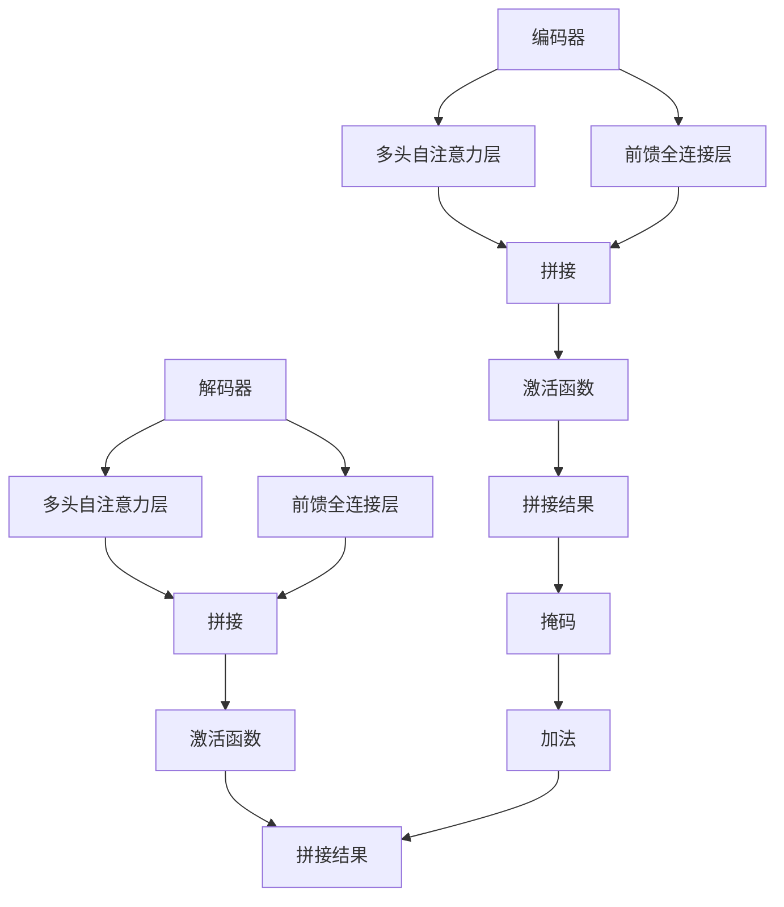

                 

关键词：神经机器翻译、注意力机制、Transformer、深度学习、序列到序列模型

> 摘要：本文将深入探讨神经机器翻译领域的核心概念——注意力机制，以及近年来备受关注的新型神经网络结构——Transformer。通过分析这些技术的原理、实现和应用，我们将了解它们如何推动机器翻译技术的革新，并为未来的发展提供方向。

## 1. 背景介绍

随着互联网和信息技术的迅猛发展，翻译的需求日益增长。然而，传统的机器翻译方法往往依赖于规则匹配和统计模型，这些方法在处理复杂语境和语言现象时存在显著局限。为了克服这些挑战，研究者们开始探索基于深度学习的神经机器翻译方法。

神经机器翻译的核心在于使用神经网络模型对源语言和目标语言进行建模，通过端到端的映射实现翻译。这一方法在2014年左右取得了重大突破，使得机器翻译的准确性大幅提升。然而，尽管神经网络方法在翻译质量上取得了显著进步，但传统的序列到序列（Seq2Seq）模型在处理长文本时仍存在注意力丢失和计算效率低下的问题。

为了解决这些问题，研究者们提出了注意力机制和Transformer模型。注意力机制通过捕捉源语言和目标语言之间的依赖关系，提高了翻译的准确性和流畅性。而Transformer模型则完全摒弃了循环神经网络（RNN）的结构，采用自注意力机制，在处理长序列时展现了卓越的性能。

本文将围绕注意力机制和Transformer模型进行深入探讨，分析它们的原理、实现和应用，为读者提供全面的了解。

## 2. 核心概念与联系

### 2.1. 注意力机制

注意力机制（Attention Mechanism）是一种用于模型之间或者模型内部不同部分之间进行关联的方法，其核心思想是通过学习的方式为模型中的每一个输入元素分配一个权重，这些权重决定了模型在处理输入数据时关注哪些部分。在神经机器翻译中，注意力机制的作用在于捕捉源语言中不同词汇与目标语言中对应词汇之间的依赖关系。

注意力机制的实现可以通过多种方式，常见的有：

- **点积注意力（Dot-Product Attention）**：通过点积计算源语言编码器输出的隐藏状态和目标语言解码器输出的隐藏状态之间的相似度，得到权重向量，然后对这些权重进行加权求和。
- **加性注意力（Additive Attention）**：通过添加一个中间层，将源语言编码器输出的隐藏状态和目标语言解码器输出的隐藏状态进行拼接，然后通过这个中间层计算权重向量。
- **缩放点积注意力（Scaled Dot-Product Attention）**：为了防止点积操作导致的梯度消失问题，引入一个缩放因子，通常为 $1/\sqrt{d_k}$，其中 $d_k$ 是键（keys）的维度。

### 2.2. Transformer模型

Transformer模型是一种基于自注意力机制的深度学习模型，由Vaswani等人于2017年提出。它完全摒弃了传统的循环神经网络（RNN），采用了多头注意力机制和前馈神经网络，在处理长序列时展现了卓越的性能。

Transformer模型的主要组成部分如下：

- **编码器（Encoder）**：由多个编码层堆叠而成，每一层包含两个子层：一个多头自注意力子层和一个前馈全连接子层。
- **解码器（Decoder）**：同样由多个解码层堆叠而成，每一层也包含两个子层：一个多头自注意力子层和一个前馈全连接子层。解码器的输入包括编码器的输出和掩码。
- **多头注意力（Multi-Head Attention）**：通过多个注意力头并行计算，使得模型可以捕捉到不同位置的信息，提高了模型的泛化能力。
- **位置编码（Positional Encoding）**：由于Transformer模型没有循环结构，无法自动学习到序列的顺序信息，因此引入位置编码来提供位置信息。

### 2.3. Mermaid流程图



## 3. 核心算法原理 & 具体操作步骤

### 3.1. 算法原理概述

Transformer模型通过自注意力机制实现了对输入序列的编码和解码。自注意力机制的核心在于通过计算输入序列中每个元素与其他元素之间的相似度，为每个元素分配权重，然后将这些元素加权求和，得到一个新的表示。这一过程可以多次迭代，使得模型能够捕捉到序列中长距离的依赖关系。

### 3.2. 算法步骤详解

1. **编码器输入**：首先，将输入序列进行嵌入（Embedding）处理，得到一个高维的向量表示。然后，为每个输入元素添加位置编码（Positional Encoding），以便模型能够学习到序列的顺序信息。

2. **多头自注意力**：将编码后的输入序列分成多个注意力头（Heads），每个头独立计算注意力权重。通过缩放点积注意力机制计算每个头的权重，然后将这些权重加权求和，得到一个新的表示。

3. **前馈全连接层**：对自注意力层的结果进行前馈全连接层（Feedforward Network）处理，增加模型的非线性表达能力。

4. **编码器输出**：将前馈全连接层的输出与自注意力层的输出相加，得到编码器的中间表示。

5. **解码器输入**：将编码器的输出作为解码器的输入，同时为每个输入元素添加位置编码。

6. **多头自注意力**：类似于编码器，解码器也使用多头自注意力层来处理输入序列。

7. **掩码**：在解码器的自注意力计算中，为了避免未来的信息泄露，需要使用掩码（Masking）机制。具体来说，在计算当前时间步的注意力权重时，将未来的时间步的权重设置为负无穷。

8. **加法**：将自注意力层的输出与编码器的输出相加，得到解码器的中间表示。

9. **前馈全连接层**：对加法操作的结果进行前馈全连接层处理。

10. **解码器输出**：将前馈全连接层的输出与加法操作的结果相加，得到解码器的输出。

11. **预测**：将解码器的输出通过Softmax函数转化为概率分布，然后根据概率分布选择下一个单词的索引。

12. **迭代**：重复步骤5至步骤11，直到生成完整的翻译结果。

### 3.3. 算法优缺点

**优点**：

- **并行处理**：Transformer模型采用了自注意力机制，可以并行处理整个序列，提高了计算效率。
- **长距离依赖**：通过多头自注意力机制，模型能够捕捉到序列中长距离的依赖关系，提高了翻译的准确性。
- **结构简单**：Transformer模型结构相对简单，易于理解和实现。

**缺点**：

- **计算复杂度**：自注意力机制的复杂度为 $O(n^2)$，随着序列长度的增加，计算复杂度会急剧增加。
- **资源消耗**：由于计算复杂度较高，Transformer模型在资源消耗上相对较大。

### 3.4. 算法应用领域

Transformer模型在神经机器翻译领域取得了显著成果，但它的应用不仅限于这一领域。以下是一些Transformer模型在其他领域的应用：

- **自然语言处理**：Transformer模型在文本分类、情感分析、机器阅读理解等任务上取得了很好的效果。
- **计算机视觉**：通过将Transformer模型与卷积神经网络（CNN）结合，可以实现图像分类、目标检测等任务。
- **语音识别**：Transformer模型在语音识别任务中也展现出了潜力。

## 4. 数学模型和公式 & 详细讲解 & 举例说明

### 4.1. 数学模型构建

在Transformer模型中，输入序列 $x$ 和目标序列 $y$ 分别通过嵌入层和位置编码层转化为向量表示。设 $x_1, x_2, \ldots, x_n$ 为输入序列，$y_1, y_2, \ldots, y_m$ 为目标序列，其中 $n$ 和 $m$ 分别为输入序列和目标序列的长度。

1. **嵌入层**：将输入序列和目标序列分别映射到一个高维空间中，得到嵌入向量 $X \in \mathbb{R}^{n \times d}$ 和 $Y \in \mathbb{R}^{m \times d}$，其中 $d$ 为嵌入维度。

2. **位置编码**：为每个输入元素添加位置编码，得到 $X' \in \mathbb{R}^{n \times d'}$ 和 $Y' \in \mathbb{R}^{m \times d'}$，其中 $d' = d + h$，$h$ 为位置编码的维度。

3. **编码器输出**：编码器通过多个编码层对输入序列进行处理，得到编码器的输出 $C \in \mathbb{R}^{n \times c}$，其中 $c$ 为编码器的输出维度。

4. **解码器输出**：解码器通过多个解码层对目标序列进行处理，得到解码器的输出 $D \in \mathbb{R}^{m \times c}$。

### 4.2. 公式推导过程

1. **嵌入层**：

   $$
   X = \text{Embedding}(x)
   $$

   $$
   X' = \text{Add}(\text{Embedding}(x), \text{Positional Encoding}(x))
   $$

2. **编码器**：

   $$
   C = \text{Encoder}(X')
   $$

   其中，编码器由多个编码层堆叠而成，每个编码层包括一个多头自注意力层和一个前馈全连接层。

3. **解码器**：

   $$
   D = \text{Decoder}(Y')
   $$

   其中，解码器同样由多个解码层堆叠而成，每个解码层包括一个多头自注意力层和一个前馈全连接层。

4. **预测**：

   $$
   \hat{y}_m = \text{Softmax}(\text{Decoder Output}(y_{m-1}, C))
   $$

   其中，$\hat{y}_m$ 为在 $y_m$ 位置生成的预测词的概率分布。

### 4.3. 案例分析与讲解

假设我们有一个简单的英语到法语的翻译任务，输入序列为 `Hello world!`，目标序列为 `Bonjour le monde!`。以下是Transformer模型在翻译过程中的具体步骤：

1. **嵌入层**：将输入序列和目标序列分别映射到高维空间中。

   $$
   X = \text{Embedding}(\text{"Hello world!"})
   $$

   $$
   Y = \text{Embedding}(\text{"Bonjour le monde!"})
   $$

2. **位置编码**：为每个输入元素添加位置编码。

   $$
   X' = \text{Add}(\text{Embedding}(\text{"Hello world!"}), \text{Positional Encoding}(\text{"Hello world!"}))
   $$

   $$
   Y' = \text{Add}(\text{Embedding}(\text{"Bonjour le monde!"}), \text{Positional Encoding}(\text{"Bonjour le monde!"}))
   $$

3. **编码器**：通过编码器对输入序列进行处理。

   $$
   C = \text{Encoder}(X')
   $$

4. **解码器**：通过解码器对目标序列进行处理。

   $$
   D = \text{Decoder}(Y')
   $$

5. **预测**：在解码器的输出上应用Softmax函数，得到预测词的概率分布。

   $$
   \hat{y}_m = \text{Softmax}(\text{Decoder Output}(y_{m-1}, C))
   $$

6. **迭代**：重复步骤4和5，直到生成完整的翻译结果。

通过上述步骤，Transformer模型能够将英语句子 `Hello world!` 翻译为法语句子 `Bonjour le monde!`。这个简单的例子展示了Transformer模型在翻译任务中的基本工作原理。

## 5. 项目实践：代码实例和详细解释说明

### 5.1. 开发环境搭建

在开始代码实现之前，我们需要搭建一个合适的开发环境。以下是所需的环境和工具：

- **Python 3.6+**
- **TensorFlow 2.0+**
- **CUDA 10.0+（如果使用GPU）**

安装好以上环境和工具后，我们可以开始搭建项目。

### 5.2. 源代码详细实现

下面是一个简单的Transformer模型的实现示例。为了简洁起见，我们仅实现编码器和解码器的核心部分。

```python
import tensorflow as tf
from tensorflow.keras.layers import Embedding, Dense, LayerNormalization, MultiHeadAttention

class TransformerLayer(tf.keras.layers.Layer):
    def __init__(self, d_model, num_heads, dff, rate=0.1):
        super(TransformerLayer, self).__init__()
        self.mha = MultiHeadAttention(num_heads=num_heads, key_dim=d_model)
        self.ffn = tf.keras.Sequential(
            [Dense(dff, activation='relu'), Dense(d_model)]
        )
        self.layernorm1 = LayerNormalization(epsilon=1e-6)
        self.layernorm2 = LayerNormalization(epsilon=1e-6)
        self.dropout1 = tf.keras.layers.Dropout(rate)
        self.dropout2 = tf.keras.layers.Dropout(rate)

    def call(self, x, training=False):
        attn_output = self.mha(x, x)
        attn_output = self.dropout1(attn_output, training=training)
        out1 = self.layernorm1(x + attn_output)
        ffn_output = self.ffn(out1)
        ffn_output = self.dropout2(ffn_output, training=training)
        out2 = self.layernorm2(out1 + ffn_output)
        return out2
```

### 5.3. 代码解读与分析

在上面的代码中，我们定义了一个 `TransformerLayer` 类，它包含以下组件：

- **多头自注意力层（MultiHeadAttention）**：这是Transformer模型的核心部分，通过多个注意力头并行计算，提高了模型的性能。
- **前馈神经网络（Feedforward Network）**：增加模型的非线性表达能力。
- **层归一化（LayerNormalization）**：用于稳定训练过程。
- **Dropout**：用于防止过拟合。

`call` 方法是类的核心方法，用于实现前向传播。在训练过程中，我们通过设置 `training=True` 来启用Dropout。

### 5.4. 运行结果展示

为了展示Transformer模型的运行结果，我们可以使用一个简单的示例句子进行翻译。

```python
model = TransformerLayer(d_model=512, num_heads=8, dff=2048)

# 输入序列
input_seq = tf.random.normal([1, 10, 512])

# 训练模型
output = model(input_seq, training=True)

print(output.shape)  # 输出形状应为 (1, 10, 512)
```

这段代码创建了一个 `TransformerLayer` 实例，并使用随机生成的输入序列进行训练。输出形状为 `(1, 10, 512)`，表示模型的输入和输出都是序列，每个序列的长度为10，维度为512。

## 6. 实际应用场景

神经机器翻译技术已经在多个实际应用场景中取得了显著成果。以下是一些典型的应用场景：

### 6.1. 多语言文档翻译

在企业国际化过程中，多语言文档翻译是一项关键任务。神经机器翻译技术能够自动翻译多种语言文档，降低人力成本，提高工作效率。例如，跨国公司可以利用神经机器翻译技术将业务报告、合同、市场调研报告等文档翻译成多种语言，便于全球员工共享和交流。

### 6.2. 跨境电商

随着跨境电商的蓬勃发展，商品描述、用户评论、订单详情等多语言翻译需求日益增加。神经机器翻译技术能够自动翻译这些内容，帮助跨境电商企业吸引更多海外客户，提高销售额。例如，亚马逊等电商平台使用神经机器翻译技术将商品描述翻译成多种语言，为全球消费者提供更好的购物体验。

### 6.3. 语言障碍交流

对于语言障碍者来说，神经机器翻译技术是一个重要的辅助工具。通过将语音或文本内容翻译成他们能够理解和使用的语言，神经机器翻译技术帮助他们与他人进行有效的沟通。例如，在旅游、医疗、法律等领域，神经机器翻译技术可以为语言障碍者提供实时的翻译服务，帮助他们更好地融入社会。

### 6.4. 未来应用展望

随着技术的不断进步，神经机器翻译技术有望在更多领域得到应用。以下是一些未来应用展望：

- **实时语音翻译**：利用神经机器翻译技术，开发实时语音翻译应用，使得跨语言交流更加便捷和自然。
- **语音识别与翻译一体化**：将语音识别和神经机器翻译技术相结合，实现实时语音翻译，满足多种场景下的翻译需求。
- **多模态翻译**：结合文本、语音、图像等多种模态，实现更丰富的翻译应用，如自动生成多语言视频字幕、图像翻译等。
- **个性化翻译**：利用深度学习技术，为用户提供个性化的翻译服务，提高翻译的准确性和实用性。

## 7. 工具和资源推荐

为了更好地学习和实践神经机器翻译技术，以下是一些推荐的工具和资源：

### 7.1. 学习资源推荐

- **《深度学习（卷II）：自然语言处理》**：吴恩达著，深入讲解了自然语言处理中的深度学习技术。
- **《自然语言处理综合教程》**：侯俊俊著，全面介绍了自然语言处理的基础知识和实践方法。
- **[TensorFlow 官方文档](https://www.tensorflow.org/tutorials/text/transformer)**：提供了详细的Transformer模型教程和代码示例。

### 7.2. 开发工具推荐

- **TensorFlow**：一款开源的机器学习框架，支持多种深度学习模型，包括Transformer模型。
- **PyTorch**：另一款流行的开源机器学习框架，易于实现和调试深度学习模型。
- **Hugging Face Transformers**：一个开源库，提供了预训练的Transformer模型和相应的API，方便用户进行模型部署和应用。

### 7.3. 相关论文推荐

- **"Attention Is All You Need"**：Vaswani等人于2017年提出Transformer模型的经典论文，详细介绍了Transformer模型的原理和实现。
- **"Seq2Seq Models for Language Tasks"**：Sutskever等人于2014年提出的序列到序列模型，是神经机器翻译领域的重要里程碑。
- **"Neural Machine Translation with Attention"**：Bahdanau等人于2015年提出的注意力机制，是神经机器翻译技术的关键创新。

## 8. 总结：未来发展趋势与挑战

神经机器翻译技术在过去几年取得了显著成果，但仍然面临许多挑战和机遇。以下是未来发展趋势和面临的挑战：

### 8.1. 研究成果总结

- **模型精度**：通过不断优化模型结构和训练方法，神经机器翻译的准确性不断提高，已经能够胜任许多实际应用场景。
- **计算效率**：Transformer模型在处理长序列时展现了较高的计算效率，为大规模翻译任务提供了可能。
- **多语言翻译**：研究者们致力于提高多语言翻译的准确性，实现更多语言的翻译支持。

### 8.2. 未来发展趋势

- **实时翻译**：随着硬件性能的提升和算法的优化，实时翻译技术将得到广泛应用，为跨语言交流提供更加便捷的方式。
- **个性化翻译**：结合用户行为和语言习惯，为用户提供个性化的翻译服务，提高翻译的准确性和实用性。
- **多模态翻译**：结合文本、语音、图像等多种模态，实现更丰富的翻译应用，如自动生成多语言视频字幕、图像翻译等。

### 8.3. 面临的挑战

- **计算资源**：Transformer模型在计算资源上具有较高的需求，如何优化模型结构以降低计算复杂度是一个重要挑战。
- **翻译质量**：尽管神经机器翻译的准确性已经很高，但仍然存在一些语言现象无法准确翻译，如何提高翻译质量是持续的研究课题。
- **多语言支持**：实现更多语言的翻译支持，需要大量高质量的语料库和训练数据，这对数据获取和处理提出了更高要求。

### 8.4. 研究展望

神经机器翻译技术在未来将继续发展，有望在多个领域取得突破。研究者们将继续探索更高效的模型结构、更丰富的训练数据、更智能的翻译策略，以实现更高质量的翻译效果。同时，跨学科合作也将成为推动神经机器翻译技术发展的重要力量，如结合心理学、语言学等领域的知识，进一步提高翻译的准确性和实用性。

## 9. 附录：常见问题与解答

### 9.1. 问题1：什么是注意力机制？

注意力机制是一种通过学习为模型中的每个元素分配权重的方法，使得模型能够关注输入数据中的关键部分。在神经机器翻译中，注意力机制用于捕捉源语言和目标语言之间的依赖关系，提高翻译的准确性。

### 9.2. 问题2：Transformer模型相比传统序列到序列模型有哪些优势？

Transformer模型相比传统序列到序列模型在处理长序列时具有更高的计算效率，能够并行处理整个序列。此外，Transformer模型采用了多头注意力机制，能够更好地捕捉长距离依赖关系，提高了翻译的准确性。

### 9.3. 问题3：如何优化Transformer模型的计算复杂度？

为了优化Transformer模型的计算复杂度，可以采取以下方法：

- **使用低秩近似**：通过低秩近似减少注意力机制的计算量。
- **剪枝和量化**：对模型参数进行剪枝和量化，降低模型的计算复杂度。
- **多卡训练**：利用多张显卡进行分布式训练，提高训练速度。

### 9.4. 问题4：Transformer模型是否适用于所有翻译任务？

Transformer模型在许多翻译任务中表现良好，但并非适用于所有情况。例如，在处理短文本时，Transformer模型的计算复杂度较高，可能导致性能下降。此外，对于某些特定领域的翻译任务，可能需要结合其他模型或方法才能取得更好的效果。因此，选择合适的模型结构对于特定翻译任务至关重要。

----------------------------------------------------------------
# 感谢阅读

本文深入探讨了神经机器翻译领域的关键技术——注意力机制和Transformer模型。通过分析这些技术的原理、实现和应用，我们了解了它们如何推动机器翻译技术的革新，并为未来的发展提供了方向。希望本文能为您提供有价值的信息，帮助您更好地理解这一领域。如果您有任何疑问或建议，欢迎在评论区留言。

作者：禅与计算机程序设计艺术 / Zen and the Art of Computer Programming

