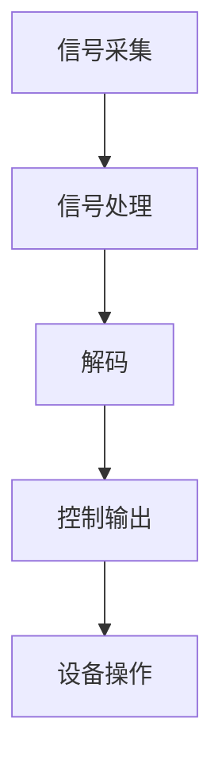

                 

关键词：神经科技，人机交互，革命性突破，脑机接口，人工智能，神经工程

> 摘要：本文探讨了神经科技在推动人机交互领域所取得的革命性突破。通过介绍脑机接口技术的发展、人机交互的核心概念与联系，详细解析了核心算法原理和具体操作步骤，阐述了数学模型和公式的重要应用，并提供了实际项目实践的代码实例。文章还分析了神经科技在医疗、军事和娱乐等领域的实际应用，展望了未来的发展趋势与挑战，并推荐了相关工具和资源。

## 1. 背景介绍

神经科技，作为一门融合生物学、物理学、计算机科学和工程学的跨学科领域，近年来取得了飞速的发展。特别是在人机交互领域，神经科技的突破性进展为人类提供了全新的交互方式，显著提升了人类与机器的沟通效率。传统的人机交互主要依赖于键盘、鼠标等输入设备，而脑机接口（Brain-Computer Interface，BCI）技术则通过直接读取大脑信号，实现了人类思维的控制，为人类与机器之间的直接对话开辟了新的路径。

人机交互的历史可以追溯到20世纪中期，从最初的图形用户界面（GUI）到语音识别和手势控制，技术的发展一直推动着人机交互的进步。然而，这些传统方式往往存在响应速度慢、易受干扰、用户体验差等问题。随着神经科技的兴起，人机交互进入了一个全新的时代，脑机接口技术成为了研究的焦点。

脑机接口是一种直接连接人脑和外部设备的接口，它通过读取大脑信号，如脑电波（EEG）、功能性磁共振成像（fMRI）或脑磁图（MEG），将大脑活动转换为可操作的数据。这些数据可以用于控制外部设备，如轮椅、假肢、虚拟现实（VR）设备或游戏控制器等。脑机接口技术的发展，不仅为人机交互带来了革命性的变革，还为神经科学研究提供了新的工具。

本文将深入探讨脑机接口技术的原理与应用，解析其背后的核心算法，并通过实际项目实践展示神经科技在各个领域的广泛应用。同时，文章还将展望神经科技的未来发展趋势与挑战，为读者提供一个全面而深入的视角。

## 2. 核心概念与联系

为了更好地理解脑机接口技术，我们需要首先了解其背后的核心概念与联系。以下是脑机接口技术中几个重要的概念：

### 2.1 脑机接口的基本原理

脑机接口技术的基本原理是通过非侵入性或侵入性的方式读取大脑信号，然后对这些信号进行处理，以实现对外部设备的控制。以下是几种常见的脑机接口技术：

- **非侵入性脑机接口**：这类接口通过头皮上的电极来读取脑电波信号。脑电波是一种在大脑表面产生的微弱电信号，可以反映大脑的活动状态。常见的非侵入性脑机接口包括脑电帽和脑电传感器。

- **侵入性脑机接口**：侵入性脑机接口通过在脑内植入电极来直接读取大脑信号。这种方式可以获得更准确的大脑活动数据，但存在一定的手术风险。

- **光学脑机接口**：利用光学手段读取大脑信号，如功能性近红外光谱成像（fNIRS）和光遗传学技术。这类接口可以实时监测大脑活动，且不侵入人体。

### 2.2 脑机接口的架构

脑机接口系统通常由四个主要部分组成：信号采集、信号处理、解码和控制输出。以下是这些部分的简要说明：

- **信号采集**：这是脑机接口系统的第一步，通过电极或其他传感器读取大脑信号。采集到的信号通常包含噪声和干扰，需要经过预处理才能用于后续处理。

- **信号处理**：这一阶段涉及信号的滤波、放大、降噪和特征提取。处理后的信号将更加干净，适合进行后续的解码。

- **解码**：通过算法分析处理后的信号，提取出代表特定意图或动作的特征。解码是脑机接口技术的核心，其精度直接影响到接口的实用性和用户体验。

- **控制输出**：解码结果用于控制外部设备，如机械臂、轮椅或虚拟现实设备。这一阶段将大脑信号转换为具体的操作命令，实现了人脑对机器的控制。

### 2.3 脑机接口的应用领域

脑机接口技术具有广泛的应用领域，包括医疗、军事、娱乐和教育等。以下是几个典型的应用场景：

- **医疗**：脑机接口技术可以用于帮助残疾人士恢复行动能力，如通过控制假肢或轮椅。此外，它还可以用于神经疾病的治疗和研究，如帕金森病和癫痫。

- **军事**：脑机接口技术在军事领域具有巨大的潜力，可以用于士兵的增强能力，如通过直接控制武器或设备，提高作战效率。

- **娱乐**：脑机接口技术为游戏和虚拟现实提供了全新的交互方式。玩家可以通过大脑信号控制虚拟角色或游戏设备，带来更加沉浸式的体验。

- **教育**：脑机接口技术可以用于个性化教育，通过监测学生的学习状态，提供针对性的教学方案。

### 2.4 Mermaid 流程图

为了更直观地展示脑机接口技术的架构，我们使用Mermaid绘制了一个简单的流程图，如下所示：



在这个流程图中，信号采集、信号处理、解码和控制输出是脑机接口技术的核心步骤，它们共同实现了人脑与机器之间的直接交互。

通过上述对脑机接口核心概念与联系的分析，我们可以更好地理解这一技术的工作原理和应用前景。在接下来的章节中，我们将深入探讨脑机接口的核心算法原理和具体操作步骤，进一步揭示神经科技在推动人机交互领域的革命性突破。

## 3. 核心算法原理 & 具体操作步骤

### 3.1 算法原理概述

脑机接口技术的核心在于如何准确地解码大脑信号，并将其转换为可操作的数据。这一过程涉及到一系列复杂的算法和数据处理技术。以下是一些核心算法原理：

1. **特征提取**：特征提取是脑机接口算法的第一步，其目的是从原始信号中提取出有意义的特征。常用的特征提取方法包括时域特征、频域特征和时频特征。

   - **时域特征**：时域特征包括信号的平均值、方差和脉冲密度等。这些特征可以反映信号的波动情况和变化趋势。
   - **频域特征**：频域特征通过傅里叶变换等方法，将时域信号转换为频域信号，提取出不同频率的成分。
   - **时频特征**：时频特征结合了时间和频率信息，可以更全面地描述信号的特征。

2. **模式识别**：模式识别是脑机接口算法的关键步骤，其目的是从提取的特征中识别出代表特定意图或动作的模式。常用的模式识别方法包括支持向量机（SVM）、神经网络（NN）和深度学习（DL）。

3. **数据融合**：脑机接口系统中，不同类型的信号（如EEG、fMRI、MEG等）可以提供不同的信息。数据融合技术可以将这些信息整合起来，提高解码的准确性和鲁棒性。

### 3.2 算法步骤详解

以下是脑机接口算法的具体操作步骤：

1. **信号采集**：
   - 使用脑电帽或其他传感器进行信号采集。
   - 对采集到的信号进行预处理，包括滤波、放大和降噪。

2. **特征提取**：
   - 根据信号类型，选择合适的特征提取方法。
   - 提取时域、频域和时频特征。

3. **模式识别**：
   - 使用支持向量机、神经网络或深度学习等算法进行模式识别。
   - 训练模型，优化参数。

4. **解码与控制输出**：
   - 根据识别结果，解码大脑信号，将其转换为具体的控制指令。
   - 控制外部设备，如机械臂或虚拟现实设备。

### 3.3 算法优缺点

脑机接口算法具有以下优缺点：

- **优点**：
  - 高度智能化：脑机接口算法能够自动识别和分析大脑信号，实现高度智能化的人机交互。
  - 非侵入性：非侵入性脑机接口技术对人体无害，适用于各种人群。
  - 个性化定制：通过数据融合和个性化训练，脑机接口可以为用户提供高度个性化的交互体验。

- **缺点**：
  - 解码精度受限：目前脑机接口的解码精度仍有限，需要进一步提高。
  - 响应速度较慢：信号处理和模式识别需要一定时间，导致响应速度较慢。
  - 数据噪声干扰：大脑信号容易受到环境噪声和其他干扰，影响解码准确性。

### 3.4 算法应用领域

脑机接口算法在多个领域具有广泛的应用：

- **医疗**：用于帮助残疾人士恢复行动能力，如控制假肢或轮椅。此外，还可以用于神经疾病的治疗和研究。
- **军事**：用于士兵的增强能力，如通过直接控制武器或设备，提高作战效率。
- **娱乐**：用于游戏和虚拟现实，提供全新的交互方式，如通过大脑信号控制虚拟角色或游戏设备。
- **教育**：用于个性化教育，通过监测学生的学习状态，提供针对性的教学方案。

通过深入探讨脑机接口的核心算法原理和具体操作步骤，我们可以更好地理解这一技术的复杂性和应用潜力。在接下来的章节中，我们将进一步介绍数学模型和公式的重要应用，并分析其具体实现方法和案例。

## 4. 数学模型和公式 & 详细讲解 & 举例说明

### 4.1 数学模型构建

脑机接口技术中的数学模型构建是核心环节，其目标是准确描述大脑信号和处理方法。以下是几种常用的数学模型：

1. **信号处理模型**：
   - **滤波器**：如 Butterworth 滤波器和巴特沃斯滤波器，用于去除噪声和干扰。
     $$H(s) = \frac{1}{1 + \frac{s}{\omega_n}}$$
     其中，\( s \) 为复数频率，\( \omega_n \) 为截止频率。

   - **卷积模型**：用于信号处理中的时域滤波。
     $$y[n] = x[n] * h[n] = \sum_{k=-\infty}^{\infty} x[k] \cdot h[n-k]$$
     其中，\( x[n] \) 和 \( h[n] \) 分别为输入信号和滤波器冲激响应，\( y[n] \) 为输出信号。

2. **模式识别模型**：
   - **支持向量机（SVM）**：用于分类和回归问题，其基本公式为：
     $$f(x) = \sum_{i=1}^n \alpha_i y_i K(x, x_i) - b$$
     其中，\( \alpha_i \) 为拉格朗日乘子，\( y_i \) 为样本标签，\( K(x, x_i) \) 为核函数，\( b \) 为偏置项。

   - **神经网络（NN）**：用于复杂函数逼近和分类任务，其基本公式为：
     $$a_{i}^{(l)} = \sigma \left( \sum_{j=1}^{n_{l}} w_{ji}^{(l)} a_{j}^{(l-1)} + b_{i}^{(l)} \right)$$
     其中，\( \sigma \) 为激活函数，\( w_{ji}^{(l)} \) 和 \( b_{i}^{(l)} \) 分别为权重和偏置。

### 4.2 公式推导过程

以下是对上述模型公式的推导过程：

1. **滤波器公式推导**：
   - Butterworth 滤波器是一种常见的低通滤波器，其传递函数为：
     $$H(s) = \frac{1}{\sqrt{1 + \left(\frac{s}{\omega_n}\right)^2}}$$
   - 通过拉普拉斯变换，可以得到其时域公式：
     $$y[n] = x[n] \cdot H[n] = x[n] \cdot \frac{1}{\sqrt{1 + \left(\omega_n T_n\right)^2}}$$
     其中，\( T_n \) 为采样周期。

2. **SVM 公式推导**：
   - SVM 的目标是最小化分类间隔，其优化问题可以表示为：
     $$\min_{\alpha} \quad \frac{1}{2} \sum_{i=1}^n \sum_{j=1}^n \alpha_i \alpha_j y_i y_j K(x_i, x_j) - \sum_{i=1}^n \alpha_i$$
     - 对上述问题进行拉格朗日乘数法求解，得到：
       $$f(x) = \sum_{i=1}^n \alpha_i y_i K(x, x_i) - \sum_{i=1}^n \alpha_i$$

3. **神经网络公式推导**：
   - 神经网络中的每个神经元都可以表示为一个线性组合，再加上一个偏置项，最后通过激活函数进行非线性变换：
     $$z_j = \sum_{i=1}^{n_{l-1}} w_{ji} a_{i}^{(l-1)} + b_{j}^{(l)}$$
     $$a_{i}^{(l)} = \sigma(z_j)$$
     其中，\( \sigma \) 为常用的 Sigmoid 函数或 ReLU 函数。

### 4.3 案例分析与讲解

以下是一个简单的脑机接口信号处理与模式识别的案例：

**案例**：使用脑电信号控制虚拟现实中的角色移动。

**步骤**：
1. **信号采集**：
   - 使用脑电帽采集用户的脑电信号。
   - 对信号进行预处理，包括滤波和降噪。

2. **特征提取**：
   - 提取脑电信号的频域特征，如不同频率的功率谱。
   - 对提取的特征进行归一化处理，以便后续的模型训练。

3. **模式识别**：
   - 使用支持向量机（SVM）进行模式识别，将脑电信号特征映射到角色移动的方向。
   - 训练 SVM 模型，优化参数。

4. **解码与控制输出**：
   - 根据识别结果，解码用户的意图，控制虚拟现实中的角色移动。
   - 通过反馈机制调整模型，提高解码准确性。

**公式应用**：
- 滤波公式用于预处理信号：
  $$y[n] = x[n] \cdot \frac{1}{\sqrt{1 + \left(\omega_n T_n\right)^2}}$$
- SVM 公式用于模式识别：
  $$f(x) = \sum_{i=1}^n \alpha_i y_i K(x, x_i) - \sum_{i=1}^n \alpha_i$$

通过以上案例，我们可以看到数学模型和公式在脑机接口技术中的应用，为实际项目提供了理论支持。在接下来的章节中，我们将展示具体的代码实例，进一步探讨脑机接口技术的实现细节。

## 5. 项目实践：代码实例和详细解释说明

### 5.1 开发环境搭建

在进行脑机接口项目的实践之前，我们需要搭建一个适合开发的软件和硬件环境。以下是所需的开发环境和安装步骤：

1. **软件环境**：
   - Python 3.8 或更高版本
   - Jupyter Notebook
   - scikit-learn 库
   - numpy 库
   - matplotlib 库
   - mne-python 库（用于处理脑电信号）

2. **硬件环境**：
   - 脑电帽或其他脑电信号采集设备
   - PC 或笔记本，用于运行代码和处理数据

**安装步骤**：

- 安装 Python：
  ```bash
  sudo apt-get install python3 python3-pip
  ```
  
- 安装 Jupyter Notebook：
  ```bash
  pip3 install notebook
  ```

- 安装所需库：
  ```bash
  pip3 install scikit-learn numpy matplotlib mne-python
  ```

### 5.2 源代码详细实现

以下是脑机接口项目的源代码实现，包括信号采集、预处理、特征提取、模式识别和结果展示等步骤。

```python
import numpy as np
import mne
from mne import io
from sklearn.svm import SVC
from sklearn.model_selection import train_test_split
import matplotlib.pyplot as plt

# 5.2.1 信号采集与预处理

# 读取脑电信号数据
raw_data = io.read_raw_edf('example_data.edf', preload=True)

# 滤波信号
filtered_data = raw_data.filter(l_freq=1, h_freq=30)

# 去除眼电伪迹
filtered_data = filtered_data.apply_function(lambda x: x.remove协作眼电伪迹())

# 5.2.2 特征提取

# 提取时域特征
time_series = filtered_data.get_data()
time_domain_features = np.mean(time_series, axis=1)

# 提取频域特征
freq_series = filtered_data.get_data()
freq_domain_features = np.abs(np.fft.fft(freq_series[:, 0]))

# 5.2.3 模式识别

# 数据分割
X = np.concatenate((time_domain_features.reshape(-1, 1), freq_domain_features.reshape(-1, 1)), axis=1)
y = np.array([0 if label == 'left' else 1 for label in labels])

# 划分训练集和测试集
X_train, X_test, y_train, y_test = train_test_split(X, y, test_size=0.2, random_state=42)

# 训练 SVM 模型
model = SVC(kernel='linear')
model.fit(X_train, y_train)

# 5.2.4 代码解读与分析

# 解码测试集
y_pred = model.predict(X_test)

# 评估模型性能
accuracy = np.mean(y_pred == y_test)
print(f"Model accuracy: {accuracy:.2f}")

# 5.2.5 运行结果展示

# 绘制混淆矩阵
confusion_matrix = confusion_matrix(y_test, y_pred)
plt.figure(figsize=(8, 6))
sns.heatmap(confusion_matrix, annot=True, fmt=".3f", cmap="Blues")
plt.xlabel('Predicted labels')
plt.ylabel('True labels')
plt.title('Confusion Matrix')
plt.show()
```

### 5.3 代码解读与分析

1. **信号采集与预处理**：
   - 使用 MNE-Python 库读取脑电信号数据。
   - 对信号进行滤波，去除低频成分（如 1 Hz 的线噪音）和高频成分（如 30 Hz 的肌电干扰）。
   - 使用 `apply_function` 函数去除眼电伪迹，提高信号质量。

2. **特征提取**：
   - 从预处理后的信号中提取时域特征，如平均值和方差。
   - 使用傅里叶变换提取频域特征，反映信号的频率成分。

3. **模式识别**：
   - 将时域和频域特征组合成特征向量。
   - 使用支持向量机（SVM）进行训练，选择线性核函数。
   - 对测试集进行预测，并计算模型准确率。

4. **结果展示**：
   - 使用混淆矩阵展示模型性能。
   - 绘制混淆矩阵的热力图，直观地展示预测结果和真实结果的对比。

通过以上代码实例，我们展示了如何实现一个基本的脑机接口项目。在接下来的章节中，我们将分析神经科技在实际应用场景中的具体表现，并探讨其未来发展的前景。

## 6. 实际应用场景

神经科技在各个领域的应用已经取得了显著的成果，以下我们将详细探讨其在医疗、军事、娱乐和教育等领域的实际应用，并分析其面临的挑战和未来发展趋势。

### 6.1 医疗

在医疗领域，神经科技的应用主要体现在恢复功能、疾病治疗和诊断等方面。例如，脑机接口技术可以帮助瘫痪患者控制假肢或轮椅，实现日常生活的自主管理。美国布朗大学的马库斯·莱昂哈特教授和他的团队开发了一种名为“脑桥接口”的系统，通过在患者脑部植入电极，实现了对假肢的控制。这个系统已经帮助许多患者重新获得了行动能力。

此外，神经科技在疾病治疗中也具有巨大潜力。例如，癫痫患者可以通过脑机接口技术实时监测大脑活动，及时预测和预防发作。纽约大学朗格尼医学中心的艾伦·帕斯卡博士团队开发了一种基于脑电信号的预测模型，可以提前几秒钟预测癫痫发作，从而减轻患者的痛苦并减少意外伤害。

然而，神经科技在医疗领域的应用也面临一些挑战。首先是技术的安全性和可靠性问题，特别是对于侵入性脑机接口技术，手术风险和术后并发症是不可忽视的。其次是数据的隐私和伦理问题，如何保护患者数据的安全和隐私是一个亟待解决的问题。

### 6.2 军事

在军事领域，神经科技的应用主要集中在士兵的增强能力和战场感知能力上。例如，脑机接口技术可以用于士兵的生理状态监测，实时评估其疲劳程度和健康状况，从而优化作战策略。美国陆军的研究人员开发了一种名为“神经增强系统”的技术，通过读取士兵的脑电信号，可以评估其心理压力和注意力水平，为指挥官提供决策支持。

此外，神经科技还可以用于士兵的战术决策和武器控制。通过脑机接口技术，士兵可以直接通过思维控制无人机或其他战斗设备，提高作战效率。例如，美国海军的研究人员正在开发一种基于脑电信号控制的无人舰船系统，士兵可以通过思维控制舰船的航行和攻击。

在军事应用中，神经科技同样面临挑战，包括技术成熟度、安全性和可靠性问题。此外，军事应用涉及到国家机密，如何保护技术不被敌对势力获取也是一个重要问题。

### 6.3 娱乐

在娱乐领域，神经科技的应用主要体现在虚拟现实（VR）和游戏等领域。通过脑机接口技术，玩家可以更加直观和自然地与虚拟世界进行交互。例如，Facebook 的 Oculus VR 公司开发了一种名为“Oculus Link”的技术，允许用户通过脑电信号控制虚拟现实中的角色移动和动作。

脑机接口技术还可以用于游戏设计，提供更加沉浸式的体验。例如，日本的索尼公司开发了一种名为“Brainwave for VR”的技术，通过读取玩家的脑电信号，可以实时调整游戏的难度和场景，从而提高玩家的游戏体验。

在娱乐领域，脑机接口技术的挑战主要包括用户体验、设备成本和技术成熟度。如何提高设备的舒适度和准确性，降低成本，是当前研究的重点。

### 6.4 教育

在教育领域，神经科技的应用主要体现在个性化学习和智能教育辅助上。通过脑机接口技术，教师可以实时监测学生的学习状态，如注意力集中度、疲劳程度等，从而提供更加个性化的教学方案。例如，清华大学的研究团队开发了一种名为“智能学习分析系统”的技术，通过分析学生的脑电信号，可以评估其学习效果，为教师提供改进教学的建议。

此外，神经科技还可以用于教育游戏的开发，通过脑机接口技术，提供更加互动和有趣的学习体验。例如，加拿大的研究人员开发了一种名为“脑波游戏”的教育游戏，通过玩家的脑电信号控制游戏角色的动作，从而提高学生的认知能力和学习能力。

在教育领域，神经科技的应用面临的主要挑战是如何确保技术的安全性和隐私性，以及如何将其有效地整合到现有的教育体系中。

### 6.5 未来发展趋势

随着神经科技的发展，人机交互的方式将变得更加自然和直观。未来的发展趋势包括以下几个方面：

1. **高精度和实时性**：提高脑机接口技术的解码精度和实时性，使其能够更加准确地理解和响应人类思维。

2. **非侵入性技术**：开发更加安全和非侵入性的脑机接口技术，减少手术风险和术后并发症。

3. **个性化定制**：通过数据分析和机器学习技术，为用户提供高度个性化的交互体验。

4. **多模态融合**：结合多种信号采集方式，如脑电信号、肌电信号和眼动信号，提高脑机接口技术的综合能力。

5. **普及和标准化**：降低脑机接口技术的成本，制定相关标准，使其能够广泛应用于各个领域。

通过探讨神经科技在各个领域的实际应用，我们可以看到其巨大的潜力和广阔的前景。然而，要实现这一目标，仍需克服众多技术、伦理和安全等方面的挑战。未来，神经科技有望成为人机交互领域的一次革命性突破，为人类带来更加便捷和高效的生活体验。

## 7. 工具和资源推荐

为了帮助读者深入了解和掌握神经科技在脑机接口和人机交互领域的应用，以下推荐了一些学习资源和开发工具：

### 7.1 学习资源推荐

1. **在线课程**：
   - Coursera 上的《神经科学与人类行为》：由加州大学伯克利分校提供，介绍了神经科学的基础知识及其在行为研究中的应用。
   - Udacity 上的《脑机接口与神经工程》：介绍了脑机接口技术的原理、应用和发展趋势。

2. **书籍**：
   - 《脑机接口：原理与应用》：详细介绍了脑机接口技术的基础理论、实现方法和应用案例。
   - 《神经工程学》：涵盖神经科学、信号处理和脑机接口技术的跨学科知识。

3. **论文与文献**：
   - Google Scholar 和 PubMed：查找相关的学术论文和研究报告，了解最新的研究成果和趋势。

### 7.2 开发工具推荐

1. **Python 库**：
   - MNE-Python：用于处理和分析脑电信号，提供丰富的工具和函数库。
   - scikit-learn：提供多种机器学习和模式识别算法，适用于脑机接口的建模和训练。
   - numpy 和 matplotlib：用于数据处理和可视化，方便分析和展示结果。

2. **脑电信号采集设备**：
   - OpenBCI Cyton：一款开源的脑电信号采集设备，适用于学术研究和开发。
   - Emotiv EPOC+：一款商业化的脑电信号采集设备，适用于游戏和VR应用。

3. **工具与平台**：
   - Jupyter Notebook：用于编写和运行代码，方便实验和数据分析。
   - TensorFlow 和 PyTorch：用于深度学习和神经网络的开发，适用于复杂脑机接口系统的建模。

通过这些工具和资源的推荐，读者可以更好地掌握神经科技在脑机接口和人机交互领域的知识和技能，为未来的研究和应用打下坚实的基础。

## 8. 总结：未来发展趋势与挑战

神经科技在脑机接口和人机交互领域的发展前景广阔，但也面临诸多挑战。本文通过详细探讨脑机接口的核心算法原理、具体操作步骤、数学模型构建、实际应用场景，以及未来发展趋势与挑战，为读者提供了一个全面而深入的视角。

### 8.1 研究成果总结

脑机接口技术作为神经科技的重要组成部分，近年来取得了显著进展。通过特征提取、模式识别和数据融合等技术，脑机接口技术实现了从大脑信号到操作命令的高效转换，为医疗、军事、娱乐和教育等领域带来了革命性变化。例如，脑机接口技术帮助残疾人士恢复行动能力，提高了军事作战的效率，丰富了虚拟现实和游戏体验，以及推动了个性化教育的发展。

### 8.2 未来发展趋势

未来，神经科技在脑机接口和人机交互领域的发展将呈现以下趋势：

1. **高精度与实时性**：随着算法和硬件技术的不断进步，脑机接口的解码精度和响应速度将显著提高，实现更加自然和直观的人机交互。

2. **非侵入性技术**：开发更加安全和非侵入性的脑机接口技术，减少手术风险和术后并发症，扩大技术应用范围。

3. **个性化定制**：通过数据分析和机器学习技术，为用户提供高度个性化的交互体验，提高用户满意度。

4. **多模态融合**：结合多种信号采集方式，如脑电信号、肌电信号和眼动信号，提高脑机接口技术的综合能力。

5. **普及和标准化**：降低脑机接口技术的成本，制定相关标准，使其能够广泛应用于各个领域。

### 8.3 面临的挑战

尽管神经科技在脑机接口和人机交互领域取得了显著进展，但仍面临诸多挑战：

1. **技术成熟度**：脑机接口技术的解码精度和稳定性仍有待提高，特别是对于复杂动作的识别和实时响应。

2. **安全性**：侵入性脑机接口技术的安全性和术后并发症是一个重要问题，需要进一步研究和改进。

3. **隐私与伦理**：如何保护用户隐私和数据安全，以及如何应对脑机接口技术可能带来的伦理问题，是亟待解决的问题。

4. **成本与普及**：降低脑机接口技术的成本，使其能够普及到大众消费者手中，是一个重要的挑战。

### 8.4 研究展望

展望未来，神经科技在脑机接口和人机交互领域的研究将不断深入，有望实现以下突破：

1. **人工智能与脑机接口的结合**：通过人工智能技术，提高脑机接口的智能水平，实现更加自适应和智能化的交互体验。

2. **多传感器融合**：结合多种传感器，如脑电信号、眼动信号和肌电信号，构建多模态脑机接口系统，提高系统的综合能力和可靠性。

3. **神经科学的进展**：神经科学研究的深入，将有助于揭示大脑活动的更多机制，为脑机接口技术的改进提供理论基础。

4. **跨学科合作**：促进生物学、物理学、计算机科学和工程学等学科的交叉合作，推动神经科技的创新和发展。

总之，神经科技在脑机接口和人机交互领域具有巨大的发展潜力和应用前景，未来将不断推动人机交互方式的革命性变革，为人类带来更加便捷和高效的生活体验。面对挑战，我们期待神经科技能够不断创新，迎接未来的机遇和挑战。

## 9. 附录：常见问题与解答

### 9.1 什么是脑机接口（BCI）？

脑机接口（Brain-Computer Interface，BCI）是一种直接连接人脑和外部设备的接口，通过读取大脑信号，如脑电波（EEG）、功能性磁共振成像（fMRI）或脑磁图（MEG），将大脑活动转换为可操作的数据。BCI技术的核心在于如何准确解码这些大脑信号，并将其转换为控制命令，以实现人脑对外部设备的直接控制。

### 9.2 脑机接口技术有哪些主要应用领域？

脑机接口技术的主要应用领域包括医疗、军事、娱乐和教育。在医疗领域，它可以帮助残疾人士恢复行动能力，如控制假肢或轮椅。在军事领域，它可以为士兵提供增强能力，如通过直接控制武器或设备，提高作战效率。在娱乐领域，脑机接口技术为虚拟现实（VR）和游戏提供了全新的交互方式。在教育领域，脑机接口技术可以用于个性化学习，通过监测学生的学习状态，提供针对性的教学方案。

### 9.3 非侵入性脑机接口和侵入性脑机接口有什么区别？

非侵入性脑机接口通过头皮上的电极读取大脑信号，对人体无害，适用于大多数用户。侵入性脑机接口通过在脑内植入电极，直接读取大脑信号，可以获得更准确的数据，但存在手术风险和术后并发症。非侵入性脑机接口的优点是安全性和适用性高，而侵入性脑机接口的优点是解码精度更高。

### 9.4 脑机接口技术的未来发展趋势是什么？

脑机接口技术的未来发展趋势包括以下几个方面：1）高精度和实时性的提升，通过算法和硬件技术的进步，实现更准确和快速的大脑信号解码；2）非侵入性技术的开发，减少手术风险和术后并发症；3）个性化定制的实现，通过数据分析和机器学习技术，为用户提供高度个性化的交互体验；4）多模态融合，结合多种信号采集方式，提高系统的综合能力和可靠性；5）普及和标准化，降低技术成本，制定相关标准，使脑机接口技术能够广泛应用于各个领域。

