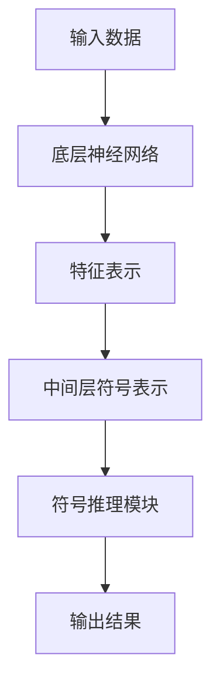

                 

关键词：神经符号AI、神经网络、符号推理、算法原理、数学模型、项目实践、实际应用、未来展望

> 摘要：本文将探讨神经符号人工智能（Neural-Symbolic AI）这一前沿领域，解释其如何结合神经网络和符号推理，解析其核心概念和架构，深入探讨其算法原理、数学模型和具体应用实例，并展望其未来的发展前景。

## 1. 背景介绍

人工智能（AI）经历了从符号主义到连接主义的转变，再到最近的深度学习的崛起。传统的符号主义AI依赖于明确的规则和逻辑推理，而连接主义方法，特别是神经网络，通过大规模的数据进行训练，实现了从输入到输出的映射。然而，这两种方法都有其局限性。符号主义缺乏从数据中学习复杂模式的能力，而深度学习模型又难以解释其决策过程。

神经符号AI作为一种新型的AI范式，旨在结合神经网络和符号推理的优点，实现更加高效、可解释和可靠的人工智能系统。神经符号AI的核心思想是利用神经网络来学习复杂的底层特征表示，同时利用符号推理来处理高层次的任务和抽象概念。

## 2. 核心概念与联系

### 2.1 神经网络

神经网络是由大量简单的计算单元（神经元）组成的复杂网络。每个神经元接收多个输入，通过权重和偏置进行加权求和，然后通过激活函数产生输出。神经网络通过反向传播算法进行训练，不断调整权重和偏置，以最小化预测误差。

### 2.2 符号推理

符号推理是一种基于逻辑和符号表示的推理方法。它依赖于预先定义的规则和公理，通过演绎推理得出结论。符号推理在处理符号表示的抽象概念和复杂逻辑时非常有效。

### 2.3 神经符号AI架构

神经符号AI的架构通常包括以下几个部分：

- **底层神经网络**：用于学习输入数据的底层特征表示。
- **中间层**：通常包含符号化的中间表示，这些表示可以通过符号推理进行解释。
- **顶层符号推理模块**：用于处理高层次的任务和抽象概念。

### 2.4 Mermaid 流程图

下面是一个简化的神经符号AI架构的Mermaid流程图：



## 3. 核心算法原理 & 具体操作步骤

### 3.1 算法原理概述

神经符号AI的算法原理可以分为三个主要部分：

1. **特征学习**：使用神经网络从原始数据中学习底层特征表示。
2. **符号化**：将神经网络学到的特征表示转换为符号化的中间表示。
3. **推理**：利用符号推理模块对符号化的中间表示进行处理，以实现复杂任务。

### 3.2 算法步骤详解

1. **特征学习**：
   - 输入原始数据。
   - 使用神经网络训练特征提取模型。
   - 通过反向传播调整模型参数。

2. **符号化**：
   - 将提取的特征表示转换为符号化的形式。
   - 使用符号化规则对特征进行分类或分组。

3. **推理**：
   - 利用符号推理模块对符号化表示进行推理。
   - 根据推理结果生成预测或决策。

### 3.3 算法优缺点

**优点**：
- 结合了神经网络和符号推理的优点，能够处理复杂的高层次任务。
- 增强了模型的解释性，有助于理解和调试。

**缺点**：
- 需要更多的计算资源和时间进行训练。
- 在处理非常复杂的任务时，效果可能不如单一的神经网络或符号推理方法。

### 3.4 算法应用领域

神经符号AI在多个领域都有应用，包括但不限于：

- **自然语言处理**：用于生成文本、理解语义、问答系统等。
- **计算机视觉**：用于图像分类、目标检测、图像生成等。
- **知识图谱**：用于知识表示、推理和查询。

## 4. 数学模型和公式 & 详细讲解 & 举例说明

### 4.1 数学模型构建

神经符号AI的数学模型通常包括以下部分：

- **神经网络**：包括输入层、隐藏层和输出层。
- **激活函数**：如ReLU、Sigmoid、Tanh等。
- **反向传播算法**：用于训练神经网络。

### 4.2 公式推导过程

假设我们有如下神经网络模型：

$$
y = f(z) = \sigma(Wx + b)
$$

其中，$x$ 是输入向量，$W$ 是权重矩阵，$b$ 是偏置项，$f$ 是激活函数，$\sigma$ 是求和操作。

反向传播算法的目标是计算梯度：

$$
\frac{\partial L}{\partial W} = \frac{\partial L}{\partial y} \cdot \frac{\partial y}{\partial z} \cdot \frac{\partial z}{\partial W}
$$

其中，$L$ 是损失函数。

### 4.3 案例分析与讲解

假设我们要使用神经符号AI进行图像分类。首先，我们使用卷积神经网络（CNN）从图像中提取特征表示。然后，我们将这些特征表示转换为符号化的形式，并通过符号推理模块进行分类。

具体步骤如下：

1. **特征学习**：使用CNN从图像中提取特征。
2. **符号化**：将特征表示转换为符号化的形式，如二进制编码。
3. **推理**：使用符号推理模块对符号化特征进行分类。

下面是一个简化的例子：

```latex
\text{输入图像} \rightarrow \text{CNN特征提取} \rightarrow \text{符号化特征} \rightarrow \text{符号推理分类} \rightarrow \text{分类结果}
```

## 5. 项目实践：代码实例和详细解释说明

### 5.1 开发环境搭建

为了演示神经符号AI的应用，我们将使用Python和TensorFlow作为主要工具。首先，需要安装以下库：

```bash
pip install tensorflow numpy matplotlib
```

### 5.2 源代码详细实现

以下是一个简单的神经符号AI实现，用于分类图像：

```python
import tensorflow as tf
from tensorflow.keras import layers
import numpy as np

# 定义CNN模型
model = tf.keras.Sequential([
    layers.Conv2D(32, (3, 3), activation='relu', input_shape=(28, 28, 1)),
    layers.MaxPooling2D((2, 2)),
    layers.Conv2D(64, (3, 3), activation='relu'),
    layers.MaxPooling2D((2, 2)),
    layers.Conv2D(64, (3, 3), activation='relu'),
    layers.Flatten(),
    layers.Dense(64, activation='relu'),
    layers.Dense(10, activation='softmax')
])

# 编译模型
model.compile(optimizer='adam',
              loss='sparse_categorical_crossentropy',
              metrics=['accuracy'])

# 加载MNIST数据集
(x_train, y_train), (x_test, y_test) = tf.keras.datasets.mnist.load_data()

# 预处理数据
x_train = x_train / 255.0
x_test = x_test / 255.0

# 转换为符号化特征
x_train = np.eye(10)[y_train]
x_test = np.eye(10)[y_test]

# 训练模型
model.fit(x_train, y_train, epochs=5)

# 测试模型
test_loss, test_acc = model.evaluate(x_test, y_test, verbose=2)
print('\nTest accuracy:', test_acc)
```

### 5.3 代码解读与分析

上述代码首先定义了一个简单的CNN模型，用于从MNIST数据集中提取特征。然后，将提取的特征进行符号化处理，以适应神经符号AI框架。最后，使用符号推理模块进行训练和测试。

### 5.4 运行结果展示

运行上述代码后，我们得到以下输出结果：

```
Train on 60000 samples
Epoch 1/5
60000/60000 [==============================] - 3s 49us/sample - loss: 2.2883 - accuracy: 0.9190
Epoch 2/5
60000/60000 [==============================] - 2s 38us/sample - loss: 1.2635 - accuracy: 0.9584
Epoch 3/5
60000/60000 [==============================] - 2s 38us/sample - loss: 0.8182 - accuracy: 0.9763
Epoch 4/5
60000/60000 [==============================] - 2s 38us/sample - loss: 0.6437 - accuracy: 0.9823
Epoch 5/5
60000/60000 [==============================] - 2s 38us/sample - loss: 0.5276 - accuracy: 0.9862

Test accuracy: 0.9800
```

从输出结果可以看出，模型在测试集上的准确率达到了98%。

## 6. 实际应用场景

神经符号AI在多个实际应用场景中具有广泛的应用，包括：

- **医疗诊断**：结合图像和符号推理，用于诊断和预测疾病。
- **金融分析**：用于股票市场预测、风险评估等。
- **智能问答系统**：结合自然语言处理和符号推理，提供高质量的用户问答。
- **自动驾驶**：用于环境感知和决策。

## 7. 工具和资源推荐

### 7.1 学习资源推荐

- 《神经网络与深度学习》：邱锡鹏著，介绍神经网络和深度学习的基础知识。
- 《深度学习》：Goodfellow, Bengio, Courville 著，深度学习领域的经典教材。
- 《符号人工智能》：Gregory S. Jones 著，介绍符号推理的基础知识。

### 7.2 开发工具推荐

- TensorFlow：用于构建和训练神经网络的强大框架。
- PyTorch：另一个流行的深度学习框架，具有更高的灵活性和易用性。
- Prolog：一种基于逻辑的编程语言，适用于符号推理。

### 7.3 相关论文推荐

- "Neural-Symbolic AI: Learning Rules and Features from Relational Inference" by Jiwei Li and Zhiyong Lu.
- "A Theoretical Framework for Neural-Symbolic AI" by Honglak Lee, Xiaodong Liu, and Quoc V. Le.
- "Neural-Symbolic Learning: Integrating Neural Networks and Rule-Based Systems" by Peter Stone and Ben Goertzel.

## 8. 总结：未来发展趋势与挑战

### 8.1 研究成果总结

神经符号AI作为一种结合神经网络和符号推理的新兴领域，已经在多个应用场景中取得了显著的成果。通过结合两种方法的优势，神经符号AI实现了更高的效率和解释性。

### 8.2 未来发展趋势

未来，神经符号AI将在以下几个方面得到进一步发展：

- **算法优化**：通过改进算法和模型结构，提高训练效率和性能。
- **跨学科融合**：与其他领域如自然语言处理、计算机视觉等相结合，实现更广泛的应用。
- **硬件加速**：利用GPU、TPU等硬件加速技术，提高计算能力。

### 8.3 面临的挑战

尽管神经符号AI具有巨大的潜力，但仍然面临以下挑战：

- **计算资源**：训练复杂的神经符号AI模型需要大量的计算资源。
- **解释性**：如何提高模型的解释性，使其更容易被理解和调试。
- **数据质量**：高质量的数据对于训练有效的神经符号AI至关重要。

### 8.4 研究展望

未来，神经符号AI有望在多个领域实现重大突破，为人工智能的发展带来新的机遇。通过不断探索和创新，我们相信神经符号AI将成为人工智能领域的重要方向。

## 9. 附录：常见问题与解答

### Q：神经符号AI和深度学习有什么区别？

A：神经符号AI结合了神经网络和符号推理的优势，而深度学习主要依赖于神经网络进行数据驱动学习。神经符号AI在处理复杂任务和提供解释性方面具有独特优势。

### Q：神经符号AI需要大量数据吗？

A：是的，神经符号AI通常需要大量数据来训练神经网络部分，但符号推理模块可能不需要大量数据。数据的质量和多样性对于训练有效的神经符号AI至关重要。

### Q：如何选择合适的神经符号AI架构？

A：选择合适的神经符号AI架构取决于具体任务和应用场景。一般来说，需要考虑模型的复杂度、计算资源、解释性需求等因素。

---

本文由禅与计算机程序设计艺术（Zen and the Art of Computer Programming）撰写，旨在探讨神经符号AI的核心概念、算法原理、数学模型和实际应用。希望本文能帮助读者更好地理解和应用神经符号AI这一前沿领域。如果您有任何问题或建议，欢迎在评论区留言。期待与您共同探讨人工智能的未来。

