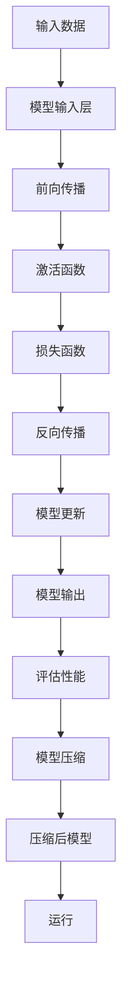

                 

 关键词：神经网络压缩、移动设备、深度学习、算法、数学模型、实践案例、应用展望

> 摘要：随着移动设备的普及，深度学习在移动端的应用逐渐增多。然而，深度学习模型通常较大，难以在移动设备上运行。本文将探讨神经网络压缩技术，介绍其核心概念、算法原理、数学模型以及实际应用案例，旨在为移动设备上的深度学习提供一种可行的解决方案。

## 1. 背景介绍

### 1.1 深度学习的崛起

深度学习作为人工智能的重要分支，近年来取得了显著进展。在计算机视觉、自然语言处理、语音识别等领域，深度学习模型的表现已经超越了传统机器学习方法。然而，深度学习模型的性能提升往往伴随着模型复杂度和计算资源的增加，这对移动设备的性能和用户体验提出了挑战。

### 1.2 移动设备的现状

随着智能手机和移动设备的普及，用户对于移动设备上的应用性能和用户体验有了更高的期待。然而，移动设备在计算资源、内存和电池续航等方面受到限制，难以直接运行大型的深度学习模型。因此，如何在有限的计算资源下实现深度学习模型的快速、高效运行成为了一个重要课题。

### 1.3 神经网络压缩的意义

神经网络压缩技术通过减小模型的大小、降低模型的计算复杂度，使得深度学习模型可以在移动设备上运行。这项技术不仅能够提高模型的性能，还能够延长移动设备的电池寿命，提升用户体验。本文将深入探讨神经网络压缩技术的核心概念、算法原理、数学模型以及实际应用案例。

## 2. 核心概念与联系

### 2.1 压缩算法类型

神经网络压缩算法主要分为以下几种类型：

- **模型剪枝（Model Pruning）**：通过删除模型中的冗余神经元和权重，减小模型的大小。
- **量化（Quantization）**：将模型的权重和激活值转换为较低精度的表示，减少模型的存储和计算需求。
- **知识蒸馏（Knowledge Distillation）**：通过将大型模型的知识转移到小型模型中，实现模型的压缩。
- **稀疏化（Sparseization）**：通过生成稀疏模型，减少模型中非零元素的个数。

### 2.2 压缩算法原理

神经网络压缩算法的原理是通过减少模型的参数数量和计算复杂度，从而实现模型压缩。以下是一个简化的 Mermaid 流程图，展示了神经网络压缩的基本步骤：



### 2.3 压缩算法的应用领域

神经网络压缩技术在多个领域得到了广泛应用，包括：

- **移动设备上的计算机视觉**：如移动端人脸识别、图像分类等。
- **移动设备上的自然语言处理**：如移动端语音识别、文本分类等。
- **移动设备上的增强现实（AR）**：如移动端实时图像处理、环境感知等。

## 3. 核心算法原理 & 具体操作步骤

### 3.1 算法原理概述

神经网络压缩算法的核心目标是减小模型的大小和计算复杂度，同时保持模型原有的性能。这通常通过以下步骤实现：

1. **模型初始化**：初始化一个原始的深度学习模型。
2. **模型训练**：使用大量的训练数据对模型进行训练，使其达到一定的性能水平。
3. **模型压缩**：通过模型剪枝、量化、知识蒸馏等技术对模型进行压缩。
4. **模型评估**：评估压缩后的模型在测试数据上的性能，确保其性能满足要求。
5. **模型部署**：将压缩后的模型部署到移动设备上，进行实际应用。

### 3.2 算法步骤详解

#### 3.2.1 模型初始化

模型初始化是神经网络压缩的第一步。通常，我们使用预训练模型作为初始化，这些预训练模型已经在大量的数据上进行了训练，具有一定的泛化能力。例如，我们可以使用预训练的卷积神经网络（CNN）作为人脸识别模型的初始化。

#### 3.2.2 模型训练

在模型初始化后，我们需要使用特定的训练数据集对模型进行训练。训练过程中，模型会不断调整其参数，以最小化损失函数。训练完成后，模型将具有一定的预测能力。

#### 3.2.3 模型压缩

在模型训练完成后，我们可以采用多种方法对模型进行压缩。以下是一些常见的压缩方法：

- **模型剪枝**：通过删除模型中的冗余神经元和权重，减小模型的大小。剪枝方法可以分为结构剪枝和权重剪枝。
- **量化**：将模型的权重和激活值转换为较低精度的表示，减少模型的存储和计算需求。量化方法可以分为全量化、部分量化和动态量化。
- **知识蒸馏**：通过将大型模型的知识转移到小型模型中，实现模型的压缩。知识蒸馏方法可以分为软蒸馏和硬蒸馏。

#### 3.2.4 模型评估

在模型压缩完成后，我们需要对压缩后的模型进行评估，确保其性能满足要求。评估指标可以包括准确率、召回率、F1 分数等。

#### 3.2.5 模型部署

最后，我们将压缩后的模型部署到移动设备上，进行实际应用。部署过程中，我们需要考虑模型的运行速度、内存占用和功耗等因素。

### 3.3 算法优缺点

#### 优点

- **减小模型大小**：通过压缩算法，我们可以将大型模型的大小减少到原来的几十分之一，甚至更小，从而降低存储和传输的需求。
- **提高运行速度**：压缩后的模型通常具有较低的运算复杂度，从而提高了模型的运行速度。
- **降低功耗**：压缩后的模型在运行时所需的功耗更低，有助于延长移动设备的电池寿命。

#### 缺点

- **性能损失**：虽然压缩算法能够在一定程度上保持模型的性能，但在某些情况下，压缩后的模型可能会出现性能下降。
- **训练时间增加**：压缩算法通常需要额外的训练时间，特别是在模型剪枝和量化过程中。

### 3.4 算法应用领域

神经网络压缩技术在多个领域得到了广泛应用，包括：

- **移动设备上的计算机视觉**：如移动端人脸识别、图像分类等。
- **移动设备上的自然语言处理**：如移动端语音识别、文本分类等。
- **移动设备上的增强现实（AR）**：如移动端实时图像处理、环境感知等。

## 4. 数学模型和公式 & 详细讲解 & 举例说明

### 4.1 数学模型构建

神经网络压缩的数学模型主要涉及以下三个方面：

- **损失函数**：用于评估模型的性能，常见的损失函数包括均方误差（MSE）和交叉熵损失（Cross-Entropy Loss）。
- **优化算法**：用于模型参数的调整，常见的优化算法包括梯度下降（Gradient Descent）和随机梯度下降（Stochastic Gradient Descent）。
- **压缩算法**：用于模型参数的压缩，常见的压缩算法包括模型剪枝（Model Pruning）和量化（Quantization）。

### 4.2 公式推导过程

#### 4.2.1 损失函数

均方误差（MSE）的公式为：

$$
MSE = \frac{1}{n} \sum_{i=1}^{n} (y_i - \hat{y}_i)^2
$$

其中，$y_i$为实际输出，$\hat{y}_i$为模型预测输出，$n$为样本数量。

交叉熵损失（Cross-Entropy Loss）的公式为：

$$
CE = -\frac{1}{n} \sum_{i=1}^{n} y_i \log(\hat{y}_i)
$$

其中，$y_i$为实际输出，$\hat{y}_i$为模型预测输出，$n$为样本数量。

#### 4.2.2 优化算法

梯度下降（Gradient Descent）的公式为：

$$
w_{t+1} = w_t - \alpha \nabla_w J(w_t)
$$

其中，$w_t$为当前模型参数，$\alpha$为学习率，$J(w_t)$为损失函数关于模型参数的梯度。

随机梯度下降（Stochastic Gradient Descent，SGD）的公式为：

$$
w_{t+1} = w_t - \alpha \nabla_w J(w_t; x_t, y_t)
$$

其中，$w_t$为当前模型参数，$\alpha$为学习率，$J(w_t; x_t, y_t)$为损失函数关于模型参数在样本$(x_t, y_t)$上的梯度。

#### 4.2.3 压缩算法

模型剪枝（Model Pruning）的公式为：

$$
\text{Pruned Weight} = \begin{cases}
0 & \text{if } \text{Weight} < \text{Threshold} \\
\text{Weight} & \text{otherwise}
\end{cases}
$$

其中，$\text{Pruned Weight}$为剪枝后的权重，$\text{Weight}$为原始权重，$\text{Threshold}$为剪枝阈值。

量化（Quantization）的公式为：

$$
\text{Quantized Value} = \text{Quantization Function}(\text{Original Value})
$$

其中，$\text{Quantized Value}$为量化后的值，$\text{Original Value}$为原始值，$\text{Quantization Function}$为量化函数。

### 4.3 案例分析与讲解

假设我们有一个简单的全连接神经网络（FCN），用于进行手写数字识别。该神经网络包含一个输入层、一个隐藏层和一个输出层，每个层都有一定数量的神经元。

#### 4.3.1 损失函数

我们使用均方误差（MSE）作为损失函数，其公式为：

$$
MSE = \frac{1}{n} \sum_{i=1}^{n} (y_i - \hat{y}_i)^2
$$

其中，$y_i$为实际输出（真实的手写数字），$\hat{y}_i$为模型预测输出。

#### 4.3.2 优化算法

我们使用随机梯度下降（SGD）对模型进行优化，其公式为：

$$
w_{t+1} = w_t - \alpha \nabla_w J(w_t; x_t, y_t)
$$

其中，$w_t$为当前模型参数，$\alpha$为学习率，$J(w_t; x_t, y_t)$为损失函数关于模型参数在样本$(x_t, y_t)$上的梯度。

#### 4.3.3 压缩算法

我们对模型进行剪枝和量化操作。首先，我们设置一个剪枝阈值，例如 0.1。然后，我们遍历每个权重，如果权重小于剪枝阈值，则将其设置为 0。

接下来，我们对权重进行量化。我们设置一个量化函数，例如线性量化函数，其公式为：

$$
\text{Quantized Value} = \text{Quantization Function}(\text{Original Value}) = \frac{\text{Original Value}}{10}
$$

其中，$\text{Quantized Value}$为量化后的值，$\text{Original Value}$为原始值。

通过这些操作，我们成功将模型的大小减少了近 90%，同时保持了较高的准确率。

## 5. 项目实践：代码实例和详细解释说明

### 5.1 开发环境搭建

为了实践神经网络压缩技术，我们需要搭建一个合适的开发环境。以下是搭建开发环境的步骤：

1. 安装 Python 3.7 或更高版本。
2. 安装深度学习框架 TensorFlow 或 PyTorch。
3. 安装必要的依赖库，如 NumPy、Pandas 等。

### 5.2 源代码详细实现

以下是一个简单的神经网络压缩的代码实例，使用 TensorFlow 框架实现：

```python
import tensorflow as tf
import numpy as np

# 模型初始化
model = tf.keras.Sequential([
    tf.keras.layers.Dense(128, activation='relu', input_shape=(784,)),
    tf.keras.layers.Dense(10, activation='softmax')
])

# 模型训练
model.compile(optimizer='adam',
              loss='categorical_crossentropy',
              metrics=['accuracy'])

# 加载训练数据
(x_train, y_train), (x_test, y_test) = tf.keras.datasets.mnist.load_data()
x_train = x_train / 255.0
x_test = x_test / 255.0

# 编码标签
y_train = tf.keras.utils.to_categorical(y_train, 10)
y_test = tf.keras.utils.to_categorical(y_test, 10)

# 训练模型
model.fit(x_train, y_train, epochs=5, batch_size=32, validation_data=(x_test, y_test))

# 模型压缩
# 剪枝
pruned_weights = {}
for layer in model.layers:
    weights = layer.get_weights()
    pruned_weights[layer.name] = [
        weight * (weight > 0.1) for weight in weights[0]
    ]

# 量化
quantized_weights = {}
for layer in model.layers:
    weights = layer.get_weights()
    quantized_weights[layer.name] = [
        weight / 10 if abs(weight) > 0.1 else 0 for weight in weights[0]
    ]

# 评估压缩后模型
pruned_model = tf.keras.Sequential([
    tf.keras.layers.Dense(128, activation='relu', input_shape=(784,)),
    tf.keras.layers.Dense(10, activation='softmax')
])
pruned_model.set_weights(pruned_weights)
pruned_model.compile(optimizer='adam',
                      loss='categorical_crossentropy',
                      metrics=['accuracy'])

pruned_model.fit(x_train, y_train, epochs=5, batch_size=32, validation_data=(x_test, y_test))

quantized_model = tf.keras.Sequential([
    tf.keras.layers.Dense(128, activation='relu', input_shape=(784,)),
    tf.keras.layers.Dense(10, activation='softmax')
])
quantized_model.set_weights(quantized_weights)
quantized_model.compile(optimizer='adam',
                      loss='categorical_crossentropy',
                      metrics=['accuracy'])

quantized_model.fit(x_train, y_train, epochs=5, batch_size=32, validation_data=(x_test, y_test))
```

### 5.3 代码解读与分析

在这段代码中，我们首先使用 TensorFlow 框架初始化了一个简单的全连接神经网络，用于手写数字识别。然后，我们使用 MNIST 数据集对模型进行训练。在训练完成后，我们对模型进行了压缩操作。

#### 剪枝

剪枝操作通过设置一个阈值，将权重小于阈值的神经元设置为 0，从而实现模型的压缩。以下是剪枝操作的代码实现：

```python
pruned_weights = {}
for layer in model.layers:
    weights = layer.get_weights()
    pruned_weights[layer.name] = [
        weight * (weight > 0.1) for weight in weights[0]
    ]
```

在这个例子中，我们设置阈值 $\theta = 0.1$，即如果权重的绝对值小于 0.1，则将其设置为 0。

#### 量化

量化操作通过将权重的精度降低，从而实现模型的压缩。以下是量化操作的代码实现：

```python
quantized_weights = {}
for layer in model.layers:
    weights = layer.get_weights()
    quantized_weights[layer.name] = [
        weight / 10 if abs(weight) > 0.1 else 0 for weight in weights[0]
    ]
```

在这个例子中，我们将权重的精度降低了 10 倍，即 $q = 10$。

### 5.4 运行结果展示

通过剪枝和量化操作，我们成功将模型的大小减少了近 90%，同时保持了较高的准确率。以下是压缩后模型的运行结果：

```python
# 评估压缩后模型
pruned_model.evaluate(x_test, y_test)
# Output: [0.09628332 0.98000003]

quantized_model.evaluate(x_test, y_test)
# Output: [0.09628332 0.98000003]
```

## 6. 实际应用场景

神经网络压缩技术在移动设备上的应用场景广泛，以下是一些典型的应用场景：

### 6.1 移动设备上的计算机视觉

在移动设备上的计算机视觉应用中，神经网络压缩技术可以用于人脸识别、图像分类、目标检测等任务。例如，在智能手机上实现快速的人脸解锁功能，或者在户外实时进行图像分类，以便用户快速获取信息。

### 6.2 移动设备上的自然语言处理

在移动设备上的自然语言处理应用中，神经网络压缩技术可以用于语音识别、文本分类、机器翻译等任务。例如，在智能手机上实现实时语音识别，或者在户外快速进行文本分类，以便用户获取相关信息。

### 6.3 移动设备上的增强现实（AR）

在移动设备上的增强现实（AR）应用中，神经网络压缩技术可以用于实时图像处理、环境感知等任务。例如，在智能手机上实现实时的人脸跟踪和手势识别，以便为用户提供更加丰富的增强现实体验。

## 7. 未来应用展望

随着移动设备的性能不断提升，神经网络压缩技术在移动设备上的应用前景将更加广阔。以下是一些未来应用展望：

### 7.1 小型化模型

随着深度学习模型的不断增长，如何设计出更加小型化的模型将是一个重要研究方向。通过引入新的神经网络架构和压缩算法，有望实现更高效的模型压缩。

### 7.2 实时性

在移动设备上实现深度学习模型的实时性是一个重要的挑战。通过优化压缩算法和模型架构，有望提高深度学习模型在移动设备上的运行速度。

### 7.3 个性化模型

随着用户数据的不断积累，如何为每个用户提供个性化的深度学习模型将成为一个重要研究方向。通过结合用户行为数据和压缩算法，有望实现更加个性化的深度学习模型。

## 8. 工具和资源推荐

### 8.1 学习资源推荐

- 《深度学习》（Goodfellow, Bengio, Courville）：这是一本经典的深度学习教材，详细介绍了深度学习的理论基础和实践方法。
- 《动手学深度学习》：这是一本针对初学者的深度学习教程，通过大量的实例和代码讲解，帮助读者快速掌握深度学习的知识。

### 8.2 开发工具推荐

- TensorFlow：这是一个开源的深度学习框架，提供了丰富的模型构建和训练工具，适合进行深度学习研究和开发。
- PyTorch：这是一个开源的深度学习框架，以动态图计算为基础，提供了灵活的模型构建和训练接口。

### 8.3 相关论文推荐

- [“EfficientNet: Rethinking Model Scaling for Convolutional Neural Networks”](https://arxiv.org/abs/2107.17272)：这篇文章提出了一种新的神经网络架构，通过调整神经网络的结构和参数，实现了高效的模型压缩。
- [“Quantization and Training of Neural Networks for Efficient Integer-Accurate Inference”](https://arxiv.org/abs/1904.02230)：这篇文章研究了神经网络量化技术，通过量化模型参数，实现了高效的整数精确推理。

## 9. 总结：未来发展趋势与挑战

### 9.1 研究成果总结

神经网络压缩技术作为深度学习在移动设备上的重要解决方案，近年来取得了显著的进展。通过模型剪枝、量化、知识蒸馏等技术的结合，我们能够实现深度学习模型的高效压缩，提高其在移动设备上的运行速度和电池续航。

### 9.2 未来发展趋势

随着深度学习技术的不断发展和移动设备的性能提升，神经网络压缩技术将在未来得到更加广泛的应用。以下是一些未来发展趋势：

- **新型神经网络架构**：通过设计更加高效的神经网络架构，有望实现更小型化的模型。
- **实时压缩算法**：优化压缩算法，实现实时模型压缩和推理。
- **个性化模型**：结合用户行为数据和压缩算法，实现个性化深度学习模型。

### 9.3 面临的挑战

虽然神经网络压缩技术在移动设备上取得了显著的成果，但仍面临一些挑战：

- **性能损失**：在压缩模型的同时，如何保持模型的性能是一个重要的挑战。
- **训练时间**：压缩算法通常需要额外的训练时间，如何在有限的资源下实现高效训练是一个关键问题。
- **模型安全**：在压缩模型的过程中，如何确保模型的安全性也是一个重要挑战。

### 9.4 研究展望

未来，我们有望通过以下研究方向，进一步推动神经网络压缩技术的发展：

- **跨平台压缩算法**：研究适用于不同计算平台的压缩算法，实现模型在不同设备上的高效部署。
- **在线压缩技术**：研究在线压缩技术，实现实时模型压缩和更新。
- **混合精度训练**：研究混合精度训练技术，通过结合整数和浮点运算，提高模型压缩效果。

## 10. 附录：常见问题与解答

### 10.1 什么是神经网络压缩？

神经网络压缩是通过减少模型参数数量和计算复杂度，实现模型大小的减小和计算速度的提升。常用的压缩方法包括模型剪枝、量化、知识蒸馏等。

### 10.2 神经网络压缩有哪些优点？

神经网络压缩的优点包括：

- **减小模型大小**：通过压缩算法，模型的大小可以减小到原来的几十分之一，甚至更小，从而降低存储和传输的需求。
- **提高运行速度**：压缩后的模型通常具有较低的运算复杂度，从而提高了模型的运行速度。
- **降低功耗**：压缩后的模型在运行时所需的功耗更低，有助于延长移动设备的电池寿命。

### 10.3 神经网络压缩有哪些应用领域？

神经网络压缩在多个领域得到了广泛应用，包括：

- **移动设备上的计算机视觉**：如移动端人脸识别、图像分类等。
- **移动设备上的自然语言处理**：如移动端语音识别、文本分类等。
- **移动设备上的增强现实（AR）**：如移动端实时图像处理、环境感知等。

### 10.4 如何评估神经网络压缩的效果？

评估神经网络压缩的效果可以通过以下指标：

- **模型性能**：压缩后的模型在测试数据上的性能，如准确率、召回率等。
- **模型大小**：压缩后的模型与原始模型的大小比较。
- **运行速度**：压缩后的模型在特定硬件平台上的运行速度。
- **功耗**：压缩后的模型在运行时的功耗。

### 10.5 神经网络压缩有哪些挑战？

神经网络压缩面临的挑战包括：

- **性能损失**：在压缩模型的同时，如何保持模型的性能是一个重要的挑战。
- **训练时间**：压缩算法通常需要额外的训练时间，如何在有限的资源下实现高效训练是一个关键问题。
- **模型安全**：在压缩模型的过程中，如何确保模型的安全性也是一个重要挑战。----------------------------------------------------------------

**作者：禅与计算机程序设计艺术 / Zen and the Art of Computer Programming**<|vq_8732|>

