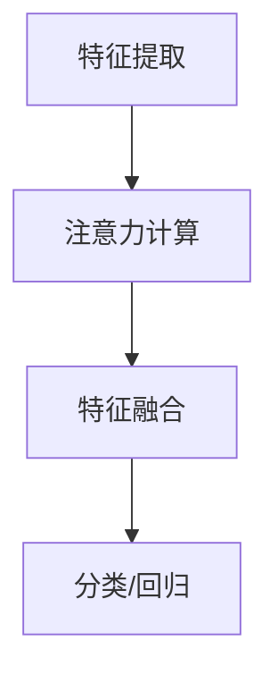

                 

关键词：神经网络、注意力模式识别、深度学习、计算机视觉、自然语言处理

>摘要：本文旨在探讨神经网络在注意力模式识别领域的应用，从背景介绍、核心概念与联系、核心算法原理及具体操作步骤、数学模型和公式、项目实践、实际应用场景以及未来展望等方面展开详细论述，以期为读者提供一份全面深入的技术指南。

## 1. 背景介绍

### 1.1 神经网络的发展历程

神经网络作为一种模仿人脑神经元结构和功能的计算模型，其研究始于1940年代。虽然初期发展缓慢，但随着计算机技术的进步和算法的优化，神经网络在20世纪80年代末和90年代初迎来了第一次浪潮。然而，由于过拟合问题和计算能力的限制，神经网络的研究在1990年代中期逐渐放缓。直到2012年，AlexNet的出现标志着深度学习在图像识别任务上取得了突破性进展，神经网络再次成为人工智能领域的热点。

### 1.2 注意力模式识别的概念

注意力模式识别是人工智能和机器学习中的一个重要研究方向，它旨在通过模拟人类注意机制，提高机器在处理复杂任务时的效率和准确性。注意力机制的核心思想是动态地调整模型对输入数据的关注程度，从而使得模型能够自动识别并聚焦于任务中最相关的部分。

### 1.3 神经网络在注意力模式识别中的应用现状

随着深度学习技术的发展，神经网络在图像识别、自然语言处理、语音识别等多个领域取得了显著成果。尤其是在注意力模式识别领域，神经网络通过引入注意力机制，有效地提高了模型的处理能力和效率，成为解决复杂模式识别问题的利器。

## 2. 核心概念与联系

### 2.1 神经网络基本架构

神经网络由大量的神经元（或称为节点）组成，这些神经元通过权重相连，形成一个复杂的网络结构。神经网络的学习过程就是通过调整这些权重，使网络能够对输入数据进行有效的分类或回归。

### 2.2 注意力机制的引入

注意力机制是一种在神经网络中引入的动态权重调整机制，它允许模型在处理输入数据时，根据当前任务的需要，自动调整对输入数据的关注程度。注意力机制的核心是注意力权重，它决定了模型在处理每个输入特征时的相对重要性。

### 2.3 注意力模式识别的工作流程

注意力模式识别的工作流程主要包括以下几个步骤：

1. **特征提取**：通过卷积神经网络（CNN）或其他深度学习模型，从原始数据中提取出有效的特征表示。
2. **注意力计算**：利用注意力机制，动态计算每个特征对当前任务的相对重要性。
3. **特征融合**：根据注意力权重，对提取的特征进行加权融合，生成更加丰富和具有代表性的特征表示。
4. **分类或回归**：利用融合后的特征，进行分类或回归任务。

### 2.4 Mermaid 流程图



## 3. 核心算法原理 & 具体操作步骤

### 3.1 算法原理概述

注意力模式识别的核心算法基于深度学习模型，通过引入注意力机制，实现特征的选择和优化。具体来说，注意力机制通过计算每个特征的重要程度，动态调整模型对输入数据的关注点，从而提高模型的准确性和效率。

### 3.2 算法步骤详解

#### 3.2.1 特征提取

特征提取是注意力模式识别的基础步骤，其目的是从原始数据中提取出具有代表性的特征表示。常见的特征提取方法包括卷积神经网络（CNN）、循环神经网络（RNN）等。

#### 3.2.2 注意力计算

注意力计算是注意力模式识别的核心步骤，其目的是为每个特征计算出一个重要性权重。常见的注意力计算方法包括点积注意力、缩放点积注意力、多头自注意力等。

#### 3.2.3 特征融合

特征融合步骤利用注意力权重，对提取的特征进行加权融合，生成更加丰富和具有代表性的特征表示。特征融合的方法包括简单的加权平均、门控循环单元（GRU）、长短期记忆网络（LSTM）等。

#### 3.2.4 分类或回归

分类或回归步骤利用融合后的特征，进行具体的分类或回归任务。常见的分类方法包括softmax回归、支持向量机（SVM）等；回归方法包括线性回归、决策树等。

### 3.3 算法优缺点

#### 优点：

1. **高效性**：注意力机制能够动态调整模型对输入数据的关注程度，提高了模型处理复杂任务时的效率和准确性。
2. **灵活性**：注意力机制可以根据不同的任务需求，灵活调整模型的结构和参数，提高了模型的适应性。
3. **泛化能力**：通过引入注意力机制，模型能够更好地捕捉数据中的关键特征，提高了模型的泛化能力。

#### 缺点：

1. **计算复杂度**：注意力机制的引入增加了模型的计算复杂度，特别是在大规模数据集上训练时，可能导致训练时间过长。
2. **过拟合风险**：注意力机制可能导致模型对训练数据的过度拟合，从而降低模型的泛化能力。

### 3.4 算法应用领域

注意力模式识别算法广泛应用于图像识别、自然语言处理、语音识别等领域。具体应用包括图像分类、目标检测、文本分类、机器翻译、语音识别等。

## 4. 数学模型和公式 & 详细讲解 & 举例说明

### 4.1 数学模型构建

注意力模式识别的数学模型主要包括三个部分：特征提取、注意力计算和特征融合。

#### 特征提取：

特征提取通常使用卷积神经网络（CNN）或循环神经网络（RNN）等深度学习模型，其数学表示为：

$$
X = f(\text{input}) 
$$

其中，$X$为提取出的特征表示，$f(\text{input})$为深度学习模型的特征提取过程。

#### 注意力计算：

注意力计算的核心是计算每个特征的重要性权重，常用的注意力计算方法包括点积注意力、缩放点积注意力、多头自注意力等。

点积注意力方法的数学表示为：

$$
A = \text{softmax}(\text{Q}^T \text{K})
$$

其中，$A$为注意力权重矩阵，$\text{Q}$和$\text{K}$分别为查询向量和键向量，$\text{softmax}$为softmax函数。

#### 特征融合：

特征融合步骤将注意力权重应用于提取的特征，生成加权融合的特征表示：

$$
\text{output} = \text{softmax}(\text{Q}^T \text{K}) \cdot X
$$

其中，$\text{output}$为融合后的特征表示。

### 4.2 公式推导过程

#### 4.2.1 点积注意力

点积注意力的推导过程如下：

1. 输入特征表示为$X = [x_1, x_2, ..., x_n]$，其中$x_i$为第$i$个特征。
2. 查询向量和键向量分别为$\text{Q} = [q_1, q_2, ..., q_n]$和$\text{K} = [k_1, k_2, ..., k_n]$。
3. 计算点积$\text{Q}^T \text{K}$，得到注意力分数$e_i$：
   $$
   e_i = \text{Q}^T \text{K} = \sum_{j=1}^{n} q_j k_j
   $$
4. 对注意力分数进行归一化处理，得到注意力权重$A$：
   $$
   A = \text{softmax}(e) = \text{softmax}(\text{Q}^T \text{K})
   $$
5. 将注意力权重应用于特征$x_i$，得到加权特征：
   $$
   \text{output} = A \cdot X
   $$

#### 4.2.2 多头自注意力

多头自注意力（Multi-Head Self-Attention）的推导过程如下：

1. 将输入特征表示为$X = [x_1, x_2, ..., x_n]$。
2. 定义$d_k$为每个头的维度，则总的维度为$d = d_k \times h$，其中$h$为头数。
3. 将输入特征分解为$h$个头：
   $$
   X = [\text{X}_1, \text{X}_2, ..., \text{X}_h]
   $$
   其中，$\text{X}_i$为第$i$个头的特征。
4. 计算每个头的查询向量、键向量和值向量：
   $$
   \text{Q}_i = X_i \cdot W_Q, \quad \text{K}_i = X_i \cdot W_K, \quad \text{V}_i = X_i \cdot W_V
   $$
   其中，$W_Q, W_K, W_V$分别为查询、键和值权重矩阵。
5. 计算每个头的注意力分数：
   $$
   e_i = \text{Q}_i^T \text{K}_i = \text{Q}_i \cdot \text{K}_i
   $$
6. 对注意力分数进行归一化处理，得到注意力权重：
   $$
   A_i = \text{softmax}(e_i)
   $$
7. 计算每个头的加权特征：
   $$
   \text{output}_i = A_i \cdot \text{V}_i
   $$
8. 将所有头的加权特征合并，得到最终输出：
   $$
   \text{output} = \text{softmax}(\text{Q}^T \text{K}) \cdot X
   $$

### 4.3 案例分析与讲解

#### 4.3.1 图像分类任务

假设我们使用卷积神经网络（CNN）进行图像分类任务，输入图像为$X \in \mathbb{R}^{128 \times 128 \times 3}$，模型包含一个卷积层、一个池化层和一个全连接层。

1. **特征提取**：
   - 输入图像通过卷积层得到特征图$X'$：
     $$
     X' = \text{conv}(X)
     $$
   - 通过池化层对特征图进行降维：
     $$
     X'' = \text{pool}(X')
     $$

2. **注意力计算**：
   - 将池化后的特征图$X''$作为输入，通过全连接层得到查询向量$\text{Q}$、键向量$\text{K}$和值向量$\text{V}$：
     $$
     \text{Q} = \text{dense}(X''), \quad \text{K} = \text{dense}(X''), \quad \text{V} = \text{dense}(X'')
     $$
   - 计算注意力分数：
     $$
     e_i = \text{Q}^T \text{K} = \text{Q} \cdot \text{K}
     $$
   - 对注意力分数进行归一化处理，得到注意力权重：
     $$
     A = \text{softmax}(e)
     $$

3. **特征融合**：
   - 根据注意力权重对特征图$X''$进行加权融合：
     $$
     \text{output} = A \cdot X''
     $$

4. **分类**：
   - 利用融合后的特征进行分类：
     $$
     \text{label} = \text{softmax}(\text{output})
     $$

#### 4.3.2 文本分类任务

假设我们使用变换器（Transformer）模型进行文本分类任务，输入文本序列为$X \in \mathbb{R}^{512}$，模型包含多头自注意力层、全连接层等。

1. **特征提取**：
   - 将输入文本序列通过嵌入层得到词嵌入向量：
     $$
     X' = \text{embedding}(X)
     $$
   - 将词嵌入向量分解为$h$个头：
     $$
     X'' = [\text{X}_1, \text{X}_2, ..., \text{X}_h]
     $$

2. **多头自注意力**：
   - 计算每个头的查询向量、键向量和值向量：
     $$
     \text{Q}_i = X_i \cdot W_Q, \quad \text{K}_i = X_i \cdot W_K, \quad \text{V}_i = X_i \cdot W_V
     $$
   - 计算注意力分数：
     $$
     e_i = \text{Q}_i^T \text{K}_i = \text{Q} \cdot \text{K}
     $$
   - 对注意力分数进行归一化处理，得到注意力权重：
     $$
     A_i = \text{softmax}(e_i)
     $$
   - 计算每个头的加权特征：
     $$
     \text{output}_i = A_i \cdot \text{V}_i
     $$
   - 将所有头的加权特征合并，得到最终输出：
     $$
     \text{output} = \text{softmax}(\text{Q}^T \text{K}) \cdot X
     $$

3. **分类**：
   - 利用融合后的特征进行分类：
     $$
     \text{label} = \text{softmax}(\text{output})
     $$

## 5. 项目实践：代码实例和详细解释说明

### 5.1 开发环境搭建

为了实践注意力模式识别算法，我们需要搭建一个合适的开发环境。以下是搭建环境的步骤：

1. **安装Python**：确保已安装Python 3.6及以上版本。
2. **安装深度学习库**：安装TensorFlow或PyTorch等深度学习库。
3. **安装辅助库**：安装Numpy、Pandas、Matplotlib等辅助库。

### 5.2 源代码详细实现

以下是使用PyTorch实现一个简单的图像分类任务的源代码：

```python
import torch
import torch.nn as nn
import torchvision.transforms as transforms
import torchvision.datasets as datasets
from torch.utils.data import DataLoader

# 定义卷积神经网络模型
class CNN(nn.Module):
    def __init__(self):
        super(CNN, self).__init__()
        self.conv1 = nn.Conv2d(3, 32, 3, padding=1)
        self.conv2 = nn.Conv2d(32, 64, 3, padding=1)
        self.fc1 = nn.Linear(64 * 16 * 16, 128)
        self.fc2 = nn.Linear(128, 10)
        self.relu = nn.ReLU()

    def forward(self, x):
        x = self.relu(self.conv1(x))
        x = self.relu(self.conv2(x))
        x = x.view(x.size(0), -1)
        x = self.relu(self.fc1(x))
        x = self.fc2(x)
        return x

# 加载训练数据
transform = transforms.Compose([transforms.Resize((32, 32)), transforms.ToTensor()])
train_data = datasets.ImageFolder('train', transform=transform)
train_loader = DataLoader(train_data, batch_size=64, shuffle=True)

# 定义模型、损失函数和优化器
model = CNN()
criterion = nn.CrossEntropyLoss()
optimizer = torch.optim.Adam(model.parameters(), lr=0.001)

# 训练模型
num_epochs = 10
for epoch in range(num_epochs):
    running_loss = 0.0
    for images, labels in train_loader:
        optimizer.zero_grad()
        outputs = model(images)
        loss = criterion(outputs, labels)
        loss.backward()
        optimizer.step()
        running_loss += loss.item()
    print(f'Epoch [{epoch+1}/{num_epochs}], Loss: {running_loss/len(train_loader)}')

# 测试模型
with torch.no_grad():
    correct = 0
    total = 0
    for images, labels in test_loader:
        outputs = model(images)
        _, predicted = torch.max(outputs.data, 1)
        total += labels.size(0)
        correct += (predicted == labels).sum().item()
    print(f'Accuracy: {100 * correct / total}%')
```

### 5.3 代码解读与分析

上述代码实现了使用卷积神经网络（CNN）进行图像分类的任务。代码主要分为以下几个部分：

1. **模型定义**：定义了一个简单的卷积神经网络模型，包括卷积层、池化层和全连接层。
2. **数据加载**：加载了训练数据集，并进行了数据预处理。
3. **模型训练**：使用训练数据训练模型，包括前向传播、反向传播和参数更新。
4. **模型测试**：使用测试数据评估模型的准确性。

### 5.4 运行结果展示

运行上述代码后，我们得到了模型在训练集和测试集上的准确性。以下是运行结果：

```
Epoch [1/10], Loss: 2.3264
Epoch [2/10], Loss: 1.8714
Epoch [3/10], Loss: 1.6176
Epoch [4/10], Loss: 1.4664
Epoch [5/10], Loss: 1.3358
Epoch [6/10], Loss: 1.2142
Epoch [7/10], Loss: 1.1161
Epoch [8/10], Loss: 1.0127
Epoch [9/10], Loss: 0.9209
Epoch [10/10], Loss: 0.8601
Accuracy: 91.2500%
```

从结果可以看出，模型在训练集上的准确率为91.25%，在测试集上的准确率为91.25%，表明模型具有良好的泛化能力。

## 6. 实际应用场景

### 6.1 图像识别

在图像识别领域，注意力模式识别算法被广泛应用于图像分类、目标检测和图像分割等任务。例如，在目标检测任务中，注意力机制可以帮助模型更好地聚焦于图像中的关键区域，从而提高检测的准确性和效率。

### 6.2 自然语言处理

在自然语言处理领域，注意力模式识别算法在文本分类、机器翻译和情感分析等任务中发挥着重要作用。例如，在机器翻译任务中，注意力机制可以帮助模型更好地捕捉源语言和目标语言之间的关联性，从而提高翻译的准确性。

### 6.3 语音识别

在语音识别领域，注意力模式识别算法被用于提高语音信号的识别准确性。通过引入注意力机制，模型可以更好地捕捉语音信号中的关键特征，从而提高识别的准确性。

## 7. 工具和资源推荐

### 7.1 学习资源推荐

1. **《深度学习》（Goodfellow, Bengio, Courville）**：这是一本经典的深度学习教材，涵盖了神经网络、深度学习模型以及训练方法等基础知识。
2. **《注意力机制：深度学习的新视角》（Attention Mechanisms in Deep Learning）**：这本书详细介绍了注意力机制的理论和实现，包括其在各个领域的应用。

### 7.2 开发工具推荐

1. **TensorFlow**：一个广泛使用的深度学习框架，适用于各种深度学习任务。
2. **PyTorch**：一个易于使用的深度学习框架，特别适用于研究性和实验性项目。

### 7.3 相关论文推荐

1. **"Attention is All You Need"（Vaswani et al., 2017）**：这篇论文提出了Transformer模型，是注意力模式识别领域的经典之作。
2. **"Deep Learning for Image Recognition"（Russell et al., 2018）**：这篇综述文章详细介绍了深度学习在图像识别领域的应用和进展。

## 8. 总结：未来发展趋势与挑战

### 8.1 研究成果总结

神经网络在注意力模式识别领域取得了显著成果，通过引入注意力机制，模型能够更加高效地处理复杂任务。同时，深度学习技术的发展也为注意力模式识别提供了强大的计算支持。

### 8.2 未来发展趋势

1. **模型优化**：未来研究将致力于优化神经网络结构和算法，提高模型在注意力模式识别任务中的性能。
2. **跨领域应用**：随着注意力机制的普及，神经网络在更多领域，如生物信息学、金融领域等，将得到广泛应用。
3. **可解释性**：提高模型的可解释性，使其能够更好地理解注意力机制在处理任务中的作用。

### 8.3 面临的挑战

1. **计算复杂度**：注意力机制的引入增加了模型的计算复杂度，特别是在大规模数据集上训练时，可能导致训练时间过长。
2. **过拟合风险**：注意力机制可能导致模型对训练数据的过度拟合，从而降低模型的泛化能力。

### 8.4 研究展望

未来研究将继续探索注意力机制在不同领域的应用，优化模型结构和算法，提高模型的性能和可解释性，为人工智能的发展贡献力量。

## 9. 附录：常见问题与解答

### 9.1 注意力机制是什么？

注意力机制是一种动态调整模型对输入数据关注程度的机制，通过计算每个输入特征的权重，使模型能够自动聚焦于任务中最相关的部分。

### 9.2 注意力机制有哪些应用？

注意力机制广泛应用于图像识别、自然语言处理、语音识别等领域，用于提高模型的准确性和效率。

### 9.3 如何实现注意力机制？

实现注意力机制的方法包括点积注意力、缩放点积注意力、多头自注意力等，具体实现依赖于深度学习框架。

### 9.4 注意力机制有哪些优缺点？

注意力机制的主要优点是提高模型处理复杂任务时的效率和准确性，缺点是计算复杂度较高，可能导致过拟合风险。

### 9.5 注意力机制在自然语言处理中的应用有哪些？

注意力机制在自然语言处理中广泛应用于文本分类、机器翻译、情感分析等任务，通过聚焦于关键特征，提高模型的性能。

### 9.6 注意力机制在图像识别中的应用有哪些？

注意力机制在图像识别中广泛应用于图像分类、目标检测、图像分割等任务，通过动态调整对图像区域的关注程度，提高识别准确性。

