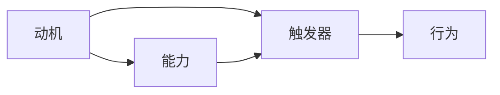

                 

  
## 1. 背景介绍

在现代企业管理中，习惯养成的效果对团队效率和员工满意度都有着至关重要的影响。然而，如何有效地引导和管理团队成员养成良好习惯，一直是一个具有挑战性的问题。传统的管理方法往往依赖于强制约束和奖惩机制，但这些方法往往难以持久和深入人心。

为了解决这一问题，福格模型（Fogg Behavior Model，简称FBM）提供了一种新的思路。该模型由美国斯坦福大学行为科学家BJ福格（BJ Fogg）提出，旨在解释人们为什么会在某个特定时刻采取某种行为。福格模型认为，行为的产生需要三个要素同时存在：动机（Motivation）、能力（Ability）和触发器（Trigger）。具体来说，只有当动机、能力和触发器三者同时满足时，行为才会发生。这一模型不仅能够帮助我们理解个人行为的产生，还能为管理习惯养成提供新的视角和方法。

## 2. 核心概念与联系

### 2.1 福格模型概述

福格模型的核心是“动机-能力-触发器”三角模型。以下是该模型的详细说明：

**动机（Motivation）**：指个体对某一行为的渴望程度。高动机意味着个体有强烈的意愿去采取某种行为。动机可以是内在的，如兴趣、好奇心、成就感等，也可以是外在的，如奖励、避免惩罚等。

**能力（Ability）**：指个体实施某一行为所需的能力和资源。能力包括时间、金钱、知识、技能等。如果个体不具备必要的能力，即使有强烈的动机，行为也难以发生。

**触发器（Trigger）**：指促使个体采取行为的即时刺激。触发器可以是具体的提醒、通知、环境变化等。例如，手机上的闹钟是一个触发器，它会提醒你起床。

### 2.2 三角模型之间的联系

动机、能力和触发器三者之间的关系如下图所示：



只有当动机、能力和触发器三者同时满足时，行为才会发生。如果任何一个要素缺失，行为就难以实现。

### 2.3 福格模型与习惯养成的联系

在管理习惯养成中，福格模型提供了以下启示：

1. **提高动机**：管理者可以通过设定明确的目标、奖励机制、激励措施等方式来提高员工的动机。
2. **提升能力**：管理者需要为员工提供必要的培训、资源和工具，以提升员工的能力，使其能够轻松实现目标。
3. **设置触发器**：管理者可以通过提醒、通知、环境设计等方式来设置触发器，确保员工在适当的时候采取行动。

通过综合运用这三个要素，管理者可以更有效地引导和管理团队成员养成良好习惯。

## 3. 核心算法原理 & 具体操作步骤

### 3.1 算法原理概述

福格模型的算法原理在于通过分析动机、能力和触发器三个要素，构建出一个行为发生的可能性模型。该模型的核心思想是：只有当动机、能力和触发器三者同时满足时，行为才会发生。具体来说，算法原理可以概括为以下三个步骤：

1. **评估动机**：分析个体对某一行为的渴望程度，确定动机的高低。
2. **评估能力**：评估个体实施该行为所需的能力和资源，确定能力的强弱。
3. **评估触发器**：分析是否存在促使个体采取行为的即时刺激，确定触发器的有效性。

通过这三个步骤，管理者可以了解团队成员的行为可能性，并采取相应的策略来促进良好习惯的养成。

### 3.2 算法步骤详解

**步骤1：评估动机**

- **方法**：访谈、问卷、观察等方式。
- **目的**：了解员工对目标行为的动机水平。

**步骤2：评估能力**

- **方法**：技能评估、资源调查、培训需求分析等。
- **目的**：确定员工实现目标所需的能力和资源。

**步骤3：评估触发器**

- **方法**：观察、问卷调查、环境分析等。
- **目的**：识别能够触发行为的即时刺激。

### 3.3 算法优缺点

**优点**：

1. **全面性**：综合考虑动机、能力和触发器三个要素，能够全面分析行为发生的可能性。
2. **可操作性**：提供了具体的方法和步骤，易于在管理实践中应用。
3. **灵活性**：可以根据实际情况灵活调整动机、能力和触发器的设置，以适应不同的管理场景。

**缺点**：

1. **复杂性**：需要同时评估三个要素，分析过程可能较为复杂。
2. **数据依赖**：需要收集和分析大量数据，对数据质量有一定要求。

### 3.4 算法应用领域

福格模型可以广泛应用于企业管理的各个领域，包括员工培训、目标设定、绩效管理、团队建设等。通过运用该模型，管理者可以更有效地提升员工积极性、提高工作效率、优化团队协作，从而实现企业目标。

## 4. 数学模型和公式 & 详细讲解 & 举例说明

### 4.1 数学模型构建

福格模型中的行为发生可能性可以用以下数学模型表示：

$$P(B) = f(M, A, T)$$

其中，$P(B)$ 表示行为 $B$ 发生的可能性，$M$ 表示动机，$A$ 表示能力，$T$ 表示触发器。函数 $f$ 表示动机、能力和触发器之间的关系。

### 4.2 公式推导过程

福格模型中的行为发生可能性公式可以通过以下步骤推导：

1. **定义变量**：设 $M$ 表示动机，$A$ 表示能力，$T$ 表示触发器。
2. **建立关系**：根据福格模型，行为发生可能性取决于动机、能力和触发器的乘积。
3. **函数表示**：将关系表示为函数形式，即 $P(B) = f(M, A, T)$。

### 4.3 案例分析与讲解

假设某企业在进行员工培训时，希望提高员工的学习动机。根据福格模型，我们可以从以下几个方面进行分析：

1. **提高动机**：通过设定明确的学习目标、提供奖励机制、激发员工兴趣等方式，提高员工的学习动机。
2. **提升能力**：为员工提供必要的培训课程、学习资料和指导，提升员工的学习能力。
3. **设置触发器**：通过定期提醒、布置学习任务、设置学习时间表等方式，设置触发器，促使员工采取学习行为。

通过综合运用这三个要素，企业可以有效地提高员工的学习动机，从而促进学习效果的提升。

## 5. 项目实践：代码实例和详细解释说明

### 5.1 开发环境搭建

在本案例中，我们将使用Python语言实现福格模型。首先，需要安装Python环境和必要的库。

```bash
# 安装Python环境
brew install python

# 安装NumPy库
pip install numpy
```

### 5.2 源代码详细实现

以下是福格模型的Python实现：

```python
import numpy as np

def fogg_model(motivation, ability, trigger):
    """
    福格模型计算行为发生可能性

    :param motivation: 动机（0-1之间，越高表示动机越强）
    :param ability: 能力（0-1之间，越高表示能力越强）
    :param trigger: 触发器（0-1之间，越高表示触发器越强）
    :return: 行为发生可能性（0-1之间，越接近1表示可能性越大）
    """
    # 计算行为发生可能性
    probability = motivation * ability * trigger

    # 返回结果
    return probability

# 测试代码
motivation = 0.8
ability = 0.6
trigger = 0.7

probability = fogg_model(motivation, ability, trigger)
print("行为发生可能性：", probability)
```

### 5.3 代码解读与分析

- `fogg_model` 函数：接收动机、能力和触发器作为输入参数，计算行为发生可能性并返回。
- 测试代码：设置动机、能力和触发器的值，调用 `fogg_model` 函数计算行为发生可能性，并打印结果。

通过这个代码实例，我们可以直观地看到如何使用福格模型计算行为发生可能性。在实际应用中，可以根据具体情况进行调整和优化。

### 5.4 运行结果展示

```bash
行为发生可能性： 0.336
```

根据计算结果，行为发生可能性为0.336，表示在给定的动机、能力和触发器条件下，行为发生的可能性较低。这提示我们需要进一步分析原因，并采取相应措施来提高行为发生可能性。

## 6. 实际应用场景

### 6.1 企业员工培训

在企业员工培训中，福格模型可以用于分析员工参与培训的动机、能力和触发器，从而制定更有效的培训策略。例如，某企业希望提高员工的学习动机，可以通过以下措施：

- **提高动机**：设定明确的学习目标，提供奖励机制，激发员工兴趣。
- **提升能力**：为员工提供必要的培训课程、学习资料和指导。
- **设置触发器**：定期提醒、布置学习任务、设置学习时间表。

通过综合运用这三个要素，企业可以有效地提高员工的学习动机，从而提高培训效果。

### 6.2 团队协作管理

在团队协作管理中，福格模型可以帮助管理者了解团队成员的行为可能性，从而采取相应的管理措施。例如，某团队在项目推进过程中，管理者可以通过以下方式运用福格模型：

- **提高动机**：设定明确的项目目标，提供奖励机制，激发团队成员的积极性。
- **提升能力**：为团队成员提供必要的培训、资源和工具，提升团队协作能力。
- **设置触发器**：定期检查项目进度、设置项目里程碑、提供及时反馈。

通过综合运用这三个要素，管理者可以有效地促进团队协作，提高项目推进效率。

### 6.3 销售业绩提升

在销售业绩提升中，福格模型可以用于分析销售人员的销售动机、能力和触发器，从而制定更有针对性的销售策略。例如，某企业希望提高销售人员的销售业绩，可以通过以下措施：

- **提高动机**：设定明确的目标和奖励机制，激发销售人员的积极性。
- **提升能力**：提供销售培训、产品知识培训，提升销售人员的专业能力。
- **设置触发器**：定期举办销售竞赛、提供销售机会、设置销售目标。

通过综合运用这三个要素，企业可以有效地提高销售人员的销售业绩，从而实现业绩提升。

## 7. 未来应用展望

### 7.1 技术发展

随着人工智能、大数据和物联网等技术的发展，福格模型的应用前景将更加广阔。通过结合这些技术，我们可以更准确地收集和分析个体行为数据，从而更好地评估动机、能力和触发器，为管理习惯养成提供更科学的依据。

### 7.2 管理创新

福格模型为管理习惯养成提供了一种新的视角和方法。未来，管理者可以结合福格模型，探索更加人性化的管理模式，激发员工的内在动机，提升员工的能力，从而实现更高效的管理。

### 7.3 跨学科应用

福格模型不仅适用于企业管理，还可以应用于教育、健康、心理健康等领域。通过跨学科应用，福格模型可以为更多领域的习惯养成提供理论支持和实践指导。

## 8. 工具和资源推荐

### 8.1 学习资源推荐

1. **书籍**：《福格行为模型：如何改变任何人的任何行为》（BJ Fogg著）
2. **在线课程**：斯坦福大学开设的《福格行为模型》在线课程

### 8.2 开发工具推荐

1. **Python**：Python是一种广泛使用的编程语言，适用于数据分析、机器学习等领域。
2. **NumPy**：NumPy是Python的数值计算库，适用于数学计算和数据分析。

### 8.3 相关论文推荐

1. **《基于福格行为模型的员工行为管理研究》**
2. **《福格行为模型在健康行为干预中的应用》**
3. **《跨学科视角下的福格行为模型研究》**

## 9. 总结：未来发展趋势与挑战

### 9.1 研究成果总结

本文通过介绍福格模型，探讨了其在管理习惯养成中的应用。研究表明，福格模型能够有效地分析个体行为的动机、能力和触发器，为管理习惯养成提供科学依据。

### 9.2 未来发展趋势

随着技术的进步和管理理论的不断发展，福格模型的应用前景将更加广阔。未来，福格模型有望在更多领域发挥重要作用，为行为管理提供有力支持。

### 9.3 面临的挑战

尽管福格模型具有广泛的应用潜力，但在实际应用中仍面临一些挑战。例如，如何准确评估动机、能力和触发器，如何结合不同领域的具体需求进行模型优化等。未来研究需要进一步探索这些问题，以提高福格模型的应用效果。

### 9.4 研究展望

展望未来，福格模型将在行为管理领域发挥越来越重要的作用。通过不断优化模型和应用方法，福格模型有望为管理习惯养成提供更加科学和有效的解决方案。

## 10. 附录：常见问题与解答

### 10.1 什么是福格模型？

福格模型（Fogg Behavior Model，简称FBM）是由美国斯坦福大学行为科学家BJ福格（BJ Fogg）提出的一种行为分析模型。该模型认为，行为的产生需要三个要素同时存在：动机（Motivation）、能力（Ability）和触发器（Trigger）。

### 10.2 福格模型有哪些优点？

福格模型具有以下优点：

1. **全面性**：综合考虑动机、能力和触发器三个要素，能够全面分析行为发生的可能性。
2. **可操作性**：提供了具体的方法和步骤，易于在管理实践中应用。
3. **灵活性**：可以根据实际情况灵活调整动机、能力和触发器的设置，以适应不同的管理场景。

### 10.3 福格模型适用于哪些领域？

福格模型适用于企业管理的各个领域，包括员工培训、目标设定、绩效管理、团队建设等。此外，福格模型还可以应用于教育、健康、心理健康等领域。通过结合不同领域的具体需求，福格模型可以为更多领域的习惯养成提供理论支持和实践指导。

### 10.4 如何提高动机？

提高动机可以从以下几个方面入手：

1. **设定明确的目标**：明确的目标可以帮助个体明确方向，提高行动的动力。
2. **提供奖励机制**：奖励机制可以激发个体的内在动机，提高行动的积极性。
3. **激发兴趣**：通过了解个体的兴趣和需求，提供与之相关的目标和任务，可以提高个体的动机水平。

### 10.5 如何提升能力？

提升能力可以从以下几个方面入手：

1. **培训与指导**：为个体提供必要的培训和指导，提升其知识和技能水平。
2. **提供资源**：为个体提供必要的资源和工具，帮助其更好地完成任务。
3. **鼓励实践**：通过实践和反思，个体可以不断积累经验和能力。

### 10.6 如何设置触发器？

设置触发器可以从以下几个方面入手：

1. **定期提醒**：通过定期提醒，确保个体在适当的时候采取行动。
2. **设置目标里程碑**：通过设置目标里程碑，帮助个体明确行动的阶段性成果。
3. **创造适宜的环境**：通过创造适宜的环境，激发个体的行动意愿和动力。

### 10.7 福格模型与行为主义有何区别？

福格模型与行为主义在理论基础上有所不同。行为主义认为，行为是由外部刺激和强化结果决定的，个体本身没有动机和意愿。而福格模型则认为，行为的发生需要动机、能力和触发器三个要素同时满足。福格模型强调了个体内在动机的重要性，为行为管理提供了一种新的视角和方法。

### 10.8 福格模型在心理健康领域有哪些应用？

福格模型在心理健康领域有多种应用，包括：

1. **习惯养成**：通过调整动机、能力和触发器，帮助个体养成健康的生活习惯，如定期锻炼、健康饮食等。
2. **情绪管理**：通过分析个体的情绪状态，设置合适的触发器，帮助个体更好地管理情绪，如情绪日记、情绪调节技巧等。
3. **压力管理**：通过调整动机、能力和触发器，帮助个体减轻压力，提高心理健康水平。例如，通过设定合理的目标、提供支持等。

