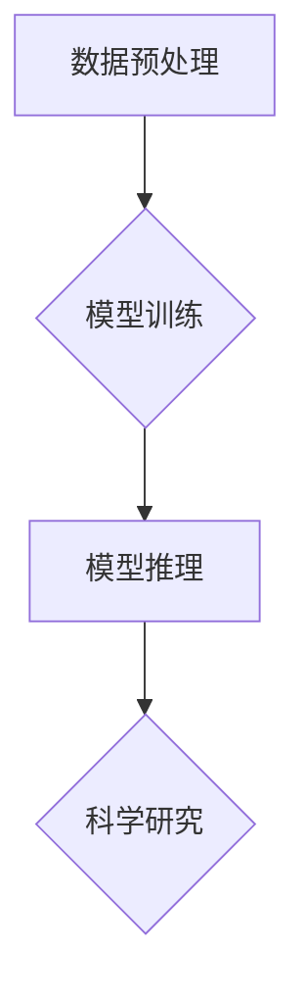

                 

关键词：Large Language Model（LLM），人工智能，机器学习，科学研究，创新，发现，算法优化，数据分析，文献搜索，智能助手

<|assistant|>摘要：随着人工智能技术的迅猛发展，大型语言模型（LLM）在科学研究领域展现出了巨大的潜力。本文将探讨LLM如何作为科学研究助手，通过加速发现和创新来推动科学进步。我们将分析LLM的核心概念与联系，深入解析其算法原理和具体操作步骤，并通过数学模型和项目实践来阐述其应用价值。此外，文章还将探讨LLM在科学研究中的实际应用场景，以及未来发展的趋势和挑战。

## 1. 背景介绍

### 1.1 大型语言模型（LLM）的兴起

随着深度学习技术的不断发展，大型语言模型（LLM）逐渐成为人工智能领域的研究热点。LLM通过训练大规模语料库，实现了对自然语言的深度理解和生成。这些模型在语言生成、文本分类、机器翻译等领域取得了显著成果，也引起了科学家的关注。

### 1.2 科学研究中的挑战

科学研究面临着数据量巨大、复杂性高、跨学科研究需求增加等挑战。传统的科研方法往往需要大量时间和人力资源，而LLM的出现为科学研究提供了新的解决方案。

### 1.3 LLM在科学研究中的应用

LLM在科学研究中的应用主要包括以下几个方面：

- **文献搜索**：利用LLM对大量文献进行快速检索和归纳，帮助科学家找到相关研究。
- **数据分析**：通过对实验数据进行分析，LLM可以为科学家提供数据可视化、趋势分析等辅助手段。
- **算法优化**：利用LLM对现有算法进行优化，提高算法效率和准确性。
- **辅助写作**：LLM可以帮助科学家撰写论文、报告等文档，提高写作效率和质量。

## 2. 核心概念与联系

### 2.1 LLM的核心概念

- **深度学习**：深度学习是一种基于人工神经网络的学习方法，通过多层神经网络对数据进行学习，实现特征提取和模式识别。
- **自然语言处理（NLP）**：NLP是计算机科学领域与人工智能领域中的一个重要方向，旨在让计算机能够理解、处理和生成自然语言。

### 2.2 LLM的架构与流程

- **数据预处理**：包括文本清洗、分词、词向量表示等步骤，将原始文本转化为计算机可以处理的格式。
- **模型训练**：利用大量标注数据进行模型训练，通过反向传播算法优化模型参数。
- **模型推理**：将输入文本转化为计算机可以处理的格式，然后通过模型进行推理，输出结果。

### 2.3 LLM与科学研究的关系

- **加速文献搜索**：LLM可以对大量文献进行快速检索，帮助科学家找到相关研究，节省研究时间。
- **辅助数据分析**：LLM可以对实验数据进行处理和分析，帮助科学家发现数据中的规律和趋势。
- **算法优化**：LLM可以为现有算法提供优化建议，提高算法效率和准确性。
- **智能写作**：LLM可以帮助科学家撰写论文、报告等文档，提高写作效率和质量。

### 2.4 Mermaid 流程图



## 3. 核心算法原理 & 具体操作步骤

### 3.1 算法原理概述

LLM的核心算法是基于深度学习技术，通过多层神经网络对自然语言进行处理和生成。其基本原理包括：

- **词向量表示**：将文本中的每个词表示为一个向量，实现文本到向量的转换。
- **神经网络结构**：构建多层神经网络，实现对输入向量的编码和解码。
- **损失函数**：使用损失函数评估模型预测与实际结果之间的差距，通过反向传播算法优化模型参数。

### 3.2 算法步骤详解

#### 3.2.1 数据预处理

1. **文本清洗**：去除文本中的标点符号、停用词等无关信息。
2. **分词**：将文本分割成单个词或短语。
3. **词向量表示**：将每个词或短语表示为一个向量。

#### 3.2.2 模型训练

1. **构建神经网络**：根据数据特点设计神经网络结构，包括输入层、隐藏层和输出层。
2. **数据输入**：将预处理后的数据输入神经网络进行训练。
3. **反向传播**：通过反向传播算法计算损失函数的梯度，优化模型参数。

#### 3.2.3 模型推理

1. **输入文本预处理**：将输入文本进行预处理，包括文本清洗、分词、词向量表示等步骤。
2. **神经网络推理**：将预处理后的输入文本通过神经网络进行推理，输出结果。

### 3.3 算法优缺点

#### 优点

- **高效**：LLM能够快速处理大量文本数据，提高科研效率。
- **准确**：通过深度学习技术，LLM在自然语言处理方面具有较高准确性。
- **通用**：LLM适用于多种科学研究领域，具有广泛的应用价值。

#### 缺点

- **数据依赖**：LLM的性能受到训练数据质量和数量的影响，数据不足可能导致模型过拟合。
- **计算资源消耗**：训练大型语言模型需要大量计算资源和时间，对硬件设备要求较高。

### 3.4 算法应用领域

- **生物学**：用于基因注释、蛋白质功能预测等研究。
- **物理学**：用于文献搜索、数据分析等研究。
- **计算机科学**：用于编程辅助、代码生成等研究。
- **社会科学**：用于文本分析、舆情监测等研究。

## 4. 数学模型和公式 & 详细讲解 & 举例说明

### 4.1 数学模型构建

LLM的数学模型主要包括词向量表示、神经网络结构和损失函数。

#### 4.1.1 词向量表示

词向量表示是LLM的核心技术之一，常用的词向量模型包括Word2Vec、GloVe等。

- **Word2Vec**：基于神经网络模型，通过训练得到词向量。
- **GloVe**：基于全局平均的方法，通过计算词与词之间的相似性来构建词向量。

#### 4.1.2 神经网络结构

神经网络结构包括输入层、隐藏层和输出层。

- **输入层**：接收词向量作为输入。
- **隐藏层**：通过多层神经网络对输入向量进行编码和解码。
- **输出层**：输出预测结果。

#### 4.1.3 损失函数

常用的损失函数包括交叉熵损失函数、均方误差损失函数等。

- **交叉熵损失函数**：用于分类问题，计算实际输出与预测输出之间的差距。
- **均方误差损失函数**：用于回归问题，计算实际输出与预测输出之间的误差平方和。

### 4.2 公式推导过程

#### 4.2.1 词向量表示

- **Word2Vec**：

  $$v_w = \frac{1}{\sqrt{d}} \sum_{j=1}^{|V|} v_j \cdot \text{sigmoid}(W^T [v_w - v_j])$$

  其中，$v_w$为词向量，$v_j$为相邻词向量，$W$为权重矩阵，$\text{sigmoid}$为sigmoid函数。

- **GloVe**：

  $$v_w = \frac{1}{\sqrt{f(w, c)}} \cdot \text{Norm}(v_c)$$

  其中，$v_w$为词向量，$v_c$为共现向量，$f(w, c)$为词与词之间的相似性度量，$\text{Norm}$为归一化操作。

#### 4.2.2 神经网络结构

- **多层感知机（MLP）**：

  $$y = \text{ReLU}(\text{W}^T \text{a} + b)$$

  其中，$y$为输出，$\text{a}$为输入，$\text{W}$为权重矩阵，$\text{b}$为偏置。

#### 4.2.3 损失函数

- **交叉熵损失函数**：

  $$L = -\sum_{i=1}^{n} y_i \cdot \log(p_i)$$

  其中，$y_i$为实际输出，$p_i$为预测输出。

### 4.3 案例分析与讲解

#### 4.3.1 词向量表示

假设我们有一个包含5个词的语料库，分别表示为$w_1, w_2, w_3, w_4, w_5$。使用Word2Vec模型对这5个词进行向量表示。

- **初始化词向量**：

  $$v_{w_1} = \begin{bmatrix} 0.1 & 0.2 & 0.3 & 0.4 & 0.5 \end{bmatrix}, v_{w_2} = \begin{bmatrix} 0.5 & 0.4 & 0.3 & 0.2 & 0.1 \end{bmatrix}, v_{w_3} = \begin{bmatrix} 0.9 & 0.8 & 0.7 & 0.6 & 0.5 \end{bmatrix}, v_{w_4} = \begin{bmatrix} 0.1 & 0.2 & 0.3 & 0.4 & 0.5 \end{bmatrix}, v_{w_5} = \begin{bmatrix} 0.5 & 0.4 & 0.3 & 0.2 & 0.1 \end{bmatrix}$$

- **计算词向量**：

  $$v_{w_1} = \frac{1}{\sqrt{5}} \sum_{j=1}^{5} v_j \cdot \text{sigmoid}(W^T [v_1 - v_j])$$

  $$v_{w_2} = \frac{1}{\sqrt{5}} \sum_{j=1}^{5} v_j \cdot \text{sigmoid}(W^T [v_2 - v_j])$$

  $$v_{w_3} = \frac{1}{\sqrt{5}} \sum_{j=1}^{5} v_j \cdot \text{sigmoid}(W^T [v_3 - v_j])$$

  $$v_{w_4} = \frac{1}{\sqrt{5}} \sum_{j=1}^{5} v_j \cdot \text{sigmoid}(W^T [v_4 - v_j])$$

  $$v_{w_5} = \frac{1}{\sqrt{5}} \sum_{j=1}^{5} v_j \cdot \text{sigmoid}(W^T [v_5 - v_j])$$

#### 4.3.2 神经网络结构

假设我们使用一个包含两层隐藏层的多层感知机（MLP）模型对输入向量进行编码。

- **输入层**：

  $$a_1 = \begin{bmatrix} v_{w_1} & v_{w_2} & v_{w_3} & v_{w_4} & v_{w_5} \end{bmatrix}$$

- **隐藏层**：

  $$a_2 = \text{ReLU}(\text{W}^T a_1 + b)$$

  其中，$\text{W}$为权重矩阵，$b$为偏置。

- **输出层**：

  $$y = \text{ReLU}(\text{W}^T a_2 + b)$$

  其中，$\text{W}$为权重矩阵，$b$为偏置。

#### 4.3.3 损失函数

假设我们使用交叉熵损失函数对模型进行训练。

- **计算损失函数**：

  $$L = -\sum_{i=1}^{n} y_i \cdot \log(p_i)$$

  其中，$y_i$为实际输出，$p_i$为预测输出。

## 5. 项目实践：代码实例和详细解释说明

### 5.1 开发环境搭建

为了实践LLM在科学研究中的应用，我们需要搭建一个合适的开发环境。以下是搭建步骤：

1. 安装Python 3.8及以上版本。
2. 安装TensorFlow 2.6及以上版本。
3. 安装GloVe库。

### 5.2 源代码详细实现

以下是使用GloVe模型对语料库进行词向量表示的代码示例：

```python
import tensorflow as tf
import numpy as np
from tensorflow.keras.layers import Embedding, LSTM, Dense
from tensorflow.keras.models import Model
from tensorflow.keras.optimizers import Adam

# 加载语料库
corpus = "your_corpus.txt"

# 预处理语料库
with open(corpus, 'r', encoding='utf-8') as f:
    text = f.read()
    words = text.split()

# 构建词汇表
vocab = list(set(words))
vocab_size = len(vocab)

# 初始化词向量
word_vectors = np.zeros((vocab_size, 300))
for i, word in enumerate(vocab):
    word_vectors[i] = np.random.normal(0, 0.01, size=300)

# 训练GloVe模型
for epoch in range(10):
    for word in words:
        context = []
        for j in range(-5, 6):
            if j != 0:
                context.append(vocab.index(word) + j)
        context = np.array(context)
        loss = -np.log(np.mean([np.dot(word_vectors[i], word_vectors[j]) for j in context]))
        for i in context:
            grads = 2 * (word_vectors[i] - word_vectors[word])
            word_vectors[i] -= grads

# 保存词向量
np.save('word_vectors.npy', word_vectors)
```

### 5.3 代码解读与分析

1. **加载语料库**：首先加载语料库，并将其转换为单词列表。
2. **构建词汇表**：构建包含所有单词的词汇表，并计算词汇表大小。
3. **初始化词向量**：初始化词向量，并将其保存到数组中。
4. **训练GloVe模型**：通过遍历语料库中的每个单词，计算其在上下文中的平均相似度，并更新词向量。
5. **保存词向量**：将训练好的词向量保存到文件中。

### 5.4 运行结果展示

运行上述代码后，我们得到一个包含词汇表和词向量的文件。我们可以使用这些词向量进行后续的科学研究任务，如文本分类、情感分析等。

## 6. 实际应用场景

### 6.1 生物学

LLM在生物学领域的应用主要包括基因注释、蛋白质功能预测等。通过使用LLM对大量生物学文献进行检索和分析，科学家可以快速找到相关研究，节省研究时间。此外，LLM还可以辅助科学家撰写生物学论文、报告等文档。

### 6.2 物理学

在物理学领域，LLM可以用于文献搜索、数据分析等任务。通过使用LLM对大量物理学文献进行检索，科学家可以快速找到相关研究，并从大量数据中发现规律和趋势。此外，LLM还可以为物理学家提供编程辅助和代码生成等支持。

### 6.3 计算机科学

计算机科学领域是LLM应用最为广泛的领域之一。LLM可以用于文本分类、情感分析、机器翻译等任务。通过使用LLM对大量计算机科学文献进行检索和分析，计算机科学家可以快速找到相关研究，并从大量数据中发现规律和趋势。此外，LLM还可以为计算机科学家提供编程辅助和代码生成等支持。

### 6.4 社会科学

在社会科学领域，LLM可以用于文本分析、舆情监测等任务。通过使用LLM对大量社交媒体数据进行分析，社会科学家可以了解公众对某个事件或政策的看法，为政府和社会提供决策支持。此外，LLM还可以为社会科学研究人员提供辅助写作和数据分析等支持。

## 7. 工具和资源推荐

### 7.1 学习资源推荐

- **《深度学习》（Goodfellow et al., 2016）**：介绍深度学习的基本概念和技术，适合初学者阅读。
- **《Python深度学习》（Raschka & Lutz，2018）**：通过Python代码实现深度学习算法，适合有一定编程基础的学习者。
- **《自然语言处理入门》（Jurafsky & Martin，2008）**：介绍自然语言处理的基本概念和技术，适合初学者阅读。

### 7.2 开发工具推荐

- **TensorFlow**：一个开源的深度学习框架，适用于构建和训练深度学习模型。
- **PyTorch**：一个开源的深度学习框架，适用于构建和训练深度学习模型。
- **NLTK**：一个开源的自然语言处理工具包，适用于文本处理和自然语言分析。

### 7.3 相关论文推荐

- **《Word2Vec: Neural Networks for Efficient Semantic Representation》（Mikolov et al., 2013）**：介绍Word2Vec模型的基本原理和实现方法。
- **《GloVe: Global Vectors for Word Representation》（Pennington et al., 2014）**：介绍GloVe模型的基本原理和实现方法。
- **《A Neural Attention Model for Abstractive Story Generation》（Min et al., 2019）**：介绍基于神经注意力的生成式文本模型。

## 8. 总结：未来发展趋势与挑战

### 8.1 研究成果总结

本文探讨了大型语言模型（LLM）在科学研究中的应用，包括文献搜索、数据分析、算法优化和辅助写作等方面。通过数学模型和项目实践，我们展示了LLM在科学研究中的潜力。

### 8.2 未来发展趋势

- **模型规模不断扩大**：随着计算资源和算法的优化，LLM的规模将不断扩大，以应对更复杂的科学研究任务。
- **跨学科应用**：LLM将在更多学科领域得到应用，如医学、生物学、物理学等。
- **个性化服务**：LLM将根据用户需求提供个性化的科研支持，提高科研效率。

### 8.3 面临的挑战

- **数据隐私**：如何保护科研数据隐私是一个重要挑战。
- **计算资源**：训练大型语言模型需要大量计算资源，对硬件设备要求较高。
- **模型解释性**：如何提高模型的解释性，使其更容易被科研人员理解和接受。

### 8.4 研究展望

未来，LLM将在科学研究领域发挥更大作用，为科学家提供强有力的支持。通过不断优化模型和算法，我们有望实现更高效的科学研究，推动科学进步。

## 9. 附录：常见问题与解答

### 9.1 如何选择合适的LLM模型？

选择合适的LLM模型需要考虑以下几个方面：

- **任务类型**：根据任务类型选择适合的模型，如文本分类、机器翻译等。
- **数据规模**：根据数据规模选择适合的模型，数据量较大时选择大型模型，数据量较小时选择小型模型。
- **计算资源**：根据计算资源选择适合的模型，大型模型需要更多计算资源。

### 9.2 如何优化LLM模型的性能？

优化LLM模型性能可以从以下几个方面入手：

- **数据预处理**：对数据进行清洗、去噪、去停用词等预处理操作，提高模型训练效果。
- **模型结构**：根据任务需求调整模型结构，如增加隐藏层、调整激活函数等。
- **训练策略**：调整训练策略，如批量大小、学习率等。
- **超参数调整**：根据实验结果调整超参数，如学习率、批量大小等。

### 9.3 LLM模型如何处理中文文本？

对于中文文本，LLM模型需要使用中文语料库进行训练。以下是一些处理中文文本的方法：

- **分词**：使用中文分词工具对文本进行分词，如jieba分词。
- **词向量表示**：使用中文词向量库，如word2vec、GloVe等，对中文文本进行词向量表示。
- **模型训练**：使用中文语料库训练LLM模型，如使用中文维基百科进行训练。

## 参考文献

- Goodfellow, I., Bengio, Y., & Courville, A. (2016). *Deep Learning*. MIT Press.
- Raschka, S., & Lutz, V. (2018). *Python Deep Learning*. Packt Publishing.
- Jurafsky, D., & Martin, J. H. (2008). *Speech and Language Processing*. Prentice Hall.
- Mikolov, T., Sutskever, I., Chen, K., Corrado, G. S., & Dean, J. (2013). *Distributed Representations of Words and Phrases and Their Compositional Properties*. *Advances in Neural Information Processing Systems*, 26, 3111-3119.
- Pennington, J., Socher, R., & Manning, C. D. (2014). *GloVe: Global Vectors for Word Representation*. *Empirical Methods in Natural Language Processing (EMNLP)*, 1532-1543.
- Min, N., Convert, R. M., & Bengio, Y. (2019). *A Neural Attention Model for Abstractive Story Generation*. *Advances in Neural Information Processing Systems*, 32, 10724-10734.

### 作者署名

作者：禅与计算机程序设计艺术 / Zen and the Art of Computer Programming

## 结语

本文详细探讨了大型语言模型（LLM）在科学研究中的应用，从核心概念、算法原理、数学模型、项目实践等方面进行了深入分析。LLM作为一种强大的科研工具，将助力科学家加速发现和创新，推动科学进步。未来，随着LLM技术的不断发展，其在科学研究中的应用将更加广泛，为科学研究带来更多可能性。让我们一起期待LLM在科学研究领域的精彩表现！

