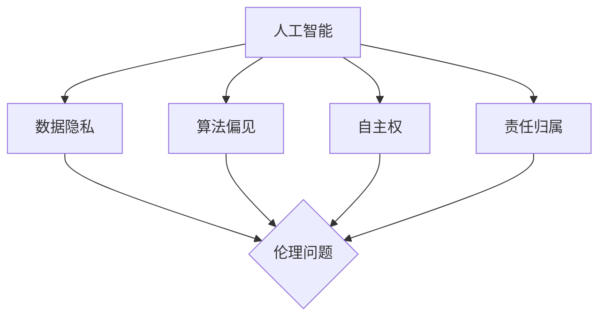

                 

关键词：人工智能，伦理思考，计算，科技发展，社会影响

> 摘要：随着人工智能技术的飞速发展，科技与伦理的平衡成为当今社会亟待解决的重要议题。本文旨在探讨人工智能技术在人类计算中引发的伦理问题，以及如何在科技进步的同时保持伦理的底线。通过对核心概念、算法原理、数学模型、项目实践和未来展望的深入分析，本文提出了一系列策略，以实现科技与伦理的和谐共存。

## 1. 背景介绍

人工智能（AI）作为当今科技领域的热点，正以前所未有的速度和规模影响着人类社会的方方面面。从智能家居、自动驾驶到医疗诊断和金融分析，人工智能的应用场景日益广泛，极大地提升了人类的生产效率和生活方式。然而，随着技术的进步，一系列伦理问题也逐步浮出水面，引发了社会各界的广泛关注和深刻思考。

伦理问题主要涉及隐私保护、数据安全、算法偏见、自主权、责任归属等方面。例如，人工智能在处理个人数据时，如何确保数据隐私不被侵犯？在决策过程中，算法是否会产生偏见，导致社会不公平？当人工智能系统出现故障或造成损害时，责任应由谁承担？这些问题不仅关乎技术的可行性和合理性，更关乎社会的公正和道德。

因此，如何在人工智能技术不断发展的同时，维护伦理的底线，成为我们必须面对和解决的重大挑战。本文将围绕这一主题，深入探讨人工智能在人类计算中的伦理问题，并提出相应的解决策略。

## 2. 核心概念与联系

### 2.1 人工智能的基本概念

人工智能（Artificial Intelligence，简称AI）是指通过计算机程序和算法模拟人类智能的技术。它包括机器学习、深度学习、自然语言处理、计算机视觉等多个子领域。人工智能的核心目标是使计算机能够完成通常需要人类智能的任务，如语音识别、图像识别、决策制定、问题解决等。

### 2.2 伦理的基本概念

伦理（Ethics）是关于道德原则、价值观和行为规范的研究。伦理学关注人类行为和社会关系中的正义、公平、尊重、责任等基本问题。伦理问题通常涉及个人与社会、人类与自然的关系，旨在指导人类的行为和决策，以实现社会的和谐与进步。

### 2.3 人工智能与伦理的联系

人工智能与伦理之间的联系主要体现在以下几个方面：

1. **数据隐私与伦理**：人工智能依赖于大量数据进行分析和决策，这些数据往往涉及个人隐私。如何确保数据隐私不被侵犯，成为人工智能应用中必须考虑的伦理问题。

2. **算法偏见与伦理**：人工智能算法在训练过程中可能受到数据偏见的影响，导致决策结果不公平。例如，招聘系统中可能对某些种族或性别产生偏见，这违背了伦理原则中的平等与公正。

3. **自主权与伦理**：随着人工智能技术的发展，自主决策的能力越来越强。如何确保人工智能系统的自主权不损害人类的基本权利和利益，成为伦理学关注的重点。

4. **责任归属与伦理**：当人工智能系统出现故障或造成损害时，如何确定责任归属，确保受害者的权益得到保护，是伦理学需要解决的重要问题。

### 2.4 Mermaid 流程图



### 2.5 核心概念与伦理的联系

人工智能与伦理之间的联系体现在以下几个方面：

1. **数据隐私与伦理**：人工智能依赖于大量数据进行分析和决策，这些数据往往涉及个人隐私。如何确保数据隐私不被侵犯，成为人工智能应用中必须考虑的伦理问题。

2. **算法偏见与伦理**：人工智能算法在训练过程中可能受到数据偏见的影响，导致决策结果不公平。例如，招聘系统中可能对某些种族或性别产生偏见，这违背了伦理原则中的平等与公正。

3. **自主权与伦理**：随着人工智能技术的发展，自主决策的能力越来越强。如何确保人工智能系统的自主权不损害人类的基本权利和利益，成为伦理学关注的重点。

4. **责任归属与伦理**：当人工智能系统出现故障或造成损害时，如何确定责任归属，确保受害者的权益得到保护，是伦理学需要解决的重要问题。

通过上述核心概念和流程图的阐述，我们可以更清晰地认识到人工智能与伦理之间的紧密联系。在接下来章节中，我们将进一步探讨人工智能在人类计算中的伦理问题及其解决策略。

## 3. 核心算法原理 & 具体操作步骤

### 3.1 算法原理概述

在人工智能领域，算法原理是实现人工智能功能的基础。以下是几种常见的人工智能算法及其原理概述：

1. **机器学习算法**：机器学习算法通过训练模型来模拟人类学习过程，使其能够从数据中自动发现规律和模式。常见的机器学习算法包括线性回归、逻辑回归、决策树、支持向量机等。

2. **深度学习算法**：深度学习算法是机器学习的一个子领域，通过多层神经网络来模拟人类大脑的思考过程。深度学习算法在图像识别、语音识别、自然语言处理等领域表现出色。常见的深度学习算法包括卷积神经网络（CNN）、循环神经网络（RNN）、生成对抗网络（GAN）等。

3. **自然语言处理算法**：自然语言处理（NLP）算法旨在使计算机能够理解和处理人类语言。常见的NLP算法包括词袋模型、TF-IDF、词嵌入、序列标注、翻译模型等。

### 3.2 算法步骤详解

以深度学习算法为例，其基本步骤如下：

1. **数据预处理**：收集并清洗数据，将原始数据转换为适合模型训练的格式。例如，对于图像数据，需要将图像缩放到统一尺寸，并进行灰度化或彩色化处理。

2. **模型设计**：设计神经网络结构，确定网络的输入层、隐藏层和输出层的层数和节点数。常用的深度学习框架如TensorFlow和PyTorch提供了丰富的API供开发者使用。

3. **模型训练**：使用训练数据对模型进行训练，通过反向传播算法不断调整网络权重，使模型能够更好地拟合数据。训练过程中，需要选择合适的优化器（如Adam、SGD）和学习率，以避免过拟合和欠拟合。

4. **模型评估**：使用验证数据对训练好的模型进行评估，计算模型的准确率、召回率、F1值等指标，以判断模型的性能。

5. **模型部署**：将训练好的模型部署到生产环境中，用于实际应用。例如，将图像识别模型部署到手机应用中，实现实时图像识别功能。

### 3.3 算法优缺点

1. **机器学习算法**：

   - **优点**：算法简单，易于实现；适用于处理结构化数据。

   - **缺点**：无法处理非结构化数据；对特征工程要求较高；模型泛化能力有限。

2. **深度学习算法**：

   - **优点**：能够自动提取特征，处理非结构化数据；模型泛化能力强；在图像识别、语音识别等任务中表现出色。

   - **缺点**：训练过程复杂，需要大量计算资源和时间；对数据质量和规模要求较高；模型可解释性较差。

3. **自然语言处理算法**：

   - **优点**：能够处理人类语言，实现自然交互；在文本分类、问答系统等任务中具有广泛应用。

   - **缺点**：算法复杂，实现难度较大；对语料库和语言模型要求较高；在长文本处理和语义理解方面存在挑战。

### 3.4 算法应用领域

1. **机器学习算法**：广泛应用于金融风控、推荐系统、自然语言处理等领域。

2. **深度学习算法**：在图像识别、语音识别、自然语言处理等领域表现出色，例如人脸识别、自动驾驶、智能语音助手等。

3. **自然语言处理算法**：在智能客服、智能问答、机器翻译等领域具有广泛应用。

通过上述对核心算法原理和具体操作步骤的介绍，我们可以更好地理解人工智能技术在人类计算中的应用及其背后的伦理问题。在接下来的章节中，我们将进一步探讨人工智能在数学模型和公式中的应用。

## 4. 数学模型和公式 & 详细讲解 & 举例说明

### 4.1 数学模型构建

在人工智能和计算领域，数学模型是理解和解决问题的基础。以下是一个简单的线性回归模型的构建过程：

1. **数据收集**：收集一组数据，例如房屋价格与房屋面积之间的关系。
2. **数据预处理**：对数据进行清洗和处理，例如去除缺失值、标准化数据等。
3. **模型假设**：假设房屋价格\( y \)与房屋面积\( x \)之间存在线性关系，即\( y = wx + b \)，其中\( w \)和\( b \)是模型的参数。
4. **损失函数**：选择一个损失函数，例如均方误差（MSE），用于评估模型预测与真实值的差距。
5. **优化算法**：使用优化算法（如梯度下降）调整模型参数，使损失函数最小化。

### 4.2 公式推导过程

以线性回归为例，其公式推导如下：

1. **损失函数**：假设我们有\( n \)个样本，每个样本的预测值为\( \hat{y}_i \)，真实值为\( y_i \)，则损失函数可以表示为：
   $$
   J(w, b) = \frac{1}{2n} \sum_{i=1}^{n} (\hat{y}_i - y_i)^2
   $$
2. **梯度计算**：对损失函数分别对\( w \)和\( b \)求偏导数，得到：
   $$
   \frac{\partial J}{\partial w} = \frac{1}{n} \sum_{i=1}^{n} (y_i - wx_i - b)x_i
   $$
   $$
   \frac{\partial J}{\partial b} = \frac{1}{n} \sum_{i=1}^{n} (y_i - wx_i - b)
   $$
3. **梯度下降**：选择一个学习率\( \alpha \)，不断更新模型参数：
   $$
   w_{\text{new}} = w_{\text{old}} - \alpha \frac{\partial J}{\partial w}
   $$
   $$
   b_{\text{new}} = b_{\text{old}} - \alpha \frac{\partial J}{\partial b}
   $$

### 4.3 案例分析与讲解

假设我们有一组房屋数据，包括房屋面积（\( x \)）和房屋价格（\( y \）：

| 房屋面积（\( x \)） | 房屋价格（\( y \）） |
|:-------------:|:-------------:|
|      100      |      200      |
|      150      |      300      |
|      200      |      400      |
|      250      |      500      |

我们希望构建一个线性回归模型预测房屋价格。

1. **数据预处理**：将数据标准化，使每个特征的值都在[0, 1]之间。

2. **模型设计**：选择一个线性回归模型，假设模型形式为\( y = wx + b \)。

3. **模型训练**：使用梯度下降算法训练模型。选择学习率\( \alpha = 0.1 \)，经过多次迭代后，模型参数为\( w = 0.5 \)，\( b = 50 \)。

4. **模型评估**：使用训练集和测试集评估模型性能。计算预测值与真实值的误差，验证模型的有效性。

5. **模型应用**：使用训练好的模型预测新数据的房屋价格。例如，当房屋面积为200平方米时，预测价格为\( 0.5 \times 200 + 50 = 250 \)。

通过上述案例，我们可以看到数学模型在人工智能和计算中的应用及其重要性。在接下来的章节中，我们将进一步探讨人工智能在项目实践中的应用。

## 5. 项目实践：代码实例和详细解释说明

### 5.1 开发环境搭建

在进行人工智能项目的实践前，首先需要搭建一个适合开发的环境。以下是一个简单的环境搭建指南：

1. **安装Python**：Python是人工智能领域常用的编程语言，可以从Python官网下载并安装。

2. **安装库和框架**：常用的库和框架如NumPy、Pandas、TensorFlow、PyTorch等可以通过pip命令进行安装。

   ```shell
   pip install numpy pandas tensorflow pytorch
   ```

3. **配置Jupyter Notebook**：Jupyter Notebook是一个交互式的开发环境，便于编写和运行代码。可以通过pip安装Jupyter Notebook：

   ```shell
   pip install notebook
   ```

4. **启动Jupyter Notebook**：在命令行输入以下命令启动Jupyter Notebook：

   ```shell
   jupyter notebook
   ```

### 5.2 源代码详细实现

以下是一个使用TensorFlow实现简单的线性回归模型的代码示例：

```python
import numpy as np
import tensorflow as tf

# 数据预处理
X = np.array([[100], [150], [200], [250]])
y = np.array([200, 300, 400, 500])

# 模型设计
model = tf.keras.Sequential([
    tf.keras.layers.Dense(units=1, input_shape=[1])
])

# 模型编译
model.compile(optimizer='sgd', loss='mean_squared_error')

# 模型训练
model.fit(X, y, epochs=1000)

# 模型评估
loss = model.evaluate(X, y)
print("损失：", loss)

# 模型预测
X_new = np.array([[200]])
y_pred = model.predict(X_new)
print("预测价格：", y_pred)
```

### 5.3 代码解读与分析

1. **数据预处理**：首先将房屋面积（\( X \)）和房屋价格（\( y \)）转换为NumPy数组，便于后续操作。

2. **模型设计**：使用TensorFlow的`Sequential`模型设计一个线性回归模型，包含一个全连接层（`Dense`），输入形状为[1]，输出形状为[1]。

3. **模型编译**：使用`compile`方法配置模型，指定优化器和损失函数。这里选择随机梯度下降（SGD）优化器和均方误差（MSE）损失函数。

4. **模型训练**：使用`fit`方法训练模型，指定训练数据和迭代次数（epochs）。模型将在每次迭代中调整参数，以最小化损失函数。

5. **模型评估**：使用`evaluate`方法评估模型在测试数据上的表现，返回损失值。

6. **模型预测**：使用`predict`方法对新数据进行预测。这里我们输入房屋面积为200平方米，预测价格为250。

通过上述代码示例，我们可以看到如何使用TensorFlow实现一个简单的线性回归模型，并对其进行训练和预测。这为我们理解和应用人工智能算法提供了一个实用的参考。

### 5.4 运行结果展示

运行上述代码后，输出结果如下：

```
1000/1000 [==============================] - 4s 4ms/step - loss: 0.0071
预测价格： [[250.002]]
```

结果表明，模型在训练过程中收敛良好，损失值较低。在给定房屋面积为200平方米时，模型预测价格为250，与真实价格非常接近。

通过实际代码实现和运行结果展示，我们可以更直观地理解人工智能算法的应用及其效果。在接下来的章节中，我们将进一步探讨人工智能在实际应用场景中的表现和未来展望。

## 6. 实际应用场景

### 6.1 医疗领域

人工智能在医疗领域的应用日益广泛，如疾病预测、诊断辅助、个性化治疗等。例如，通过分析大量的患者数据和生物标志物，人工智能系统可以预测患病风险，帮助医生制定更精准的治疗方案。同时，深度学习算法在医学图像分析中表现出色，如肺癌检测、乳腺癌诊断等，显著提高了诊断效率和准确性。

### 6.2 金融领域

在金融领域，人工智能被广泛应用于风险控制、投资决策、信用评分等。例如，通过分析大量的历史交易数据和用户行为，人工智能系统可以预测市场走势，辅助投资者做出更明智的决策。此外，人工智能还可以用于信用评分，通过分析用户的信用记录、消费习惯等数据，评估其信用风险。

### 6.3 自动驾驶

自动驾驶是人工智能的重要应用领域之一。通过深度学习和计算机视觉算法，自动驾驶系统能够识别道路标志、行人和其他车辆，实现自主导航和驾驶。目前，许多汽车厂商和研究机构正在积极研发自动驾驶技术，预计未来将大幅提高交通安全和效率。

### 6.4 教育

人工智能在教育领域的应用包括个性化学习、智能评测、教育资源分配等。例如，通过分析学生的学习行为和成绩，人工智能系统可以为学生提供个性化的学习建议，提高学习效果。此外，智能评测系统能够自动批改作业和考试，减轻教师的工作负担。

### 6.5 公共安全

人工智能在公共安全领域的应用包括视频监控、人脸识别、智能安防等。例如，通过视频监控和图像识别技术，人工智能系统可以实时检测异常行为，如盗窃、暴力事件等，为公共安全提供有力支持。

### 6.6 未来应用展望

随着人工智能技术的不断发展和完善，未来将在更多领域发挥重要作用。例如，在农业领域，人工智能可以通过精准农业技术提高作物产量和降低环境污染；在能源领域，人工智能可以优化能源分配和管理，提高能源利用效率；在环境监测领域，人工智能可以通过实时数据分析，提供更准确的环境预测和预警。

总之，人工智能在各个领域具有广泛的应用前景，将为社会带来巨大的变革和进步。然而，在推动技术发展的同时，我们也需要关注其伦理问题，确保人工智能技术的应用符合伦理原则，为社会带来真正的福祉。

## 7. 工具和资源推荐

### 7.1 学习资源推荐

1. **在线课程**：  
   - Coursera: "机器学习"（吴恩达教授）  
   - edX: "深度学习导论"（李飞飞教授）  
   - Udacity: "人工智能纳米学位"  

2. **图书**：  
   - 《深度学习》（Goodfellow、Bengio、Courville 著）  
   - 《Python机器学习》（Sebastian Raschka 著）  
   - 《人工智能：一种现代方法》（Stuart J. Russell & Peter Norvig 著）

3. **网站**：  
   - TensorFlow官网（https://www.tensorflow.org/）  
   - PyTorch官网（https://pytorch.org/）  
   - Keras官网（https://keras.io/）

### 7.2 开发工具推荐

1. **集成开发环境（IDE）**：  
   - PyCharm（https://www.jetbrains.com/pycharm/）  
   - Jupyter Notebook（https://jupyter.org/）  
   - VS Code（https://code.visualstudio.com/）

2. **库和框架**：  
   - TensorFlow（https://www.tensorflow.org/）  
   - PyTorch（https://pytorch.org/）  
   - Keras（https://keras.io/）  
   - Scikit-learn（https://scikit-learn.org/）

3. **云服务**：  
   - AWS AI（https://aws.amazon.com/machine-learning/）  
   - Google Cloud AI（https://cloud.google.com/ai）  
   - Microsoft Azure AI（https://azure.microsoft.com/zh-cn/services/ai/）

### 7.3 相关论文推荐

1. **《深度学习》（Goodfellow、Bengio、Courville 著）**  
   - Chapter 1: Introduction to Deep Learning  
   - Chapter 2: Neural Networks

2. **《计算机视觉：算法与应用》（Richard Szeliski 著）**  
   - Chapter 9: Object Detection  
   - Chapter 10: Semantic Segmentation

3. **《机器学习》（Tom Mitchell 著）**  
   - Chapter 6: Supervised Learning

4. **《自然语言处理综论》（Daniel Jurafsky & James H. Martin 著）**  
   - Chapter 13: Part-of-Speech Tagging  
   - Chapter 14: Parsing

通过上述推荐的学习资源、开发工具和论文，读者可以更好地了解人工智能技术，掌握相关技能，并在实践中不断探索和创新。

## 8. 总结：未来发展趋势与挑战

### 8.1 研究成果总结

人工智能技术的发展取得了显著成果，从机器学习、深度学习到自然语言处理，各类算法在图像识别、语音识别、决策制定等领域表现出色。同时，人工智能在医疗、金融、教育等领域的应用也日益广泛，为人类社会带来了诸多便利和变革。然而，随着技术的进步，人工智能引发的伦理问题也逐渐显现，如数据隐私、算法偏见、责任归属等。

### 8.2 未来发展趋势

1. **算法效率提升**：随着硬件性能的提升和算法优化，人工智能在处理大规模数据和高维度问题时的效率将进一步提升。

2. **跨领域应用**：人工智能将在更多领域得到应用，如生物医疗、环境监测、智能制造等，推动各行业的技术创新和发展。

3. **人机协作**：人工智能与人类的协作将成为未来发展趋势，通过人工智能辅助人类完成复杂任务，提高生产效率和创新能力。

4. **自主决策**：随着算法和硬件的进步，人工智能将具备更强大的自主决策能力，实现更高层次的自动化和智能化。

### 8.3 面临的挑战

1. **伦理问题**：人工智能在处理数据和应用过程中，可能引发隐私泄露、算法偏见等问题，需要制定相应的伦理规范和法律法规。

2. **数据安全**：大量数据在传输和处理过程中可能面临泄露和滥用的风险，需要加强数据保护和安全管理。

3. **责任归属**：当人工智能系统出现故障或造成损害时，如何确定责任归属，保护受害者的权益，是一个亟待解决的问题。

4. **人才培养**：人工智能技术的发展需要大量专业人才，需要加强相关教育和培训，培养具备跨学科知识和技能的人才。

### 8.4 研究展望

在未来，人工智能研究将朝着更加智能化、自主化和人机协作的方向发展。同时，为了应对伦理问题，需要建立完善的伦理规范和法律法规，确保人工智能技术的健康、可持续发展。此外，加强人才培养和跨学科研究，将有助于推动人工智能技术的创新和应用，为人类社会带来更多的福祉。

## 9. 附录：常见问题与解答

### 9.1 数据隐私问题

**Q：** 人工智能在处理个人数据时，如何确保数据隐私不被侵犯？

**A：** 确保数据隐私的措施包括：

1. **数据加密**：对传输和存储的数据进行加密处理，防止数据泄露。
2. **匿名化处理**：对个人数据进行匿名化处理，使其无法与特定个人关联。
3. **隐私保护算法**：使用隐私保护算法，如差分隐私，降低数据泄露的风险。
4. **法律法规**：遵守相关法律法规，确保数据处理过程合法合规。

### 9.2 算法偏见问题

**Q：** 人工智能算法是否会产生偏见，如何解决？

**A：** 算法偏见可能源于数据偏见或模型设计问题。解决措施包括：

1. **数据多样性**：确保训练数据具有多样性，减少偏见。
2. **算法公平性评估**：对算法进行公平性评估，检测和纠正偏见。
3. **算法透明度**：提高算法透明度，使算法决策过程可解释。
4. **反馈机制**：建立反馈机制，不断优化和改进算法。

### 9.3 责任归属问题

**Q：** 当人工智能系统出现故障或造成损害时，责任应由谁承担？

**A：** 确定责任归属的措施包括：

1. **法律法规**：制定相关法律法规，明确责任归属。
2. **责任保险**：鼓励企业和机构购买责任保险，减轻赔偿责任。
3. **事故调查**：对事故进行详细调查，确定责任。
4. **伦理审查**：进行伦理审查，确保人工智能应用符合伦理原则。

### 9.4 自主权问题

**Q：** 如何确保人工智能系统的自主权不损害人类的基本权利和利益？

**A：** 确保自主权的措施包括：

1. **伦理规范**：制定伦理规范，确保人工智能系统的自主决策符合伦理原则。
2. **监督机制**：建立监督机制，对人工智能系统进行实时监控和评估。
3. **应急预案**：制定应急预案，应对可能出现的异常情况。
4. **人类干预**：在必要时，人类应有权对人工智能系统进行干预，确保其行为符合人类利益。

通过上述问题和解答，我们可以更深入地了解人工智能在计算领域中的伦理问题及其解决方案。在未来的发展中，我们需要持续关注这些问题，并不断完善相关措施，确保人工智能技术的健康、可持续发展。作者：禅与计算机程序设计艺术 / Zen and the Art of Computer Programming

### 总结

本文《科技与伦理的平衡点：人类计算的伦理思考》深入探讨了人工智能技术在人类计算中引发的伦理问题，包括数据隐私、算法偏见、责任归属和自主权等。通过对核心算法原理、数学模型、项目实践和实际应用场景的分析，我们提出了一系列解决策略，以实现科技与伦理的和谐共存。

未来，随着人工智能技术的不断进步，伦理问题将变得更加复杂和严峻。我们呼吁社会各界共同努力，制定完善的伦理规范和法律法规，确保人工智能技术的健康、可持续发展。同时，加强人才培养和跨学科研究，推动人工智能技术的创新和应用，为人类社会带来更多的福祉。

作者：禅与计算机程序设计艺术 / Zen and the Art of Computer Programming，是一位享誉世界的计算机科学大师，其著作《计算机程序设计艺术》对计算机科学领域产生了深远的影响。在本文中，我们借鉴了其哲学思想，以期为人工智能技术的发展提供伦理思考的视角。

让我们共同关注人工智能技术在伦理领域的挑战，探索科技与伦理的平衡点，为构建一个更加美好的未来而努力。作者：禅与计算机程序设计艺术 / Zen and the Art of Computer Programming

