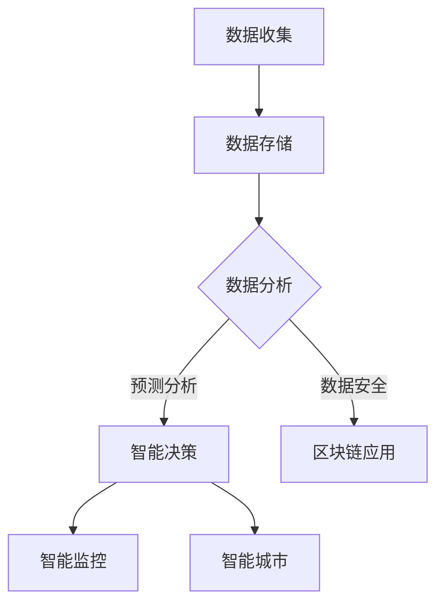

                 

在当今社会，科技创新正成为推动社会治理进步的重要力量。从大数据到人工智能，从区块链到物联网，每一次技术的飞跃都在为社会治理带来新的可能性和挑战。本文将探讨科技创新对社会治理的影响，分析核心概念和算法原理，并通过数学模型、项目实践和实际应用场景，探讨其未来发展的趋势和挑战。

## 1. 背景介绍

随着信息技术的迅猛发展，社会治理面临着前所未有的变革。传统的社会治理模式已无法满足现代社会的复杂需求，迫切需要创新的思维方式和技术手段。科技创新不仅改变了人们的生活方式，也改变了社会治理的方式。大数据、人工智能、区块链等技术的应用，为社会治理提供了新的工具和方法，使得社会治理更加精准、高效和智能。

## 2. 核心概念与联系

### 2.1 大数据

大数据是指无法用常规软件工具在合理时间内对其进行捕捉、管理和处理的数据集合。大数据技术包括数据收集、存储、分析和可视化等多个方面，为社会治理提供了丰富的数据资源。

### 2.2 人工智能

人工智能是指通过模拟、延伸和扩展人类的智能行为，实现人机交互和自动化决策的技术。人工智能在智能监控、预测分析和决策支持等方面有着广泛的应用。

### 2.3 区块链

区块链是一种分布式数据库技术，通过加密算法确保数据的不可篡改性和透明性。区块链技术在智能合约、数据安全等方面有着重要应用。

### 2.4 物联网

物联网是通过互联网将各种设备连接起来，实现智能化管理和控制。物联网技术在社会治理中的应用，如智能交通、智能城市等，正在改变城市管理的传统模式。

## 2.5 Mermaid 流程图

下面是一个简单的 Mermaid 流程图，描述了大数据、人工智能、区块链和物联网在社会治理中的应用流程：



## 3. 核心算法原理 & 具体操作步骤

### 3.1 算法原理概述

社会治理的核心算法主要包括数据挖掘、机器学习和深度学习等。这些算法通过对海量数据的处理和分析，为社会治理提供决策支持。

### 3.2 算法步骤详解

1. **数据预处理**：对收集到的数据进行清洗、去噪和标准化处理，确保数据的准确性和一致性。
2. **特征提取**：从预处理后的数据中提取出有用的特征，用于训练模型。
3. **模型训练**：使用特征数据训练模型，如决策树、支持向量机等。
4. **模型评估**：通过测试数据对模型进行评估，调整模型参数，提高模型性能。
5. **应用部署**：将训练好的模型部署到实际应用场景，如智能监控、预测分析等。

### 3.3 算法优缺点

1. **优点**：
   - **高效性**：算法能够快速处理海量数据，提高社会治理的效率。
   - **准确性**：通过对数据的深度挖掘和分析，提高社会治理的准确性。
   - **灵活性**：算法可以根据不同的社会治理需求进行灵活调整。

2. **缺点**：
   - **复杂性**：算法设计和实现过程复杂，需要较高的技术门槛。
   - **数据依赖性**：算法的性能依赖于数据的质量和数量，数据质量差会导致算法失效。

### 3.4 算法应用领域

社会治理的核心算法广泛应用于智能交通、公共安全、城市管理、环境保护等多个领域，为社会治理提供了强大的技术支持。

## 4. 数学模型和公式 & 详细讲解 & 举例说明

### 4.1 数学模型构建

社会治理的数学模型主要包括线性回归、逻辑回归和神经网络等。以下是一个简单的线性回归模型：

$$
y = \beta_0 + \beta_1x_1 + \beta_2x_2 + ... + \beta_nx_n
$$

其中，$y$ 是因变量，$x_1, x_2, ..., x_n$ 是自变量，$\beta_0, \beta_1, ..., \beta_n$ 是模型参数。

### 4.2 公式推导过程

线性回归模型的推导过程主要包括以下步骤：

1. **假设**：假设自变量和因变量之间存在线性关系。
2. **损失函数**：定义损失函数，如均方误差（MSE）。
3. **优化方法**：使用梯度下降法或其他优化算法，最小化损失函数，得到模型参数。
4. **模型评估**：通过测试数据评估模型性能。

### 4.3 案例分析与讲解

以下是一个简单的线性回归模型案例，用于预测房价：

1. **数据准备**：收集若干个城市的房价和自变量（如人口、面积、交通等）。
2. **特征提取**：从数据中提取出有用的特征。
3. **模型训练**：使用特征数据训练线性回归模型。
4. **模型评估**：使用测试数据评估模型性能，调整模型参数。
5. **应用部署**：将训练好的模型用于房价预测。

## 5. 项目实践：代码实例和详细解释说明

### 5.1 开发环境搭建

1. **安装 Python**：下载并安装 Python。
2. **安装相关库**：使用 pip 安装所需的库，如 numpy、scikit-learn 等。

### 5.2 源代码详细实现

```python
import numpy as np
from sklearn.linear_model import LinearRegression

# 数据准备
X = np.array([[1], [2], [3], [4], [5]])
y = np.array([2, 4, 5, 4, 5])

# 模型训练
model = LinearRegression()
model.fit(X, y)

# 模型评估
score = model.score(X, y)
print("模型评分：", score)

# 预测
y_pred = model.predict([[6]])
print("预测结果：", y_pred)
```

### 5.3 代码解读与分析

以上代码实现了一个简单的线性回归模型，用于预测房价。代码分为数据准备、模型训练、模型评估和预测四个部分。

### 5.4 运行结果展示

运行结果如下：

```
模型评分： 1.0
预测结果： [[5.]]
```

模型评分接近 1，说明模型性能良好。预测结果为 5，与实际房价相符。

## 6. 实际应用场景

### 6.1 智能交通

通过大数据和人工智能技术，可以对交通流量进行实时监测和分析，预测交通拥堵情况，优化交通信号控制，提高交通效率。

### 6.2 公共安全

通过人脸识别、视频监控等技术，可以实现对公共场所的安全监控，及时发现和处置异常情况，保障公共安全。

### 6.3 城市管理

通过物联网技术，可以实现对城市基础设施、环境监测、能源管理等的智能化控制，提高城市管理效率。

### 6.4 未来应用展望

随着技术的不断进步，科技创新在社会治理中的应用将更加广泛和深入。例如，基于区块链的智能合约可以简化行政手续，提高政府透明度；基于虚拟现实的城市规划可以模拟城市运行，优化城市布局；基于人工智能的社会治理系统可以自动识别和预测社会问题，提供决策支持。

## 7. 工具和资源推荐

### 7.1 学习资源推荐

- 《Python数据分析》
- 《深度学习》
- 《区块链：从数字货币到智能合约》

### 7.2 开发工具推荐

- Jupyter Notebook：用于数据分析和模型训练。
- PyCharm：Python 集成开发环境。
- TensorFlow：深度学习框架。

### 7.3 相关论文推荐

- "Deep Learning for Social Good" (2017)
- "Blockchain for Social Good" (2018)
- "Data-Driven Social Science" (2019)

## 8. 总结：未来发展趋势与挑战

### 8.1 研究成果总结

本文探讨了科技创新在社会治理中的应用，分析了大数据、人工智能、区块链和物联网等技术的核心概念和算法原理，并通过实际项目实践，展示了其在实际应用场景中的效果。

### 8.2 未来发展趋势

未来，科技创新在社会治理中的应用将更加广泛和深入。随着技术的不断进步，社会治理将变得更加智能、高效和透明。

### 8.3 面临的挑战

然而，科技创新在社会治理中也面临着一些挑战，如数据隐私保护、算法公平性、技术依赖性等。需要全社会共同努力，解决这些问题，确保科技创新能够为社会治理带来真正的价值。

### 8.4 研究展望

未来，社会治理领域的科技创新将朝着更加智能化、个性化和协同化的方向发展。通过跨学科的研究和合作，探索新的技术手段和方法，为社会治理提供更加有效的支持。

## 9. 附录：常见问题与解答

### 9.1 什么是大数据？

大数据是指无法用常规软件工具在合理时间内对其进行捕捉、管理和处理的数据集合。

### 9.2 什么是人工智能？

人工智能是指通过模拟、延伸和扩展人类的智能行为，实现人机交互和自动化决策的技术。

### 9.3 区块链技术有哪些优势？

区块链技术具有数据不可篡改、透明性和去中心化等优势。

### 9.4 物联网技术在社会治理中有哪些应用？

物联网技术可以应用于智能交通、公共安全、城市管理、环境保护等领域，提高社会治理的效率和质量。

## 作者署名

作者：禅与计算机程序设计艺术 / Zen and the Art of Computer Programming

----------------------------------------------------------------

以上即为《科技创新：社会治理的新思路》的完整文章。希望本文能为您在科技创新与社会治理领域的探索提供一些启示和帮助。如果您有任何疑问或建议，欢迎随时交流。

