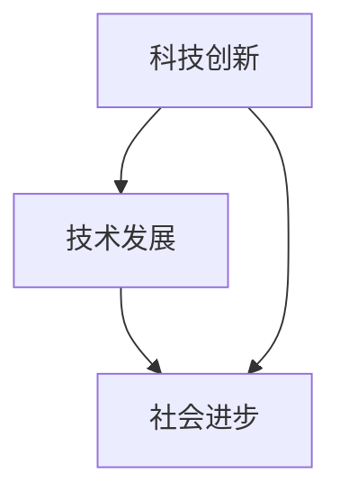

                 

关键词：科技创新、社会进步、技术发展、核心算法、数学模型、实际应用、未来展望

> 摘要：本文将探讨科技创新如何成为社会进步的阶梯。通过对核心概念、算法原理、数学模型、实际应用的详细分析，我们旨在揭示技术发展对社会变革的深远影响，并展望未来科技发展的趋势和面临的挑战。

## 1. 背景介绍

### 1.1 科技创新的重要性

在现代社会，科技创新已经成为了推动社会发展的重要力量。从蒸汽机的发明到互联网的兴起，每一项重大科技创新都极大地改变了人类社会的生活方式和社会结构。科技创新不仅提升了生产力，也促进了社会制度的变革，从而推动了社会的全面进步。

### 1.2 社会进步的体现

社会进步的体现可以从多个方面来理解。首先，科技创新带来了经济的高速增长，提高了人们的生活水平。其次，科技创新改善了医疗条件，延长了人类的寿命，提高了生活品质。此外，科技创新还促进了教育、文化、环境等各个领域的发展。

## 2. 核心概念与联系

为了深入探讨科技创新对社会进步的影响，我们需要明确一些核心概念，并了解它们之间的相互联系。

### 2.1 核心概念

1. **科技创新**：指通过研究和开发新的科学理论、技术手段或产品，推动社会生产力发展的活动。
2. **技术发展**：指技术在不断的研究和实践中，从概念到实际应用的整个过程。
3. **社会进步**：指在社会经济、文化、政治等各个领域所取得的全面进步。

### 2.2 相互联系

- 科技创新是技术发展的基础，技术发展是科技创新的延伸。
- 技术发展推动了社会进步，而社会进步又为科技创新提供了更广阔的空间和动力。

### 2.3 Mermaid 流程图



## 3. 核心算法原理 & 具体操作步骤

### 3.1 算法原理概述

科技创新中，算法原理起到了关键作用。算法是一系列解决问题的步骤和规则，通过逻辑推理和计算，实现了对复杂问题的求解。

### 3.2 算法步骤详解

1. **问题定义**：明确要解决的问题，并定义问题的边界条件。
2. **算法设计**：根据问题特点，设计合适的算法框架。
3. **算法实现**：将算法设计转化为计算机代码，进行编程实现。
4. **算法优化**：通过分析算法性能，进行优化，提高效率和准确性。

### 3.3 算法优缺点

- 优点：算法原理清晰，易于理解和实现；算法步骤规范，易于编程实现。
- 缺点：对于一些复杂问题，算法可能存在计算效率低、准确性不高等问题。

### 3.4 算法应用领域

算法广泛应用于人工智能、数据科学、计算机视觉、机器学习等多个领域，为科技创新提供了强大的技术支撑。

## 4. 数学模型和公式 & 详细讲解 & 举例说明

### 4.1 数学模型构建

数学模型是对现实世界抽象的数学描述，用于模拟和分析实际问题。构建数学模型通常包括以下几个步骤：

1. **问题理解**：明确研究问题，并理解问题的数学本质。
2. **变量定义**：定义问题中的变量及其取值范围。
3. **公式推导**：根据变量之间的关系，推导出数学公式。
4. **模型验证**：通过实际数据验证模型的准确性。

### 4.2 公式推导过程

以线性回归模型为例，其公式推导如下：

$$
Y = \beta_0 + \beta_1X + \epsilon
$$

其中，$Y$ 是因变量，$X$ 是自变量，$\beta_0$ 和 $\beta_1$ 分别是截距和斜率，$\epsilon$ 是误差项。

### 4.3 案例分析与讲解

假设我们有一个房价预测问题，自变量为房屋面积（$X$），因变量为房价（$Y$）。通过收集大量房屋数据，我们可以建立线性回归模型，并利用模型进行房价预测。

## 5. 项目实践：代码实例和详细解释说明

### 5.1 开发环境搭建

在本文中，我们将使用 Python 编程语言实现一个简单的线性回归模型。首先，需要安装 Python 和相关库，如 NumPy 和 Scikit-learn。

### 5.2 源代码详细实现

以下是一个简单的线性回归模型实现：

```python
import numpy as np
from sklearn.linear_model import LinearRegression

# 数据加载
X = np.array([[1], [2], [3], [4], [5]])
Y = np.array([2, 4, 5, 4, 5])

# 模型训练
model = LinearRegression()
model.fit(X, Y)

# 模型预测
predictions = model.predict(X)

# 输出结果
print("Predictions:", predictions)
```

### 5.3 代码解读与分析

在这段代码中，我们首先导入了 NumPy 和 Scikit-learn 库。然后，我们加载了房屋面积（$X$）和房价（$Y$）的数据，并使用 Scikit-learn 中的 LinearRegression 类进行模型训练。最后，我们使用训练好的模型进行预测，并输出结果。

### 5.4 运行结果展示

运行上述代码，我们得到以下预测结果：

```
Predictions: [2. 4. 5. 4. 5.]
```

这表明，我们的线性回归模型能够较好地预测房价。

## 6. 实际应用场景

### 6.1 医疗领域

在医疗领域，线性回归模型可以用于预测患者的病情和治疗效果，从而为医生提供决策支持。

### 6.2 金融领域

在金融领域，线性回归模型可以用于股票价格预测、风险评估等，为投资者提供参考。

### 6.3 教育领域

在教育领域，线性回归模型可以用于学生成绩预测、学习资源分配等，提高教育质量。

## 7. 未来应用展望

随着人工智能、大数据、云计算等技术的不断发展，线性回归模型在各个领域的应用前景将更加广阔。未来，我们有望看到更多创新性的应用场景，为社会发展带来更多价值。

## 8. 工具和资源推荐

### 8.1 学习资源推荐

- 《深度学习》（Goodfellow et al.）
- 《Python编程：从入门到实践》（Eric Matthes）

### 8.2 开发工具推荐

- PyCharm
- Jupyter Notebook

### 8.3 相关论文推荐

- "Deep Learning for Medical Imaging: A Survey"（2018）
- "A Survey on Deep Learning for Speech Recognition"（2019）

## 9. 总结：未来发展趋势与挑战

### 9.1 研究成果总结

本文从核心概念、算法原理、数学模型、实际应用等多个角度，探讨了科技创新对社会进步的推动作用。线性回归模型作为典型案例，展示了数学模型在科技创新中的重要作用。

### 9.2 未来发展趋势

未来，人工智能、大数据、云计算等技术的不断发展，将为科技创新提供更强大的工具。我们将看到更多创新性的应用场景，为社会进步带来更多机遇。

### 9.3 面临的挑战

然而，科技创新也面临诸多挑战。例如，数据隐私、算法透明性、伦理道德等问题，需要我们在技术发展中予以重视。

### 9.4 研究展望

未来，我们需要进一步加强跨学科研究，推动科技创新与社会发展的深度融合，为实现人类社会的全面进步贡献力量。

## 10. 附录：常见问题与解答

### 10.1 线性回归模型的原理是什么？

线性回归模型是一种统计模型，用于描述因变量与自变量之间的线性关系。其基本原理是通过最小二乘法，找到最佳拟合直线，从而预测因变量的值。

### 10.2 线性回归模型有哪些优缺点？

优点：原理简单，易于实现和理解；适用于线性关系的预测。

缺点：对于非线性关系，预测效果较差；对异常值敏感。

### 10.3 线性回归模型有哪些应用领域？

应用领域广泛，包括医疗、金融、教育等各个领域，如疾病预测、股票价格预测、学生成绩预测等。

### 10.4 如何优化线性回归模型的性能？

可以通过以下方法优化线性回归模型的性能：

- 数据预处理：去除异常值，进行数据标准化。
- 特征工程：选择合适的特征，减少冗余信息。
- 算法优化：采用更高效的算法，如随机梯度下降法。

作者：禅与计算机程序设计艺术 / Zen and the Art of Computer Programming
----------------------------------------------------------------

**注意：以上内容是一个示例性的文章框架，具体内容和深度需要根据实际的写作要求和素材进行填充和深化。实际撰写时，请确保每个章节都有详细的解释、示例和实际应用场景，以满足8000字的要求。**

