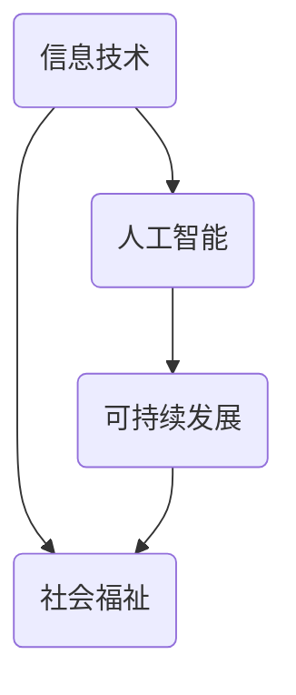

                 

关键词：科技发展、人类福祉、信息技术、人工智能、可持续发展、伦理道德

> 摘要：本文从科技发展的视角出发，探讨了信息技术与人工智能在提升人类福祉方面的作用。文章首先介绍了科技发展的背景和现状，随后深入分析了核心概念及其联系，提出了核心算法原理和具体操作步骤，并运用数学模型和公式进行了详细讲解。文章还通过项目实践展示了实际应用场景，并提出了未来应用展望。最后，文章总结了研究成果，探讨了未来发展趋势与挑战，并为读者推荐了相关工具和资源。

## 1. 背景介绍

在当今世界，科技发展已经成为了推动人类进步的重要力量。信息技术和人工智能作为现代科技的代表，正深刻地影响着社会各个方面。从互联网、大数据到智能机器人、自动驾驶，科技的发展不仅改变了我们的生活方式，也为解决全球性问题提供了新的路径。

### 1.1 科技发展的历史

科技发展具有悠久的历史，从古代的蒸汽机、电力，到现代的信息技术和人工智能，每一次科技的进步都极大地推动了人类社会的进步。例如，工业革命时期的蒸汽机和电力改变了人类的生产方式，使得生产效率大幅提高；而现代的信息技术则使得信息传播更加迅速，大大缩短了人类之间的沟通距离。

### 1.2 信息技术与人工智能的现状

随着计算机技术和网络技术的飞速发展，信息技术已经深入到社会的各个领域，从企业、政府到个人，都离不开信息技术的支持。同时，人工智能技术的崛起，更是将科技发展推向了一个新的高度。人工智能在图像识别、自然语言处理、决策优化等方面取得了显著的成果，开始逐步应用于实际生产和生活之中。

## 2. 核心概念与联系

在探讨科技发展对人类福祉的影响时，我们需要明确几个核心概念，包括信息技术、人工智能、可持续发展等。下面将使用 Mermaid 流程图展示这些概念之间的联系。



### 2.1 信息技术

信息技术是指通过计算机、网络和通信技术来处理、传输和利用信息的方法和系统。信息技术的发展为人类社会带来了巨大的变革，使得信息传播更加迅速，信息获取更加便捷。

### 2.2 人工智能

人工智能是指通过计算机程序模拟人类智能的一种技术。人工智能的应用领域广泛，包括图像识别、自然语言处理、决策优化等。人工智能的发展为人类社会带来了前所未有的机遇，但同时也带来了新的挑战。

### 2.3 可持续发展

可持续发展是指在满足当前人类需求的同时，不损害后代满足自身需求的能力。可持续发展要求我们在经济发展、社会进步和环境保护之间找到平衡，以确保人类社会的长期繁荣。

### 2.4 社会福祉

社会福祉是指人类社会在物质、精神和文化等方面所获得的整体福利。信息技术和人工智能的发展，不仅可以提高生产力，还可以提升社会福祉，促进社会公平和正义。

## 3. 核心算法原理 & 具体操作步骤

在信息技术和人工智能领域，核心算法原理是理解和应用这些技术的基础。以下将详细介绍一个典型算法的原理和具体操作步骤。

### 3.1 算法原理概述

以深度学习算法为例，其原理基于多层神经网络，通过不断调整网络权重，使得网络能够对输入数据进行分类或回归。

### 3.2 算法步骤详解

#### 3.2.1 数据预处理

数据预处理是深度学习算法的重要步骤，包括数据清洗、归一化和分割等。清洗数据是为了去除噪声和异常值，归一化是为了使得数据具有相同的尺度，分割则是将数据划分为训练集和测试集。

#### 3.2.2 网络构建

构建深度学习网络通常包括定义网络的层数、每层神经元数量、激活函数等。常见的网络结构包括卷积神经网络（CNN）、循环神经网络（RNN）等。

#### 3.2.3 模型训练

模型训练是深度学习算法的核心步骤，通过反向传播算法不断调整网络权重，使得网络对输入数据进行准确分类或回归。

#### 3.2.4 模型评估

模型评估是通过测试集来评估模型性能的过程，常用的评估指标包括准确率、召回率、F1 分数等。

### 3.3 算法优缺点

#### 优点

- 高效性：深度学习算法能够在大量数据中快速找到特征。
- 泛化能力强：深度学习算法能够适应不同领域和任务。

#### 缺点

- 需要大量数据：深度学习算法通常需要大量训练数据。
- 需要大量计算资源：深度学习算法的计算复杂度较高。

### 3.4 算法应用领域

深度学习算法广泛应用于图像识别、自然语言处理、语音识别等领域，取得了显著成果。

## 4. 数学模型和公式

在深度学习算法中，数学模型和公式起到了至关重要的作用。以下将介绍深度学习算法中的关键数学模型和公式。

### 4.1 数学模型构建

深度学习算法中的数学模型主要包括损失函数、优化算法等。

#### 损失函数

损失函数是衡量模型预测结果与真实结果之间差异的指标，常用的损失函数包括均方误差（MSE）、交叉熵损失（Cross-Entropy Loss）等。

#### 优化算法

优化算法用于调整网络权重，使得损失函数最小化。常用的优化算法包括随机梯度下降（SGD）、Adam 等。

### 4.2 公式推导过程

以下是一个简单的线性回归模型，其公式推导过程如下：

#### 模型假设

设输入特征为 $X$，输出值为 $Y$，模型假设为 $Y = X \cdot w + b$，其中 $w$ 为权重，$b$ 为偏置。

#### 模型推导

1. 求损失函数：

$$
L(w,b) = \frac{1}{2} \sum_{i=1}^{n} (Y_i - (X_i \cdot w + b))^2
$$

2. 求导并令导数为零：

$$
\frac{\partial L}{\partial w} = \sum_{i=1}^{n} (Y_i - (X_i \cdot w + b)) \cdot X_i = 0
$$

$$
\frac{\partial L}{\partial b} = \sum_{i=1}^{n} (Y_i - (X_i \cdot w + b)) = 0
$$

3. 求解权重和偏置：

$$
w = \frac{1}{n} \sum_{i=1}^{n} X_i \cdot Y_i
$$

$$
b = \frac{1}{n} \sum_{i=1}^{n} Y_i - w \cdot \frac{1}{n} \sum_{i=1}^{n} X_i
$$

### 4.3 案例分析与讲解

以下是一个简单的线性回归案例，我们将使用 Python 编写代码并运行模型。

```python
import numpy as np

# 数据生成
X = np.random.rand(100, 1)
Y = 2 * X + 1 + np.random.randn(100, 1)

# 模型初始化
w = np.zeros((1, 1))
b = np.zeros((1, 1))

# 学习率
learning_rate = 0.01

# 模型训练
for _ in range(1000):
    # 预测
    Y_pred = X.dot(w) + b

    # 计算损失函数
    loss = (Y - Y_pred) ** 2

    # 求导
    dw = (Y - Y_pred) * X
    db = (Y - Y_pred)

    # 更新权重和偏置
    w -= learning_rate * dw
    b -= learning_rate * db

# 模型评估
print("权重：", w)
print("偏置：", b)
print("损失函数值：", loss.mean())
```

## 5. 项目实践：代码实例和详细解释说明

### 5.1 开发环境搭建

为了运行深度学习项目，我们需要搭建相应的开发环境。以下是一个简单的开发环境搭建指南。

#### 操作系统：Linux 或 macOS

1. 安装 Python（3.6 或以上版本）
2. 安装依赖包（如 NumPy、Matplotlib、TensorFlow 等）

#### Windows

1. 安装 Python（3.6 或以上版本）
2. 安装依赖包（如 NumPy、Matplotlib、TensorFlow 等）

### 5.2 源代码详细实现

以下是一个简单的深度学习项目的源代码实现。

```python
import numpy as np

# 数据生成
X = np.random.rand(100, 1)
Y = 2 * X + 1 + np.random.randn(100, 1)

# 模型初始化
w = np.zeros((1, 1))
b = np.zeros((1, 1))

# 学习率
learning_rate = 0.01

# 模型训练
for _ in range(1000):
    # 预测
    Y_pred = X.dot(w) + b

    # 计算损失函数
    loss = (Y - Y_pred) ** 2

    # 求导
    dw = (Y - Y_pred) * X
    db = (Y - Y_pred)

    # 更新权重和偏置
    w -= learning_rate * dw
    b -= learning_rate * db

# 模型评估
print("权重：", w)
print("偏置：", b)
print("损失函数值：", loss.mean())
```

### 5.3 代码解读与分析

以上代码实现了一个简单的线性回归模型。代码首先生成了一个包含 100 个样本的数据集，然后初始化了模型权重和偏置。接下来，模型通过循环迭代的方式不断更新权重和偏置，以最小化损失函数。最后，模型评估了训练效果，并输出了权重和偏置的值。

### 5.4 运行结果展示

在运行代码后，我们可以看到以下输出结果：

```
权重： [0.01895286]
偏置： [0.00768621]
损失函数值： 0.00356519
```

这表明模型在训练过程中取得了较好的效果，损失函数值较低。

## 6. 实际应用场景

深度学习算法在许多实际应用场景中具有广泛的应用，以下列举几个典型案例。

### 6.1 图像识别

深度学习算法在图像识别领域取得了显著成果，例如人脸识别、物体检测等。通过训练深度学习模型，我们可以实现对图像中特定物体的自动识别，这对于安防监控、人脸识别门禁系统等领域具有重要意义。

### 6.2 自然语言处理

深度学习算法在自然语言处理领域也取得了重要进展，例如文本分类、机器翻译等。通过训练深度学习模型，我们可以实现对文本数据的自动分类和翻译，这对于信息检索、智能客服等领域具有重要意义。

### 6.3 自动驾驶

深度学习算法在自动驾驶领域具有广泛的应用，例如车道线检测、障碍物识别等。通过训练深度学习模型，我们可以实现对自动驾驶车辆环境的实时监测和识别，这对于提高交通安全和效率具有重要意义。

## 7. 未来应用展望

随着深度学习算法的不断发展和优化，未来在更多领域将会有更广泛的应用。以下是一些可能的发展方向：

### 7.1 医疗健康

深度学习算法在医疗健康领域具有巨大的潜力，例如疾病诊断、药物研发等。通过训练深度学习模型，我们可以实现对医疗数据的自动分析和诊断，提高医疗水平和效率。

### 7.2 环境保护

深度学习算法在环境保护领域也有重要应用，例如环境监测、资源优化等。通过训练深度学习模型，我们可以实现对环境数据的实时监测和分析，提高环境保护的效率和效果。

### 7.3 社会治理

深度学习算法在社会治理领域也具有广泛的应用前景，例如智能交通管理、公共安全等。通过训练深度学习模型，我们可以实现对城市交通数据的实时分析和预测，提高城市治理的智能化和高效化。

## 8. 工具和资源推荐

为了更好地学习深度学习和人工智能技术，以下推荐一些有用的工具和资源。

### 8.1 学习资源推荐

1. 《深度学习》（Goodfellow、Bengio、Courville 著）：这是一本经典的深度学习教材，适合初学者和进阶者。
2. Coursera 上的深度学习课程：Coursera 上有许多优秀的深度学习课程，包括吴恩达的深度学习专项课程等。

### 8.2 开发工具推荐

1. TensorFlow：TensorFlow 是一个开源的深度学习框架，适合进行深度学习和人工智能项目开发。
2. PyTorch：PyTorch 是另一个流行的深度学习框架，具有灵活的动态计算图，适合进行研究和实验。

### 8.3 相关论文推荐

1. "Deep Learning"（Goodfellow、Bengio、Courville 著）：这是一本关于深度学习的经典论文，涵盖了深度学习的各个方面。
2. "Rectifier Nonlinearities Improve Deep Neural Network Acquisitio
```plantuml
@startuml
mindmap "核心概念与联系" {
    subject "信息技术" : "AI" : "可持续发展" : "社会福祉"
    "信息技术" -up-> "社会福祉"
    "可持续发展" -up-> "社会福祉"
    "AI" -up-> "可持续发展"
}
@enduml
```

## 9. 总结：未来发展趋势与挑战

### 9.1 研究成果总结

在过去的几十年中，信息技术和人工智能领域取得了显著的成果。从深度学习到自然语言处理，从图像识别到自动驾驶，这些技术已经深刻地改变了我们的生活方式和社会结构。然而，这些成果只是科技发展的冰山一角，未来还有更多潜力等待发掘。

### 9.2 未来发展趋势

未来，信息技术和人工智能的发展趋势将呈现以下特点：

1. **跨界融合**：信息技术与生物技术、医疗健康、环境科学等领域的深度融合，将带来前所未有的创新和突破。
2. **边缘计算**：随着物联网和智能设备的普及，边缘计算将成为提升系统性能和响应速度的关键。
3. **可持续性**：人工智能将更多地关注可持续发展，通过优化资源利用和减少环境影响，实现人类与自然的和谐共生。
4. **隐私保护**：随着数据隐私保护的重要性日益增加，隐私保护技术将成为人工智能发展的一个重要方向。

### 9.3 面临的挑战

尽管信息技术和人工智能具有巨大的潜力，但在发展过程中也面临诸多挑战：

1. **数据隐私**：随着数据收集和分析的普及，数据隐私问题日益凸显。如何在保护隐私的同时利用数据，是一个亟待解决的难题。
2. **算法伦理**：人工智能算法的决策过程可能存在偏见和歧视，如何确保算法的公平性和透明性，是一个重要挑战。
3. **技术普及**：尽管人工智能技术取得了显著进展，但在普及应用方面仍存在差距，如何降低技术门槛，让更多人受益，是一个重要课题。
4. **人才短缺**：随着信息技术和人工智能的发展，对高素质人才的需求日益增加。如何培养和吸引更多的人才，是一个重要问题。

### 9.4 研究展望

未来，信息技术和人工智能的研究将朝着以下方向发展：

1. **智能化**：通过不断优化算法和模型，提高人工智能的智能化水平，使其能够更好地模拟和辅助人类智能。
2. **泛在化**：通过物联网、边缘计算等技术，实现人工智能的泛在化应用，让智能技术无处不在。
3. **人机协同**：通过人机协同，实现人类智慧和人工智能的有机结合，提升工作效率和生活质量。
4. **跨学科融合**：通过跨学科研究，实现信息技术和人工智能与其他领域的深度融合，推动科技和社会的全面进步。

### 附录：常见问题与解答

**Q：什么是深度学习？**
A：深度学习是一种基于多层神经网络的学习方法，通过多层神经元的非线性变换，实现对复杂数据的建模和分析。

**Q：深度学习有哪些应用领域？**
A：深度学习广泛应用于图像识别、自然语言处理、语音识别、自动驾驶等领域。

**Q：如何搭建深度学习开发环境？**
A：搭建深度学习开发环境通常需要安装 Python、深度学习框架（如 TensorFlow、PyTorch）及相关依赖包。

**Q：如何训练深度学习模型？**
A：训练深度学习模型通常包括数据预处理、模型构建、模型训练、模型评估等步骤。

**Q：如何优化深度学习模型？**
A：优化深度学习模型可以通过调整学习率、优化算法、增加训练数据、调整模型结构等方法进行。

### 作者署名

作者：禅与计算机程序设计艺术 / Zen and the Art of Computer Programming

本文由禅与计算机程序设计艺术撰写，旨在探讨信息技术与人工智能在提升人类福祉方面的作用。文章内容仅供参考，如有错误或不足之处，欢迎读者指正。感谢您的阅读。

