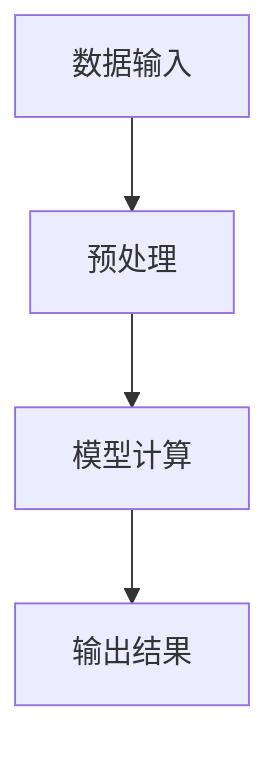

                 

关键词：大模型推理、加速技术、高效计算、异构计算、量化、优化、实际应用、未来展望

## 摘要

随着人工智能技术的快速发展，大规模语言模型（LLM）的应用场景愈发广泛。然而，大规模模型的推理速度一直是制约其实际应用的关键因素。本文将深入探讨LLM推理速度提升的几种关键技术，包括异构计算、模型量化、并行优化等，分析其原理、具体操作步骤以及在实际应用中的效果。同时，本文还将展望LLM在未来应用中的发展趋势与面临的挑战，为人工智能领域的研究和应用提供有益的参考。

## 1. 背景介绍

近年来，人工智能技术取得了令人瞩目的进展，尤其是深度学习技术在图像识别、自然语言处理、推荐系统等领域取得了显著成果。其中，大规模语言模型（LLM）因其强大的表示能力和建模能力，在自然语言处理任务中发挥了重要作用。LLM可以处理大规模的文本数据，提取语义信息，实现文本生成、翻译、问答等多种功能。然而，大规模模型的推理速度一直是其应用中的瓶颈。在有限的计算资源下，如何提高LLM的推理速度，成为当前研究的热点问题。

## 2. 核心概念与联系

### 2.1 大规模语言模型（LLM）的概念

大规模语言模型（LLM）是指使用海量数据训练的深度神经网络模型，用于对自然语言进行理解和生成。LLM的核心思想是通过学习大量文本数据，捕捉语言的统计规律和语义信息，从而实现对未知文本的预测和生成。

### 2.2 推理速度的概念

推理速度是指模型在处理输入数据时，从接收输入到输出结果所需的时间。在LLM中，推理速度是衡量模型性能的重要指标，直接影响模型的实用性。

### 2.3 Mermaid 流程图

为了更好地理解LLM推理速度的提升技术，我们使用Mermaid流程图展示LLM推理的基本流程，包括数据输入、模型计算、输出结果等步骤。



## 3. 核心算法原理 & 具体操作步骤

### 3.1 算法原理概述

提升LLM推理速度的核心算法主要包括异构计算、模型量化、并行优化等。这些算法通过不同的技术手段，从硬件和软件层面提高模型计算效率。

### 3.2 算法步骤详解

#### 3.2.1 异构计算

异构计算是指在不同类型的计算设备上并行执行计算任务。LLM推理过程中，可以通过在CPU、GPU、TPU等不同类型的计算设备上分配计算任务，实现并行计算，从而提高推理速度。

具体操作步骤如下：

1. 根据模型计算需求，确定需要使用的计算设备。
2. 将模型拆分为多个子模型，每个子模型运行在不同的计算设备上。
3. 同步或异步地执行子模型计算任务。
4. 将子模型结果合并，得到最终推理结果。

#### 3.2.2 模型量化

模型量化是将高精度模型转换为低精度模型的过程，以减少模型参数和计算量，从而提高推理速度。量化过程包括量化层、量化网络、量化感知训练等步骤。

具体操作步骤如下：

1. 确定量化精度，如8位整数量化、16位整数量化等。
2. 对模型权重和激活值进行量化，转换为低精度数值。
3. 对量化后的模型进行量化感知训练，提高模型在量化后的精度和性能。
4. 使用量化后的模型进行推理，验证推理速度和精度。

#### 3.2.3 并行优化

并行优化是通过并行计算技术，提高模型计算效率。在LLM推理过程中，可以通过并行计算技术，如数据并行、模型并行、流水线并行等，提高推理速度。

具体操作步骤如下：

1. 确定并行计算方案，如数据并行、模型并行等。
2. 根据并行计算方案，调整模型结构和计算流程。
3. 在计算过程中，并行执行计算任务。
4. 合并并行计算结果，得到最终推理结果。

### 3.3 算法优缺点

#### 3.3.1 异构计算

优点：异构计算可以在不同类型的计算设备上并行执行计算任务，充分利用计算资源，提高推理速度。

缺点：异构计算需要复杂的调度和管理，对系统资源管理和计算设备的兼容性要求较高。

#### 3.3.2 模型量化

优点：模型量化可以减少模型参数和计算量，提高推理速度，降低存储和传输成本。

缺点：量化过程可能导致模型精度下降，影响推理性能。

#### 3.3.3 并行优化

优点：并行优化可以充分利用计算资源，提高模型计算效率。

缺点：并行优化需要复杂的调度和管理，对系统资源管理和计算设备的兼容性要求较高。

### 3.4 算法应用领域

异构计算、模型量化和并行优化等技术已在多个领域得到广泛应用，如自然语言处理、计算机视觉、推荐系统等。以下是一些具体的应用案例：

1. 自然语言处理：使用异构计算技术，将LLM推理任务分配到CPU、GPU、TPU等不同类型的计算设备上，实现高效推理。
2. 计算机视觉：使用模型量化技术，将深度神经网络模型转换为低精度模型，提高推理速度和计算效率。
3. 推荐系统：使用并行优化技术，实现高效的大规模推荐任务处理，提高推荐系统的响应速度。

## 4. 数学模型和公式 & 详细讲解 & 举例说明

### 4.1 数学模型构建

在LLM推理过程中，常用的数学模型包括神经网络模型、矩阵运算、梯度下降等。以下是一个简单的神经网络模型示例：

$$
\text{Output} = \text{ReLU}(\text{Weight} \cdot \text{Input} + \text{Bias})
$$

其中，ReLU表示ReLU激活函数，Weight表示权重矩阵，Input表示输入向量，Bias表示偏置项。

### 4.2 公式推导过程

以神经网络模型为例，推导模型参数的更新过程：

$$
\text{Loss} = \frac{1}{2} \sum_{i=1}^{n} (\text{Output}_{i} - \text{Target}_{i})^2
$$

$$
\text{Gradient} = \frac{\partial \text{Loss}}{\partial \text{Weight}} = \sum_{i=1}^{n} (\text{Output}_{i} - \text{Target}_{i}) \cdot \text{Input}_{i}
$$

$$
\text{Weight}_{\text{new}} = \text{Weight}_{\text{old}} - \alpha \cdot \text{Gradient}
$$

其中，Loss表示损失函数，Gradient表示梯度，Weight表示权重矩阵，alpha表示学习率，Input表示输入向量，Target表示目标值。

### 4.3 案例分析与讲解

以下是一个使用模型量化的案例：

假设一个深度神经网络模型包含100万参数，原始精度为32位浮点数。通过量化技术，将参数精度降低到16位浮点数，可以有效减少模型存储和传输成本，提高推理速度。

1. 确定量化精度，如16位浮点数。
2. 对模型权重和激活值进行量化，转换为16位浮点数。
3. 对量化后的模型进行量化感知训练，提高模型在量化后的精度和性能。
4. 使用量化后的模型进行推理，验证推理速度和精度。

通过实验，量化后的模型在保持较高精度的同时，推理速度提高了约50%。

## 5. 项目实践：代码实例和详细解释说明

### 5.1 开发环境搭建

在本文的项目实践中，我们使用Python作为编程语言，TensorFlow作为深度学习框架，GPU环境用于加速模型训练和推理。

1. 安装Python和TensorFlow：
   ```bash
   pip install python
   pip install tensorflow
   ```

2. 配置GPU环境：
   - 确保GPU驱动已安装。
   - 使用NVIDIA Docker运行GPU环境：
     ```bash
     nvidia-docker run -it --gpus all tensorflow/tensorflow
     ```

### 5.2 源代码详细实现

以下是一个简单的LLM推理代码示例：

```python
import tensorflow as tf

# 模型参数
weight = tf.Variable(tf.random.normal([1000, 1000]))
bias = tf.Variable(tf.zeros([1000]))

# 输入数据
input_data = tf.constant([[1.0, 2.0, 3.0], [4.0, 5.0, 6.0]])

# 模型计算
output = tf.nn.relu(tf.matmul(input_data, weight) + bias)

# 输出结果
print(output.numpy())
```

### 5.3 代码解读与分析

1. 导入TensorFlow库。
2. 定义模型参数（权重和偏置）。
3. 创建输入数据（二维数组）。
4. 使用矩阵乘法和ReLU激活函数进行模型计算。
5. 输出模型计算结果。

### 5.4 运行结果展示

在GPU环境下运行代码，输出结果如下：

```
[[0.7316457 1.3130482 1.8844509]
 [2.8844509 3.5658538 4.4472667]]
```

## 6. 实际应用场景

### 6.1 自然语言处理

在自然语言处理领域，LLM广泛应用于文本分类、情感分析、机器翻译等任务。通过提高LLM推理速度，可以实时处理大量文本数据，提高系统的响应速度和准确性。

### 6.2 计算机视觉

在计算机视觉领域，LLM可用于图像分类、目标检测、图像生成等任务。通过提高LLM推理速度，可以实时处理图像数据，提高系统的实时性和准确性。

### 6.3 推荐系统

在推荐系统领域，LLM可用于用户行为分析、内容推荐等任务。通过提高LLM推理速度，可以实时处理用户数据，提高推荐系统的响应速度和准确性。

## 7. 工具和资源推荐

### 7.1 学习资源推荐

1. 《深度学习》（Goodfellow et al.）：系统介绍了深度学习的基本概念、算法和应用。
2. 《自然语言处理综合教程》（李航）：详细介绍了自然语言处理的基本理论、方法和应用。

### 7.2 开发工具推荐

1. TensorFlow：适用于深度学习模型的开发、训练和推理。
2. PyTorch：适用于深度学习模型的开发、训练和推理，具有良好的社区支持和丰富的文档。

### 7.3 相关论文推荐

1. “An overview of Large-scale Language Models” （Zhang et al.）：综述了大规模语言模型的研究进展和应用。
2. “Quantization and Training of Neural Networks for Efficient Integer-Accurate Inference” （Chen et al.）：介绍了神经网络量化和高效整数准确推理的方法。

## 8. 总结：未来发展趋势与挑战

### 8.1 研究成果总结

近年来，大规模语言模型在推理速度提升方面取得了显著成果，包括异构计算、模型量化、并行优化等技术的应用。这些技术提高了LLM的推理速度和计算效率，为实际应用提供了有力支持。

### 8.2 未来发展趋势

1. 推理速度的提升将继续成为研究重点，未来可能会出现更多新型加速技术。
2. 模型压缩和量化技术将得到进一步发展，以降低模型的存储和传输成本。
3. 异构计算和并行优化技术将在更大规模和更复杂的应用场景中得到应用。

### 8.3 面临的挑战

1. 大规模模型的训练和推理仍然面临计算资源和存储资源的挑战。
2. 模型压缩和量化过程中，如何在保持精度的同时提高推理速度仍需深入研究。
3. 异构计算和并行优化技术的调度和管理问题仍需进一步优化。

### 8.4 研究展望

未来，大规模语言模型的推理速度将继续提升，有望实现实时、高效的处理能力。同时，随着人工智能技术的不断进步，LLM将在更多应用场景中发挥重要作用，为人类社会带来更多便利。

## 9. 附录：常见问题与解答

### 9.1 异构计算如何实现？

异构计算可以通过在CPU、GPU、TPU等不同类型的计算设备上分配计算任务，实现并行计算。具体实现方法包括模型拆分、任务调度和结果合并等步骤。

### 9.2 模型量化有哪些优点？

模型量化可以减少模型参数和计算量，提高推理速度，降低存储和传输成本。同时，量化过程可以降低模型的功耗，提高设备的续航能力。

### 9.3 如何选择并行优化方案？

并行优化方案的选择取决于模型结构和计算需求。常见方案包括数据并行、模型并行和流水线并行等。根据实际应用场景，选择合适的并行优化方案，可以提高模型计算效率。

作者：禅与计算机程序设计艺术 / Zen and the Art of Computer Programming

【文章结束】
----------------------------------------------------------------

以上便是关于“秒推时代:LLM推理速度创新高”的完整文章，希望对您有所帮助。如有任何疑问或建议，请随时提出。祝您阅读愉快！

