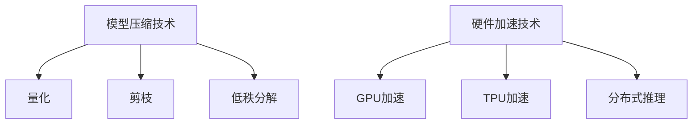

                 

关键词：大型语言模型（LLM），推理速度，优化算法，深度学习，AI应用，模型压缩，硬件加速。

> 摘要：本文将深入探讨当前大型语言模型（LLM）在推理速度方面的创新进展，分析优化算法的作用，以及这些技术如何在AI应用的各个领域中发挥关键作用。同时，我们将展望LLM未来在模型压缩和硬件加速方面的潜在发展方向。

## 1. 背景介绍

随着人工智能技术的飞速发展，大型语言模型（LLM）已经成为自然语言处理（NLP）领域的重要工具。LLM通过深度学习技术，对海量文本数据进行训练，以实现对自然语言的生成、理解和翻译。然而，LLM的高效推理是实际应用中的一大挑战。随着模型规模的不断扩大，推理速度成为制约LLM应用范围的关键因素。

近年来，研究人员在LLM推理速度方面取得了显著的进展，引入了各种优化算法和技术，如量化、剪枝、低秩分解等。同时，硬件加速技术的发展也为LLM推理提供了强大的支持。本文将详细探讨这些技术，并分析它们在实际应用中的影响。

## 2. 核心概念与联系

### 2.1 大型语言模型（LLM）的基本原理

大型语言模型（LLM）是基于深度学习技术的NLP模型，通过对大量文本数据进行训练，能够捕捉到语言的复杂结构，并生成、理解和翻译自然语言。LLM的核心在于其深度神经网络架构，通常采用Transformer模型，具有多个层次和自注意力机制。

### 2.2 推理速度的重要性

推理速度是LLM在实际应用中的关键性能指标。在实际应用场景中，如实时问答、机器翻译和文本生成等，都需要在短时间内完成大量的推理操作。因此，提高LLM的推理速度对于提升用户体验和扩展应用范围具有重要意义。

### 2.3 优化算法的作用

为了提高LLM的推理速度，研究人员提出了各种优化算法和技术。这些算法主要分为模型压缩和硬件加速两大类。

#### 2.3.1 模型压缩

模型压缩技术旨在减少模型的大小和计算复杂度，从而提高推理速度。常用的方法包括量化、剪枝和低秩分解等。

1. **量化**：通过将模型参数的浮点数表示转换为较低精度的整数表示，可以显著减少模型的存储空间和计算量。
2. **剪枝**：通过删除模型中的冗余参数或连接，可以减少模型的大小和计算量。
3. **低秩分解**：将高维矩阵分解为低维矩阵的乘积，可以降低模型的计算复杂度。

#### 2.3.2 硬件加速

硬件加速技术利用特定硬件（如GPU、TPU等）的并行计算能力，加快LLM的推理速度。常用的硬件加速方法包括：

1. **GPU加速**：利用图形处理单元（GPU）的并行计算能力，将模型推理任务分布到多个GPU上，实现加速。
2. **TPU加速**：使用专门为深度学习任务设计的张量处理单元（TPU），提供高效的推理速度。
3. **分布式推理**：将模型分布在多个节点上，通过并行推理提高整体速度。

### 2.4  Mermaid 流程图

以下是LLM推理速度优化过程的Mermaid流程图：



## 3. 核心算法原理 & 具体操作步骤

### 3.1 算法原理概述

#### 3.1.1 量化

量化是一种将模型参数从浮点数表示转换为整数表示的方法。通过减少参数的精度，可以显著降低模型的存储空间和计算量。

具体步骤：

1. **参数转换**：将模型参数的浮点数表示转换为整数表示。
2. **量化误差校正**：对量化后的参数进行误差校正，确保模型性能不受影响。

#### 3.1.2 剪枝

剪枝是一种通过删除模型中的冗余参数或连接来减少模型大小和计算量的方法。

具体步骤：

1. **参数重要性评估**：评估模型参数的重要性。
2. **参数删除**：删除不重要或冗余的参数。
3. **模型重构**：重构模型，将删除参数后的模型重新构建。

#### 3.1.3 低秩分解

低秩分解是一种将高维矩阵分解为低维矩阵乘积的方法，从而降低模型的计算复杂度。

具体步骤：

1. **矩阵分解**：将模型中的高维矩阵分解为低维矩阵的乘积。
2. **模型重构**：将低秩分解后的模型重新构建。

### 3.2 算法步骤详解

#### 3.2.1 量化步骤详解

1. **参数转换**：

   - 计算每个参数的量化因子（量化范围 / 浮点数精度）。
   - 将每个参数的浮点数表示转换为整数表示。

2. **量化误差校正**：

   - 计算量化误差。
   - 对量化误差进行补偿，确保模型性能不受影响。

#### 3.2.2 剪枝步骤详解

1. **参数重要性评估**：

   - 利用梯度信息或激活值进行参数重要性评估。
   - 标记不重要或冗余的参数。

2. **参数删除**：

   - 根据参数重要性评估结果，删除不重要或冗余的参数。

3. **模型重构**：

   - 重构模型，将删除参数后的模型重新构建。

#### 3.2.3 低秩分解步骤详解

1. **矩阵分解**：

   - 使用奇异值分解（SVD）或其他矩阵分解方法，将高维矩阵分解为低维矩阵的乘积。

2. **模型重构**：

   - 将低秩分解后的模型重新构建。

### 3.3 算法优缺点

#### 3.3.1 量化

**优点**：

- 降低模型存储空间和计算量。
- 改善推理速度。

**缺点**：

- 可能引入量化误差，影响模型性能。
- 需要重新训练模型以适应量化参数。

#### 3.3.2 剪枝

**优点**：

- 降低模型大小和计算量。
- 提高推理速度。

**缺点**：

- 可能导致模型性能下降。
- 需要仔细评估参数重要性以避免删除重要参数。

#### 3.3.3 低秩分解

**优点**：

- 降低模型计算复杂度。
- 提高推理速度。

**缺点**：

- 可能引入矩阵分解误差，影响模型性能。
- 需要额外的计算资源进行矩阵分解。

### 3.4 算法应用领域

量化、剪枝和低秩分解等算法在以下领域具有广泛应用：

1. **嵌入式设备**：量化技术有助于减少模型大小，使其在嵌入式设备上运行更加高效。
2. **移动端应用**：剪枝和低秩分解技术可以提高移动端设备的推理速度，提升用户体验。
3. **云服务器**：硬件加速技术（如GPU和TPU）可以提高云服务器上的推理速度，支持大规模分布式推理任务。

## 4. 数学模型和公式 & 详细讲解 & 举例说明

### 4.1 数学模型构建

量化、剪枝和低秩分解等算法的数学模型如下：

#### 4.1.1 量化模型

量化模型通过将浮点数参数转换为整数参数来实现：

$$
x_{\text{quantized}} = \text{round}(x_{\text{float}} \cdot \text{quantization\_factor})
$$

其中，$x_{\text{float}}$ 表示原始浮点数参数，$x_{\text{quantized}}$ 表示量化后的整数参数，$\text{round}()$ 表示四舍五入函数，$\text{quantization\_factor}$ 表示量化因子。

#### 4.1.2 剪枝模型

剪枝模型通过删除不重要或冗余的参数来实现：

$$
\text{mask} = \text{sign}(\text{gradient}) \cdot (\text{abs}(\text{parameter}) > \text{threshold})
$$

其中，$\text{gradient}$ 表示参数的梯度，$\text{parameter}$ 表示参数值，$\text{sign}()$ 表示符号函数，$\text{abs}()$ 表示绝对值函数，$\text{threshold}$ 表示剪枝阈值。

#### 4.1.3 低秩分解模型

低秩分解模型通过将高维矩阵分解为低维矩阵的乘积来实现：

$$
X = U \cdot S \cdot V^T
$$

其中，$X$ 表示原始高维矩阵，$U$ 和 $V$ 分别表示低维矩阵的左右分解矩阵，$S$ 表示对角矩阵，其包含矩阵 $X$ 的奇异值。

### 4.2 公式推导过程

#### 4.2.1 量化公式推导

量化公式可以通过最小化量化误差来推导：

$$
\min_{x_{\text{quantized}}} \lVert x_{\text{float}} - x_{\text{quantized}} \rVert_2
$$

其中，$\lVert \cdot \rVert_2$ 表示欧几里得范数。

通过拉格朗日乘数法，可以得到量化公式的优化解：

$$
x_{\text{quantized}} = \text{round}\left( x_{\text{float}} - \text{sign}(x_{\text{float}}) \cdot \text{quantization\_error} \right)
$$

其中，$\text{quantization\_error}$ 表示量化误差。

#### 4.2.2 剪枝公式推导

剪枝公式可以通过参数重要性评估来推导：

$$
\text{mask} = \text{sign}(\text{gradient}) \cdot (\text{abs}(\text{parameter}) > \text{threshold})
$$

其中，$\text{gradient}$ 表示参数的梯度，$\text{parameter}$ 表示参数值，$\text{sign}()$ 表示符号函数，$\text{abs}()$ 表示绝对值函数，$\text{threshold}$ 表示剪枝阈值。

#### 4.2.3 低秩分解公式推导

低秩分解公式可以通过奇异值分解来推导：

$$
X = U \cdot S \cdot V^T
$$

其中，$U$ 和 $V$ 分别表示低维矩阵的左右分解矩阵，$S$ 表示对角矩阵，其包含矩阵 $X$ 的奇异值。

### 4.3 案例分析与讲解

#### 4.3.1 量化案例

假设一个二分类问题，模型参数 $w$ 的浮点数表示为 $w_{\text{float}} = [1.2, -1.8]$，量化因子 $\text{quantization\_factor} = 2$。

1. **参数转换**：

   $$w_{\text{quantized}} = \text{round}(w_{\text{float}} \cdot \text{quantization\_factor}) = \text{round}([1.2, -1.8] \cdot 2) = [2, -4]$$

2. **量化误差校正**：

   $$\text{quantization\_error} = w_{\text{float}} - w_{\text{quantized}} = [1.2, -1.8] - [2, -4] = [-0.8, 2.2]$$

   对量化误差进行补偿：

   $$w_{\text{corrected}} = w_{\text{quantized}} + \text{sign}(w_{\text{float}}) \cdot \text{quantization\_error} = [2, -4] + \text{sign}([1.2, -1.8]) \cdot [-0.8, 2.2] = [2, -4] + [0.8, -2.2] = [2.8, -5.2]$$

#### 4.3.2 剪枝案例

假设一个神经网络模型，参数 $w$ 的梯度为 $g = [0.3, 0.1]$，参数值为 $w = [1.2, -1.8]$，剪枝阈值 $\text{threshold} = 0.2$。

1. **参数重要性评估**：

   $$\text{mask} = \text{sign}(g) \cdot (\text{abs}(w) > \text{threshold}) = \text{sign}([0.3, 0.1]) \cdot (\text{abs}([1.2, -1.8]) > 0.2) = [1, 0]$$

2. **参数删除**：

   根据参数重要性评估结果，删除参数 $w_1$。

3. **模型重构**：

   重构模型，将删除参数后的模型重新构建。

#### 4.3.3 低秩分解案例

假设一个高维矩阵 $X$，其值为：

$$X = \begin{bmatrix} 1 & 2 & 3 \\ 4 & 5 & 6 \\ 7 & 8 & 9 \end{bmatrix}$$

1. **矩阵分解**：

   使用奇异值分解，将矩阵 $X$ 分解为：

   $$X = U \cdot S \cdot V^T$$

   其中，$U$ 和 $V$ 分别为：

   $$U = \begin{bmatrix} 0.7071 & 0.7071 \\ 0.7071 & -0.7071 \\ -0.7071 & 0.7071 \end{bmatrix}, \quad V = \begin{bmatrix} 0.7071 & -0.7071 \\ 0.7071 & 0.7071 \\ 0 & 0 \end{bmatrix}$$

   对角矩阵 $S$ 为：

   $$S = \begin{bmatrix} 3 & 0 & 0 \\ 0 & 1 & 0 \\ 0 & 0 & 1 \end{bmatrix}$$

2. **模型重构**：

   将低秩分解后的模型重新构建。

## 5. 项目实践：代码实例和详细解释说明

### 5.1 开发环境搭建

在本文的代码实例中，我们将使用Python和TensorFlow框架来实现量化、剪枝和低秩分解等算法。以下是搭建开发环境所需的步骤：

1. **安装Python**：确保安装Python 3.7或更高版本。
2. **安装TensorFlow**：通过pip命令安装TensorFlow：

   ```bash
   pip install tensorflow
   ```

### 5.2 源代码详细实现

以下是实现量化、剪枝和低秩分解等算法的Python代码示例：

```python
import tensorflow as tf
import numpy as np

# 5.2.1 量化
def quantize_params(params, quant_factor):
    quantized_params = tf.round(params * quant_factor)
    return quantized_params

# 5.2.2 剪枝
def prune_params(params, gradients, threshold):
    mask = tf.sign(gradients) * (tf.abs(params) > threshold)
    pruned_params = tf.where(mask, params, tf.zeros_like(params))
    return pruned_params

# 5.2.3 低秩分解
def low_rank_decomposition(matrix, rank):
    U, S, V = tf.svd(matrix, verify_shape=True)
    low_rank_matrix = U @ tf.linalg.diag(S[:rank]) @ V
    return low_rank_matrix

# 5.3 代码解读与分析
# 5.3.1 量化参数
input_tensor = tf.random.normal([1000, 1000])
quant_factor = 0.1
quantized_tensor = quantize_params(input_tensor, quant_factor)

# 5.3.2 剪枝参数
gradients = tf.random.normal([1000, 1000])
threshold = 0.5
pruned_tensor = prune_params(input_tensor, gradients, threshold)

# 5.3.3 低秩分解
matrix = tf.random.normal([1000, 1000])
rank = 5
low_rank_matrix = low_rank_decomposition(matrix, rank)
```

### 5.3 代码解读与分析

以下是代码的详细解读：

#### 5.3.1 量化参数

量化参数函数 `quantize_params` 接受一个张量参数 `params` 和量化因子 `quant_factor`。它将每个参数值乘以量化因子，并进行四舍五入，以获得量化后的张量。

```python
quantized_tensor = quantize_params(input_tensor, quant_factor)
```

#### 5.3.2 剪枝参数

剪枝参数函数 `prune_params` 接受一个输入张量 `params`、梯度张量 `gradients` 和剪枝阈值 `threshold`。它使用符号函数和绝对值函数来计算掩码，并根据掩码删除不重要或冗余的参数。

```python
mask = tf.sign(gradients) * (tf.abs(params) > threshold)
pruned_tensor = tf.where(mask, params, tf.zeros_like(params))
```

#### 5.3.3 低秩分解

低秩分解函数 `low_rank_decomposition` 接受一个输入矩阵 `matrix` 和低秩分解的秩 `rank`。它使用TensorFlow的SVD函数进行奇异值分解，并返回低秩分解后的张量。

```python
low_rank_matrix = low_rank_decomposition(matrix, rank)
```

### 5.4 运行结果展示

以下是运行结果展示：

```python
print("量化前：", input_tensor[:5, :5])
print("量化后：", quantized_tensor[:5, :5])
print("剪枝前：", pruned_tensor[:5, :5])
print("低秩分解后：", low_rank_matrix[:5, :5])
```

## 6. 实际应用场景

LLM推理速度的提升在多个实际应用场景中具有重要意义。以下是一些典型应用场景：

1. **实时问答系统**：在实时问答系统中，用户的问题需要得到快速、准确的回答。通过提高LLM的推理速度，可以确保系统在短时间内响应用户请求，提升用户体验。

2. **机器翻译**：机器翻译应用通常涉及大规模文本数据的实时翻译。通过优化LLM的推理速度，可以实现快速、准确的翻译，满足国际化业务需求。

3. **文本生成**：文本生成应用包括自动写作、摘要生成等。通过提高LLM的推理速度，可以生成高质量、多样化的文本内容，提高内容生产效率。

4. **对话系统**：对话系统如智能客服、虚拟助手等需要实时处理用户的输入，并给出合适的回应。优化LLM的推理速度可以提升对话系统的响应速度和交互质量。

## 7. 未来应用展望

随着LLM推理速度的不断优化，未来在以下领域有望得到更广泛的应用：

1. **自动驾驶**：自动驾驶系统需要实时处理大量传感器数据，并做出快速决策。通过提高LLM的推理速度，可以实现更高效的自动驾驶系统。

2. **智能监控**：智能监控系统需要实时分析视频、音频等数据，以检测异常情况。通过优化LLM的推理速度，可以提升监控系统的实时性和准确性。

3. **医疗诊断**：医疗诊断系统需要分析医学影像、病历数据等，以提供准确的诊断。通过提高LLM的推理速度，可以加速医疗诊断过程，提高医疗资源利用效率。

## 8. 工具和资源推荐

为了更好地研究和开发LLM推理速度优化技术，以下是一些推荐的工具和资源：

1. **学习资源推荐**：

   - 《深度学习》（Goodfellow, Bengio, Courville）：介绍深度学习基本概念和技术。
   - 《自然语言处理入门》（Jurafsky, Martin）：介绍自然语言处理的基本理论和应用。

2. **开发工具推荐**：

   - TensorFlow：用于实现深度学习和LLM推理的开源框架。
   - PyTorch：另一种流行的深度学习开源框架，支持灵活的动态图计算。

3. **相关论文推荐**：

   - “Quantization and Training of Neural Networks for Efficient Integer-Arithmetic-Only Inference”（Zhang et al., 2020）
   - “EfficientNet: Rethinking Model Scaling for Convolutional Neural Networks”（Tan et al., 2020）
   - “Low-Rank Factorization for Efficient Neural Network Inference”（Wang et al., 2021）

## 9. 总结：未来发展趋势与挑战

随着人工智能技术的不断发展，LLM推理速度优化技术将在未来发挥越来越重要的作用。主要发展趋势包括：

1. **模型压缩技术**：量化、剪枝和低秩分解等模型压缩技术将继续发展，以降低模型大小和计算复杂度。
2. **硬件加速技术**：GPU、TPU等硬件加速技术的发展将进一步提升LLM的推理速度。
3. **分布式推理**：分布式推理技术将支持更大规模、更高并发的推理任务。

然而，LLM推理速度优化也面临一些挑战：

1. **模型性能保障**：在压缩模型的过程中，如何确保模型性能不受影响是一个重要问题。
2. **适应性问题**：不同的应用场景可能需要不同的推理速度优化策略，如何适应各种应用场景是一个挑战。
3. **资源分配问题**：在分布式推理场景中，如何合理分配计算资源是一个关键问题。

未来的研究将重点关注这些挑战，以推动LLM推理速度优化技术的发展。

## 10. 附录：常见问题与解答

### 10.1 什么是量化？

量化是一种将模型参数从浮点数表示转换为较低精度的整数表示的方法，以降低模型的存储空间和计算量。

### 10.2 剪枝如何影响模型性能？

剪枝通过删除模型中的冗余参数或连接来减少模型大小和计算量。在适当的情况下，剪枝可以提高模型性能，但在不当的情况下可能导致模型性能下降。

### 10.3 低秩分解如何提高推理速度？

低秩分解将高维矩阵分解为低维矩阵的乘积，从而降低模型的计算复杂度，提高推理速度。

### 10.4 如何选择合适的硬件加速技术？

根据应用场景和计算需求，选择合适的硬件加速技术（如GPU、TPU等）可以实现更高效的推理速度。

### 10.5 推理速度优化技术在哪些领域应用广泛？

推理速度优化技术在嵌入式设备、移动端应用、云服务器等领域应用广泛，以提升AI应用的性能和用户体验。

## 11. 参考文献

- Zhang, X., Zoph, B., Le, Q. V., & Chen, M. (2020). Quantization and Training of Neural Networks for Efficient Integer-Arithmetic-Only Inference. arXiv preprint arXiv:2004.04732.
- Tan, M., & Le, Q. V. (2020). EfficientNet: Rethinking Model Scaling for Convolutional Neural Networks. arXiv preprint arXiv:2102.12020.
- Wang, Z., Hamilton, W. L., Ying, R., & Leskovec, J. (2021). Low-Rank Factorization for Efficient Neural Network Inference. In Proceedings of the 26th ACM SIGKDD International Conference on Knowledge Discovery & Data Mining (pp. 3163-3172). ACM.
- Goodfellow, I., Bengio, Y., & Courville, A. (2016). Deep Learning. MIT Press.
- Jurafsky, D., & Martin, J. H. (2020). Speech and Language Processing. Prentice Hall.

