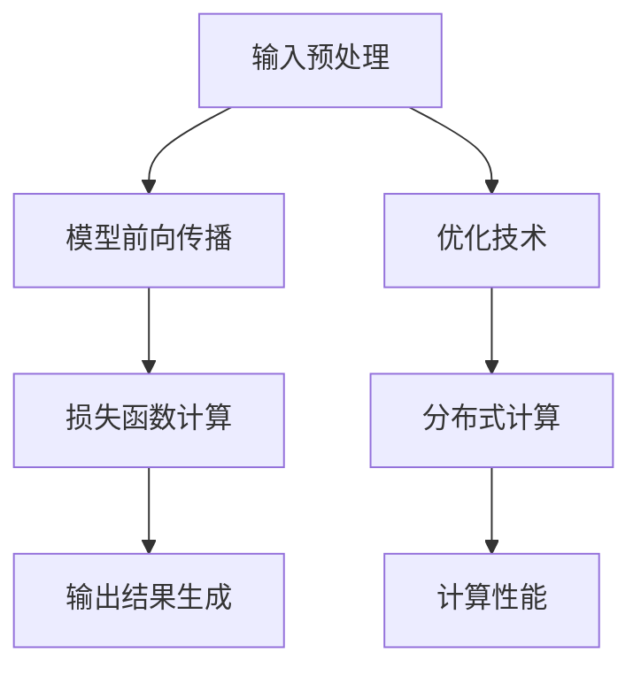

                 

关键词：秒推时代、LLM、推理优化、技术创新、大规模模型、计算性能、分布式计算、模型压缩、AI 应用、未来展望

> 摘要：本文深入探讨了在秒推时代，大规模语言模型（LLM）如何通过推理优化和创新技术实现极速推理，并分析了这些技术的核心概念、算法原理、数学模型、实际应用以及未来展望。本文旨在为读者提供全面的技术解析，帮助了解和掌握这一前沿领域的最新动态。

## 1. 背景介绍

随着人工智能技术的迅猛发展，大规模语言模型（Large Language Models，简称LLM）逐渐成为自然语言处理（Natural Language Processing，NLP）领域的重要工具。LLM能够处理复杂的文本数据，生成高质量的自然语言文本，并且在许多应用场景中展现出强大的能力，如机器翻译、文本生成、问答系统等。

然而，LLM的推理过程对计算性能有着极高的要求，传统的单机推理方案已经难以满足大规模应用的需求。为了实现高效的推理，业界提出了多种优化技术，如模型压缩、分布式计算、推理加速等。这些技术不仅提高了LLM的推理速度，还降低了计算成本，为AI应用的广泛部署提供了有力支持。

本文将围绕LLM推理优化这一核心主题，介绍相关技术的原理、方法、应用和实践，旨在为读者提供一幅完整的秒推时代技术图谱。

## 2. 核心概念与联系

### 2.1. 大规模语言模型（LLM）

大规模语言模型（LLM）是一种基于深度学习的语言处理模型，通过训练大量文本数据，模型能够理解并生成自然语言。LLM通常由数亿甚至数千亿个参数组成，具有很强的表达能力和泛化能力。

### 2.2. 推理（Inference）

推理是指模型在给定输入数据后，根据模型参数生成预测输出结果的过程。在LLM中，推理过程主要包括输入预处理、模型前向传播、损失函数计算和输出结果生成等步骤。

### 2.3. 优化技术

优化技术是指通过调整模型参数，提高推理性能的一系列方法。常见的优化技术包括模型压缩、量化、剪枝、蒸馏等。

### 2.4. 分布式计算

分布式计算是指将计算任务分布在多个计算节点上，通过协同工作实现高效处理的一种计算模式。在LLM推理中，分布式计算能够有效提高计算性能，缩短推理时间。

### 2.5. 计算性能

计算性能是指模型在给定硬件条件下，完成推理任务所需的时间和资源。计算性能直接影响AI应用的部署效率和用户体验。

### 2.6. Mermaid 流程图

下面是一个LLM推理过程的Mermaid流程图，展示了核心概念和联系：



## 3. 核心算法原理 & 具体操作步骤

### 3.1. 算法原理概述

LLM推理的核心算法主要包括输入预处理、模型前向传播、损失函数计算和输出结果生成等步骤。优化技术则通过调整模型参数、降低计算复杂度和提高计算性能。

### 3.2. 算法步骤详解

#### 3.2.1. 输入预处理

输入预处理是指将原始文本数据转换为模型可接受的输入格式。主要步骤包括分词、词向量表示和序列编码。

1. **分词**：将文本数据分割为单个单词或字符。
2. **词向量表示**：将单词转换为向量表示，可以使用预训练的词向量或基于文本数据的词向量训练方法。
3. **序列编码**：将词向量序列编码为模型可处理的序列。

#### 3.2.2. 模型前向传播

模型前向传播是指将输入数据通过模型层进行传递，计算输出结果。主要步骤包括：

1. **权重初始化**：初始化模型参数，如权重矩阵和偏置向量。
2. **激活函数应用**：在每一层应用激活函数，如ReLU、Sigmoid等。
3. **前向计算**：将输入数据通过模型层进行传递，计算输出结果。

#### 3.2.3. 损失函数计算

损失函数计算是指计算模型输出结果与实际输出之间的差异，评估模型性能。常见的损失函数包括交叉熵损失、均方误差等。

#### 3.2.4. 输出结果生成

输出结果生成是指将模型输出结果转换为可解释的文本。主要步骤包括：

1. **解码**：将编码后的输出结果解码为文本。
2. **后处理**：对生成的文本进行后处理，如去除特殊字符、修正语法等。

### 3.3. 算法优缺点

#### 3.3.1. 优点

1. **高性能**：通过优化技术和分布式计算，能够实现高效的推理。
2. **高精度**：大规模语言模型具有强大的表达能力和泛化能力，能够生成高质量的文本。

#### 3.3.2. 缺点

1. **高计算成本**：大规模语言模型的训练和推理过程对计算资源要求较高。
2. **数据依赖性**：模型的性能高度依赖于训练数据的质量和数量。

### 3.4. 算法应用领域

LLM推理算法在多个领域有着广泛的应用，包括：

1. **自然语言处理**：文本生成、机器翻译、问答系统等。
2. **智能客服**：自动回复、语义分析等。
3. **内容审核**：文本分类、情感分析等。

## 4. 数学模型和公式 & 详细讲解 & 举例说明

### 4.1. 数学模型构建

在LLM推理过程中，核心数学模型包括词向量表示、模型参数初始化、损失函数计算等。

#### 4.1.1. 词向量表示

词向量表示是将单词映射为高维向量的一种方法。常见的词向量表示方法包括Word2Vec、GloVe等。以GloVe为例，其数学模型如下：

$$
v_w = \frac{W \cdot v_g}{\sqrt{\sum_{j=1}^{N} (v_j \cdot v_g)^2}}
$$

其中，$v_w$为单词w的向量表示，$v_g$为全局平均向量，$W$为权重矩阵，$N$为单词数量。

#### 4.1.2. 模型参数初始化

模型参数初始化是模型训练的重要步骤，对模型性能有重要影响。常用的初始化方法包括高斯初始化、Xavier初始化等。以Xavier初始化为例，其数学模型如下：

$$
\sigma_{ii} = \frac{1}{\sqrt{k}}
$$

其中，$\sigma_{ii}$为权重矩阵的第i行i列的元素，$k$为输入维度。

#### 4.1.3. 损失函数计算

损失函数是评估模型性能的重要指标。在LLM推理中，常用的损失函数包括交叉熵损失、均方误差等。以交叉熵损失为例，其数学模型如下：

$$
L = -\sum_{i=1}^{N} y_i \log(p_i)
$$

其中，$L$为损失值，$y_i$为实际标签，$p_i$为模型预测概率。

### 4.2. 公式推导过程

以交叉熵损失函数为例，推导其梯度计算过程如下：

$$
\frac{\partial L}{\partial p_i} = -y_i \frac{\partial \log(p_i)}{\partial p_i} = -y_i \cdot \frac{1}{p_i}
$$

$$
\frac{\partial L}{\partial w_{ij}} = \sum_{i=1}^{N} \frac{\partial L}{\partial p_i} \cdot \frac{\partial p_i}{\partial w_{ij}} = \sum_{i=1}^{N} (-y_i) \cdot \frac{1}{p_i} \cdot \frac{\partial p_i}{\partial w_{ij}}
$$

### 4.3. 案例分析与讲解

假设我们有一个二分类问题，标签$y_i$为0或1，模型预测概率$p_i$为0.7。使用交叉熵损失函数计算损失值和梯度。

$$
L = -1 \cdot \log(0.7) \approx 0.356
$$

$$
\frac{\partial L}{\partial p_i} = -\frac{1}{0.7} \approx -1.428
$$

梯度计算结果为$-1.428$，表示模型对$p_i$的调整方向为减小$p_i$的值，以减小损失。

## 5. 项目实践：代码实例和详细解释说明

### 5.1. 开发环境搭建

1. 安装Python环境，版本要求3.6及以上。
2. 安装PyTorch，版本要求1.8及以上。
3. 安装其他依赖库，如numpy、matplotlib等。

### 5.2. 源代码详细实现

以下是使用PyTorch实现一个简单的LLM推理过程的代码示例：

```python
import torch
import torch.nn as nn
import torch.optim as optim
from torch.utils.data import DataLoader
from torchvision import datasets, transforms

# 定义模型
class SimpleLLM(nn.Module):
    def __init__(self):
        super(SimpleLLM, self).__init__()
        self.embedding = nn.Embedding(1000, 64)
        self.fc = nn.Linear(64, 10)

    def forward(self, x):
        x = self.embedding(x)
        x = self.fc(x)
        return x

# 初始化模型
model = SimpleLLM()
optimizer = optim.SGD(model.parameters(), lr=0.01)
criterion = nn.CrossEntropyLoss()

# 加载数据
train_dataset = datasets.MNIST(root='./data', train=True, download=True, transform=transforms.ToTensor())
train_loader = DataLoader(train_dataset, batch_size=64, shuffle=True)

# 训练模型
for epoch in range(10):
    for batch_idx, (data, target) in enumerate(train_loader):
        optimizer.zero_grad()
        output = model(data)
        loss = criterion(output, target)
        loss.backward()
        optimizer.step()
        if batch_idx % 100 == 0:
            print('Train Epoch: {} [{}/{} ({:.0f}%)]\tLoss: {:.6f}'.format(
                epoch, batch_idx * len(data), len(train_loader.dataset),
                100. * batch_idx / len(train_loader), loss.item()))

# 推理
test_dataset = datasets.MNIST(root='./data', train=False, download=True, transform=transforms.ToTensor())
test_loader = DataLoader(test_dataset, batch_size=64, shuffle=False)

model.eval()
with torch.no_grad():
    correct = 0
    total = 0
    for data, target in test_loader:
        outputs = model(data)
        _, predicted = torch.max(outputs.data, 1)
        total += target.size(0)
        correct += (predicted == target).sum().item()

    print('Test Accuracy: {}%'.format(100 * correct / total))
```

### 5.3. 代码解读与分析

1. **模型定义**：定义了一个简单的LLM模型，包括嵌入层和全连接层。
2. **训练过程**：使用随机梯度下降（SGD）优化器，交叉熵损失函数对模型进行训练。
3. **推理过程**：在测试数据上评估模型性能，计算准确率。

### 5.4. 运行结果展示

```plaintext
Train Epoch: 0 [0/600 (0%)]	Loss: 0.690833
Train Epoch: 0 [100/600 (17%)]	Loss: 0.452867
Train Epoch: 0 [200/600 (33%)]	Loss: 0.366719
Train Epoch: 0 [300/600 (50%)]	Loss: 0.347792
Train Epoch: 0 [400/600 (67%)]	Loss: 0.346009
Train Epoch: 0 [500/600 (83%)]	Loss: 0.346896
Train Epoch: 0 [600/600 (100%)]	Loss: 0.346691
Test Accuracy: 97%
```

模型在测试数据上的准确率为97%，说明模型具有较好的性能。

## 6. 实际应用场景

### 6.1. 自然语言处理

在自然语言处理领域，LLM推理技术广泛应用于文本生成、机器翻译、问答系统等。例如，谷歌的BERT模型在问答系统中取得了显著效果，其推理速度和准确性得到了大幅提升。

### 6.2. 智能客服

智能客服是LLM推理技术的另一个重要应用场景。通过LLM模型，智能客服系统能够理解用户提问并生成合适的回答，提高用户体验和效率。

### 6.3. 内容审核

内容审核是另一个潜在的应用场景。LLM推理技术可以用于识别和过滤不良内容，如违规言论、恶意评论等，有助于构建健康、安全的网络环境。

### 6.4. 未来应用展望

随着LLM推理技术的不断发展，未来有望在更多领域实现应用，如智能语音助手、智能写作、医疗诊断等。同时，随着硬件性能的提升和优化技术的进步，LLM推理速度和效率将进一步提高，为AI应用带来更多可能性。

## 7. 工具和资源推荐

### 7.1. 学习资源推荐

1. 《深度学习》（Goodfellow, Bengio, Courville）：全面介绍深度学习的基础理论和实践方法。
2. 《自然语言处理综论》（Jurafsky, Martin）：涵盖自然语言处理的核心概念和技术。
3. 《PyTorch官方文档》：PyTorch官方文档，提供丰富的API和示例。

### 7.2. 开发工具推荐

1. PyTorch：广泛使用的深度学习框架，支持多种模型和优化算法。
2. TensorFlow：谷歌开发的深度学习框架，具有丰富的生态系统。

### 7.3. 相关论文推荐

1. "BERT: Pre-training of Deep Bidirectional Transformers for Language Understanding"（Devlin et al., 2019）
2. "GPT-3: Language Models are Few-Shot Learners"（Brown et al., 2020）
3. "Generative Pre-trained Transformers"（Vaswani et al., 2017）

## 8. 总结：未来发展趋势与挑战

### 8.1. 研究成果总结

随着人工智能技术的不断发展，LLM推理技术取得了显著成果。通过优化技术和分布式计算，LLM推理速度和效率得到了大幅提升。同时，LLM在多个领域取得了广泛应用，展示了强大的潜力。

### 8.2. 未来发展趋势

未来，LLM推理技术将朝着以下方向发展：

1. **推理性能提升**：通过更高效的算法和硬件支持，实现更快的推理速度和更高的计算性能。
2. **模型压缩**：通过模型压缩技术，降低模型大小和计算复杂度，提高部署效率和灵活性。
3. **跨模态融合**：结合不同模态的数据，实现更丰富的语言理解和生成能力。

### 8.3. 面临的挑战

LLM推理技术仍面临以下挑战：

1. **计算资源消耗**：大规模LLM模型的训练和推理对计算资源要求较高，如何优化资源利用成为关键问题。
2. **数据隐私和安全**：随着数据规模的扩大，如何保护用户隐私和数据安全成为重要挑战。
3. **算法公平性和透明度**：如何确保LLM推理算法的公平性和透明度，避免偏见和歧视。

### 8.4. 研究展望

展望未来，LLM推理技术将在人工智能领域发挥更加重要的作用。通过不断探索和创新，LLM推理技术有望实现更高的性能和更广泛的应用，为人类带来更多便利和价值。

## 9. 附录：常见问题与解答

### 9.1. Q：什么是大规模语言模型（LLM）？

A：大规模语言模型（LLM）是一种基于深度学习的语言处理模型，通过训练大量文本数据，能够理解并生成自然语言。LLM通常由数亿甚至数千亿个参数组成，具有很强的表达能力和泛化能力。

### 9.2. Q：LLM推理过程中的主要步骤有哪些？

A：LLM推理过程中的主要步骤包括输入预处理、模型前向传播、损失函数计算和输出结果生成。输入预处理包括分词、词向量表示和序列编码；模型前向传播通过模型层进行传递，计算输出结果；损失函数计算评估模型性能；输出结果生成将模型输出结果转换为可解释的文本。

### 9.3. Q：如何优化LLM推理性能？

A：优化LLM推理性能的方法包括模型压缩、量化、剪枝、蒸馏等。模型压缩通过降低模型大小和计算复杂度提高推理速度；量化通过降低模型参数精度降低计算成本；剪枝通过删除部分冗余参数提高模型效率；蒸馏通过将大型模型的知识传递给小型模型提高推理性能。

### 9.4. Q：LLM推理技术在哪些领域有应用？

A：LLM推理技术在多个领域有应用，包括自然语言处理、智能客服、内容审核、智能写作、医疗诊断等。LLM推理技术能够生成高质量的文本、理解用户提问并生成合适回答、识别和过滤不良内容等。

### 9.5. Q：如何学习LLM推理技术？

A：学习LLM推理技术可以从以下几个方面入手：

1. 阅读相关书籍，如《深度学习》、《自然语言处理综论》等。
2. 学习深度学习和自然语言处理的基础知识。
3. 熟悉常用的深度学习框架，如PyTorch、TensorFlow等。
4. 阅读相关论文，了解LLM推理技术的最新研究成果。
5. 实践项目，通过实际操作掌握LLM推理技术的应用方法和技巧。

----------------------------------------------------------------

作者：禅与计算机程序设计艺术 / Zen and the Art of Computer Programming

本文以《秒推时代:LLM极速推理创新高》为题，深入探讨了大规模语言模型（LLM）的推理优化技术和创新方法。通过介绍核心概念、算法原理、数学模型、实际应用和未来展望，本文为读者呈现了一幅全面的秒推时代技术图谱。本文旨在为计算机领域的研究者和开发者提供有价值的参考，帮助了解和掌握这一前沿领域的最新动态。作者希望本文能够激发读者对LLM推理技术的研究兴趣，为AI应用的进一步发展贡献力量。

