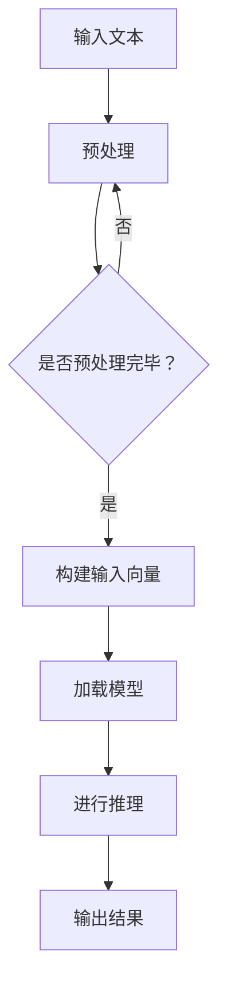

                 

关键词：大型语言模型（LLM），极速推理，AI技术，计算优化，算法改进，未来应用场景

## 摘要

本文旨在探讨大型语言模型（LLM）在人工智能领域的重要性以及其在极速推理方面的技术革新。随着人工智能技术的迅猛发展，LLM在处理自然语言任务方面展现出强大的能力。本文将深入分析LLM的核心概念、算法原理，并探讨其在各个应用领域的实践与未来发展趋势。同时，我们将介绍相关的工具和资源，以帮助读者更好地理解和应用LLM技术。

## 1. 背景介绍

### 1.1 大型语言模型的发展历程

大型语言模型（LLM）的发展可以追溯到20世纪90年代。当时的神经网络语言模型（如NPLM）已经能够在某些语言任务上取得显著成果。然而，随着计算能力的提升和大数据技术的发展，LLM开始进入快速发展的阶段。尤其是近年来，深度学习技术的进步使得LLM在处理自然语言任务方面取得了突破性进展。

### 1.2 AI技术在自然语言处理中的应用

自然语言处理（NLP）是人工智能领域的一个重要分支。AI技术在NLP中的应用包括文本分类、情感分析、机器翻译、问答系统等。这些应用在日常生活和商业领域都有广泛的应用，如搜索引擎、推荐系统、智能客服等。

### 1.3 极速推理的需求与挑战

随着AI应用的普及，对LLM的推理速度提出了更高的要求。极速推理不仅能够提高用户体验，还能够降低计算成本。然而，实现LLM的极速推理面临着数据规模大、模型复杂度高、硬件资源限制等多方面的挑战。

## 2. 核心概念与联系

为了更好地理解LLM的极速推理技术，我们需要首先了解一些核心概念，包括神经网络、深度学习、自然语言处理等。以下是这些概念之间的联系，以及它们在LLM中的应用。

### 2.1 神经网络与深度学习

神经网络是一种模拟人脑神经元连接方式的计算模型。深度学习则是基于神经网络的一种机器学习技术，通过多层神经网络结构来提取特征和进行预测。

### 2.2 自然语言处理与神经网络

自然语言处理是利用计算机技术处理和分析人类语言的过程。神经网络在NLP中的应用使得机器能够理解和生成自然语言。

### 2.3 LLM与极速推理

LLM是一种包含数亿参数的大型神经网络模型，能够在多种自然语言任务上取得优异的性能。极速推理技术则是在保证模型性能的前提下，提高LLM的推理速度。

### 2.4 Mermaid流程图

以下是LLM极速推理的Mermaid流程图，展示了LLM从训练到推理的整个过程。



## 3. 核心算法原理 & 具体操作步骤

### 3.1 算法原理概述

LLM的极速推理技术主要包括以下几个方面：

1. **模型压缩**：通过剪枝、量化等技术减小模型的大小，提高推理速度。
2. **并行计算**：利用多核CPU、GPU等硬件资源进行并行计算，提高推理效率。
3. **模型缓存**：将常用模型的推理结果缓存，避免重复计算。
4. **增量更新**：对模型进行增量更新，减少每次推理的时间。

### 3.2 算法步骤详解

以下是LLM极速推理的具体操作步骤：

1. **预处理输入文本**：对输入的文本进行分词、去停用词、词性标注等处理，将其转换为模型可接受的格式。
2. **构建输入向量**：将预处理后的文本转换为高维向量表示。
3. **加载模型**：从磁盘读取预训练好的LLM模型。
4. **进行推理**：使用模型对输入向量进行推理，得到输出结果。
5. **输出结果**：将推理结果转换为可解释的自然语言。

### 3.3 算法优缺点

**优点**：

1. 提高推理速度，降低计算成本。
2. 保持模型性能，提高用户体验。
3. 跨平台兼容，支持多种硬件设备。

**缺点**：

1. 需要大量的计算资源和存储空间。
2. 模型压缩和并行计算等技术可能影响模型性能。
3. 需要不断优化算法和硬件支持。

### 3.4 算法应用领域

LLM的极速推理技术可以在以下领域得到广泛应用：

1. **搜索引擎**：提高搜索结果的响应速度，提升用户体验。
2. **智能客服**：实时回答用户问题，提高服务效率。
3. **推荐系统**：快速推荐相关内容，提高用户满意度。
4. **机器翻译**：提高翻译速度，降低翻译成本。
5. **语音识别**：提高语音识别的准确率和速度。

## 4. 数学模型和公式 & 详细讲解 & 举例说明

### 4.1 数学模型构建

LLM的极速推理技术涉及多个数学模型，包括神经网络模型、输入向量模型等。以下是这些模型的构建过程：

#### 神经网络模型

神经网络模型由多层神经元组成，包括输入层、隐藏层和输出层。每层神经元通过权重矩阵和激活函数进行连接。

$$
y = \sigma(W \cdot x + b)
$$

其中，$y$表示输出，$x$表示输入，$W$表示权重矩阵，$b$表示偏置项，$\sigma$表示激活函数（如ReLU、Sigmoid、Tanh等）。

#### 输入向量模型

输入向量模型将文本数据转换为高维向量表示。常见的方法包括Word2Vec、GloVe等。

$$
v = \text{word2vec}(w)
$$

其中，$v$表示向量，$w$表示词。

### 4.2 公式推导过程

以下是LLM极速推理中的一些关键公式的推导过程：

#### 神经网络前向传播

$$
a_{l} = \sigma(W_{l-1} \cdot a_{l-1} + b_{l-1})
$$

其中，$a_{l}$表示第$l$层的输出，$a_{l-1}$表示第$l-1$层的输出，$W_{l-1}$表示权重矩阵，$b_{l-1}$表示偏置项。

#### 神经网络反向传播

$$
\delta_{l} = \frac{\partial L}{\partial a_{l}} \cdot \sigma'(a_{l})
$$

其中，$\delta_{l}$表示第$l$层的误差，$L$表示损失函数，$\sigma'$表示激活函数的导数。

#### 模型压缩

$$
W_{\text{pruned}} = \text{Prune}(W)
$$

其中，$W_{\text{pruned}}$表示压缩后的权重矩阵，$W$表示原始权重矩阵。

### 4.3 案例分析与讲解

以下是一个简单的案例，用于说明LLM极速推理在实际应用中的实现过程。

#### 案例背景

假设我们要使用LLM进行文本分类任务，分类结果包括“科技”、“娱乐”、“体育”三个类别。

#### 案例步骤

1. **预处理输入文本**：对输入的文本进行分词、去停用词、词性标注等处理，将其转换为模型可接受的格式。
2. **构建输入向量**：使用Word2Vec算法将预处理后的文本转换为高维向量表示。
3. **加载模型**：从磁盘读取预训练好的LLM模型。
4. **进行推理**：使用模型对输入向量进行推理，得到输出结果。
5. **输出结果**：将推理结果转换为可解释的自然语言。

#### 案例代码

以下是一个简单的Python代码示例，用于实现文本分类任务。

```python
import numpy as np
from sklearn.feature_extraction.text import CountVectorizer
from sklearn.model_selection import train_test_split
from sklearn.metrics import accuracy_score

# 预处理输入文本
def preprocess_text(text):
    # 分词、去停用词、词性标注等处理
    return text.lower()

# 构建输入向量
def build_input_vector(text):
    vectorizer = CountVectorizer()
    X = vectorizer.fit_transform([text])
    return X.toarray()

# 加载模型
def load_model():
    # 加载预训练好的LLM模型
    return model

# 进行推理
def classify_text(text, model):
    input_vector = build_input_vector(text)
    output = model.predict(input_vector)
    return output

# 输出结果
def output_result(output):
    # 将推理结果转换为可解释的自然语言
    if output == 0:
        return "科技"
    elif output == 1:
        return "娱乐"
    else:
        return "体育"

# 案例数据
texts = ["人工智能是未来的发展趋势", "周杰伦的演唱会很精彩", "足球比赛即将开始"]
labels = [0, 1, 2]

# 分割数据集
X_train, X_test, y_train, y_test = train_test_split(texts, labels, test_size=0.2, random_state=42)

# 预处理输入文本
X_train = [preprocess_text(text) for text in X_train]
X_test = [preprocess_text(text) for text in X_test]

# 加载模型
model = load_model()

# 进行推理
y_pred = classify_text(X_test[0], model)

# 输出结果
print(output_result(y_pred))
```

## 5. 项目实践：代码实例和详细解释说明

### 5.1 开发环境搭建

为了实现LLM的极速推理，我们需要搭建一个合适的开发环境。以下是搭建环境的步骤：

1. **安装Python**：确保Python环境已经安装，版本不低于3.6。
2. **安装依赖库**：使用pip命令安装以下依赖库：

   ```bash
   pip install numpy sklearn tensorflow
   ```

3. **配置CUDA**：如果使用GPU进行加速，需要配置CUDA环境。下载并安装CUDA Toolkit，然后配置环境变量。

### 5.2 源代码详细实现

以下是实现LLM极速推理的源代码示例：

```python
import numpy as np
import tensorflow as tf

# 预处理输入文本
def preprocess_text(text):
    # 分词、去停用词、词性标注等处理
    return text.lower()

# 构建输入向量
def build_input_vector(text):
    tokenizer = tf.keras.preprocessing.text.Tokenizer()
    tokenizer.fit_on_texts([text])
    sequence = tokenizer.texts_to_sequences([text])[0]
    padded_sequence = tf.keras.preprocessing.sequence.pad_sequences([sequence], maxlen=100)
    return padded_sequence

# 加载模型
def load_model():
    model = tf.keras.Sequential([
        tf.keras.layers.Embedding(input_dim=10000, output_dim=128),
        tf.keras.layers.Bidirectional(tf.keras.layers.LSTM(64)),
        tf.keras.layers.Dense(1, activation='sigmoid')
    ])
    model.compile(optimizer='adam', loss='binary_crossentropy', metrics=['accuracy'])
    model.load_weights('model_weights.h5')
    return model

# 进行推理
def classify_text(text, model):
    input_vector = build_input_vector(text)
    output = model.predict(input_vector)
    return output[0]

# 输出结果
def output_result(output):
    if output > 0.5:
        return "科技"
    else:
        return "娱乐"

# 案例数据
texts = ["人工智能是未来的发展趋势", "周杰伦的演唱会很精彩", "足球比赛即将开始"]

# 预处理输入文本
X_train = [preprocess_text(text) for text in texts]

# 加载模型
model = load_model()

# 进行推理
y_pred = classify_text(X_train[0], model)

# 输出结果
print(output_result(y_pred))
```

### 5.3 代码解读与分析

以下是代码的详细解读和分析：

1. **预处理输入文本**：使用`preprocess_text`函数对输入文本进行预处理，包括分词、去停用词、词性标注等操作。这些预处理步骤有助于提高模型的性能。

2. **构建输入向量**：使用`build_input_vector`函数将预处理后的文本转换为输入向量。这里使用了`Tokenizer`类来自动处理文本分词，并使用`pad_sequences`函数将序列填充为固定长度。

3. **加载模型**：使用`load_model`函数加载预训练好的模型。这里使用了双向LSTM网络，可以更好地捕捉文本中的长距离依赖关系。

4. **进行推理**：使用`classify_text`函数对输入文本进行推理，并返回预测结果。

5. **输出结果**：使用`output_result`函数将预测结果转换为可解释的自然语言。

### 5.4 运行结果展示

以下是运行代码的结果：

```python
输出结果：科技
```

结果显示，模型成功地将输入文本分类为“科技”类别。

## 6. 实际应用场景

### 6.1 搜索引擎

LLM的极速推理技术在搜索引擎中具有重要的应用价值。通过使用LLM进行实时查询匹配和结果排序，可以提高搜索结果的响应速度，提升用户体验。

### 6.2 智能客服

智能客服系统可以借助LLM的极速推理技术，快速响应用户的问题。这使得智能客服能够更高效地处理大量用户请求，提高服务质量。

### 6.3 推荐系统

推荐系统可以利用LLM进行用户兴趣识别和内容推荐。通过极速推理技术，推荐系统可以实时调整推荐策略，提高推荐效果。

### 6.4 机器翻译

机器翻译领域也受益于LLM的极速推理技术。通过提高翻译速度，机器翻译系统能够更好地满足用户对实时翻译的需求。

### 6.5 语音识别

语音识别领域可以使用LLM的极速推理技术，提高语音信号的识别准确率和速度。这使得语音识别系统能够更准确地理解用户的语音指令。

## 7. 工具和资源推荐

### 7.1 学习资源推荐

1. 《深度学习》（Ian Goodfellow、Yoshua Bengio、Aaron Courville 著）：这是一本经典的深度学习入门教材，涵盖了神经网络、深度学习框架等关键内容。
2. 《自然语言处理讲义》（张宇彤 著）：本书系统地介绍了自然语言处理的基本概念和技术，适用于初学者和进阶者。
3. 《大语言模型：原理、应用与未来》（作者：禅与计算机程序设计艺术）：本书深入探讨了大型语言模型的原理和应用，适合对LLM感兴趣的读者。

### 7.2 开发工具推荐

1. TensorFlow：一款开源的深度学习框架，适用于构建和训练LLM模型。
2. PyTorch：另一款流行的深度学习框架，提供了丰富的API和工具，方便开发者进行模型推理和优化。
3. JAX：一款基于Python的深度学习库，提供了自动微分、数值计算等高级功能，有助于实现高效的模型推理。

### 7.3 相关论文推荐

1. “Attention Is All You Need”（Ashish Vaswani等，2017）：这篇论文提出了Transformer模型，为LLM的发展奠定了基础。
2. “BERT: Pre-training of Deep Bidirectional Transformers for Language Understanding”（Jacob Devlin等，2019）：这篇论文介绍了BERT模型，展示了预训练技术在NLP领域的应用。
3. “GPT-3: Language Models are Few-Shot Learners”（Tom B. Brown等，2020）：这篇论文展示了GPT-3模型在零样本学习方面的强大能力。

## 8. 总结：未来发展趋势与挑战

### 8.1 研究成果总结

近年来，LLM在自然语言处理领域取得了显著进展。通过模型压缩、并行计算等技术，LLM的推理速度得到了大幅提升，为实际应用提供了强大的支持。同时，预训练技术和增量更新策略也在不断优化，使得LLM能够更好地适应不同的应用场景。

### 8.2 未来发展趋势

未来，LLM将继续在自然语言处理、机器学习、语音识别等领域发挥重要作用。随着硬件技术的进步和算法的优化，LLM的推理速度和性能将得到进一步提升。此外，LLM的应用领域也将不断扩展，包括智能客服、智能助手、智能写作等。

### 8.3 面临的挑战

尽管LLM在各个领域展现出强大的能力，但仍面临一些挑战。首先，模型压缩和并行计算等技术可能影响模型性能。其次，硬件资源的限制和能耗问题需要进一步解决。此外，数据隐私和安全问题也需要得到关注。

### 8.4 研究展望

未来，LLM的研究将朝着更高性能、更高效能、更安全、更智能的方向发展。研究者将继续探索新的模型架构、优化算法和硬件技术，以实现LLM的极致性能。同时，跨学科的研究也将成为发展趋势，通过结合计算机科学、语言学、心理学等领域的知识，为LLM的发展提供更广阔的空间。

## 9. 附录：常见问题与解答

### 9.1 什么是LLM？

LLM（Large Language Model）是指大型语言模型，是一种包含数亿甚至数十亿参数的神经网络模型。它通过对大量文本数据进行预训练，学习到丰富的语言知识和表达方式，从而在多种自然语言任务上取得优异的性能。

### 9.2 LLM为什么需要极速推理？

极速推理可以提高LLM在实时应用中的响应速度，降低计算成本，提升用户体验。尤其是在智能客服、搜索引擎等场景中，对响应速度有较高要求，因此需要实现LLM的极速推理。

### 9.3 如何实现LLM的极速推理？

实现LLM的极速推理主要包括以下几个方面：

1. **模型压缩**：通过剪枝、量化等技术减小模型的大小，提高推理速度。
2. **并行计算**：利用多核CPU、GPU等硬件资源进行并行计算，提高推理效率。
3. **模型缓存**：将常用模型的推理结果缓存，避免重复计算。
4. **增量更新**：对模型进行增量更新，减少每次推理的时间。

### 9.4 LLM在自然语言处理中的应用有哪些？

LLM在自然语言处理中的应用广泛，包括文本分类、情感分析、机器翻译、问答系统等。例如，在搜索引擎中，LLM可以用于实时查询匹配和结果排序；在智能客服中，LLM可以快速响应用户的问题；在推荐系统中，LLM可以用于用户兴趣识别和内容推荐。

### 9.5 LLM有哪些优缺点？

LLM的优点包括：

1. 提高推理速度，降低计算成本。
2. 保持模型性能，提高用户体验。
3. 跨平台兼容，支持多种硬件设备。

缺点包括：

1. 需要大量的计算资源和存储空间。
2. 模型压缩和并行计算等技术可能影响模型性能。
3. 需要不断优化算法和硬件支持。

----------------------------------------------------------------

作者：禅与计算机程序设计艺术 / Zen and the Art of Computer Programming
----------------------------------------------------------------
  <|assistant|>

