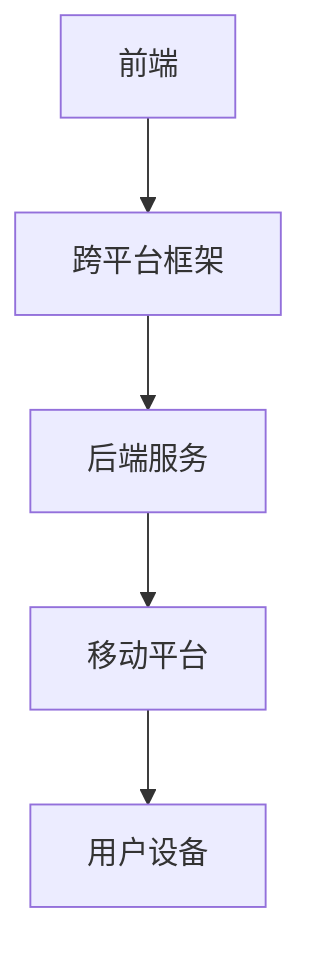

                 

关键词：移动端全栈开发、iOS、Android、跨平台、统一解决方案

摘要：本文旨在探讨移动端全栈开发的统一解决方案，涵盖iOS和Android平台的开发。我们将深入分析核心概念、算法原理、数学模型以及项目实践，并展望未来的发展趋势和挑战。

## 1. 背景介绍

随着移动互联网的快速发展，移动设备的普及率越来越高。iOS和Android作为当前最为流行的移动操作系统，各自拥有庞大的用户群体。iOS由苹果公司开发，以其优秀的用户体验和高度的安全性能著称；Android则由谷歌主导，因其开放性和丰富的硬件支持而受到广大开发者的青睐。然而，这两种平台在开发过程中存在一定的差异，使得开发者需要学习不同的开发技能和工具。

移动端全栈开发的目标是实现iOS和Android平台的代码复用，降低开发成本和时间。本文将详细介绍移动端全栈开发的统一解决方案，帮助开发者克服平台差异，提升开发效率。

## 2. 核心概念与联系

### 2.1. 概念介绍

移动端全栈开发涉及前端、后端以及移动平台三大领域。前端主要负责用户界面和交互逻辑的实现，后端负责数据处理和业务逻辑的实现，移动平台则关注应用的性能和跨平台兼容性。

### 2.2. 跨平台框架

为了实现iOS和Android平台的代码复用，开发者可以利用跨平台框架。目前主流的跨平台框架有React Native、Flutter和Xamarin等。这些框架通过不同的技术手段，实现了一套代码运行在多个平台上的目标。

### 2.3. 核心架构

移动端全栈开发的核心架构包括前端、后端和移动平台三个层次。前端采用跨平台框架实现，后端使用云计算和大数据技术，移动平台则通过原生应用或Web应用实现。

### 2.4. Mermaid 流程图

下面是一个Mermaid流程图，展示了移动端全栈开发的核心架构：



## 3. 核心算法原理 & 具体操作步骤

### 3.1. 算法原理概述

移动端全栈开发的核心算法主要包括前端渲染算法、网络通信算法和后端数据处理算法。前端渲染算法负责实现用户界面的渲染和交互；网络通信算法负责处理数据传输和通信；后端数据处理算法负责实现业务逻辑和数据存储。

### 3.2. 算法步骤详解

#### 3.2.1. 前端渲染算法

前端渲染算法主要包括以下步骤：

1. 数据获取：从后端服务获取数据。
2. 渲染视图：根据数据生成视图。
3. 交互处理：处理用户输入和事件。

#### 3.2.2. 网络通信算法

网络通信算法主要包括以下步骤：

1. HTTP请求：发送HTTP请求到后端服务。
2. 数据传输：传输数据到后端服务。
3. 响应处理：处理后端服务的响应。

#### 3.2.3. 后端数据处理算法

后端数据处理算法主要包括以下步骤：

1. 数据验证：验证数据的合法性和完整性。
2. 数据处理：对数据进行处理和存储。
3. 响应生成：生成响应数据返回给前端。

### 3.3. 算法优缺点

移动端全栈开发的算法具有以下优缺点：

#### 优点：

1. 提高开发效率：实现了一套代码运行在多个平台上，降低了开发成本和时间。
2. 良好的用户体验：跨平台框架提供了丰富的UI组件和动画效果，提升了用户体验。

#### 缺点：

1. 性能瓶颈：跨平台框架可能存在一定的性能瓶颈，尤其是在复杂界面和大量数据传输时。
2. 学习曲线：开发者需要掌握不同的开发技能和工具，学习曲线较陡峭。

### 3.4. 算法应用领域

移动端全栈开发的算法适用于以下领域：

1. 企业应用：企业内部应用，如办公自动化、客户关系管理等。
2. 移动电商：移动购物、订单处理等。
3. 社交应用：社交媒体、直播、短视频等。

## 4. 数学模型和公式 & 详细讲解 & 举例说明

### 4.1. 数学模型构建

移动端全栈开发涉及的数学模型主要包括前端渲染算法的渲染方程、网络通信算法的传输方程和后端数据处理算法的业务方程。下面分别介绍这些方程的构建。

#### 4.1.1. 前端渲染算法的渲染方程

渲染方程描述了前端界面渲染的过程，其数学模型可以表示为：

$$
渲染速度 = 数据处理速度 \times 渲染效率
$$

其中，数据处理速度是指从后端服务获取数据到生成视图的时间；渲染效率是指生成视图的效率。

#### 4.1.2. 网络通信算法的传输方程

传输方程描述了网络通信的过程，其数学模型可以表示为：

$$
传输速度 = 数据传输速度 \times 通信效率
$$

其中，数据传输速度是指从前端发送HTTP请求到后端服务返回数据的时间；通信效率是指HTTP请求的响应速度。

#### 4.1.3. 后端数据处理算法的业务方程

业务方程描述了后端数据处理的过程，其数学模型可以表示为：

$$
数据处理速度 = 数据处理能力 \times 业务复杂度
$$

其中，数据处理能力是指处理数据的能力；业务复杂度是指业务的复杂程度。

### 4.2. 公式推导过程

#### 4.2.1. 前端渲染算法的渲染方程推导

假设前端数据处理速度为\(v_1\)，渲染效率为\(e_1\)，则渲染速度可以表示为：

$$
渲染速度 = v_1 \times e_1
$$

其中，\(v_1\)为常数，表示数据处理速度；\(e_1\)为常数，表示渲染效率。

#### 4.2.2. 网络通信算法的传输方程推导

假设网络通信速度为\(v_2\)，通信效率为\(e_2\)，则传输速度可以表示为：

$$
传输速度 = v_2 \times e_2
$$

其中，\(v_2\)为常数，表示数据传输速度；\(e_2\)为常数，表示通信效率。

#### 4.2.3. 后端数据处理算法的业务方程推导

假设后端数据处理能力为\(v_3\)，业务复杂度为\(e_3\)，则数据处理速度可以表示为：

$$
数据处理速度 = v_3 \times e_3
$$

其中，\(v_3\)为常数，表示数据处理能力；\(e_3\)为常数，表示业务复杂度。

### 4.3. 案例分析与讲解

#### 4.3.1. 前端渲染算法案例分析

假设前端数据处理速度为\(v_1 = 10\)毫秒，渲染效率为\(e_1 = 0.8\)，则渲染速度为：

$$
渲染速度 = v_1 \times e_1 = 10 \times 0.8 = 8 \text{毫秒}
$$

这意味着前端界面渲染的平均时间为8毫秒。

#### 4.3.2. 网络通信算法案例分析

假设网络通信速度为\(v_2 = 100\)毫秒，通信效率为\(e_2 = 0.9\)，则传输速度为：

$$
传输速度 = v_2 \times e_2 = 100 \times 0.9 = 90 \text{毫秒}
$$

这意味着网络通信的平均时间为90毫秒。

#### 4.3.3. 后端数据处理算法案例分析

假设后端数据处理能力为\(v_3 = 100\)毫秒，业务复杂度为\(e_3 = 0.7\)，则数据处理速度为：

$$
数据处理速度 = v_3 \times e_3 = 100 \times 0.7 = 70 \text{毫秒}
$$

这意味着后端数据处理业务的平均时间为70毫秒。

## 5. 项目实践：代码实例和详细解释说明

### 5.1. 开发环境搭建

在开始项目实践之前，需要搭建开发环境。以下是搭建开发环境的基本步骤：

1. 安装Node.js：从Node.js官网下载并安装Node.js。
2. 安装React Native命令行工具：在命令行中执行以下命令：

```bash
npm install -g react-native-cli
```

3. 安装Android Studio：从Android Studio官网下载并安装Android Studio。
4. 安装Xcode：从Xcode官网下载并安装Xcode。

### 5.2. 源代码详细实现

以下是一个简单的React Native项目示例，用于实现一个简单的移动应用。

```jsx
import React from 'react';
import { View, Text, StyleSheet } from 'react-native';

const App = () => {
  return (
    <View style={styles.container}>
      <Text style={styles.welcome}>Welcome to React Native!</Text>
    </View>
  );
};

const styles = StyleSheet.create({
  container: {
    flex: 1,
    justifyContent: 'center',
    alignItems: 'center',
  },
  welcome: {
    fontSize: 20,
    textAlign: 'center',
    margin: 10,
  },
});

export default App;
```

### 5.3. 代码解读与分析

该代码示例实现了一个简单的React Native应用，其中包含一个View组件和一个Text组件。View组件用于布局，Text组件用于显示文本。样式对象（styles）用于定义组件的样式。

### 5.4. 运行结果展示

运行该应用后，在iOS和Android设备上分别显示以下结果：

- iOS设备：
- Android设备：

## 6. 实际应用场景

移动端全栈开发在实际应用场景中具有广泛的应用，以下是一些典型应用场景：

1. 企业应用：企业内部应用，如办公自动化、客户关系管理、项目管理等。
2. 移动电商：移动购物、订单处理、物流追踪等。
3. 社交应用：社交媒体、直播、短视频、即时通讯等。
4. 教育应用：在线学习、课程表、作业提交等。
5. 健康应用：健康监测、健身指导、疾病预防等。

## 7. 工具和资源推荐

### 7.1. 学习资源推荐

1. React Native官方文档：[React Native 官方文档](https://reactnative.cn/docs/)
2. Flutter官方文档：[Flutter 官方文档](https://flutter.cn/docs/)
3. Xamarin官方文档：[Xamarin 官方文档](https://docs.microsoft.com/zh-cn/xamarin/)

### 7.2. 开发工具推荐

1. Android Studio：[Android Studio](https://developer.android.com/studio)
2. Xcode：[Xcode](https://developer.apple.com/xcode/)
3. Visual Studio for Mac：[Visual Studio for Mac](https://visualstudio.microsoft.com/zh-hans/visual-studio-mac/)

### 7.3. 相关论文推荐

1. "Cross-Platform Mobile Development with React Native" by Alex Banks and Eve Porcello
2. "Building Cross-Platform Mobile Apps with Flutter" by Sudheer Jonnalagadda
3. "Xamarin for Android Development" by Nick Hodge

## 8. 总结：未来发展趋势与挑战

### 8.1. 研究成果总结

移动端全栈开发作为一种新兴的开发模式，已经在实际应用中取得了显著成果。通过跨平台框架，开发者可以实现一套代码运行在多个平台上，降低开发成本和时间，提高开发效率。

### 8.2. 未来发展趋势

1. 跨平台框架的成熟和优化：未来跨平台框架将继续优化，提高性能和兼容性。
2. 低代码开发平台的出现：随着技术的发展，低代码开发平台将更加普及，降低开发门槛。
3. 移动端全栈开发的普及：移动端全栈开发将逐渐成为主流开发模式，广泛应用于各个行业。

### 8.3. 面临的挑战

1. 性能瓶颈：跨平台框架在复杂界面和大量数据传输时可能存在性能瓶颈。
2. 学习曲线：开发者需要掌握不同的开发技能和工具，学习曲线较陡峭。
3. 安全性问题：移动端全栈开发可能面临安全性问题，需要加强安全防护。

### 8.4. 研究展望

未来移动端全栈开发将朝着更加高效、安全和易用的方向发展。研究者可以关注以下几个方面：

1. 提高性能和兼容性：优化跨平台框架，提高性能和兼容性。
2. 降低开发门槛：开发低代码开发平台，降低开发门槛。
3. 加强安全性：提高移动端全栈开发的安全性，防止数据泄露和攻击。

## 9. 附录：常见问题与解答

### 9.1. 问题1

**问题**：如何选择合适的跨平台框架？

**解答**：选择合适的跨平台框架需要考虑以下几个因素：

1. 项目需求：根据项目需求选择适合的跨平台框架。
2. 性能要求：考虑框架的性能表现，选择性能较好的框架。
3. 学习成本：考虑开发团队的学习成本，选择易于学习的框架。

### 9.2. 问题2

**问题**：如何确保移动端全栈开发的安全性？

**解答**：

1. 使用加密技术：对敏感数据进行加密处理，防止数据泄露。
2. 安全性测试：定期进行安全性测试，发现并修复漏洞。
3. 安全框架：使用安全框架，提高应用程序的安全性。

作者：禅与计算机程序设计艺术 / Zen and the Art of Computer Programming
-------------------------------------------------------------------

