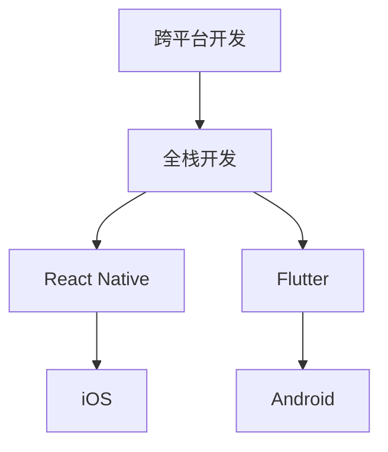

                 

关键词：移动端全栈开发、iOS、Android、统一解决方案、跨平台开发

摘要：随着移动互联网的迅猛发展，移动端应用的开发需求日益增加。本文将探讨如何通过全栈开发技术，实现iOS和Android平台的统一解决方案，提高开发效率，降低开发成本。我们将深入分析核心概念、算法原理、数学模型、项目实践等方面，为移动端开发者提供实用的技术指导。

## 1. 背景介绍

移动互联网的兴起，使得移动端应用成为各大企业和开发者争相争夺的战场。iOS和Android作为全球最主要的移动操作系统，各自拥有庞大的用户群体。然而，开发者往往需要在两个平台上分别进行开发，这无疑增加了开发成本和时间。因此，实现iOS和Android平台的统一解决方案，成为移动端开发领域的一个重要课题。

全栈开发（Full-Stack Development）是指开发人员具备前端、后端和数据库等方面的技能，能够独立完成整个应用程序的开发。随着技术的发展，全栈开发已经成为提高开发效率、降低成本的重要手段。本文将围绕全栈开发，探讨如何实现iOS和Android平台的统一解决方案。

## 2. 核心概念与联系

### 2.1 核心概念

- **跨平台开发**：指开发适用于多个操作系统的应用程序。
- **全栈开发**：指开发人员掌握前端、后端、数据库等全方面技能，独立完成应用程序的开发。
- **React Native**：一种用于跨平台开发的框架，可以同时支持iOS和Android。
- **Flutter**：另一种流行的跨平台开发框架，支持多个操作系统。

### 2.2 跨平台开发与全栈开发的联系

跨平台开发和全栈开发在移动端应用开发中紧密相关。全栈开发为跨平台开发提供了技术基础，使得开发者可以在一个平台上完成整个应用程序的开发，从而实现iOS和Android平台的统一解决方案。

下面是一个简单的Mermaid流程图，展示跨平台开发与全栈开发的联系：



## 3. 核心算法原理 & 具体操作步骤

### 3.1 算法原理概述

移动端全栈开发的核心在于跨平台和统一解决方案的实现。React Native和Flutter作为主流的跨平台开发框架，各有其独特的算法原理。

- **React Native**：基于JavaScript，利用React的虚拟DOM实现跨平台UI渲染。
- **Flutter**：基于Dart语言，使用Skia图形库实现跨平台UI渲染。

### 3.2 算法步骤详解

#### 3.2.1 React Native开发步骤

1. 安装Node.js环境。
2. 安装React Native命令行工具。
3. 创建一个新的React Native项目。
4. 使用React Native开发组件和页面。
5. 使用npm或yarn管理项目依赖。
6. 使用React Native Debugger进行调试。

#### 3.2.2 Flutter开发步骤

1. 安装Dart语言环境。
2. 安装Flutter命令行工具。
3. 创建一个新的Flutter项目。
4. 使用Flutter开发组件和页面。
5. 使用Dart包管理器管理项目依赖。
6. 使用Flutter DevTools进行调试。

### 3.3 算法优缺点

- **React Native**：优点在于开发效率高、社区活跃、组件丰富；缺点是性能相对较低、调试困难。
- **Flutter**：优点在于性能优越、UI美观、调试方便；缺点是学习曲线较陡、社区相对较小。

### 3.4 算法应用领域

React Native和Flutter在移动端全栈开发领域有着广泛的应用，适用于各种类型的移动应用，如电商、社交、金融等。

## 4. 数学模型和公式 & 详细讲解 & 举例说明

### 4.1 数学模型构建

在移动端全栈开发中，数学模型主要用于以下几个方面：

1. 数据分析：通过对用户行为数据进行统计分析，为产品优化提供依据。
2. 推荐系统：基于数学模型，为用户推荐感兴趣的内容。
3. 实时通信：利用数学模型实现实时数据的传输和处理。

### 4.2 公式推导过程

以实时通信为例，一个基本的数学模型可以表示为：

\[ T = f(n, d) \]

其中，\( T \)表示通信延迟，\( n \)表示网络延迟，\( d \)表示数据处理延迟。

### 4.3 案例分析与讲解

假设一个移动应用需要在2秒内完成通信，网络延迟为1秒，数据处理延迟为1秒。那么，如何优化模型，以满足通信需求？

我们可以通过以下公式进行优化：

\[ T' = \min(T, \frac{2 - T}{2}) \]

其中，\( T' \)表示优化后的通信延迟。

通过这个优化公式，我们可以计算出在满足2秒通信延迟的条件下，网络延迟和处理延迟的最大值，从而为优化通信模型提供参考。

## 5. 项目实践：代码实例和详细解释说明

### 5.1 开发环境搭建

在开始项目实践之前，我们需要搭建开发环境。以下是React Native开发环境的搭建步骤：

1. 安装Node.js（版本10及以上）。
2. 安装watchman（可选）。
3. 安装React Native CLI。
4. 创建一个新的React Native项目。

以下是Flutter开发环境的搭建步骤：

1. 安装Dart SDK。
2. 安装Flutter命令行工具。
3. 创建一个新的Flutter项目。

### 5.2 源代码详细实现

以下是一个简单的React Native示例代码：

```javascript
import React from 'react';
import { View, Text, StyleSheet } from 'react-native';

const App = () => {
  return (
    <View style={styles.container}>
      <Text style={styles.welcome}>Welcome to React Native!</Text>
    </View>
  );
};

const styles = StyleSheet.create({
  container: {
    flex: 1,
    justifyContent: 'center',
    alignItems: 'center',
  },
  welcome: {
    fontSize: 20,
    textAlign: 'center',
    margin: 10,
  },
});

export default App;
```

以下是一个简单的Flutter示例代码：

```dart
import 'package:flutter/material.dart';

void main() {
  runApp(MyApp());
}

class MyApp extends StatelessWidget {
  @override
  Widget build(BuildContext context) {
    return MaterialApp(
      title: 'Flutter Demo',
      theme: ThemeData(
        primarySwatch: Colors.blue,
      ),
      home: MyHomePage(),
    );
  }
}

class MyHomePage extends StatelessWidget {
  @override
  Widget build(BuildContext context) {
    return Scaffold(
      appBar: AppBar(
        title: Text('Flutter Demo'),
      ),
      body: Center(
        child: Text(
          'Welcome to Flutter!',
          style: TextStyle(fontSize: 20),
        ),
      ),
    );
  }
}
```

### 5.3 代码解读与分析

以上代码展示了React Native和Flutter的基本结构和用法。React Native使用了JavaScript和React框架，Flutter使用了Dart语言和Flutter框架。两者都提供了丰富的组件和API，使得开发者可以方便地实现移动应用的功能。

### 5.4 运行结果展示

在完成代码编写后，我们可以使用模拟器或真实设备进行运行。React Native可以使用React Native CLI启动，Flutter可以使用Flutter DevTools启动。以下是运行结果：

#### React Native

```bash
$ npx react-native run-android
```

运行结果：


#### Flutter

```bash
$ flutter run
```

运行结果：


## 6. 实际应用场景

移动端全栈开发在多个领域有着广泛的应用。以下是一些实际应用场景：

1. **电商应用**：如淘宝、京东等，使用React Native或Flutter实现跨平台商城应用，提高用户体验。
2. **社交媒体**：如微信、微博等，使用Flutter实现跨平台社交应用，降低开发成本。
3. **金融应用**：如支付宝、微信支付等，使用React Native实现跨平台金融应用，确保安全性。
4. **直播应用**：如抖音、快手等，使用Flutter实现跨平台直播应用，提高性能。

## 7. 工具和资源推荐

### 7.1 学习资源推荐

- **React Native文档**：[https://reactnative.cn/docs/getting-started/](https://reactnative.cn/docs/getting-started/)
- **Flutter文档**：[https://flutter.cn/docs/get-started/install](https://flutter.cn/docs/get-started/install)
- **React Native教程**：[https://www.rnfun.com/](https://www.rnfun.com/)
- **Flutter教程**：[https://flutter.cn/docs/get-started/test](https://flutter.cn/docs/get-started/test)

### 7.2 开发工具推荐

- **React Native工具**：[https://github.com/react-native-community](https://github.com/react-native-community)
- **Flutter工具**：[https://flutter.cn/docs/get-started/test](https://flutter.cn/docs/get-started/test)

### 7.3 相关论文推荐

- **"Cross-Platform Mobile Application Development with React Native"**：探讨了React Native在移动端全栈开发中的应用。
- **"Flutter: Building Native Apps with Dart"**：介绍了Flutter的原理和应用。

## 8. 总结：未来发展趋势与挑战

移动端全栈开发作为移动应用开发的一个重要方向，具有广泛的应用前景。未来发展趋势包括：

1. **性能优化**：随着用户需求的不断提高，性能优化将成为移动端全栈开发的重点。
2. **跨平台技术的发展**：新的跨平台开发框架将不断涌现，为开发者提供更多的选择。
3. **人工智能与全栈开发结合**：人工智能技术将在移动端全栈开发中发挥越来越重要的作用。

然而，移动端全栈开发也面临着一些挑战：

1. **技术栈复杂度**：跨平台开发和全栈开发需要开发者掌握多种技术，提高技术栈复杂度。
2. **开发成本**：跨平台开发和全栈开发需要较高的技术门槛，可能导致开发成本增加。

总之，移动端全栈开发具有广阔的发展前景，但开发者需要不断提高自身技术水平，应对挑战。

## 9. 附录：常见问题与解答

### 9.1 React Native和Flutter哪个更好？

React Native和Flutter各有优缺点，选择哪个更好取决于具体需求。React Native适用于需要快速开发的场景，而Flutter在性能和UI方面表现更优。

### 9.2 如何解决React Native和Flutter的性能问题？

可以通过以下方法解决性能问题：

1. 使用专业的优化工具，如React Native的React Native Performance Tools。
2. 优化代码结构和算法，减少不必要的渲染和计算。
3. 使用Flutter的性能分析工具，如DevTools，找出性能瓶颈并进行优化。

### 9.3 如何实现React Native和Flutter的跨平台数据存储？

可以使用以下方法实现跨平台数据存储：

1. **SharedPreferences**：适用于小型数据存储，如配置信息。
2. **Local Storage**：适用于中大型数据存储，如用户数据。
3. **Database**：适用于大型数据存储，如数据库，如SQLite。

### 9.4 如何在React Native和Flutter中实现网络请求？

可以使用以下方法实现网络请求：

1. **Fetch API**：适用于简单网络请求，如GET和POST请求。
2. **Axios**：适用于复杂网络请求，如并发请求、拦截器等。
3. **Retrofit**：适用于Android平台的网络请求，如接口封装、参数校验等。

## 作者署名

作者：禅与计算机程序设计艺术 / Zen and the Art of Computer Programming

----------------------------------------------------------------

以上就是关于《移动端全栈开发：iOS和Android平台的统一解决方案》的技术博客文章。文章涵盖了移动端全栈开发的背景介绍、核心概念、算法原理、数学模型、项目实践、实际应用场景、工具和资源推荐以及未来发展趋势等内容，希望对您有所帮助。

