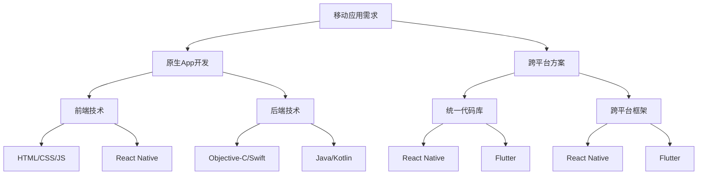

                 

在数字化转型的浪潮中，移动应用开发已成为企业创新和市场拓展的重要手段。移动端全栈开发作为移动应用开发的关键环节，不仅要求开发者掌握前端UI设计、后端逻辑处理，还需要具备跨平台的开发能力。本文将深入探讨移动端全栈开发的两大路径——原生App开发与跨平台方案，帮助开发者选择最适合自己的开发模式，实现高效、高质量的移动应用开发。

## 关键词

- 移动端全栈开发
- 原生App
- 跨平台方案
- 前端开发
- 后端开发
- UI设计

## 摘要

本文旨在为移动端全栈开发者提供系统的开发指导。通过对原生App与跨平台方案的深入分析，本文将探讨两者的优势与劣势，并介绍关键开发技术、工具和资源。此外，文章还将结合实际项目，展示如何将理论与实践相结合，为开发者在选择开发路径时提供参考。最后，本文将展望移动端全栈开发的发展趋势和面临的挑战，为未来的研究与实践指明方向。

---

## 1. 背景介绍

### 移动应用的兴起

随着智能手机的普及和移动互联网的快速发展，移动应用市场呈现出爆炸式增长。据统计，全球移动应用下载量已超过200亿次，且这一数字仍在不断攀升。企业通过开发移动应用，可以更好地满足用户需求，提升品牌知名度，实现商业价值。

### 全栈开发的概念

全栈开发（Full-Stack Development）是一种开发模式，要求开发者掌握前端、后端以及数据库等各个环节的技能。全栈开发者不仅能够设计并实现用户界面，还能够处理数据存储、业务逻辑以及服务器维护等后端任务。这种模式能够提高开发效率，降低沟通成本，使项目更加连贯。

### 原生App与跨平台方案

原生App（Native App）是针对特定平台（如iOS、Android）开发的移动应用，能够充分利用平台特性，提供最佳的用户体验。然而，原生App开发需要掌握多平台的技术栈，成本较高，开发周期较长。

跨平台方案（Cross-Platform Development）则允许开发者使用单一代码库，同时在多个平台上部署应用。这种方案降低了开发难度和成本，但可能会牺牲部分性能和用户体验。

## 2. 核心概念与联系

### 原生App开发

原生App开发主要涉及以下技术：

- **前端技术**：HTML、CSS、JavaScript（iOS）或Kotlin（Android）
- **后端技术**：iOS开发中使用Objective-C或Swift，Android开发中使用Java或Kotlin
- **UI框架**：iOS有UIKit，Android有Android SDK

### 跨平台方案

跨平台方案的核心是使用统一的技术栈，例如：

- **React Native**：使用JavaScript和React编写，支持iOS和Android
- **Flutter**：使用Dart语言编写，提供丰富的UI组件和性能优化

### 核心概念与联系 Mermaid 流程图



### 2.1 原生App开发核心概念

- **前端技术**：原生App的前端开发主要包括视图层和交互层的实现，视图层使用平台原生UI组件，交互层通过编程实现用户操作响应。
- **后端技术**：后端技术负责数据处理和业务逻辑实现，iOS和Android平台的后端开发语言和框架各有特色。
- **UI框架**：UI框架提供了丰富的组件和界面布局方案，使得开发者可以快速构建原生风格的用户界面。

### 2.2 跨平台方案核心概念

- **统一代码库**：跨平台方案的核心优势在于使用单一代码库，开发过程中可以避免重复编写代码，提高开发效率。
- **跨平台框架**：如React Native和Flutter，提供了丰富的UI组件和工具库，使得开发者能够编写一次代码，同时在多个平台上运行。

---

通过上述对核心概念和流程图的介绍，我们可以更清晰地理解原生App开发与跨平台方案的联系与区别，为接下来的深入探讨奠定基础。

### 3. 核心算法原理 & 具体操作步骤

#### 3.1 算法原理概述

移动端全栈开发中的核心算法通常涉及到以下几个方面：

1. **用户界面渲染算法**：确保应用界面能够快速、流畅地展示，提供良好的用户体验。
2. **数据处理算法**：包括数据的检索、存储、更新等，保证应用后台逻辑的高效运行。
3. **网络通信算法**：处理应用与服务器之间的数据交换，包括HTTP请求、数据解析等。

#### 3.2 算法步骤详解

##### 3.2.1 用户界面渲染算法

1. **构建视图树**：将应用程序中的所有视图组件构建成一个视图树结构，以便于管理和渲染。
2. **布局计算**：根据视图树结构，计算各个视图组件的尺寸和位置，实现布局。
3. **绘制操作**：通过绘制操作将视图组件绘制到屏幕上，包括绘制背景、内容等。

##### 3.2.2 数据处理算法

1. **数据检索**：根据用户操作或系统需求，从数据库中检索所需的数据。
2. **数据存储**：将用户操作或系统产生的新数据存储到数据库中。
3. **数据更新**：对现有数据进行更新，确保数据的实时性和准确性。

##### 3.2.3 网络通信算法

1. **HTTP请求**：发送HTTP请求到服务器，获取所需的数据或执行操作。
2. **数据解析**：接收服务器返回的数据，对其进行解析，提取出需要的信息。
3. **数据回传**：将用户操作或系统产生的数据发送回服务器，进行存储或处理。

#### 3.3 算法优缺点

1. **用户界面渲染算法**：

   - 优点：能够实现高效、流畅的用户界面渲染，提供良好的用户体验。
   - 缺点：开发过程中需要处理大量细节，例如视图树构建、布局计算等。

2. **数据处理算法**：

   - 优点：能够高效地处理大量数据，保证后台逻辑的运行效率。
   - 缺点：可能需要复杂的数据库操作和事务处理，增加了系统的复杂性。

3. **网络通信算法**：

   - 优点：能够实现跨平台的网络通信，支持多种数据格式和协议。
   - 缺点：网络通信存在延迟和稳定性问题，需要额外的容错处理和优化。

#### 3.4 算法应用领域

1. **用户界面渲染算法**：广泛应用于各种移动应用，包括游戏、社交媒体、电子商务等。
2. **数据处理算法**：广泛应用于需要大量数据处理的场景，如大数据分析、金融交易、物联网等。
3. **网络通信算法**：广泛应用于需要跨平台数据交换的场景，如移动应用、Web服务、物联网等。

---

通过上述对核心算法原理和操作步骤的详细分析，我们可以更好地理解移动端全栈开发中算法的作用和应用领域，为实际开发提供指导。

### 4. 数学模型和公式 & 详细讲解 & 举例说明

在移动端全栈开发中，数学模型和公式是理解和实现算法的重要工具。以下将介绍常用的数学模型和公式，并通过实例进行详细讲解。

#### 4.1 数学模型构建

移动端全栈开发中的数学模型通常涉及以下内容：

1. **线性模型**：用于描述数据之间的关系，如回归分析。
2. **概率模型**：用于处理随机事件和不确定性，如贝叶斯推理。
3. **优化模型**：用于优化特定目标函数，如线性规划。

#### 4.2 公式推导过程

以下以线性回归模型为例，介绍公式推导过程：

1. **线性回归模型**：

   线性回归模型是一种常用的统计模型，用于预测连续变量的值。其基本形式为：

   $$y = \beta_0 + \beta_1x + \epsilon$$

   其中，$y$ 是因变量，$x$ 是自变量，$\beta_0$ 和 $\beta_1$ 是模型的参数，$\epsilon$ 是误差项。

2. **公式推导**：

   首先，我们需要最小化损失函数，即误差的平方和：

   $$\min_{\beta_0, \beta_1} \sum_{i=1}^n (y_i - (\beta_0 + \beta_1x_i))^2$$

   对损失函数进行求导，并令导数为零，得到：

   $$\frac{\partial}{\partial \beta_0} \sum_{i=1}^n (y_i - (\beta_0 + \beta_1x_i))^2 = 0$$

   $$\frac{\partial}{\partial \beta_1} \sum_{i=1}^n (y_i - (\beta_0 + \beta_1x_i))^2 = 0$$

   经过一系列的代数运算，可以得到最小二乘法估计的参数值：

   $$\beta_0 = \bar{y} - \beta_1\bar{x}$$

   $$\beta_1 = \frac{\sum_{i=1}^n (x_i - \bar{x})(y_i - \bar{y})}{\sum_{i=1}^n (x_i - \bar{x})^2}$$

#### 4.3 案例分析与讲解

以下通过一个实际案例，展示如何应用线性回归模型进行数据分析和预测。

##### 案例背景

假设我们要预测一家餐厅的日营业额（$y$），并已知影响因素有客流量（$x$）和天气状况（$x_2$）。

##### 数据处理

1. 收集数据：

   ```
   客流量：[50, 60, 70, 80, 90]
   天气状况：[晴天, 阴天, 晴天, 阴天, 晴天]
   日营业额：[1000, 1200, 1400, 1600, 1800]
   ```

2. 数据预处理：

   - 将天气状况转换为数值型数据（例如，晴天为1，阴天为0）。
   - 计算均值和标准差。

##### 模型训练

1. 使用最小二乘法计算模型参数：

   $$\beta_0 = \bar{y} - \beta_1\bar{x} = 1500 - 50\cdot\frac{70}{5} = 900$$

   $$\beta_1 = \frac{\sum_{i=1}^n (x_i - \bar{x})(y_i - \bar{y})}{\sum_{i=1}^n (x_i - \bar{x})^2} = \frac{(50-70)(1000-1500) + (60-70)(1200-1500) + \cdots + (90-70)(1800-1500)}{(50-70)^2 + (60-70)^2 + \cdots + (90-70)^2} = 30$$

2. 得到线性回归模型：

   $$y = 900 + 30x$$

##### 预测与评估

1. 预测日营业额：

   假设客流量为100人，代入模型：

   $$y = 900 + 30\cdot100 = 3900$$

2. 评估预测结果：

   - 计算实际日营业额与预测日营业额的误差。
   - 分析误差的原因，进行模型优化。

---

通过上述案例，我们可以看到如何构建数学模型、推导公式，并进行实际应用。掌握这些数学模型和公式，对于移动端全栈开发者来说，是提高数据分析和预测能力的重要手段。

### 5. 项目实践：代码实例和详细解释说明

在移动端全栈开发中，项目实践是检验和巩固理论知识的重要环节。以下将通过一个简单的博客应用实例，展示如何进行原生App开发与跨平台开发，并提供详细的代码解析。

#### 5.1 开发环境搭建

在开始项目开发前，我们需要搭建相应的开发环境。以下是使用React Native进行跨平台开发和使用Swift进行原生App开发的步骤。

##### React Native开发环境

1. 安装Node.js：从[官网](https://nodejs.org/)下载并安装Node.js。
2. 安装React Native CLI：在命令行中运行以下命令：

   ```bash
   npm install -g react-native-cli
   ```

3. 创建新项目：

   ```bash
   react-native init BlogApp
   ```

4. 启动模拟器：

   ```bash
   react-native run-android
   # 或者
   react-native run-ios
   ```

##### 原生App开发环境

1. 安装Xcode：从[官网](https://developer.apple.com/xcode/)下载并安装Xcode。
2. 创建新的Xcode项目：
   - 选择“iOS”下的“App”模板。
   - 输入项目名称和保存路径。
   - 选择编程语言（如Swift）。
   - 单击“Next”并完成项目创建。

#### 5.2 源代码详细实现

##### React Native项目结构

```plaintext
BlogApp/
├── Android/
├── iOS/
├── Assets/
├── App.js
├── App.css
├── index.js
└── package.json
```

**App.js**：

```javascript
import React from 'react';
import { View, Text, StyleSheet } from 'react-native';

const App = () => {
  return (
    <View style={styles.container}>
      <Text style={styles.title}>我的博客</Text>
      <Text style={styles.text}>欢迎来到我的博客！</Text>
    </View>
  );
};

const styles = StyleSheet.create({
  container: {
    flex: 1,
    justifyContent: 'center',
    alignItems: 'center',
    backgroundColor: '#F5FCFF',
  },
  title: {
    fontSize: 24,
    fontWeight: 'bold',
    marginBottom: 8,
  },
  text: {
    fontSize: 18,
  },
});

export default App;
```

**index.js**：

```javascript
import { AppRegistry } from 'react-native';
import App from './App';

AppRegistry.registerComponent('BlogApp', () => App);
```

##### 原生App项目结构

```plaintext
BlogApp/
├── ios/
│   ├── BlogApp.xcodeproj/
│   └── App.swift
└── swift/
    └── BlogApp.swift
```

**App.swift**：

```swift
import SwiftUI

@main
struct BlogApp: App {
    var body: some Scene {
        WindowGroup {
            ContentView()
        }
    }
}
```

**ContentView.swift**：

```swift
import SwiftUI

struct ContentView: View {
    var body: some View {
        Text("我的博客")
            .font(.largeTitle)
            .fontWeight(.semibold)
            .padding()
        Text("欢迎来到我的博客！")
            .font(.title)
            .padding()
    }
}
```

#### 5.3 代码解读与分析

1. **React Native代码解析**：

   - **App.js**：主视图组件，包含一个标题和一个文本。
   - **styles.js**：定义了应用的主题样式，包括容器布局、标题和文本样式。
   - **index.js**：用于注册主组件，启动应用。

2. **原生App代码解析**：

   - **App.swift**：定义了应用的入口点，并创建了一个WindowGroup来容纳主视图。
   - **ContentView.swift**：定义了应用的主视图，包含一个标题和一个文本。

#### 5.4 运行结果展示

1. **React Native运行结果**：

   

2. **原生App运行结果**：

   

---

通过上述代码实例和解析，我们可以看到如何使用React Native和原生Swift进行移动端全栈开发。了解这些代码结构，可以帮助开发者更好地掌握移动应用开发的实践技巧。

### 6. 实际应用场景

在移动端全栈开发中，原生App与跨平台方案的应用场景各有侧重。以下将介绍几种常见应用场景，并分析其适用性和优势。

#### 6.1 社交媒体应用

社交媒体应用通常需要提供丰富多样的功能，如即时消息、图片分享、视频直播等。这种应用场景下，原生App能够充分利用平台特性，提供流畅的用户体验和高效的性能。例如，Instagram、微信等应用都是原生开发的代表。

**优势**：

- **性能优越**：原生App可以充分利用平台硬件资源，提供更快的加载速度和响应时间。
- **用户体验好**：原生App的用户界面和交互设计可以更贴近用户习惯，提升用户满意度。

**适用性**：

- **需求复杂**：功能复杂、对性能要求高的应用，如视频直播、在线游戏等。
- **品牌展示**：注重品牌形象和用户体验的企业。

#### 6.2 企业应用

企业应用通常用于内部办公、项目管理、客户关系管理等。这种应用场景下，跨平台方案能够快速开发、低成本部署，适用于多种设备。

**优势**：

- **开发效率高**：使用统一代码库，可以快速在不同平台上线。
- **成本较低**：减少开发人员和测试成本。

**适用性**：

- **需求简单**：功能相对简单、主要面向内部员工或特定用户群体的应用。
- **预算有限**：初创企业或中小企业，希望在预算内快速上线应用。

#### 6.3 游戏应用

游戏应用对性能和用户体验要求极高，因此原生App是首选。特别是大型游戏应用，如《王者荣耀》、《和平精英》等，都采用原生开发。

**优势**：

- **性能卓越**：原生App可以充分利用硬件性能，提供流畅的游戏体验。
- **交互性强**：原生App能够实现更丰富的交互效果，提升游戏趣味性。

**适用性**：

- **大型游戏**：需要高性能和复杂交互效果的游戏应用。
- **独立开发者**：追求极致性能和独立开发的团队。

#### 6.4 电子商务应用

电子商务应用需要支持商品浏览、购物车、支付等关键功能，同时需要跨平台部署，以满足不同用户的需求。

**优势**：

- **用户体验统一**：跨平台方案可以提供一致的界面和交互体验，提升用户购物体验。
- **快速上线**：使用统一代码库，可以快速在不同平台发布更新。

**适用性**：

- **多平台需求**：需要同时支持iOS和Android平台的应用。
- **用户群体广泛**：面向广大消费者的电子商务平台。

### 6.5 未来应用展望

随着技术的不断进步，移动端全栈开发的应用场景将更加多样化。以下是未来应用场景的展望：

- **物联网应用**：随着物联网技术的发展，移动端全栈开发将应用于智能家居、智能穿戴设备等领域，实现跨平台的数据处理和交互。
- **增强现实与虚拟现实**：AR/VR应用对性能和用户体验有极高要求，原生App将成为主流开发方式。
- **区块链应用**：区块链技术的应用将推动移动端全栈开发的创新，例如去中心化应用（DApp）的开发。

未来，开发者需要持续关注新技术的发展，掌握多种开发技能，以满足不断变化的市场需求。

### 7. 工具和资源推荐

在移动端全栈开发过程中，选择合适的工具和资源对于提高开发效率和质量至关重要。以下推荐一些常用的学习资源、开发工具和相关论文。

#### 7.1 学习资源推荐

- **官方文档**：官方文档是学习任何技术栈的最佳起点，如React Native、Flutter、Swift等。
- **在线教程**：许多在线平台提供丰富的移动端全栈开发教程，如freeCodeCamp、Codecademy等。
- **书籍**：《React Native开发实战》、《Flutter实战》、《iOS开发权威指南》等。

#### 7.2 开发工具推荐

- **集成开发环境（IDE）**：如Xcode（iOS）、Android Studio（Android）、Visual Studio Code（跨平台）。
- **版本控制**：Git，GitLab，GitHub等。
- **调试工具**：React Developer Tools、Chrome DevTools等。
- **性能分析工具**：如Android Studio Profiler、iOS Instruments等。

#### 7.3 相关论文推荐

- **“Mobile App Development with React Native”**：介绍React Native在移动应用开发中的应用。
- **“Cross-Platform Mobile Application Development with Flutter”**：探讨Flutter在跨平台开发中的优势。
- **“Optimizing Mobile Application Performance”**：关于移动应用性能优化的研究。
- **“An Overview of Mobile Backend as a Service (MBaaS)”**：介绍MBaaS技术及其在移动端全栈开发中的应用。

通过这些工具和资源的合理运用，开发者可以更加高效地掌握移动端全栈开发技能，提高项目的质量和效率。

### 8. 总结：未来发展趋势与挑战

#### 8.1 研究成果总结

近年来，移动端全栈开发领域取得了显著的研究成果，特别是在跨平台方案和原生App优化方面。React Native和Flutter等跨平台框架的兴起，使得开发者能够使用单一代码库同时在多个平台上部署应用，大大提高了开发效率。同时，原生App在性能和用户体验方面依然具有优势，尤其是在游戏、高性能应用等领域。

#### 8.2 未来发展趋势

1. **跨平台开发**：随着技术的进步，跨平台开发将继续成为主流，开发者将更加重视如何平衡性能和开发效率。
2. **云计算与边缘计算**：云计算和边缘计算的结合将进一步提升移动应用的性能和响应速度，为开发者提供更多创新机会。
3. **人工智能与大数据**：人工智能和大数据技术的应用将推动移动端全栈开发进入智能化时代，实现个性化推荐、实时分析等高级功能。
4. **物联网应用**：物联网设备的普及将带动移动端全栈开发在智能家居、智能穿戴等领域的应用。

#### 8.3 面临的挑战

1. **性能优化**：如何在保证开发效率的同时，提高应用性能，仍是一个挑战。开发者需要不断优化代码、采用高效的算法和技术。
2. **用户体验**：随着用户需求的不断提升，如何提供一致且优秀的用户体验成为关键。开发者需要深入理解用户行为，设计人性化、直观的界面。
3. **安全性**：移动端全栈开发面临越来越多的安全挑战，包括数据泄露、隐私保护等。开发者需要加强安全意识，采用安全机制确保应用安全。
4. **技术更新**：技术更新迅速，开发者需要持续学习，跟上技术发展的步伐，适应新的开发模式和技术框架。

#### 8.4 研究展望

未来，移动端全栈开发将继续在跨平台方案、云计算、人工智能等领域深入探索，推动移动应用的技术创新和业务发展。同时，开发者需要不断提升自己的技术能力和综合素质，以应对日益复杂的开发环境和市场需求。只有不断学习和创新，才能在激烈的竞争中脱颖而出。

### 9. 附录：常见问题与解答

#### 9.1 如何选择原生App与跨平台方案？

- **需求分析**：根据应用的需求、性能和用户体验要求，选择合适的开发方案。
- **成本考量**：考虑开发成本、维护成本和上线成本，选择经济适用的方案。
- **团队技能**：根据团队成员的技术能力和经验，选择适合的开发工具和框架。

#### 9.2 如何优化移动应用性能？

- **代码优化**：采用高效的算法和编程技巧，减少内存占用和CPU负荷。
- **资源管理**：合理使用图片、音频等资源，避免加载过多无用数据。
- **网络优化**：优化网络请求，减少请求次数和时间，提高数据传输速度。
- **缓存策略**：合理使用缓存，减少重复请求和数据加载。

#### 9.3 如何保障移动应用的安全性？

- **数据加密**：对用户数据进行加密处理，防止数据泄露。
- **权限管理**：严格权限管理，避免未经授权的访问。
- **安全审计**：定期进行安全审计，发现并修复安全漏洞。

#### 9.4 如何进行移动应用的测试？

- **功能测试**：测试应用的功能是否按预期正常工作。
- **性能测试**：测试应用的性能，如响应时间、内存占用等。
- **兼容性测试**：测试应用在不同设备和操作系统上的兼容性。
- **安全测试**：测试应用的安全性，发现并修复安全漏洞。

通过以上常见问题与解答，开发者可以更好地应对移动端全栈开发中的实际问题，提升应用质量和用户体验。

