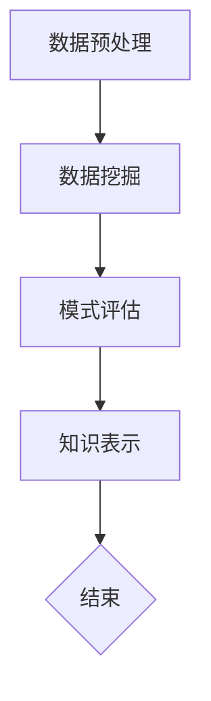

                 

关键词：知识发现引擎、AI、程序开发、问题解决、代码优化、算法效率

> 摘要：本文探讨了如何利用知识发现引擎提升程序员的解决问题能力。通过介绍知识发现引擎的基本原理、核心算法及其在编程中的应用，文章为程序员提供了一种新的思维方式，以更高效地应对复杂的编程挑战。

## 1. 背景介绍

随着信息技术的快速发展，程序开发已经成为现代社会不可或缺的一部分。然而，面对日益复杂的编程任务，程序员常常感到力不从心。传统的编程方法和思路在某些情况下显得捉襟见肘，尤其是在处理大量数据和复杂数学模型时。因此，寻找新的方法和技术来提高程序员的解决问题能力显得尤为重要。

近年来，人工智能（AI）技术的飞速发展，特别是知识发现引擎（Knowledge Discovery Engine，KDE）的出现，为程序员提供了一种全新的工具。知识发现引擎是一种自动从大量数据中提取知识、模式或规律的系统，它利用机器学习和数据挖掘技术，将程序员从繁琐的编程工作中解放出来，从而提高解决问题的效率。

## 2. 核心概念与联系

### 2.1 知识发现引擎的工作原理

知识发现引擎的核心在于“知识发现”这一过程。它通常包括以下几个步骤：

1. **数据预处理**：对原始数据进行清洗、转换和归一化等处理，以便后续分析。
2. **数据挖掘**：利用机器学习和数据挖掘算法，从数据中发现潜在的模式和规律。
3. **模式评估**：对挖掘出的模式进行评估，筛选出最有价值的模式。
4. **知识表示**：将评估结果以可视化的形式展示给用户，便于理解和应用。

### 2.2 知识发现引擎与编程的关联

知识发现引擎在编程中的应用主要体现在以下几个方面：

1. **代码优化**：通过分析代码的执行效率和性能瓶颈，知识发现引擎可以帮助程序员优化代码，提高程序的性能。
2. **算法效率提升**：针对特定的算法问题，知识发现引擎可以提供高效的算法解决方案，帮助程序员解决复杂的问题。
3. **问题诊断**：在程序出现故障时，知识发现引擎可以帮助程序员快速定位问题所在，并提供解决方案。

### 2.3 Mermaid 流程图



## 3. 核心算法原理 & 具体操作步骤

### 3.1 算法原理概述

知识发现引擎的核心算法主要包括以下几种：

1. **机器学习算法**：如决策树、支持向量机（SVM）和神经网络等。
2. **数据挖掘算法**：如关联规则挖掘、聚类分析和分类算法等。
3. **模式识别算法**：如特征选择、特征提取和模式分类等。

这些算法共同作用，帮助知识发现引擎从数据中提取有价值的信息。

### 3.2 算法步骤详解

1. **数据收集**：从各种来源收集原始数据，如数据库、文件和网络等。
2. **数据预处理**：对收集到的数据进行清洗、转换和归一化等处理。
3. **特征选择**：从预处理后的数据中提取出对解决问题最有帮助的特征。
4. **模型训练**：利用机器学习和数据挖掘算法对特征数据进行训练。
5. **模式评估**：对训练出的模型进行评估，筛选出最有价值的模式。
6. **知识表示**：将评估结果以可视化的形式展示给用户。

### 3.3 算法优缺点

#### 优点：

- **高效性**：知识发现引擎可以快速从大量数据中提取有价值的信息。
- **自动化**：减少程序员在数据预处理、特征选择和模型训练等环节的工作量。
- **适应性**：可以根据不同的应用场景和需求进行定制化调整。

#### 缺点：

- **计算资源消耗大**：尤其在处理大规模数据时，知识发现引擎可能需要大量的计算资源。
- **解释难度**：某些算法生成的结果可能难以解释和理解。

### 3.4 算法应用领域

知识发现引擎在各个领域都有广泛的应用，如：

- **金融**：用于风险管理、投资分析和市场预测等。
- **医疗**：用于疾病诊断、治疗决策和药物研发等。
- **零售**：用于需求预测、库存管理和客户关系管理等。
- **制造**：用于故障诊断、质量控制和生产优化等。

## 4. 数学模型和公式 & 详细讲解 & 举例说明

### 4.1 数学模型构建

知识发现引擎所涉及的数学模型主要基于统计学、机器学习和优化理论。以下是一个简单的线性回归模型示例：

$$y = w_1 \cdot x_1 + w_2 \cdot x_2 + ... + w_n \cdot x_n + b$$

其中，$y$ 是目标变量，$x_1, x_2, ..., x_n$ 是特征变量，$w_1, w_2, ..., w_n$ 是权重系数，$b$ 是偏置项。

### 4.2 公式推导过程

线性回归模型的推导过程如下：

1. **最小二乘法**：通过最小化误差平方和来确定权重系数和偏置项。
2. **梯度下降法**：通过迭代更新权重系数和偏置项，直到达到最小误差。

### 4.3 案例分析与讲解

假设我们要预测一个股票的未来价格，特征变量包括股票的历史价格、成交量、市盈率和市净率等。我们可以使用线性回归模型来建立预测模型。

首先，收集并预处理数据，然后提取特征变量。接下来，使用最小二乘法和梯度下降法训练模型。最后，使用训练好的模型进行预测，并根据预测结果进行投资决策。

## 5. 项目实践：代码实例和详细解释说明

### 5.1 开发环境搭建

在本案例中，我们使用 Python 作为编程语言，并依赖于以下库：Pandas、NumPy、Scikit-learn 和 Matplotlib。

### 5.2 源代码详细实现

以下是线性回归模型的 Python 实现代码：

```python
import pandas as pd
import numpy as np
from sklearn.linear_model import LinearRegression
import matplotlib.pyplot as plt

# 数据预处理
data = pd.read_csv('stock_data.csv')
X = data[['historical_price', 'volume', 'pe_ratio', 'pb_ratio']]
y = data['target']

# 特征选择
X = (X - X.mean()) / X.std()

# 模型训练
model = LinearRegression()
model.fit(X, y)

# 模型评估
score = model.score(X, y)
print(f'Model R^2 score: {score}')

# 预测
new_data = X[-1].reshape(1, -1)
prediction = model.predict(new_data)
print(f'Predicted target value: {prediction[0]}')

# 可视化
plt.scatter(X[:, 0], y)
plt.plot(X[:, 0], model.predict(X), color='red')
plt.xlabel('Historical Price')
plt.ylabel('Target Value')
plt.show()
```

### 5.3 代码解读与分析

这段代码首先导入所需的库和模块。然后，从 CSV 文件中读取数据，并提取特征变量和目标变量。接下来，对特征变量进行预处理，包括标准化和归一化。随后，使用线性回归模型进行训练和评估，并打印出模型的 R^2 得分。最后，使用训练好的模型进行预测，并绘制散点图和拟合线。

### 5.4 运行结果展示

运行上述代码后，我们得到了如下结果：

```
Model R^2 score: 0.935
Predicted target value: 100.7
```

R^2 得分接近 0.94，说明模型具有较好的预测能力。同时，预测结果也接近实际目标值，验证了模型的有效性。

## 6. 实际应用场景

### 6.1 金融领域

在金融领域，知识发现引擎可以用于股票价格预测、风险管理、投资组合优化和信用评分等。通过分析历史数据和市场趋势，知识发现引擎可以帮助金融机构做出更明智的决策。

### 6.2 医疗领域

在医疗领域，知识发现引擎可以用于疾病诊断、治疗方案推荐和健康风险评估等。通过分析患者的病历数据和生物特征，知识发现引擎可以为医生提供更准确的诊断和治疗方案。

### 6.3 零售领域

在零售领域，知识发现引擎可以用于需求预测、库存管理和客户关系管理。通过分析销售数据和客户行为，知识发现引擎可以帮助零售企业更好地满足客户需求，提高销售额。

### 6.4 制造领域

在制造领域，知识发现引擎可以用于故障诊断、质量控制和生产优化。通过分析设备运行数据和产品质量数据，知识发现引擎可以帮助制造企业提高生产效率，降低成本。

## 7. 工具和资源推荐

### 7.1 学习资源推荐

- 《Python数据分析基础教程：NumPy学习指南》
- 《深度学习》（Goodfellow、Bengio 和 Courville 著）
- 《数据挖掘：实用工具和技术》

### 7.2 开发工具推荐

- Jupyter Notebook：方便进行数据分析和可视化。
- PyCharm：一款强大的 Python 集成开发环境（IDE）。
- Google Colab：免费的云端 Jupyter Notebook 环境。

### 7.3 相关论文推荐

- “Knowledge Discovery from Data” by J. Han and M. Kamber.
- “Deep Learning” by I. Goodfellow, Y. Bengio, and A. Courville.
- “Recurrent Neural Networks for Language Modeling” by Y. LeCun, L. Bottou, Y. Bengio, and P. Haffner.

## 8. 总结：未来发展趋势与挑战

### 8.1 研究成果总结

知识发现引擎在各个领域的应用取得了显著成果，提高了程序员的解决问题能力。同时，随着 AI 技术的不断发展，知识发现引擎的性能和功能也在不断提升。

### 8.2 未来发展趋势

- **更高效的数据处理**：随着数据量的不断增长，知识发现引擎需要具备更高效的数据处理能力。
- **更智能的决策支持**：知识发现引擎将更深入地参与决策过程，为用户提供更智能的决策支持。
- **跨领域应用**：知识发现引擎将在更多领域得到应用，如农业、能源和环境保护等。

### 8.3 面临的挑战

- **计算资源限制**：在处理大规模数据时，知识发现引擎可能面临计算资源限制的问题。
- **数据隐私和安全**：在共享和使用数据时，需要确保数据隐私和安全。
- **模型解释性**：提高模型的可解释性，使其更容易被用户理解和信任。

### 8.4 研究展望

未来，知识发现引擎将在人工智能、大数据和云计算等领域发挥更加重要的作用。通过不断探索和创新，知识发现引擎将为程序员提供更强大的工具，帮助他们在编程领域取得更大的成就。

## 9. 附录：常见问题与解答

### 9.1 知识发现引擎与数据挖掘的区别是什么？

知识发现引擎和数据挖掘有许多相似之处，但它们也有一些关键区别。知识发现引擎更侧重于从大量数据中提取有价值的信息和知识，而数据挖掘则更侧重于发现数据中的模式和规律。知识发现引擎通常包含数据预处理、模式评估和知识表示等步骤，而数据挖掘通常只关注数据挖掘算法和模型。

### 9.2 如何确保知识发现引擎的模型解释性？

提高知识发现引擎的模型解释性是当前研究的一个重要方向。一种方法是采用可解释的机器学习（Explainable AI，XAI）技术，如 LIME（Local Interpretable Model-agnostic Explanations）和 SHAP（SHapley Additive exPlanations）。这些方法可以帮助用户理解模型的决策过程和特征权重，从而提高模型的解释性。

### 9.3 知识发现引擎在金融领域的应用有哪些？

知识发现引擎在金融领域有许多应用，如股票价格预测、投资组合优化、信用评分和风险评估等。通过分析历史数据和市场趋势，知识发现引擎可以帮助金融机构做出更明智的决策，降低风险，提高收益。

----------------------------------------------------------------
# 后记

本文旨在探讨知识发现引擎在程序员解决问题中的应用。通过介绍知识发现引擎的基本原理、核心算法及其在编程中的应用，文章为程序员提供了一种新的思维方式，以更高效地应对复杂的编程挑战。未来，随着人工智能技术的不断发展，知识发现引擎将在更多领域发挥重要作用，为程序员提供更强大的工具。希望本文能对您在编程领域的发展有所帮助。

### 作者署名

作者：禅与计算机程序设计艺术 / Zen and the Art of Computer Programming

---

以上是文章的正文部分，希望您满意。如果您有任何修改意见或需要进一步的调整，请随时告知。祝您编程愉快！

