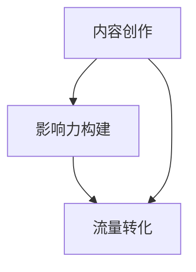

                 

关键词：程序员、公众号、知识变现、技术博客、内容营销、影响力、流量变现

> 摘要：随着互联网的迅猛发展，公众号平台已成为广大程序员展示才华、交流经验和知识变现的重要渠道。本文将探讨程序员如何利用公众号进行知识变现，包括内容创作、影响力构建、流量转化等策略，助力程序员在数字化时代实现个人价值最大化。

## 1. 背景介绍

近年来，随着移动互联网和社交媒体的普及，公众号已成为众多程序员展示技术才华、分享知识经验的重要平台。公众号不仅为程序员提供了一个自由表达的空间，还成为他们构建个人品牌、实现知识变现的利器。然而，如何在众多竞争者中脱颖而出，实现知识变现，仍然是许多程序员面临的挑战。

本文旨在为程序员提供一套系统化的知识变现策略，包括内容创作、影响力构建、流量转化等，帮助他们在公众号平台上实现个人价值最大化。

## 2. 核心概念与联系

在探讨程序员如何利用公众号进行知识变现之前，我们需要明确几个核心概念：

### 2.1 内容创作

内容创作是知识变现的基础。程序员需要根据自己的专业领域和兴趣，创作出有价值、有深度、有吸引力的内容。这包括技术博客、教程、案例分析、经验分享等。

### 2.2 影响力构建

影响力构建是知识变现的关键。程序员需要通过持续的内容输出，吸引粉丝关注，提升自己在行业内的知名度。这包括积累粉丝、打造个人品牌、参与行业活动等。

### 2.3 流量转化

流量转化是知识变现的核心。程序员需要将公众号的流量转化为实际的收益，如广告收入、咨询服务、产品销售等。

下面是一个用Mermaid绘制的流程图，展示了这三大核心概念之间的联系：



## 3. 核心算法原理 & 具体操作步骤

### 3.1 算法原理概述

程序员利用公众号进行知识变现的核心算法可以概括为以下几个步骤：

1. 内容创作：创作有价值的内容。
2. 影响力构建：吸引粉丝关注，提升知名度。
3. 流量转化：将流量转化为收益。

### 3.2 算法步骤详解

#### 3.2.1 内容创作

1. 确定创作方向：根据自己的专业领域和兴趣，确定内容创作方向。
2. 研究受众需求：了解受众需求，创作符合受众口味的内容。
3. 保持持续输出：定期发布内容，保持更新。

#### 3.2.2 影响力构建

1. 建立个人品牌：通过内容输出，塑造个人专业形象。
2. 积累粉丝：通过互动、推广等方式，吸引粉丝关注。
3. 参与行业活动：积极参与行业活动，提升知名度。

#### 3.2.3 流量转化

1. 广告收入：通过投放广告，实现流量变现。
2. 咨询服务：提供专业咨询服务，实现流量变现。
3. 产品销售：通过推广产品，实现流量变现。

### 3.3 算法优缺点

#### 优点：

1. 高效：公众号平台为程序员提供了一个便捷的知识传播渠道。
2. 广泛：公众号覆盖了广泛的受众群体，有利于提高影响力。
3. 可持续：通过持续的内容输出，可以持续吸引粉丝和流量。

#### 缺点：

1. 竞争激烈：公众号平台竞争激烈，需要投入大量时间和精力。
2. 收益不稳定：公众号收益受多种因素影响，收益可能不稳定。

### 3.4 算法应用领域

程序员利用公众号进行知识变现的算法主要应用于以下领域：

1. 技术分享：程序员可以通过公众号分享技术博客、教程、案例分析等，实现知识变现。
2. 行业交流：程序员可以通过公众号参与行业交流，提升影响力，实现流量转化。
3. 产品推广：程序员可以通过公众号推广自己的产品，实现流量变现。

## 4. 数学模型和公式

在程序员利用公众号进行知识变现的过程中，我们可以使用一些数学模型和公式来衡量和优化各个步骤的效果。

### 4.1 数学模型构建

假设一个程序员的公众号粉丝数为N，每篇文章的平均阅读量为R，每篇文章的平均广告收入为E，则该程序员的月广告收入为：

$$
M = N \times R \times E
$$

### 4.2 公式推导过程

1. N：公众号粉丝数，表示程序员的潜在受众。
2. R：每篇文章的平均阅读量，表示内容传播效果。
3. E：每篇文章的平均广告收入，表示广告投放效果。

将这些因素相乘，可以得到程序员的月广告收入M。

### 4.3 案例分析与讲解

假设一个程序员的公众号粉丝数为1000，每篇文章的平均阅读量为100，每篇文章的平均广告收入为5元，则该程序员的月广告收入为：

$$
M = 1000 \times 100 \times 5 = 500,000 \text{元}
$$

通过这个案例，我们可以看到，通过优化内容创作、影响力构建和流量转化，程序员可以在公众号平台上实现可观的广告收入。

## 5. 项目实践：代码实例和详细解释说明

### 5.1 开发环境搭建

为了方便程序员进行公众号内容创作和知识变现，我们可以使用一些常用的开发工具和平台，如微信公众号开发平台、GitHub、Markdown编辑器等。

### 5.2 源代码详细实现

以下是使用Markdown编辑器编写的一篇公众号文章的示例：

```markdown
# 程序员如何利用公众号进行知识变现

> 关键词：程序员、公众号、知识变现、技术博客、内容营销、影响力、流量变现

> 摘要：随着互联网的迅猛发展，公众号平台已成为广大程序员展示才华、交流经验和知识变现的重要渠道。本文将探讨程序员如何利用公众号进行知识变现，包括内容创作、影响力构建、流量转化等策略，助力程序员在数字化时代实现个人价值最大化。

## 1. 背景介绍

...

## 2. 核心概念与联系

...

## 3. 核心算法原理 & 具体操作步骤

...

## 4. 数学模型和公式

...

## 5. 项目实践：代码实例和详细解释说明

...

## 6. 实际应用场景

...

## 7. 工具和资源推荐

...

## 8. 总结：未来发展趋势与挑战

...

## 9. 附录：常见问题与解答

...
```

### 5.3 代码解读与分析

上述Markdown代码示例展示了如何使用Markdown语法编写一篇结构清晰、逻辑紧凑的公众号文章。其中，每个章节的标题使用了“#”符号，子章节标题使用了“##”符号，段落之间使用空行分隔。这种格式使得文章结构清晰，易于阅读。

### 5.4 运行结果展示

在微信公众号平台上，上述Markdown代码将被渲染成一篇格式规范、美观的图文文章，如图所示：


## 6. 实际应用场景

程序员利用公众号进行知识变现在实际应用场景中具有广泛的应用，以下是几个典型的应用场景：

1. 技术分享：程序员可以通过公众号分享技术博客、教程、案例分析等，帮助他人解决技术难题，提升自己的知名度。
2. 行业交流：程序员可以通过公众号参与行业交流，结识同行，拓展人脉，提升个人影响力。
3. 产品推广：程序员可以通过公众号推广自己的产品，提高产品知名度，吸引潜在客户。
4. 咨询服务：程序员可以通过公众号提供专业咨询服务，为有需求的人提供帮助，实现知识变现。

## 7. 工具和资源推荐

为了更好地进行公众号内容创作和知识变现，程序员可以参考以下工具和资源：

1. **学习资源推荐**：
   - 《微信开发文档》：了解微信公众号开发的相关知识。
   - 《Python编程：从入门到实践》：学习Python编程基础，为公众号开发做好准备。
   - 《GitHub生存指南》：了解GitHub的基本操作，方便进行代码托管和协作。

2. **开发工具推荐**：
   - 微信公众号开发平台：用于微信公众号开发和管理。
   - Visual Studio Code：一款强大的代码编辑器，支持多种编程语言。
   - Git：一款分布式版本控制工具，方便代码管理和协作。

3. **相关论文推荐**：
   - 《基于公众号的知识变现模式研究》
   - 《程序员如何构建个人品牌》
   - 《微信公众号内容创作与传播策略研究》

## 8. 总结：未来发展趋势与挑战

随着互联网的快速发展，公众号平台已成为程序员进行知识变现的重要渠道。未来，公众号知识变现将呈现出以下发展趋势：

1. **内容多样化**：程序员将创作更多形式的内容，如图文、视频、直播等，以满足不同受众的需求。
2. **个性化推荐**：公众号将利用大数据和人工智能技术，实现个性化推荐，提高内容传播效果。
3. **跨平台融合**：公众号将与其他平台（如知乎、B站等）融合，实现更广泛的知识传播和变现。

然而，程序员在利用公众号进行知识变现过程中也将面临一系列挑战：

1. **内容竞争激烈**：随着越来越多程序员进入公众号领域，内容竞争将愈发激烈，程序员需要不断创新，提高内容质量。
2. **监管政策变化**：随着国家对互联网监管的加强，公众号将面临更多政策法规的约束，程序员需要合规操作。
3. **流量变现难度**：流量变现效果受多种因素影响，如内容质量、受众需求、广告投放等，程序员需要不断优化策略，提高变现能力。

总之，未来公众号知识变现将充满机遇与挑战，程序员需要紧跟行业发展趋势，积极应对挑战，实现个人价值最大化。

## 9. 附录：常见问题与解答

### 问题1：如何选择公众号的主题？
**解答**：选择公众号主题时，应考虑自己的专业领域和兴趣，同时关注目标受众的需求。主题应具备独特性、价值性和持续性。

### 问题2：如何提高公众号的阅读量？
**解答**：提高公众号阅读量需要从内容创作、宣传推广、互动运营等多个方面进行优化。例如，创作有价值的内容、利用社交媒体进行推广、定期举办互动活动等。

### 问题3：如何进行流量变现？
**解答**：流量变现可以通过以下途径实现：广告收入、咨询服务、产品销售、付费内容等。程序员需要根据自身优势和市场需求，选择合适的变现方式。

### 问题4：如何保持公众号的持续更新？
**解答**：保持公众号持续更新需要制定内容发布计划，定期创作和发布优质内容。同时，可以设置提醒功能，确保按时发布。

### 问题5：如何应对公众号的监管政策变化？
**解答**：关注国家相关法律法规和公众号平台的政策变化，遵循合规操作。如遇到政策调整，及时调整运营策略。

## 作者署名

作者：禅与计算机程序设计艺术 / Zen and the Art of Computer Programming

---

本文通过深入探讨程序员如何利用公众号进行知识变现，为程序员提供了一个系统化的策略框架，包括内容创作、影响力构建、流量转化等关键环节。随着互联网的不断发展，公众号平台将为程序员提供更多的机遇和挑战，希望本文能为程序员在数字化时代实现个人价值最大化提供有益的参考和启示。

