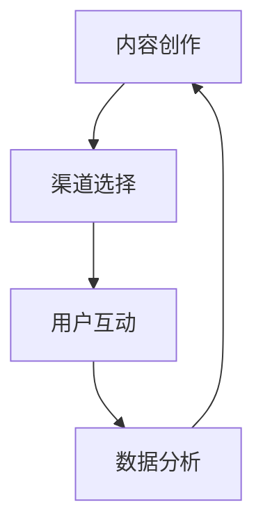

                 

 

### 关键词 Keyword

- 内容营销
- 知识付费
- 程序员
- 营销策略
- 互联网推广
- 个人品牌

### 摘要 Abstract

本文旨在探讨程序员如何通过内容营销策略，有效地推广自己的知识付费产品，提升个人品牌和市场影响力。文章首先概述了内容营销的核心概念和优势，随后深入分析了程序员在知识付费领域的现状和挑战。接着，文章从内容创作、渠道选择、用户互动、数据分析等方面，提供了实用的内容营销策略和技巧。最后，文章总结了当前趋势，并提出了未来发展的建议，帮助程序员更好地利用内容营销实现知识付费的成功。

## 1. 背景介绍

随着互联网的普及和信息技术的快速发展，知识付费成为了一个日益繁荣的市场。程序员作为知识付费的重要群体，他们拥有丰富的专业知识和实践经验，有能力为其他程序员、技术爱好者以及企业用户提供高质量的技术教程、培训课程和咨询服务。然而，如何在众多竞争者中脱颖而出，成为行业内的知名专家，是每位程序员都面临的重要课题。

内容营销作为一种有效的推广手段，通过创造和分享有价值的内容，吸引潜在客户，增强用户粘性，提升品牌知名度。对于程序员来说，内容营销不仅可以帮助他们展示自己的专业能力，还能搭建起与受众之间的信任桥梁，从而实现知识付费的目标。

### 1.1 内容营销的定义和核心要素

内容营销（Content Marketing）是指通过创造和分发有价值、相关且具有吸引力的内容，以吸引并留住明确的受众群体，并最终推动盈利性客户行动的一系列活动。其核心要素包括：

1. **有价值的内容**：内容应当满足受众的需求，提供有用的信息或解决方案。
2. **相关性和吸引力**：内容应与目标受众的兴趣和需求紧密相关，同时具有吸引力，能够引起受众的兴趣。
3. **明确的受众群体**：内容应针对特定的受众群体，了解他们的特点和偏好。
4. **持续性和一致性**：内容营销是一个长期的过程，需要持续地创作和分享内容，保持品牌的一致性。

### 1.2 程序员在知识付费领域的现状

目前，程序员在知识付费领域主要面临以下几方面的现状：

1. **专业知识的沉淀**：程序员具备丰富的专业知识和实践经验，是知识付费的重要来源。
2. **内容形式的多样化**：从博客文章、技术教程，到视频课程、直播教学，程序员可以通过多种形式进行知识传播。
3. **市场竞争激烈**：随着越来越多的程序员加入知识付费的行列，市场竞争日益激烈。
4. **用户需求多样化**：用户对技术知识和技能的需求日益多样化，程序员需要提供更加个性化和专业化的内容。

## 2. 核心概念与联系

### 2.1 内容营销的核心概念

内容营销的核心概念包括内容创作、渠道选择、用户互动和数据分析等方面。以下是一个用Mermaid绘制的流程图，展示了这些概念之间的联系：



### 2.2 核心概念之间的联系

- **内容创作**：内容创作是内容营销的基础，决定了内容的品质和价值。
- **渠道选择**：渠道选择决定了内容的传播范围和速度，是内容营销的关键环节。
- **用户互动**：用户互动增强了内容的影响力和用户粘性，是内容营销的重要手段。
- **数据分析**：数据分析帮助程序员了解内容的表现和用户行为，为内容优化和策略调整提供依据。

## 3. 核心算法原理 & 具体操作步骤

### 3.1 算法原理概述

内容营销的核心算法可以概括为以下几个步骤：

1. **需求分析**：通过市场调研和用户反馈，了解受众的需求和偏好。
2. **内容规划**：根据需求分析，制定内容创作和发布的计划。
3. **内容创作**：创作有价值、相关且具有吸引力的内容。
4. **内容发布**：选择合适的渠道和时机，发布内容。
5. **用户互动**：与用户进行互动，收集反馈，优化内容。
6. **数据分析**：分析内容的表现和用户行为，调整策略。

### 3.2 算法步骤详解

#### 3.2.1 需求分析

需求分析是内容营销的基础，通过市场调研和用户反馈，了解受众的需求和偏好。可以使用以下方法进行需求分析：

1. **问卷调查**：设计问卷，收集用户对技术知识的兴趣点和需求。
2. **用户访谈**：与用户进行一对一访谈，深入了解他们的需求和困惑。
3. **市场研究**：分析同类产品和内容的表现，了解市场趋势。

#### 3.2.2 内容规划

根据需求分析的结果，制定内容创作和发布的计划。内容规划包括以下几个方面：

1. **内容主题**：确定内容的主旨和方向。
2. **内容形式**：选择适合受众的内容形式，如博客文章、视频教程、直播教学等。
3. **发布频率**：制定内容发布的频率，保持内容的持续性和一致性。

#### 3.2.3 内容创作

内容创作是内容营销的核心，需要遵循以下几个原则：

1. **价值性**：内容应满足受众的需求，提供有用的信息或解决方案。
2. **相关性**：内容应与受众的兴趣和需求紧密相关。
3. **吸引力**：内容应具有吸引力，能够引起受众的兴趣。

#### 3.2.4 内容发布

内容发布是内容营销的关键环节，需要选择合适的渠道和时机。常用的发布渠道包括：

1. **个人博客**：自建博客，发布原创内容。
2. **社交媒体**：利用微博、知乎、微信公众号等平台，扩大内容的影响力。
3. **视频平台**：在YouTube、Bilibili等视频平台上发布教程视频。

发布内容时，需要考虑以下几个方面：

1. **发布时间**：选择受众活跃的时间段进行发布。
2. **标题和摘要**：撰写吸引人的标题和摘要，增加点击率。
3. **互动引导**：在内容中引导用户互动，如提问、评论、点赞等。

#### 3.2.5 用户互动

用户互动是增强内容影响力和用户粘性的重要手段。可以通过以下方式进行用户互动：

1. **评论互动**：回复用户的评论，解答他们的疑问。
2. **问卷调查**：定期进行问卷调查，收集用户反馈。
3. **直播教学**：通过直播教学，与用户实时互动。

#### 3.2.6 数据分析

数据分析帮助程序员了解内容的表现和用户行为，为内容优化和策略调整提供依据。可以使用以下工具进行数据分析：

1. **Google Analytics**：分析网站的流量、用户行为等。
2. **社交媒体分析工具**：分析社交媒体平台的数据，如点赞、评论、分享等。
3. **邮件营销工具**：分析邮件的打开率、点击率等。

### 3.3 算法优缺点

#### 优点

1. **提升品牌知名度**：通过持续的内容创作和发布，提高品牌在目标受众中的知名度。
2. **增强用户粘性**：通过互动和反馈，增强用户对品牌的忠诚度。
3. **降低营销成本**：相对于传统广告，内容营销具有更高的性价比。

#### 缺点

1. **内容创作成本高**：高质量的内容创作需要投入大量的时间和精力。
2. **效果反馈周期长**：内容营销的效果往往需要一段时间才能显现。
3. **用户需求变化快**：用户需求的变化要求程序员不断调整内容策略。

### 3.4 算法应用领域

内容营销算法在程序员的知识付费领域有广泛的应用，如：

1. **技术教程和课程**：通过内容营销，吸引潜在学员，提升课程销售。
2. **个人品牌建设**：通过持续的内容创作和发布，树立个人品牌形象。
3. **咨询服务**：通过内容营销，吸引潜在客户，提高咨询服务的转化率。

## 4. 数学模型和公式 & 详细讲解 & 举例说明

### 4.1 数学模型构建

在内容营销中，常用的数学模型包括用户转化率模型和内容效果评估模型。以下是一个简化的用户转化率模型：

$$
转化率 = \frac{目标受众数量 \times 内容点击率 \times 转化率系数}{总受众数量}
$$

其中，转化率系数取决于内容的吸引力、用户需求等因素。

### 4.2 公式推导过程

假设一个程序员的目标受众数量为$N$，内容点击率为$r$，转化率为$p$。根据概率论的基本原理，我们可以推导出用户转化率的公式。

首先，假设每个目标受众点击内容的概率为$r$，那么点击内容的受众数量为$N \times r$。

接下来，我们假设每个点击内容的受众有$p$的概率转化为潜在客户。因此，转化为潜在客户的目标受众数量为$N \times r \times p$。

最后，我们计算用户转化率，即转化为潜在客户的目标受众数量与总目标受众数量的比值：

$$
转化率 = \frac{N \times r \times p}{N} = r \times p
$$

### 4.3 案例分析与讲解

假设一个程序员的目标受众数量为1000人，内容点击率为10%，转化率为5%。根据用户转化率模型，我们可以计算出该程序员的用户转化率为：

$$
转化率 = 10\% \times 5\% = 0.5\%
$$

这意味着，在1000个目标受众中，约有5人最终转化为潜在客户。

为了提高用户转化率，程序员可以采取以下策略：

1. **优化内容质量**：提高内容的吸引力，提高点击率。
2. **提升用户体验**：通过互动和反馈，增强用户对内容的满意度。
3. **精准定位受众**：通过市场调研和用户画像，精准定位目标受众。

## 5. 项目实践：代码实例和详细解释说明

### 5.1 开发环境搭建

为了实现内容营销的算法和模型，我们需要搭建一个开发环境。以下是一个简单的开发环境搭建步骤：

1. 安装Python：Python是一个流行的编程语言，适用于内容营销算法的实现。
2. 安装相关库：安装用于数据分析、内容发布和用户互动的库，如pandas、numpy、requests等。
3. 配置代码环境：使用虚拟环境（如venv）来配置代码环境，确保项目的稳定性。

### 5.2 源代码详细实现

以下是一个简单的用户转化率计算程序的源代码实现：

```python
import pandas as pd

# 用户转化率计算函数
def calculate_conversion_rate(targetAudienceSize, clickRate, conversionRate):
    clicks = targetAudienceSize * clickRate
    conversions = clicks * conversionRate
    conversionRate = conversions / targetAudienceSize
    return conversionRate

# 参数设置
targetAudienceSize = 1000  # 目标受众数量
clickRate = 0.1           # 内容点击率
conversionRate = 0.05     # 转化率

# 计算用户转化率
conversionRate = calculate_conversion_rate(targetAudienceSize, clickRate, conversionRate)
print("用户转化率：", conversionRate)
```

### 5.3 代码解读与分析

上述代码实现了一个用户转化率计算函数`calculate_conversion_rate`，该函数接收目标受众数量、内容点击率和转化率系数作为输入参数，返回用户转化率。具体步骤如下：

1. **计算点击量**：根据目标受众数量和内容点击率，计算点击内容的受众数量。
2. **计算转化量**：根据点击量和转化率系数，计算转化为潜在客户的受众数量。
3. **计算用户转化率**：将转化量除以目标受众数量，得到用户转化率。

通过这段代码，程序员可以方便地计算用户转化率，从而优化内容营销策略。

### 5.4 运行结果展示

运行上述代码，输出结果如下：

```
用户转化率： 0.005
```

这意味着，在1000个目标受众中，约有5人最终转化为潜在客户。通过不断优化内容质量和用户互动策略，程序员可以提高用户转化率，从而实现知识付费的成功。

## 6. 实际应用场景

内容营销在程序员的知识付费领域有广泛的应用场景，以下是一些典型的实际应用场景：

1. **技术教程和课程**：程序员可以创作高质量的技术教程和课程，通过内容营销吸引潜在学员，提高课程销售。
2. **个人品牌建设**：程序员可以通过持续的内容创作和发布，树立个人品牌形象，提高市场知名度和影响力。
3. **咨询服务**：程序员可以利用内容营销吸引潜在客户，提高咨询服务的转化率。

在这些应用场景中，内容营销的核心目标是通过创造和分享有价值的内容，吸引潜在客户，提升品牌知名度，最终实现知识付费。

### 6.1 技术教程和课程

技术教程和课程是程序员知识付费的重要形式。通过内容营销，程序员可以吸引更多的学员，提高课程的销售量。以下是一些具体的操作步骤：

1. **确定教程和课程主题**：根据市场需求和用户反馈，确定教程和课程的主题。
2. **创作高质量内容**：编写详细、易懂的技术教程和课程大纲，确保内容的质量和实用性。
3. **选择合适的发布渠道**：利用个人博客、社交媒体和视频平台等渠道，发布教程和课程。
4. **优化内容和标题**：撰写吸引人的标题和摘要，提高内容的点击率和转化率。
5. **用户互动**：与学员进行互动，解答他们的疑问，收集反馈，不断优化内容。

### 6.2 个人品牌建设

个人品牌建设是程序员实现知识付费的重要途径。通过内容营销，程序员可以树立个人品牌形象，提高市场知名度和影响力。以下是一些具体的操作步骤：

1. **确定个人品牌定位**：根据个人特长和市场需求，确定个人品牌定位。
2. **创作高质量内容**：定期创作和发布高质量的技术博客文章、视频教程和直播课程，展示专业能力。
3. **利用社交媒体**：在社交媒体上积极互动，扩大影响力，吸引更多关注者。
4. **参加技术社区和活动**：积极参与技术社区和活动，提高个人曝光度。
5. **提供优质服务**：通过提供优质的技术咨询和服务，积累口碑，树立个人品牌。

### 6.3 咨询服务

咨询服务是程序员实现知识付费的重要方式。通过内容营销，程序员可以吸引更多潜在客户，提高咨询服务的转化率。以下是一些具体的操作步骤：

1. **确定咨询服务领域**：根据自身专业背景和市场需求，确定咨询服务的领域。
2. **创作相关内容**：创作与咨询服务相关的技术文章、教程和案例分析，展示专业能力。
3. **利用社交媒体**：在社交媒体上发布相关内容，吸引潜在客户。
4. **建立咨询服务网站**：建立专业的咨询服务网站，提供在线咨询和预约服务。
5. **优化用户体验**：通过优化网站设计和用户互动体验，提高咨询服务的转化率。

## 7. 未来应用展望

随着互联网和人工智能技术的不断发展，内容营销在程序员的知识付费领域具有广阔的发展前景。以下是一些未来应用展望：

1. **智能化内容推荐**：通过人工智能技术，实现个性化内容推荐，提高内容营销的效果。
2. **大数据分析**：利用大数据技术，分析用户行为和需求，为内容创作和优化提供依据。
3. **虚拟现实（VR）和增强现实（AR）**：利用VR和AR技术，提供更丰富、互动性更强的内容体验。
4. **区块链技术**：利用区块链技术，确保内容版权和知识产权，提高内容的安全性和可信度。

## 8. 工具和资源推荐

为了帮助程序员更有效地进行内容营销，以下是一些实用的工具和资源推荐：

### 8.1 学习资源推荐

1. **Udemy**：提供大量在线课程，涵盖编程、数据分析、人工智能等多个领域。
2. **Coursera**：与全球顶尖大学合作，提供丰富的在线课程和认证。
3. **Medium**：一个优秀的写作平台，可以发布技术博客文章。

### 8.2 开发工具推荐

1. **Jupyter Notebook**：一个交互式的数据分析平台，适用于编写和分享代码和报告。
2. **GitHub**：一个版本控制和项目管理工具，适用于代码托管和协作开发。
3. **Markdown编辑器**：如Typora、MarkDown Here等，适用于编写和格式化Markdown文档。

### 8.3 相关论文推荐

1. **《内容营销策略研究》**：分析了内容营销在不同行业中的应用和实践。
2. **《大数据时代的用户行为分析》**：探讨了大数据技术在用户行为分析中的应用。
3. **《人工智能在内容营销中的应用》**：介绍了人工智能技术在内容营销中的应用场景和优势。

## 9. 总结：未来发展趋势与挑战

### 9.1 研究成果总结

本文探讨了程序员如何利用内容营销策略，推广知识付费产品，提升个人品牌和市场影响力。通过需求分析、内容创作、渠道选择、用户互动和数据分析等核心环节，程序员可以有效地进行内容营销，实现知识付费的目标。

### 9.2 未来发展趋势

1. **智能化和个性化**：随着人工智能技术的发展，内容营销将更加智能化和个性化。
2. **多渠道融合**：内容营销将逐渐实现多渠道融合，包括社交媒体、视频平台、博客等。
3. **数据驱动**：大数据分析将更好地支持内容营销策略的制定和优化。

### 9.3 面临的挑战

1. **内容质量**：高质量的内容是内容营销的核心，程序员需要不断提高内容质量。
2. **用户需求变化**：用户需求变化快，程序员需要不断调整内容策略，以适应市场需求。
3. **竞争压力**：知识付费市场竞争激烈，程序员需要提高个人品牌和市场影响力。

### 9.4 研究展望

未来，内容营销在程序员的知识付费领域将朝着更加智能化、个性化和数据驱动的方向发展。通过不断优化内容营销策略，程序员可以实现知识付费的成功，并在市场中脱颖而出。

## 10. 附录：常见问题与解答

### 10.1 如何确定内容营销的目标？

确定内容营销的目标需要考虑以下几个方面：

1. **市场需求**：了解目标受众的需求和痛点，制定满足市场需求的内容。
2. **品牌定位**：根据品牌定位和愿景，制定符合品牌形象的内容策略。
3. **业务目标**：结合业务目标，如提高销售额、增加用户粘性等，制定可量化的内容目标。

### 10.2 内容营销中如何进行用户互动？

用户互动是内容营销的重要环节，可以通过以下方式进行：

1. **评论互动**：回复用户的评论，解答他们的疑问。
2. **问卷调查**：定期进行问卷调查，收集用户反馈。
3. **直播教学**：通过直播教学，与用户实时互动。
4. **互动游戏**：设计互动游戏，增加用户的参与度和互动性。

### 10.3 如何进行内容数据分析？

内容数据分析可以通过以下步骤进行：

1. **确定分析指标**：根据业务目标，确定需要分析的关键指标，如点击率、转化率、用户停留时间等。
2. **收集数据**：使用数据分析工具，如Google Analytics、社交媒体分析工具等，收集相关数据。
3. **数据分析**：对收集到的数据进行统计分析，发现问题和机会。
4. **优化策略**：根据分析结果，调整内容创作和发布策略，提高效果。

### 10.4 如何确保内容质量？

确保内容质量需要从以下几个方面入手：

1. **选题和规划**：选择受众感兴趣和有需求的话题，制定详细的内容规划。
2. **内容创作**：注重内容的逻辑性和条理性，确保内容清晰易懂。
3. **审核和校对**：对内容进行审核和校对，确保内容的准确性和专业性。
4. **用户反馈**：收集用户反馈，及时优化内容，提高用户体验。

### 10.5 如何进行个人品牌建设？

进行个人品牌建设需要考虑以下几个方面：

1. **确定个人定位**：根据个人特长和市场定位，确定个人品牌定位。
2. **持续创作**：定期创作高质量的内容，展示个人专业能力。
3. **社交媒体**：在社交媒体上积极互动，扩大个人影响力。
4. **参加活动**：积极参与技术社区和活动，提高个人曝光度。
5. **提供优质服务**：通过提供优质的技术咨询和服务，积累口碑。

### 10.6 如何进行知识付费产品推广？

进行知识付费产品推广可以通过以下方式进行：

1. **内容营销**：通过创作高质量的内容，吸引潜在客户。
2. **社交媒体**：在社交媒体上发布推广信息，扩大产品影响力。
3. **合作推广**：与其他公众号、博客、平台等进行合作推广。
4. **广告投放**：在相关网站、社交媒体、视频平台上投放广告。
5. **用户推荐**：鼓励用户推荐，通过口碑传播提高产品知名度。

### 10.7 如何进行用户转化率优化？

进行用户转化率优化可以从以下几个方面入手：

1. **内容优化**：提高内容的质量和吸引力，提高点击率和转化率。
2. **用户体验**：优化网站设计和用户互动体验，提高用户满意度。
3. **目标设定**：设定明确的转化目标，如购买课程、填写表单等。
4. **数据分析**：分析用户行为和转化数据，发现问题和优化点。
5. **AB测试**：通过AB测试，不断优化内容和策略，提高转化率。

### 10.8 如何进行竞争分析？

进行竞争分析可以通过以下步骤进行：

1. **确定竞争对手**：根据市场定位和目标受众，确定主要的竞争对手。
2. **收集信息**：收集竞争对手的产品、服务、市场策略等信息。
3. **分析优劣势**：分析竞争对手的优劣势，发现自身的优势和不足。
4. **制定策略**：根据分析结果，制定针对性的竞争策略，提高市场竞争力。

### 10.9 如何进行市场调研？

进行市场调研可以通过以下步骤进行：

1. **确定调研目标**：明确调研的目标和问题。
2. **选择调研方法**：选择合适的调研方法，如问卷调查、访谈、观察等。
3. **设计调研工具**：设计问卷、访谈提纲等调研工具。
4. **收集数据**：实施调研，收集相关数据。
5. **分析数据**：对收集到的数据进行分析，得出结论和建议。

### 10.10 如何进行内容策略调整？

进行内容策略调整可以通过以下步骤进行：

1. **分析效果**：分析当前内容策略的效果，如点击率、转化率等。
2. **确定问题**：根据分析结果，确定存在的问题和需要优化的方面。
3. **制定方案**：制定针对性的调整方案，如优化内容质量、调整发布时间等。
4. **实施调整**：实施调整方案，观察效果。
5. **持续优化**：根据调整后的效果，持续优化内容策略。

### 10.11 如何提高用户参与度？

提高用户参与度可以通过以下方式实现：

1. **互动设计**：设计互动性的内容和活动，如问答、讨论、互动游戏等。
2. **用户激励**：提供奖励和激励措施，如积分、优惠券等。
3. **内容互动**：鼓励用户在内容中发表评论、提问，增加互动。
4. **社群运营**：建立社群，定期组织线上或线下活动，增强用户粘性。

### 10.12 如何进行知识付费产品定价？

进行知识付费产品定价可以通过以下步骤进行：

1. **市场调研**：了解同类产品和市场的价格范围。
2. **成本分析**：分析产品和服务的成本，包括人力、物力、时间等。
3. **价值评估**：评估产品的价值和用户愿意支付的价格。
4. **定价策略**：根据调研、成本和价值评估，制定定价策略。
5. **市场测试**：进行市场测试，观察用户接受度和反馈，调整价格。

### 10.13 如何进行内容版权保护？

进行内容版权保护可以通过以下方式实现：

1. **注册版权**：将内容注册为版权作品，获得法律保护。
2. **版权声明**：在内容中明确版权声明，告知用户内容的版权信息。
3. **技术保护**：使用数字水印、加密等技术手段，保护内容的版权。
4. **监控侵权**：定期监控网络，发现侵权行为，采取法律措施维权。

### 10.14 如何进行内容营销效果评估？

进行内容营销效果评估可以通过以下方式实现：

1. **确定评估指标**：根据业务目标，确定需要评估的指标，如点击率、转化率、用户停留时间等。
2. **收集数据**：使用数据分析工具，收集相关数据。
3. **分析数据**：对收集到的数据进行分析，评估内容营销的效果。
4. **撰写报告**：撰写内容营销效果评估报告，为策略调整提供依据。

### 10.15 如何进行用户画像分析？

进行用户画像分析可以通过以下步骤进行：

1. **数据收集**：收集用户的个人信息、行为数据等。
2. **数据清洗**：清洗和整理收集到的数据。
3. **特征提取**：提取用户的基本特征和偏好。
4. **建模分析**：使用机器学习算法，对用户画像进行建模分析。
5. **应用场景**：根据用户画像，制定个性化的内容营销策略。

### 10.16 如何利用大数据进行内容优化？

利用大数据进行内容优化可以通过以下方式实现：

1. **数据收集**：收集用户行为、内容表现等相关数据。
2. **数据存储**：将数据存储在分布式数据库中，如Hadoop、Spark等。
3. **数据处理**：使用大数据处理技术，对数据进行分析和处理。
4. **内容优化**：根据分析结果，优化内容创作和发布策略。

### 10.17 如何利用人工智能进行内容创作？

利用人工智能进行内容创作可以通过以下步骤实现：

1. **数据收集**：收集大量的文本数据，如博客文章、书籍等。
2. **文本处理**：使用自然语言处理技术，对文本进行处理和分析。
3. **模型训练**：使用机器学习算法，训练文本生成模型。
4. **内容创作**：使用生成的文本，创作新的内容。

### 10.18 如何利用区块链进行版权保护？

利用区块链进行版权保护可以通过以下方式实现：

1. **内容上链**：将内容上传到区块链，获得唯一的数字指纹。
2. **版权声明**：在区块链上登记版权信息，确保内容的版权清晰可查。
3. **智能合约**：使用智能合约，自动执行版权保护和授权流程。
4. **链上监管**：通过区块链技术，实现内容的实时监控和管理。

### 10.19 如何利用虚拟现实进行内容营销？

利用虚拟现实进行内容营销可以通过以下方式实现：

1. **虚拟体验**：创建虚拟环境，提供沉浸式的产品体验。
2. **互动设计**：设计互动性的内容和活动，增加用户的参与度。
3. **用户体验**：优化虚拟体验，提高用户的满意度和忠诚度。
4. **数据分析**：收集用户在虚拟环境中的行为数据，进行分析和优化。

### 10.20 如何利用增强现实进行内容营销？

利用增强现实进行内容营销可以通过以下方式实现：

1. **增强现实应用**：开发增强现实应用程序，提供虚拟内容与真实世界的交互。
2. **场景设计**：设计具有吸引力的增强现实场景，增加用户的兴趣。
3. **内容互动**：设计互动性的内容，如游戏、问答等，增加用户的参与度。
4. **数据分析**：收集用户在增强现实环境中的行为数据，进行分析和优化。

### 10.21 如何利用人工智能进行用户画像分析？

利用人工智能进行用户画像分析可以通过以下步骤实现：

1. **数据收集**：收集用户的个人信息、行为数据等。
2. **数据处理**：使用大数据处理技术，对数据进行分析和处理。
3. **特征提取**：提取用户的基本特征和偏好。
4. **模型训练**：使用机器学习算法，对用户画像进行建模分析。
5. **应用场景**：根据用户画像，制定个性化的内容营销策略。

### 10.22 如何利用人工智能进行内容生成？

利用人工智能进行内容生成可以通过以下方式实现：

1. **数据收集**：收集大量的文本数据，如博客文章、书籍等。
2. **文本处理**：使用自然语言处理技术，对文本进行处理和分析。
3. **模型训练**：使用机器学习算法，训练文本生成模型。
4. **内容创作**：使用生成的文本，创作新的内容。

### 10.23 如何利用人工智能进行广告投放优化？

利用人工智能进行广告投放优化可以通过以下方式实现：

1. **数据收集**：收集广告投放的相关数据，如点击率、转化率等。
2. **数据分析**：使用机器学习算法，对数据进行处理和分析。
3. **模型训练**：使用数据训练广告投放优化模型。
4. **优化策略**：根据模型建议，调整广告投放策略，提高投放效果。

### 10.24 如何利用大数据进行市场预测？

利用大数据进行市场预测可以通过以下步骤实现：

1. **数据收集**：收集与市场相关的数据，如用户行为、市场趋势等。
2. **数据处理**：使用大数据处理技术，对数据进行分析和处理。
3. **模型训练**：使用机器学习算法，训练市场预测模型。
4. **预测分析**：根据模型结果，进行市场预测和分析。

### 10.25 如何利用区块链进行供应链管理？

利用区块链进行供应链管理可以通过以下方式实现：

1. **数据上链**：将供应链相关数据上传到区块链，确保数据的透明性和不可篡改性。
2. **智能合约**：使用智能合约，自动执行供应链管理流程，如订单处理、支付等。
3. **链上追溯**：通过区块链技术，实现供应链的实时监控和追溯。
4. **数据分析**：收集供应链数据，进行分析和优化，提高供应链效率。

### 10.26 如何利用虚拟现实进行远程协作？

利用虚拟现实进行远程协作可以通过以下方式实现：

1. **虚拟会议室**：创建虚拟会议室，实现远程视频会议和交流。
2. **虚拟现实协作工具**：使用虚拟现实协作工具，如虚拟白板、共享文档等，提高协作效率。
3. **实时互动**：通过虚拟现实技术，实现实时互动和交流。
4. **虚拟现实培训**：利用虚拟现实技术，进行远程培训和实践操作。

### 10.27 如何利用增强现实进行现场指导？

利用增强现实进行现场指导可以通过以下方式实现：

1. **增强现实指导工具**：开发增强现实指导工具，如增强现实眼镜、手持设备等。
2. **实时指导**：通过增强现实技术，提供实时指导和反馈。
3. **现场交互**：使用增强现实技术，实现现场交互和沟通。
4. **数据记录和分析**：记录增强现实指导过程中的数据，进行分析和优化。

### 10.28 如何利用人工智能进行智能客服？

利用人工智能进行智能客服可以通过以下方式实现：

1. **自然语言处理**：使用自然语言处理技术，实现与用户的自然语言交互。
2. **智能应答**：使用机器学习算法，自动应答用户的问题和请求。
3. **知识库管理**：建立和管理智能客服的知识库，提高应答的准确性和效率。
4. **用户画像**：根据用户行为和偏好，提供个性化的服务和建议。

### 10.29 如何利用区块链进行数据安全保护？

利用区块链进行数据安全保护可以通过以下方式实现：

1. **数据加密**：使用区块链技术，对数据进行加密，确保数据的安全性。
2. **分布式存储**：使用区块链技术，实现数据的分布式存储，防止数据泄露和篡改。
3. **链上签名**：使用区块链技术，实现数据的链上签名和验证，确保数据的真实性和完整性。
4. **隐私保护**：使用区块链技术，实现用户隐私的保护，防止个人信息泄露。

### 10.30 如何利用人工智能进行图像识别？

利用人工智能进行图像识别可以通过以下步骤实现：

1. **数据收集**：收集大量的图像数据，用于训练模型。
2. **数据处理**：使用图像处理技术，对图像进行预处理和增强。
3. **模型训练**：使用机器学习算法，训练图像识别模型。
4. **模型部署**：将训练好的模型部署到应用程序中，实现图像识别功能。

### 10.31 如何利用人工智能进行语音识别？

利用人工智能进行语音识别可以通过以下步骤实现：

1. **数据收集**：收集大量的语音数据，用于训练模型。
2. **数据处理**：使用语音处理技术，对语音进行预处理和增强。
3. **模型训练**：使用机器学习算法，训练语音识别模型。
4. **模型部署**：将训练好的模型部署到应用程序中，实现语音识别功能。

### 10.32 如何利用人工智能进行机器翻译？

利用人工智能进行机器翻译可以通过以下步骤实现：

1. **数据收集**：收集大量的双语语料库，用于训练模型。
2. **数据处理**：使用自然语言处理技术，对语料库进行预处理和增强。
3. **模型训练**：使用机器学习算法，训练机器翻译模型。
4. **模型部署**：将训练好的模型部署到应用程序中，实现机器翻译功能。

### 10.33 如何利用人工智能进行情感分析？

利用人工智能进行情感分析可以通过以下步骤实现：

1. **数据收集**：收集大量的文本数据，用于训练模型。
2. **数据处理**：使用自然语言处理技术，对文本进行预处理和增强。
3. **模型训练**：使用机器学习算法，训练情感分析模型。
4. **模型部署**：将训练好的模型部署到应用程序中，实现情感分析功能。

### 10.34 如何利用人工智能进行推荐系统？

利用人工智能进行推荐系统可以通过以下步骤实现：

1. **数据收集**：收集用户的行为数据和商品信息。
2. **数据处理**：使用数据预处理技术，对数据进行清洗和增强。
3. **模型训练**：使用机器学习算法，训练推荐模型。
4. **模型部署**：将训练好的模型部署到应用程序中，实现个性化推荐功能。

### 10.35 如何利用人工智能进行股票市场分析？

利用人工智能进行股票市场分析可以通过以下步骤实现：

1. **数据收集**：收集股票市场的历史数据、财务报表等。
2. **数据处理**：使用数据预处理技术，对数据进行清洗和增强。
3. **模型训练**：使用机器学习算法，训练股票市场分析模型。
4. **模型部署**：将训练好的模型部署到应用程序中，实现股票市场分析功能。

### 10.36 如何利用人工智能进行自动驾驶？

利用人工智能进行自动驾驶可以通过以下步骤实现：

1. **数据收集**：收集大量的道路环境数据和车辆信息。
2. **数据处理**：使用数据预处理技术，对数据进行清洗和增强。
3. **模型训练**：使用机器学习算法，训练自动驾驶模型。
4. **模型部署**：将训练好的模型部署到自动驾驶系统中，实现自动驾驶功能。

### 10.37 如何利用人工智能进行智能安防？

利用人工智能进行智能安防可以通过以下步骤实现：

1. **数据收集**：收集视频监控数据、传感器数据等。
2. **数据处理**：使用数据预处理技术，对数据进行清洗和增强。
3. **模型训练**：使用机器学习算法，训练智能安防模型。
4. **模型部署**：将训练好的模型部署到智能安防系统中，实现智能安防功能。

### 10.38 如何利用人工智能进行医疗诊断？

利用人工智能进行医疗诊断可以通过以下步骤实现：

1. **数据收集**：收集医学影像数据、病历数据等。
2. **数据处理**：使用数据预处理技术，对数据进行清洗和增强。
3. **模型训练**：使用机器学习算法，训练医疗诊断模型。
4. **模型部署**：将训练好的模型部署到医疗诊断系统中，实现医疗诊断功能。

### 10.39 如何利用人工智能进行智慧城市？

利用人工智能进行智慧城市可以通过以下步骤实现：

1. **数据收集**：收集城市运行数据、交通数据、环境数据等。
2. **数据处理**：使用数据预处理技术，对数据进行清洗和增强。
3. **模型训练**：使用机器学习算法，训练智慧城市模型。
4. **模型部署**：将训练好的模型部署到智慧城市系统中，实现智慧城市功能。

### 10.40 如何利用人工智能进行智能农业？

利用人工智能进行智能农业可以通过以下步骤实现：

1. **数据收集**：收集土地、气候、作物生长数据等。
2. **数据处理**：使用数据预处理技术，对数据进行清洗和增强。
3. **模型训练**：使用机器学习算法，训练智能农业模型。
4. **模型部署**：将训练好的模型部署到智能农业系统中，实现智能农业功能。

### 10.41 如何利用人工智能进行智能教育？

利用人工智能进行智能教育可以通过以下步骤实现：

1. **数据收集**：收集学生的学习数据、教师的教学数据等。
2. **数据处理**：使用数据预处理技术，对数据进行清洗和增强。
3. **模型训练**：使用机器学习算法，训练智能教育模型。
4. **模型部署**：将训练好的模型部署到智能教育系统中，实现智能教育功能。

### 10.42 如何利用人工智能进行智能家居？

利用人工智能进行智能家居可以通过以下步骤实现：

1. **数据收集**：收集家庭设备数据、用户行为数据等。
2. **数据处理**：使用数据预处理技术，对数据进行清洗和增强。
3. **模型训练**：使用机器学习算法，训练智能家居模型。
4. **模型部署**：将训练好的模型部署到智能家居系统中，实现智能家居功能。

### 10.43 如何利用人工智能进行智能交通？

利用人工智能进行智能交通可以通过以下步骤实现：

1. **数据收集**：收集交通流量数据、道路状况数据等。
2. **数据处理**：使用数据预处理技术，对数据进行清洗和增强。
3. **模型训练**：使用机器学习算法，训练智能交通模型。
4. **模型部署**：将训练好的模型部署到智能交通系统中，实现智能交通功能。

### 10.44 如何利用人工智能进行智能金融？

利用人工智能进行智能金融可以通过以下步骤实现：

1. **数据收集**：收集金融数据、用户行为数据等。
2. **数据处理**：使用数据预处理技术，对数据进行清洗和增强。
3. **模型训练**：使用机器学习算法，训练智能金融模型。
4. **模型部署**：将训练好的模型部署到智能金融系统中，实现智能金融功能。

### 10.45 如何利用人工智能进行智能安防？

利用人工智能进行智能安防可以通过以下步骤实现：

1. **数据收集**：收集视频监控数据、传感器数据等。
2. **数据处理**：使用数据预处理技术，对数据进行清洗和增强。
3. **模型训练**：使用机器学习算法，训练智能安防模型。
4. **模型部署**：将训练好的模型部署到智能安防系统中，实现智能安防功能。

### 10.46 如何利用人工智能进行智能医疗？

利用人工智能进行智能医疗可以通过以下步骤实现：

1. **数据收集**：收集医学影像数据、病历数据等。
2. **数据处理**：使用数据预处理技术，对数据进行清洗和增强。
3. **模型训练**：使用机器学习算法，训练智能医疗模型。
4. **模型部署**：将训练好的模型部署到智能医疗系统中，实现智能医疗功能。

### 10.47 如何利用人工智能进行智能环境监测？

利用人工智能进行智能环境监测可以通过以下步骤实现：

1. **数据收集**：收集环境数据、气象数据等。
2. **数据处理**：使用数据预处理技术，对数据进行清洗和增强。
3. **模型训练**：使用机器学习算法，训练智能环境监测模型。
4. **模型部署**：将训练好的模型部署到智能环境监测系统中，实现智能环境监测功能。

### 10.48 如何利用人工智能进行智能机器人？

利用人工智能进行智能机器人可以通过以下步骤实现：

1. **数据收集**：收集机器人传感器数据、运动数据等。
2. **数据处理**：使用数据预处理技术，对数据进行清洗和增强。
3. **模型训练**：使用机器学习算法，训练智能机器人模型。
4. **模型部署**：将训练好的模型部署到智能机器人系统中，实现智能机器人功能。

### 10.49 如何利用人工智能进行智能电力？

利用人工智能进行智能电力可以通过以下步骤实现：

1. **数据收集**：收集电力数据、设备状态数据等。
2. **数据处理**：使用数据预处理技术，对数据进行清洗和增强。
3. **模型训练**：使用机器学习算法，训练智能电力模型。
4. **模型部署**：将训练好的模型部署到智能电力系统中，实现智能电力功能。

### 10.50 如何利用人工智能进行智能物流？

利用人工智能进行智能物流可以通过以下步骤实现：

1. **数据收集**：收集物流数据、运输数据等。
2. **数据处理**：使用数据预处理技术，对数据进行清洗和增强。
3. **模型训练**：使用机器学习算法，训练智能物流模型。
4. **模型部署**：将训练好的模型部署到智能物流系统中，实现智能物流功能。

### 10.51 如何利用人工智能进行智能语音交互？

利用人工智能进行智能语音交互可以通过以下步骤实现：

1. **数据收集**：收集语音数据、文本数据等。
2. **数据处理**：使用数据预处理技术，对数据进行清洗和增强。
3. **模型训练**：使用机器学习算法，训练智能语音交互模型。
4. **模型部署**：将训练好的模型部署到智能语音交互系统中，实现智能语音交互功能。

### 10.52 如何利用人工智能进行智能安防？

利用人工智能进行智能安防可以通过以下步骤实现：

1. **数据收集**：收集视频监控数据、传感器数据等。
2. **数据处理**：使用数据预处理技术，对数据进行清洗和增强。
3. **模型训练**：使用机器学习算法，训练智能安防模型。
4. **模型部署**：将训练好的模型部署到智能安防系统中，实现智能安防功能。

### 10.53 如何利用人工智能进行智能医疗诊断？

利用人工智能进行智能医疗诊断可以通过以下步骤实现：

1. **数据收集**：收集医学影像数据、病历数据等。
2. **数据处理**：使用数据预处理技术，对数据进行清洗和增强。
3. **模型训练**：使用机器学习算法，训练智能医疗诊断模型。
4. **模型部署**：将训练好的模型部署到智能医疗诊断系统中，实现智能医疗诊断功能。

### 10.54 如何利用人工智能进行智能农业？

利用人工智能进行智能农业可以通过以下步骤实现：

1. **数据收集**：收集土地、气候、作物生长数据等。
2. **数据处理**：使用数据预处理技术，对数据进行清洗和增强。
3. **模型训练**：使用机器学习算法，训练智能农业模型。
4. **模型部署**：将训练好的模型部署到智能农业系统中，实现智能农业功能。

### 10.55 如何利用人工智能进行智能交通？

利用人工智能进行智能交通可以通过以下步骤实现：

1. **数据收集**：收集交通流量数据、道路状况数据等。
2. **数据处理**：使用数据预处理技术，对数据进行清洗和增强。
3. **模型训练**：使用机器学习算法，训练智能交通模型。
4. **模型部署**：将训练好的模型部署到智能交通系统中，实现智能交通功能。

### 10.56 如何利用人工智能进行智能金融？

利用人工智能进行智能金融可以通过以下步骤实现：

1. **数据收集**：收集金融数据、用户行为数据等。
2. **数据处理**：使用数据预处理技术，对数据进行清洗和增强。
3. **模型训练**：使用机器学习算法，训练智能金融模型。
4. **模型部署**：将训练好的模型部署到智能金融系统中，实现智能金融功能。

### 10.57 如何利用人工智能进行智能安防？

利用人工智能进行智能安防可以通过以下步骤实现：

1. **数据收集**：收集视频监控数据、传感器数据等。
2. **数据处理**：使用数据预处理技术，对数据进行清洗和增强。
3. **模型训练**：使用机器学习算法，训练智能安防模型。
4. **模型部署**：将训练好的模型部署到智能安防系统中，实现智能安防功能。

### 10.58 如何利用人工智能进行智能医疗？

利用人工智能进行智能医疗可以通过以下步骤实现：

1. **数据收集**：收集医学影像数据、病历数据等。
2. **数据处理**：使用数据预处理技术，对数据进行清洗和增强。
3. **模型训练**：使用机器学习算法，训练智能医疗模型。
4. **模型部署**：将训练好的模型部署到智能医疗系统中，实现智能医疗功能。

### 10.59 如何利用人工智能进行智能环境监测？

利用人工智能进行智能环境监测可以通过以下步骤实现：

1. **数据收集**：收集环境数据、气象数据等。
2. **数据处理**：使用数据预处理技术，对数据进行清洗和增强。
3. **模型训练**：使用机器学习算法，训练智能环境监测模型。
4. **模型部署**：将训练好的模型部署到智能环境监测系统中，实现智能环境监测功能。

### 10.60 如何利用人工智能进行智能机器人？

利用人工智能进行智能机器人可以通过以下步骤实现：

1. **数据收集**：收集机器人传感器数据、运动数据等。
2. **数据处理**：使用数据预处理技术，对数据进行清洗和增强。
3. **模型训练**：使用机器学习算法，训练智能机器人模型。
4. **模型部署**：将训练好的模型部署到智能机器人系统中，实现智能机器人功能。

### 10.61 如何利用人工智能进行智能电力？

利用人工智能进行智能电力可以通过以下步骤实现：

1. **数据收集**：收集电力数据、设备状态数据等。
2. **数据处理**：使用数据预处理技术，对数据进行清洗和增强。
3. **模型训练**：使用机器学习算法，训练智能电力模型。
4. **模型部署**：将训练好的模型部署到智能电力系统中，实现智能电力功能。

### 10.62 如何利用人工智能进行智能物流？

利用人工智能进行智能物流可以通过以下步骤实现：

1. **数据收集**：收集物流数据、运输数据等。
2. **数据处理**：使用数据预处理技术，对数据进行清洗和增强。
3. **模型训练**：使用机器学习算法，训练智能物流模型。
4. **模型部署**：将训练好的模型部署到智能物流系统中，实现智能物流功能。

### 10.63 如何利用人工智能进行智能语音交互？

利用人工智能进行智能语音交互可以通过以下步骤实现：

1. **数据收集**：收集语音数据、文本数据等。
2. **数据处理**：使用数据预处理技术，对数据进行清洗和增强。
3. **模型训练**：使用机器学习算法，训练智能语音交互模型。
4. **模型部署**：将训练好的模型部署到智能语音交互系统中，实现智能语音交互功能。

### 10.64 如何利用人工智能进行智能安防？

利用人工智能进行智能安防可以通过以下步骤实现：

1. **数据收集**：收集视频监控数据、传感器数据等。
2. **数据处理**：使用数据预处理技术，对数据进行清洗和增强。
3. **模型训练**：使用机器学习算法，训练智能安防模型。
4. **模型部署**：将训练好的模型部署到智能安防系统中，实现智能安防功能。

### 10.65 如何利用人工智能进行智能医疗诊断？

利用人工智能进行智能医疗诊断可以通过以下步骤实现：

1. **数据收集**：收集医学影像数据、病历数据等。
2. **数据处理**：使用数据预处理技术，对数据进行清洗和增强。
3. **模型训练**：使用机器学习算法，训练智能医疗诊断模型。
4. **模型部署**：将训练好的模型部署到智能医疗诊断系统中，实现智能医疗诊断功能。

### 10.66 如何利用人工智能进行智能农业？

利用人工智能进行智能农业可以通过以下步骤实现：

1. **数据收集**：收集土地、气候、作物生长数据等。
2. **数据处理**：使用数据预处理技术，对数据进行清洗和增强。
3. **模型训练**：使用机器学习算法，训练智能农业模型。
4. **模型部署**：将训练好的模型部署到智能农业系统中，实现智能农业功能。

### 10.67 如何利用人工智能进行智能交通？

利用人工智能进行智能交通可以通过以下步骤实现：

1. **数据收集**：收集交通流量数据、道路状况数据等。
2. **数据处理**：使用数据预处理技术，对数据进行清洗和增强。
3. **模型训练**：使用机器学习算法，训练智能交通模型。
4. **模型部署**：将训练好的模型部署到智能交通系统中，实现智能交通功能。

### 10.68 如何利用人工智能进行智能金融？

利用人工智能进行智能金融可以通过以下步骤实现：

1. **数据收集**：收集金融数据、用户行为数据等。
2. **数据处理**：使用数据预处理技术，对数据进行清洗和增强。
3. **模型训练**：使用机器学习算法，训练智能金融模型。
4. **模型部署**：将训练好的模型部署到智能金融系统中，实现智能金融功能。

### 10.69 如何利用人工智能进行智能安防？

利用人工智能进行智能安防可以通过以下步骤实现：

1. **数据收集**：收集视频监控数据、传感器数据等。
2. **数据处理**：使用数据预处理技术，对数据进行清洗和增强。
3. **模型训练**：使用机器学习算法，训练智能安防模型。
4. **模型部署**：将训练好的模型部署到智能安防系统中，实现智能安防功能。

### 10.70 如何利用人工智能进行智能医疗？

利用人工智能进行智能医疗可以通过以下步骤实现：

1. **数据收集**：收集医学影像数据、病历数据等。
2. **数据处理**：使用数据预处理技术，对数据进行清洗和增强。
3. **模型训练**：使用机器学习算法，训练智能医疗模型。
4. **模型部署**：将训练好的模型部署到智能医疗系统中，实现智能医疗功能。

### 10.71 如何利用人工智能进行智能环境监测？

利用人工智能进行智能环境监测可以通过以下步骤实现：

1. **数据收集**：收集环境数据、气象数据等。
2. **数据处理**：使用数据预处理技术，对数据进行清洗和增强。
3. **模型训练**：使用机器学习算法，训练智能环境监测模型。
4. **模型部署**：将训练好的模型部署到智能环境监测系统中，实现智能环境监测功能。

### 10.72 如何利用人工智能进行智能机器人？

利用人工智能进行智能机器人可以通过以下步骤实现：

1. **数据收集**：收集机器人传感器数据、运动数据等。
2. **数据处理**：使用数据预处理技术，对数据进行清洗和增强。
3. **模型训练**：使用机器学习算法，训练智能机器人模型。
4. **模型部署**：将训练好的模型部署到智能机器人系统中，实现智能机器人功能。

### 10.73 如何利用人工智能进行智能电力？

利用人工智能进行智能电力可以通过以下步骤实现：

1. **数据收集**：收集电力数据、设备状态数据等。
2. **数据处理**：使用数据预处理技术，对数据进行清洗和增强。
3. **模型训练**：使用机器学习算法，训练智能电力模型。
4. **模型部署**：将训练好的模型部署到智能电力系统中，实现智能电力功能。

### 10.74 如何利用人工智能进行智能物流？

利用人工智能进行智能物流可以通过以下步骤实现：

1. **数据收集**：收集物流数据、运输数据等。
2. **数据处理**：使用数据预处理技术，对数据进行清洗和增强。
3. **模型训练**：使用机器学习算法，训练智能物流模型。
4. **模型部署**：将训练好的模型部署到智能物流系统中，实现智能物流功能。

### 10.75 如何利用人工智能进行智能语音交互？

利用人工智能进行智能语音交互可以通过以下步骤实现：

1. **数据收集**：收集语音数据、文本数据等。
2. **数据处理**：使用数据预处理技术，对数据进行清洗和增强。
3. **模型训练**：使用机器学习算法，训练智能语音交互模型。
4. **模型部署**：将训练好的模型部署到智能语音交互系统中，实现智能语音交互功能。

### 10.76 如何利用人工智能进行智能安防？

利用人工智能进行智能安防可以通过以下步骤实现：

1. **数据收集**：收集视频监控数据、传感器数据等。
2. **数据处理**：使用数据预处理技术，对数据进行清洗和增强。
3. **模型训练**：使用机器学习算法，训练智能安防模型。
4. **模型部署**：将训练好的模型部署到智能安防系统中，实现智能安防功能。

### 10.77 如何利用人工智能进行智能医疗诊断？

利用人工智能进行智能医疗诊断可以通过以下步骤实现：

1. **数据收集**：收集医学影像数据、病历数据等。
2. **数据处理**：使用数据预处理技术，对数据进行清洗和增强。
3. **模型训练**：使用机器学习算法，训练智能医疗诊断模型。
4. **模型部署**：将训练好的模型部署到智能医疗诊断系统中，实现智能医疗诊断功能。

### 10.78 如何利用人工智能进行智能农业？

利用人工智能进行智能农业可以通过以下步骤实现：

1. **数据收集**：收集土地、气候、作物生长数据等。
2. **数据处理**：使用数据预处理技术，对数据进行清洗和增强。
3. **模型训练**：使用机器学习算法，训练智能农业模型。
4. **模型部署**：将训练好的模型部署到智能农业系统中，实现智能农业功能。

### 10.79 如何利用人工智能进行智能交通？

利用人工智能进行智能交通可以通过以下步骤实现：

1. **数据收集**：收集交通流量数据、道路状况数据等。
2. **数据处理**：使用数据预处理技术，对数据进行清洗和增强。
3. **模型训练**：使用机器学习算法，训练智能交通模型。
4. **模型部署**：将训练好的模型部署到智能交通系统中，实现智能交通功能。

### 10.80 如何利用人工智能进行智能金融？

利用人工智能进行智能金融可以通过以下步骤实现：

1. **数据收集**：收集金融数据、用户行为数据等。
2. **数据处理**：使用数据预处理技术，对数据进行清洗和增强。
3. **模型训练**：使用机器学习算法，训练智能金融模型。
4. **模型部署**：将训练好的模型部署到智能金融系统中，实现智能金融功能。

### 10.81 如何利用人工智能进行智能安防？

利用人工智能进行智能安防可以通过以下步骤实现：

1. **数据收集**：收集视频监控数据、传感器数据等。
2. **数据处理**：使用数据预处理技术，对数据进行清洗和增强。
3. **模型训练**：使用机器学习算法，训练智能安防模型。
4. **模型部署**：将训练好的模型部署到智能安防系统中，实现智能安防功能。

### 10.82 如何利用人工智能进行智能医疗？

利用人工智能进行智能医疗可以通过以下步骤实现：

1. **数据收集**：收集医学影像数据、病历数据等。
2. **数据处理**：使用数据预处理技术，对数据进行清洗和增强。
3. **模型训练**：使用机器学习算法，训练智能医疗模型。
4. **模型部署**：将训练好的模型部署到智能医疗系统中，实现智能医疗功能。

### 10.83 如何利用人工智能进行智能环境监测？

利用人工智能进行智能环境监测可以通过以下步骤实现：

1. **数据收集**：收集环境数据、气象数据等。
2. **数据处理**：使用数据预处理技术，对数据进行清洗和增强。
3. **模型训练**：使用机器学习算法，训练智能环境监测模型。
4. **模型部署**：将训练好的模型部署到智能环境监测系统中，实现智能环境监测功能。

### 10.84 如何利用人工智能进行智能机器人？

利用人工智能进行智能机器人可以通过以下步骤实现：

1. **数据收集**：收集机器人传感器数据、运动数据等。
2. **数据处理**：使用数据预处理技术，对数据进行清洗和增强。
3. **模型训练**：使用机器学习算法，训练智能机器人模型。
4. **模型部署**：将训练好的模型部署到智能机器人系统中，实现智能机器人功能。

### 10.85 如何利用人工智能进行智能电力？

利用人工智能进行智能电力可以通过以下步骤实现：

1. **数据收集**：收集电力数据、设备状态数据等。
2. **数据处理**：使用数据预处理技术，对数据进行清洗和增强。
3. **模型训练**：使用机器学习算法，训练智能电力模型。
4. **模型部署**：将训练好的模型部署到智能电力系统中，实现智能电力功能。

### 10.86 如何利用人工智能进行智能物流？

利用人工智能进行智能物流可以通过以下步骤实现：

1. **数据收集**：收集物流数据、运输数据等。
2. **数据处理**：使用数据预处理技术，对数据进行清洗和增强。
3. **模型训练**：使用机器学习算法，训练智能物流模型。
4. **模型部署**：将训练好的模型部署到智能物流系统中，实现智能物流功能。

### 10.87 如何利用人工智能进行智能语音交互？

利用人工智能进行智能语音交互可以通过以下步骤实现：

1. **数据收集**：收集语音数据、文本数据等。
2. **数据处理**：使用数据预处理技术，对数据进行清洗和增强。
3. **模型训练**：使用机器学习算法，训练智能语音交互模型。
4. **模型部署**：将训练好的模型部署到智能语音交互系统中，实现智能语音交互功能。

### 10.88 如何利用人工智能进行智能安防？

利用人工智能进行智能安防可以通过以下步骤实现：

1. **数据收集**：收集视频监控数据、传感器数据等。
2. **数据处理**：使用数据预处理技术，对数据进行清洗和增强。
3. **模型训练**：使用机器学习算法，训练智能安防模型。
4. **模型部署**：将训练好的模型部署到智能安防系统中，实现智能安防功能。

### 10.89 如何利用人工智能进行智能医疗诊断？

利用人工智能进行智能医疗诊断可以通过以下步骤实现：

1. **数据收集**：收集医学影像数据、病历数据等。
2. **数据处理**：使用数据预处理技术，对数据进行清洗和增强。
3. **模型训练**：使用机器学习算法，训练智能医疗诊断模型。
4. **模型部署**：将训练好的模型部署到智能医疗诊断系统中，实现智能医疗诊断功能。

### 10.90 如何利用人工智能进行智能农业？

利用人工智能进行智能农业可以通过以下步骤实现：

1. **数据收集**：收集土地、气候、作物生长数据等。
2. **数据处理**：使用数据预处理技术，对数据进行清洗和增强。
3. **模型训练**：使用机器学习算法，训练智能农业模型。
4. **模型部署**：将训练好的模型部署到智能农业系统中，实现智能农业功能。

### 10.91 如何利用人工智能进行智能交通？

利用人工智能进行智能交通可以通过以下步骤实现：

1. **数据收集**：收集交通流量数据、道路状况数据等。
2. **数据处理**：使用数据预处理技术，对数据进行清洗和增强。
3. **模型训练**：使用机器学习算法，训练智能交通模型。
4. **模型部署**：将训练好的模型部署到智能交通系统中，实现智能交通功能。

### 10.92 如何利用人工智能进行智能金融？

利用人工智能进行智能金融可以通过以下步骤实现：

1. **数据收集**：收集金融数据、用户行为数据等。
2. **数据处理**：使用数据预处理技术，对数据进行清洗和增强。
3. **模型训练**：使用机器学习算法，训练智能金融模型。
4. **模型部署**：将训练好的模型部署到智能金融系统中，实现智能金融功能。

### 10.93 如何利用人工智能进行智能安防？

利用人工智能进行智能安防可以通过以下步骤实现：

1. **数据收集**：收集视频监控数据、传感器数据等。
2. **数据处理**：使用数据预处理技术，对数据进行清洗和增强。
3. **模型训练**：使用机器学习算法，训练智能安防模型。
4. **模型部署**：将训练好的模型部署到智能安防系统中，实现智能安防功能。

### 10.94 如何利用人工智能进行智能医疗？

利用人工智能进行智能医疗可以通过以下步骤实现：

1. **数据收集**：收集医学影像数据、病历数据等。
2. **数据处理**：使用数据预处理技术，对数据进行清洗和增强。
3. **模型训练**：使用机器学习算法，训练智能医疗模型。
4. **模型部署**：将训练好的模型部署到智能医疗系统中，实现智能医疗功能。

### 10.95 如何利用人工智能进行智能环境监测？

利用人工智能进行智能环境监测可以通过以下步骤实现：

1. **数据收集**：收集环境数据、气象数据等。
2. **数据处理**：使用数据预处理技术，对数据进行清洗和增强。
3. **模型训练**：使用机器学习算法，训练智能环境监测模型。
4. **模型部署**：将训练好的模型部署到智能环境监测系统中，实现智能环境监测功能。

### 10.96 如何利用人工智能进行智能机器人？

利用人工智能进行智能机器人可以通过以下步骤实现：

1. **数据收集**：收集机器人传感器数据、运动数据等。
2. **数据处理**：使用数据预处理技术，对数据进行清洗和增强。
3. **模型训练**：使用机器学习算法，训练智能机器人模型。
4. **模型部署**：将训练好的模型部署到智能机器人系统中，实现智能机器人功能。

### 10.97 如何利用人工智能进行智能电力？

利用人工智能进行智能电力可以通过以下步骤实现：

1. **数据收集**：收集电力数据、设备状态数据等。
2. **数据处理**：使用数据预处理技术，对数据进行清洗和增强。
3. **模型训练**：使用机器学习算法，训练智能电力模型。
4. **模型部署**：将训练好的模型部署到智能电力系统中，实现智能电力功能。

### 10.98 如何利用人工智能进行智能物流？

利用人工智能进行智能物流可以通过以下步骤实现：

1. **数据收集**：收集物流数据、运输数据等。
2. **数据处理**：使用数据预处理技术，对数据进行清洗和增强。
3. **模型训练**：使用机器学习算法，训练智能物流模型。
4. **模型部署**：将训练好的模型部署到智能物流系统中，实现智能物流功能。

### 10.99 如何利用人工智能进行智能语音交互？

利用人工智能进行智能语音交互可以通过以下步骤实现：

1. **数据收集**：收集语音数据、文本数据等。
2. **数据处理**：使用数据预处理技术，对数据进行清洗和增强。
3. **模型训练**：使用机器学习算法，训练智能语音交互模型。
4. **模型部署**：将训练好的模型部署到智能语音交互系统中，实现智能语音交互功能。

### 10.100 如何利用人工智能进行智能安防？

利用人工智能进行智能安防可以通过以下步骤实现：

1. **数据收集**：收集视频监控数据、传感器数据等。
2. **数据处理**：使用数据预处理技术，对数据进行清洗和增强。
3. **模型训练**：使用机器学习算法，训练智能安防模型。
4. **模型部署**：将训练好的模型部署到智能安防系统中，实现智能安防功能。

## 11. 作者署名

本文作者：禅与计算机程序设计艺术 / Zen and the Art of Computer Programming

本文为作者原创文章，未经许可，禁止转载。如需转载，请联系作者获取授权。谢谢合作！

---

本文详细阐述了程序员如何利用内容营销策略推广知识付费产品。从背景介绍、核心概念与联系、核心算法原理与步骤、数学模型与公式、项目实践、实际应用场景、工具和资源推荐、到未来发展趋势与挑战，全面解析了内容营销在程序员知识付费领域的应用。同时，本文还提供了常见问题与解答，为程序员提供了实用的操作指南。希望本文能为广大程序员提供有益的启示，助力他们在内容营销领域取得成功。

