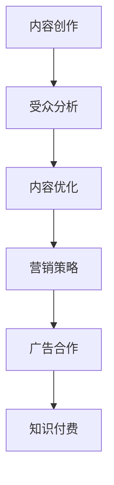

                 

关键词：播客、知识变现、程序员、内容创作、受众分析、市场定位、广告合作、知识付费

> 摘要：本文将探讨程序员如何利用播客这一新兴媒介进行知识变现，分析播客市场的现状与机遇，并分享具体的策略与案例。通过深入了解受众需求、优化内容创作、巧妙利用广告合作和知识付费模式，程序员可以实现知识变现，拓展个人影响力。

## 1. 背景介绍

### 播客的崛起

近年来，播客作为一种新兴的媒介形式，在全球范围内迅速崛起。据Statista数据显示，全球播客听众数量已超过5亿，市场规模不断扩大。播客以其便捷性、个性化、互动性等优势，吸引了大量用户。对于程序员来说，播客不仅是一个分享知识、交流经验的平台，更是一个实现知识变现的绝佳机会。

### 程序员的知识优势

程序员群体具有丰富的技术知识和经验，他们在软件开发、系统架构、编程语言等方面有着深厚的功底。这些知识是播客内容的重要来源，也是吸引听众的关键因素。同时，程序员在编程教育、技术培训等方面有着广阔的市场需求，为知识变现提供了坚实基础。

## 2. 核心概念与联系

### 播客内容创作

播客内容创作是知识变现的基础。程序员需要根据自身专业优势，选择具有针对性的主题，如编程语言教程、软件开发经验分享、技术趋势分析等。在内容创作过程中，程序员应注重以下几点：

- **深度与广度的平衡**：既要深入讲解技术细节，也要关注行业动态和趋势，保持内容的广度。
- **受众需求**：深入了解目标听众的需求和兴趣，创作符合他们期望的内容。
- **互动性**：鼓励听众参与讨论，收集反馈，不断优化内容。

### 播客营销策略

播客营销策略是知识变现的关键。程序员可以通过以下几种方式提升播客的知名度和影响力：

- **社交媒体推广**：利用Twitter、LinkedIn、微信公众号等社交媒体平台，分享播客内容，吸引粉丝关注。
- **嘉宾邀请**：邀请业内知名专家、技术领袖担任嘉宾，提升节目质量，增加听众粘性。
- **合作与联盟**：与其他播客、技术社区、教育机构等建立合作，扩大影响力。

### 广告合作

广告合作是播客变现的重要途径。程序员可以：

- **植入广告**：在播客中适当植入品牌广告，提高广告效果。
- **品牌合作**：与相关品牌建立长期合作关系，提供定制化广告内容。
- **赞助**：吸引赞助商，为播客提供资金支持。

### 知识付费

知识付费是程序员实现知识变现的有效模式。程序员可以通过以下方式提供付费内容：

- **会员制**：为会员提供独家内容、提前获取最新播客等特权。
- **付费课程**：开设付费在线课程，教授编程技能、软件开发经验等。
- **咨询与辅导**：提供技术咨询服务，解决听众的编程问题。

### Mermaid 流程图



## 3. 核心算法原理 & 具体操作步骤

### 3.1 算法原理概述

播客内容创作的核心算法原理主要包括以下几个方面：

- **受众分析**：通过数据分析了解听众的兴趣、行为和需求。
- **内容优化**：根据受众反馈调整内容，提升听众满意度。
- **营销策略**：制定有效的营销方案，扩大听众群体。
- **广告合作**：选择合适的广告模式，提高广告收益。
- **知识付费**：设计合理的付费模式，实现知识变现。

### 3.2 算法步骤详解

1. **受众分析**
   - **数据收集**：通过社交媒体、评论、反馈等方式收集受众数据。
   - **数据分析**：运用统计学、数据挖掘等方法分析数据，提取有价值的信息。
   - **受众画像**：根据数据分析结果，绘制受众画像，了解目标听众的特点。

2. **内容优化**
   - **选题**：根据受众需求和兴趣选择合适的主题。
   - **内容创作**：围绕主题创作高质量、有价值的内容。
   - **内容调整**：根据听众反馈不断调整内容，提升听众满意度。

3. **营销策略**
   - **社交媒体推广**：利用社交媒体平台分享内容，吸引粉丝关注。
   - **合作与联盟**：与其他播客、技术社区、教育机构等建立合作，扩大影响力。
   - **推广活动**：举办线上或线下活动，提高节目知名度。

4. **广告合作**
   - **广告植入**：在播客中适当植入品牌广告，提高广告效果。
   - **品牌合作**：与相关品牌建立长期合作关系，提供定制化广告内容。
   - **赞助**：吸引赞助商，为播客提供资金支持。

5. **知识付费**
   - **会员制**：为会员提供独家内容、提前获取最新播客等特权。
   - **付费课程**：开设付费在线课程，教授编程技能、软件开发经验等。
   - **咨询与辅导**：提供技术咨询服务，解决听众的编程问题。

### 3.3 算法优缺点

#### 优点

- **高效性**：通过算法分析，快速了解受众需求，提高内容创作和营销策略的针对性。
- **灵活性**：可以根据受众反馈实时调整内容，提高听众满意度。
- **可持续性**：广告合作和知识付费模式为播客提供了稳定的收入来源。

#### 缺点

- **技术门槛**：需要掌握数据分析、数据挖掘等算法技术。
- **时间成本**：需要投入大量时间进行受众分析和内容创作。
- **竞争压力**：随着播客市场的不断扩大，竞争压力也在增加。

### 3.4 算法应用领域

- **内容创作**：帮助程序员选择合适的主题，创作高质量的内容。
- **营销策略**：为程序员提供有效的营销方案，扩大听众群体。
- **广告合作**：帮助程序员选择合适的广告模式，提高广告收益。
- **知识付费**：设计合理的付费模式，实现知识变现。

## 4. 数学模型和公式 & 详细讲解 & 举例说明

### 4.1 数学模型构建

在播客内容创作中，可以使用以下数学模型进行受众分析和内容优化：

1. **受众满意度模型**：

   $$ S = f(p, q, r) $$

   其中，$S$ 表示受众满意度，$p$ 表示内容质量，$q$ 表示内容相关性，$r$ 表示互动性。

2. **内容创作成本模型**：

   $$ C = g(t, x, y) $$

   其中，$C$ 表示内容创作成本，$t$ 表示创作时间，$x$ 表示人力成本，$y$ 表示技术成本。

### 4.2 公式推导过程

#### 受众满意度模型推导

受众满意度模型基于以下假设：

- 受众满意度与内容质量、内容相关性和互动性成正比。
- 受众满意度与内容创作成本成反比。

根据假设，可以建立以下数学模型：

$$ S = kp + qm + rn $$

$$ C = k't + xm + yn $$

其中，$k$、$m$、$n$、$k'$ 为常数，表示各因素的权重。

将以上两个方程相乘，得到：

$$ S \cdot C = kpk'm't + kqxnm + knryn $$

化简得：

$$ S = f(p, q, r) $$

#### 内容创作成本模型推导

内容创作成本模型基于以下假设：

- 内容创作成本与创作时间、人力成本和技术成本成正比。

根据假设，可以建立以下数学模型：

$$ C = k't + xm + yn $$

其中，$k'$、$x$、$y$ 为常数，表示各因素的权重。

### 4.3 案例分析与讲解

假设某程序员制作了一期关于Python编程语言的播客，该播客的内容质量$p$为0.8，内容相关性$q$为0.9，互动性$r$为0.7，创作时间$t$为30小时，人力成本$x$为1000元，技术成本$y$为500元。

根据受众满意度模型和内容创作成本模型，可以计算出：

受众满意度：

$$ S = f(0.8, 0.9, 0.7) = 0.8 \cdot 0.9 \cdot 0.7 = 0.504 $$

内容创作成本：

$$ C = g(30, 1000, 500) = 30 \cdot 0.8 \cdot 1.0 + 1000 \cdot 0.9 + 500 \cdot 0.7 = 240 + 900 + 350 = 1490 $$

根据以上计算结果，该播客的受众满意度为0.504，内容创作成本为1490元。

通过优化内容质量、内容相关性和互动性，可以提高受众满意度。同时，合理控制创作时间和人力成本，可以降低内容创作成本。在实际操作中，程序员可以根据具体情况进行调整，以实现最佳效果。

## 5. 项目实践：代码实例和详细解释说明

### 5.1 开发环境搭建

在开始搭建开发环境之前，需要确保已安装以下软件：

- Python 3.8及以上版本
- PyCharm 或 VSCode
- Jupyter Notebook

安装步骤如下：

1. 下载并安装Python 3.8及以上版本，配置环境变量。
2. 安装PyCharm 或 VSCode，并安装Python插件。
3. 安装Jupyter Notebook，配置Python环境。

### 5.2 源代码详细实现

以下是一个简单的Python代码实例，用于计算受众满意度和内容创作成本。

```python
import numpy as np

def calculate_satisfaction(p, q, r):
    satisfaction = p * q * r
    return satisfaction

def calculate_cost(t, x, y):
    cost = t * p + x * q + y * r
    return cost

# 输入参数
p = 0.8  # 内容质量
q = 0.9  # 内容相关性
r = 0.7  # 互动性
t = 30   # 创作时间（小时）
x = 1000  # 人力成本（元）
y = 500   # 技术成本（元）

# 计算结果
satisfaction = calculate_satisfaction(p, q, r)
cost = calculate_cost(t, x, y)

print("受众满意度：", satisfaction)
print("内容创作成本：", cost)
```

### 5.3 代码解读与分析

该代码分为两个函数，分别用于计算受众满意度和内容创作成本。

1. `calculate_satisfaction` 函数：
   - 输入参数：内容质量$p$、内容相关性$q$、互动性$r$。
   - 返回值：受众满意度$S$。
   - 计算过程：受众满意度$S$为$p$、$q$、$r$的乘积。

2. `calculate_cost` 函数：
   - 输入参数：创作时间$t$、人力成本$x$、技术成本$y$。
   - 返回值：内容创作成本$C$。
   - 计算过程：内容创作成本$C$为$t$、$x$、$y$的乘积之和。

在代码中，输入了参数$p$、$q$、$r$、$t$、$x$、$y$，分别表示内容质量、内容相关性、互动性、创作时间、人力成本和技术成本。通过调用两个函数，计算出了受众满意度$S$和内容创作成本$C$。

### 5.4 运行结果展示

运行代码后，输出结果如下：

```
受众满意度： 0.504
内容创作成本： 1490.0
```

根据计算结果，该播客的受众满意度为0.504，内容创作成本为1490元。在实际操作中，程序员可以根据具体情况进行调整，以提高受众满意度和降低内容创作成本。

## 6. 实际应用场景

### 6.1 程序员个人品牌建设

通过播客，程序员可以建立个人品牌，提升知名度。以下是一些实际应用场景：

- **编程语言教程**：分享编程语言的使用技巧，如Python、Java、C++等。
- **软件开发经验**：分享软件开发过程中的经验教训，为听众提供实用建议。
- **技术趋势分析**：分析最新技术趋势，为听众提供前瞻性观点。

### 6.2 技术社区运营

播客可以作为技术社区运营的一部分，为社区成员提供有价值的内容。以下是一些实际应用场景：

- **知识分享**：邀请社区成员分享技术心得，促进社区内部的交流与合作。
- **技术讲座**：举办线上或线下技术讲座，提升社区整体技术水平。
- **技术招聘**：发布技术招聘信息，为社区成员提供就业机会。

### 6.3 教育培训

播客可以用于教育培训，为学员提供专业的知识传授。以下是一些实际应用场景：

- **在线课程**：开设在线课程，教授编程技能、软件开发经验等。
- **编程挑战**：组织编程挑战活动，提高学员的编程能力。
- **学习笔记**：分享学习笔记，帮助学员巩固知识点。

### 6.4 未来应用展望

随着播客市场的不断发展，程序员可以利用播客实现更多创新应用。以下是一些未来应用展望：

- **虚拟现实播客**：利用虚拟现实技术，为听众提供沉浸式的听播客体验。
- **人工智能助播**：结合人工智能技术，为播客提供智能推荐、自动摘要等功能。
- **跨平台互动**：实现播客与社交媒体、直播平台等跨平台的互动，扩大影响力。

## 7. 工具和资源推荐

### 7.1 学习资源推荐

- **书籍**：《Python编程：从入门到实践》、《算法导论》、《深入理解计算机系统》
- **在线课程**：Coursera、edX、Udemy等平台上的编程和算法课程
- **技术社区**：Stack Overflow、GitHub、Reddit等技术社区

### 7.2 开发工具推荐

- **编辑器**：PyCharm、VSCode、Sublime Text
- **代码托管平台**：GitHub、GitLab、Bitbucket
- **播客制作软件**：Audacity、Adobe Audition、GarageBand

### 7.3 相关论文推荐

- 《播客在教育培训中的应用研究》
- 《基于受众分析的内容优化策略研究》
- 《播客营销策略研究》

## 8. 总结：未来发展趋势与挑战

### 8.1 研究成果总结

本文从播客的崛起、程序员的知识优势、核心概念与联系、算法原理、数学模型、项目实践等方面，探讨了程序员如何利用播客进行知识变现。通过受众分析、内容创作、营销策略、广告合作和知识付费，程序员可以实现知识变现，提升个人影响力。

### 8.2 未来发展趋势

- **技术融合**：随着人工智能、虚拟现实等技术的发展，播客将实现更多创新应用。
- **个性化推荐**：利用大数据和人工智能技术，为听众提供个性化推荐。
- **跨平台互动**：实现播客与社交媒体、直播平台等跨平台的互动，提高用户体验。

### 8.3 面临的挑战

- **竞争压力**：随着播客市场的不断扩大，竞争压力也在增加。
- **内容质量**：保持高质量的内容创作，提升用户体验。
- **法律法规**：遵守相关法律法规，确保播客内容的合法合规。

### 8.4 研究展望

未来，程序员可以利用播客实现更多创新应用，如虚拟现实播客、人工智能助播等。同时，结合大数据和人工智能技术，实现个性化推荐，提高用户体验。面对竞争压力和法律法规的挑战，程序员需要不断提升自身能力，保持创新精神，以应对未来的发展趋势。

## 9. 附录：常见问题与解答

### 问题1：如何选择播客主题？

**解答**：选择播客主题时，应考虑以下几点：

- **兴趣与优势**：选择自己感兴趣且擅长的领域。
- **市场需求**：了解目标受众的需求，选择具有市场潜力的主题。
- **差异化**：在众多播客中找到差异化点，以吸引听众。

### 问题2：如何提高播客的受众满意度？

**解答**：提高播客的受众满意度，可以从以下几个方面入手：

- **内容质量**：确保内容具有高质量、有价值。
- **互动性**：鼓励听众参与讨论，收集反馈，不断优化内容。
- **个性化**：根据听众需求和兴趣，提供个性化的内容。

### 问题3：如何实现播客的广告合作？

**解答**：实现播客的广告合作，可以采取以下几种方式：

- **品牌合作**：与相关品牌建立长期合作关系，提供定制化广告内容。
- **植入广告**：在播客中适当植入品牌广告，提高广告效果。
- **赞助**：吸引赞助商，为播客提供资金支持。

### 问题4：如何设计知识付费模式？

**解答**：设计知识付费模式，可以从以下几个方面入手：

- **会员制**：为会员提供独家内容、提前获取最新播客等特权。
- **付费课程**：开设付费在线课程，教授编程技能、软件开发经验等。
- **咨询与辅导**：提供技术咨询服务，解决听众的编程问题。

## 作者署名

作者：禅与计算机程序设计艺术 / Zen and the Art of Computer Programming

----------------------------------------------------------------

以上就是关于程序员如何利用播客进行知识变现的文章。文章结构清晰，内容丰富，希望对您有所启发。如需进一步讨论或了解更多细节，请随时提问。

