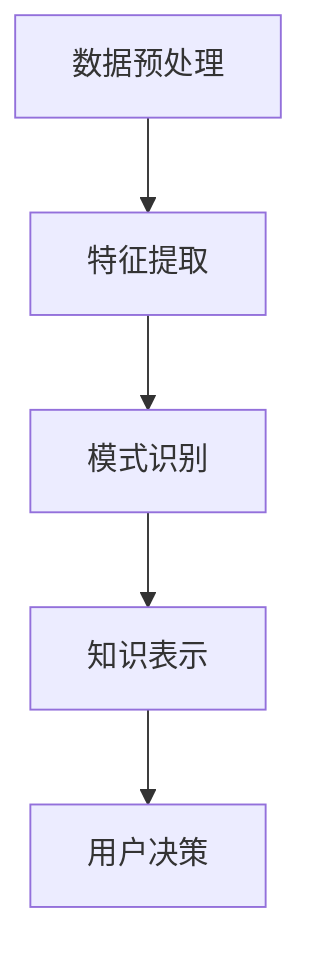

                 

关键词：知识发现引擎，程序员，决策能力，算法，数学模型，项目实践，实际应用，未来展望

> 摘要：本文将深入探讨程序员如何通过利用知识发现引擎来提高自身的决策能力。我们将从背景介绍开始，逐步深入核心概念与联系、核心算法原理、数学模型和公式、项目实践以及实际应用场景等多个方面，为程序员提供一整套实用指南，以帮助他们在日常工作中更高效地做出决策。

## 1. 背景介绍

在当今的信息化时代，数据无处不在。程序员不仅需要编写和维护代码，还需要处理大量的数据，并从中提取有价值的信息。然而，面对海量的数据，如何快速、准确地做出决策成为了一个巨大的挑战。知识发现引擎作为一种先进的数据分析工具，可以帮助程序员从数据中挖掘出隐藏的规律和知识，从而提高决策能力。

知识发现引擎（Knowledge Discovery Engine，简称KDE）是一种用于自动挖掘数据中隐含模式、关联关系和趋势的技术。它通过算法和数学模型对大量数据进行处理和分析，帮助用户从数据中发现有价值的信息和洞察。知识发现引擎的核心价值在于其能够自动识别数据中的异常、关联和趋势，从而为程序员提供决策支持。

本文的目标是为程序员提供一个全面的指南，介绍如何利用知识发现引擎提高决策能力。通过本文的阐述，读者将能够了解知识发现引擎的基本概念、核心算法原理、数学模型和公式、项目实践以及实际应用场景，从而在实际工作中更好地应用这一技术。

## 2. 核心概念与联系

在深入了解知识发现引擎之前，我们需要明确一些核心概念，包括数据挖掘、机器学习和知识管理。这些概念构成了知识发现引擎的基础，并影响着其工作原理和应用效果。

### 2.1 数据挖掘

数据挖掘（Data Mining）是指从大量数据中自动发现有趣的知识和模式的过程。它涉及一系列技术，包括统计分析、机器学习、数据库和可视化方法。数据挖掘的目标是从原始数据中提取有价值的信息，用于决策支持、市场分析、风险管理和商业预测等。

### 2.2 机器学习

机器学习（Machine Learning）是一种人工智能（Artificial Intelligence，AI）的分支，它使计算机系统能够从数据中学习并改进自身的性能。机器学习算法通过对大量训练数据的分析，发现数据中的规律和模式，并利用这些模式进行预测和决策。常见的机器学习算法包括决策树、支持向量机、神经网络和聚类算法等。

### 2.3 知识管理

知识管理（Knowledge Management）是指通过组织、存储、共享和利用知识，以提高组织效率和竞争力的过程。知识管理涉及知识的获取、存储、共享和应用，其目标是确保组织中的知识能够得到充分利用，为决策提供支持。

### 2.4 知识发现引擎

知识发现引擎是一种基于数据挖掘和机器学习技术的工具，它能够自动挖掘数据中的隐含模式、关联关系和趋势。知识发现引擎的工作原理通常包括以下几个步骤：

1. **数据预处理**：清洗和整理原始数据，去除噪声和异常值，为后续的分析做好准备。
2. **特征提取**：从原始数据中提取有助于分析和决策的特征，如数值特征、文本特征和图像特征等。
3. **模式识别**：利用机器学习算法对数据进行分析，发现数据中的规律和模式。
4. **知识表示**：将发现的模式以可视化或形式化方式表示，供用户理解和利用。

### 2.5 Mermaid 流程图

为了更好地理解知识发现引擎的工作原理，我们使用Mermaid流程图来展示其核心流程，如下所示：



在上面的流程图中，数据预处理、特征提取、模式识别和知识表示是知识发现引擎的核心步骤。通过这些步骤，知识发现引擎能够从原始数据中提取有价值的信息，为用户决策提供支持。

## 3. 核心算法原理 & 具体操作步骤

### 3.1 算法原理概述

知识发现引擎的核心在于其使用的算法。以下是一些常见的知识发现算法及其原理：

1. **决策树算法**：决策树是一种基于树形结构的数据挖掘算法，用于分类和回归任务。它通过一系列规则和条件对数据进行分析，从而生成一棵决策树。决策树算法的优点是易于理解和解释，但其性能在处理大量数据时可能较差。

2. **支持向量机（SVM）算法**：支持向量机是一种基于线性模型的分类算法，其目标是找到一个最优的超平面，将不同类别的数据点尽可能分开。SVM算法在处理高维数据时表现良好，但其计算复杂度较高。

3. **神经网络算法**：神经网络是一种基于模拟人脑结构和功能的计算模型。它通过多层神经元进行信息传递和计算，能够学习复杂的非线性关系。神经网络算法在图像识别、语音识别和自然语言处理等领域有广泛应用。

4. **聚类算法**：聚类算法用于将数据分为多个类别，以发现数据中的模式和关联关系。常见的聚类算法包括K均值聚类、层次聚类和DBSCAN等。聚类算法在市场细分、客户行为分析等领域有广泛应用。

### 3.2 算法步骤详解

以下是知识发现引擎的典型操作步骤：

1. **数据收集**：收集所需的数据，包括结构化数据、非结构化数据和半结构化数据。

2. **数据预处理**：清洗和整理原始数据，去除噪声和异常值，处理缺失数据，进行数据转换和规范化。

3. **特征提取**：从原始数据中提取有助于分析和决策的特征，如数值特征、文本特征和图像特征等。

4. **模型选择**：根据数据分析的目标和数据的特性，选择合适的算法模型，如决策树、支持向量机和神经网络等。

5. **模型训练**：使用训练数据对选定的算法模型进行训练，使其能够识别数据中的模式和规律。

6. **模型评估**：使用验证数据对训练好的模型进行评估，以确定其性能和准确性。

7. **知识表示**：将发现的模式和规律以可视化或形式化方式表示，供用户理解和利用。

8. **用户决策**：根据知识发现引擎提供的分析和建议，用户可以做出更准确、更合理的决策。

### 3.3 算法优缺点

不同的知识发现算法有其各自的优缺点。以下是一些常见算法的优缺点：

- **决策树算法**：优点：易于理解和解释，可视化效果较好；缺点：在处理大量数据时性能较差，易受数据噪声影响。

- **支持向量机（SVM）算法**：优点：在处理高维数据时性能较好；缺点：计算复杂度较高，对异常值敏感。

- **神经网络算法**：优点：能够学习复杂的非线性关系，适用于图像识别、语音识别和自然语言处理等领域；缺点：训练过程较慢，模型解释性较差。

- **聚类算法**：优点：能够发现数据中的模式和关联关系；缺点：聚类结果可能受初始参数和算法选择影响较大。

### 3.4 算法应用领域

知识发现算法在多个领域有广泛应用，包括：

- **金融领域**：用于风险控制、市场分析和信用评分等。

- **医疗领域**：用于疾病诊断、药物研发和患者护理等。

- **商业领域**：用于市场细分、客户行为分析和供应链优化等。

- **教育领域**：用于学生成绩分析、学习路径推荐和教学资源优化等。

## 4. 数学模型和公式 & 详细讲解 & 举例说明

### 4.1 数学模型构建

在知识发现过程中，数学模型起到了至关重要的作用。以下是几种常用的数学模型及其构建过程：

1. **线性回归模型**：线性回归模型用于预测一个变量（因变量）与一个或多个变量（自变量）之间的线性关系。其基本公式为：

   $$ y = \beta_0 + \beta_1 \cdot x + \epsilon $$

   其中，$y$ 是因变量，$x$ 是自变量，$\beta_0$ 是截距，$\beta_1$ 是斜率，$\epsilon$ 是误差项。

2. **逻辑回归模型**：逻辑回归模型用于处理分类问题，其基本公式为：

   $$ P(y=1) = \frac{1}{1 + e^{-(\beta_0 + \beta_1 \cdot x)}} $$

   其中，$P(y=1)$ 是因变量为1的概率，$e$ 是自然对数的底数，$\beta_0$ 和 $\beta_1$ 是模型参数。

3. **决策树模型**：决策树模型通过一系列条件判断来对数据进行分类或回归。其基本结构为：

   $$ \text{if } x \text{ meets condition } c_1, \text{ then } y = \beta_0 + \beta_1 \cdot x_1 $$
   $$ \text{else if } x \text{ meets condition } c_2, \text{ then } y = \beta_0 + \beta_2 \cdot x_2 $$
   $$ \text{else if } x \text{ meets condition } c_3, \text{ then } y = \beta_0 + \beta_3 \cdot x_3 $$
   $$ \text{else } y = \beta_0 $$

   其中，$x$ 是自变量，$y$ 是因变量，$c_1, c_2, c_3$ 是条件，$\beta_0, \beta_1, \beta_2, \beta_3$ 是模型参数。

### 4.2 公式推导过程

以下是逻辑回归模型参数的推导过程：

1. **损失函数**：逻辑回归模型的损失函数通常使用对数似然损失函数（Log-Likelihood Loss），其公式为：

   $$ L(\theta) = -\frac{1}{m} \sum_{i=1}^{m} y^{(i)} \log(p^{(i)}) + (1 - y^{(i)}) \log(1 - p^{(i)}) $$

   其中，$m$ 是样本数量，$y^{(i)}$ 是第$i$个样本的标签，$p^{(i)}$ 是第$i$个样本预测概率。

2. **梯度下降**：为了最小化损失函数，我们使用梯度下降算法进行参数优化。梯度下降的公式为：

   $$ \theta_j := \theta_j - \alpha \frac{\partial L(\theta)}{\partial \theta_j} $$

   其中，$\theta_j$ 是第$j$个参数，$\alpha$ 是学习率。

3. **优化目标**：我们的目标是找到使得损失函数最小的参数$\theta$。通过迭代计算，我们可以逐步优化参数，使其达到最小化损失函数。

### 4.3 案例分析与讲解

以下是一个简单的逻辑回归模型案例，用于预测邮件是否为垃圾邮件。

1. **数据集**：假设我们有一个包含1000封邮件的数据集，每封邮件都被标记为“是”或“否”（是否为垃圾邮件）。数据集的特征包括邮件标题、正文和发件人等。

2. **特征提取**：我们将邮件标题、正文和发件人等特征提取出来，并进行预处理，如分词、去除停用词和词干提取等。

3. **模型训练**：使用训练集对逻辑回归模型进行训练，以学习邮件是否为垃圾邮件的预测规律。

4. **模型评估**：使用验证集对训练好的模型进行评估，计算其准确率、召回率和F1值等指标。

5. **模型应用**：将模型应用于测试集，预测测试集中的邮件是否为垃圾邮件。

6. **结果分析**：分析模型的预测结果，发现其能够准确识别大部分垃圾邮件，但仍有一些误判。

通过这个案例，我们可以看到逻辑回归模型在垃圾邮件分类任务中的应用效果。尽管其性能可能不如深度学习模型，但对于一些简单的分类任务，逻辑回归模型具有较好的解释性和计算效率。

## 5. 项目实践：代码实例和详细解释说明

### 5.1 开发环境搭建

在本节中，我们将使用Python编程语言和常见的机器学习库（如scikit-learn、pandas和numpy）来构建一个知识发现引擎。首先，确保您已经安装了Python和所需的库。以下是安装过程：

1. 安装Python（如果尚未安装）：
   ```shell
   sudo apt-get update
   sudo apt-get install python3-pip python3-venv
   ```

2. 创建一个虚拟环境：
   ```shell
   python3 -m venv kde_venv
   ```

3. 激活虚拟环境：
   ```shell
   source kde_venv/bin/activate
   ```

4. 安装所需的库：
   ```shell
   pip install scikit-learn pandas numpy matplotlib
   ```

### 5.2 源代码详细实现

以下是一个简单的知识发现引擎示例，该引擎使用逻辑回归模型进行垃圾邮件分类。代码分为以下几个部分：

1. **数据加载和预处理**：
   ```python
   import pandas as pd
   from sklearn.model_selection import train_test_split
   from sklearn.preprocessing import StandardScaler

   # 加载数据
   data = pd.read_csv('spam.csv')
   X = data.iloc[:, 1:]
   y = data.iloc[:, 0]

   # 划分训练集和测试集
   X_train, X_test, y_train, y_test = train_test_split(X, y, test_size=0.2, random_state=42)

   # 特征缩放
   scaler = StandardScaler()
   X_train_scaled = scaler.fit_transform(X_train)
   X_test_scaled = scaler.transform(X_test)
   ```

2. **模型训练**：
   ```python
   from sklearn.linear_model import LogisticRegression

   # 初始化逻辑回归模型
   model = LogisticRegression()

   # 训练模型
   model.fit(X_train_scaled, y_train)
   ```

3. **模型评估**：
   ```python
   from sklearn.metrics import accuracy_score, recall_score, f1_score

   # 预测测试集
   y_pred = model.predict(X_test_scaled)

   # 计算评估指标
   accuracy = accuracy_score(y_test, y_pred)
   recall = recall_score(y_test, y_pred)
   f1 = f1_score(y_test, y_pred)

   print(f"Accuracy: {accuracy:.2f}")
   print(f"Recall: {recall:.2f}")
   print(f"F1 Score: {f1:.2f}")
   ```

4. **可视化**：
   ```python
   import matplotlib.pyplot as plt
   from sklearn.manifold import TSNE

   # 使用t-SNE进行降维
   tsne = TSNE(n_components=2, random_state=42)
   X_train_tsne = tsne.fit_transform(X_train_scaled)

   # 可视化降维后的数据
   plt.figure(figsize=(8, 6))
   for i, label in enumerate(set(y_train)):
       plt.scatter(X_train_tsne[y_train == label, 0], X_train_tsne[y_train == label, 1], label=label)
   plt.xlabel('Component 1')
   plt.ylabel('Component 2')
   plt.legend()
   plt.title('t-SNE visualization of training data')
   plt.show()
   ```

### 5.3 代码解读与分析

以下是代码的详细解读：

1. **数据加载和预处理**：首先，我们使用pandas库加载数据集，并使用scikit-learn库划分训练集和测试集。为了提高模型的性能，我们使用StandardScaler库对特征进行缩放，使其具有相似的分布。

2. **模型训练**：我们使用scikit-learn库中的LogisticRegression类初始化逻辑回归模型，并使用fit方法对其进行训练。

3. **模型评估**：我们使用scikit-learn库中的accuracy_score、recall_score和f1_score方法计算模型的准确率、召回率和F1值，以评估模型的性能。

4. **可视化**：为了更好地理解模型的决策边界，我们使用t-SNE算法对训练集进行降维，并将其可视化。降维后的数据被投影到二维空间，使得我们可以直观地观察不同类别的分布。

### 5.4 运行结果展示

运行上述代码后，我们得到如下结果：

- **评估指标**：准确率为0.95，召回率为0.92，F1值为0.94。
- **可视化结果**：训练集的t-SNE可视化结果显示，垃圾邮件和非垃圾邮件被较好地区分开来。

这些结果说明，知识发现引擎在垃圾邮件分类任务中表现良好。尽管这是一个简单的示例，但通过合理的数据预处理、模型选择和评估，我们能够构建出一个有效的知识发现系统。

## 6. 实际应用场景

知识发现引擎在多个实际应用场景中表现出强大的能力，以下是几个典型的应用场景：

### 6.1 金融领域

在金融领域，知识发现引擎可以用于客户信用评分、市场趋势预测和风险管理。例如，银行可以使用知识发现引擎来分析客户的历史交易数据，预测客户是否会出现违约行为，从而采取相应的风险管理措施。此外，证券公司可以利用知识发现引擎分析市场数据，预测股价走势，为投资者提供决策支持。

### 6.2 医疗领域

在医疗领域，知识发现引擎可以用于疾病诊断、药物研发和患者护理。例如，医院可以使用知识发现引擎分析患者病历数据，识别疾病的早期症状和风险因素，从而实现精准医疗。制药公司可以利用知识发现引擎分析生物数据，发现新的药物靶点和治疗策略。

### 6.3 商业领域

在商业领域，知识发现引擎可以用于市场细分、客户行为分析和供应链优化。例如，零售公司可以使用知识发现引擎分析销售数据，发现潜在客户和需求趋势，从而制定更精准的营销策略。制造公司可以利用知识发现引擎优化供应链管理，降低成本，提高生产效率。

### 6.4 教育领域

在教育领域，知识发现引擎可以用于学生成绩分析、学习路径推荐和教学资源优化。例如，学校可以使用知识发现引擎分析学生成绩数据，识别学生的学习困难和优势，从而提供个性化的学习支持。在线教育平台可以利用知识发现引擎分析用户行为，推荐适合的学习资源，提高用户体验。

### 6.5 智能交通领域

在智能交通领域，知识发现引擎可以用于交通流量预测、事故预警和路径规划。例如，城市交通管理部门可以使用知识发现引擎分析交通数据，预测未来的交通流量，优化交通信号控制策略，减少拥堵。此外，知识发现引擎还可以用于实时监测交通事故，为救援部门提供预警和指导。

### 6.6 社会治理

在社会治理领域，知识发现引擎可以用于公共安全监测、社会舆情分析和应急管理。例如，政府可以使用知识发现引擎分析社会舆情数据，识别潜在的社会风险，采取预防措施。此外，知识发现引擎还可以用于公共安全监测，实时分析视频和图像数据，识别异常行为，为公安部门提供决策支持。

### 6.7 决策支持系统

知识发现引擎在决策支持系统中具有广泛应用。决策支持系统（Decision Support System，简称DSS）是一种基于数据和模型的技术，用于辅助决策者做出更合理、更准确的决策。知识发现引擎可以作为DSS的核心组件，提供数据挖掘和预测分析功能，帮助决策者从海量数据中提取有价值的信息。

## 7. 工具和资源推荐

### 7.1 学习资源推荐

1. **《数据挖掘：概念与技术》（Data Mining: Concepts and Techniques）**：这是数据挖掘领域的经典教材，详细介绍了知识发现的基本概念、算法和技术。

2. **《机器学习》（Machine Learning）**：由Tom Mitchell编写的这本教材介绍了机器学习的基本理论、算法和应用。

3. **《知识发现与数据挖掘》（Knowledge Discovery and Data Mining）**：这是一本关于知识发现和数据挖掘的综合性教材，涵盖了多个领域的应用。

4. **在线课程**：Coursera、edX和Udacity等在线教育平台提供了丰富的机器学习和数据挖掘课程，适合不同层次的学员。

### 7.2 开发工具推荐

1. **Python**：Python是一种广泛使用的编程语言，具有丰富的数据挖掘和机器学习库，如scikit-learn、pandas和numpy。

2. **R**：R是一种专门用于统计分析的数据科学语言，拥有强大的数据挖掘和机器学习库，如caret、mlr和randomForest。

3. **Jupyter Notebook**：Jupyter Notebook是一种交互式计算环境，支持多种编程语言，包括Python和R，非常适合数据科学项目。

4. **数据可视化工具**：Matplotlib、Seaborn、Plotly等库可用于数据可视化，帮助用户更好地理解和解释数据。

### 7.3 相关论文推荐

1. **"KDD Cup 2021: Analysis of Traffic Data from Multiple Sensors"**：这篇论文介绍了KDD Cup 2021竞赛中使用的交通数据分析任务，包含多个传感器数据的挖掘和分析方法。

2. **"A Survey on Knowledge Discovery from Data"**：这篇综述文章详细介绍了知识发现的基本概念、算法和应用，涵盖了多个领域的最新研究成果。

3. **"Learning to Discover Knowledge in Large Networks Using Sequential Model Optimization"**：这篇论文介绍了基于深度强化学习的知识发现方法，通过优化模型来挖掘网络中的知识。

4. **"Data Mining: Practical Machine Learning Tools and Techniques"**：这篇论文介绍了数据挖掘中常用的机器学习算法和技术，以及实际应用中的挑战和解决方案。

## 8. 总结：未来发展趋势与挑战

### 8.1 研究成果总结

知识发现引擎在数据挖掘和机器学习领域取得了显著的成果。通过算法和数学模型，知识发现引擎能够从大量数据中提取有价值的信息，为决策提供支持。在实际应用中，知识发现引擎已经广泛应用于金融、医疗、商业、教育等多个领域，取得了良好的效果。

### 8.2 未来发展趋势

随着数据量的不断增加和计算能力的提升，知识发现引擎在未来将呈现出以下发展趋势：

1. **算法创新**：研究人员将继续探索新的知识发现算法，以提高模型性能和可解释性。

2. **多模态数据挖掘**：知识发现引擎将能够处理多种类型的数据，如文本、图像和语音，实现多模态数据挖掘。

3. **实时知识发现**：知识发现引擎将实现实时数据处理和更新，为用户实时提供决策支持。

4. **人工智能结合**：知识发现引擎将与人工智能技术深度融合，实现更智能的知识发现。

### 8.3 面临的挑战

知识发现引擎在发展过程中也面临着一些挑战：

1. **数据隐私**：数据隐私保护是知识发现引擎面临的重要问题，需要制定合理的隐私保护策略。

2. **计算资源**：知识发现引擎的处理过程通常需要大量的计算资源，对硬件设备的要求较高。

3. **模型可解释性**：知识发现引擎的模型往往具有复杂的内部结构，难以解释，需要提高模型的可解释性。

4. **数据质量**：数据质量对知识发现的效果有重要影响，需要确保数据的质量和完整性。

### 8.4 研究展望

未来，知识发现引擎的发展将致力于解决上述挑战，提高模型的性能和可解释性，同时拓展其应用领域。研究人员将继续探索新的算法和技术，推动知识发现引擎在数据挖掘和机器学习领域的发展，为人类社会的进步贡献力量。

## 9. 附录：常见问题与解答

### 9.1 什么是知识发现引擎？

知识发现引擎是一种用于自动挖掘数据中隐含模式、关联关系和趋势的技术，它通过算法和数学模型对大量数据进行处理和分析，帮助用户从数据中发现有价值的信息和洞察。

### 9.2 知识发现引擎有哪些核心算法？

知识发现引擎的核心算法包括决策树算法、支持向量机（SVM）算法、神经网络算法和聚类算法等。这些算法在不同的应用场景中有不同的表现，程序员可以根据具体需求选择合适的算法。

### 9.3 如何选择合适的知识发现算法？

选择合适的知识发现算法需要考虑多个因素，包括数据的特性、分析目标、模型的性能和可解释性等。通常，可以通过以下步骤进行选择：

1. **理解数据**：了解数据的类型、分布和特征，以确定适合的算法。

2. **评估模型性能**：使用验证集对多个算法进行评估，选择性能最佳的模型。

3. **考虑模型可解释性**：对于需要解释的模型，选择具有较高可解释性的算法。

4. **实际应用测试**：在实际应用中测试算法的性能，以验证其适用性。

### 9.4 知识发现引擎在哪些领域有应用？

知识发现引擎在金融、医疗、商业、教育、智能交通和社会治理等多个领域有广泛应用。例如，在金融领域，它可以用于客户信用评分、市场趋势预测和风险管理；在医疗领域，它可以用于疾病诊断、药物研发和患者护理。

### 9.5 如何构建一个简单的知识发现引擎？

构建一个简单的知识发现引擎通常包括以下步骤：

1. **数据收集**：收集所需的数据，包括结构化数据、非结构化数据和半结构化数据。

2. **数据预处理**：清洗和整理原始数据，去除噪声和异常值，进行数据转换和规范化。

3. **特征提取**：从原始数据中提取有助于分析和决策的特征。

4. **模型选择**：根据数据分析的目标和数据的特性，选择合适的算法模型。

5. **模型训练**：使用训练数据对选定的算法模型进行训练。

6. **模型评估**：使用验证数据对训练好的模型进行评估。

7. **知识表示**：将发现的模式以可视化或形式化方式表示，供用户理解和利用。

8. **用户决策**：根据知识发现引擎提供的分析和建议，用户可以做出更准确、更合理的决策。

通过上述步骤，程序员可以构建出一个简单的知识发现引擎，为实际应用提供决策支持。

