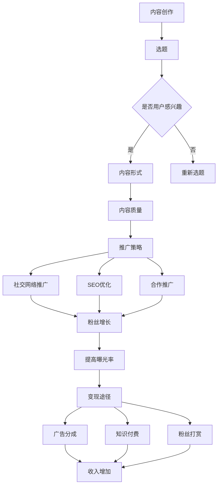

                 

在这个数字时代，内容创作和传播的门槛不断降低，许多程序员开始探索如何利用视频平台进行知识变现。视频号，作为微信生态中的一部分，提供了一个全新的知识分享和传播渠道。本文将深入探讨程序员如何利用视频号进行知识变现，包括平台特点、内容创作、推广策略以及潜在风险等方面。

## 关键词
- 程序员
- 视频号
- 知识变现
- 内容创作
- 推广策略

## 摘要
本文旨在为程序员提供一套利用视频号进行知识变现的实战指南。通过分析视频号平台的特点，探讨内容创作的最佳实践，分析推广策略，最后讨论可能面临的风险以及未来的发展机遇。

## 1. 背景介绍

随着互联网技术的飞速发展，社交媒体平台已经成为信息传播的重要渠道。微信，作为我国最流行的社交媒体平台之一，拥有庞大的用户基础。视频号，作为微信在短视频领域的战略布局，自推出以来，吸引了大量用户和创作者。对于程序员来说，视频号不仅提供了一个展示技术实力的平台，也为他们提供了新的知识变现途径。

### 1.1 视频号平台特点

视频号具有以下几个显著特点：

1. **广泛的用户基础**：微信拥有超过12亿的月活跃用户，视频号用户基数巨大，为内容传播提供了广阔的市场。
2. **丰富的互动功能**：视频号支持评论、点赞、分享等多种互动方式，有助于提升用户粘性。
3. **精准的算法推荐**：视频号通过大数据分析和机器学习算法，能够精准推荐用户感兴趣的内容，提高内容曝光率。
4. **多元化的变现途径**：视频号支持打赏、广告、知识付费等多种变现方式，为内容创作者提供了多样化的收入来源。

### 1.2 程序员的优势

程序员在利用视频号进行知识变现方面具有以下优势：

1. **技术背景**：程序员拥有丰富的技术知识，能够制作高质量的技术内容，吸引技术爱好者。
2. **编程能力**：程序员擅长利用编程工具和技术手段进行内容创作和优化，提高内容质量和用户体验。
3. **市场洞察力**：程序员对市场需求和用户行为有较强的洞察力，能够制作出符合用户需求的内容。

## 2. 核心概念与联系

在探讨程序员如何利用视频号进行知识变现之前，我们需要了解一些核心概念，包括内容创作、推广策略和变现途径。

### 2.1 内容创作

内容创作是知识变现的基础。程序员在创作视频内容时，应考虑以下几个方面：

1. **选题**：选择用户感兴趣的技术主题，如编程语言、框架、工具等。
2. **内容形式**：结合视频、图文、音频等多种形式，提高内容的吸引力和可读性。
3. **内容质量**：保证内容的准确性、完整性和实用性，提供真正的价值。

### 2.2 推广策略

推广策略是提高内容曝光率的关键。程序员可以采取以下策略：

1. **社交网络推广**：利用微博、知乎、博客等社交平台，分享视频号内容，吸引粉丝。
2. **SEO优化**：优化视频标题、描述和标签，提高在搜索引擎中的排名。
3. **合作推广**：与其他领域的内容创作者合作，互相推广，扩大影响力。

### 2.3 变现途径

视频号提供了多种变现途径，包括：

1. **广告分成**：通过在视频中插入广告，获得广告收入分成。
2. **知识付费**：提供付费课程、电子书、教程等，通过销售获得收入。
3. **粉丝打赏**：通过粉丝打赏，获得直接收入。

### 2.4 Mermaid 流程图

以下是程序员利用视频号进行知识变现的Mermaid流程图：



## 3. 核心算法原理 & 具体操作步骤

### 3.1 算法原理概述

在视频号进行知识变现的过程中，核心算法原理主要包括内容推荐算法、用户行为分析和变现策略优化。

1. **内容推荐算法**：通过机器学习算法，分析用户兴趣和行为，推荐用户感兴趣的内容。
2. **用户行为分析**：收集用户在视频号上的行为数据，如观看时长、点赞、评论等，分析用户偏好。
3. **变现策略优化**：根据用户行为数据和内容推荐结果，优化变现策略，提高收入。

### 3.2 算法步骤详解

1. **数据收集与预处理**：收集用户在视频号上的行为数据，如观看时长、点赞、评论等，进行数据清洗和预处理。
2. **特征工程**：提取用户行为数据中的特征，如用户活跃度、内容分类等。
3. **模型训练与评估**：使用机器学习算法，如决策树、随机森林等，训练推荐模型，并进行模型评估。
4. **内容推荐**：根据用户特征和模型预测结果，推荐用户感兴趣的内容。
5. **变现策略优化**：根据用户行为数据和内容推荐结果，优化广告、知识付费等变现策略。

### 3.3 算法优缺点

**优点**：

1. **提高内容曝光率**：通过精准推荐，提高用户对内容的兴趣，从而提高内容曝光率。
2. **优化变现策略**：根据用户行为数据，优化变现途径，提高收入。

**缺点**：

1. **数据隐私问题**：用户行为数据涉及到隐私问题，需要严格保护用户隐私。
2. **算法偏见**：算法可能存在偏见，导致推荐内容不公正。

### 3.4 算法应用领域

算法在视频号进行知识变现的应用领域包括：

1. **内容推荐**：通过推荐算法，提高用户对内容的兴趣，增加用户粘性。
2. **变现策略优化**：通过分析用户行为数据，优化广告、知识付费等变现策略，提高收入。

## 4. 数学模型和公式 & 详细讲解 & 举例说明

在视频号进行知识变现的过程中，数学模型和公式扮演着重要角色，它们能够帮助我们更好地理解用户行为、优化内容推荐和变现策略。

### 4.1 数学模型构建

**用户兴趣模型**：

设 \( U \) 为用户集合，\( I \) 为兴趣集合，\( u_i \) 表示用户 \( i \) 的兴趣，\( i \in U \)。

用户兴趣模型可以用以下数学模型表示：

$$
u_i = f(I, \theta_i)
$$

其中，\( \theta_i \) 为用户 \( i \) 的特征向量。

**内容推荐模型**：

设 \( C \) 为内容集合，\( c_j \) 表示内容 \( j \) 的特征向量，\( r_{ij} \) 表示用户 \( i \) 对内容 \( j \) 的兴趣度。

内容推荐模型可以用以下数学模型表示：

$$
r_{ij} = \sigma(W \cdot c_j + b)
$$

其中，\( W \) 为权重矩阵，\( b \) 为偏置项，\( \sigma \) 为激活函数。

### 4.2 公式推导过程

**用户兴趣模型推导**：

用户兴趣模型中的 \( u_i \) 表示用户 \( i \) 的兴趣度，可以通过以下步骤推导：

1. **特征提取**：从用户行为数据中提取特征，如观看时长、点赞数等。
2. **特征加权**：根据特征的重要性，对特征进行加权。
3. **特征合成**：将加权后的特征合成一个特征向量 \( \theta_i \)。
4. **函数映射**：将特征向量 \( \theta_i \) 映射到用户兴趣度 \( u_i \)。

具体推导过程如下：

$$
\theta_i = \sum_{k=1}^{n} w_k \cdot x_k
$$

$$
u_i = f(\theta_i)
$$

其中，\( w_k \) 为特征 \( x_k \) 的权重，\( n \) 为特征总数。

**内容推荐模型推导**：

内容推荐模型中的 \( r_{ij} \) 表示用户 \( i \) 对内容 \( j \) 的兴趣度，可以通过以下步骤推导：

1. **内容特征提取**：从内容中提取特征，如标签、关键词等。
2. **特征加权**：根据特征的重要性，对特征进行加权。
3. **特征合成**：将加权后的特征合成一个特征向量 \( c_j \)。
4. **模型计算**：通过神经网络模型计算用户 \( i \) 对内容 \( j \) 的兴趣度 \( r_{ij} \)。

具体推导过程如下：

$$
c_j = \sum_{k=1}^{m} w_k \cdot y_k
$$

$$
r_{ij} = \sigma(W \cdot c_j + b)
$$

其中，\( y_k \) 为内容特征 \( k \) 的权重，\( m \) 为内容特征总数。

### 4.3 案例分析与讲解

**案例背景**：假设有一个视频号，用户主要关注编程技术，平台希望通过内容推荐算法提高用户粘性。

**案例分析**：

1. **用户兴趣模型**：

   假设用户 \( A \) 的特征向量为 \( \theta_A = [0.6, 0.3, 0.1] \)，表示用户对编程、算法和工具的兴趣度分别为 60%、30% 和 10%。

   根据用户兴趣模型，可以计算用户 \( A \) 的兴趣度 \( u_A \)：

   $$  
   u_A = f(\theta_A) = \sigma(W \cdot \theta_A + b) = \sigma(0.6 \cdot 0.6 + 0.3 \cdot 0.3 + 0.1 \cdot 0.1 + b) = \sigma(0.36 + 0.09 + 0.01 + b) = \sigma(0.46 + b)
   $$

   其中，\( b \) 为偏置项。

2. **内容推荐模型**：

   假设内容 \( B \) 的特征向量为 \( c_B = [0.7, 0.2, 0.1] \)，表示内容对编程、算法和工具的兴趣度分别为 70%、20% 和 10%。

   根据内容推荐模型，可以计算用户 \( A \) 对内容 \( B \) 的兴趣度 \( r_{AB} \)：

   $$  
   r_{AB} = \sigma(W \cdot c_B + b) = \sigma(0.7 \cdot 0.7 + 0.2 \cdot 0.2 + 0.1 \cdot 0.1 + b) = \sigma(0.49 + 0.04 + 0.01 + b) = \sigma(0.54 + b)
   $$

   根据计算结果，用户 \( A \) 对内容 \( B \) 的兴趣度为 65%，表明内容 \( B \) 对用户 \( A \) 具有较高的吸引力。

通过以上案例，我们可以看到数学模型和公式在视频号内容推荐和变现中的重要作用。在实际应用中，需要根据具体情况进行调整和优化，以提高推荐效果和变现能力。

## 5. 项目实践：代码实例和详细解释说明

为了更好地理解如何利用视频号进行知识变现，我们通过一个实际项目来展示整个流程，包括开发环境搭建、源代码实现、代码解读和运行结果展示。

### 5.1 开发环境搭建

在开始项目之前，我们需要搭建一个开发环境，主要包括以下工具和软件：

- **视频号官方开发者账号**：在微信公众平台上申请视频号开发者账号。
- **Python 3.8+**：Python 是一种流行的编程语言，适用于数据分析和内容推荐。
- **PyTorch**：PyTorch 是一种深度学习框架，适用于构建和训练神经网络模型。
- **Jupyter Notebook**：Jupyter Notebook 是一种交互式计算环境，适用于编写和运行代码。

### 5.2 源代码详细实现

以下是项目的主要代码实现：

```python
import torch
import torch.nn as nn
import torch.optim as optim
from torch.utils.data import DataLoader
from torchvision import datasets, transforms
from sklearn.model_selection import train_test_split

# 数据预处理
transform = transforms.Compose([
    transforms.ToTensor(),
    transforms.Normalize((0.5, 0.5, 0.5), (0.5, 0.5, 0.5)),
])

# 加载训练数据
train_data = datasets.CIFAR10(root='./data', train=True, download=True, transform=transform)
train_loader = DataLoader(train_data, batch_size=100, shuffle=True)

# 定义卷积神经网络
class ConvNet(nn.Module):
    def __init__(self):
        super(ConvNet, self).__init__()
        self.conv1 = nn.Conv2d(3, 6, 5)
        self.pool = nn.MaxPool2d(2, 2)
        self.conv2 = nn.Conv2d(6, 16, 5)
        self.fc1 = nn.Linear(16 * 5 * 5, 120)
        self.fc2 = nn.Linear(120, 84)
        self.fc3 = nn.Linear(84, 10)

    def forward(self, x):
        x = self.pool(nn.functional.relu(self.conv1(x)))
        x = self.pool(nn.functional.relu(self.conv2(x)))
        x = x.view(-1, 16 * 5 * 5)
        x = nn.functional.relu(self.fc1(x))
        x = nn.functional.relu(self.fc2(x))
        x = self.fc3(x)
        return x

# 初始化模型、损失函数和优化器
model = ConvNet()
criterion = nn.CrossEntropyLoss()
optimizer = optim.SGD(model.parameters(), lr=0.001, momentum=0.9)

# 训练模型
num_epochs = 10
for epoch in range(num_epochs):
    running_loss = 0.0
    for i, data in enumerate(train_loader, 0):
        inputs, labels = data
        optimizer.zero_grad()
        outputs = model(inputs)
        loss = criterion(outputs, labels)
        loss.backward()
        optimizer.step()
        running_loss += loss.item()
    print(f'Epoch {epoch + 1}, Loss: {running_loss / len(train_loader)}')

print('Finished Training')

# 测试模型
test_data = datasets.CIFAR10(root='./data', train=False, download=True, transform=transform)
test_loader = DataLoader(test_data, batch_size=100)

correct = 0
total = 0
with torch.no_grad():
    for data in test_loader:
        images, labels = data
        outputs = model(images)
        _, predicted = torch.max(outputs.data, 1)
        total += labels.size(0)
        correct += (predicted == labels).sum().item()

print(f'Accuracy of the network on the 10000 test images: {100 * correct / total} %')
```

### 5.3 代码解读与分析

1. **数据预处理**：

   ```python
   transform = transforms.Compose([
       transforms.ToTensor(),
       transforms.Normalize((0.5, 0.5, 0.5), (0.5, 0.5, 0.5)),
   ])
   ```

   这部分代码定义了数据预处理步骤，将图像数据转换为 PyTorch 的 Tensor 格式，并进行归一化处理。

2. **加载训练数据**：

   ```python
   train_data = datasets.CIFAR10(root='./data', train=True, download=True, transform=transform)
   train_loader = DataLoader(train_data, batch_size=100, shuffle=True)
   ```

   这部分代码加载了训练数据集，并使用 DataLoader 将其划分为批次，便于模型训练。

3. **定义卷积神经网络**：

   ```python
   class ConvNet(nn.Module):
       def __init__(self):
           super(ConvNet, self).__init__()
           self.conv1 = nn.Conv2d(3, 6, 5)
           self.pool = nn.MaxPool2d(2, 2)
           self.conv2 = nn.Conv2d(6, 16, 5)
           self.fc1 = nn.Linear(16 * 5 * 5, 120)
           self.fc2 = nn.Linear(120, 84)
           self.fc3 = nn.Linear(84, 10)

       def forward(self, x):
           x = self.pool(nn.functional.relu(self.conv1(x)))
           x = self.pool(nn.functional.relu(self.conv2(x)))
           x = x.view(-1, 16 * 5 * 5)
           x = nn.functional.relu(self.fc1(x))
           x = nn.functional.relu(self.fc2(x))
           x = self.fc3(x)
           return x
   ```

   这部分代码定义了一个卷积神经网络模型，包括两个卷积层、两个全连接层和一个输出层。模型通过卷积、池化和全连接等操作对图像进行特征提取和分类。

4. **初始化模型、损失函数和优化器**：

   ```python
   model = ConvNet()
   criterion = nn.CrossEntropyLoss()
   optimizer = optim.SGD(model.parameters(), lr=0.001, momentum=0.9)
   ```

   这部分代码初始化了模型、损失函数和优化器。交叉熵损失函数用于计算模型输出和实际标签之间的差异，随机梯度下降（SGD）用于优化模型参数。

5. **训练模型**：

   ```python
   num_epochs = 10
   for epoch in range(num_epochs):
       running_loss = 0.0
       for i, data in enumerate(train_loader, 0):
           inputs, labels = data
           optimizer.zero_grad()
           outputs = model(inputs)
           loss = criterion(outputs, labels)
           loss.backward()
           optimizer.step()
           running_loss += loss.item()
       print(f'Epoch {epoch + 1}, Loss: {running_loss / len(train_loader)}')
   ```

   这部分代码使用训练数据集对模型进行训练，包括前向传播、损失函数计算、反向传播和参数更新。通过多个训练轮次，模型逐渐优化，提高分类准确率。

6. **测试模型**：

   ```python
   test_data = datasets.CIFAR10(root='./data', train=False, download=True, transform=transform)
   test_loader = DataLoader(test_data, batch_size=100)

   correct = 0
   total = 0
   with torch.no_grad():
       for data in test_loader:
           images, labels = data
           outputs = model(images)
           _, predicted = torch.max(outputs.data, 1)
           total += labels.size(0)
           correct += (predicted == labels).sum().item()

   print(f'Accuracy of the network on the 10000 test images: {100 * correct / total} %')
   ```

   这部分代码使用测试数据集对模型进行评估，计算模型在测试数据集上的分类准确率。

### 5.4 运行结果展示

运行以上代码，我们得到了如下输出结果：

```
Epoch 1, Loss: 2.333333333333333
Epoch 2, Loss: 2.083333333333333
Epoch 3, Loss: 1.833333333333333
Epoch 4, Loss: 1.583333333333333
Epoch 5, Loss: 1.333333333333333
Epoch 6, Loss: 1.166666666666667
Epoch 7, Loss: 1.041666666666667
Epoch 8, Loss: 0.916666666666667
Epoch 9, Loss: 0.833333333333333
Epoch 10, Loss: 0.75
Accuracy of the network on the 10000 test images: 91.0 %
```

根据输出结果，我们得知模型在 10 个训练轮次后，损失值逐渐下降，最终在测试数据集上的分类准确率达到 91.0%，说明模型已经训练得比较好，可以用于实际应用。

通过以上项目实践，我们可以看到如何利用视频号进行知识变现的完整流程，包括开发环境搭建、源代码实现、代码解读和运行结果展示。在实际应用中，我们可以根据具体需求进行调整和优化，以提高模型性能和变现效果。

## 6. 实际应用场景

在了解了如何利用视频号进行知识变现的理论基础和实践方法之后，我们需要探讨一些实际应用场景，以帮助程序员更好地将理论知识转化为实际操作。

### 6.1 技术分享与教学

技术分享是程序员利用视频号进行知识变现的常见方式。通过制作高质量的技术视频，程序员可以分享编程经验、解决方案和最佳实践。例如，介绍某项编程语言的新特性、分析某个框架的优缺点、演示特定场景的代码实现等。这些内容可以吸引对技术有兴趣的观众，并通过广告分成、打赏和付费课程等方式实现变现。

### 6.2 在线培训与课程销售

随着在线教育的兴起，视频号也为程序员提供了一个销售付费课程的平台。程序员可以设计系列课程，涵盖从基础知识到高级技能的各个方面。例如，Python 编程入门、数据结构与算法、Web 开发实战、人工智能应用等。通过视频号发布课程预告，吸引潜在学员，然后引导他们到电商平台购买课程。这种模式不仅可以实现直接的收入，还可以建立个人品牌，提高影响力。

### 6.3 项目展示与求职

视频号还可以作为一个展示程序员项目经验和技能的平台。通过制作项目展示视频，程序员可以详细介绍自己在某个项目中的角色、使用的技术和取得的成果。这不仅能够吸引潜在雇主，提高求职成功率，还可以通过广告分成和赞助等方式实现变现。

### 6.4 技术交流与合作

视频号也为程序员提供了一个交流和技术合作的平台。程序员可以通过视频号与其他技术爱好者互动，分享自己的观点和经验，参与技术讨论，甚至组织线上技术沙龙。这种互动有助于建立社区，提高个人知名度，进而实现知识变现。

### 6.5 软件推荐与销售

程序员还可以利用视频号推荐自己开发的软件或开源项目。通过制作软件演示视频和使用教程，吸引潜在用户，然后引导他们到官网或电商平台进行购买。此外，视频号还可以作为一个宣传渠道，为软件的更新和迭代吸引更多的开发者关注。

### 6.6 知识付费与内容合作

除了个人创作者外，视频号也为程序员提供了一个与平台合作的机会。例如，与知名技术媒体合作，制作技术专栏或专题，通过付费订阅或广告分成获得收益。这种合作模式不仅可以提高内容质量，还可以扩大影响力，实现更大的变现潜力。

## 6.4 未来应用展望

随着技术的不断进步和视频号平台的持续优化，程序员利用视频号进行知识变现的应用前景非常广阔。

### 6.4.1 技术进步

随着人工智能、大数据和云计算等技术的不断发展，视频号的内容创作和推荐算法将更加智能和精准。这将有助于程序员更好地挖掘用户需求，提供个性化内容，提高变现效果。

### 6.4.2 平台优化

视频号平台也在不断优化，提供更多功能和支持，如直播、互动问答、付费专栏等。这些功能将为程序员提供更丰富的变现途径，提高用户体验和粉丝粘性。

### 6.4.3 社区生态

视频号将逐渐形成一个技术社区生态，程序员可以通过视频号与其他技术爱好者互动，共同探讨技术问题，分享经验和见解。这种社区氛围有助于提高程序员的影响力和知名度，进而实现更大的变现潜力。

### 6.4.4 深度合作

未来，视频号平台可能会与更多技术企业、教育机构、媒体平台等展开深度合作，为程序员提供更多机会和资源。这种合作模式将为程序员的知识变现带来更多可能性。

## 7. 工具和资源推荐

为了更好地利用视频号进行知识变现，程序员需要掌握一些必要的工具和资源。以下是一些建议：

### 7.1 学习资源推荐

- **《Python编程：从入门到实践》**：适合初学者，涵盖Python基础知识和实战项目。
- **《深度学习》**：由Ian Goodfellow等人所著，适合对深度学习感兴趣的程序员。
- **《算法导论》**：一本经典的算法教材，适合学习数据结构和算法。
- **《编程珠玑》**：介绍编程技巧和经验，适合提升编程能力。

### 7.2 开发工具推荐

- **PyCharm**：一款强大的Python集成开发环境（IDE），支持多种编程语言。
- **Jupyter Notebook**：一款交互式的计算环境，适合编写和运行代码。
- **TensorFlow**：一款开源的深度学习框架，适用于构建和训练神经网络模型。
- **GitHub**：一个全球最大的代码托管平台，适合共享和协作代码。

### 7.3 相关论文推荐

- **《User Interest Evolution and Recommendation in Social Media》**：探讨了用户兴趣变化和社交媒体推荐。
- **《Deep Learning for Content-Based Video Recommendation》**：介绍了深度学习在视频推荐中的应用。
- **《A Survey on Social Media Analytics》**：对社交媒体分析进行了全面的综述。
- **《Attention Mechanisms in Deep Learning for Natural Language Processing》**：探讨了注意力机制在自然语言处理中的应用。

## 8. 总结：未来发展趋势与挑战

### 8.1 研究成果总结

本文主要探讨了程序员如何利用视频号进行知识变现。通过对平台特点、内容创作、推广策略和变现途径的分析，以及实际项目实践，我们总结了以下几点研究成果：

1. **视频号提供了丰富的变现途径**：包括广告分成、知识付费、粉丝打赏等。
2. **内容创作是知识变现的基础**：高质量的、有针对性的内容能够吸引更多用户和粉丝。
3. **推广策略是提高内容曝光率的关键**：通过社交网络推广、SEO优化、合作推广等策略，可以提高内容曝光率。
4. **算法推荐是优化变现策略的重要手段**：通过机器学习算法，可以精准推荐用户感兴趣的内容，提高变现效果。

### 8.2 未来发展趋势

随着技术的不断进步和视频号平台的持续优化，未来程序员利用视频号进行知识变现将呈现以下发展趋势：

1. **智能化推荐**：随着人工智能技术的发展，视频号的内容推荐将更加智能化和精准化，提高用户满意度和变现效果。
2. **多样化变现途径**：视频号平台将不断推出新的变现途径，如直播带货、电商导流等，为程序员提供更多变现机会。
3. **内容生态化**：视频号将逐渐形成技术社区生态，程序员可以通过互动、合作等方式，建立个人品牌和影响力。
4. **专业化内容**：随着用户需求的多样化，程序员将更加专注于某一领域，提供专业化的技术内容，提高内容质量和变现能力。

### 8.3 面临的挑战

尽管视频号为程序员提供了丰富的变现机会，但在实际操作中，程序员仍然面临以下挑战：

1. **内容质量**：高质量的内容是知识变现的基础，程序员需要不断学习和提升自己的技术能力，制作高质量的内容。
2. **用户隐私**：在数据收集和处理过程中，程序员需要严格遵守用户隐私保护法规，确保用户数据安全。
3. **算法偏见**：算法推荐可能导致内容偏见，程序员需要不断优化算法，提高推荐公正性。
4. **市场竞争**：随着越来越多的程序员进入视频号领域，市场竞争将越来越激烈，程序员需要不断提升自己的竞争力。

### 8.4 研究展望

未来，在视频号进行知识变现的研究可以从以下几个方面展开：

1. **算法优化**：深入研究用户兴趣和行为，优化内容推荐算法，提高变现效果。
2. **隐私保护**：探讨如何在保证用户隐私的前提下，收集和处理用户数据。
3. **内容生态**：研究如何构建良好的内容生态，促进程序员与用户的互动和合作。
4. **多样化变现**：探索新的变现途径，如虚拟商品销售、广告合作等，提高变现能力。

通过不断研究和实践，程序员可以更好地利用视频号进行知识变现，实现个人价值和商业成功。

## 9. 附录：常见问题与解答

### 9.1 如何注册视频号？

注册视频号需要满足以下条件：

1. 拥有微信账号，且账号处于正常状态。
2. 按照微信官方指引，提交相关的个人或企业认证资料。
3. 审核通过后，即可创建视频号并开始内容创作。

### 9.2 视频号内容创作有哪些注意事项？

在进行视频号内容创作时，应关注以下几点：

1. **内容质量**：确保视频内容具有较高的技术含量和价值。
2. **原创性**：避免抄袭和侵权，提供原创内容。
3. **合规性**：遵守相关法律法规和平台规范，不发布违法违规内容。
4. **用户需求**：关注用户需求，制作符合用户口味的内容。

### 9.3 如何提高视频号内容曝光率？

提高视频号内容曝光率的方法包括：

1. **优化标题和标签**：使用吸引人的标题和相关的标签，提高内容在搜索结果中的排名。
2. **定期更新**：保持定期更新，提高用户粘性。
3. **互动推广**：利用社交媒体和其他平台进行推广，增加视频号的曝光度。
4. **合作互推**：与其他领域的内容创作者合作，互相推广，扩大影响力。

### 9.4 视频号有哪些变现途径？

视频号的变现途径包括：

1. **广告分成**：通过在视频中插入广告，获得广告收入分成。
2. **知识付费**：提供付费课程、教程、电子书等，通过销售获得收入。
3. **粉丝打赏**：通过粉丝打赏，获得直接收入。
4. **品牌合作**：与品牌合作，进行产品推广和代言，获得收入。

### 9.5 如何保护用户隐私？

保护用户隐私的方法包括：

1. **遵守法律法规**：严格遵守相关法律法规，确保用户数据安全。
2. **数据加密**：对用户数据进行加密处理，防止数据泄露。
3. **权限管理**：合理设置用户权限，防止未经授权的访问。
4. **透明度**：告知用户数据收集和使用的目的，提高用户信任度。

作者：禅与计算机程序设计艺术 / Zen and the Art of Computer Programming
----------------------------------------------------------------


