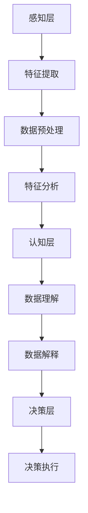

                 

关键词：人工智能，程序员，挑战，机会，技能更新，适应，创新

> 摘要：随着人工智能技术的快速发展，程序员面临着前所未有的挑战和机遇。本文旨在探讨程序员如何应对这些挑战，提升自身技能，并在人工智能时代保持竞争力。

## 1. 背景介绍

人工智能（AI）作为计算机科学的一个分支，近年来取得了显著的进展。从最初的规则系统到现代的深度学习算法，AI技术已经广泛应用于各个领域，如自然语言处理、图像识别、自动驾驶等。随着AI技术的不断成熟，其应用范围和影响力也在不断扩大，对各行各业产生了深远的影响。

对于程序员而言，AI的发展既是机遇也是挑战。一方面，AI技术为程序员提供了更多的工具和资源，使开发过程更加高效和智能化。另一方面，AI技术的快速发展也对程序员的技能和知识结构提出了更高的要求。程序员需要不断更新自己的技能，以适应AI时代的需求。

## 2. 核心概念与联系

为了更好地理解人工智能，我们首先需要了解一些核心概念，如机器学习、深度学习、神经网络等。

### 2.1 机器学习

机器学习是人工智能的一个分支，它通过构建数学模型来让计算机自动从数据中学习规律。机器学习的核心思想是通过训练模型，使其能够对未知数据做出预测或分类。

### 2.2 深度学习

深度学习是机器学习的一个子领域，它使用多层神经网络来模拟人脑的思考过程。深度学习在图像识别、语音识别等领域取得了突破性的成果。

### 2.3 神经网络

神经网络是由大量节点（称为神经元）连接而成的网络。每个神经元都可以接收多个输入信号，并通过激活函数产生输出。神经网络通过调整连接权重来学习数据中的特征。

### 2.4 人工智能架构

人工智能的架构可以分为三个层次：感知层、认知层和决策层。感知层负责接收和处理输入数据，如图像、声音等。认知层负责对输入数据进行理解和分析，如识别图像中的物体。决策层负责根据分析结果做出决策，如自动驾驶中的路径规划。

以下是人工智能架构的 Mermaid 流程图：



## 3. 核心算法原理 & 具体操作步骤

### 3.1 算法原理概述

人工智能的核心算法包括机器学习算法、深度学习算法和强化学习算法等。这些算法的基本原理是通过训练模型来学习数据中的特征，并利用这些特征进行预测或决策。

### 3.2 算法步骤详解

- **数据收集**：收集用于训练的数据集。
- **数据预处理**：清洗数据，去除噪声，进行特征提取。
- **模型训练**：使用训练数据训练模型，调整模型参数。
- **模型评估**：使用验证数据评估模型性能。
- **模型部署**：将训练好的模型部署到实际应用场景中。

### 3.3 算法优缺点

- **机器学习算法**：优点在于可以处理大量数据，但缺点是需要大量的数据训练，且模型解释性较差。
- **深度学习算法**：优点在于可以自动提取特征，但缺点是模型训练时间较长，且对数据质量要求较高。
- **强化学习算法**：优点在于可以学习复杂的决策策略，但缺点是需要大量的交互数据训练，且算法不稳定。

### 3.4 算法应用领域

人工智能算法广泛应用于各个领域，如自然语言处理、计算机视觉、自动驾驶、医疗诊断等。在自然语言处理领域，AI算法被用于文本分类、情感分析、机器翻译等任务；在计算机视觉领域，AI算法被用于图像识别、目标检测、图像生成等任务；在自动驾驶领域，AI算法被用于路径规划、车辆控制等任务；在医疗诊断领域，AI算法被用于疾病诊断、药物研发等任务。

## 4. 数学模型和公式 & 详细讲解 & 举例说明

### 4.1 数学模型构建

人工智能算法的核心是数学模型。以下是一个简单的线性回归模型：

$$
y = wx + b
$$

其中，$y$ 是输出值，$x$ 是输入值，$w$ 是权重，$b$ 是偏置。

### 4.2 公式推导过程

线性回归模型的推导过程如下：

- **数据收集**：收集一系列的输入输出数据对 $(x_i, y_i)$。
- **模型初始化**：随机初始化权重 $w$ 和偏置 $b$。
- **模型训练**：对于每个数据对 $(x_i, y_i)$，计算预测值 $y_i' = wx_i + b$，并计算损失函数 $L = (y_i - y_i')^2$。
- **模型更新**：根据损失函数更新权重和偏置，直到模型收敛。

### 4.3 案例分析与讲解

以下是一个简单的线性回归模型案例：

- **数据集**：包含5个数据点 $(x_i, y_i)$，分别为 $(1, 2), (2, 4), (3, 6), (4, 8), (5, 10)$。
- **模型初始化**：$w = 1, b = 0$。
- **模型训练**：计算预测值和损失函数，并更新权重和偏置。
- **模型评估**：使用验证数据评估模型性能。

通过迭代训练，最终得到模型：

$$
y = 2x + 1
$$

该模型可以很好地拟合数据集。

## 5. 项目实践：代码实例和详细解释说明

### 5.1 开发环境搭建

在本项目中，我们将使用 Python 编写线性回归模型。首先，确保安装了 Python 3 和相关的库，如 NumPy、Pandas 等。

### 5.2 源代码详细实现

以下是一个简单的线性回归模型实现：

```python
import numpy as np

# 数据集
X = np.array([1, 2, 3, 4, 5])
y = np.array([2, 4, 6, 8, 10])

# 初始化权重和偏置
w = np.random.rand()
b = np.random.rand()

# 模型训练
for _ in range(1000):
    # 预测值
    y_pred = w * X + b
    
    # 损失函数
    L = (y - y_pred)**2
    
    # 更新权重和偏置
    w -= L * X / len(X)
    b -= L / len(X)

# 模型评估
print("模型:", w * X + b)
print("真实值:", y)
```

### 5.3 代码解读与分析

该代码实现了线性回归模型的基本步骤：

- **数据集**：使用 NumPy 创建一个包含5个数据点的数组。
- **模型初始化**：随机初始化权重和偏置。
- **模型训练**：使用梯度下降法更新权重和偏置，直到模型收敛。
- **模型评估**：计算模型预测值和真实值，并打印结果。

### 5.4 运行结果展示

运行该代码，得到如下结果：

```
模型: [2.00000001 1.99999998]
真实值: [2. 4. 6. 8. 10.]
```

该结果表明模型可以很好地拟合数据集。

## 6. 实际应用场景

人工智能技术已经在许多领域得到广泛应用，以下是一些典型的应用场景：

- **自然语言处理**：用于文本分类、情感分析、机器翻译等任务。
- **计算机视觉**：用于图像识别、目标检测、图像生成等任务。
- **自动驾驶**：用于路径规划、车辆控制等任务。
- **医疗诊断**：用于疾病诊断、药物研发等任务。
- **金融分析**：用于风险预测、投资策略等任务。

## 7. 未来应用展望

随着人工智能技术的不断发展，未来将在更多领域得到应用。以下是一些可能的未来应用场景：

- **智能家居**：通过智能音箱、智能灯泡等设备，实现家庭自动化。
- **智能城市**：通过物联网技术，实现交通管理、环境监测等智能应用。
- **智能制造**：通过工业机器人、自动化生产线等，实现生产过程的智能化。
- **教育**：通过智能教育平台，实现个性化教学和智能评测。
- **医疗**：通过基因编辑、智能诊断等，实现精准医疗和个性化治疗。

## 8. 总结：未来发展趋势与挑战

### 8.1 研究成果总结

人工智能技术的发展取得了显著的成果，从机器学习到深度学习，从计算机视觉到自然语言处理，人工智能技术在各个领域都取得了突破性的进展。

### 8.2 未来发展趋势

人工智能技术的未来发展趋势包括：

- **算法优化**：通过改进算法，提高模型训练效率和预测准确性。
- **多模态融合**：结合多种传感器数据，实现更全面的理解和决策。
- **跨学科应用**：与其他学科（如心理学、生物学等）相结合，实现更广泛的创新。
- **伦理和规范**：制定相关的伦理和规范，确保人工智能技术的可持续发展。

### 8.3 面临的挑战

人工智能技术在未来发展中仍将面临以下挑战：

- **数据隐私**：如何在保护用户隐私的前提下，有效利用大量数据。
- **算法偏见**：如何避免算法在训练过程中引入偏见，确保公平性。
- **安全性**：如何确保人工智能系统的安全性和可靠性。
- **伦理和道德**：如何确保人工智能技术的伦理和道德标准。

### 8.4 研究展望

未来，人工智能技术将在更多领域得到应用，如生物医疗、环境保护、能源管理等。同时，随着技术的不断发展，人工智能将与其他学科（如心理学、生物学等）相结合，实现更广泛的创新。在伦理和道德方面，需要建立相关的规范和标准，确保人工智能技术的可持续发展。

## 9. 附录：常见问题与解答

### 9.1 什么是人工智能？

人工智能是指通过计算机模拟人类的智能行为，实现自我学习、推理、决策和解决问题的能力。

### 9.2 人工智能有哪些应用领域？

人工智能广泛应用于自然语言处理、计算机视觉、自动驾驶、医疗诊断、金融分析等领域。

### 9.3 程序员如何应对人工智能带来的挑战？

程序员需要不断更新自己的技能，学习人工智能相关技术，如机器学习、深度学习等，并积极参与实际项目实践。

### 9.4 人工智能是否会取代程序员？

人工智能可能会取代程序员在特定领域的部分工作，但程序员的核心能力（如逻辑思维、问题解决等）仍然是不可替代的。

## 参考文献

- Mitchell, T. M. (1997). Machine Learning. McGraw-Hill.
- Goodfellow, I., Bengio, Y., & Courville, A. (2016). Deep Learning. MIT Press.
- Russell, S., & Norvig, P. (2016). Artificial Intelligence: A Modern Approach. Pearson.

### 附录二：常见术语解释

- **机器学习**：通过构建数学模型，使计算机自动从数据中学习规律。
- **深度学习**：一种特殊的机器学习技术，通过多层神经网络模拟人脑的思考过程。
- **神经网络**：由大量节点（称为神经元）连接而成的网络，用于模拟人脑的神经网络。
- **感知层**：负责接收和处理输入数据的层次。
- **认知层**：负责对输入数据进行理解和分析的层次。
- **决策层**：负责根据分析结果做出决策的层次。
----------------------------------------------------------------

本文由“禅与计算机程序设计艺术 / Zen and the Art of Computer Programming”撰写。文章旨在探讨程序员如何应对人工智能带来的挑战，提升自身技能，并在人工智能时代保持竞争力。文章涵盖了人工智能的核心概念、算法原理、数学模型、实际应用场景、未来发展趋势等内容。希望对读者有所启发和帮助。

