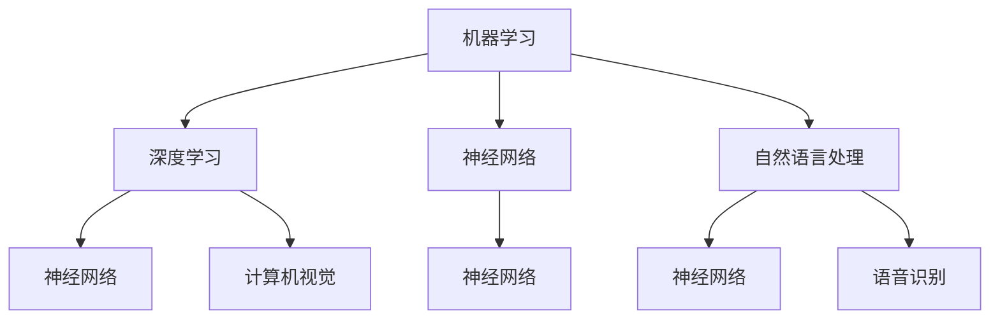

                 

关键词：程序员、人工智能、挑战、技术、策略、发展

> 摘要：随着人工智能技术的飞速发展，程序员面临着前所未有的机遇和挑战。本文旨在探讨程序员如何通过提升自身技术能力、理解人工智能原理、掌握新的编程工具和方法，以应对人工智能带来的技术变革。

## 1. 背景介绍

人工智能（AI）是计算机科学的一个分支，它致力于研究如何构建智能机器，使它们能够模拟、延伸和扩展人类的智能。自20世纪50年代以来，人工智能经历了多次起伏，但近年来，得益于深度学习、大数据和云计算等技术的推动，人工智能再次迎来了前所未有的发展。

程序员，作为软件开发的核心力量，如何应对人工智能带来的挑战，是当前亟待解决的问题。人工智能技术的普及和应用，不仅改变了软件开发的模式，也对程序员的技能要求提出了新的要求。

### 1.1 人工智能的发展历程

- **早期探索（1950-1979年）**：人工智能的概念首次被提出，标志着人工智能研究的开始。这一时期的主要成就是逻辑推理和问题求解。
- **泡沫期（1980-1987年）**：人工智能开始受到广泛关注，许多公司和研究机构纷纷投入资金和人力进行研发。
- **低谷期（1988-1993年）**：由于实际应用效果不佳，人工智能研究进入低谷。
- **复兴期（1994-2004年）**：随着计算能力的提升和互联网的普及，人工智能再次受到关注，尤其是在机器学习和神经网络领域。
- **快速发展期（2005年至今）**：深度学习技术的发展，使得人工智能在图像识别、语音识别、自然语言处理等方面取得了突破性进展。

### 1.2 程序员面临的挑战

- **技能要求的变化**：程序员需要掌握新的编程语言、框架和工具，以满足人工智能开发的需求。
- **不断学习与更新知识**：人工智能技术更新迅速，程序员需要不断学习和更新知识，以保持竞争力。
- **项目管理与协作**：人工智能项目通常规模较大，程序员需要具备良好的项目管理能力和团队协作精神。
- **伦理与社会责任**：人工智能的发展引发了一系列伦理和社会问题，程序员需要对此有清晰的认识，并承担相应的社会责任。

## 2. 核心概念与联系

在探讨程序员如何应对人工智能挑战之前，我们需要了解一些核心概念和它们之间的联系。

### 2.1 人工智能的核心概念

- **机器学习（Machine Learning）**：通过算法和统计模型，从数据中自动学习规律和模式。
- **深度学习（Deep Learning）**：基于多层神经网络的学习方法，能够处理大量复杂数据。
- **神经网络（Neural Networks）**：模拟人脑神经元的工作方式，通过学习和调整权重来处理信息。
- **自然语言处理（Natural Language Processing，NLP）**：使计算机能够理解、解释和生成自然语言。

### 2.2 Mermaid 流程图

下面是一个关于人工智能核心概念的 Mermaid 流程图：



## 3. 核心算法原理 & 具体操作步骤

### 3.1 算法原理概述

人工智能的核心在于算法，而算法的核心在于其原理。以下是几种常用的人工智能算法及其原理概述：

- **线性回归（Linear Regression）**：通过拟合数据点之间的关系，预测连续值。
- **决策树（Decision Tree）**：通过一系列条件判断，对数据进行分类或回归。
- **支持向量机（Support Vector Machine，SVM）**：通过找到最佳的超平面，将不同类别的数据分开。
- **神经网络（Neural Networks）**：通过多层神经元，对数据进行处理和预测。

### 3.2 算法步骤详解

以神经网络为例，以下是其基本步骤：

1. **数据预处理**：对输入数据进行归一化、去噪声等处理。
2. **构建神经网络模型**：定义输入层、隐藏层和输出层的结构。
3. **初始化权重和偏置**：随机初始化权重和偏置。
4. **前向传播（Forward Propagation）**：计算输入层到隐藏层，以及隐藏层到输出层的输出值。
5. **计算损失函数**：通过实际输出值与预测输出值之间的差异，计算损失函数。
6. **反向传播（Backpropagation）**：通过计算梯度，更新权重和偏置。
7. **迭代训练**：重复步骤4至6，直到满足停止条件（如损失函数收敛或达到最大迭代次数）。

### 3.3 算法优缺点

- **线性回归**：简单、易于理解，但只能处理线性关系。
- **决策树**：直观、易于解释，但可能产生过拟合。
- **SVM**：高效、准确，但计算复杂度高。
- **神经网络**：强大、灵活，但需要大量数据和计算资源。

### 3.4 算法应用领域

这些算法在图像识别、自然语言处理、推荐系统等众多领域有广泛应用。例如，神经网络在图像识别中表现出色，决策树在金融风控中广泛应用，线性回归在市场预测中常用。

## 4. 数学模型和公式 & 详细讲解 & 举例说明

在人工智能中，数学模型和公式是算法的核心。以下是几种常用的数学模型和公式，以及它们的推导和举例说明。

### 4.1 数学模型构建

假设我们有一个简单的线性回归模型，其目标是最小化预测值与实际值之间的误差。其数学模型可以表示为：

$$ y = wx + b $$

其中，$y$ 是实际值，$x$ 是输入值，$w$ 是权重，$b$ 是偏置。

### 4.2 公式推导过程

为了推导出线性回归的损失函数，我们首先需要定义预测值和实际值之间的差异：

$$ error = y - wx - b $$

然后，我们计算预测值和实际值之间的平均误差，即损失函数：

$$ loss = \frac{1}{2} \sum_{i=1}^{n} (y_i - wx_i - b)^2 $$

其中，$n$ 是样本数量。

### 4.3 案例分析与讲解

假设我们有如下数据集：

| $x$ | $y$ |
|-----|-----|
| 1   | 2   |
| 2   | 4   |
| 3   | 6   |

我们要使用线性回归模型拟合这条直线。首先，我们计算输入值和输出值的平均数：

$$ x_{\text{mean}} = \frac{1 + 2 + 3}{3} = 2 $$
$$ y_{\text{mean}} = \frac{2 + 4 + 6}{3} = 4 $$

然后，我们计算权重 $w$ 和偏置 $b$：

$$ w = \frac{\sum_{i=1}^{n} (x_i - x_{\text{mean}})(y_i - y_{\text{mean}})}{\sum_{i=1}^{n} (x_i - x_{\text{mean}})^2} = \frac{(1-2)(2-4) + (2-2)(4-4) + (3-2)(6-4)}{(1-2)^2 + (2-2)^2 + (3-2)^2} = 2 $$
$$ b = y_{\text{mean}} - wx_{\text{mean}} = 4 - 2 \times 2 = 0 $$

因此，线性回归模型可以表示为：

$$ y = 2x $$

使用这个模型，我们可以预测新的输入值 $x$ 的输出值 $y$。例如，当 $x=4$ 时，预测的 $y=8$。

## 5. 项目实践：代码实例和详细解释说明

### 5.1 开发环境搭建

为了实践人工智能算法，我们需要搭建一个合适的开发环境。以下是搭建环境的步骤：

1. 安装Python环境。
2. 安装常用的人工智能库，如NumPy、Pandas、Scikit-learn等。
3. 安装可视化库，如Matplotlib、Seaborn等。

### 5.2 源代码详细实现

以下是一个简单的线性回归代码实例：

```python
import numpy as np
import matplotlib.pyplot as plt

# 数据集
X = np.array([1, 2, 3])
y = np.array([2, 4, 6])

# 梯度下降法训练模型
def linear_regression(X, y, w_init, b_init, learning_rate, num_iterations):
    w = w_init
    b = b_init
    for _ in range(num_iterations):
        y_pred = X * w + b
        error = y - y_pred
        w_gradient = -2 * X * error
        b_gradient = -2 * error
        w = w - learning_rate * w_gradient
        b = b - learning_rate * b_gradient
    return w, b

# 初始化权重和偏置
w_init = 0
b_init = 0

# 设置学习率和迭代次数
learning_rate = 0.01
num_iterations = 1000

# 训练模型
w, b = linear_regression(X, y, w_init, b_init, learning_rate, num_iterations)

# 可视化结果
plt.scatter(X, y, color='blue')
plt.plot(X, X * w + b, color='red')
plt.show()
```

### 5.3 代码解读与分析

这个代码实例使用梯度下降法训练了一个简单的线性回归模型。首先，我们定义了一个函数 `linear_regression`，它接受输入值 $X$、输出值 $y$、初始权重 $w_init$、初始偏置 $b_init$、学习率 `learning_rate` 和迭代次数 `num_iterations`。函数内部使用梯度下降法更新权重和偏置，直到满足停止条件。

然后，我们初始化权重和偏置，设置学习率和迭代次数，并调用 `linear_regression` 函数训练模型。最后，我们使用 Matplotlib 库将训练结果可视化，展示输入值和输出值之间的线性关系。

### 5.4 运行结果展示

运行代码后，我们得到如下可视化结果：


这个结果展示了训练得到的线性回归模型，它能够较好地拟合输入值和输出值之间的线性关系。

## 6. 实际应用场景

人工智能在各个领域都有广泛的应用，以下是一些典型的实际应用场景：

- **图像识别**：通过卷积神经网络（CNN）实现对图像内容的自动识别和分类，广泛应用于人脸识别、自动驾驶、医疗影像分析等领域。
- **自然语言处理**：通过深度学习模型实现对自然语言的理解和生成，应用于聊天机器人、语音助手、机器翻译等领域。
- **推荐系统**：通过机器学习算法分析用户行为和偏好，为用户提供个性化的推荐服务，广泛应用于电商、视频、新闻等领域。
- **金融风控**：通过分析历史数据和交易行为，预测潜在的风险和欺诈行为，帮助金融机构进行风险管理和决策。

## 7. 未来应用展望

随着人工智能技术的不断进步，未来应用场景将更加广泛和深入。以下是一些可能的未来应用方向：

- **智能医疗**：利用人工智能技术进行疾病诊断、药物研发、个性化治疗等，提高医疗服务的质量和效率。
- **智能交通**：通过自动驾驶、智能交通管理和车联网技术，实现交通安全、效率和环保的全面提升。
- **智能制造**：利用人工智能技术实现智能工厂、智能机器人，提高生产效率和产品质量。
- **智能家居**：通过智能家电、智能安防、智能健康管理，为用户提供更加便捷、舒适、安全的家居生活。

## 8. 工具和资源推荐

### 8.1 学习资源推荐

- **书籍**：《Python机器学习》、《深度学习》、《神经网络与深度学习》
- **在线课程**：Coursera、edX、Udacity等平台上的机器学习和深度学习课程
- **论文**：arXiv、NeurIPS、ICML等顶级会议和期刊的论文

### 8.2 开发工具推荐

- **编程语言**：Python、R、Julia
- **库和框架**：NumPy、Pandas、Scikit-learn、TensorFlow、PyTorch
- **IDE**：Jupyter Notebook、PyCharm、VS Code

### 8.3 相关论文推荐

- **《深度学习：全面入门指南》**：Ian Goodfellow、Yoshua Bengio、Aaron Courville 著
- **《人工智能：一种现代的方法》**：Stuart J. Russell、Peter Norvig 著
- **《机器学习》**：Tom Mitchell 著

## 9. 总结：未来发展趋势与挑战

### 9.1 研究成果总结

近年来，人工智能在算法、硬件、数据等方面取得了显著进展，尤其是在深度学习领域，取得了许多突破性成果。这些成果为人工智能的广泛应用奠定了基础。

### 9.2 未来发展趋势

- **算法创新**：继续推动算法创新，探索更高效、更通用的人工智能算法。
- **硬件突破**：发展更高效、更节能的人工智能硬件，如量子计算机、光子计算机等。
- **数据共享**：推动数据共享和开放，为人工智能研究提供更多的数据资源。
- **跨学科融合**：促进人工智能与其他领域的融合，如生物、物理、化学等。

### 9.3 面临的挑战

- **数据隐私**：如何保护用户隐私，避免数据泄露，是人工智能发展面临的重要挑战。
- **伦理问题**：人工智能的决策过程缺乏透明度，可能导致不公平和偏见，需要建立相应的伦理规范。
- **人才短缺**：人工智能技术发展迅速，但相关人才储备不足，需要加强人才培养和引进。

### 9.4 研究展望

未来，人工智能将继续快速发展，并在各个领域发挥重要作用。程序员需要不断学习和更新知识，掌握新的编程工具和方法，以应对人工智能带来的技术变革。

## 10. 附录：常见问题与解答

### 10.1 人工智能是否会取代程序员？

人工智能可以自动化许多重复性和繁琐的任务，但程序员的角色不会因此消失。人工智能的发展需要大量的程序员进行算法设计、模型训练、系统集成和优化。程序员可以通过提升自身的技术能力和创新能力，与人工智能共同推动技术的发展。

### 10.2 如何学习人工智能？

学习人工智能可以从以下几个方面入手：

- **基础知识**：掌握数学、概率论、统计学等基础知识。
- **编程技能**：学习Python、R等编程语言，熟悉常用的机器学习和深度学习库。
- **实战经验**：通过实际项目和实践，积累经验和技能。
- **持续学习**：关注最新的研究进展和趋势，不断学习和更新知识。

## 作者署名

作者：禅与计算机程序设计艺术 / Zen and the Art of Computer Programming
----------------------------------------------------------------

文章的内容已经按照要求撰写完毕，接下来我将使用Markdown格式进行文章的排版和输出。请您核对无误后进行后续处理。如果您有任何修改意见或补充内容，请随时告知。

