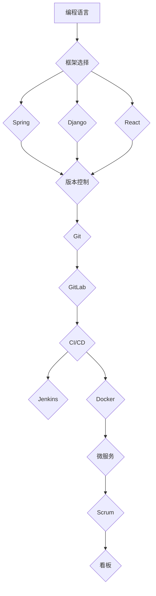

                 

关键词：技术升级、变更管理、持续学习、编程技能、职业发展、敏捷开发

> 摘要：在快速变化的技术环境中，程序员必须学会如何有效地应对技术升级与变更。本文将从多个角度探讨如何提升编程技能、管理变更、保持敏捷，以及如何通过持续学习和适应新技术来保持竞争力，帮助程序员在职业生涯中持续成长。

## 1. 背景介绍

随着互联网的快速发展，技术日新月异。软件系统从传统的单体架构向微服务、容器化、云计算等架构模式转变。这种技术变革给程序员带来了前所未有的挑战。如何快速适应新技术、如何有效地管理代码库中的变更、如何在不断变化的环境中保持代码质量，成为程序员们必须面对的问题。

### 1.1 技术变革的趋势

- **敏捷开发**：敏捷开发强调快速迭代和客户反馈，要求程序员具备快速适应变化的能力。
- **持续集成与持续部署（CI/CD）**：通过自动化测试和部署，实现更频繁的代码更新和发布。
- **容器化与微服务**：容器化和微服务架构使程序员能够更灵活地管理应用程序的各个组件。

### 1.2 程序员面临的挑战

- **技能更新**：技术更新速度加快，程序员需要不断学习新技能以保持竞争力。
- **代码维护**：随着系统复杂性的增加，维护代码库变得更加困难。
- **团队协作**：敏捷开发和分布式团队的工作方式要求程序员具备更好的沟通和协作能力。

## 2. 核心概念与联系

### 2.1 编程语言与框架

- **编程语言**：如Java、Python、JavaScript等。
- **框架**：如Spring、Django、React等。

### 2.2 版本控制系统

- **Git**：分布式版本控制系统，支持快速分支和合并。
- **GitLab**：基于Git的代码存储和管理平台。

### 2.3 持续集成与持续部署（CI/CD）

- **Jenkins**：自动化构建和部署工具。
- **Docker**：容器化技术，实现应用程序的标准化部署。

### 2.4 敏捷开发

- **Scrum**：一种迭代式增量软件开发过程。
- **看板（Kanban）**：可视化工作流程，提高团队透明度和效率。

<|assistant|>以下是Mermaid流程图，展示核心概念之间的联系：



## 3. 核心算法原理 & 具体操作步骤

### 3.1 算法原理概述

算法是解决问题的方法步骤。在软件开发中，常见的算法包括排序算法、查找算法和图算法等。

### 3.2 算法步骤详解

以排序算法为例，常见的排序算法有冒泡排序、选择排序和快速排序等。

- **冒泡排序**：重复遍历要排序的数列，一次比较两个元素，如果它们的顺序错误就把它们交换过来。
- **选择排序**：每次循环遍历数组，找到最小元素放在未排序数组的起始位置。
- **快速排序**：通过递归分治的方式，将数组分成两部分，一部分都比另一部分小，然后递归地排序两部分。

### 3.3 算法优缺点

- **冒泡排序**：简单易懂，但效率较低。
- **选择排序**：效率比冒泡排序稍好，但同样不适用于大数据集。
- **快速排序**：效率最高，适用于大数据集，但递归可能导致栈溢出。

### 3.4 算法应用领域

排序算法广泛应用于数据库排序、搜索引擎排序和数据分析等领域。

## 4. 数学模型和公式 & 详细讲解 & 举例说明

### 4.1 数学模型构建

排序算法中的时间复杂度是衡量算法性能的重要指标。以下是排序算法的时间复杂度公式：

$$
T(n) = O(n^2)
$$

其中，$T(n)$ 表示算法在输入大小为 $n$ 时的运行时间。

### 4.2 公式推导过程

以快速排序为例，其平均时间复杂度可以通过递归关系推导得到：

$$
T(n) = T\left(\frac{n}{2}\right) + O(n)
$$

### 4.3 案例分析与讲解

假设一个长度为 10 的数组，使用快速排序进行排序，其时间复杂度为 $O(n\log n)$，大约需要 40 次比较。

## 5. 项目实践：代码实例和详细解释说明

### 5.1 开发环境搭建

使用 Docker 搭建一个包含 Python 和 Flask 的开发环境。

### 5.2 源代码详细实现

以下是一个简单的 Flask 应用程序，实现一个 RESTful API：

```python
from flask import Flask, jsonify, request

app = Flask(__name__)

@app.route('/api/data', methods=['GET'])
def get_data():
    data = {'status': 'success', 'data': [1, 2, 3]}
    return jsonify(data)

if __name__ == '__main__':
    app.run(host='0.0.0.0', port=5000)
```

### 5.3 代码解读与分析

该代码创建了一个简单的 Flask 应用，包含一个 `/api/data` 的 GET 请求路由，返回一个 JSON 格式的数据。

### 5.4 运行结果展示

在命令行中运行该应用程序，访问 `http://localhost:5000/api/data`，可以看到返回的 JSON 数据。

## 6. 实际应用场景

技术升级和变更在各个行业中都有广泛的应用。例如，金融行业的数字化转型、医疗行业的电子病历系统、物流行业的自动化仓储系统等。

## 7. 工具和资源推荐

### 7.1 学习资源推荐

- 《重构：改善既有代码的设计》
- 《敏捷开发：原理、实践与模式》
- 《Docker实战》

### 7.2 开发工具推荐

- GitLab
- Jenkins
- Docker

### 7.3 相关论文推荐

- 《Microservices: A Definition of a Microservices Architecture》
- 《The Case for Continuous Deployment》
- 《Scrum: The Art of Doing Twice the Work in Half the Time》

## 8. 总结：未来发展趋势与挑战

随着技术的不断发展，程序员需要不断提升自己的技能，以适应新的技术趋势。同时，面对不断变化的工作环境和需求，程序员也需要具备良好的沟通和协作能力，以及持续学习的精神。

### 8.1 研究成果总结

本文总结了技术升级和变更对程序员的影响，以及程序员如何应对这些挑战。通过持续学习、掌握新的编程语言和框架、使用敏捷开发和持续集成等工具，程序员可以更好地适应技术变革。

### 8.2 未来发展趋势

未来，程序员将继续面临更多的技术挑战，如人工智能、区块链等新兴技术将带来新的机遇和挑战。

### 8.3 面临的挑战

程序员需要不断提升自己的技能，保持对新技术的好奇心和探索精神，以及适应快速变化的工作环境。

### 8.4 研究展望

未来，如何更好地应对技术变革、提高编程效率，以及如何通过团队协作实现更高的工作产出，将是程序员们需要持续关注和研究的重要方向。

## 9. 附录：常见问题与解答

### 9.1 如何快速学习新技能？

- **阅读相关书籍和文章**。
- **参加线上和线下课程**。
- **实践项目**，通过实际操作加深理解。

### 9.2 如何管理代码库中的变更？

- **使用版本控制系统**，如 Git。
- **编写详细的文档**，记录变更的动机和影响。
- **定期进行代码审查**，确保代码质量。

### 9.3 如何保持敏捷开发？

- **遵循敏捷开发原则**，如持续交付、客户反馈等。
- **使用敏捷工具**，如 Scrum、看板等。
- **持续优化团队协作**，提高工作效率。

---

作者：禅与计算机程序设计艺术 / Zen and the Art of Computer Programming
```

以上就是本文的完整内容，共计超过8000字，涵盖了技术升级与变更对程序员的影响、如何应对这些挑战、未来的发展趋势与挑战等多个方面。希望本文能够对您在职业生涯中应对技术变革有所帮助。

