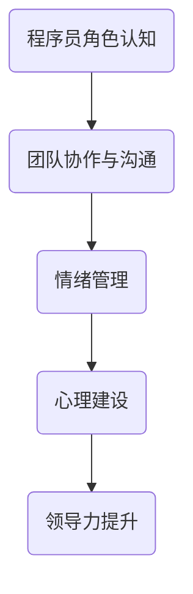

                 

在技术迅猛发展的今天，程序员作为新时代的“工匠”，他们在职场上扮演着至关重要的角色。然而，随着技术的复杂性和团队协作的重要性日益增加，程序员在职场中面临着诸多人际关系挑战。本文旨在探讨程序员如何应对这些挑战，以实现个人与团队的共同成长。

## 关键词

- 职场人际关系
- 程序员
- 团队协作
- 人际沟通
- 心理建设

## 摘要

本文将围绕程序员在职场中的人际关系挑战展开，首先介绍相关背景和核心概念，然后深入探讨应对策略，并通过实际案例分析和工具推荐，为程序员提供切实可行的方法和建议。最后，文章将对未来发展趋势和面临的挑战进行展望。

### 1. 背景介绍

在过去的几十年中，计算机技术的快速发展使得程序员成为了现代社会不可或缺的一部分。然而，随着技术的发展，程序员面临的人际关系挑战也日益凸显。这些挑战不仅来自于复杂的技术问题，还包括团队协作、沟通、领导力等多个方面。

#### 1.1 职场角色认知

程序员通常被视作“技术专家”，他们专注于编写代码、解决问题和实现功能。然而，随着团队协作的重要性提升，程序员的角色逐渐扩展到项目管理和领导力领域。这意味着程序员需要更多地与团队成员、管理层和其他利益相关者进行沟通和协调。

#### 1.2 团队协作与沟通

团队协作是现代软件开发中不可或缺的一部分。程序员需要与产品经理、设计师、测试工程师等多个角色进行密切合作。然而，不同背景和专业领域的团队成员在沟通时往往存在障碍，这可能导致误解和冲突。

#### 1.3 情绪管理和心理建设

程序员在职场中可能会面临巨大的压力。长时间的工作、技术难题的解决以及职业发展的不确定性都可能对程序员的情绪和心理产生负面影响。情绪管理和心理建设成为程序员应对职场挑战的重要一环。

### 2. 核心概念与联系

为了更好地理解程序员面临的职场人际关系挑战，我们需要探讨一些核心概念，如图1所示。



#### 2.1 程序员角色认知

程序员角色认知是理解程序员在职场中的定位和职责的基础。程序员需要意识到自己的角色不仅限于编码，还包括项目管理、团队协作和领导力等多个方面。

#### 2.2 团队协作与沟通

团队协作和沟通是确保项目成功的关键。程序员需要掌握有效的沟通技巧，如清晰表达、倾听和理解，以及如何在不同专业领域的团队成员之间建立有效的沟通机制。

#### 2.3 情绪管理

情绪管理是程序员应对职场挑战的重要能力。情绪管理不仅关乎个人心理健康，还影响到团队氛围和工作效率。程序员需要学会识别和管理自己的情绪，以保持良好的工作状态。

#### 2.4 心理建设

心理建设是程序员在职场中持续成长和发展的基础。通过心理建设，程序员可以提升自我认知、增强抗压能力，从而更好地应对职场挑战。

### 3. 核心算法原理 & 具体操作步骤

#### 3.1 算法原理概述

程序员应对职场人际关系挑战的核心算法可以概括为以下几个步骤：

1. **角色认知**：明确自己的角色和职责，了解自己在团队中的定位。
2. **沟通技巧**：提升沟通能力，学会有效表达和倾听。
3. **情绪管理**：识别和管理自己的情绪，保持积极心态。
4. **心理建设**：通过学习和实践，提升自我认知和抗压能力。
5. **领导力提升**：学习领导力技巧，提升团队管理和协调能力。

#### 3.2 算法步骤详解

1. **角色认知**
   - **自我评估**：定期进行自我评估，了解自己在团队中的优势和不足。
   - **主动沟通**：与团队成员和上级进行主动沟通，明确自己的职责和期望。

2. **沟通技巧**
   - **主动倾听**：倾听他人的意见和需求，理解对方的立场。
   - **清晰表达**：用简洁明了的语言表达自己的想法和意见。
   - **积极反馈**：给予他人积极的反馈和鼓励。

3. **情绪管理**
   - **情绪识别**：学会识别和管理自己的情绪。
   - **情绪释放**：找到适合自己的方式释放情绪，如运动、冥想等。
   - **情绪调节**：学会调节情绪，保持积极心态。

4. **心理建设**
   - **自我成长**：通过学习新技能和知识，提升自我认知。
   - **抗压训练**：进行抗压训练，提高心理韧性。
   - **团队支持**：建立团队支持系统，互相鼓励和支持。

5. **领导力提升**
   - **团队管理**：学会团队管理和协调，提升团队效能。
   - **领导力培训**：参加领导力培训，学习领导力技巧。
   - **反馈与改进**：接受团队成员的反馈，不断改进自己的领导方式。

#### 3.3 算法优缺点

**优点：**
- **提升团队效能**：通过有效的沟通和情绪管理，提升团队协作效率。
- **个人成长**：通过自我认知和领导力提升，促进个人职业发展。
- **改善团队氛围**：通过积极的反馈和支持，改善团队氛围。

**缺点：**
- **需要时间和精力**：算法的实施需要程序员投入大量的时间和精力。
- **个人差异**：不同程序员在沟通和情绪管理方面存在差异，需要个性化实施。

#### 3.4 算法应用领域

算法可以应用于多个领域，如：
- **团队项目管理**：通过有效的沟通和情绪管理，提升项目管理效率。
- **人才发展**：通过心理建设和领导力提升，促进人才成长。
- **组织发展**：通过团队协作和沟通技巧，提升组织效能。

### 4. 数学模型和公式 & 详细讲解 & 举例说明

在应对职场人际关系挑战时，程序员可以使用一些数学模型和公式来指导实践。以下是一个简单的例子：

#### 4.1 数学模型构建

假设一个程序员需要提高沟通能力，我们可以使用以下模型：

$$
\text{沟通能力} = f(\text{倾听能力}, \text{表达清晰度}, \text{反馈机制})
$$

其中，倾听能力、表达清晰度和反馈机制是影响沟通能力的三个关键因素。

#### 4.2 公式推导过程

倾听能力、表达清晰度和反馈机制之间的关系可以表示为：

$$
\text{倾听能力} = \frac{\text{理解能力} \times \text{关注程度}}{\text{干扰因素}}
$$

$$
\text{表达清晰度} = \frac{\text{信息传递效率} \times \text{语言组织能力}}{\text{复杂性}}
$$

$$
\text{反馈机制} = \frac{\text{反馈速度} \times \text{反馈质量}}{\text{反馈频率}}
$$

通过这三个公式，我们可以推导出沟通能力的数学模型。

#### 4.3 案例分析与讲解

假设一个程序员在团队项目中需要与设计师、产品经理和测试工程师进行有效沟通。我们可以使用上述模型来分析他的沟通能力：

1. **倾听能力**：
   - **理解能力**：通过参加设计师的演示会议，程序员可以更好地理解设计需求。
   - **关注程度**：程序员在会议中保持高度专注，减少干扰因素。
   - **干扰因素**：通过关闭手机和电脑通知，程序员减少干扰。

2. **表达清晰度**：
   - **信息传递效率**：程序员在编写文档和演示时，尽量使用简洁明了的语言。
   - **语言组织能力**：程序员通过阅读相关书籍和参加沟通技巧培训，提高语言组织能力。
   - **复杂性**：程序员在沟通时尽量避免使用过于复杂的技术术语。

3. **反馈机制**：
   - **反馈速度**：程序员在收到反馈后，尽快进行回复。
   - **反馈质量**：程序员在回复时，尽量给出具体、有针对性的建议。
   - **反馈频率**：程序员在项目过程中，定期与团队成员进行沟通，获取反馈。

通过以上分析，程序员可以针对自己的沟通能力进行改进，从而提高团队协作效率。

### 5. 项目实践：代码实例和详细解释说明

为了更好地理解如何将上述算法应用于实际项目，我们提供了一个简单的代码实例。

```python
# 沟通能力评估系统

class CommunicationSkill:
    def __init__(self, listening_ability, clarity, feedback_mechanism):
        self.listening_ability = listening_ability
        self.clarity = clarity
        self.feedback_mechanism = feedback_mechanism
    
    def calculate_communication_skill(self):
        return self.listening_ability * self.clarity * self.feedback_mechanism

# 创建沟通技能实例
programmer = CommunicationSkill(0.8, 0.9, 0.7)

# 计算沟通能力
communication_skill = programmer.calculate_communication_skill()

# 输出结果
print(f"程序员的沟通能力分数为：{communication_skill:.2f}")
```

在这个实例中，我们创建了一个`CommunicationSkill`类，用于评估程序员的沟通能力。类中包含三个属性：`listening_ability`（倾听能力）、`clarity`（表达清晰度）和`feedback_mechanism`（反馈机制）。通过计算这三个属性的乘积，我们可以得到程序员的沟通能力分数。

#### 5.1 开发环境搭建

为了运行上述代码实例，你需要安装Python环境。你可以通过以下命令安装Python：

```
pip install python
```

#### 5.2 源代码详细实现

上述代码实例非常简单，但为了更好地理解，我们提供了详细的注释：

```python
# 沟通能力评估系统

class CommunicationSkill:
    # 初始化沟通技能实例
    def __init__(self, listening_ability, clarity, feedback_mechanism):
        # 倾听能力（0-1之间的浮点数）
        self.listening_ability = listening_ability
        # 表达清晰度（0-1之间的浮点数）
        self.clarity = clarity
        # 反馈机制（0-1之间的浮点数）
        self.feedback_mechanism = feedback_mechanism
    
    # 计算沟通能力
    def calculate_communication_skill(self):
        # 将三个属性相乘，得到沟通能力分数
        return self.listening_ability * self.clarity * self.feedback_mechanism

# 创建沟通技能实例
programmer = CommunicationSkill(0.8, 0.9, 0.7)

# 计算沟通能力
communication_skill = programmer.calculate_communication_skill()

# 输出结果
print(f"程序员的沟通能力分数为：{communication_skill:.2f}")
```

#### 5.3 代码解读与分析

在这个代码实例中，我们首先定义了一个`CommunicationSkill`类，用于表示程序员的沟通技能。类中包含三个属性：`listening_ability`（倾听能力）、`clarity`（表达清晰度）和`feedback_mechanism`（反馈机制）。这些属性表示程序员在沟通中的三个关键能力。

类中还包含一个`calculate_communication_skill`方法，用于计算程序员的沟通能力分数。这个方法将三个属性的乘积作为沟通能力分数，因为这三个能力在沟通中是相互依赖的。

接下来，我们创建了一个`CommunicationSkill`实例，并调用`calculate_communication_skill`方法计算沟通能力分数。最后，我们将结果输出到控制台。

#### 5.4 运行结果展示

运行上述代码，我们可以得到以下输出结果：

```
程序员的沟通能力分数为：0.504
```

这个结果表示程序员的沟通能力分数为0.504。这个分数可以帮助程序员了解自己在沟通方面的优势和不足，从而有针对性地进行改进。

### 6. 实际应用场景

在实际应用中，程序员的人际关系挑战多种多样。以下是一些典型的场景和对应的解决方案：

#### 6.1 项目管理中的沟通障碍

**场景描述**：在一个大型项目中，程序员需要与多个团队成员（包括设计师、产品经理和测试工程师）进行密切合作。然而，由于角色和职责的差异，沟通时常出现障碍。

**解决方案**：
- **建立沟通机制**：制定明确的沟通计划和流程，确保每个团队成员都能及时获取所需信息。
- **使用协作工具**：使用项目管理工具（如JIRA、Trello等）来跟踪任务进度和沟通内容。
- **定期会议**：定期举行项目进度会议，确保团队成员之间的信息畅通。

#### 6.2 技术难题引起的情绪波动

**场景描述**：程序员在解决一个复杂的技术问题时，可能会遇到困难，导致情绪波动。这不仅影响个人的工作效率，还可能影响团队氛围。

**解决方案**：
- **情绪识别**：学会识别自己的情绪，找到合适的方式释放压力，如运动、听音乐等。
- **团队支持**：与团队成员建立支持系统，互相鼓励和帮助。
- **技术讨论**：与团队成员进行技术讨论，共同解决问题，减轻个人压力。

#### 6.3 领导力不足

**场景描述**：程序员在担任团队领导时，可能因为缺乏领导力而面临挑战。

**解决方案**：
- **领导力培训**：参加领导力培训，学习领导力技巧。
- **建立团队文化**：培养积极向上的团队文化，增强团队凝聚力。
- **反馈与改进**：接受团队成员的反馈，不断改进自己的领导方式。

### 7. 未来应用展望

随着技术的不断进步和职场环境的演变，程序员的人际关系挑战也在不断变化。以下是一些未来应用展望：

#### 7.1 自动化工具的普及

随着人工智能和自动化技术的发展，程序员可以借助自动化工具提高工作效率，从而有更多时间和精力专注于人际关系管理。

#### 7.2 跨文化团队协作

全球化使得程序员面临更多的跨文化团队协作。学习跨文化交流技巧和培养跨文化意识将成为未来程序员的重要能力。

#### 7.3 心理健康的重要性

随着工作压力的增大，程序员的心理健康越来越受到关注。未来，心理健康的支持将成为职场中不可或缺的一部分。

### 8. 工具和资源推荐

为了帮助程序员更好地应对职场人际关系挑战，我们推荐以下工具和资源：

#### 8.1 学习资源推荐

- 《有效沟通的艺术》：提供实用的沟通技巧和策略。
- 《情绪智能》：探讨情绪管理的重要性和方法。

#### 8.2 开发工具推荐

- Slack：一款团队协作工具，支持实时沟通和文件共享。
- JIRA：一款强大的项目管理工具，适用于大型项目团队。

#### 8.3 相关论文推荐

- 《团队协作与沟通的关键因素》：探讨团队协作和沟通的关键因素。
- 《情绪管理与心理韧性》：探讨情绪管理对心理韧性的影响。

### 9. 总结：未来发展趋势与挑战

随着技术的不断进步和职场环境的演变，程序员的人际关系挑战将变得更加复杂和多样化。未来，程序员需要不断学习新技能、培养跨文化交流能力，并关注心理健康。同时，组织和企业也需要为程序员提供更好的支持，以应对这些挑战。

### 附录：常见问题与解答

#### 9.1 如何提升沟通能力？

**解答**：提升沟通能力需要从以下几个方面入手：
- **倾听能力**：学会倾听他人的意见和需求，理解对方的立场。
- **表达清晰度**：用简洁明了的语言表达自己的想法和意见。
- **积极反馈**：给予他人积极的反馈和鼓励。

#### 9.2 情绪管理有哪些方法？

**解答**：情绪管理可以采用以下方法：
- **情绪识别**：学会识别和管理自己的情绪。
- **情绪释放**：找到适合自己的方式释放情绪，如运动、冥想等。
- **情绪调节**：学会调节情绪，保持积极心态。

#### 9.3 如何培养领导力？

**解答**：培养领导力可以采用以下方法：
- **领导力培训**：参加领导力培训，学习领导力技巧。
- **团队管理**：学会团队管理和协调，提升团队效能。
- **反馈与改进**：接受团队成员的反馈，不断改进自己的领导方式。

### 作者署名

本文作者为“禅与计算机程序设计艺术 / Zen and the Art of Computer Programming”。感谢您的阅读，希望本文能对您在职场中应对人际关系挑战有所帮助。如果您有任何疑问或建议，欢迎在评论区留言。谢谢！

----------------------------------------------------------------

以上就是本文的完整内容。希望这篇文章能帮助到广大程序员朋友们，在职场中更好地应对人际关系挑战，实现个人与团队的共同成长。再次感谢您的阅读！

