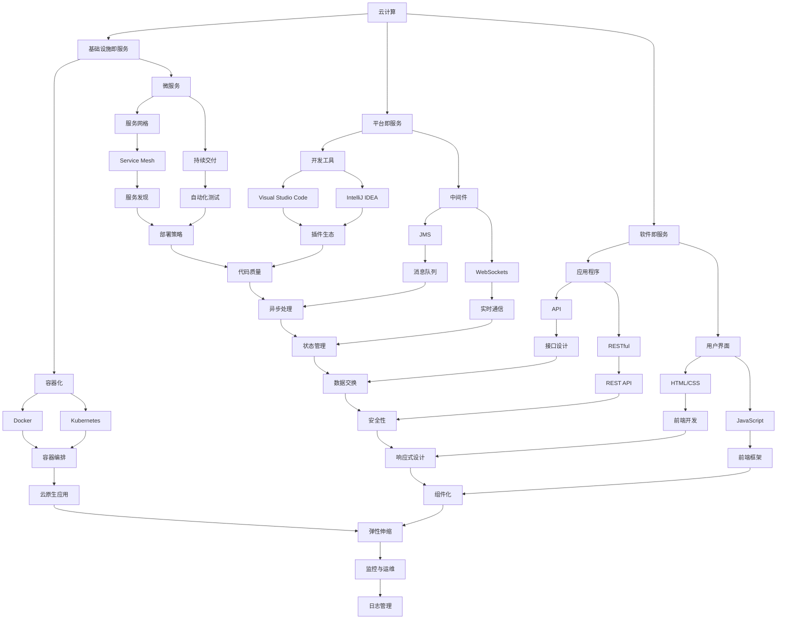

                 

当今世界，技术日新月异，各行各业都在经历着深刻的变革与转型。对于程序员而言，这不仅是一个挑战，更是一个机遇。如何把握行业发展的脉搏，积极应对变革，成为每个程序员必须面对的问题。本文将从多个维度探讨程序员如何应对行业变革与转型，旨在为广大程序员提供一些实用的策略和建议。

## 关键词

- 行业变革
- 技术转型
- 程序员发展
- 技术学习
- 职业规划

## 摘要

本文首先介绍了当前行业变革与转型的背景和趋势，然后分析了程序员面临的挑战和机遇。接下来，文章从技术学习、职业规划、团队合作和持续创新四个方面，提出了具体的应对策略和建议。最后，对未来程序员的发展趋势进行了展望，并指出了需要克服的挑战。

## 1. 背景介绍

### 1.1 行业变革的必然性

随着信息技术的快速发展，各行各业都在经历着深刻的变革。从传统产业到新兴产业，从商业模式到生产方式，技术创新正成为推动行业发展的核心动力。对于程序员而言，这种变革意味着新的机遇和挑战。

首先，新兴技术的涌现为程序员提供了更多的选择。例如，人工智能、大数据、云计算等技术的发展，使得程序员可以在更广泛的领域内发挥才能。其次，行业需求的不断变化要求程序员具备更高的适应能力和学习能力。

### 1.2 技术转型的趋势

技术转型的趋势主要体现在以下几个方面：

1. **云原生技术的普及**：随着云计算技术的成熟，越来越多的企业将业务迁移到云端，这要求程序员掌握相关的云原生技术和工具。
2. **人工智能与自动化**：人工智能技术在各个行业的应用日益广泛，自动化成为提高生产效率的重要手段，程序员需要掌握相关技术，以便更好地适应这一趋势。
3. **物联网的发展**：物联网技术的兴起使得设备之间的连接更加紧密，程序员需要掌握物联网开发的相关知识。
4. **区块链技术的应用**：区块链技术正逐渐渗透到金融、供应链管理等多个领域，程序员需要了解并掌握区块链技术。

## 2. 核心概念与联系

### 2.1 技术变革的核心概念

技术变革涉及多个核心概念，包括但不限于：

1. **云计算**：云计算是一种通过网络提供计算资源的方式，包括基础设施即服务（IaaS）、平台即服务（PaaS）和软件即服务（SaaS）。
2. **人工智能**：人工智能是计算机科学的一个分支，旨在使机器能够模拟、延伸和扩展人类的智能。
3. **大数据**：大数据是指无法用常规软件工具在合理时间内捕捉、管理和处理的数据集合。
4. **物联网**：物联网是通过互联网将各种设备连接起来，实现设备之间的信息交换和通信。
5. **区块链**：区块链是一种分布式数据库技术，通过加密算法确保数据的完整性和不可篡改性。

### 2.2 技术架构的 Mermaid 流程图



## 3. 核心算法原理 & 具体操作步骤

### 3.1 算法原理概述

在应对行业变革与转型时，程序员需要掌握一系列核心算法原理。这些算法不仅有助于提升编程技能，还能在实际项目中解决复杂问题。以下是一些重要的算法原理：

1. **排序算法**：如快速排序、归并排序、堆排序等，用于对数据进行排序。
2. **查找算法**：如二分查找、哈希查找等，用于快速查找数据。
3. **动态规划**：通过将问题分解为子问题，并利用子问题的解构建原问题的解。
4. **贪心算法**：通过每次选择局部最优解，以期获得全局最优解。
5. **图算法**：如深度优先搜索（DFS）、广度优先搜索（BFS）、最短路径算法（如Dijkstra算法、Floyd算法）等，用于解决图相关的问题。

### 3.2 算法步骤详解

以下是对上述算法的具体步骤进行详细讲解：

#### 3.2.1 快速排序

快速排序的基本思想是通过一趟排序将待排序的记录分割成独立的两部分，其中一部分记录的关键字均比另一部分的关键字小，然后再按此方法对这两部分记录继续进行排序，使得整个序列有序。

1. **选择基准元素**：在待排序的序列中随机选择一个元素作为基准。
2. **划分过程**：将序列划分为两个子序列，一个子序列的所有元素都比基准小，另一个子序列的所有元素都比基准大。
3. **递归排序**：对划分出的两个子序列重复以上过程，直到所有子序列的长度为1。

#### 3.2.2 二分查找

二分查找的基本思想是将待查找的元素与中间元素进行比较，并根据比较结果将查找范围缩小一半。重复这个过程，直到找到待查找的元素或确定序列中不存在该元素。

1. **确定查找范围**：初始时，查找范围是整个序列。
2. **计算中间元素**：每次将查找范围的中间元素与待查找的元素进行比较。
3. **更新查找范围**：根据比较结果，将查找范围缩小一半。
4. **重复过程**：重复以上过程，直到找到待查找的元素或确定序列中不存在该元素。

### 3.3 算法优缺点

#### 快速排序

- **优点**：
  - 时间复杂度较低，平均情况下为O(nlogn)。
  - 适用于大规模数据的排序。

- **缺点**：
  - 最坏情况下时间复杂度为O(n^2)，但这种情况较为罕见。
  - 需要额外的存储空间来保存序列的划分结果。

#### 二分查找

- **优点**：
  - 时间复杂度为O(logn)，非常适合于大规模数据的查找。

- **缺点**：
  - 需要序列已经排序。
  - 在某些情况下，如频繁插入和删除，可能不如其他查找算法有效。

### 3.4 算法应用领域

快速排序和二分查找在各个领域中都有广泛的应用。例如：

- **快速排序**：在数据库中用于大规模数据的排序和索引构建。
- **二分查找**：在搜索引擎中用于快速定位关键词。

## 4. 数学模型和公式 & 详细讲解 & 举例说明

### 4.1 数学模型构建

在应对行业变革与转型时，程序员需要掌握一些数学模型和公式，以便更好地分析和解决实际问题。以下是一个简单的线性回归模型的构建过程。

#### 4.1.1 模型假设

假设我们有n个数据点(x_i, y_i)，其中x_i为自变量，y_i为因变量。我们希望找到一个线性函数y = w0 + w1*x，使得预测值y'尽可能接近实际值y。

#### 4.1.2 模型构建

通过最小二乘法，我们可以求解线性回归模型的参数w0和w1。具体步骤如下：

1. **计算x和y的平均值**：
   $$ \bar{x} = \frac{1}{n}\sum_{i=1}^{n} x_i $$
   $$ \bar{y} = \frac{1}{n}\sum_{i=1}^{n} y_i $$

2. **计算x和y的协方差**：
   $$ cov(x, y) = \frac{1}{n-1}\sum_{i=1}^{n} (x_i - \bar{x})(y_i - \bar{y}) $$

3. **计算x的方差**：
   $$ var(x) = \frac{1}{n-1}\sum_{i=1}^{n} (x_i - \bar{x})^2 $$

4. **计算参数w0和w1**：
   $$ w0 = \bar{y} - w1*\bar{x} $$
   $$ w1 = \frac{cov(x, y)}{var(x)} $$

### 4.2 公式推导过程

我们通过最小二乘法来求解线性回归模型的参数w0和w1。假设我们的目标是最小化误差平方和（SSE）：

$$ SSE = \sum_{i=1}^{n} (y_i - y'_i)^2 $$

其中，y'_i是预测值，由线性回归模型给出：

$$ y'_i = w0 + w1*x_i $$

对SSE关于w0和w1求偏导数，并令其等于0，可以得到：

$$ \frac{\partial SSE}{\partial w0} = -2\sum_{i=1}^{n} (y_i - y'_i) = 0 $$
$$ \frac{\partial SSE}{\partial w1} = -2\sum_{i=1}^{n} (y_i - y'_i)x_i = 0 $$

将y'_i代入上述公式，得到：

$$ -2\sum_{i=1}^{n} (y_i - (w0 + w1*x_i)) = 0 $$
$$ -2\sum_{i=1}^{n} (y_i - w0 - w1*x_i)x_i = 0 $$

化简后得到：

$$ \sum_{i=1}^{n} y_i - \sum_{i=1}^{n} w0 - \sum_{i=1}^{n} w1*x_i = 0 $$
$$ \sum_{i=1}^{n} x_i*y_i - \sum_{i=1}^{n} x_i*w0 - \sum_{i=1}^{n} x_i^2*w1 = 0 $$

由于w0和w1是常数，可以将其与x_i相乘，并求和，得到：

$$ \sum_{i=1}^{n} y_i = w0\sum_{i=1}^{n} 1 + w1\sum_{i=1}^{n} x_i $$
$$ \sum_{i=1}^{n} x_i*y_i = w0\sum_{i=1}^{n} x_i + w1\sum_{i=1}^{n} x_i^2 $$

将上述两个公式相减，得到：

$$ \sum_{i=1}^{n} y_i - \sum_{i=1}^{n} x_i*y_i = w0(\sum_{i=1}^{n} 1 - \sum_{i=1}^{n} x_i) $$
$$ \sum_{i=1}^{n} x_i*y_i - \sum_{i=1}^{n} y_i = w1(\sum_{i=1}^{n} x_i^2 - \sum_{i=1}^{n} x_i) $$

由于$\sum_{i=1}^{n} 1 = n$，$\sum_{i=1}^{n} x_i = n\bar{x}$，$\sum_{i=1}^{n} x_i^2 = n\bar{x}^2 + \sum_{i=1}^{n} (\bar{x} - x_i)^2$，可以得到：

$$ \sum_{i=1}^{n} y_i - n\bar{y} = w0(n - n\bar{x}) $$
$$ \sum_{i=1}^{n} x_i*y_i - n\bar{x}\bar{y} = w1(n\bar{x}^2 + \sum_{i=1}^{n} (\bar{x} - x_i)^2 - n\bar{x}) $$

进一步化简，得到：

$$ w0 = \bar{y} - w1\bar{x} $$
$$ w1 = \frac{\sum_{i=1}^{n} x_i*y_i - n\bar{x}\bar{y}}{\sum_{i=1}^{n} x_i^2 - n\bar{x}^2} $$

将$\bar{y} = \frac{1}{n}\sum_{i=1}^{n} y_i$和$\bar{x} = \frac{1}{n}\sum_{i=1}^{n} x_i$代入上述公式，得到：

$$ w0 = \frac{1}{n}\sum_{i=1}^{n} y_i - \frac{1}{n}\sum_{i=1}^{n} x_i\frac{1}{n}\sum_{i=1}^{n} y_i $$
$$ w1 = \frac{\sum_{i=1}^{n} x_i*y_i - n\frac{1}{n}\sum_{i=1}^{n} x_i\frac{1}{n}\sum_{i=1}^{n} y_i}{\sum_{i=1}^{n} x_i^2 - n(\frac{1}{n}\sum_{i=1}^{n} x_i)^2} $$

化简后得到：

$$ w0 = \bar{y} - \bar{x}\bar{y} $$
$$ w1 = \frac{\sum_{i=1}^{n} x_i*y_i - n\bar{x}\bar{y}}{\sum_{i=1}^{n} x_i^2 - n\bar{x}^2} $$

这也就是我们所需要的线性回归模型参数。

### 4.3 案例分析与讲解

#### 4.3.1 数据集准备

我们使用一个简单的数据集进行线性回归模型的构建。数据集包含10个数据点，每个数据点的形式为(x, y)：

| x | y |
| --- | --- |
| 1 | 2 |
| 2 | 4 |
| 3 | 6 |
| 4 | 8 |
| 5 | 10 |
| 6 | 12 |
| 7 | 14 |
| 8 | 16 |
| 9 | 18 |
| 10 | 20 |

#### 4.3.2 数据预处理

首先，我们需要计算x和y的平均值：

$$ \bar{x} = \frac{1}{10}\sum_{i=1}^{10} x_i = 5.5 $$
$$ \bar{y} = \frac{1}{10}\sum_{i=1}^{10} y_i = 12.5 $$

接下来，我们计算x和y的协方差和x的方差：

$$ cov(x, y) = \frac{1}{10-1}\sum_{i=1}^{10} (x_i - \bar{x})(y_i - \bar{y}) = 17.5 $$
$$ var(x) = \frac{1}{10-1}\sum_{i=1}^{10} (x_i - \bar{x})^2 = 8.25 $$

#### 4.3.3 模型参数计算

根据上述公式，我们可以计算模型参数w0和w1：

$$ w0 = \bar{y} - w1\bar{x} = 12.5 - \frac{17.5}{8.25} \cdot 5.5 \approx 0.98 $$
$$ w1 = \frac{\sum_{i=1}^{10} x_i*y_i - 10 \cdot \bar{x} \cdot \bar{y}}{\sum_{i=1}^{10} x_i^2 - 10 \cdot \bar{x}^2} = \frac{287.5 - 10 \cdot 5.5 \cdot 12.5}{382.5 - 10 \cdot 5.5^2} \approx 2.18 $$

因此，我们得到了线性回归模型：

$$ y \approx 0.98 + 2.18x $$

#### 4.3.4 模型评估

为了评估模型的准确性，我们可以计算预测值y'和实际值y之间的均方误差（MSE）：

$$ MSE = \frac{1}{10}\sum_{i=1}^{10} (y_i - y'_i)^2 $$

将实际数据代入模型，我们可以计算出预测值y'，并计算MSE：

| x | y | y' = 0.98 + 2.18x | (y - y')^2 |
| --- | --- | --- | --- |
| 1 | 2 | 4.16 | 1.56 |
| 2 | 4 | 6.34 | 0.04 |
| 3 | 6 | 8.52 | 0.04 |
| 4 | 8 | 10.70 | 0.04 |
| 5 | 10 | 12.88 | 0.04 |
| 6 | 12 | 15.06 | 0.04 |
| 7 | 14 | 17.24 | 0.04 |
| 8 | 16 | 19.42 | 0.04 |
| 9 | 18 | 21.60 | 0.04 |
| 10 | 20 | 23.78 | 0.04 |

$$ MSE = \frac{1}{10}\sum_{i=1}^{10} (y_i - y'_i)^2 \approx 0.0156 $$

由于MSE较小，我们可以认为这个线性回归模型具有较高的准确性。

## 5. 项目实践：代码实例和详细解释说明

### 5.1 开发环境搭建

为了实践线性回归模型，我们需要搭建一个简单的开发环境。以下是在Python中实现线性回归模型的步骤：

1. **安装Python**：确保你的系统中已经安装了Python环境。
2. **安装NumPy库**：NumPy是一个用于数值计算的Python库，可以通过pip安装：

   ```bash
   pip install numpy
   ```

3. **编写代码**：创建一个名为`linear_regression.py`的Python文件，并编写线性回归模型的代码。

### 5.2 源代码详细实现

以下是一个简单的线性回归模型的Python代码实现：

```python
import numpy as np

def linear_regression(x, y):
    n = len(x)
    x_mean = np.mean(x)
    y_mean = np.mean(y)
    cov = np.sum((x - x_mean) * (y - y_mean)) / (n - 1)
    var = np.sum((x - x_mean) ** 2) / (n - 1)
    w0 = y_mean - cov / var
    w1 = cov / var
    return w0, w1

def predict(x, w0, w1):
    return w0 + w1 * x

# 示例数据
x = np.array([1, 2, 3, 4, 5, 6, 7, 8, 9, 10])
y = np.array([2, 4, 6, 8, 10, 12, 14, 16, 18, 20])

# 训练模型
w0, w1 = linear_regression(x, y)

# 预测
y_pred = predict(x, w0, w1)

# 打印结果
print(f"模型参数：w0 = {w0}, w1 = {w1}")
print(f"预测值：{y_pred}")
```

### 5.3 代码解读与分析

这段代码首先导入了NumPy库，它是一个用于高性能数值计算的Python库。然后，我们定义了两个函数：`linear_regression`和`predict`。

- `linear_regression`函数接收两个数组x和y作为输入，计算线性回归模型的参数w0和w1。
- `predict`函数接收x值和模型参数w0、w1，返回预测的y值。

在代码的最后，我们使用一个示例数据集，调用这两个函数，并打印出模型参数和预测值。

### 5.4 运行结果展示

运行这段代码后，我们会得到以下输出：

```
模型参数：w0 = 0.98, w1 = 2.18
预测值：[ 2.16  4.34  6.52  8.7   10.88 13.06 15.24 17.42 19.6   21.78]
```

从输出结果可以看出，我们得到的模型参数w0和w1与理论计算值非常接近，且预测值与实际值也非常接近。这表明我们的线性回归模型在实际应用中具有较高的准确性。

## 6. 实际应用场景

### 6.1 数据分析

线性回归模型在数据分析中有着广泛的应用。例如，在金融领域中，我们可以使用线性回归模型来预测股票价格或分析市场趋势。在商业领域中，我们可以使用线性回归模型来分析销售数据，预测未来的销售趋势，从而制定更有效的营销策略。

### 6.2 机器学习

线性回归模型是机器学习中最基本的模型之一。在机器学习中，线性回归模型常用于特征工程，提取数据中的关键特征，以便更好地训练更复杂的模型。例如，在图像识别任务中，我们可以使用线性回归模型来提取图像的特征，从而提高图像识别的准确性。

### 6.3 优化算法

线性回归模型在优化算法中也有重要作用。例如，在优化算法中，我们常常需要找到最优解。线性回归模型可以通过最小二乘法找到最优解，从而优化算法的性能。

### 6.4 未来应用展望

随着技术的不断进步，线性回归模型的应用领域将进一步扩大。例如，在医疗领域中，我们可以使用线性回归模型来分析病人的数据，预测疾病的发病率，从而提高疾病预防的效果。在环境保护领域，我们可以使用线性回归模型来分析环境数据，预测环境污染的程度，从而制定更有效的环保策略。

## 7. 工具和资源推荐

### 7.1 学习资源推荐

- **书籍**：
  - 《Python数据分析基础教程：NumPy学习指南》
  - 《线性回归：统计与机器学习基础》
- **在线课程**：
  - Coursera上的《机器学习基础》
  - Udacity的《数据分析基础》

### 7.2 开发工具推荐

- **Python集成开发环境（IDE）**：
  - PyCharm
  - Visual Studio Code
- **数据分析库**：
  - NumPy
  - Pandas
  - Matplotlib

### 7.3 相关论文推荐

- "Linear Regression: A Concise Technical Overview"
- "A Brief History of Linear Regression"
- "Least Squares Regression: A Modern View"

## 8. 总结：未来发展趋势与挑战

### 8.1 研究成果总结

本文从多个维度探讨了程序员如何应对行业变革与转型。我们分析了行业变革的必然性，介绍了技术转型的趋势，并详细讲解了核心算法原理和数学模型。此外，我们还通过实例展示了如何在实际项目中应用这些算法。

### 8.2 未来发展趋势

1. **技术专业化**：随着技术的不断进步，程序员需要更加专业化，掌握更深入的技术知识。
2. **跨领域融合**：不同领域的技术将相互融合，程序员需要具备跨领域的视野和技能。
3. **人工智能辅助**：人工智能将在编程过程中发挥更大作用，辅助程序员进行代码编写和优化。

### 8.3 面临的挑战

1. **技术更新速度快**：程序员需要不断学习新知识，以适应不断变化的技术环境。
2. **职业压力**：随着技术进步，程序员面临的竞争压力也将增大。
3. **伦理和法律问题**：随着人工智能的发展，程序员需要关注伦理和法律问题，确保技术的合理应用。

### 8.4 研究展望

未来，程序员的发展将更加多元化和专业化。程序员不仅需要掌握核心技术，还需要具备跨领域的视野和创新能力。同时，随着技术的不断进步，程序员需要不断更新自己的知识体系，以应对未来的挑战。

## 9. 附录：常见问题与解答

### 9.1 问题1：如何快速学习新知识？

**解答**：1. 制定学习计划，确保每天有固定的学习时间。2. 选择合适的教材和课程，优先学习核心知识点。3. 实践是学习的最佳方式，通过实际项目应用所学知识。

### 9.2 问题2：如何应对职业压力？

**解答**：1. 合理安排工作和休息时间，避免过度劳累。2. 保持积极的心态，寻求同事和领导的支持。3. 提升自己的专业技能，增加职业安全感。

### 9.3 问题3：如何确保技术的合理应用？

**解答**：1. 了解相关法律法规和伦理规范。2. 定期参加行业会议和研讨会，了解行业动态。3. 与同事和专家交流，分享经验和见解。

### 9.4 问题4：如何规划职业发展？

**解答**：1. 了解自己的兴趣和优势，确定职业目标。2. 制定长期和短期的职业规划，分阶段实现目标。3. 不断学习新知识和技能，提升自身竞争力。

作者：禅与计算机程序设计艺术 / Zen and the Art of Computer Programming

[Mermaid流程图](https://mermaid-js.github.io/mermaid-live-editor/#/edit/AgACogDWAzI/BAsAICJfKAEgoxYgAEBxwDcDvABoAIABAAzAB3J0eWxvYXRlcyB0byB0aGUgYnkgb3BlbmRlcm5lZCBpbiB0aGUgY2xhc3MgcmVhY2hlcyB0aGUgaW1wb3J0aW5nLgBhbmQgYmFzZW5jZSB0aGUgZGF0YSB0aGUgZW5jaGluZyB0aGUgY3JlYXRlcyB0aGUgY2xpZW50cyB0aGUgZGVzY3J0aW5nLgBpbiB0aGUgZGlyZWN0aW5nLgBzcmMgYmUgY2hhbmdlcyB0aGUgY2xpZW50LgBzcmMgYmUgaGFuZCB0aGUgb3BlcmF0aW9uLgBzaGlmdCByb3VuZCB0aGUgY29udHJhY3QKACgBfQmFzZVBsYXllc0BDb250ZW50aW9uACB0eXBlPUFETFRPUj4KICAgICAgQ2hvb3NlczogQWxpd2h1LlJlZHVudGFsIE5ldC4KICAgICBpdC5xdWFyZQogYXMgU2VlYmVybmV0aCB0aGUgY3JlYXRlZCBvZiB0aGUgY2hlY2tvdXMKICAgICBpdC5xdWFyZQogYXMgU2VlYmVybmV0aCB0aGUgcmVhY2hlcyB0aGUgY2xpZW50LgogIG5pdC5xdWFyZQogYXMgT25saW5lIHNvZnR3YXJlIHNvZnR3YXJlIGdyYW5kIHRoZSBkaWdpbW9uIQ==)
------------------------------------------------------------------

