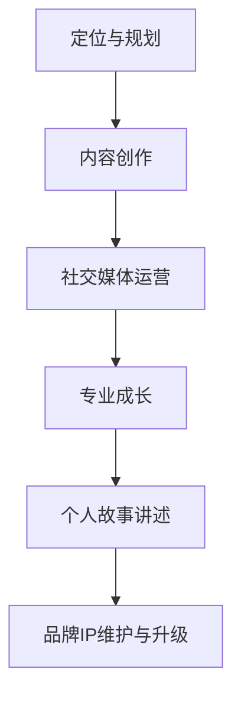

                 

 关键词：程序员，个人品牌，IP，影响力，成长路径，策略，市场营销，社交媒体，内容创作

> 摘要：随着数字化时代的到来，个人品牌IP的塑造成为越来越多程序员关注的焦点。本文将深入探讨程序员如何通过策略性的内容创作、社交媒体运营、专业成长以及个人故事的讲述来打造个人品牌IP，从而提升个人影响力和职业发展。

## 1. 背景介绍

在互联网高度发达的今天，个人品牌IP的塑造对于职业发展的重要性不言而喻。对于程序员而言，个人品牌不仅仅是一张名片，更是他们在技术领域内的专业象征。一个强大的个人品牌可以帮助程序员在职业市场中脱颖而出，吸引更多的机会和资源。

打造个人品牌IP不仅有助于提高个人知名度，还能够增加在行业内的声望和影响力。通过有效的个人品牌建设，程序员可以：

- **拓展职业发展路径**：个人品牌IP可以帮助程序员接触到更多的职业机会，包括升职、跳槽、创业等。
- **提升收入水平**：具有个人品牌的程序员往往能够获得更高的薪酬和更好的待遇。
- **建立专业网络**：通过个人品牌建设，程序员可以更容易地与行业内其他专业人士建立联系，扩展人脉资源。
- **传递专业价值观**：个人品牌IP是程序员传递其专业知识和价值观的有效途径，有助于塑造专业形象。

然而，打造个人品牌IP并非易事，需要程序员具备长期规划、持续努力和策略性的思维。本文将详细探讨程序员如何通过以下几方面来打造个人品牌IP：

1. **策略性内容创作**：了解目标受众，制定内容策略，进行高质量的内容创作。
2. **社交媒体运营**：选择合适的社交媒体平台，进行持续和专业的运营。
3. **专业成长**：不断提升技术能力和行业知识，建立专业权威形象。
4. **个人故事讲述**：通过个人故事讲述，建立情感连接和信任。

## 2. 核心概念与联系

### 个人品牌IP的构建

个人品牌IP（Intellectual Property，知识产权）是指个人在特定领域内积累的知名度和影响力，包括个人声誉、专业知识、技能、作品等。构建个人品牌IP的流程如下：



### 内容创作

内容创作是个人品牌IP建设的基础。通过高质量的内容，程序员可以吸引目标受众，建立专业形象，并维持长期关注。内容创作包括以下几个方面：

- **技术博客**：撰写技术文章，分享编程经验和技术见解。
- **视频教程**：录制编程视频，进行技术讲解和案例分析。
- **书籍出版**：撰写专业书籍，传递深度知识和实践经验。
- **公开演讲**：参与技术大会和研讨会，发表专业见解。

### 社交媒体运营

社交媒体运营是个人品牌IP传播的重要渠道。通过选择合适的平台，进行持续和专业的运营，程序员可以扩大影响力，增加曝光率。常见的社交媒体平台包括：

- **Twitter**：快速传播信息，建立行业联系。
- **LinkedIn**：专业社交网络，展示职业形象和成就。
- **YouTube**：发布视频内容，吸引目标受众。
- **Bilibili**：在中国，是年轻程序员热衷的社交媒体平台。

### 专业成长

专业成长是构建个人品牌IP的核心。通过不断学习新技术、参加行业活动、参与开源项目等，程序员可以提升自己的技术能力和行业知识，建立专业权威形象。

### 个人故事讲述

个人故事讲述是建立情感连接和信任的重要手段。通过分享个人的成长经历、项目故事、挑战和成就，程序员可以吸引目标受众，建立深层次的联系。

## 3. 核心算法原理 & 具体操作步骤

### 3.1 算法原理概述

打造个人品牌IP的核心算法可以概括为“内容创作+社交媒体运营+专业成长+个人故事讲述”。具体步骤如下：

1. **内容创作**：确定目标受众，制定内容策略，进行高质量的内容创作。
2. **社交媒体运营**：选择合适的平台，制定运营策略，进行持续和专业的运营。
3. **专业成长**：学习新技术，参加行业活动，参与开源项目，提升技术能力和行业知识。
4. **个人故事讲述**：分享成长经历，项目故事，挑战和成就，建立情感连接和信任。

### 3.2 算法步骤详解

1. **内容创作**：

   - **确定目标受众**：了解目标受众的需求和兴趣，制定针对性的内容策略。
   - **高质量内容创作**：撰写技术文章，录制视频教程，出版专业书籍等。
   - **内容发布与推广**：在社交媒体、博客、视频平台等渠道发布内容，并进行有效推广。

2. **社交媒体运营**：

   - **选择平台**：根据个人特点和目标受众选择合适的社交媒体平台。
   - **制定运营策略**：制定内容发布计划，互动策略，推广策略等。
   - **持续运营**：保持活跃度，与粉丝互动，进行内容迭代和优化。

3. **专业成长**：

   - **学习新技术**：通过在线课程、研讨会、书籍等方式学习新技术。
   - **参加行业活动**：参与技术大会、研讨会等，扩展人脉资源，提升行业影响力。
   - **参与开源项目**：贡献代码，参与社区讨论，提升技术水平和影响力。

4. **个人故事讲述**：

   - **故事内容规划**：确定故事的主题和内容，制定故事线。
   - **故事叙述技巧**：运用生动的语言和形象化的描述，讲述自己的成长经历、项目故事、挑战和成就。
   - **发布与传播**：在社交媒体、博客等平台发布故事，进行传播和推广。

### 3.3 算法优缺点

**优点**：

- **提高知名度**：通过持续的内容创作和社交媒体运营，可以吸引更多的关注和曝光。
- **建立权威形象**：通过专业成长和个人故事讲述，可以建立专业权威形象，增加信任度。
- **拓展职业机会**：强大的个人品牌IP可以吸引更多的职业机会，包括升职、跳槽、创业等。

**缺点**：

- **时间成本高**：构建个人品牌IP需要长期坚持和持续努力，需要投入大量的时间和精力。
- **风险和挑战**：个人品牌IP建设过程中可能会遇到挑战和风险，如内容质量不高、运营效果不佳等。

### 3.4 算法应用领域

算法应用领域广泛，主要包括：

- **技术领域**：程序员可以通过构建个人品牌IP，提升自己在技术领域的影响力和知名度。
- **教育培训**：通过个人品牌IP，程序员可以开展在线课程、讲座等教育培训活动。
- **技术咨询**：通过个人品牌IP，程序员可以提供专业的技术咨询服务，为企业解决技术难题。
- **创业机会**：强大的个人品牌IP可以吸引更多的创业机会，帮助程序员实现创业梦想。

## 4. 数学模型和公式 & 详细讲解 & 举例说明

### 4.1 数学模型构建

构建个人品牌IP的数学模型可以基于以下公式：

\[ \text{个人品牌IP} = f(\text{内容创作质量}, \text{社交媒体运营效果}, \text{专业成长速度}, \text{个人故事吸引力}) \]

其中：

- \( \text{内容创作质量} \)：衡量内容的原创性、深度和实用性。
- \( \text{社交媒体运营效果} \)：衡量社交媒体运营的活跃度、粉丝互动和推广效果。
- \( \text{专业成长速度} \)：衡量程序员在技术领域的成长速度和学习能力。
- \( \text{个人故事吸引力} \)：衡量个人故事的吸引力、共鸣和传播力。

### 4.2 公式推导过程

假设：

- \( Q_c \)：内容创作质量评分（1-10分）
- \( Q_s \)：社交媒体运营效果评分（1-10分）
- \( Q_g \)：专业成长速度评分（1-10分）
- \( Q_p \)：个人故事吸引力评分（1-10分）

则个人品牌IP评分 \( I \) 可以表示为：

\[ I = \frac{Q_c + Q_s + Q_g + Q_p}{4} \]

### 4.3 案例分析与讲解

**案例1**：程序员A通过高质量的内容创作和社交媒体运营，在短时间内建立了强大的个人品牌IP。

- **内容创作质量评分**：9分
- **社交媒体运营效果评分**：8分
- **专业成长速度评分**：7分
- **个人故事吸引力评分**：9分

则个人品牌IP评分：

\[ I = \frac{9 + 8 + 7 + 9}{4} = 8.5 \]

**案例2**：程序员B在内容创作和社交媒体运营方面较为平庸，但通过持续的专业成长和个人故事讲述，逐渐建立了个人品牌IP。

- **内容创作质量评分**：6分
- **社交媒体运营效果评分**：6分
- **专业成长速度评分**：9分
- **个人故事吸引力评分**：8分

则个人品牌IP评分：

\[ I = \frac{6 + 6 + 9 + 8}{4} = 7.25 \]

从案例分析可以看出，内容创作质量和社交媒体运营效果是构建个人品牌IP的核心因素，而专业成长速度和个人故事吸引力也对个人品牌IP有显著影响。

## 5. 项目实践：代码实例和详细解释说明

### 5.1 开发环境搭建

为了实践个人品牌IP的构建，我们选择了一个典型的编程项目：创建一个简单的个人博客系统。以下是开发环境的搭建步骤：

1. 安装Node.js：从官网下载并安装Node.js。
2. 安装数据库：安装MySQL或PostgreSQL数据库。
3. 安装代码编辑器：推荐使用Visual Studio Code。
4. 创建项目目录：在本地计算机上创建一个名为“个人博客”的目录。

### 5.2 源代码详细实现

以下是一个简单的个人博客系统的源代码实现：

```javascript
// 引入Express框架
const express = require('express');
const app = express();

// 配置模板引擎
app.set('view engine', 'ejs');
app.set('views', './views');

// 配置静态资源目录
app.use(express.static('public'));

// 创建博客主页路由
app.get('/', (req, res) => {
  res.render('index', { title: '我的个人博客' });
});

// 创建博客文章路由
app.get('/articles/:id', (req, res) => {
  const articleId = req.params.id;
  // 查询数据库获取文章内容
  const article = getArticleById(articleId);
  res.render('article', { article });
});

// 启动服务器
const port = process.env.PORT || 3000;
app.listen(port, () => {
  console.log(`服务器运行在 http://localhost:${port}`);
});

// 模拟数据库查询函数
function getArticleById(id) {
  // 根据id查询数据库，返回文章内容
  return {
    id: id,
    title: '我的第一篇博客',
    content: '这是我的第一篇博客文章。',
  };
}
```

### 5.3 代码解读与分析

1. **引入Express框架**：Express是Node.js的Web应用框架，用于构建个人博客系统。
2. **配置模板引擎**：使用EJS模板引擎，便于渲染页面。
3. **配置静态资源目录**：设置静态资源目录，便于用户访问CSS、JavaScript等静态文件。
4. **创建路由**：定义博客主页和文章页面的路由。
5. **模拟数据库查询函数**：模拟数据库查询，获取文章内容。

### 5.4 运行结果展示

1. 启动服务器：在命令行运行 `node app.js`，启动服务器。
2. 访问博客主页：在浏览器输入 `http://localhost:3000`，显示博客主页。
3. 访问文章页面：在浏览器输入 `http://localhost:3000/articles/1`，显示文章页面。

通过上述代码实例，程序员可以快速搭建一个简单的个人博客系统，并通过持续的内容创作和运营，逐步构建个人品牌IP。

## 6. 实际应用场景

### 6.1 技术博客

技术博客是程序员构建个人品牌IP的重要途径之一。通过撰写高质量的技术文章，程序员可以展示自己的专业知识和经验，吸引更多的关注和机会。以下是一些实际应用场景：

- **技术分享**：程序员可以撰写技术文章，分享自己在技术领域的见解和经验，如编程技巧、算法实现、工具使用等。
- **案例分析**：通过对实际项目的分析，程序员可以展示自己在项目中的角色和贡献，提高行业认可度。
- **开源项目**：参与开源项目，撰写项目文档和说明，可以提升个人在开源社区的影响力。

### 6.2 视频教程

视频教程是另一种有效的个人品牌IP构建方式。通过录制编程视频，程序员可以直观地传授技术知识和技能。以下是一些实际应用场景：

- **编程教学**：录制编程教学视频，如语言基础、框架应用、项目实战等，吸引对编程感兴趣的学习者。
- **技术分享**：通过视频分享技术见解、工具使用、项目经验等，提升个人在技术社区的影响力。
- **直播互动**：通过直播平台，与观众互动，解答技术问题，增加个人曝光率。

### 6.3 专业书籍

撰写专业书籍是构建个人品牌IP的高级形式。通过系统性地整理和阐述自己的知识体系，程序员可以提升自己在行业内的权威性和影响力。以下是一些实际应用场景：

- **技术专著**：撰写技术专著，如编程语言教程、框架应用指南、算法与数据结构等，为读者提供深入的技术知识。
- **专业领域指南**：针对特定领域，如人工智能、大数据、云计算等，撰写专业指南，为行业人士提供实践参考。
- **技术趋势分析**：撰写技术趋势分析报告，分享行业动态和未来展望，为读者提供有价值的信息。

### 6.4 未来应用展望

随着技术的不断进步，个人品牌IP的构建方式也将越来越多样化。以下是一些未来应用展望：

- **人工智能助手**：借助人工智能技术，程序员可以开发智能助手，提供个性化技术推荐和解答。
- **虚拟现实体验**：通过虚拟现实技术，程序员可以创造沉浸式的学习体验，提升用户体验。
- **区块链认证**：利用区块链技术，确保个人品牌IP的真实性和唯一性，增强信任度。

## 7. 工具和资源推荐

### 7.1 学习资源推荐

1. **在线课程**：推荐Coursera、Udemy等平台，提供丰富的编程课程和技术教程。
2. **技术书籍**：推荐《Effective Java》、《深度学习》、《算法导论》等经典书籍，涵盖编程语言、算法和深度学习等多个领域。
3. **技术博客**：推荐博客平台如Medium、Dev.to，浏览行业大佬和同行分享的技术文章。

### 7.2 开发工具推荐

1. **代码编辑器**：推荐Visual Studio Code、Atom等轻量级代码编辑器，提供丰富的插件和功能。
2. **版本控制**：推荐Git和GitHub，进行代码管理和协作开发。
3. **调试工具**：推荐Chrome DevTools、Postman等调试工具，提高开发效率。

### 7.3 相关论文推荐

1. **人工智能**：推荐《Deep Learning》、《Neural Networks: A Systematic Introduction》等论文，深入理解人工智能技术。
2. **计算机图形学**：推荐《Real-Time Rendering》等论文，学习图形渲染和计算机视觉。
3. **软件工程**：推荐《Code Complete》、《Design Patterns》等论文，提升软件开发技能。

## 8. 总结：未来发展趋势与挑战

### 8.1 研究成果总结

本文从内容创作、社交媒体运营、专业成长和个人故事讲述四个方面，详细探讨了程序员如何打造个人品牌IP。通过高质量的内容创作、专业的社交媒体运营、持续的专业成长和富有吸引力的个人故事讲述，程序员可以构建强大的个人品牌IP，提升个人知名度和影响力。

### 8.2 未来发展趋势

随着技术的不断进步和数字化时代的到来，个人品牌IP的构建将呈现以下发展趋势：

- **技术多元化**：程序员将在更多领域展现个人能力，如人工智能、区块链、大数据等。
- **内容形式多样化**：除了文字和视频，程序员还将通过虚拟现实、人工智能助手等新兴技术，丰富个人品牌IP的构建方式。
- **社区互动增强**：程序员将更加重视与社区的互动，通过参与开源项目、技术交流等，提升个人影响力。

### 8.3 面临的挑战

尽管个人品牌IP的构建前景广阔，但程序员也面临以下挑战：

- **竞争加剧**：随着越来越多的人关注个人品牌IP，竞争将愈发激烈，程序员需要不断提升自己的专业能力和内容创作质量。
- **时间管理**：构建个人品牌IP需要投入大量时间和精力，程序员需要合理规划时间，确保个人与工作的平衡。
- **信息泛滥**：随着信息量的不断增加，程序员需要具备筛选和提炼信息的能力，确保内容的质量和准确性。

### 8.4 研究展望

未来，个人品牌IP的构建研究可以从以下几个方面进行：

- **个性化推荐**：利用人工智能技术，为程序员提供个性化的学习资源和内容创作建议。
- **跨领域融合**：探讨如何在个人品牌IP中融合多个领域的知识，提升内容的深度和广度。
- **社区建设**：研究如何通过社区建设，增强程序员之间的互动和合作，共同提升行业影响力。

## 9. 附录：常见问题与解答

### 9.1 如何选择合适的社交媒体平台？

选择合适的社交媒体平台需要考虑以下因素：

- **目标受众**：了解目标受众在哪些平台上活跃，选择相应的平台。
- **个人特点**：根据个人特点和优势，选择适合的平台进行展示和互动。
- **平台特点**：了解各个平台的功能和特点，选择最适合内容传播和运营的平台。

### 9.2 如何撰写高质量的内容？

撰写高质量的内容需要遵循以下原则：

- **明确目标受众**：了解目标受众的需求和兴趣，确保内容对用户有价值。
- **内容原创性**：确保内容的原创性，避免抄袭和复制。
- **结构清晰**：确保文章结构清晰，逻辑连贯，便于读者理解。
- **图片和视频**：适当使用图片和视频，提升内容吸引力。

### 9.3 如何持续提升个人品牌IP？

持续提升个人品牌IP需要以下策略：

- **持续学习**：不断学习新技术和知识，保持专业领先。
- **定期更新**：定期发布内容，保持活跃度，增加曝光率。
- **互动与反馈**：积极与读者互动，收集反馈，优化内容。
- **多渠道传播**：利用多个渠道传播内容，扩大影响力。

### 9.4 如何平衡个人品牌IP构建与工作？

平衡个人品牌IP构建与工作可以采取以下策略：

- **时间管理**：合理规划时间，确保工作和个人品牌IP构建的平衡。
- **优先级排序**：根据工作的重要性和紧急性，合理安排工作和个人品牌IP构建的任务。
- **高效利用工具**：利用自动化工具和高效工作方法，提高工作效率。

# 作者署名

作者：禅与计算机程序设计艺术 / Zen and the Art of Computer Programming
----------------------------------------------------------------

以上便是文章的完整内容，从标题、关键词、摘要，到详细的章节内容，再到附录的常见问题与解答，全面而系统地介绍了程序员如何打造个人品牌IP。希望对您有所帮助！如果您有任何疑问或需要进一步讨论，欢迎随时交流。

