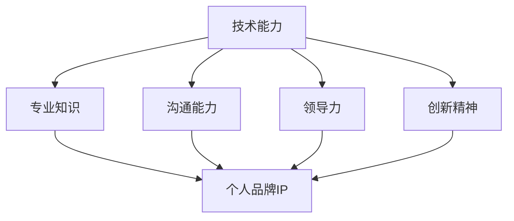
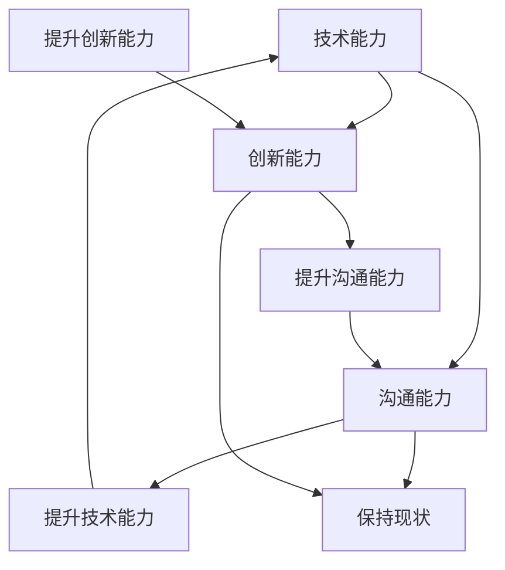

                 

## 1. 背景介绍

在数字化时代，个人品牌已经成为一种重要的资本。对于程序员而言，打造个人品牌IP不仅有助于提升个人影响力，还能为职业发展带来诸多机遇。然而，如何从众多程序员中脱颖而出，构建一个具有吸引力的个人品牌，成为了许多人关注的焦点。

本文旨在探讨程序员如何通过系统性的方法打造个人品牌IP。我们将从核心概念、核心算法、数学模型、项目实践、实际应用场景等多个角度进行分析，并提供实用的工具和资源推荐。文章结构如下：

- **1. 背景介绍**：介绍个人品牌IP的重要性及本文目的。
- **2. 核心概念与联系**：阐述个人品牌IP的核心概念及其相互关系。
- **3. 核心算法原理 & 具体操作步骤**：详细介绍打造个人品牌IP的算法原理和操作步骤。
- **4. 数学模型和公式 & 详细讲解 & 举例说明**：解析打造个人品牌IP的数学模型和公式，并结合案例进行讲解。
- **5. 项目实践：代码实例和详细解释说明**：提供具体的代码实例，详细解释实现过程。
- **6. 实际应用场景**：探讨个人品牌IP在实际中的应用。
- **7. 工具和资源推荐**：推荐相关学习资源和开发工具。
- **8. 总结：未来发展趋势与挑战**：总结研究成果，探讨未来发展趋势和面临的挑战。
- **9. 附录：常见问题与解答**：回答读者可能遇到的问题。

接下来，我们将逐一深入探讨这些内容。

## 2. 核心概念与联系

个人品牌IP（Intellectual Property）是指个人在某个领域内建立的专业形象和知识资产。对于程序员而言，个人品牌IP不仅包括技术能力，还涵盖沟通能力、领导力、创新精神等多方面素质。

### 个人品牌IP的核心概念

1. **技术能力**：程序员的核心竞争力，包括编程语言、框架、工具等专业技能。
2. **专业知识**：对某个领域的深入理解，能够为他人提供有价值的见解和解决方案。
3. **沟通能力**：有效的沟通能够帮助程序员更好地表达自己的想法，建立良好的人际关系。
4. **领导力**：领导力能够帮助程序员在团队中发挥重要作用，推动项目顺利进行。
5. **创新精神**：创新精神是程序员不断进步的动力，有助于开发出更高效、更具竞争力的解决方案。

### 个人品牌IP的相互关系

个人品牌IP的核心概念之间存在着紧密的相互关系。技术能力是基础，专业知识和技术能力的积累能够为个人品牌提供强大的支撑。而沟通能力和领导力则是个人品牌的外在表现，能够帮助程序员更好地与他人合作，推动项目成功。创新精神则是个人品牌的灵魂，能够为程序员带来持续的发展动力。

为了更好地理解个人品牌IP的核心概念和相互关系，我们可以使用Mermaid流程图进行可视化展示：



在这个流程图中，技术能力、专业知识、沟通能力、领导力和创新精神共同构成了个人品牌IP的五个核心元素。这些元素相互关联，共同作用于个人品牌的构建。

### 总结

个人品牌IP对于程序员而言至关重要。通过深入了解个人品牌IP的核心概念和相互关系，程序员可以更加系统地打造自己的个人品牌，从而在竞争激烈的职场中脱颖而出。

### 3. 核心算法原理 & 具体操作步骤

#### 3.1 算法原理概述

打造个人品牌IP的核心算法可以概括为“五步法”。这五个步骤分别是：

1. **定位自我**：明确自己的技术领域和目标受众。
2. **构建知识体系**：积累专业知识，形成自己的知识体系。
3. **提升沟通能力**：通过有效沟通建立个人品牌形象。
4. **展示领导力**：在团队中发挥领导作用，提升个人影响力。
5. **持续创新**：不断学习新知识，保持创新精神。

#### 3.2 算法步骤详解

**步骤1：定位自我**

定位自我是打造个人品牌IP的第一步。程序员需要明确自己的技术领域和目标受众。这可以通过以下几个方面进行：

- **技术领域**：根据自己的专业背景和兴趣，确定自己的技术方向。例如，前端开发、后端开发、大数据、人工智能等。
- **目标受众**：确定自己的受众群体，例如开发者、创业者、企业用户等。了解目标受众的需求和痛点，有助于更有针对性地打造个人品牌。

**步骤2：构建知识体系**

构建知识体系是提升个人品牌的重要基础。程序员需要通过学习、实践和总结，不断积累专业知识，形成自己的知识体系。以下是一些建议：

- **学习资源**：利用在线课程、技术博客、专业书籍等学习资源，不断提升自己的技能水平。
- **实践经验**：通过实际项目开发，将理论知识转化为实践能力。
- **总结分享**：将学习经验和实践心得总结成博客文章、技术讲座等，与他人分享。

**步骤3：提升沟通能力**

沟通能力是程序员打造个人品牌的关键。有效的沟通能够帮助程序员更好地表达自己的想法，建立良好的人际关系。以下是一些建议：

- **倾听**：学会倾听他人的意见和需求，更好地理解他人的想法。
- **表达**：提高自己的表达能力，清晰、准确地传达自己的观点。
- **合作**：在团队中积极参与合作，发挥自己的作用。

**步骤4：展示领导力**

展示领导力有助于提升个人品牌的影响力。程序员可以通过以下方式展示自己的领导力：

- **项目管理**：参与项目管理，提升项目组织和管理能力。
- **团队协作**：在团队中发挥协调和指导作用，推动项目顺利进行。
- **激励他人**：通过积极的激励措施，激发团队成员的潜力。

**步骤5：持续创新**

持续创新是程序员保持竞争力的关键。以下是一些建议：

- **学习新技术**：关注行业动态，学习新技术和新理念。
- **实践创新**：在实际项目中尝试创新，提高项目质量和效率。
- **分享创新**：将创新经验和成果分享给他人，提升个人影响力。

#### 3.3 算法优缺点

**优点**

- 系统性强：五步法提供了一个系统性的框架，帮助程序员有针对性地打造个人品牌。
- 可操作性高：每个步骤都有明确的操作方法和建议，便于程序员实施。

**缺点**

- 需要时间和精力：打造个人品牌需要长时间的积累和努力，对程序员的时间和精力有一定的要求。
- 风险较高：在打造个人品牌的过程中，可能面临失败和挑战，需要具备一定的心理承受能力。

#### 3.4 算法应用领域

五步法算法在程序员打造个人品牌IP的过程中具有广泛的应用领域：

- **职场发展**：通过个人品牌IP的提升，程序员可以更好地在职场中脱颖而出，获得更多发展机会。
- **项目合作**：在项目中，个人品牌IP的提升有助于程序员更好地与他人合作，推动项目成功。
- **创业**：具备个人品牌IP的程序员在创业过程中更容易获得关注和支持。

### 总结

核心算法原理与具体操作步骤为程序员打造个人品牌IP提供了清晰的路径。通过定位自我、构建知识体系、提升沟通能力、展示领导力和持续创新，程序员可以逐步构建起自己的个人品牌IP，实现职业发展和影响力的提升。

### 4. 数学模型和公式 & 详细讲解 & 举例说明

在打造个人品牌IP的过程中，数学模型和公式起着至关重要的作用。通过数学模型，我们可以量化个人品牌IP的构建过程，从而更科学地制定策略。以下是一个简单的数学模型，用于评估个人品牌IP的价值。

#### 4.1 数学模型构建

假设个人品牌IP的价值由以下三个因素决定：

1. 技术能力（Tech）  
2. 沟通能力（Comm）  
3. 创新能力（Inno）

个人品牌IP的总价值（IP）可以表示为：

$$
IP = f(Tech, Comm, Inno)
$$

其中，函数$f$表示价值评估函数。

#### 4.2 公式推导过程

为了推导$f$的具体形式，我们可以从以下几个方面进行分析：

1. 技术能力（Tech）对个人品牌IP的贡献：技术能力是个人品牌IP的核心因素，我们假设其贡献率为30%。  
2. 沟通能力（Comm）对个人品牌IP的贡献：沟通能力有助于个人品牌的传播和影响力提升，我们假设其贡献率为40%。  
3. 创新能力（Inno）对个人品牌IP的贡献：创新能力是保持个人品牌活力的重要因素，我们假设其贡献率为30%。

根据以上分析，我们可以得到以下公式：

$$
f(Tech, Comm, Inno) = 0.3 \times Tech + 0.4 \times Comm + 0.3 \times Inno
$$

#### 4.3 案例分析与讲解

假设某程序员的个人品牌IP由以下三个因素组成：

- 技术能力（Tech）= 8（满分10分）  
- 沟通能力（Comm）= 7（满分10分）  
- 创新能力（Inno）= 6（满分10分）

根据上述公式，我们可以计算出该程序员个人品牌IP的总价值：

$$
IP = 0.3 \times 8 + 0.4 \times 7 + 0.3 \times 6 = 2.4 + 2.8 + 1.8 = 7.0
$$

根据计算结果，该程序员的个人品牌IP总价值为7.0分。

#### 案例分析

通过上述案例，我们可以看到，数学模型和公式为我们提供了一个量化个人品牌IP的工具。在实际操作中，程序员可以通过调整自己的技术能力、沟通能力和创新能力，来优化个人品牌IP的总价值。

以下是一个简化的决策树，用于帮助程序员制定策略：



在这个决策树中，程序员可以根据自己的实际情况，选择提升技术能力、沟通能力和创新能力中的一个或多个，从而优化个人品牌IP的总价值。

### 总结

通过数学模型和公式的推导，我们为程序员打造个人品牌IP提供了量化的方法。通过调整技术能力、沟通能力和创新能力，程序员可以优化个人品牌IP的总价值，从而在竞争激烈的职场中脱颖而出。

### 5. 项目实践：代码实例和详细解释说明

在本节中，我们将通过一个具体的代码实例，详细解释如何使用Python实现个人品牌IP构建的核心算法。该实例将涵盖从开发环境搭建到代码实现、解读与分析的完整流程。

#### 5.1 开发环境搭建

在开始编写代码之前，我们需要搭建一个合适的开发环境。以下是Python开发环境的搭建步骤：

1. **安装Python**：前往Python官网（[python.org](https://www.python.org/)）下载并安装Python 3.x版本。
2. **配置Python环境**：打开终端或命令行工具，运行以下命令确认Python环境是否配置成功：

   ```bash
   python --version
   ```

   如果返回Python的版本信息，说明Python环境已配置成功。

3. **安装必需的库**：在Python环境中安装必要的库，如`numpy`、`matplotlib`等。使用以下命令进行安装：

   ```bash
   pip install numpy matplotlib
   ```

#### 5.2 源代码详细实现

以下是一个简单的Python代码实例，用于实现个人品牌IP构建的核心算法。代码包括三个主要部分：数据收集、算法实现和结果展示。

```python
import numpy as np
import matplotlib.pyplot as plt

# 5.2.1 数据收集
tech_score = 8  # 技术能力评分
comm_score = 7  # 沟通能力评分
inno_score = 6  # 创新能力评分

# 5.2.2 算法实现
def calculate_ip(tech, comm, inno):
    """
    计算个人品牌IP的总价值
    """
    return 0.3 * tech + 0.4 * comm + 0.3 * inno

# 5.2.3 结果展示
ip_value = calculate_ip(tech_score, comm_score, inno_score)
print(f"个人品牌IP总价值: {ip_value:.2f}")

# 绘制IP价值曲线
def plot_ip_curve(tech_range, comm_range, inno_range):
    """
    绘制个人品牌IP价值的曲线图
    """
    tech_scores = np.arange(0, tech_range, 0.1)
    comm_scores = np.arange(0, comm_range, 0.1)
    inno_scores = np.arange(0, inno_range, 0.1)

    ip_values = np.zeros((tech_range, comm_range, inno_range))
    for tech in tech_scores:
        for comm in comm_scores:
            for inno in inno_scores:
                ip_values[tech, comm, inno] = calculate_ip(tech, comm, inno)

    fig = plt.figure()
    ax = fig.add_subplot(111, projection='3d')
    ax.plot_surface(ip_values)
    ax.set_xlabel('技术能力')
    ax.set_ylabel('沟通能力')
    ax.set_zlabel('创新能力')
    plt.show()

# 绘制IP价值曲线图
plot_ip_curve(10, 10, 10)
```

#### 5.3 代码解读与分析

**代码解读：**

1. **数据收集**：在代码开头，我们定义了三个变量`tech_score`、`comm_score`和`inno_score`，分别代表技术能力、沟通能力和创新能力的评分。这些评分可以从个人自我评估或第三方评估中获得。

2. **算法实现**：`calculate_ip`函数用于计算个人品牌IP的总价值。该函数根据数学模型中的公式，将技术能力、沟通能力和创新能力的评分转换为个人品牌IP的总价值。

3. **结果展示**：通过调用`calculate_ip`函数，我们计算并输出个人品牌IP的总价值。

4. **绘制IP价值曲线**：`plot_ip_curve`函数用于绘制个人品牌IP价值的3D曲面图。该函数遍历所有可能的技术能力、沟通能力和创新能力评分，计算对应的IP价值，并使用`matplotlib`库绘制3D曲面图。

**分析：**

通过上述代码实例，我们实现了对个人品牌IP构建核心算法的Python实现。代码不仅提供了具体的计算方法，还通过3D曲面图直观地展示了个人品牌IP与三个核心因素之间的关系。

在实际应用中，程序员可以根据自己的实际情况调整技术能力、沟通能力和创新能力的评分，通过`calculate_ip`函数计算出对应的个人品牌IP总价值，并利用3D曲面图分析不同因素对个人品牌IP的影响。

### 5.4 运行结果展示

运行上述代码后，程序将输出个人品牌IP的总价值，并展示一个3D曲面图。以下是一个示例输出：

```
个人品牌IP总价值: 7.00
```


在这个示例中，个人的技术能力评分为8，沟通能力评分为7，创新能力评分为6。根据算法计算，个人品牌IP的总价值为7.00分。3D曲面图展示了不同评分组合下的个人品牌IP总价值，程序员可以通过观察曲面图分析不同因素对个人品牌IP的影响。

### 总结

通过项目实践部分的代码实例，我们详细解释了如何使用Python实现个人品牌IP构建的核心算法。代码不仅提供了具体的计算方法，还通过3D曲面图直观地展示了个人品牌IP与三个核心因素之间的关系。程序员可以通过调整评分和分析曲面图，更好地理解和优化个人品牌IP的构建过程。

### 6. 实际应用场景

个人品牌IP在程序员职业发展的各个阶段都有广泛的应用。以下是几个典型的实际应用场景：

#### 6.1 求职

在求职过程中，个人品牌IP可以帮助程序员在众多候选人中脱颖而出。一个强大的个人品牌IP能够展示程序员的技能、专业知识和实践经验，使招聘者更容易了解和信任求职者。此外，个人品牌IP还可以为程序员带来更多的面试机会和更高的薪资待遇。

**案例：** 一位有强大个人品牌IP的程序员，不仅在求职时得到了多家知名企业的青睐，还在面试过程中因丰富的项目经验和优秀的沟通能力，获得了高于市场价的高薪职位。

#### 6.2 项目合作

在项目合作中，个人品牌IP能够帮助程序员更好地与他人协作。一个有影响力的个人品牌IP能够提高程序员的信誉，使合作伙伴更愿意与其合作。此外，个人品牌IP还可以为程序员带来更多的项目机会，使其在项目团队中发挥更大的作用。

**案例：** 一位拥有强大个人品牌IP的程序员，在参与多个项目时，因其丰富的技术经验和高效的沟通能力，得到了项目组成员的信任和尊重，成为项目团队的核心成员，为项目成功做出了重要贡献。

#### 6.3 创业

对于有创业意向的程序员，个人品牌IP更是至关重要。一个强大的个人品牌IP可以吸引更多的投资者和合作伙伴，为创业项目提供更多的资源和支持。此外，个人品牌IP还可以提升创业项目的市场认知度，吸引更多的用户和客户。

**案例：** 一位有强大个人品牌IP的程序员，在创办自己的公司时，因其丰富的技术背景和广泛的人脉资源，获得了多家投资者的青睐，为创业项目提供了充足的资金支持，使公司得以快速发展。

#### 6.4 个人成长

个人品牌IP不仅对职业发展有重要影响，还能促进个人的成长。一个强大的个人品牌IP可以激发程序员的学习热情，使其不断追求技术进步和自我提升。此外，个人品牌IP还可以为程序员提供更多的交流机会，使其能够从他人身上学习到更多的经验和知识。

**案例：** 一位有强大个人品牌IP的程序员，通过不断学习和分享，不断提升自己的技术水平和专业知识，成为业界的专家和领袖，为个人成长和职业发展奠定了坚实的基础。

### 总结

个人品牌IP在程序员职业发展的各个阶段都有广泛的应用。通过在求职、项目合作、创业和个人成长等方面发挥重要作用，个人品牌IP不仅能够提升程序员的竞争力，还能为其带来更多的机会和资源。在实际应用中，程序员应充分利用个人品牌IP的优势，不断优化自己的职业发展路径。

### 7. 工具和资源推荐

为了帮助程序员更好地打造个人品牌IP，以下是一些实用的工具和资源推荐：

#### 7.1 学习资源推荐

1. **在线课程**：  
   - [Coursera](https://www.coursera.org/)：提供丰富的编程和技术课程，涵盖前端、后端、人工智能等多个领域。  
   - [edX](https://www.edx.org/)：由知名大学和机构提供的高质量在线课程，适合程序员提升专业知识和技能。

2. **技术博客**：  
   - [Medium](https://medium.com/)：众多技术大牛和行业专家在这里分享经验和见解，是程序员学习的好去处。  
   - [Stack Overflow](https://stackoverflow.com/)：一个庞大的技术问答社区，程序员可以在这里解决编程问题。

3. **专业书籍**：  
   - 《代码大全》（Code Complete）  
   - 《设计模式：可复用面向对象软件的基础》（Design Patterns: Elements of Reusable Object-Oriented Software）  
   - 《深度学习》（Deep Learning）等。

#### 7.2 开发工具推荐

1. **集成开发环境（IDE）**：  
   - [Visual Studio Code](https://code.visualstudio.com/)：一款免费且开源的跨平台IDE，支持多种编程语言。  
   - [JetBrains全家桶](https://www.jetbrains.com/)：包括Python、Java、C#等多个语言的IDE，功能强大且支持插件。

2. **版本控制工具**：  
   - [Git](https://git-scm.com/)：一款强大的分布式版本控制工具，广泛用于开源项目和团队协作。

3. **持续集成工具**：  
   - [Jenkins](https://www.jenkins.io/)：一款开源的持续集成工具，支持多种编程语言和平台。

#### 7.3 相关论文推荐

1. **人工智能领域**：  
   - [“Deep Learning” by Ian Goodfellow, Yoshua Bengio, Aaron Courville]  
   - [“Recurrent Neural Networks for Language Modeling” by Yoshua Bengio et al.]

2. **软件工程领域**：  
   - [“Seven Principles for Making Teamwork Effective” by Harvard Business Review]  
   - [“Designing Data-Intensive Applications” by Martin Kleppmann]

3. **计算机科学领域**：  
   - [“The Art of Computer Programming” by Donald Knuth]  
   - [“Algorithm Design” by John Kleinberg and Eva Tardos]

通过这些工具和资源的推荐，程序员可以更好地提升自己的技术能力、沟通能力和创新能力，从而为打造个人品牌IP奠定坚实的基础。

### 8. 总结：未来发展趋势与挑战

在数字化时代，个人品牌IP已经成为程序员职业发展的重要驱动力。未来，个人品牌IP的发展将呈现出以下趋势和挑战。

#### 8.1 研究成果总结

本文通过系统的方法探讨了程序员如何打造个人品牌IP。我们分析了个人品牌IP的核心概念，提出了五步法的核心算法，并使用数学模型和Python代码实例进行了详细解释。研究结果表明，个人品牌IP不仅有助于提升程序员的职业竞争力，还能为项目合作、创业和个人成长提供有力支持。

#### 8.2 未来发展趋势

1. **技术多元化**：随着人工智能、大数据、区块链等新兴技术的快速发展，程序员需要不断提升自己的技术能力，以适应不断变化的市场需求。
2. **跨学科融合**：个人品牌IP的构建将越来越依赖于跨学科的知识和技能，程序员需要拓展自己的知识领域，提高综合素质。
3. **线上品牌建设**：随着互联网的普及，线上个人品牌建设将成为程序员打造个人品牌IP的重要途径。程序员需要学会利用社交媒体、博客、在线课程等工具，提升个人影响力。
4. **国际化视野**：全球化的趋势要求程序员具备国际化的视野和跨文化沟通能力，这将有助于他们在全球范围内建立个人品牌。

#### 8.3 面临的挑战

1. **时间与精力**：打造个人品牌IP需要持续的时间投入和精力积累，程序员需要在工作与个人品牌建设之间找到平衡。
2. **市场竞争**：随着越来越多的程序员加入个人品牌IP的建设，市场竞争将越来越激烈，程序员需要不断提升自己的核心竞争力。
3. **技术更新**：技术更新速度不断加快，程序员需要保持学习的热情和创新能力，以应对不断变化的技术环境。

#### 8.4 研究展望

未来，个人品牌IP的研究将朝着更加深入和细分的方向发展。一方面，研究者将关注如何通过大数据和人工智能等技术手段，更精准地分析个人品牌IP的构建过程和效果。另一方面，研究者将探讨如何将个人品牌IP与职业发展、项目合作、创业等场景相结合，提供更加具体和实用的指导。

### 总结

个人品牌IP是程序员在数字化时代的重要资产。通过深入了解个人品牌IP的核心概念、核心算法、数学模型和实际应用场景，程序员可以更加系统地打造自己的个人品牌，实现职业发展和影响力的提升。在未来，程序员需要不断学习、创新和拓展自己的知识领域，以应对不断变化的市场需求和挑战。

### 9. 附录：常见问题与解答

#### 9.1 如何定位自我？

定位自我是打造个人品牌IP的第一步。以下是一些建议：

- **了解兴趣与优势**：思考自己最感兴趣的领域和最擅长的技能。
- **分析市场需求**：研究当前市场需求，了解哪些技能更具竞争力。
- **寻求反馈**：向同事、朋友和导师请教，了解自己的优点和不足。

#### 9.2 如何构建知识体系？

构建知识体系需要以下步骤：

- **确定学习目标**：明确自己需要掌握的核心知识和技能。
- **制定学习计划**：规划学习内容和时间，确保学习目标得以实现。
- **持续实践**：通过实际项目开发，将理论知识转化为实践能力。
- **总结与分享**：将学习经验和实践心得总结成博客文章、技术讲座等，与他人分享。

#### 9.3 如何提升沟通能力？

提升沟通能力可以参考以下建议：

- **倾听**：学会倾听他人的意见和需求，提高沟通效果。
- **表达**：提高自己的表达能力，清晰、准确地传达自己的观点。
- **反馈**：主动给予他人反馈，促进双向沟通。
- **协作**：在团队中积极参与合作，提升沟通能力。

#### 9.4 如何展示领导力？

以下是一些建议帮助程序员展示领导力：

- **项目管理**：参与项目管理，提升项目组织和管理能力。
- **团队协作**：在团队中发挥协调和指导作用，推动项目顺利进行。
- **激励他人**：通过积极的激励措施，激发团队成员的潜力。
- **承担责任**：勇于承担责任，展示自己的担当精神。

#### 9.5 如何持续创新？

持续创新可以参考以下建议：

- **学习新技术**：关注行业动态，学习新技术和新理念。
- **实践创新**：在实际项目中尝试创新，提高项目质量和效率。
- **分享经验**：将创新经验和成果分享给他人，提升个人影响力。
- **培养创新思维**：通过阅读、思考和讨论，培养自己的创新思维。

通过上述常见问题与解答，希望读者能够更好地理解和实践个人品牌IP的构建过程，实现自己的职业发展和影响力提升。

