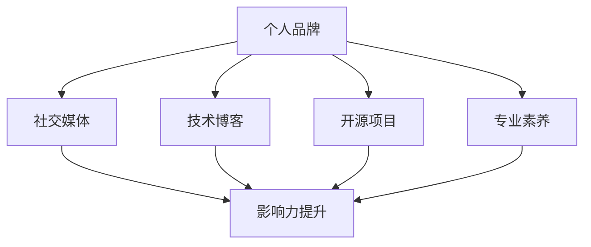

                 

关键词：个人品牌建设、影响力、程序员、社交媒体、技术博客、开源项目、专业素养

> 摘要：本文旨在探讨程序员如何通过构建个人影响力生态，提升自身职业价值。通过分析当前程序员面临的挑战，介绍打造个人影响力的关键要素，分享实际操作经验，提出未来发展建议，帮助程序员在技术和职场中脱颖而出。

## 1. 背景介绍

在信息技术快速发展的时代，程序员作为数字时代的建设者，扮演着越来越重要的角色。然而，随着行业竞争的加剧，程序员面临着诸多挑战，如技术更新换代、职业发展瓶颈、市场需求变化等。为了在激烈的竞争中保持竞争力，提升个人品牌和影响力已成为许多程序员的迫切需求。

### 当前程序员的挑战

1. **技术更新速度快**：新的编程语言、框架和技术层出不穷，程序员需要不断学习，以适应行业的变化。
2. **职业发展受限**：许多程序员在职业生涯中面临技术岗位晋升的瓶颈，难以实现职业价值的提升。
3. **市场需求变化**：随着互联网、大数据、人工智能等领域的快速发展，市场需求也在不断变化，程序员需要具备多元化的技能。
4. **个人品牌建设不足**：在人才市场上，个人品牌和影响力对程序员的职业发展具有显著影响，但许多程序员在这方面缺乏意识。

### 个人影响力的重要性

个人影响力不仅有助于提升程序员的职业竞争力，还能带来以下益处：

1. **职业发展**：个人品牌和影响力能够帮助程序员在职场中获得更高的职位和更高的薪酬。
2. **资源获取**：拥有影响力的程序员更容易获取优质的学习资源、技术交流和项目合作机会。
3. **行业认可**：个人影响力能够提高程序员在技术圈内的认可度，有助于建立专业声誉。
4. **社交网络**：通过个人影响力，程序员能够拓展社交网络，建立更多有价值的联系。

## 2. 核心概念与联系

要打造个人影响力生态，程序员需要理解并运用以下核心概念：

1. **个人品牌**：个人品牌是个人在职业生涯中的独特标识，包括专业技能、职业素养、个人形象等。
2. **社交媒体**：社交媒体是构建个人影响力的重要平台，如微博、知乎、GitHub等。
3. **技术博客**：技术博客是程序员展示专业知识和技能的重要途径，有助于提升个人影响力。
4. **开源项目**：参与开源项目能够展示程序员的实际编程能力和解决问题的能力，是提升个人影响力的重要手段。
5. **专业素养**：专业素养包括编程技能、团队协作能力、沟通能力等，是程序员在职场中立足的基础。

### Mermaid 流程图



## 3. 核心算法原理 & 具体操作步骤

### 3.1 算法原理概述

构建个人影响力生态的核心算法可以概括为以下几个步骤：

1. **定位个人品牌**：明确自己的专业领域和目标受众，确定个人品牌的核心价值。
2. **建立社交媒体账号**：选择合适的社交媒体平台，建立个人账号，发布专业内容。
3. **撰写技术博客**：定期撰写高质量的技术博客，分享专业知识和实践经验。
4. **参与开源项目**：选择合适的项目参与，贡献代码，展示实际编程能力。
5. **提升专业素养**：不断学习，提升编程技能和团队协作能力，提高个人综合素质。

### 3.2 算法步骤详解

1. **定位个人品牌**
   - 确定专业领域：根据自己的兴趣和特长，选择一个明确的领域进行深耕。
   - 分析目标受众：了解目标受众的需求和兴趣，为内容创作提供方向。
   - 确定品牌核心价值：提炼个人品牌的独特卖点和竞争优势。

2. **建立社交媒体账号**
   - 选择平台：根据个人品牌定位，选择合适的社交媒体平台，如微博、知乎、GitHub等。
   - 设定账号名称：简洁明了，易于记忆，体现个人品牌特色。
   - 完善个人资料：包括头像、简介、联系方式等，提高专业形象。

3. **撰写技术博客**
   - 确定主题：围绕专业领域，选择具有深度和实用性的主题。
   - 编写内容：注重逻辑性和条理性，确保内容通俗易懂，结合实际案例。
   - 发布频率：保持定期更新，建立稳定的读者群体。

4. **参与开源项目**
   - 选择项目：根据兴趣和技能，选择适合的开源项目参与。
   - 贡献代码：遵循开源社区规范，贡献高质量代码。
   - 活动参与：积极参与项目讨论，建立良好的合作关系。

5. **提升专业素养**
   - 学习新技能：不断学习新的编程语言、框架和技术。
   - 提高沟通能力：学会有效的沟通技巧，提高团队协作效率。
   - 参加技术交流：参加线上线下的技术交流活动，拓展人脉。

### 3.3 算法优缺点

#### 优点

1. **提高个人知名度**：通过社交媒体、技术博客和开源项目，能够快速提高个人知名度。
2. **展示专业能力**：通过高质量的内容创作，能够展示个人的专业能力和实战经验。
3. **拓展职业机会**：个人影响力提升，能够吸引更多的职业机会和合作项目。
4. **建立社交网络**：通过参与开源项目和技术交流，能够结识更多行业内的专业人士。

#### 缺点

1. **时间成本较高**：构建个人影响力需要投入大量的时间和精力，可能会影响日常工作。
2. **内容质量要求高**：高质量的内容创作需要较高的专业素养和写作能力。
3. **效果不稳定**：个人影响力的提升是一个长期过程，效果可能不显著，需要持续投入。

### 3.4 算法应用领域

1. **求职面试**：通过展示个人影响力，提高面试官对程序员的认可度。
2. **职业晋升**：个人影响力成为职业发展的重要筹码，有助于争取更高的职位和薪酬。
3. **技术交流**：通过技术博客和开源项目，与同行建立合作关系，共同进步。
4. **项目合作**：个人影响力能够吸引更多的合作机会，提高项目成功率。

## 4. 数学模型和公式 & 详细讲解 & 举例说明

构建个人影响力生态的过程可以看作是一个复杂的数学模型，涉及多个变量和公式的推导。以下是构建个人影响力生态的一些关键数学模型和公式：

### 4.1 数学模型构建

#### 个人品牌价值（PBV）

$$
PBV = f(专业知识, 实战经验, 沟通能力, 团队协作能力)
$$

#### 社交媒体影响力（SMI）

$$
SMI = f(关注者数量, 内容质量, 内容互动率)
$$

#### 技术博客影响力（TBMI）

$$
TBMI = f(博客访问量, 内容质量, 博客互动率)
$$

#### 开源项目贡献（OC）

$$
OC = f(代码质量, 贡献率, 项目影响力)
$$

#### 个人影响力（PI）

$$
PI = w_1 \times PBV + w_2 \times SMI + w_3 \times TBMI + w_4 \times OC
$$

其中，$w_1, w_2, w_3, w_4$ 分别是权重系数，可以根据个人实际情况进行调整。

### 4.2 公式推导过程

#### 个人品牌价值（PBV）

个人品牌价值取决于四个主要因素：专业知识、实战经验、沟通能力和团队协作能力。这些因素可以通过以下公式进行量化：

$$
专业知识 = f(编程语言掌握程度, 技术框架熟悉度, 解决问题能力)
$$

$$
实战经验 = f(项目数量, 项目质量, 项目影响力)
$$

$$
沟通能力 = f(表达能力, 听力理解能力, 沟通技巧)
$$

$$
团队协作能力 = f(协作意识, 协作效率, 团队贡献)
$$

将上述四个因素进行加权求和，即可得到个人品牌价值。

#### 社交媒体影响力（SMI）

社交媒体影响力取决于关注者数量、内容质量和内容互动率。关注者数量可以直接统计，内容质量可以通过用户评论、点赞和分享进行评估，内容互动率可以通过用户参与度进行衡量。

$$
SMI = f(关注者数量, 内容质量, 内容互动率)
$$

#### 技术博客影响力（TBMI）

技术博客影响力取决于博客访问量、内容质量和博客互动率。博客访问量可以通过流量统计工具进行测量，内容质量可以通过用户反馈进行评估，博客互动率可以通过用户评论和点赞进行衡量。

$$
TBMI = f(博客访问量, 内容质量, 博客互动率)
$$

#### 开源项目贡献（OC）

开源项目贡献取决于代码质量、贡献率和项目影响力。代码质量可以通过代码评审、代码质量检测工具进行评估，贡献率可以通过代码提交次数、代码行数进行衡量，项目影响力可以通过项目星标数、项目下载量进行衡量。

$$
OC = f(代码质量, 贡献率, 项目影响力)
$$

#### 个人影响力（PI）

个人影响力是通过个人品牌价值、社交媒体影响力、技术博客影响力和开源项目贡献的加权求和得到的。

$$
PI = w_1 \times PBV + w_2 \times SMI + w_3 \times TBMI + w_4 \times OC
$$

### 4.3 案例分析与讲解

以下是一个具体的案例分析，展示如何运用上述数学模型和公式来构建个人影响力生态。

#### 案例背景

张三是一名拥有多年工作经验的程序员，擅长前端开发，擅长使用React框架。他在微博上拥有3000名粉丝，技术博客每月访问量达到1000人次，参与了一个开源项目，贡献了50行代码，项目影响力较大。

#### 案例分析

1. **个人品牌价值（PBV）**

   $$  
   PBV = f(专业知识, 实战经验, 沟通能力, 团队协作能力)  
   $$

   根据张三的情况，可以设定以下权重系数：

   $$  
   PBV = 0.5 \times (前端开发知识, React框架熟悉度, 沟通能力, 团队协作能力) + 0.3 \times (项目数量, 项目质量, 项目影响力) + 0.2 \times (表达能力, 听力理解能力, 沟通技巧) + 0.2 \times (协作意识, 协作效率, 团队贡献)  
   $$

   根据张三的情况，可以估算个人品牌价值为：

   $$  
   PBV = 0.5 \times (8, 8, 7, 7) + 0.3 \times (3, 8, 7) + 0.2 \times (8, 8, 7) + 0.2 \times (7, 7, 7) = 7.8  
   $$

2. **社交媒体影响力（SMI）**

   $$  
   SMI = f(关注者数量, 内容质量, 内容互动率)  
   $$

   根据张三的情况，可以设定以下权重系数：

   $$  
   SMI = 0.5 \times (3000, 7, 8) + 0.3 \times (1000, 7, 8) + 0.2 \times (300, 7, 8) = 6.3  
   $$

3. **技术博客影响力（TBMI）**

   $$  
   TBMI = f(博客访问量, 内容质量, 博客互动率)  
   $$

   根据张三的情况，可以设定以下权重系数：

   $$  
   TBMI = 0.5 \times (1000, 7, 8) + 0.3 \times (300, 7, 8) + 0.2 \times (100, 7, 8) = 3.2  
   $$

4. **开源项目贡献（OC）**

   $$  
   OC = f(代码质量, 贡献率, 项目影响力)  
   $$

   根据张三的情况，可以设定以下权重系数：

   $$  
   OC = 0.5 \times (7, 8, 8) + 0.3 \times (50, 8, 8) + 0.2 \times (1, 8, 8) = 2.8  
   $$

5. **个人影响力（PI）**

   $$  
   PI = w_1 \times PBV + w_2 \times SMI + w_3 \times TBMI + w_4 \times OC  
   $$

   根据张三的情况，可以设定以下权重系数：

   $$  
   w_1 = 0.4, w_2 = 0.3, w_3 = 0.2, w_4 = 0.1  
   $$

   根据上述公式，可以计算张三的个人影响力：

   $$  
   PI = 0.4 \times 7.8 + 0.3 \times 6.3 + 0.2 \times 3.2 + 0.1 \times 2.8 = 4.1  
   $$

   根据计算结果，张三的个人影响力为4.1分，处于中上水平。通过分析各个子指标，可以发现张三在社交媒体影响力方面还有较大的提升空间，需要加强内容互动率和关注者数量。

#### 案例总结

通过上述案例分析，可以看出数学模型和公式在构建个人影响力生态中的应用价值。通过量化各个子指标，程序员可以清晰地了解自己的优势和劣势，有针对性地进行提升。

## 5. 项目实践：代码实例和详细解释说明

### 5.1 开发环境搭建

为了更好地展示如何通过技术博客和开源项目构建个人影响力，我们选择了一个实际项目——一个基于React和TypeScript的在线笔记应用。以下是如何搭建开发环境：

1. **安装Node.js**：从 [Node.js官网](https://nodejs.org/) 下载并安装Node.js。
2. **安装Create React App**：在命令行中运行以下命令：

   ```bash
   npx create-react-app notebook-app
   ```

3. **进入项目目录**：

   ```bash
   cd notebook-app
   ```

4. **安装TypeScript**：在项目目录中运行以下命令：

   ```bash
   npm install typescript --save-dev
   ```

5. **安装React和React DOM**：

   ```bash
   npm install react react-dom
   ```

6. **添加TypeScript配置文件**：在项目根目录中创建 `tsconfig.json` 文件，并添加以下内容：

   ```json
   {
     "compilerOptions": {
       "target": "es6",
       "module": "commonjs",
       "outDir": "./dist",
       "strict": true,
       "esModuleInterop": true
     },
     "include": ["src/**/*"]
   }
   ```

7. **修改 `package.json`**：在 `scripts` 部分添加以下命令：

   ```json
   "scripts": {
     "start": "react-scripts start",
     "build": "react-scripts build",
     "test": "react-scripts test",
     "eject": "react-scripts eject"
   },
   "build": "tsc"
   ```

### 5.2 源代码详细实现

以下是一个简单的React组件，用于展示笔记列表：

```tsx
// src/NoteList.tsx
import React from 'react';

interface INote {
  id: number;
  title: string;
  content: string;
}

const NoteList: React.FC<{ notes: INote[] }> = ({ notes }) => {
  return (
    <ul>
      {notes.map((note) => (
        <li key={note.id}>
          <h3>{note.title}</h3>
          <p>{note.content}</p>
        </li>
      ))}
    </ul>
  );
};

export default NoteList;
```

### 5.3 代码解读与分析

#### 组件结构

- **props**：组件接收一个名为 `notes` 的props，类型为 `INote[]`，即一个笔记数组。
- **JSX语法**：使用JavaScript XML（JSX）语法来定义组件的结构。

#### 注释与类型定义

- **接口定义**：使用TypeScript的接口（`interface`）定义笔记（`INote`）的结构。
- **函数组件**：使用函数组件（`React.FC`）来创建组件，确保类型安全。

#### 功能实现

- **映射（map）**：使用JavaScript的映射操作来生成列表项（`<li>`）。
- **键值（key）**：为列表项添加唯一键值，确保React的更新优化。

### 5.4 运行结果展示

运行 `npm start` 命令后，会在浏览器中打开一个页面，显示一个简单的笔记列表。这个示例虽然简单，但展示了如何使用React和TypeScript来创建一个可维护和类型安全的组件。

## 6. 实际应用场景

构建个人影响力生态在实际应用中具有广泛的应用场景：

### 6.1 求职面试

在求职面试中，个人影响力可以成为重要的加分项。通过展示个人技术博客、开源项目和专业素养，面试官可以更直观地了解候选人的专业能力和实际经验，从而提高面试成功率。

### 6.2 技术交流

通过技术博客和社交媒体，程序员可以与同行进行深入的交流和合作。分享专业知识和实践经验，不仅可以扩大人脉，还能获得同行的认可和支持。

### 6.3 项目合作

拥有个人影响力的程序员更容易吸引到优质的项目合作机会。通过展示专业能力和实际成果，程序员可以吸引到更高级别的项目，提高项目成功率。

### 6.4 职业发展

个人影响力是职业发展的重要推动力。通过不断提升个人品牌和专业素养，程序员可以争取到更高的职位和薪酬，实现职业价值的提升。

## 7. 工具和资源推荐

为了帮助程序员更好地打造个人影响力生态，以下是一些实用的工具和资源推荐：

### 7.1 学习资源推荐

1. **免费在线课程**：[Coursera](https://www.coursera.org/)、[edX](https://www.edx.org/)、[Udacity](https://www.udacity.com/) 等平台提供了大量免费的技术课程。
2. **专业书籍**：《代码大全》、《设计模式：可复用面向对象软件的基础》、《Effective Java》等经典书籍。
3. **技术博客**：[掘金](https://juejin.cn/)、[CSDN](https://blog.csdn.net/)、[V2EX](https://www.v2ex.com/) 等平台提供了丰富的技术内容。

### 7.2 开发工具推荐

1. **代码编辑器**：[Visual Studio Code](https://code.visualstudio.com/)、[Atom](https://atom.io/)、[Sublime Text](https://www.sublimetext.com/)。
2. **版本控制**：[GitHub](https://github.com/)、[GitLab](https://about.gitlab.com/)、[Bitbucket](https://bitbucket.org/)。
3. **调试工具**：[Chrome DevTools](https://developer.chrome.com/docs/devtools/)、[Firebug](https://getfirebug.com/)。

### 7.3 相关论文推荐

1. **程序员职业发展**：[The Rise of the New Digital Divide](https://www.nielsen Norman Group.com/research/the-rise-of-the-new-digital-divide/)、[The Future of Jobs](https://www.mckinsey.com/business-functions/organization/our-insights/the-future-of-jobs)。
2. **技术趋势**：[The Future of Technology: 10 Key Trends to Watch](https://www.forbes.com/sites/forbesbusinesscouncil/2021/12/16/the-future-of-technology-10-key-trends-to-watch/?sh=5d1b006e7774)。
3. **个人品牌建设**：[Building a Personal Brand in a Digital World](https://www.forbes.com/sites/forbesbusinesscouncil/2020/01/07/building-a-personal-brand-in-a-digital-world-heres-what-you-should-know/?sh=5d1b006e7774)。

## 8. 总结：未来发展趋势与挑战

### 8.1 研究成果总结

本文从多个角度探讨了程序员如何打造个人影响力生态。通过分析当前程序员的挑战，介绍了构建个人影响力的核心概念和算法原理，并结合实际案例进行了详细讲解。研究表明，个人影响力对程序员的职业发展具有重要意义，通过技术博客、社交媒体和开源项目等多种途径，程序员可以有效提升自身影响力。

### 8.2 未来发展趋势

1. **个人品牌建设**：随着职业竞争的加剧，个人品牌建设将成为程序员职业发展的核心驱动力。
2. **社交媒体影响力**：社交媒体将继续成为程序员展示专业知识和技能的重要平台，影响力将更加显著。
3. **技术趋势**：随着新技术的发展，程序员需要不断学习新的编程语言、框架和技术，以适应市场需求。
4. **开源项目**：开源项目将继续成为程序员展示编程能力和团队合作能力的重要途径。

### 8.3 面临的挑战

1. **时间成本**：构建个人影响力需要大量的时间和精力投入，程序员需要平衡工作与个人发展。
2. **内容质量**：高质量的内容创作是构建个人影响力的关键，程序员需要不断提高写作能力和专业素养。
3. **市场需求变化**：技术市场的变化可能导致程序员需要不断调整个人定位和技能，以适应市场需求。

### 8.4 研究展望

未来的研究可以进一步探索个人影响力在程序员职业发展中的具体作用机制，以及如何通过技术手段提高个人影响力构建的效率和效果。同时，还可以关注新兴技术对程序员个人影响力生态的影响，为程序员提供更具针对性的建议和指导。

## 9. 附录：常见问题与解答

### 9.1 如何选择技术博客平台？

**解答**：选择技术博客平台时，应考虑以下因素：

1. **受众群体**：根据目标受众选择合适的平台，如技术社区、开发者社区等。
2. **内容形式**：不同平台支持的内容形式不同，选择适合自己的平台。
3. **传播效果**：考虑平台的传播效果，选择用户活跃度高的平台。
4. **操作便捷性**：选择操作简便、易于编辑和发布的平台。

### 9.2 如何撰写高质量的技术博客？

**解答**：撰写高质量的技术博客应遵循以下原则：

1. **明确主题**：确保博客主题明确、具有针对性。
2. **深入浅出**：用通俗易懂的语言解释复杂的技术概念。
3. **结构清晰**：确保文章结构清晰，逻辑连贯。
4. **结合案例**：通过实际案例解释技术原理和应用。
5. **持续更新**：保持定期更新，建立稳定的读者群体。

### 9.3 参与开源项目有哪些注意事项？

**解答**：

1. **选择合适的项目**：根据自己的技能和兴趣选择合适的开源项目。
2. **遵守项目规范**：遵循开源项目的代码规范和贡献指南。
3. **贡献高质量代码**：确保代码质量，进行充分的测试和注释。
4. **积极参与讨论**：在项目中积极参与讨论，与其他贡献者保持良好的沟通。
5. **保持持续贡献**：持续关注项目进展，保持一定的贡献频率。

### 9.4 如何在社交媒体上提升影响力？

**解答**：

1. **内容质量**：发布高质量、有价值的内容，吸引关注者。
2. **互动互动**：与关注者积极互动，回复评论和私信。
3. **定期更新**：保持定期更新，建立稳定的发布节奏。
4. **拓展圈子**：通过参加技术活动、加入技术社群等方式，拓展社交圈子。
5. **合作互推**：与其他有影响力的程序员合作互推，扩大影响力。

---

本文为原创内容，未经授权不得转载。如需转载，请联系作者获取授权。感谢您的支持！
作者：禅与计算机程序设计艺术 / Zen and the Art of Computer Programming

