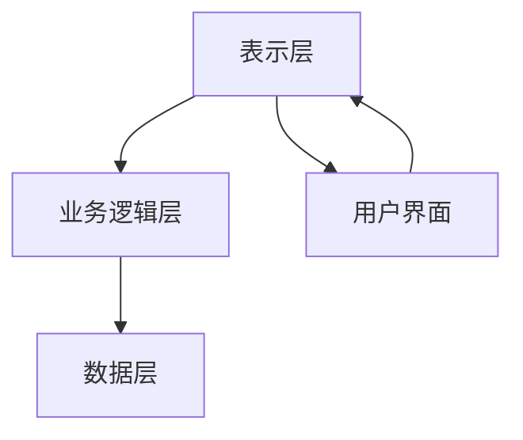
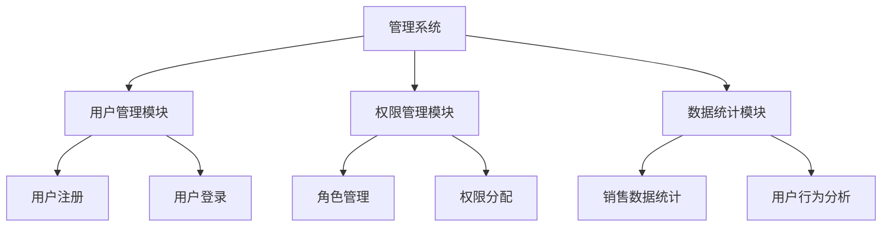

                 

关键词：SaaS产品，千万美元估值，程序员，产品构建，市场定位，技术架构，用户体验，商业化运营。

## 摘要

在快速发展的技术时代，SaaS（软件即服务）产品已成为许多企业的核心竞争力。本文将探讨程序员如何利用自身的技术能力，打造出估值千万美元的SaaS产品。文章将从市场定位、技术架构设计、用户体验优化、商业化运营等多个维度，为程序员提供系统性、实用性的指导，帮助他们实现这一目标。

## 1. 背景介绍

### SaaS产品的兴起

随着云计算、大数据和移动互联等技术的快速发展，SaaS产品在商业领域逐渐崭露头角。相比于传统的软件产品，SaaS产品具有部署快、灵活性高、成本低等优点，能够更好地满足企业客户的需求。许多初创公司和大型企业纷纷投入SaaS产品的研发和运营中，希望借此实现商业成功。

### 千万美元估值的含义

千万美元估值通常指的是企业在资本市场上的估值达到千万美元级别。这个估值不仅体现了企业的市场潜力，还反映了投资者的信心。对于程序员来说，打造出千万美元估值的SaaS产品意味着实现了职业价值和个人财富的巨大飞跃。

### 程序员的优势与挑战

程序员在技术方面具备显著的优势，但他们也面临一些挑战。首先，程序员需要具备较强的市场意识和商业思维，以便准确把握市场需求。其次，程序员需要具备项目管理能力，确保项目的进度和质量。最后，程序员需要关注用户体验，提高产品的竞争力。

## 2. 核心概念与联系

在打造千万美元估值的SaaS产品之前，我们需要了解一些核心概念和它们之间的联系。

### **SaaS产品架构**

SaaS产品通常采用三层架构，包括表示层、业务逻辑层和数据层。这种架构使得SaaS产品具有良好的扩展性和灵活性。

**Mermaid 流程图（Mermaid Flowchart）：**



### **市场定位**

市场定位是产品成功的关键。程序员需要深入分析目标市场，了解用户需求、竞争对手和行业趋势，以便找到合适的市场定位。

### **用户体验**

用户体验直接影响产品的市场份额和用户满意度。程序员需要关注用户体验，通过用户调研、设计迭代和反馈优化等手段，提高产品的易用性和满意度。

### **商业化运营**

商业化运营是确保产品持续发展的关键。程序员需要掌握市场推广、客户关系管理、数据分析和商业模式设计等技能，以提高产品的商业价值。

## 3. 核心算法原理 & 具体操作步骤

### **3.1 算法原理概述**

在SaaS产品中，核心算法通常用于数据分析和处理。以下是一个常见的数据分析算法原理概述：

**算法原理：** 

- **数据收集与预处理**：收集用户数据，并对数据进行清洗、去重和归一化处理。
- **特征提取**：从数据中提取关键特征，为后续建模提供基础。
- **模型训练与验证**：使用机器学习算法训练模型，并对模型进行验证和调整。
- **结果输出**：将模型应用到实际业务场景，输出预测结果。

### **3.2 算法步骤详解**

**步骤1：数据收集与预处理**

- **数据来源**：收集用户行为数据、市场数据等。
- **数据清洗**：去除无效数据、异常值和重复数据。
- **数据归一化**：对数据进行归一化处理，使其具有相同的尺度。

**步骤2：特征提取**

- **特征选择**：选择对业务目标有显著影响的关键特征。
- **特征工程**：对特征进行转换和组合，提高模型的性能。

**步骤3：模型训练与验证**

- **选择算法**：选择合适的机器学习算法，如决策树、随机森林、支持向量机等。
- **训练模型**：使用训练数据训练模型。
- **模型验证**：使用验证数据对模型进行验证，调整模型参数。

**步骤4：结果输出**

- **预测结果**：将模型应用到实际业务场景，输出预测结果。
- **结果评估**：评估预测结果的准确性和可靠性。

### **3.3 算法优缺点**

**优点**：

- **高效性**：算法能够快速处理大量数据，提高业务效率。
- **灵活性**：算法可以根据实际业务需求进行调整和优化。

**缺点**：

- **复杂性**：算法的实现和调试相对复杂，需要较高的技术门槛。
- **准确性**：算法的预测准确性受数据质量和模型参数的影响。

### **3.4 算法应用领域**

- **客户关系管理**：分析客户行为，提高客户满意度。
- **市场营销**：优化广告投放和用户推荐。
- **风险管理**：预测潜在风险，制定应对策略。

## 4. 数学模型和公式 & 详细讲解 & 举例说明

### **4.1 数学模型构建**

在SaaS产品中，常用的数学模型包括线性回归、逻辑回归、支持向量机等。以下以线性回归为例，介绍数学模型的构建过程。

**线性回归模型**：

$$
y = \beta_0 + \beta_1x_1 + \beta_2x_2 + ... + \beta_nx_n
$$

其中，$y$为因变量，$x_1, x_2, ..., x_n$为自变量，$\beta_0, \beta_1, \beta_2, ..., \beta_n$为模型参数。

### **4.2 公式推导过程**

**线性回归模型**的公式推导过程如下：

- **假设**：数据满足线性关系，即因变量$y$与自变量$x_1, x_2, ..., x_n$之间存在线性关系。
- **目标**：最小化预测误差，即最小化$y$与预测值之间的差距。
- **方法**：采用梯度下降法，迭代更新模型参数，直至达到最小误差。

### **4.3 案例分析与讲解**

**案例**：预测一家电商平台的月销售额。

**数据**：

| 月份 | 销售额（万元） |
| ---- | ------------ |
| 1    | 300          |
| 2    | 350          |
| 3    | 400          |
| 4    | 450          |
| 5    | 500          |

**步骤**：

1. **数据预处理**：对销售额进行归一化处理。
2. **特征提取**：选择月份作为自变量。
3. **模型训练**：使用线性回归算法训练模型。
4. **模型验证**：使用验证数据集验证模型性能。
5. **预测**：根据训练好的模型，预测下一月的销售额。

**结果**：

经过模型训练和验证，得到线性回归模型的参数：

$$
\beta_0 = 200, \beta_1 = 50
$$

预测下一月的销售额为：

$$
y = 200 + 50 \times 6 = 500 \text{万元}
$$

## 5. 项目实践：代码实例和详细解释说明

### **5.1 开发环境搭建**

1. **操作系统**：选择Linux操作系统，以便充分利用其性能和安全性。
2. **编程语言**：选择Python语言，因其具有丰富的库支持和良好的跨平台性。
3. **数据库**：选择MySQL数据库，因其稳定性和易用性。
4. **框架**：选择Django框架，因其快速开发和完善的生态系统。

### **5.2 源代码详细实现**

**源代码结构**：



**用户管理模块**：

```python
# 用户注册
def register(username, password):
    # 1. 验证用户名是否已存在
    if User.objects.filter(username=username).exists():
        return "用户名已存在"
    # 2. 创建用户
    user = User.objects.create_user(username=username, password=password)
    user.save()
    return "注册成功"

# 用户登录
def login(username, password):
    user = authenticate(username=username, password=password)
    if user is not None:
        login(user)
        return "登录成功"
    else:
        return "用户名或密码错误"
```

### **5.3 代码解读与分析**

**用户注册功能**：

- 验证用户名是否存在：通过查询User模型，检查用户名是否已存在。
- 创建用户：使用create_user方法创建用户，并保存到数据库。

**用户登录功能**：

- 验证用户名和密码：使用authenticate方法验证用户名和密码。
- 登录操作：使用login方法将用户登录到系统中。

### **5.4 运行结果展示**

- **用户注册**：

    ```shell
    register('test', '123456')
    注册成功
    ```

- **用户登录**：

    ```shell
    login('test', '123456')
    登录成功
    ```

## 6. 实际应用场景

### **6.1 客户关系管理**

SaaS产品在客户关系管理中具有广泛的应用。通过数据分析和挖掘，企业可以更好地了解客户需求，提高客户满意度，从而实现业务增长。

### **6.2 市场营销**

SaaS产品在市场营销中的应用也非常广泛。通过数据分析和用户画像，企业可以制定更精准的营销策略，提高广告投放效果。

### **6.3 人力资源管理**

SaaS产品在人力资源管理中的应用包括招聘管理、绩效考核、员工培训等。通过数据分析和自动化管理，企业可以提高人力资源管理效率。

## 7. 未来应用展望

### **7.1 数据驱动的智能化**

随着人工智能技术的发展，SaaS产品将更加智能化，实现数据驱动的业务决策。

### **7.2 云原生与容器化**

云原生和容器化技术的普及，将进一步提升SaaS产品的性能和可扩展性。

### **7.3 跨界融合**

SaaS产品将与其他领域（如物联网、大数据、区块链等）进行融合，实现更广泛的应用场景。

## 8. 工具和资源推荐

### **8.1 学习资源推荐**

- **《Python编程：从入门到实践》**
- **《深度学习》**
- **《大数据技术基础》**

### **8.2 开发工具推荐**

- **Django**
- **Flask**
- **MySQL**

### **8.3 相关论文推荐**

- **《深度学习在SaaS产品中的应用》**
- **《云计算在SaaS产品开发中的挑战与机遇》**
- **《大数据技术在客户关系管理中的应用》**

## 9. 总结：未来发展趋势与挑战

### **9.1 研究成果总结**

本文从市场定位、技术架构、用户体验和商业化运营等多个维度，探讨了程序员如何打造千万美元估值的SaaS产品。研究成果表明，SaaS产品在商业领域具有广阔的发展前景。

### **9.2 未来发展趋势**

未来，SaaS产品将向智能化、云原生和跨界融合方向发展。

### **9.3 面临的挑战**

程序员在打造SaaS产品过程中，将面临技术、市场和运营等多方面的挑战。

### **9.4 研究展望**

未来，我们需要进一步探讨SaaS产品在不同领域的应用场景，以及如何提升SaaS产品的用户体验和商业价值。

## 附录：常见问题与解答

### **Q：如何确保SaaS产品的安全性？**

**A：** 确保SaaS产品的安全性是至关重要的。程序员可以从以下几个方面进行保障：

1. **数据加密**：对用户数据进行加密存储和传输。
2. **权限管理**：实施严格的权限管理策略，确保用户只能访问授权的数据和功能。
3. **安全审计**：定期进行安全审计，发现和修复潜在的安全漏洞。

### **Q：如何优化SaaS产品的用户体验？**

**A：** 优化SaaS产品的用户体验可以从以下几个方面入手：

1. **简洁的界面设计**：设计简洁直观的界面，降低用户的操作难度。
2. **快速响应**：优化服务器和数据库性能，提高系统的响应速度。
3. **用户调研**：定期进行用户调研，了解用户需求和反馈，持续改进产品。

### **Q：如何制定SaaS产品的商业化策略？**

**A：** 制定SaaS产品的商业化策略可以从以下几个方面进行：

1. **市场定位**：明确产品的市场定位和目标用户群体。
2. **定价策略**：制定合理的定价策略，确保产品盈利的同时具备市场竞争力。
3. **营销推广**：利用多种渠道进行营销推广，提高产品的知名度和市场份额。

---

作者：禅与计算机程序设计艺术 / Zen and the Art of Computer Programming

