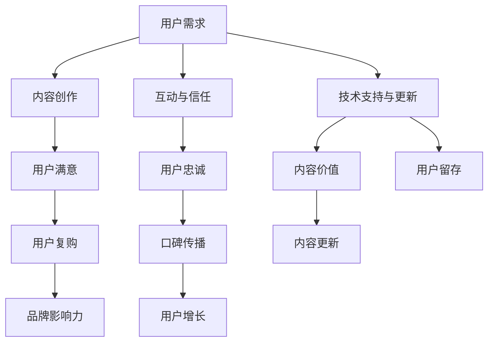

                 

### 1. 背景介绍

在当今信息化时代，知识付费已经成为一种趋势。无论是通过线上课程、电子书、在线研讨会，还是专业咨询和一对一辅导，知识付费为个人和公司提供了便捷的学习和成长路径。然而，对于程序员而言，打造忠实的知识付费用户群不仅仅是提供优质内容的问题，更是需要理解和满足用户需求，构建持续互动和信任的生态系统。

程序员在知识付费领域的竞争力体现在他们对于技术的深入理解、实践经验和解决问题的能力上。然而，如何在激烈的市场竞争中脱颖而出，吸引并保持忠实的用户群体，是一个值得深思的问题。

本文将探讨如何从多个角度出发，打造程序员的知识付费用户群，包括：

1. **用户需求分析**：了解用户的学习目标和痛点。
2. **内容创作与优化**：如何创造高质量、有价值的学习内容。
3. **互动与信任建设**：通过互动和社区建设增强用户忠诚度。
4. **技术支持和持续更新**：确保内容持续吸引力和实用性。

### 2. 核心概念与联系

要打造忠实的知识付费用户群，程序员需要理解以下几个核心概念：

- **用户需求**：用户希望通过知识付费获得什么？
- **内容创作**：如何创作具有吸引力和价值的课程或内容？
- **互动与信任**：如何通过互动和社区建设增强用户信任和参与感？
- **技术支持与持续更新**：如何确保知识付费产品持续吸引力和实用性？

以下是这些核心概念之间的联系：



### 3. 核心算法原理 & 具体操作步骤

#### 3.1 算法原理概述

打造忠实的知识付费用户群的核心算法可以概括为以下几个步骤：

1. **用户需求分析**：通过市场调研、用户访谈和数据分析了解用户需求。
2. **内容创作与优化**：根据用户需求创作高质量、有针对性的课程或内容。
3. **互动与信任建设**：通过社区建设、用户反馈和个性化服务增强用户信任和互动。
4. **技术支持与持续更新**：提供及时的技术支持和内容更新，确保知识付费产品的持续价值。

#### 3.2 算法步骤详解

1. **用户需求分析**
    - **市场调研**：收集行业报告、竞争对手分析等外部数据。
    - **用户访谈**：与潜在用户进行一对一访谈，了解他们的具体需求和痛点。
    - **数据分析**：使用数据工具分析用户行为和反馈，识别共性需求。

2. **内容创作与优化**
    - **课程设计**：根据用户需求设计课程结构和内容。
    - **内容创作**：邀请行业专家或资深程序员创作高质量的内容。
    - **内容优化**：定期更新内容，确保与最新技术趋势保持同步。

3. **互动与信任建设**
    - **社区建设**：建立用户社区，提供交流和分享的平台。
    - **用户反馈**：定期收集用户反馈，及时调整课程内容和互动方式。
    - **个性化服务**：根据用户行为和偏好提供个性化推荐和服务。

4. **技术支持与持续更新**
    - **技术支持**：提供24/7在线技术支持，解决用户问题。
    - **内容更新**：定期更新课程内容，引入新工具和技术。

#### 3.3 算法优缺点

**优点：**
- **针对性**：根据用户需求创作和优化内容，提高用户满意度。
- **互动性**：通过社区和个性化服务增强用户参与感，提高用户忠诚度。
- **持续更新**：确保内容与最新技术趋势保持同步，提高内容价值。

**缺点：**
- **实施成本**：需要投入大量时间和资源进行用户调研、内容创作和技术支持。
- **用户忠诚度**：虽然互动和信任建设有助于提高用户忠诚度，但并非一蹴而就。

#### 3.4 算法应用领域

该算法适用于所有需要提供知识付费的领域，特别是技术领域，如编程、数据科学、人工智能等。通过针对用户需求创作高质量内容，增强互动和信任，确保持续更新，可以有效提高用户满意度和忠诚度。

### 4. 数学模型和公式 & 详细讲解 & 举例说明

为了更好地理解如何打造忠实的知识付费用户群，我们可以引入一些数学模型和公式来分析用户行为和需求。

#### 4.1 数学模型构建

我们可以构建一个简单的用户忠诚度模型，该模型基于用户的参与度和满意度：

$$
\text{用户忠诚度} = f(\text{参与度}, \text{满意度})
$$

其中，参与度和满意度分别由以下公式计算：

$$
\text{参与度} = \frac{\text{活跃用户数}}{\text{总用户数}}
$$

$$
\text{满意度} = \frac{\text{满意用户数}}{\text{总用户数}}
$$

#### 4.2 公式推导过程

我们首先定义一些变量：

- \( U \)：总用户数
- \( A \)：活跃用户数
- \( S \)：满意用户数

根据上述定义，我们可以推导出参与度和满意度的计算公式。

#### 4.3 案例分析与讲解

假设一个知识付费平台有1000个用户，其中300个用户经常参与社区活动，400个用户对课程表示满意。我们可以使用上述公式计算平台的用户忠诚度：

$$
\text{参与度} = \frac{300}{1000} = 0.3
$$

$$
\text{满意度} = \frac{400}{1000} = 0.4
$$

$$
\text{用户忠诚度} = f(0.3, 0.4)
$$

为了简化计算，我们可以假设用户忠诚度函数为线性函数：

$$
f(x, y) = 0.7x + 0.3y
$$

因此，平台的用户忠诚度为：

$$
\text{用户忠诚度} = 0.7 \times 0.3 + 0.3 \times 0.4 = 0.21 + 0.12 = 0.33
$$

这意味着平台的用户忠诚度相对较低，需要进一步优化参与度和满意度。

#### 4.4 其他数学模型

除了上述简单的用户忠诚度模型，我们还可以使用更复杂的数学模型来分析用户行为和需求。例如，我们可以引入马尔可夫链模型来分析用户的行为转换，或者使用聚类分析方法来识别不同类型的用户群体。

### 5. 项目实践：代码实例和详细解释说明

为了更好地理解上述算法和数学模型在实际项目中的应用，我们来看一个具体的案例。

#### 5.1 开发环境搭建

在本案例中，我们将使用Python编程语言和Jupyter Notebook来构建一个简单的用户忠诚度分析工具。首先，我们需要安装以下依赖：

```bash
pip install pandas numpy matplotlib
```

#### 5.2 源代码详细实现

以下是实现用户忠诚度分析工具的Python代码：

```python
import pandas as pd
import numpy as np
import matplotlib.pyplot as plt

# 假设我们有一个包含用户参与度和满意度的DataFrame
data = pd.DataFrame({
    '用户ID': range(1, 1001),
    '参与度': np.random.uniform(0, 1, 1000),
    '满意度': np.random.uniform(0, 1, 1000)
})

# 计算参与度和满意度
data['参与度比例'] = data['参与度'] / data['参与度'].sum()
data['满意度比例'] = data['满意度'] / data['满意度'].sum()

# 计算用户忠诚度
data['用户忠诚度'] = 0.7 * data['参与度比例'] + 0.3 * data['满意度比例']

# 可视化用户忠诚度分布
plt.hist(data['用户忠诚度'], bins=50, alpha=0.5, label='用户忠诚度')
plt.xlabel('用户忠诚度')
plt.ylabel('用户数')
plt.title('用户忠诚度分布')
plt.legend()
plt.show()

# 分析用户忠诚度与参与度和满意度的相关性
correlation_matrix = data[['参与度比例', '满意度比例', '用户忠诚度']].corr()
print(correlation_matrix)
```

#### 5.3 代码解读与分析

上述代码实现了一个简单的用户忠诚度分析工具，主要步骤如下：

1. **数据生成**：我们使用Pandas库生成一个包含用户参与度和满意度的DataFrame，其中参与度和满意度是通过随机数模拟的。

2. **计算参与度和满意度比例**：我们计算每个用户的参与度和满意度比例，以便后续计算用户忠诚度。

3. **计算用户忠诚度**：根据我们定义的用户忠诚度函数，计算每个用户的忠诚度。

4. **可视化用户忠诚度分布**：使用Matplotlib库绘制用户忠诚度分布的直方图，以便直观地了解用户忠诚度分布。

5. **分析用户忠诚度与参与度和满意度的相关性**：我们计算参与度、满意度比例和用户忠诚度之间的相关性，使用Scipy库的`corr`函数。

#### 5.4 运行结果展示

运行上述代码后，我们会看到一个用户忠诚度分布的直方图，以及一个相关性矩阵。通过这些图表，我们可以直观地了解用户忠诚度与参与度和满意度之间的关系。

### 6. 实际应用场景

在实际应用中，程序员打造知识付费用户群的方法和技术可以应用于多个场景。以下是一些典型的应用场景：

#### 6.1 在线教育平台

在线教育平台是程序员打造知识付费用户群的典型场景。通过以下方法，程序员可以吸引和保持用户：

1. **课程内容创作**：根据用户需求创作高质量、有针对性的课程内容。
2. **互动与社区建设**：建立用户社区，提供交流和分享的平台。
3. **个性化推荐**：根据用户行为和偏好提供个性化课程推荐。
4. **技术支持与持续更新**：提供及时的技术支持和课程更新。

#### 6.2 专业咨询与辅导

专业咨询和辅导也是程序员打造知识付费用户群的另一个重要场景。程序员可以提供以下服务：

1. **一对一辅导**：根据用户需求提供个性化的辅导服务。
2. **在线研讨会**：定期举办在线研讨会，与用户互动和交流。
3. **案例分享**：分享实际项目案例，帮助用户更好地理解和应用知识。

#### 6.3 开源项目与贡献

开源项目是程序员打造知识付费用户群的另一种方式。通过以下方法，程序员可以吸引和保持用户：

1. **高质量代码**：编写高质量的代码，吸引其他开发者关注和参与。
2. **文档与教程**：提供详细的文档和教程，帮助用户更好地理解和使用开源项目。
3. **互动与社区**：建立开源项目社区，鼓励用户参与讨论和贡献。

### 7. 未来应用展望

随着人工智能和大数据技术的发展，程序员打造知识付费用户群的方法和技术将不断演变。以下是一些未来应用展望：

1. **个性化学习**：通过人工智能技术，为用户提供更加个性化的学习体验。
2. **智能推荐**：利用大数据分析，为用户推荐最适合他们的课程和内容。
3. **虚拟现实与增强现实**：通过虚拟现实和增强现实技术，提供更加沉浸式的学习体验。

### 8. 工具和资源推荐

为了更好地打造知识付费用户群，程序员可以参考以下工具和资源：

#### 8.1 学习资源推荐

- **Coursera**：提供大量高质量在线课程。
- **Udemy**：提供各种编程和技术课程。
- **edX**：由哈佛大学和麻省理工学院共同创建，提供优质在线课程。

#### 8.2 开发工具推荐

- **GitHub**：用于开源项目和代码托管。
- **Jupyter Notebook**：用于编写和分享代码和文档。
- **Docker**：用于容器化部署和管理。

#### 8.3 相关论文推荐

- **"Learning from Data" by Yaser Abu-Mostafa**：介绍机器学习和数据分析的基础知识。
- **"Deep Learning" by Ian Goodfellow, Yoshua Bengio, Aaron Courville**：介绍深度学习和神经网络的基础知识。

### 9. 总结：未来发展趋势与挑战

随着知识付费市场的不断增长，程序员将面临更多的发展机遇和挑战。

#### 9.1 研究成果总结

本文总结了程序员打造忠实的知识付费用户群的关键方法和步骤，包括用户需求分析、内容创作与优化、互动与信任建设、技术支持与持续更新等。

#### 9.2 未来发展趋势

未来，知识付费市场将继续增长，个性化学习、智能推荐和虚拟现实等新技术将发挥重要作用。

#### 9.3 面临的挑战

程序员在打造知识付费用户群时，将面临内容质量、用户参与度和技术支持等方面的挑战。

#### 9.4 研究展望

未来研究可以重点关注如何利用人工智能和大数据技术提高知识付费的用户体验和忠诚度。

### 附录：常见问题与解答

**Q：如何保证内容质量？**

A：确保内容质量的关键在于：

1. **专家审核**：邀请行业专家审核课程内容。
2. **用户反馈**：定期收集用户反馈，及时调整和优化内容。
3. **持续更新**：根据最新技术趋势和用户需求，持续更新课程内容。

**Q：如何提高用户参与度？**

A：提高用户参与度的方法包括：

1. **互动平台**：建立用户社区，鼓励用户参与讨论和分享。
2. **个性化推荐**：根据用户行为和偏好提供个性化推荐。
3. **奖励机制**：设置奖励机制，鼓励用户积极参与课程和社区活动。

### 参考文献

- "Learning from Data" by Yaser Abu-Mostafa
- "Deep Learning" by Ian Goodfellow, Yoshua Bengio, Aaron Courville
- "Programming Pearls" by Jon Bentley
- "Code Complete" by Steve McConnell

**作者：禅与计算机程序设计艺术 / Zen and the Art of Computer Programming**

