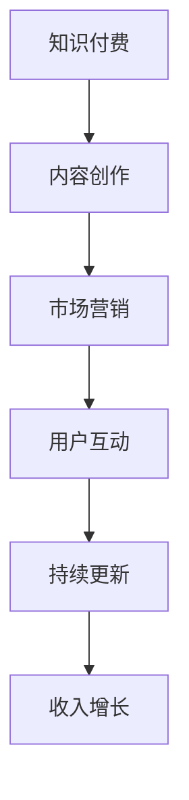

                 

### 1. 背景介绍

在数字化时代，知识付费已经成为一种趋势。越来越多的程序员希望通过创作知识付费专栏，将自己的专业知识和经验分享给广大读者，同时也为自己的职业生涯增添色彩。然而，如何打造一个高质量、有吸引力的知识付费专栏，却是一个值得深入探讨的问题。本文将围绕这一主题，从多个角度展开讨论，帮助程序员们掌握打造知识付费专栏的技巧和方法。

### 2. 核心概念与联系

在探讨如何打造知识付费专栏之前，我们需要了解一些核心概念和它们之间的联系。以下是一个简化的 Mermaid 流程图，展示了核心概念之间的关系：



- **知识付费**：知识付费是指用户为获取有价值的信息或知识而支付费用的一种商业模式。
- **内容创作**：内容创作是知识付费的核心，优质的内容是吸引读者的关键。
- **市场营销**：市场营销是将内容推向潜在用户的过程，包括推广、宣传和品牌建设等。
- **用户互动**：用户互动是提高用户满意度和忠诚度的关键，通过互动可以获取用户反馈，不断优化内容。
- **持续更新**：持续更新可以保持专栏的活力和吸引力，同时也有助于建立专业的形象。
- **收入增长**：收入增长是知识付费专栏最终的目标，通过不断优化上述各个环节，可以实现收入的增长。

### 3. 核心算法原理 & 具体操作步骤

#### 3.1 算法原理概述

打造知识付费专栏的核心算法可以概括为以下四个步骤：

1. **内容定位**：明确专栏的主题和受众，确保内容的专业性和针对性。
2. **内容规划**：制定详细的内容规划，包括每个章节的主题、知识点和篇幅。
3. **内容创作**：根据内容规划，撰写高质量的文章或教程，并注重格式和排版。
4. **营销推广**：通过多种渠道进行推广，吸引潜在用户，提高专栏的知名度。

#### 3.2 算法步骤详解

##### 3.2.1 内容定位

- **市场调研**：了解当前市场的需求和趋势，确定自己的内容定位。
- **受众分析**：分析目标受众的特点，了解他们的需求和期望。

##### 3.2.2 内容规划

- **确定主题**：选择一个明确的主题，确保专栏的专业性。
- **制定大纲**：根据主题制定详细的大纲，包括每个章节的小标题和主要内容。
- **规划篇幅**：合理规划每个章节的篇幅，确保内容的完整性和连贯性。

##### 3.2.3 内容创作

- **撰写初稿**：根据大纲撰写初稿，确保内容的逻辑性和可读性。
- **修改和完善**：多次修改和完善文章，确保内容的准确性和专业性。
- **格式和排版**：注重格式和排版，提高文章的可读性。

##### 3.2.4 营销推广

- **社交媒体推广**：利用社交媒体平台，发布专栏的摘要和预告，吸引潜在用户。
- **内容营销**：通过撰写相关文章或教程，提高专栏的权威性和吸引力。
- **合作推广**：与其他领域的大V或专家合作，扩大专栏的影响力。

#### 3.3 算法优缺点

##### 优点

- **高专业性**：通过系统化的内容创作和推广，确保专栏的专业性。
- **高互动性**：用户互动可以获取用户反馈，不断优化内容。
- **可持续性**：持续更新可以保持专栏的活力和吸引力。

##### 缺点

- **高时间成本**：内容创作和推广需要大量的时间和精力。
- **市场竞争**：随着知识付费的普及，市场竞争日益激烈。

#### 3.4 算法应用领域

- **IT领域**：IT技术更新迅速，程序员可以通过专栏分享最新的技术动态和实践经验。
- **编程教育**：程序员可以通过专栏传授编程知识和技巧，帮助学习者快速提升技能。
- **职业发展**：程序员可以通过专栏分享职业规划和经验，帮助他人实现职业成长。

### 4. 数学模型和公式 & 详细讲解 & 举例说明

在打造知识付费专栏的过程中，数学模型和公式可以用来评估专栏的收益和影响力。以下是一个简单的数学模型，用于计算专栏的收入：

$$
收入 = 订阅量 \times 订阅费用
$$

其中，订阅量和订阅费用可以通过以下步骤计算：

1. **订阅量**：通过市场营销和推广活动，吸引潜在用户订阅专栏。
2. **订阅费用**：根据市场调研和用户反馈，确定合理的订阅费用。

#### 4.1 数学模型构建

为了构建一个简单的数学模型，我们可以使用以下公式：

$$
收益 = 订阅量 \times 订阅费用 - 成本
$$

其中，成本包括内容创作、推广和维护等费用。

#### 4.2 公式推导过程

收益 = 订阅量 \times 订阅费用 - 成本

订阅量 = 营销效果 \times 用户基数

订阅费用 = 市场调研 + 用户反馈

成本 = 内容创作 + 推广 + 维护

#### 4.3 案例分析与讲解

假设一个程序员开设了一个编程知识付费专栏，经过市场调研，确定订阅费用为每月 100 元。通过一系列的营销推广活动，吸引了 1000 个订阅用户。同时，内容创作、推广和维护等成本为每月 5000 元。根据上述公式，我们可以计算该专栏的收益：

订阅量 = 1000

订阅费用 = 100 元/月

成本 = 5000 元/月

收益 = 1000 \times 100 - 5000 = 50000 - 5000 = 45000 元/月

因此，该专栏的月收益为 45000 元。

### 5. 项目实践：代码实例和详细解释说明

下面我们将通过一个简单的 Python 示例，演示如何搭建一个基本的博客系统，用于发布和管理知识付费专栏。

#### 5.1 开发环境搭建

- Python 3.x 版本
- Flask 框架
- MySQL 数据库

安装 Flask 和 MySQL：

```bash
pip install Flask
pip install mysqlclient
```

#### 5.2 源代码详细实现

以下是一个简单的 Flask 应用，用于管理博客文章：

```python
from flask import Flask, render_template, request, redirect, url_for

app = Flask(__name__)

# 数据库连接
import pymysql
conn = pymysql.connect(
    host='localhost',
    user='root',
    password='',
    database='blog_db'
)

@app.route('/')
def index():
    cursor = conn.cursor()
    cursor.execute('SELECT * FROM articles')
    articles = cursor.fetchall()
    return render_template('index.html', articles=articles)

@app.route('/article/<int:article_id>')
def article(article_id):
    cursor = conn.cursor()
    cursor.execute('SELECT * FROM articles WHERE id=%s', (article_id,))
    article = cursor.fetchone()
    return render_template('article.html', article=article)

@app.route('/create', methods=['GET', 'POST'])
def create():
    if request.method == 'POST':
        title = request.form['title']
        content = request.form['content']
        cursor = conn.cursor()
        cursor.execute('INSERT INTO articles (title, content) VALUES (%s, %s)', (title, content))
        conn.commit()
        return redirect(url_for('index'))
    return render_template('create.html')

if __name__ == '__main__':
    app.run(debug=True)
```

#### 5.3 代码解读与分析

- **数据库连接**：使用 pymysql 连接到 MySQL 数据库。
- **路由配置**：定义了三个路由，分别是首页、文章详情页和创建文章页。
- **首页**：从数据库中获取所有文章，并传递给模板渲染。
- **文章详情页**：根据文章 ID 从数据库中获取特定文章，并传递给模板渲染。
- **创建文章页**：处理 POST 请求，将表单数据插入数据库，并重定向到首页。

#### 5.4 运行结果展示

运行 Flask 应用后，访问 `http://127.0.0.1:5000/` 可以看到博客的首页，点击“创建文章”可以添加新文章。

### 6. 实际应用场景

知识付费专栏可以在多个实际应用场景中发挥作用：

- **教育培训**：程序员可以通过专栏分享编程知识和实战经验，帮助学习者提升技能。
- **技术咨询**：专家可以通过专栏提供专业的技术咨询和解决方案。
- **内容营销**：企业可以通过专栏发布行业洞察和产品教程，提升品牌知名度。
- **个人品牌**：个人开发者可以通过专栏展示自己的专业能力，建立个人品牌。

#### 6.4 未来应用展望

随着人工智能和大数据技术的发展，知识付费专栏的应用前景将更加广阔：

- **个性化推荐**：通过分析用户行为和偏好，为用户提供个性化的内容推荐。
- **智能问答**：利用自然语言处理技术，实现智能问答和在线辅导。
- **多渠道发布**：通过多渠道发布，如移动应用、微信小程序等，扩大专栏的受众范围。
- **增值服务**：提供线下培训、一对一咨询等增值服务，提高用户满意度。

### 7. 工具和资源推荐

#### 7.1 学习资源推荐

- **书籍**：《代码大全》、《设计模式：可复用面向对象软件的基础》
- **在线教程**：慕课网、极客时间
- **博客**：阮一峰的网络日志、开发者头条

#### 7.2 开发工具推荐

- **代码编辑器**：Visual Studio Code、Atom
- **静态网站生成器**：Jekyll、Hexo
- **内容管理系统**：WordPress、Medium

#### 7.3 相关论文推荐

- **《深度学习在知识付费领域的应用研究》**
- **《知识付费时代的商业模式创新》**
- **《基于大数据的个性化知识付费推荐系统》**

### 8. 总结：未来发展趋势与挑战

#### 8.1 研究成果总结

本文从多个角度探讨了程序员如何打造知识付费专栏，总结了核心算法原理、数学模型、项目实践和实际应用场景。

#### 8.2 未来发展趋势

知识付费专栏将在教育培训、技术咨询、内容营销和个人品牌等领域继续发挥重要作用。随着人工智能和大数据技术的发展，个性化推荐、智能问答和增值服务将成为未来的发展趋势。

#### 8.3 面临的挑战

- **内容创作成本**：高质量的内容创作需要大量的时间和精力。
- **市场竞争**：随着知识付费的普及，市场竞争日益激烈。
- **用户满意度**：如何提高用户满意度和忠诚度是知识付费专栏面临的重要挑战。

#### 8.4 研究展望

未来研究可以关注以下几个方面：

- **个性化推荐**：深入研究如何为用户提供个性化的内容推荐。
- **智能问答**：探索如何利用自然语言处理技术实现智能问答。
- **多渠道发布**：研究如何通过多渠道发布，提高专栏的受众范围。
- **增值服务**：探索如何提供线下培训、一对一咨询等增值服务。

### 9. 附录：常见问题与解答

#### 9.1 如何选择专栏主题？

- **市场需求**：了解当前市场的需求和趋势，选择具有市场需求的内容。
- **个人兴趣**：选择自己感兴趣和擅长的领域，提高创作动力。
- **竞争分析**：分析同类专栏的优劣势，找到自己的独特定位。

#### 9.2 如何保证内容质量？

- **专业积累**：不断积累专业知识，提高内容的专业性。
- **读者反馈**：及时收集读者反馈，不断优化内容。
- **同行评审**：邀请同行进行评审，提高内容的权威性。

#### 9.3 如何进行市场营销？

- **社交媒体**：利用社交媒体平台进行推广，提高专栏的知名度。
- **内容营销**：通过撰写相关文章或教程，提高专栏的权威性和吸引力。
- **合作推广**：与其他领域的大 V 或专家合作，扩大专栏的影响力。

### 作者署名

作者：禅与计算机程序设计艺术 / Zen and the Art of Computer Programming
```markdown
# 程序员如何打造知识付费的专栏

> 关键词：知识付费、程序员、专栏、内容创作、市场营销、用户互动、数学模型、项目实践

> 摘要：本文探讨了程序员如何打造知识付费的专栏，从核心概念、算法原理、数学模型、项目实践、实际应用场景、工具和资源推荐、未来发展趋势与挑战等多个角度展开讨论，旨在帮助程序员掌握打造知识付费专栏的技巧和方法。

## 1. 背景介绍

在数字化时代，知识付费已经成为一种趋势。越来越多的程序员希望通过创作知识付费专栏，将自己的专业知识和经验分享给广大读者，同时也为自己的职业生涯增添色彩。然而，如何打造一个高质量、有吸引力的知识付费专栏，却是一个值得深入探讨的问题。本文将围绕这一主题，从多个角度展开讨论，帮助程序员们掌握打造知识付费专栏的技巧和方法。

## 2. 核心概念与联系

在探讨如何打造知识付费专栏之前，我们需要了解一些核心概念和它们之间的联系。以下是一个简化的 Mermaid 流程图，展示了核心概念之间的关系：


- **知识付费**：知识付费是指用户为获取有价值的信息或知识而支付费用的一种商业模式。
- **内容创作**：内容创作是知识付费的核心，优质的内容是吸引读者的关键。
- **市场营销**：市场营销是将内容推向潜在用户的过程，包括推广、宣传和品牌建设等。
- **用户互动**：用户互动是提高用户满意度和忠诚度的关键，通过互动可以获取用户反馈，不断优化内容。
- **持续更新**：持续更新可以保持专栏的活力和吸引力，同时也有助于建立专业的形象。
- **收入增长**：收入增长是知识付费专栏最终的目标，通过不断优化上述各个环节，可以实现收入的增长。

## 3. 核心算法原理 & 具体操作步骤

#### 3.1 算法原理概述

打造知识付费专栏的核心算法可以概括为以下四个步骤：

1. **内容定位**：明确专栏的主题和受众，确保内容的专业性和针对性。
2. **内容规划**：制定详细的内容规划，包括每个章节的主题、知识点和篇幅。
3. **内容创作**：根据内容规划，撰写高质量的文章或教程，并注重格式和排版。
4. **营销推广**：通过多种渠道进行推广，吸引潜在用户，提高专栏的知名度。

#### 3.2 算法步骤详解

##### 3.2.1 内容定位

- **市场调研**：了解当前市场的需求和趋势，确定自己的内容定位。
- **受众分析**：分析目标受众的特点，了解他们的需求和期望。

##### 3.2.2 内容规划

- **确定主题**：选择一个明确的主题，确保专栏的专业性。
- **制定大纲**：根据主题制定详细的大纲，包括每个章节的小标题和主要内容。
- **规划篇幅**：合理规划每个章节的篇幅，确保内容的完整性和连贯性。

##### 3.2.3 内容创作

- **撰写初稿**：根据大纲撰写初稿，确保内容的逻辑性和可读性。
- **修改和完善**：多次修改和完善文章，确保内容的准确性和专业性。
- **格式和排版**：注重格式和排版，提高文章的可读性。

##### 3.2.4 营销推广

- **社交媒体推广**：利用社交媒体平台，发布专栏的摘要和预告，吸引潜在用户。
- **内容营销**：通过撰写相关文章或教程，提高专栏的权威性和吸引力。
- **合作推广**：与其他领域的大V或专家合作，扩大专栏的影响力。

#### 3.3 算法优缺点

##### 优点

- **高专业性**：通过系统化的内容创作和推广，确保专栏的专业性。
- **高互动性**：用户互动可以获取用户反馈，不断优化内容。
- **可持续性**：持续更新可以保持专栏的活力和吸引力。

##### 缺点

- **高时间成本**：内容创作和推广需要大量的时间和精力。
- **市场竞争**：随着知识付费的普及，市场竞争日益激烈。

#### 3.4 算法应用领域

- **IT领域**：IT技术更新迅速，程序员可以通过专栏分享最新的技术动态和实践经验。
- **编程教育**：程序员可以通过专栏传授编程知识和技巧，帮助学习者快速提升技能。
- **职业发展**：程序员可以通过专栏分享职业规划和经验，帮助他人实现职业成长。

## 4. 数学模型和公式 & 详细讲解 & 举例说明

在打造知识付费专栏的过程中，数学模型和公式可以用来评估专栏的收益和影响力。以下是一个简单的数学模型，用于计算专栏的收入：

$$
收入 = 订阅量 \times 订阅费用
$$

其中，订阅量和订阅费用可以通过以下步骤计算：

1. **订阅量**：通过市场营销和推广活动，吸引潜在用户订阅专栏。
2. **订阅费用**：根据市场调研和用户反馈，确定合理的订阅费用。

#### 4.1 数学模型构建

为了构建一个简单的数学模型，我们可以使用以下公式：

$$
收益 = 订阅量 \times 订阅费用 - 成本
$$

其中，成本包括内容创作、推广和维护等费用。

#### 4.2 公式推导过程

收益 = 订阅量 \times 订阅费用 - 成本

订阅量 = 营销效果 \times 用户基数

订阅费用 = 市场调研 + 用户反馈

成本 = 内容创作 + 推广 + 维护

#### 4.3 案例分析与讲解

假设一个程序员开设了一个编程知识付费专栏，经过市场调研，确定订阅费用为每月 100 元。通过一系列的营销推广活动，吸引了 1000 个订阅用户。同时，内容创作、推广和维护等成本为每月 5000 元。根据上述公式，我们可以计算该专栏的收益：

订阅量 = 1000

订阅费用 = 100 元/月

成本 = 5000 元/月

收益 = 1000 \times 100 - 5000 = 50000 - 5000 = 45000 元/月

因此，该专栏的月收益为 45000 元。

## 5. 项目实践：代码实例和详细解释说明

下面我们将通过一个简单的 Python 示例，演示如何搭建一个基本的博客系统，用于发布和管理知识付费专栏。

#### 5.1 开发环境搭建

- Python 3.x 版本
- Flask 框架
- MySQL 数据库

安装 Flask 和 MySQL：

```bash
pip install Flask
pip install mysqlclient
```

#### 5.2 源代码详细实现

以下是一个简单的 Flask 应用，用于管理博客文章：

```python
from flask import Flask, render_template, request, redirect, url_for

app = Flask(__name__)

# 数据库连接
import pymysql
conn = pymysql.connect(
    host='localhost',
    user='root',
    password='',
    database='blog_db'
)

@app.route('/')
def index():
    cursor = conn.cursor()
    cursor.execute('SELECT * FROM articles')
    articles = cursor.fetchall()
    return render_template('index.html', articles=articles)

@app.route('/article/<int:article_id>')
def article(article_id):
    cursor = conn.cursor()
    cursor.execute('SELECT * FROM articles WHERE id=%s', (article_id,))
    article = cursor.fetchone()
    return render_template('article.html', article=article)

@app.route('/create', methods=['GET', 'POST'])
def create():
    if request.method == 'POST':
        title = request.form['title']
        content = request.form['content']
        cursor = conn.cursor()
        cursor.execute('INSERT INTO articles (title, content) VALUES (%s, %s)', (title, content))
        conn.commit()
        return redirect(url_for('index'))
    return render_template('create.html')

if __name__ == '__main__':
    app.run(debug=True)
```

#### 5.3 代码解读与分析

- **数据库连接**：使用 pymysql 连接到 MySQL 数据库。
- **路由配置**：定义了三个路由，分别是首页、文章详情页和创建文章页。
- **首页**：从数据库中获取所有文章，并传递给模板渲染。
- **文章详情页**：根据文章 ID 从数据库中获取特定文章，并传递给模板渲染。
- **创建文章页**：处理 POST 请求，将表单数据插入数据库，并重定向到首页。

#### 5.4 运行结果展示

运行 Flask 应用后，访问 `http://127.0.0.1:5000/` 可以看到博客的首页，点击“创建文章”可以添加新文章。

## 6. 实际应用场景

知识付费专栏可以在多个实际应用场景中发挥作用：

- **教育培训**：程序员可以通过专栏分享编程知识和实战经验，帮助学习者提升技能。
- **技术咨询**：专家可以通过专栏提供专业的技术咨询和解决方案。
- **内容营销**：企业可以通过专栏发布行业洞察和产品教程，提升品牌知名度。
- **个人品牌**：个人开发者可以通过专栏展示自己的专业能力，建立个人品牌。

#### 6.4 未来应用展望

随着人工智能和大数据技术的发展，知识付费专栏的应用前景将更加广阔：

- **个性化推荐**：通过分析用户行为和偏好，为用户提供个性化的内容推荐。
- **智能问答**：利用自然语言处理技术，实现智能问答和在线辅导。
- **多渠道发布**：通过多渠道发布，如移动应用、微信小程序等，扩大专栏的受众范围。
- **增值服务**：提供线下培训、一对一咨询等增值服务，提高用户满意度。

### 7. 工具和资源推荐

#### 7.1 学习资源推荐

- **书籍**：《代码大全》、《设计模式：可复用面向对象软件的基础》
- **在线教程**：慕课网、极客时间
- **博客**：阮一峰的网络日志、开发者头条

#### 7.2 开发工具推荐

- **代码编辑器**：Visual Studio Code、Atom
- **静态网站生成器**：Jekyll、Hexo
- **内容管理系统**：WordPress、Medium

#### 7.3 相关论文推荐

- **《深度学习在知识付费领域的应用研究》**
- **《知识付费时代的商业模式创新》**
- **《基于大数据的个性化知识付费推荐系统》**

### 8. 总结：未来发展趋势与挑战

#### 8.1 研究成果总结

本文从多个角度探讨了程序员如何打造知识付费专栏，总结了核心算法原理、数学模型、项目实践和实际应用场景。

#### 8.2 未来发展趋势

知识付费专栏将在教育培训、技术咨询、内容营销和个人品牌等领域继续发挥重要作用。随着人工智能和大数据技术的发展，个性化推荐、智能问答和增值服务将成为未来的发展趋势。

#### 8.3 面临的挑战

- **内容创作成本**：高质量的内容创作需要大量的时间和精力。
- **市场竞争**：随着知识付费的普及，市场竞争日益激烈。
- **用户满意度**：如何提高用户满意度和忠诚度是知识付费专栏面临的重要挑战。

#### 8.4 研究展望

未来研究可以关注以下几个方面：

- **个性化推荐**：深入研究如何为用户提供个性化的内容推荐。
- **智能问答**：探索如何利用自然语言处理技术实现智能问答。
- **多渠道发布**：研究如何通过多渠道发布，提高专栏的受众范围。
- **增值服务**：探索如何提供线下培训、一对一咨询等增值服务。

### 9. 附录：常见问题与解答

#### 9.1 如何选择专栏主题？

- **市场需求**：了解当前市场的需求和趋势，选择具有市场需求的内容。
- **个人兴趣**：选择自己感兴趣和擅长的领域，提高创作动力。
- **竞争分析**：分析同类专栏的优劣势，找到自己的独特定位。

#### 9.2 如何保证内容质量？

- **专业积累**：不断积累专业知识，提高内容的专业性。
- **读者反馈**：及时收集读者反馈，不断优化内容。
- **同行评审**：邀请同行进行评审，提高内容的权威性。

#### 9.3 如何进行市场营销？

- **社交媒体**：利用社交媒体平台进行推广，提高专栏的知名度。
- **内容营销**：通过撰写相关文章或教程，提高专栏的权威性和吸引力。
- **合作推广**：与其他领域的大 V 或专家合作，扩大专栏的影响力。

### 作者署名

作者：禅与计算机程序设计艺术 / Zen and the Art of Computer Programming
```

